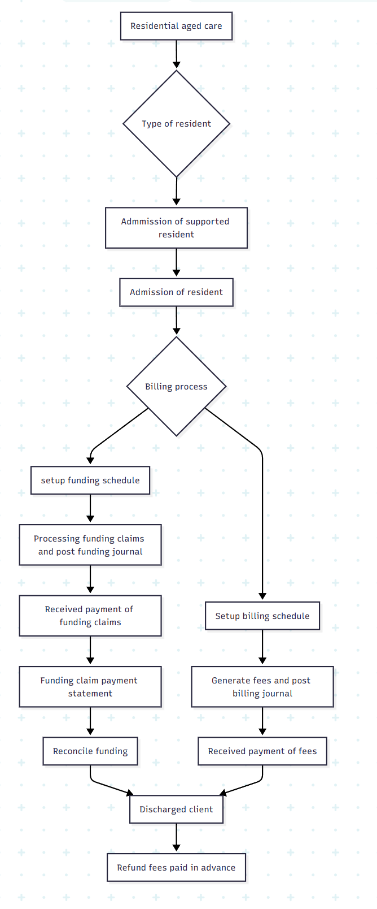
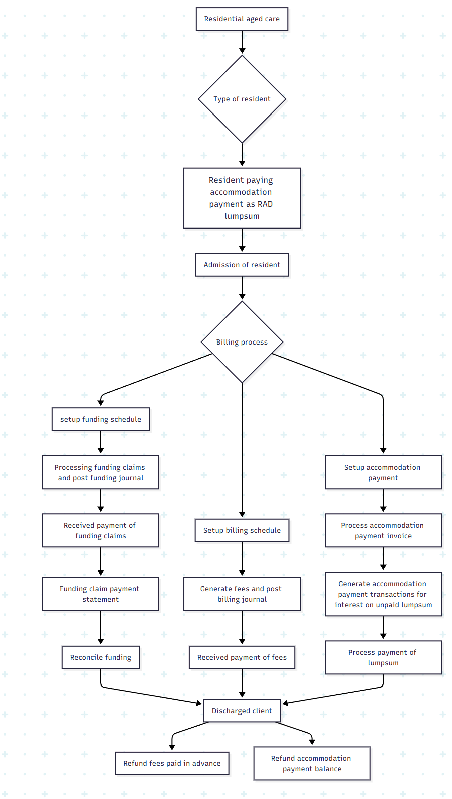
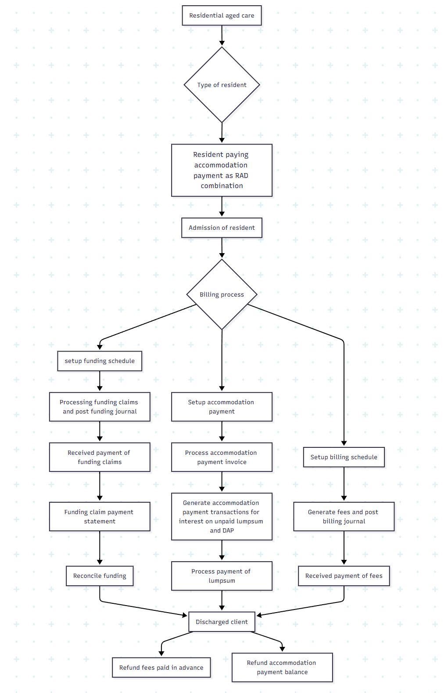
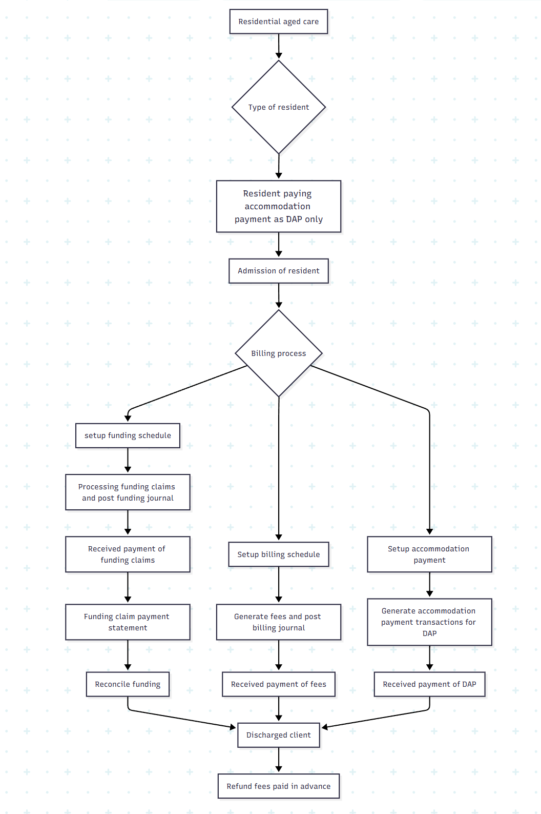
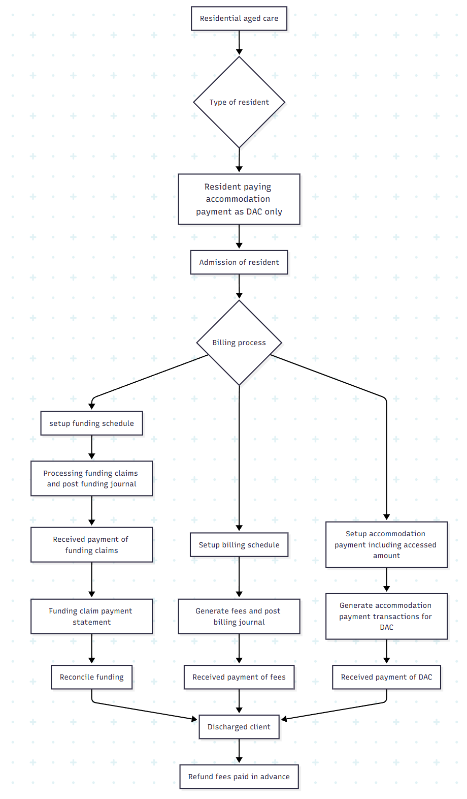
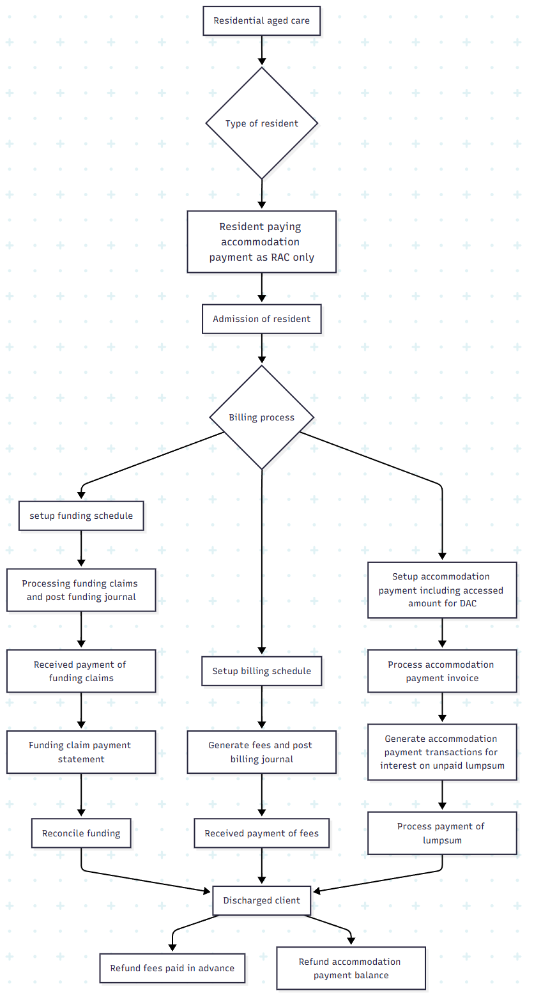

---
# required metadata

title: DXC Care services
Description: DXC Care Services Aged Care - Overview
author: Helen Ho
Manager: Pontus, Ek
ms.date: 2025-07-18
ms.topic: article
ms.prod: 
ms.service: dynamics-ax-applications
ms.technology: 

# optional metadata

ms.search.form: 
audience: Application User
# ms.devlang: 
ms.reviewer: Peter Musumeci 

# ms.tgt_pltfrm: 
ms.custom: ["21901", "intro-internal"]
ms.search.region: Global
# ms.search.industry: [leave blank for most, retail, public sector]
ms.author: Helen Ho
ms.search.validFrom: 2025-07-18
ms.dyn365.ops.version: 10.0.40
---

# Retirement living/Independent living
a)	Single person admitted to service apartment with rental only.
-	Admission, setup billing schedule, generate fees, payment of fees.
-	Discharged and refund any fees paid in advance.

b)	Partner admission, admitted to service apartment with rental only.
-	Setup billing schedule on primary partner.
-	Generate fees, payment of fees, discharged both partner and refund any fees paid in advance. 

c)	Partner admission to service apartment with primary partner transferring to residential aged care.
-	Setup billing schedule on primary partner.
-	Generate fees, payment of fees, 
-	Discharged primary partner and transfer billing schedule to second partner.   

d) Single person admitted to retirement village with an ingoing contribution.
-	Admission, setup billing schedule, and accommodation payment 
-	Generate fees, payment of fees
-	Create and post ingoing contribution invoice and payment of invoice.
-	Generate DMF and CRF.
-	Discharge 
-	Deduct unpaid fees from balance 
-	Refund ingoing contribution.

e) Single person admitted (with fees paid in advance) to retirement village with an ingoing contribution.
-	Admission, setup billing schedule, and accommodation payment 
-	Generate fees, payment of fees
-	Create and post ingoing contribution invoice and payment of invoice
-	Generate DMF and CRF
-	Discharge 
-	Refund fees paid in advance
-	Refund ingoing contribution

f) Partner admission to retirement village with an ingoing contribution.
-	Admission, setup billing schedule, and accommodation payment on primary partner.
-	Generate fees, payment of fees
-	Create and post ingoing contribution invoice and payment of invoice.
-	Generate DMF and CRF.
-	Discharge both partners.
-	Refunding ingoing contribution

g)	Partner admission to retirement village with an ingoing contribution primary partner transferring to residential aged care.
-	Admission, setup billing schedule, and accommodation payment on primary partner.
-	Generate fees, payment of fees
-	Create and post ingoing contribution invoice and payment of invoice.
-	Generate DMF and CRF.
-	Discharge primary partner.
-	Transfer billing schedule to second partner. 
-	Transfer ingoing contributions to second partner. 

h)	Partner admission to retirement village with an ingoing contribution second partner transferring to residential aged care.
-	Admission, setup billing schedule, and accommodation payment on primary partner.
-	Generate fees, payment of fees
-	Create and post ingoing contribution invoice and payment of invoice.
-	Generate DMF and CRF.
-	Discharge secondary partner.
-	Generate credit invoice for ingoing contributions to be used for the accommodation payment for the second partner in the residential aged care facility.

# Home care

a)	Intake of client with low income and asset
-	Add client and the service entry. 
-	Import /Integrate funding claims from the scheduling system.
-	Generate funding claims form
-	Post funding journal
-	Reconcile funding.
-	Discharge client

b)	Intake of client with high income and asset
-	Add client and the service entry. 
-	Import /Integrate billing transactions from the scheduling system
-	Generate billing invoices.
-	Post billing journal
-	Receive payment
-	Import /Integrate funding claims from the scheduling system
-	Generate funding claims form
-	Post funding journal
-	Reconcile funding.
-	Discharge client

# Residential aged care
a)	Admission of supported resident
-	Admission of resident,
-	Setup billing schedule
-	Setup Funding schedule
-	Generate fees and post billing journal
-	Processing funding claims and post funding journal
-	Receive payment of fees
-	Reconcile funding
-	Discharge client
-	Refund fees paid in advance.
 

 
b)	Admission of resident paying accommodation payment as RAD lumpsum
-	Admission of resident,
-	Setup billing schedule
-	Setup Funding schedule
-	Setup accommodation payment
-	Process accommodation payment invoice
-	Generate accommodation payment transactions for interest on unpaid lumpsum
-	Process payment of lumpsum
-	Generate fees and post billing journal
-	Processing funding claims and post funding journal
-	Receive payment of fees
-	Reconcile funding
-	Discharge client
-	Refund fees paid in advance.
-	Refund accommodation payment balance.

 

 

c)	Admission of resident paying accommodation payment as RAD/DAP combination
-	Admission of resident
-	Setup billing schedule
-	Setup Funding schedule
-	Setup accommodation payment
-	Process accommodation payment invoice
-	Generate accommodation payment transactions for interest on unpaid lumpsum and DAP
-	Process payment of lumpsum
-	Generate fees and post billing journal
-	Processing funding claims and post funding journal
-	Receive payment of fees
-	Reconcile funding
-	Discharge client
-	Refund fees paid in advance.
-	Refund accommodation payment balance.
 

 
d)	Admission of resident paying accommodation payment as DAP only
-	Admission of resident
-	Setup billing schedule
-	Setup Funding schedule
-	Setup accommodation payment
-	Generate accommodation payment transactions for DAP
-	Generate fees and post billing journal
-	Processing funding claims and post funding journal
-	Receive payment of fees
-	Reconcile funding
-	Discharge client
-	Refund fees paid in advance.
 

 

e)	Admission of resident paying accommodation payment as DAC only.
-	Admission of resident
-	Setup billing schedule
-	Setup Funding schedule
-	Setup accommodation payment including assessed amount
-	Generate accommodation payment transactions for DAC
-	Generate fees and post billing journal
-	Processing funding claims and post funding journal
-	Receive payment of fees
-	Reconcile funding
-	Discharge client
-	Refund fees paid in advance
 

 
f)	Admission of resident paying accommodation payment as RAC only.
-	Admission of resident,
-	Setup billing schedule
-	Setup Funding schedule
-	Setup accommodation payment including assessed amount for DAC
-	Process accommodation payment invoice
-	Generate accommodation payment transactions for interest on unpaid lumpsum
-	Process payment of lumpsum
-	Generate fees and post billing journal
-	Processing funding claims and post funding journal
-	Receive payment of fees
-	Reconcile funding
-	Discharge client
-	Refund fees paid in advance.
-	Refund accommodation payment balance.
 

 
g)	Admission of resident paying accommodation payment as RAC/DAC combination.
-	Admission of resident
-	Setup billing schedule
-	Setup Funding schedule
-	Setup accommodation payment including assessed amount for DAC
-	Process accommodation payment invoice
-	Generate accommodation payment transactions for interest on unpaid lumpsum and DAC
-	Process payment of lumpsum
-	Generate fees and post billing journal
-	Processing funding claims and post funding journal
-	Receive payment of fees
-	Reconcile funding
-	Discharge client
-	Refund fees paid in advance.
-	Refund accommodation payment balance.
 

 
  
h)	Admission of resident paying accommodation payment as RAD lumpsum with - fees drawn down.
-	Admission of resident,
-	Setup billing schedule and configure fees to be drawn down
-	Setup Funding schedule
-	Setup accommodation payment
-	Process accommodation payment invoice
-	Generate accommodation payment transactions for interest on unpaid lumpsum
-	Process payment of lumpsum
-	Generate fees and post billing journal
-	Processing funding claims and post funding journal
-	Receive payment of fees
-	Reconcile funding
-	Discharge client
-	Refund fees paid in advance.
-	Refund accommodation payment balance
 

 
i)	Admission of resident paying accommodation payment as RAD/DAP - combination with fees and DAP drawn down.
-	Admission of resident
-	Setup billing schedule
-	Setup Funding schedule
-	Setup accommodation payment and configure DAP to be drawn down
-	Process accommodation payment invoice
-	Generate accommodation payment transactions for interest on unpaid lumpsum and DAP
-	Process payment of lumpsum
-	Generate fees and post billing journal
-	Processing funding claims and post funding journal
-	Receive payment of fees
-	Reconcile funding
-	Discharge client
-	Refund fees paid in advance.
-	Refund accommodation payment balance.

j)	Admission of resident paying accommodation payment as RAC lumpsum with fees drawn down
-	Admission of resident,
-	Setup billing schedule and configure fees to be drawn down
-	Setup Funding schedule
-	Setup accommodation payment including assessed amount for DAC
-	Process accommodation payment invoice
-	Generate accommodation payment transactions for interest on unpaid lumpsum
-	Process payment of lumpsum
-	Generate fees and post billing journal
-	Processing funding claims and post funding journal
-	Receive payment of fees
-	Reconcile funding
-	Discharge client
-	Refund fees paid in advance.
-	Refund accommodation payment balance.

k)	Admission of resident paying accommodation payment as RAC/DAC combination with fees and DAC drawn down.

-	Admission of resident
-	Setup billing schedule and configure fees to be drawn down
-	Setup Funding schedule
-	Setup accommodation payment including assessed amount for DAC and drawn down of DAC
-	Process accommodation payment invoice
-	Generate accommodation payment transactions for interest on unpaid lumpsum
-	Process payment of lumpsum
-	Generate fees and post billing journal
-	Processing funding claims and post funding journal
-	Receive payment of fees
-	Reconcile funding
-	Discharge client
-	Refund fees paid in advance.
-	Refund accommodation payment balance

 
