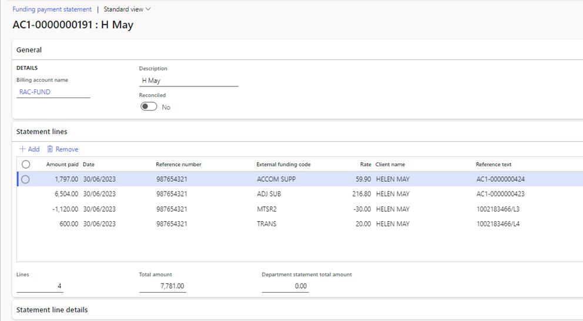
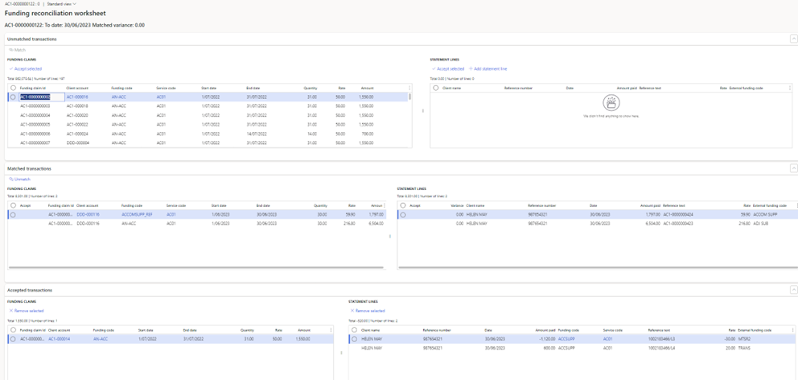

---
# required metadata

title: Care Services
Description: DXC Care Services/Aged Care - Release notes
author: HelenHo
Manager: Pontus, Ek
ms.date: 2025-06-19
ms.topic: article
ms.prod: 
ms.service: dynamics-ax-applications
ms.technology: 

# optional metadata

# ms.search.form:
audience: Application User
# ms.devlang: 
ms.reviewer: Peter Musumeci

# ms.tgt_pltfrm: 
# ms.custom: ["21901", "intro-internal"]
ms.search.region: Health, Care, Aged Care, Care Services
# ms.search.industry: [leave blank for most, retail, public sector]
ms.author: Peter Musumeci
ms.search.validFrom: 2025-06-19
ms.dyn365.ops.version: 10.0.40
---

# Funding

-   Funding is the most common income for Care services providers.
-   Transactions related to funding will not appear in the Customer transactions form because they are not related to the customer balance.
-   Funding claims for Community and Disability service providers can be imported via the data migration framework.
-   The funding claims for residential Care services providers will be generated from the residents’ funding schedules.
-   The Funding claim form will group all relevant funding claims to generate the funding claim file.

### Generate funding claims

**Path: Care services > Funding > Generate Funding Claims**

1.  Populate the End date.
2.  Click on **\<Filter\>**
3.  Specify the required criteria for generating the funding claims (Service code or client account)
4.  Click **\<OK\>**
5.  *If required, setup the job to run in the background. Select Batch processing to Yes.*
6.  *Click on \<Recurrence\>*
7.  *The default value is for the job to run once (End after:1) If it is a requirement for the job to run at a regular interval, then setup up the required recurrence pattern.*
8.  *Click \<OK\> to close the Recurrence form.*
9.  *Click \<OK\> to add the job to the batch queue.*
10. The relevant funding claims will be generated with the Document status = Open

### Generate funding claim form

**Path: Care services > Funding > Funding Claim form**

1.  Click on **\<New funding claim form\>**
2.  Select Billing account name.
3.  Click on **\<Filter\>**
4.  Specify the required criteria for generating the funding claim form (End date, client account)
5.  Click **\<OK\>**
6.  *If required, setup the job to run in the background. Select Batch processing to Yes.*
7.  *Click on \<Recurrence\>*
8.  *The default value is for the job to run once (End after:1) If it is a requirement for the job to run at a regular interval, then setup up the required recurrence pattern.*
9.  *Click \<OK\> to close the Recurrence form.*
10. *Click <OK> to add the job to the batch queue.*
11. The funding claim form will be generated with all the relevant funding claims.
12. Populate the description, claim year, and claim month.

### Generate funding claim form file

**Path: Care services > Funding > Funding Claim form**

1.  Select the relevant funding claim form.
2.  Validate the data on the funding claim form lines.
3.  Click on **\<Generate funding claim form file\>**
4.  Click **\<OK\>**
5.  The file will be generated for the relevant billing account type.

### Generate funding journal

**Path: Care services > Funding > Funding Claim form**

**OR**

**Care services > Funding > Generate funding journals**

1.  Select the relevant funding claim form.
2.  Validate the data on the funding claim form lines.
3.  Click on **\<Generate funding journal\>**
4.  Populate Transaction date.
5.  Click **\<OK\>**
6.  *If required, setup the job to run in the background. Select Batch processing to Yes.*
7.  *Click on \<Recurrence\>*
8.  *The default value is for the job to run once (End after:1) If it is a requirement for the job to run at a regular interval, then setup up the required recurrence pattern.*
9.  *Click \<OK\> to close the Recurrence form.*
10. *Click \<OK\> to add the job to the batch queue.*
11. The funding journal will be generated.

### Review and post funding journal

**Path: Care services > Funding > Journals > Funding journal**

1.  Select the relevant funding journal.
2.  Click on **\<Lines\>**
3.  Validate the data on the funding journal lines.
4.  Click on **\<Post\>** to post the journal.

### Import funding claim payment statement

Payment statements must be downloaded from PRODA Care services Online Services (in a CSV format)

**Path: Care services > Funding > Funding claim payment statement**

1.  Click on **\<New\>**
2.  Select **\<Billing account name\>**
3.  Click on **\<Import statement\>**
4.  Click on **\<Browse\>** to browse and select the required payment statement file for import.
5.  Click **\<Upload\>**
6.  Click **\<OK\>**
7.  Click on the **‘Refresh**’ button in the top right corner to refresh the form.
8.  The statement lines will display.

****
**Funding payment statement**

### Funding reconciliation

**Path: Care services > Funding > Funding reconciliation**

1.  Click on **\<New\>**
2.  Select **\<Billing account name\>**
3.  Select **\<Funding payment statement id\>**
4.  Populate the **Department service ID.**
5.  Populate the **To date.**
6.  Click **\<OK\>**
7.  Select **\<Worksheet\>** to open the Funding Reconciliation worksheet.
8.  The worksheet is divided into three sections:
    -   **Unmatched transactions**

        The unmatched transactions are vertically split between ledger transactions originating from the Funding journals (left) and imported transactions from the imported statement (right).

    -   **Matched transactions**

        The matched transactions section displays all transactions that have been manually matched or matched via the matching rules.

    -   **Accepted transactions.**

        The accepted transactions section displays all transactions that have been accepted. These are payments on the payment statement that were not on the claim.

9.  Select \<**Run matching rules**\> to match Funding claims with the Statement line.
10. Transactions that were matched successfully will be transferred to the “Matched transactions” section.
11. Select \<**Match**\> to manually match funding claims with statement lines. Any variances in the amounts will automatically create adjustment transactions.
12. Select \<**Accept selected**\> on the **Funding claims** to accept that a funding claim will not be paid. There will be an automatic adjustment transaction created.
13. Select \<**Accept selected**\> on the **Statement lines** to accept a payment that was not on the Funding claim. There will be an automatic adjustment transaction created.
14. Select \<**Add Statement Line**\> to add an amount that has been paid but was not on the Funding Claim. There will be an automatic adjustment transaction created.
15. Any unmatched funding claims will carry across to the subsequent month’s funding claim and will be available for matching when the payment has been received on the payment statement.
16. Close the worksheet when all relevant transactions have been matched.
17. Select \<**Post and Reconcile**\> to generate a Funding Reconciliation Journal

****

### Review and post Funding reconciliation journal

**Path: Care services > Funding > Journals > Funding reconciliation journal**

1.  Select the relevant journal.
2.  Click on **\<Lines\>**
3.  The journal lines from the matched transactions in the Funding reconciliation worksheet will be generated.
4.  There will be journal lines for the adjustment transactions in the Funding reconciliation worksheet.
5.  Validate and post the journal.
