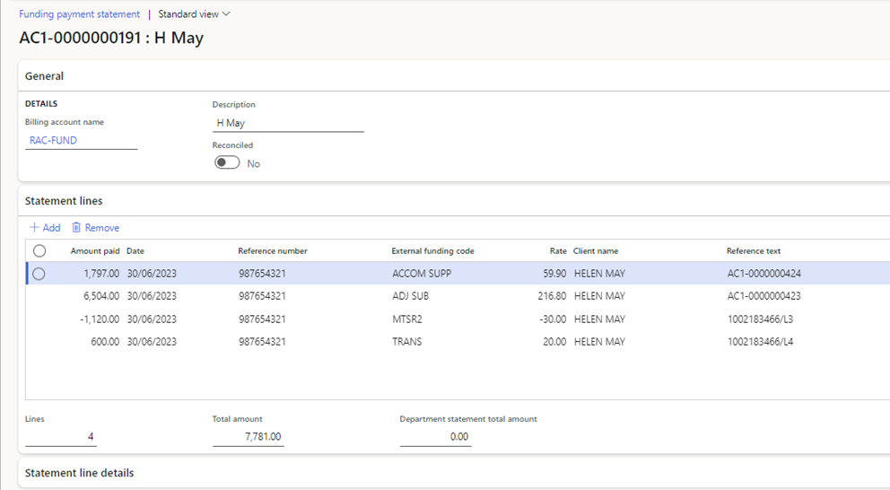

---
# required metadata

title: Care Services
Description: DXC Care Services/Aged Care - Release notes
author: HelenHo
Manager: Pontus, Ek
ms.date: 2025-06-19
ms.topic: article
ms.prod: 
ms.service: dynamics-ax-applications
ms.technology: 

# optional metadata

# ms.search.form:
audience: Application User
# ms.devlang: 
ms.reviewer: Peter Musumeci

# ms.tgt_pltfrm: 
# ms.custom: ["21901", "intro-internal"]
ms.search.region: Health, Care, Aged Care, Care Services
# ms.search.industry: [leave blank for most, retail, public sector]
ms.author: Peter Musumeci
ms.search.validFrom: 2025-06-19
ms.dyn365.ops.version: 10.0.40
---

### Import funding claim payment statement

Payment statements must be downloaded from PRODA Care services Online Services (in a CSV format)

**Path: Care services > Funding > Funding claim payment statement**

1.  Click on **<New>**
2.  Select **<Billing account name>**
3.  Click on **<Import statement>**
4.  Click on **<Browse>** to browse and select the required payment statement file for import.
5.  Click **<Upload>**
6.  Click **<OK>**
7.  Click on the **‘Refresh**’ button in the top right corner to refresh the form.
8.  The statement lines will display.

****
