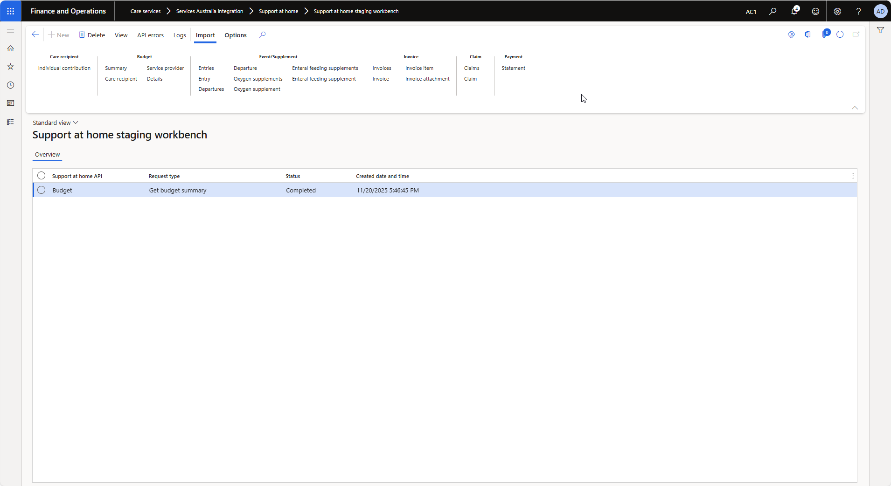
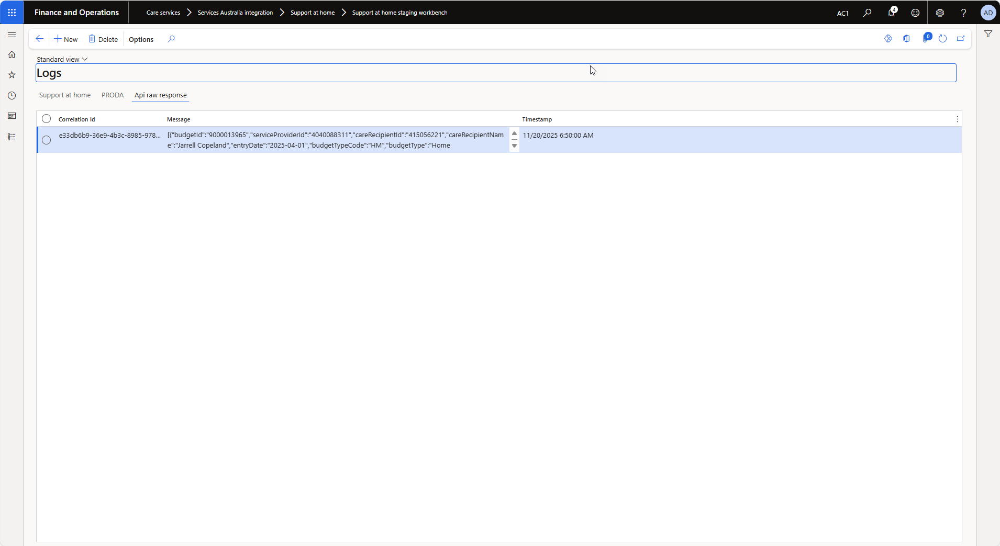

---
# required metadata

title: DXC Care services API Suite Support at Home Workbench
description: Services Australia Support at Home Staging  Workbench
author: Artika Dutt
Manager: Pontus Ek
ms.date: 2025-11-19
ms.topic: article
ms.prod: 
ms.service: dynamics-ax-applications
ms.technology: 

# optional metadata

ms.search.form: 
audience: Application User
# ms.devlang: 
ms.reviewer: Artika Dutt

# ms.tgt_pltfrm: 
ms.custom: ["21901", "intro-internal"]
ms.search.region: Global
# ms.search.industry: [leave blank for most, retail, public sector]
ms.author: Artika Dutt
ms.search.validFrom: 2025-11-19
ms.dyn365.ops.version: AX 7.0.1
---

# Care services API Suite     Services Australia Support at Home Staging Workbench
The Support at Home Staging Workbench provides a unified interface for managing API integration activities, including:
- Viewing staging records
- Monitoring API errors and responses
- Accessing comprehensive integration logs
- Performing data import jobs

## View
Displays the selected records staging data

Example:
Budget summary

   
## API Errors
Displays any errors returned by the API service.

Example: Invalid entry search

## Logs
Displays comprehensive logs for tracking for any request selected.

API execution logs

PRODA authentication logs

RAW response received from API service

## Import
Allows execution of the import jobs. 

Example: Budget summary
