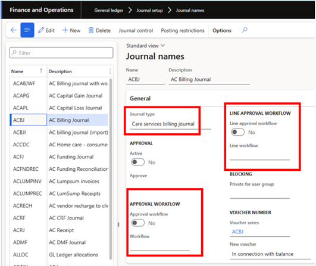
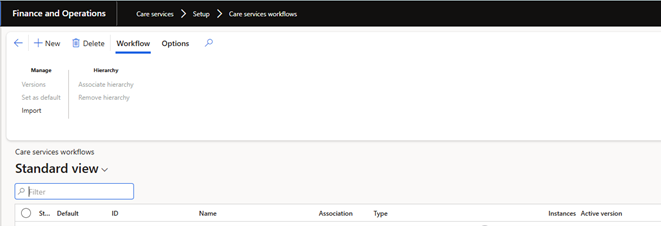
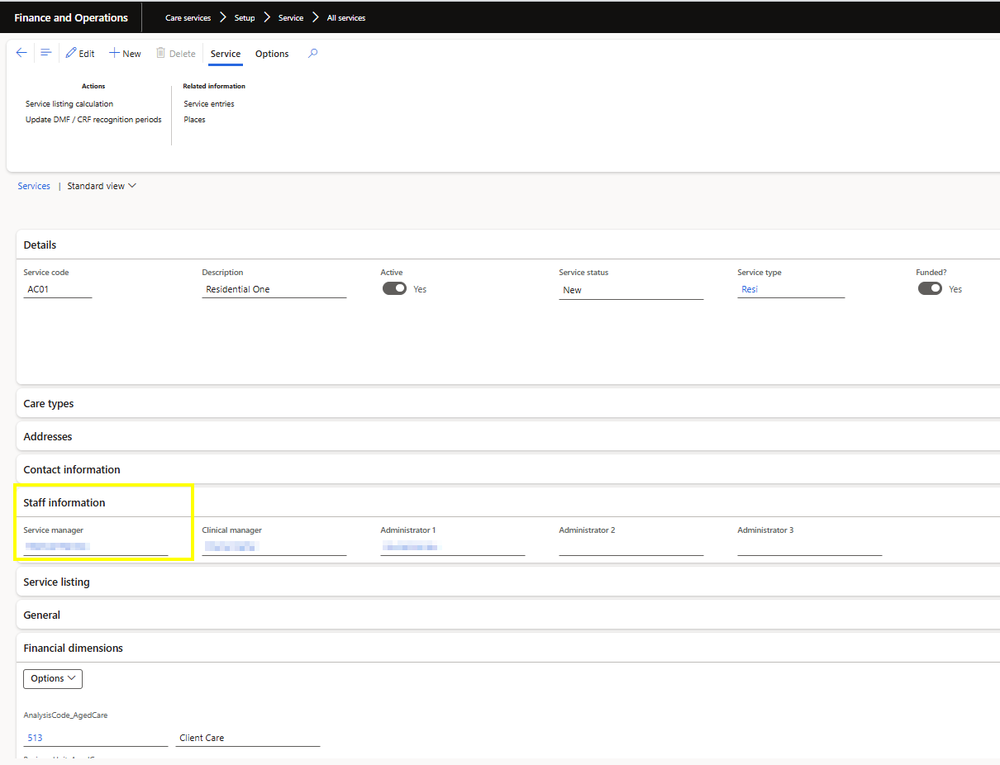

---
# required metadata

title: DXC Care Services 
description: Care Services Workflows
author: Peter Musumeci 
Manager: Pontus Ek
ms.date: 2025-03-31
ms.topic: article
ms.prod: 
ms.service: dynamics-ax-applications
ms.technology: 

# optional metadata

ms.search.form: 
audience: Application User
# ms.devlang: 
ms.reviewer: Peter Musumeci 

# ms.tgt_pltfrm: 
ms.custom: ["21901", "intro-internal"]
ms.search.region: Global
# ms.search.industry: [leave blank for most, retail, public sector]
ms.author: Peter Musumeci
ms.search.validFrom: 2025-03-31
ms.dyn365.ops.version: 365 FSCM
---

# Care Services Workflows

For general information on Dynamics 365 workflows, refer to 

[Create Workflow overview](https://learn.microsoft.com/en-us/dynamics365/fin-ops-core/fin-ops/organization-administration/create-workflow) 
[Workflow system overview](https://learn.microsoft.com/en-us/dynamics365/fin-ops-core/fin-ops/organization-administration/overview-workflow-system)

## Billing Journal Workflow

Navigate to:  **Care Services > Journals > Billing journal**

Care Services Billing Journal Workflow Activation. Navigate to:  **General Ledger > Journal setup > Journal names**

Navigate to the Journal Type Care Services Billing Journal.  Subsequently, you can select Line approval or Header approval ("Approval Workflow")

****

When the Approval Workflow toggle is set to Yes, the Approval Workflow button will be available on the Billing journal.  

When the Line Approval Workflow toggle is set to Yes, the Line Approval Workflow button will be available on the Billing journal

*Note* While a journal has an incomplete Line Approval Workflow process, the billing journal will not be available for posting, and the "Approval Workflow" (Header level) cannot be initiated. Disable the Header Workflow process if there is an active Line Approval Workflow, and complete before initiating the Header workflow.

## Create/Maintain Workflow

Navigate to:  **Care Services > Setup > Care Services Workflows**

****

**Workflow type**         | **Description**         
:-----            |:------------------------  
Aged care billing journal                  | Use this type to create approval workflows for billing journals  |
Aged care billing journal lines          | Use this type to create approval workflows for billing journal lines |

## Workflow Elements

**Workflow Area**         | **Workflow Element**         | **details** 
:----------------------            |:------------------------  |:------------------------  
Billing Journal |Approvals > Approve Billing Journal|Use this element to approve the Billing Journal.
Billing Journal |Approvals > Approve Billing Journal, editable|Use this element to approve the Billing Journal. The assigned approver will be able to edit the Billing Journal lines.
Billing Journal |Automated tasks > Auto post Billing Journal|Use this element to post the Billing Journal automatically.
Billing Journal |Flow controls > Conditional decision|A conditional decision is a point at which a workflow divides into two branches. The system will decide which branch is used under specified conditions. 
Billing Journal |Flow controls > Manual decision|A manual decision is a point at which a workflow divides into two branches. A user must decide which branch is used. 
Billing Journal |Flow controls > Parallel activity|A parallel activity is a workflow element that includes two or more workflow branches that run at the same time.
Billing Journal |Flow controls > Subworkflow|A subworkflow is a workflow that runs within the context of another workflow. 
Billing Journal |Line item workflows > Billing Journal line|Use this type to create billing line approvals for the Billing Journals.
Billing Journal |Tasks > Import Billing Journal lines, editable|Use this element to import Billing Journal lines manually.  *Note:* This approval task allows editing and can only be done by the person who is designated as the owner of that task.
Billing Journal Line |Approvals > Approve Billing Journal line|Use this element to approve the Billing Journal line. 
Billing Journal Line |Approvals > Approve Billing Journal line, editable|Use this element to approve the Billing Journal line. The assigned approver will be able to edit the Billing journal lines.
Billing Journal Line |Flow controls > Conditional decision|A conditional decision is a point at which a workflow divides into two branches. The system will decide which branch is used under specified conditions. 
Billing Journal Line |Flow controls > Manual decision|A manual decision is a point at which a workflow divides into two branches. A user must decide which branch is used. 
Billing Journal Line |Flow controls > Parallel activity|A parallel activity is a workflow element that includes two or more workflow branches that run at the same time.
Billing Journal Line |Flow controls > Subworkflow|A subworkflow is a workflow that runs within the context of another workflow. 

## Assignment types 

**Assignment Type**         | **Users that the approval step is assigned to**            
:-----            |:------------------------  
Participant|Users who are assigned to a specific group or role|
Workflow user|Users in the current workflow|
User|Specific users|
Hierarchy|Users in a specific organisational hierarchy|

In addition to the standard assignment types above, there is a  Special consideration for hierarchy.. 

**Type of Hierarchy**         | **Description** 
:-----            |:------------------------  
Service manager hierarchy| Use to retrieve users assigned on   Care services > Setup > All Services > Staff information > Service manager

This option is only available for the Journal level (Header) approval workflow, and looks at: 
1.	The service code on the first line of the journal
2.	Look up that service code and find the "Service manager" Navigation  **Care services > Setup > All Services > Staff information > Service manager**
3.	First approver selected is the Service manager identified above
4.	Apply the Hierarchy approvals for the Service manager identified on that service code

****

*Example*
Service code on first journal line is AC01 
Service Manager for AC01 is Mary Walker  
First Approver is Mary Walker (skip this if they are the initiator). If it is over the user's approval limit, proceed to the next in hierarchy.  
Second Approver is Mary Walker’s direct supervisor in the hierarchy, but it is over her approval limit, so  proceed to the next in the hierarchy. 
The third approver is Mary Walker’s direct supervisor’s direct Manager in the hierarchy, and it is within her approval limit, so it is fully approved and can be posted. 
