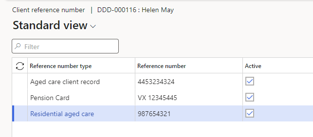
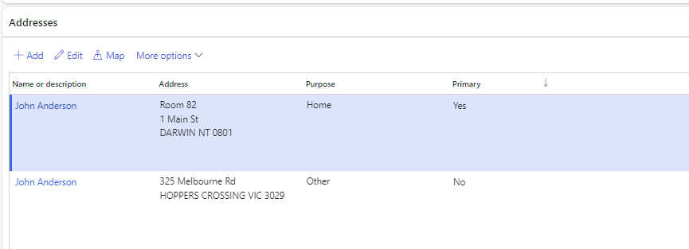
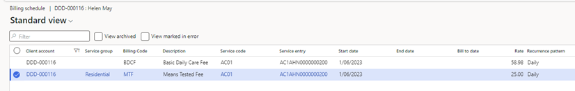
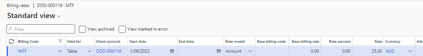
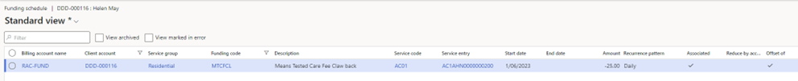
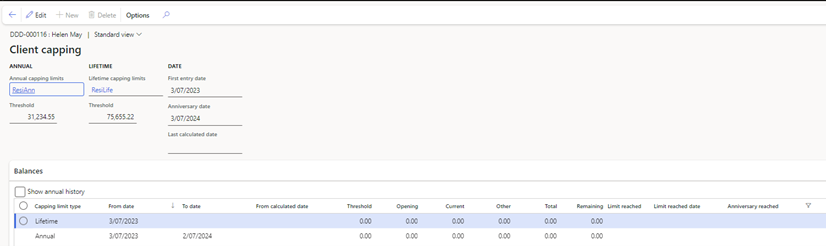
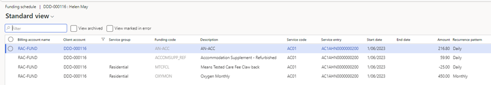
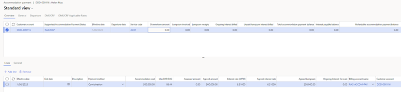

---
# required metadata

title: DXC Care services 
description: Care Services Customer and Client Management
author: Peter Musumeci 
Manager: Pontus Ek
ms.date: 2025-03-31
ms.topic: article
ms.prod: 
ms.service: dynamics-ax-applications
ms.technology: 

# optional metadata

ms.search.form: 
audience: Application User
# ms.devlang: 
ms.reviewer: Peter Musumeci 

# ms.tgt_pltfrm: 
ms.custom: ["21901", "intro-internal"]
ms.search.region: Global
# ms.search.industry: [leave blank for most, retail, public sector]
ms.author: Liam Coll
ms.search.validFrom: 2025-03-31
ms.dyn365.ops.version: AX 7.0.1
---

# Care services  Customer and Client Management
-   Client admissions, departures, and transfers are managed using the client service entry details.
-   Clients can have multiple contacts, including address, contact details and relationship type(s).
-   The financial setup includes the Customer's bank account, the preferred payment method, billing, accommodation payment and funding.
-   Customer organisations such as NDIS Plan Manager or DVA (Department of Veterans’ Affairs) are set up for third-party billing.

## New Organisation Customer (for third-party billing)
Customer organisations such as an NDIS Plan Manager or DVA (Department of Veterans’ Affairs) are set up for third-party billing. Organisations cannot have a service entry. 

Navigate to: **Care services > All customers**
1.  Click on **New**
2.  **Type** - Select **Organisation** from the Type
3.  Name - Populate the organisation name.
4.  **Customer group** - Select the relevant customer group.
5.  **Terms of payment** – Enter the organisation’s payment terms
6.  **ABN** – Enter the ABN,  if an ABN record has been created in D365 for this organisation, otherwise it can be entered later  
    **Address Tab**
7.  **Add or Edit addresses**—Select Add or Edit as required, and a pop-up window will be displayed. Multiple addresses can be stored for each organisation's customer for different purposes.
8.  **Name or Description** – This does not print when an address is used in reports, invoices, statements etc. Enter a name to be associated with this address or a description of the type of address it is, such as Office address, Postal address etc. The purpose can also be used for this type of function
9.  **Purpose** – Select the purpose(s) for the address. The purpose is a field that can be customised by any organisation so that tailored purposes can be created to suit the organisation’s needs. Ensure you select the purpose based on what the address should be used for. Eg. Invoice is the purpose that is usually used for the address that should appear on the invoice, Statement might also be used if this has a separate address
10. **Address fields** – Enter the address into the appropriate fields. City and postcode verification is available.
11. **Primary** – Select if this is to be the main address for the organisation customer, can only be the 1 Primary address  
    **Contact information tab**
12. **Add Phone or Email address** – select **Add** and a new line will appear in the grid  
    **Description** - Enter a description of the contact such as Care Co-ordinator, Accounts payable or anything useful/recognisable.   
    **Type** - Select the Type, phone or email etc.  
    **Contact number/address** - Enter the phone number or email address etc.  
    **Primary** – Tick if this is the primary record for that Contact Type. There can only be one Primary for each Type of contact, ie. You can add multiple phone numbers however, only 1 can be primary, but a customer can have both a primary email and a primary phone etc.
13. **Add Purpose to contact information** – Select the record the purpose is to be added to, then select **Advanced** and a popup window will be displayed. Select the required Purpose(s) and select **OK**  
    **Payment defaults tab**
14. **Terms of payment** – Select the terms of payment for this customer record
15. **Method of payment** – Select the method of payment. If the method of payment is a direct debit method, ensure that the bank account is also set up.
16. Click **Save** to add the new customer.

## Add a new client

Navigate to: **Care services > All customers**

1.  Click on **New** and a pop-up window will be displayed for entering the customer details
2.  **Type** - Select **‘Person’** for anyone who will be receiving services
3.  **First name** - Enter the first name.
4.  **Middle name** – Optional to enter the Middle name
5.  **Last name** – Enter the surname or family name
6.  **Customer group** - Select the relevant customer group for this client. This can be edited later if a customer’s service provision changes
7.  **Terms of payment** – Enter the client’s payment terms
8.  **Address**—If the client is responsible for paying bills, enter the address to which invoices will be sent. Other Addresses can be added after the customer account has been created.
9.  **Contact information** – Enter the contact information, telephone and email, for the client or the nominated account receiver. Other Contact information can be added after the customer account has been created.
10. Click **Save** to add the new client.
11. Click on the new **Customer account id** to open the customer account record.  
    **General Tab**
12. **Name details** – Add any titles and Known as (Preferred name)
13. **Personal information** - Enter any other details such as gender, birth date and marital status.
14. **Care services** – Select the customer’s statement preference (Mail or Email). If they prefer a different name on their statements, eg. Instead of James Smith it might be preferred to have Mr & Mrs Smith, enter this in the Customer statement name. This is most commonly used for independent living and   
    Select the Carer status if that is relevant to the client
15. **HCP** - Set to yes if the client has a home care package and requires the Home care unspent amount to be calculated by the system  
    **Address Tab**
16. **Add or Edit addresses** – Select Add or Edit as required and a pop-up window will be displayed. Multiple addresses can be stored for each client with different purposes.
17. **Name or Description** – This does not print when an address is used in reports, invoices, statements etc. Enter a name to be associated with this address or a description of the type of address it is such as Home address, service delivery address, carer address etc. The purpose can also be used for this type of function
18. **Purpose** – Select the purpose(s) for the address. The purpose is a field that can be customised by any organisation so that tailored purposes can be created to suit the organisation’s needs so ensure you select the purpose based on what that address should be used for. Eg. Invoice is the purpose that is usually used for the address that should appear on the invoice, Service or Home might be used for clients who receive home care services to show which address is used by the client when they receive services
19. **Address fields** – Enter the address into the appropriate fields. City and postcode verification is available.
20. **Primary** – Select if this is expected to be the main address for the client. Each client can have only 1 Primary address  
    **Contact information**
21. **Add Phone or Email address** – select **Add** and a new line will appear in the grid  
    **Description** - Enter a description of the contact such as Care Co-ordinator, Accounts payable or anything useful/recognisable.  
    **Type** - Select the Type, phone or email etc.  
    **Contact number/address** - Enter the phone number or email address etc.  
    **Primary** – Tick if this is the primary record for that Contact Type. There can only be one Primary for each Type of contact, ie. You can add multiple phone numbers however only 1 can be primary, but a customer can have both a primary email and a primary phone etc.
22. **Add Purpose to contact information** – Select the record the purpose is to be added to, then select **Advanced** and a popup window will be displayed. Select the required Purpose(s) and select **OK**  
    **Payment defaults**
23. **Terms of payment** – Select the terms of payment for this customer record
24. **Method of payment** – Select the method of payment. If the method of payment is a direct debit method ensure that the bank account is also setup.
25. **Direct debit limit** – If there is a maximum amount for the customer to have debited from their account enter that amount in here.
26. **Enable Pre-set direct debit amount** – Set to Yes if a set amount is to be debited from the customer’s account even if they don’t owe that much. This functionality is generally used for clients who want a set amount taken out of their account every pension day so it is a consistent amount every fortnight throughout the year. If this functionality is to be used also enter the set amount in the **Pre-set direct debit amount.**

## Client Bank account and method of payment

-   Customers can have multiple bank accounts however only one can be set up as a direct debit bank account at a time.
-   When transactions are generated, they are tagged with the method of payment and bank account selected on the customer account at the time.
-   If a customer changes their bank account, then the existing bank account record can be edited. The bank account record name will remain the same, so the new BSB and account number will be used when generating the ABA file. Note that using this method, historical bank records will not be available for the customer
-   If a new bank account record is created and then selected on the customer record, then only new transactions will be tagged with that bank account. Any existing transactions will still be tagged with the original bank account and payment method. There is a process in the direct debit processing to update the bank account and the payment method for the existing transactions, however, these differences in the updating of the bank account records should be considered when deciding which update method to use.

Navigate to: **Care services > All customers > Customer**

1.  Select the client the bank account is being set up for
2.  Select **Setup > Bank accounts** from the ribbon at the top.
3.  Click **New**
4.  **Bank account**  - Enter a code for the bank account eg. BANK, MAIN, FIRST etc.
5.  **Name** – Enter the bank account name
6.  **Bank account number** – Enter the bank account number
7.  **BSB number** – Enter the BSB number
8.  Click on **Save** to save the bank account details.
9.  Open the client details to select the relevant bank account in **Customer > Payment defaults > Bank account**
10. Select the preferred method of payment in **Customer > Payment defaults > Method of payment**

## Client Contacts

Navigate to: **Care services > All customers > Customer > Contacts**

1.  Select **View contacts** if you want to view or edit the existing contacts
2.  To add a new contact select **Add contacts**
3.  Populate the relevant name details and any other details under the General tab  
    **Contact additional information tab**
4.  **Contact type** - Select all of the relevant contact types (e.g., wife, next-of-kin)
5.  **Contact Priority** - Select Contact Priority - Primary, Secondary or Do not contact
6.  Relationship type - Select Relationship type – None, Personal or Non-personal
7.  Account receiver – If the contact is to receive a copy of the customer statement set this to Yes
8.  Statement preference - If the Account receiver is set to yes select the statement preference to Email or Mail. Email is recommended as the statement generated will be a copy of the statement sent to the customer and will have the same mailing address on it so the copy cannot be sent in a window face envelope.  
    **Address Tab**
9.  **Add or Edit addresses** – Select Add or Edit as required and a pop-up window will be displayed. Multiple addresses can be stored for each client with different purposes.
10. **Name or Description** – This does not print when an address is used in reports, invoices, statements etc. Enter a name to be associated with this address or a description of the type of address it is such as Home address, service delivery address, carer address etc. The purpose can also be used for this type of function
11. **Purpose** – Select the purpose(s) for the address. The purpose is a field that can be customised by any organisation so that tailored purposes can be created to suit the organisation’s needs so ensure you select the purpose based on what that address should be used for. Eg. Invoice is the purpose that is usually used for the address that should appear on the invoice, Service or Home might be used for clients who receive home care services to show which address is used by the client when they receive services
12. **Address fields** – Enter the address into the appropriate fields. City and postcode verification is available.
13. **Primary** – Select if this is expected to be the main address for the client. Each client can have only 1 Primary address  
    **Contact information**
14. **Add Phone or Email address** – select **Add** and a new line will appear in the grid  
    **Description** - Enter a description of the contact such as Daughter – Susan or anything useful  
    **Type** - Select the Type, phone or email etc.  
    **Contact number/address** - Enter the phone number or email address etc.  
    **Primary** – Tick if this is the primary record for that Contact Type. There can only be one Primary for each Type of contact, ie. You can add multiple phone numbers however only 1 can be primary, but a customer can have both a primary email and a primary phone etc.
15. **Add Purpose to contact information** – Select the record the purpose is to be added to, then select **Advanced** and a popup window will be displayed. Select the required Purpose(s) and select **OK**
16. Save and close.
17. Click on the **New** button to add additional contacts.

### Client Reference numbers

Clients can have multiple reference numbers such as Pension number or Care services client record

Navigate to: **Care services > All customers > Customer > Setup > Client reference number**

1.  Select **New**
2.  **Reference number type** - Select the Reference number type.
3.  **Reference number** - Populate the number.
4.  Select the **‘Active’** check box.
5.  Repeat the process to add additional reference numbers.

*Client reference number*

### Admit the client to a service
A client’s service entry tells us about the client’s journey within the organisation and when they were receiving care. The service entry will show which areas of the organisation were providing that care and whether they are continuing to receive that care. A client may have only 1 service entry, or they may have several as they have utilised different service offerings of the organisation. Eg. A client may have a service entry for a retirement village, then they add a home care package to that, and they might also require respite care after an incident.  They may have all three of these service entries active at the same time.

  Navigate to: **Care services > All customers > Care services**
1.  Click on **New  Service entry**
2.  Care type – Select the type of care or service being provided, eg. Permanent residential care, Home care etc.
3.  Service - Select the service that will be the main provider of that care type
4.  Place – The place is the room, apartment, unit etc. where the client will be residing. Place is usually not required for community-based care, though this is optional
5.  Funded – This toggle will default to the setting on the service, however, it can be edited as required. Eg. A service may usually provide funded care so the default is funded, however, there may also be some private, unfunded clients at this service, so the flag should be set to No for these clients.
6.  Supported/accommodation payment status - Select the relevant Supported/accommodation payment status for this client. This can be edited at any time so if you’re not sure of the status you can select the most likely one at this stage and edit it later if necessary.
7.  Entry date – Enter the actual date of arrival or the commencement of the service agreement.
8.  Billing start date – The billing start date will default to the entry date, however, this can be edited if a different start date is agreed to. Eg if a room has been held for a client they may be billed for a few days before their entry date
9.  ‘Care before 01/07/2014 - Defaults to No, however, select ‘Care before 01/07/2014?’ if the client’s original admission to Care services is before 1st July 2014
10. Subject to new means testing – Defaults to Yes, however, this should be set to no for clients who were first admitted to Care services before 01/07/2014 and have not opted into the post 1/7/2014 means tested fee system
11. Initial & Departure capacity – This is for STRC clients, enter the initial capacity score at the time of entry
12. Acer required – set to yes if a Care Services entry record is required to be generated for uploading to the Care Services portal
13. Departure event required - set to yes if a Care Services departure event record is required to be generated for uploading to the Care Services portal when the client departs
14. Click on **Save** to admit the client. 
    Place address transfer – if the prospect options in D365 are used for waitlist purposes prior to a client entering the service and the service record has place address transfer enabled this feature will automatically update the client address on their customer record to the address of the place they are now entering.
15. The room (place) address will automatically be generated as the primary address for the resident with the purpose = Home. This purpose is set up in the Care services parameters so will default to whatever the organisation has selected there. This default can be edited.
16. The previous home address from when they were on the waitlist will be retained, however, the purpose type will be changed to ‘Other’. This purpose is set up in the Care services parameters so will default to whatever the organisation has selected there. This default can be edited.

*Client addresses*

### Admit partners in Independent Living

Navigate to: **Care services  All customers**

-   Independent living often includes multiple clients residing in the same place, eg apartment, unit, townhouse etc
-   The system allows for any number of clients in the same place, and they share a service entry providing the service has the “Allow Partnered” toggle set to Yes on the service record.
-   The partnered tab on the service entry records the partner client(s).
-   If the partner client leaves the service, the departure can also be recorded there.
-   If the Primary client leaves the partner client can be switched to the Primary and all the setup and history is retained.
1.  Create a new client account for the Partner as per previous instructions for client accounts (do not add a service entry)
2.  Go to **Care services  Customers  All customers**
3.  Select the Primary client from the client list
4.  Click on **Care services  Related information  Service entries**
5.  If the Primary client does not already have a service entry for the shared place add a service entry as per above instructions
6.  Open the Primary client service entry  
    **Identification tab**
7.  **Partnered toggle** – Set to Yes to enable the partner ta
8.  **Partnered tab –** Click on Add line
9.  **Customer account** - Select the Partner client
10. The remaining fields will default from the General tab
11. **Entry date** – this will default from the General tab however it can be edited if the partner did not arrive on the same date as the Primary client.
12. Click on **Save**
13. Repeat from the Partnered tab onwards to add any further clients residing in the same place

### Client billing schedule

-   The billing schedule allows the user to set a list of fees and charges that occur on a regular basis.
-   Fees applicable for most clients are set up in a schedule template and attached to the relevant care types. Upon entry, the client’s billing schedule lines will automatically be generated
-   Client-specific fees and rates are added to the client billing schedule and any lines that are not applicable to a client can be removed
-   Fees setup with a funding offset amount (such as Means Tested Fee Clawback) will automatically generate the funding reduction in the Funding schedule.

Navigate to: **Care services  All customers  Invoice Setup  Billing schedule/Funding Schedule**

1.  **Review** the automatically generated lines
2.  **Delete a line** – If any lines do not apply to this client select the line to be deleted then click Mark as created in error. When all unwanted lines have been marked as created in error, tick the view marked in error. The lines that were marked created in error will be displayed, select all lines and click Delete. Untick the View marked in error to return to the billing schedule
3.  **Add a Billing schedule line** - Select **New** to add a new line. A new line is created.
4.  **Service group** - Select relevant Service group. Service groups are set up by the organisation and are designed so that users will see only the billing codes that relate to a particular client. Eg. If an organisation offers a package of services at some of their locations only, a service group would be created that includes the package and the users would select that service group here.
5.  **Billing Code** – select the relevant billing code, only billing codes listed on that service group will be visible.
6.  **Service code** – Select the service code where the services will be provided. Eg At a co-located site any fees related to a retirement village would have the retirement village service code, however, if the care facility provided Allied Health services on a weekly basis then the service code for that line would be the care facility service code.
7.  **Start date** – Enter the first date that should be billed as the start date.
8.  **End date** – If the fee is to be charged for a limited time enter the last date to be charged. Eg. A special promotion for the first 2 weeks get a 50% discount, and the discount line would have an end date 2 weeks after the start date.  
    **Billing rates**
9.  **Review** the rates shown on the billing schedule lines, If all of the rates are correct, nothing further is required, however, if any lines show \$0.00 or another incorrect rate, select the line that needs the rate altered.
10. Click on **Billing rates** and a new view will be displayed  
    **Add a new billing rate line**
11. If there are no lines displayed or if there is only a line with the Valid for is All (this means it is a global rate) but that rate is not what this client is to be charged a new billing rate line will be required
12. Select **New** to add a client-specific rate.
13. **Valid for** – Valid for should default to Table, this means that this billing rate applies to this client only. If creating a new global rate, a rate that will apply to everyone who doesn’t have their own client-specific rate, set the Valid for to All.
14. **Client account** – Will default to the client’s account code. This will be blank for global rates so if the ‘Valid for’ is changed to All the client code will be removed..
15. **Start date** – Enter the Start date for this rate to apply
16. **End date** – If the rate is to apply for a limited time, enter the last date that this rate will apply. If there is a new rate to be applied after that time then enter a new line with the new rate with the start date 1 day after the end date on the ended line.
17. **Rate model** – This defaults to Amount and is only changed to Percentage if this rate is to be based on the rate for another billing code. Eg. For a special promotion for the first 12 weeks get a 50% discount on the billing code ‘Extra’. The rate model would be changed to Percentage, the base billing code would be Extra, Rate per cent would be -50%. The system will generate a credit for half of the ‘Extra’ billing code rate even if the rate changes during the 12 weeks the system will calculate the correct rate.
18. **Rate** – When the rate model is ‘Amount’ enter the rate that applies to this client for this billing code.
19. Click **Save** and close the billing rates view when done.
20. **Review** the rates shown on the billing schedule lines, and adjust the billing rates as per above for any that are not as required. Once all of the rates are correct, Click **Save** and close the Billing Schedule form.
21. If the client has any billing schedule lines that affect the funding such as means tested fees or Hardship, open the Funding Schedule to confirm that the clawback line has been automatically created and the rates are correct.

22. 

*Billing Schedule*

*Billing Rates*

*Funding Schedule*

### Client capping

-   Certain fees such as Means Tested Fees have an annual and lifetime cap.
-   The capping limit thresholds are indexed bi-annually.
-   The values are updated via the periodic client capping calculation job.
-   The First entry date refers to the date the client first began receiving Commonwealth-funded Care services, including home care or care with another provider. This is the day that is used as the anniversary date for the annual capped amounts

Navigate to: **Care services  All customers  Customer Set up  Capping limits setup**

1.  Click **Edit**
2.  **Annual capping limits -** Select the annual capping limit type that relates to the type of care the client is currently receiving
3.  **Lifetime capping limits –** Select the lifetime limits cap. The Lifetime limit applies to all care types
4.  **First entry date –** This defaults to the entry date on the oldest funded service entry for ongoing care, respite is not included in determining this date. If the client has been receiving Commonwealth-funded ongoing Care services previously, then populate the original date of entry. This date can be edited and will affect the anniversary date and the dates used to calculate the Annual balances.
5.  The **first entry date** remains editable, so if the first entry date is not known when the record is originally created, it can be updated at any time. If the date is edited, when the Save button is selected, the dates on the capping lines will be updated. The calculations won’t be updated until the capping calculator is run.
6.  Click on **Save**
7.  **Opening balance** - If the client has previously been receiving Commonwealth-funded ongoing care and the amount previously paid as been provided enter this amount in the **Opening balance** on the Lifetime line. If the amount is known for how much of that relates to the current Annual lines enter this in the Opening balance for the Annual line.

*Client capping*

### Client funding schedule

-   The funding schedule allows the user to set a list of fees and charges that occur on a regular basis.
-   Funding claims applicable for all admissions are set in global schedules and attached to the relevant care types. Upon admission, the client’s funding schedule lines will automatically be generated
-   Client-specific funding claims such as Oxygen are added to the client funding schedule.
-   Billing codes that have been set with a funding offset (such as Means Tested Care Fee or Hardship) will automatically generate the funding schedule clawback line or Hardship funding line when the fee is set up. The funding rate is associated with the billing rate with a negative of the rate on the billing schedule. E.g.. This means test care fees will have a positive value on the billing schedule and a negative value on the funding schedule line and Hardship will have a negative value on the billing schedule line and a positive value on the funding schedule line.
-   Funding codes that have been set up as Accommodation payment associated (such as Accommodation supplement) will automatically have the rate reduced by the Assessed amount from the Accommodation payment line.

Navigate to: **Care services  All customers  Invoice Funding schedule**

1.  **Review** the automatically generated lines
2.  **Delete a line** – If any lines do not apply to this client select the line to be deleted then click Mark as created in error. When all unwanted lines have been marked as created in error, tick the view marked in error. The lines that were marked created in error will be displayed, select all lines and click Delete. Untick the View marked in error to return to the billing schedule
3.  **Add a Billing schedule line** - Select **New** to add a client specific funding schedule line. A new line is created.
4.  **Service Group** - Select the Service group that relates to this client and care type
5.  **Funding code** – Select the required funding code
6.  **Service code** – Select the Service code for the service the client is related to and this line will be included on their funding claim.
7.  **Start date** - Enter the start date or first day that the funding will be paid for
8.  **End date** – Leave this blank unless there is a known End date. If the funding for this funding line ceases at any time, enter the last day the funding should be paid.
9.  **Amount** – System field – this will display the rate that applies on the current day
10. **Last calculated date** – System field – this will display the last date that has been generated in a funding claim

*Funding Schedule*

### Client accommodation payment setup

-   All service entries generate an accommodation payment header.
-   The Supported/Accommodation payment status determines whether there is an accommodation payment required for this service entry. When an accommodation payment is not required, no accommodation payment line will be able to be created.

The available accommodation payment methods of payment options are the following:

-   **Lumpsum** (a refundable accommodation amount or contribution)
    -   If the government is helping with the costs, this is called a Refundable Accommodation Contribution (**RAC**).
    -   If the client is paying the full amount themselves, it’s called a Refundable Accommodation Deposit (**RAD**).
-   **DAP/DAC or Periodic** rental-style daily payments (**a** **daily accommodation payment or contribution**)
    -   If the government is helping with the costs, this is called a Daily Accommodation Contribution (**DAC**).
    -   If the client is paying the full amount themselves, it’s called a Daily Accommodation Payment (**DAP**).
-   or a **Combination** of both (for instance, the agreed amount is \$400,000 the client could choose to pay \$100,000 as a refundable lump sum, and the rest through non-refundable daily payments).

Navigate to: **Care services  All customers  Invoice Accommodation payment**

1.  Select **Add line** to add a new line.
2.  The **Effective date** will automatically populate from the client entry start date.
3.  Select **Payment method.**
4.  The **Accommodation cost** will automatically populate from the bed price in the place set up.
5.  The **Max DAP/DAC** is automatically calculated.
6.  Populate the **Assessed amount** for DAC.
7.  Populate the **Agreed amount.**
8.  The **Interest rate (MPIR)** will be automatically populated from the Accommodation Payment interest rates setup.
9.  The **Agreed interest rate** will be automatically populated but can be changed if a different rate has been negotiated. Note that the rate can’t be higher than the MPIR.
10. Populate the **Agreed Lumpsum** if the client is paying a lumpsum.
11. The **Ongoing interest forecast** (DAP/DAC amount) will be calculated when running the Accommodation Payment calculation.
12. The **Billing account name** defaults to the billing account type. Change to the Accommodation Payment account name if the DAP/DAC or unpaid interest is going to be draw down from the lumpsum. If the lumpsum has not been fully or partially paid, the DAP/DAC and unpaid interest will be billed to the client.

*Accommodation Payment*

### Client ingoing contribution setup

Accommodation payments where the supported/accommodation payment status is Ingoing contribution will require setup for DMF/CRF

Navigate to: **Care services  All customers  Invoice Accommodation payment**

1.  Select the DMF/CRF tab and populate the DMF/CRF capital gain or capital loss percentage share
2.  Populate the Agreed amount and select the Billing account name
3.  Select the DMF/CRF Applicable Rates tab
4.  Add a line and populate From and to Dates, the applicable DMF and CRF rates and codes
5.  Return to the Overview tab
6.  Select **Add line** to add a new line.
7.  Select Payment method, add the agreed amount, and agreed lumpsum and select the billing account name
