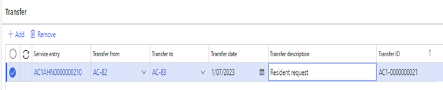
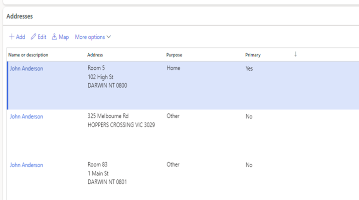

---
# required metadata

title: DXC Care services 
Description: Care services, Accommodation Payments
author: Helen Ho 
Manager: Pontus Ek
ms.date: 2025-03-31
ms.topic: article
ms.prod: 
ms.service: dynamics-ax-applications
ms.technology: 

# optional metadata

ms.search.form: 
audience: Application User
# ms.devlang: 
ms.reviewer: Peter Musumeci 

# ms.tgt_pltfrm: 
ms.custom: ["21901", "intro-internal"]
ms.search.region: Global
# ms.search.industry: [leave blank for most, retail, public sector]
ms.author: Peter Musumeci
ms.search.validFrom: 2025-03-31
ms.dyn365.ops.version: 10.0.40
---

### Bed transfer – transfer within the same facility (service)

**Navigate to: Care services > All customers > Care services > Service entries**

1.  Open the service entry the resident is departing from.
2.  Navigate to the **Transfer** section.
3.  Click **<Add>**
4.  Select the new bed from the **‘Transfer to’** drop-down menu.
5.  Populate the ‘**Transfer date’**
6.  Populate a **‘Transfer description’**
7.  Click **<OK>**
8.  The transfer line will be generated.

****

*Transfer*

9.  If required, **process a refund** if the new bed price is less than the original one or another invoice if the bed price is more than the original (subject to reason for the bed move)
10. Go to **Invoice > Accommodation Payment**
11. Populate an **<End date>** on the line.
12. Click **<Save>** to save the details.
13. Click on **<Add line>** to add a new line.
14. Populate Effective date and new **‘Agreed amount’** and **‘Agreed lumpsum’.**
15. **Process the difference in bed price:**
16. Go to Care services> Billing > Billing journal.
17. Create a new accommodation payment lumpsum invoice journal.
18. Populate the date and select the client account.
19. Select the billing account name for the accommodation payment refund
20. Select the Service code.
21. Select the Billing Code for the partial refund (as specified in care services parameters > journals > Partial refund billing code) OR the lumpsum invoice billing code for the invoice
22. Populate the start and end dates.
23. Add the refund amount credit in the Rate (e.g., -100 000) or additional invoice amount in debit
24. Validate and post the journal.
25. **Refund via All Customers> Collect> Client refund proposal:**
26. Select ‘Partial refund’ in the Refund type and click <Ok>
27. Select the credit invoice by ticking the ‘Mark’ check box
28. Click on <Create journal>
29. Go to Journals> Billing Journal and select the automatically created journal
30. Validate and post the journal.
31. The refund amount has now been transferred to the resident vendor account

### Transfer to another facility (service)

**Navigate to: Care services > All customers > Care services > Service entries**

1.  Open the service entry the resident is departing from.
2.  Populate **<Departure Date>**
3.  Populate **<Departure Notice Date>**
4.  Select the Transfer **<Departure Reason>**
5.  Click **<Save>** and close the form.
6.  Click on **<New>** to add the new service entry.
7.  Populate the relevant details.
8.  Click **<Save>** and close the form.
9.  The previous facility home address purpose will be changed to ‘Other’
10. The new facility address details will automatically be created with the purpose = Home

****

*Client addresses*

11. Go to Invoice> Accommodation payment.
12. A new **accommodation payment header** has been created for the new facility.
13. Select the new header and click on **<Add line>**
14. Populate the Agreed amount and Agreed Lumpsum and other relevant details.
15. Click on **<Save>** and close the form.
16. **Refund via All Customers> Collect> Client refund proposal:**
17. Select the accommodation payment id for the service the resident is departing from
18. Select ‘Full refund’ in the refund type
19. Click <OK>
20. Validate details and then click on <Create journal>
21. Navigate to the automatically created billing journal
22. Review the details, then validate and post the journal
23. The balance has now been transferred to the resident vendor account
24. Go to **Care services > Billing> Billing Journals**
25. Create a new Accommodation Payment Lumpsum invoice billing journal.
26. Populate Date, Client account and Billing account name for the accommodation payment.
27. Populate Service code for the **new facility.**
28. Select the Billing code for the accommodation payment lumpsum transfers.
29. Select the **new accommodation payment ID.**
30. Populate start and end dates.
31. Populate the agreed lumpsum amount.
32. Validate and post the journal.
33. Go to **Care services > Journals > Receipt journal** and create a new **Lumpsum receipt** journal.
34. Populate the date, client account and description.
35. Select the service code for the **new facility** and **billing account name** for the accommodation payment.
36. Select the **new accommodation payment ID.**
37. Click on <Settle transactions> to mark the invoice for the agreed lumpsum in the new facility.
38. Select Offset account type = Vendor
39. Select Offset account = The resident vendor account
40. Validate and post the journal.

### Departures

**Navigate to: Care services > All customers > Care services > Service entries**

1.  Open the service entry the resident is departing from.
2.  Populate **<Departure Date>**
3.  Populate **<Departure Notice Date>.** Departure notice date prior to the actual departure date will impact on the Interest Payable calculations.
4.  Select the **<Departure Reason>**
5.  Select the **<Deceased>** flag if the client is deceased.
6.  When the probate has been received, populate the **Probate/Admin letter** date.
7.  Click on **<Save>** and close the form.
8.  Propose the interest payable in the Billing journal (refer to the billing journal section for more information)
9.  Go to **Care services > All Customers > Invoice > Accommodation Payments**
10. Run the **‘Accommodation payment calculation’** to ensure all balances are updated.
11. **Refund via All Customers> Collect> Client refund proposal:**
12. Select the accommodation payment id
13. Select ‘Full refund’ in the refund type
14. Click <OK>
15. Validate details and then click on <Create journal>
16. Navigate to the automatically created billing journal
17. Review the details, then validate and post the journal
18. The balance has now been transferred to the resident vendor account
