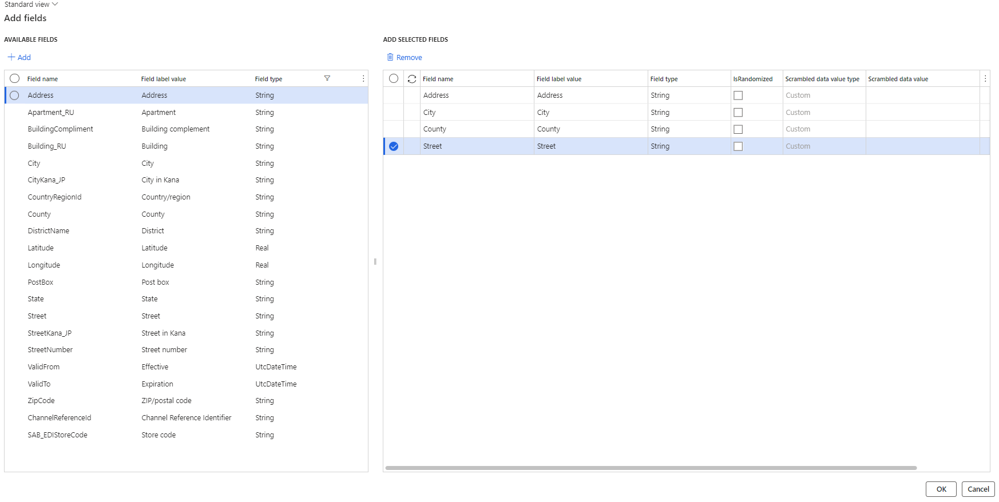

---
# required metadata

title: Core Extensions
description: Core Extensions - Data Anonymization
author: Peter Musumeci
manager: Pontus Ek
ms.date: 2023-10-31
ms.topic: article
ms.prod: 
ms.service: dynamics-ax-applications
ms.technology: 

# optional metadata

ms.search.form: DXCDataAnonymizationParameters, Data anonymization profiles, 
audience: Application User
# ms.devlang: 
ms.reviewer: Peter Musumeci

# ms.tgt_pltfrm: 
ms.search.region: CoreUtil
# ms.search.industry: [leave blank for most, retail, public sector]
ms.author: Peter Musumeci
ms.search.validFrom: 2023-10-31
ms.dyn365.ops.version: 10.0.34
---

# Data Anonymization
## Data Anonymization Overview

Data Anonymization is a process that allows for information to be scrambled post a database copy or when restored from a production into a sandbox environment.  The process can assist in protecting sensitive or personal information like names, bank accounts, addresses and more from people who should or do not require visibility of sensitive data. The process can be used to protect data and confidentiality but still allow necessary third parties-access to your environment. 

### Enable Feature

Data Anonymization has a separate Feature Key from Core extensions and must be enabled via Feature management in addition to the [Core Extensions](../Release-notes.md#feature-management) Feature Key. 
To Utilise Data Anonymization Enable the following feature in D365 Feature management:

- Data anonymization

If the above feature is not visible, press **Check for updates** to refresh the feature management list.

Once Enabled,  the Data Anonymization Menu is visible  under the Organization Administration module.  Navigate to **Organization administration > Setup > Data anonymization**

## Setup Data Anonymization

### Data anonymization parameters
The **Data anonymization parameters** page is used to ensure production values are safeguarded. The production URL is entered into the parameters form to prevent  users from accidentally scrambling production values. 

1. Navigate to **Organization administration > Setup > Data anonymization > Data anonymization parameters**
2. Insert your production URL into the PROD URL field.
Once completed select Save and close the form.

### Data anonymization profiles

Data anonymization profiles allows users to set up individual combinations of tables and fields with set combinations of values that can be saved and reused, streamlining the anonymization process for future requirements. You must create at least one profile to run the anonymization process.
Navigate to **Organization administration > Setup > Data anonymization > Data anonymization profiles**

The following table outlines the fields available in the Data anonymization profiles form, whether the field is mandatory, and some information about the field. If a field is not required to be selected by the user, it can be left blank, unless it is a mandatory field.

|  **Field**  | **Mandatory** | **Details** | 
|:---|:---|:---|     
|  **Name**  | Yes | Name of the anonymization profile |  
|  **Description**  | Yes | Unique description for the anonymization profile that will be used to scramble data values. |  
|  **Anonymization table**  | Yes | The D365 Table name that contains the sensitive data. |  
|  **Table Label**  | N/A | This is the label that has been given to the Table that is visible within the User Interface, sometimes referred to as a friendly name.  This field is displayed when  the Anonymization Dropdown is selected and will subsequently  populate when you nominate the requested Table.    |  
|  **Run across all companies**  | No | When ticked this will apply the scramble values for the selected criteria in all legal entities within the environment.  In some cases where a table is global, this field is required in order to successfully scramble data |  
|  **Company**  | Yes | Select the legal entity you wish to run the scramble for.  If “Run across all companies” is ticked this field is no longer mandatory and is greyed out. |  
|  **Data anonymization field**  | Yes | This is the name of the field that contains the data within your selected  table |  
|  **Field label value**  | Yes | This is the common name (a.k.a Friendly name) of the field where the scrambled data is stored.  This is commonly what is seen by users within the user interface |  
|  **Field type**  | AUto | This will automatically populate and display the type of data that is input into this field. Eg String, date   Fields of Type VarString is a variable length field and does not allow data types other than Random |  
|  **Is randomized**  | No | When enabled this field allows users to have Random Data, with various formats available,  generated per record. If not enabled the **Scrambled Data Value Type** will default to *custom* and will require a value to be specified |  
|  **Scrambled data value Type**  | No | This field allows you to select the format the scrambled data will take. Currently you can choose from   • Full Name   • Last Name
|  **Scrambled data value**  | No | If you select *Custom*  in **Scrambled Data Value Type** the user must input a value that will be utilised for all records in the specified field, that are being Anonymized.  However, if **Is randomized** is enabled the value displayed is a sample that will be used based on the selection made in **Scrambled data value Type**
|  **Prefix for scrambled data value**  | No | Inserts a prefix to the scrambled value, currently only company Id is available.  Note: When making use of prefixes, the Run across all companies must be set to No (Unchecked). If it is checked, then the prefix will be ignored and only the scramble value will be applied |  

### Initiate data anonymization. 
To initiate data anonymization, you firstly need to create the profile. 
1. Navigate to **Organization administration > Setup > Data anonymization > Data anonymization profiles**
2. Select “New” from the top menu ribbon, fill in Name and Description then click Save from the ribbon bar.
3. on the Data anonymization Table Tab select New to being selecting the relevant table/s from the drop-down menu or select from a predefined list of default tables.
4. Select Company or tick Run across all companies to update all legal entities, then save the selection.
   *You can subsequently edit and/or delete tables from the list as required.

5. To add the fields and values to be scrambled Select **Add Fields** to display the field selector for your highlighted Table.
   
 

7. Select the fields you want data scrambled in and select **Add** to populate your list or **Remove** to remove from selection.  Once you have selected all fields for this table click **OK** to add them to the main form.
8. Populate the Scrambled data value and select prefix if desired, select Save to confirm changes 
*Repeat this process for all Tables and fields where data is to be scrambled

### Load default tables

When selected this function will bring up a list of common System tables and their “friendly/common name” that can be easily added to the anonymisation list. Select the required tables and once completed select **Add tables** to update them into your form. 

8. Highlight the required Table and Select **Add Fields** to display the field selector for your highlighted Table.
9. Locate and select the fields you want to scramble data for and select **Add** to add them to your list or Remove to remove from selection.  Once all fields for this table have been added click **OK** to add them to the main form 
10. Populate the Scrambled data value and select prefix if you want to populate the scramble data with a prefix.  Select **Save** to move onto the next table 
*Repeat this process for all Tables and fields where data is to be scrambled

Once all Tables and fields have been populated select the **Initiate data anonymisation** button from the ribbon bar and add the scramble job to the batch job processing queue.

If the batch job completes successfully the below is displayed

However, if the batch job fails and the anonymisation process does not complete a error batch job is created for the table. 

To identify the error that has caused the job to fail review the log from the batch tasks form as per standard batch job troubleshooting. 

