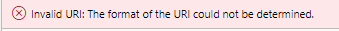

---
# required metadata

title: Core Extensions
description: Core Extensions - Frequently Asked Questions
author: Peter Musumeci
Manager: Pontus Ek
ms.date: 2024-05-23
ms.topic: article
ms.prod: 
ms.service: dynamics-ax-applications
ms.technology: 

# optional metadata

# ms.search.form: DXCDataAnonymizationParameters, Data anonymization profiles, Frequently Asked Questions, FAQ, Scamble, Core Extensions, anonymisation, anonymization
audience: Application User
# ms.devlang: 
ms.reviewer: Peter Musumeci

# ms.tgt_pltfrm: 
ms.search.region: Global
# ms.search.industry: [leave blank for most, retail, public sector]
ms.author: Peter Musumeci
ms.search.validFrom: 2024-05-23
ms.dyn365.ops.version: 10.0.39
---

# 	Frequently Asked Questions Data Anonymization

### I receive an error when I enter my Production URL?

If you attempt to enter an invalid web address into the PROD URL Field you will receive an error "Invalid URI: The format of the URI could not be determined"  similar to the one below

To resolve this you must enter a valid Dynamics Finance and operation URL to proceed 

### How is the fake Data Generated in Data Anonymisation?

We make use of a.Net package called Bogus, which makes it easy to generate phoney but realistic data for testing, prototyping, and other uses without requiring actual data. It directly uses locales from Faker.js, which are straightforward JavaScript files with data for creating fictitious addresses, phone numbers, and names that are geo-targeted to particular languages or locations. 

### When attempting to mask address information in the *LOGISTICSPOSTALADDRESS* Table for all companies I get an error.

The LOGISTICSPOSTALADDRESS table can only be run set to individual legal entities (not across all companies). Select a single legal entity before running the process.
