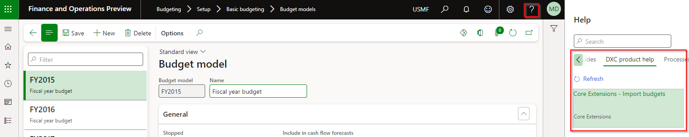

---
# required metadata

title: Core Extensions
description: DXC Core extensions - Release notes
author: lcoll
manager: Kym Parker
ms.date: 2023-02-22
ms.topic: article
ms.prod: 
ms.service: dynamics-ax-applications
ms.technology: 

# optional metadata

# ms.search.form:  Release notes
audience: Application User
# ms.devlang: 
ms.reviewer: Liam Coll

# ms.tgt_pltfrm: 
# ms.custom: ["21901", "intro-internal"]
ms.search.region: CoreUtil
# ms.search.industry: [leave blank for most, retail, public sector]
ms.author: Liam Coll
ms.search.validFrom: 2016-05-31
ms.dyn365.ops.version: AX 7.0.1
---

# 	Release notes
This document describes the features that are either new or changed in the release version mentioned.

# Current version

### Release 10.0.29.TBD

DXC Core extensions 10.0.29 runs on the following Microsoft releases

Base	  | Version	  | Release
:--       |:--            |:--
Microsoft Dynamics 365 application	| 10.0.29	  | [What’s new or changed in Dynamics 365 application version 10.0.29](https://docs.microsoft.com/en-us/dynamics365/finance/get-started/whats-new-changed-10-0-29)
Microsoft Dynamics 365 application	| 10.0.30	  | [What’s new or changed in Dynamics 365 application version 10.0.30](https://docs.microsoft.com/en-us/dynamics365/finance/get-started/whats-new-changed-10-0-30)
Microsoft Dynamics 365 application	| 10.0.31	  | [What’s new or changed in Dynamics 365 application version 10.0.31](https://docs.microsoft.com/en-us/dynamics365/finance/get-started/whats-new-changed-10-0-31)
Microsoft Dynamics 365 application	| 10.0.32	  | [What’s new or changed in Dynamics 365 application version 10.0.32](https://docs.microsoft.com/en-us/dynamics365/finance/get-started/whats-new-changed-10-0-32)

#### Build 10.0.29.TBD

<ins>New features</ins>

Number	  	| Functionality	  | Description
:--       	|:--              |:--
10206		| Reciprocal exchange rates	| New setting **Display reciprocal exchange rate** added to **Legal entities**.   When set to _Yes_, displays the reciprocal rate on:   - General journal lines   - Vendor invoice journal lines   - Vendor payment journal lines   - Purchase order totals   - Customer payment journal lines   - Free text invoice totals   - Sales order totals
N/A		| License manager	| License manager version 10.8.32.10156.   **Help** includes links to applicable GitHub user guide page/s   

<ins>Bug fixes</ins>

Number	| Name	          | Description
:--     |:--              |:--
9513	| User security audit details report	| Display **Privilege** information per Role and Duty.

### Release 10.0.22.20220331

#### Build 10.0.22.202203312

<ins>Bug fixes</ins>

Number	  | Name	          | Description
:--       |:--              |:--
10016	    | Import ledger journal no longer displays export templates  | The import ledger journal class displayed both import and export data entities. This has been amended to only display import data entities.
10017	    | Support inventory movement journal data entity V4  | Support inventory movement journal data entity V3 has been replaced with the updated V4. Support for this new data entity has been added to the inventory journal import feature.

# Previous version(s)

### Release 10.0.16.20210413

#### Build 10.0.16.202104131

<ins>Bug fixes</ins>

Number	  | Name	          | Description
:--       |:--              |:--
8953	    | Company color removed on browser refresh 	| A change by Microsoft in 10.0.17 introduces a bug in the Core extensions where the company color is being reset to default when the browser is refreshed. It is only reinstated by opening the legal entities form where the company colour configuration is set. This has now been fixed.
	
### Release 10.14.38.10019

#### Build 10.14.38.10019

Number	  | Functionality	  | Reason
:--       |:--              |:--
5695	|	Inventory Movement Journal Headers and Lines entity marked as obsolete	| The Inventory Movement Journal Headers and Lines entity which is used in the Inventory Movement Import function has been marked as obsolete by Microsoft and is replaced by the Inventory Movement Journal Headers and Lines V3 entity. Core extensions has been updated to use the new data entity. Some changes in the configuration and setup of the import function is required.     We note that the Inventory movement journal headers and lines V3 data entity which as standard loads the data based on the scenario where if an existing Inventory Movement Journal with less than 1,000 lines is “Not posted”, the imported lines will be appended to the existing journal, otherwise a new journal will be created.

  
# Installation process
To align with MS best practice and to protect our IP the following changes have been made to the release process.
- The license models DXCLicense and Sable37License will only be released as binaries as part of a deployable package. 
- We will no longer be providing test models for the products, neither as binary or source code. 
- We will only publish the release as a deployable package. 
- Model source code can be provided on request if needed for extensions or debugging.
	- If you have been given the source code to our model for extension or debugging purpose, never make modifications directly to our models! 
	- If you need an extension point, please send an email to ECLANZProductSupport@dxc.com and request it to be implemented. 

Depending on the installation history follow one of these guides to install the new release. 
## Installation without existing installed product
1. Apply the deployable package to your environment. 
2. If you have requested any model for extension or debugging purposes. Install the model source code. 
a.	Note, once the model source code is compiled it will overwrite the binaries installed when the deployable package was applied. 

## Installation with existing installed product
If you’re installing the new release in an installation that already has a previous version of the product installed and you’re not using it for debugging or extension. We recommend that you;  
1. Remove the release product model source code from your source control, if source control is used. 
2. Apply the deployable package, installing the latest version of the product models as binaries.  
3. Check in the binaries for the models to source control, if source control is used. 

If you’re using our model source code for extension or debugging and would like to continue using it, please do the following to apply the new release with the source code. 

1. Remove product license model from your source control that is applicable to the release. You’ll find the license model in the deployable package. It will either be called DXCLicense and Sable37License. 
2. Apply the deployable package to your environment to install the latest binaries. Check in the binaries for the license model that was removed in step 1 to source control. Note, this step will also install the binaries for all the models in the new release. 
3. Install the product release model source code and check into source control. 

If you don’t follow these instructions and continue building your installation deployable package using the license model source code, the installation will continue using the same license model as before applying the release. 
