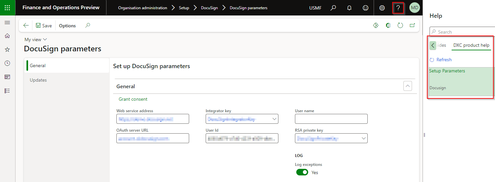

---
# required metadata

title: DXC Solutions for DocuSign and Dynamics 365
description: DXC Solutions for DocuSign and Dynamics 365 - Release notes
author: PeterM
manager: Pontus Ek
ms.date: 2023-06-15
ms.topic: article
ms.prod: 
ms.service: dynamics-ax-applications
ms.technology: 

# optional metadata

ms.search.form:  
audience: Application User
# ms.devlang: 
ms.reviewer: PeterM

# ms.tgt_pltfrm: 
# ms.custom: ["21901", "intro-internal"]
ms.search.region: IconDocuSign
# ms.search.industry: [leave blank for most, retail, public sector]
ms.author: ndavidson2
ms.search.validFrom: 2016-05-31
ms.dyn365.ops.version: AX 7.0.1
---

# 	Release notes
This document describes the features that are either new or changed in the release version mentioned.

# Version compatibility
The matrix shows the minimum DXC build versions that are compatible with Microsoft versions and builds.  
If blank, investigations are ongoing.  

D365 Version		  |Iissues found in testing?| Product version tested
:--       	 		 |:--           			  |:--
Product version: 10.0.40   App build: 10.0.1935.5	  | No | DocuSign Foundation 10.0.34.20230615 DocuSign 10.0.34.20230615
Product version: 10.0.41   App build: 10.0.2015.16	  | No | DocuSign Foundation 10.0.34.20230615 DocuSign 10.0.34.20230615
Product version: 10.0.42   App build: 10.0.2095.13	  | No | DocuSign Foundation 10.0.34.20230615 DocuSign 10.0.34.20230615
Product version: 10.0.43   App build: 10.0.2177	  | No | DocuSign Foundation 10.0.34.20230615 DocuSign 10.0.34.20230615
Product version: 10.0.44   App build: 10.0.2263.11	  | Yes 23017 | DocuSign Foundation 10.0.34.20230615 DocuSign 10.0.34.20230615   Erros fixed in 10.0.44

# Current version

### Release 10.0.34.20230615

DXC DocuSign 10.0.34 runs on the following Microsoft releases

Base	  | Version	  | Release
:--       |:--            |:--
Microsoft Dynamics 365 application	| 10.0.40	  | [What’s new or changed in Dynamics 365 application version 10.0.40](https://docs.microsoft.com/en-us/dynamics365/finance/get-started/whats-new-changed-10-0-40)
Microsoft Dynamics 365 application	| 10.0.41	  | [What’s new or changed in Dynamics 365 application version 10.0.41](https://docs.microsoft.com/en-us/dynamics365/finance/get-started/whats-new-changed-10-0-41)
Microsoft Dynamics 365 application	| 10.0.42	  | [What’s new or changed in Dynamics 365 application version 10.0.42](https://docs.microsoft.com/en-us/dynamics365/finance/get-started/whats-new-changed-10-0-42)
Microsoft Dynamics 365 application	| 10.0.43 	  | [What’s new or changed in Dynamics 365 application version 10.0.43](https://docs.microsoft.com/en-us/dynamics365/finance/get-started/whats-new-changed-10-0-43)
Microsoft Dynamics 365 application	| 10.0.44 	  | Due April 2025 see [Targeted release schedule](https://learn.microsoft.com/en-us/dynamics365/fin-ops-core/dev-itpro/get-started/public-preview-releases#targeted-release-schedule-dates-subject-to-change)

Release notes for other models included in the product:
- [DXC License Manager](../LMG/Release-notes.md#dxc-license-manager)
- [DXC License](../LMG/Release-notes.md#dxc-license)

#### Build 10.0.44.----
Release date: XX June 2025

<ins>Bug Fixes</ins>

Number	| Functionality	  	| Reason
:--	|:--		  	|:--	
23017	|	Incompataible authentication with FinOps	| Upgraded System.IdentityModel.Tokens.Jwt (4.0.0 → 8.3.0) to address authentication compatibility with FinOps 10.0.43

# Previous version(s)

### Release 10.0.34.20230615

#### Build 10.0.34.202306151
Release date: 15 June 2023

<ins>New features</ins>

Number	| Functionality	  	| Reason
:--	|:--		  	|:--	
N/A	| DXC License		| DXC License version 10.0.34.202306151

#### Build 10.0.29.202304211

Number	| Functionality	  | Reason
:--     |:--              |:--
N/A		| License manager	| License manager version 10.8.32.10171   Enhanced Licensing capabilities to assist with licensing support and scaling.   **Note:** Required to upgrade all installed DXC products to at least the following versions:   • EDI 10.0.29.202305053   • Finance utilities 10.0.29.202305051   • SmartSend 10.0.29.202304142   • Core extensions 10.0.29.202304142   • DocuSign 10.0.29.202304211   • Item creation 10.0.29.202304211   •  PLM 10.0.29.202304211   • Forex 10.0.29.202305101   

### Release 10.0.29.20230221

#### Build 10.0.29.202302211

Number	| Functionality	  | Reason
:--     |:--              |:--
9734	| Dropdown list Tag type	| Ability to create dropdown [lists](SETUP/List.md) and use these as tags in the [Template](SETUP/Template.md).
10036	| Remove deprecated tables	| Removed tables SAB_DSUser and SAB_DSUserMapping, which are related to previous methods of establishing authentication. These are no longer required following the release of OAuth2 authentication.
N/A	| License manager	| License manager version 10.8.32.10156.   **Help** includes links to applicable GitHub user guide page/s.   

### Release 10.0.25.20220630

#### Build 10.0.25.202206302

Number	  | Functionality	  | Reason
:--       |:--              |:--
9888	    | Support for OAuth 2.0 | API with DocuSign now uses the OAuth 2.0 authentication type. The following fields have been added to the DocuSign Parameters form for establishing authentication     **OAuth server URL** = account-d.docusign.com   **Integrator key** = select from configured [Key vault values](https://docs.microsoft.com/en-us/dynamics365/finance/localizations/setting-up-azure-key-vault-client)   **User Id** = DocuSign user ID    **RSA private key** = select from configured Key vault values    Initial authentication will require the granting of consent. This can be achieved from the same form by selecting *Grant consent* and logging in.
10403	    | Send worker name for internal placeholder emails	| Support for the sending of distinct values for SignerEmail and SignerName when using purpose-controlled placeholders for workers within document management. The value for the SignerName will be the account name for the worker. This feature must be enabled on each document type by selecting the field Use document type.

### Release 10.0.22.20220321

#### Build 10.0.22.202203211

Number	  | Functionality	  | Reason
:--       |:--              |:--
9154	    | Support for textbox type | The tag type of text is now supported for envelope creation. A text character limit can be defined for each use of this tag type.
9315	    | Send account name for placeholder emails	| Support for the sending of distinct values for SignerEmail and SignerName when using purpose-controlled placeholders in document management. The value for the SignerName will be the account name for the party. Previously, both values were communicated as the email address. This feature must be enabled on each document type by selecting the field Use document type.
9793	    | Mandatory page number for specific page	| When selecting to use a specific page for tag placement, the page number field is now mandatory. This is to prevent an issue with envelope creation and tag assignment to page 0.

### Release 10.0.12.20210701

#### Build 10.0.12.202107011

Functionality	  | Reason
:--              |:--
Update to 10.0.12 | Update release version to 10.0.12 in line with platform support.
License manager	| Update to license manager 10.8.32.10112.

### Release 10.0.9.20200820

#### Build 10.0.9.202008201

Functionality	  | Reason
:--              |:--
License manager	| Update to license manager 10.8.32.10092.

  
# Installation process
To align with MS best practice and to protect our IP, the following applies to the release process.
- The license models DXCLicense and Sable37License will only be released as binaries as part of a deployable package. 
- We will not provide test models for the products, neither as binary nor source code. 
- We will only publish the release as a deployable package. 
- Model source code can be provided at our discretion. It can be requested for debugging upgrade errors, or if required for extensions.
	- If you have been given the source code to our model for extension or debugging purposes, never make modifications directly to our models! 
	- If you need an extension point, please send an email to ECLANZProductSupport@dxc.com and request it to be implemented. 

Depending on the installation history, follow one of these guides to install the new release. 
## Installation without an existing installed product
1. Apply the deployable package to your environment. 
2. If you have requested any model for extension or debugging purposes. Install the model source code. 
a.	Note, once the model source code is compiled, it will overwrite the binaries installed when the deployable package was applied. 

## Installation with an existing installed product
If you’re installing the new release in an installation that already has a previous version of the product installed and you’re not using it for debugging or extension. We recommend that you;  
1. Remove the release product model source code from your source control, if source control is used. 
2. Apply the deployable package, installing the latest version of the product models as binaries.  
3. Check in the binaries for the models to source control, if source control is used. 

If you’re using our model source code for extension or debugging and would like to continue using it, please do the following to apply the new release with the source code. 

1. Remove the product license model from your source control that applies to the release. You’ll find the license model in the deployable package. It will either be called DXCLicense or Sable37License. 
2. Apply the deployable package to your environment to install the latest binaries. Check the binaries for the license model that was removed in step 1 in source control. Note, this step will also install the binaries for all the models in the new release. 
3. Install the product release model source code and check it into source control. 

If you don’t follow these instructions and continue building your installation deployable package using the license model source code, the installation will continue using the same license model as before applying the release. 
