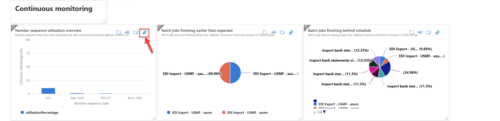
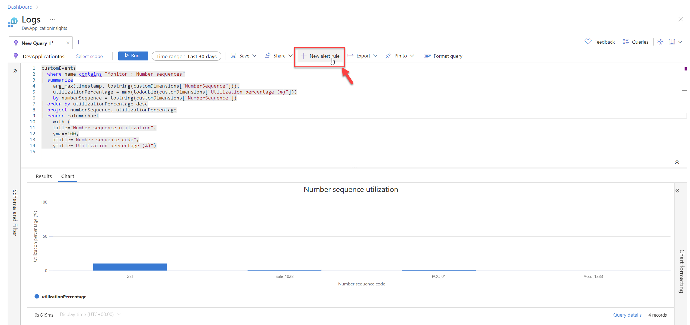
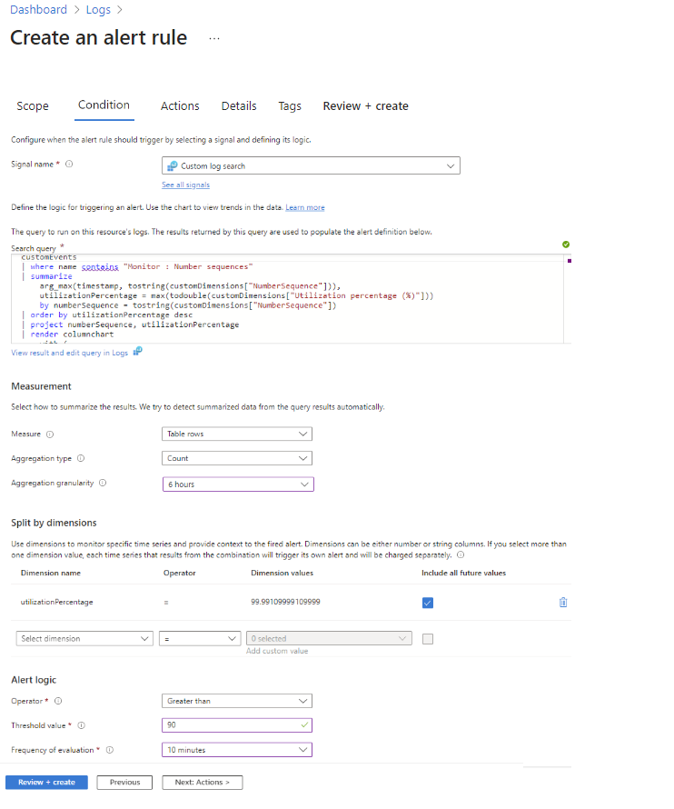
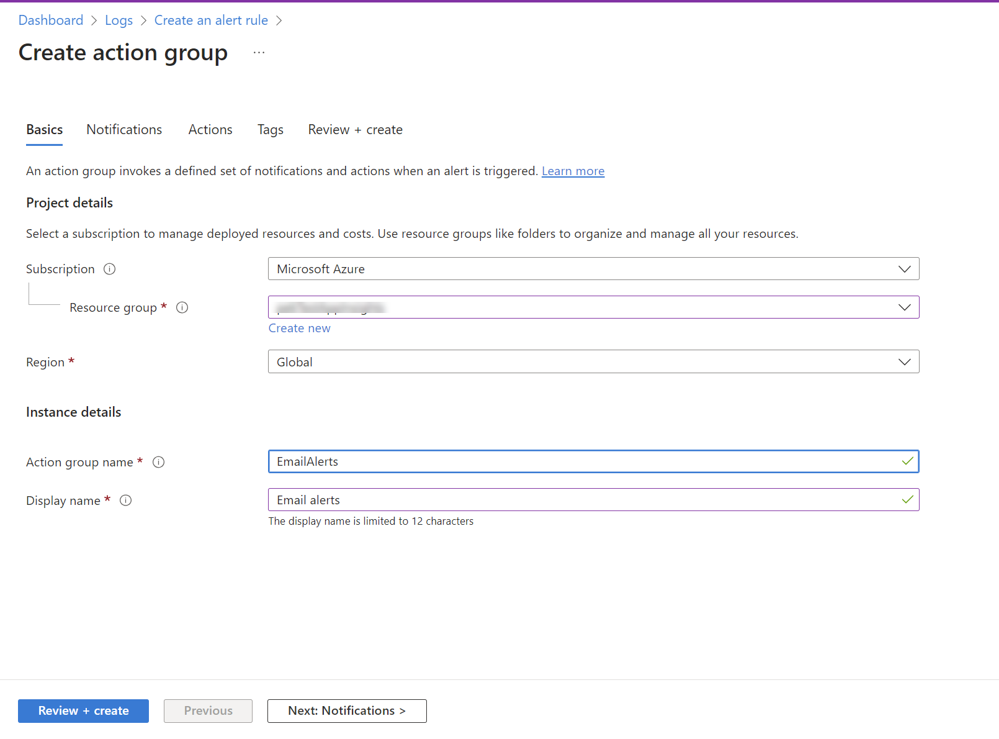
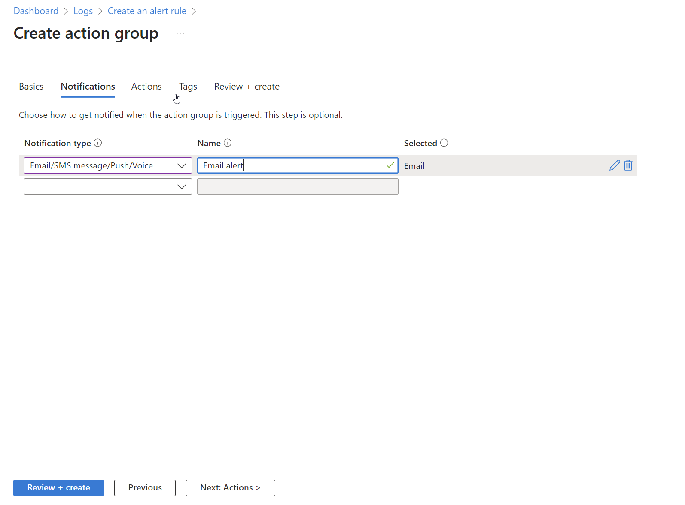
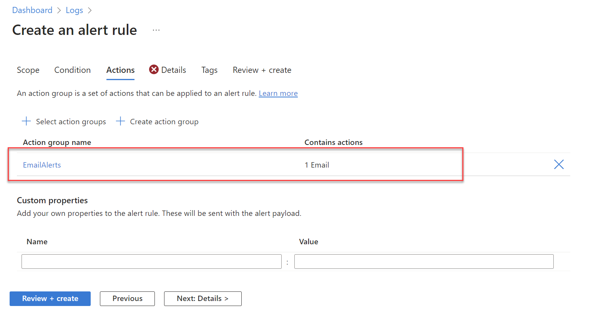
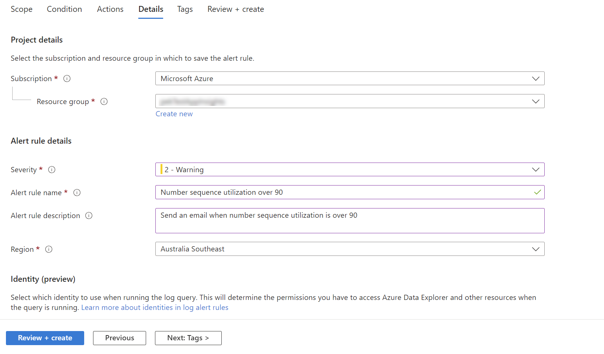
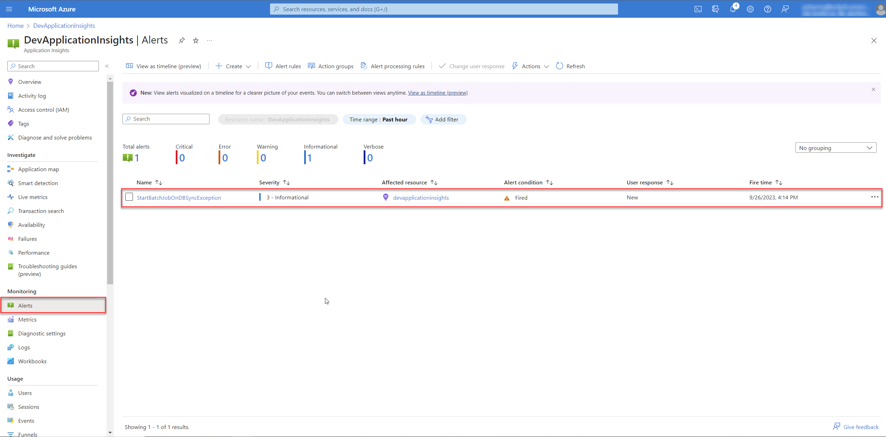

---
# required metadata

title: Insights for D365 FO
description: Insights for D365 FO - Dashboards
author: Patrick Sharma
manager: Kym Parker
ms.date: 2023-06-07
ms.topic: article
ms.prod: 
ms.service: dynamics-ax-applications
ms.technology: 

# optional metadata

ms.search.form: DXCInsightsParameters
audience: Application User/ Azure Administrators
# ms.devlang: 
ms.reviewer: Patrick Sharma
# ms.tgt_pltfrm: 
# ms.custom: ["21901", "intro-internal"]
ms.search.region: InsightsForD365FO
# ms.search.industry: [leave blank for most, retail, public sector]
ms.author: Patrick Sharma
ms.search.validFrom: 2023-03-28
ms.dyn365.ops.version: 10.0.32
---

# Alerts on Azure Application Insights

Alerts are a feature of Microsoft Azure that allow you to proactively monitor and respond to events and conditions within your Azure resources. These alerts, when combined with data from Insights for D365 FO provide real-time notifications when specific conditions or thresholds are met, helping you stay informed about the health, performance, or availability of your applications and infrastructure. With alerts, you can create rules based on metrics, logs, or even the results of your own custom queries. These rules define the conditions that trigger an alert, number sequence utilization exceeding a certain threshold, or batch jobs taking longer than defined maximum completion time to finish. When the conditions are met, Azure sends a notification to a chosen destination, such as an email, SMS message, web hook, or it can even execute an action with Azure Logic Apps.

### 1. Setup alerts on continuous monitoring business rules

We will look at setting up alerts on existing continuous business rules configured with Insights for D365 FO. Click on **'Open in Logs blade'** on any of the charts in the 'Continuous monitoring' section of the dashboard for Azure Application Insights provided by DXC. For this example we will look at creating an alert when Number sequence code utilization has exceeded 90%.

A query editor will open up, with the Kusto query for number sequence utilization pre-loaded. You can click Run to load it in the query editor and return results. You may want to modify the query and run it again if required. Once you are satisfied wioth the query, click on **'New alert rule'** to create an alert rule based on this custom query for number sequence utilization monitoring. The Scope will already be set to the current resource. You don't need to change this value. You can also refer to the documentation on [Creating a log query alert for an Azure resource](https://learn.microsoft.com/en-us/azure/azure-monitor/alerts/tutorial-log-alert) by Microsoft.

On the **Condition** tab, the Log query will already be filled in. The **Measurement** section defines how the records from the log query will be measured. If the query doesn't perform a summary, then the only option will be to Count the number of Table rows. If the query includes one or more summarized columns, then you'll have the option to use number of Table rows or a calculation based on any of the summarized columns. **Aggregation granularity** defines the time interval over which the collected values are aggregated. You can set the Aggregation granularity to match the refresh interval for the Number sequence monitoring configured in [Number Sequence Monitoring Configuration](../Periodic-monitoring-configuration/Number_sequence_monitoring.md#1-number-sequence-monitoring-configuration) on the D365 FinOps Periodic monitoring configuration form.

**Split by dimensions** allows you to create separate alerts for different resources. This setting is useful when you're creating an alert rule that applies to multiple resources. With the scope set to a single resource, this setting typically isn't used.

In the **Alert logic**, configure the Operator and Threshold value to compare to the value returned from the measurement. An alert is created when this value is true. Select a value for Frequency of evaluation which defines how often the log query is run and evaluated. The cost for the alert rule increases with a lower frequency. When you select a frequency, the estimated monthly cost is displayed in addition to a preview of the query results over a time period.

Next, we will configure the actions. Action groups define a set of actions to take when an alert is fired such as sending an email or an SMS message. You can select an existing action group, o if you don't already have an action group in your subscription to select, then click Create action group to create a new one. Refer to [Create an action group in the Azure portal](https://learn.microsoft.com/en-us/azure/azure-monitor/alerts/action-groups) documentation by Microsoft.

to create an action group, select a Subscription and Resource group for the action group and give it an Action group name that will appear in the portal and a Display name that will appear in email and SMS notifications.

Select the Notifications tab and add one or more methods to notify appropriate people when the alert is fired.

Click **Review** and **Create** then action group. Then select this action group on the **Actions** tab of your alert rule

On the **Details** tab, Configure the rest of the settings:  
1. Alert rule name which should be descriptive since it will be displayed when the alert is fired.
2. Optionally provide a Description that's included in the details of the alert.
3. Subscription and Resource group where the alert rule will be stored. This doesn't need to be in the same resource group as the resource that you're monitoring.
4. Severity for the alert. The severity allows you to group alerts with a similar relative importance. A severity of Error is appropriate for an unresponsive virtual machine.
5. Keep the box checked to Enable alert upon creation.
6. Keep the box checked to Automatically resolve alerts. This will make the alert stateful, which means that the alert is resolved when the condition isn't met anymore.

Click **Create alert rule** to create the alert rule.

When an alert fires, it will send notifications to recipients configured in its action groups. You can also view the alert in the Azure portal. Select **Alerts** from the resource's menu. If there are any open alerts for the resources, they will be included in the view.
