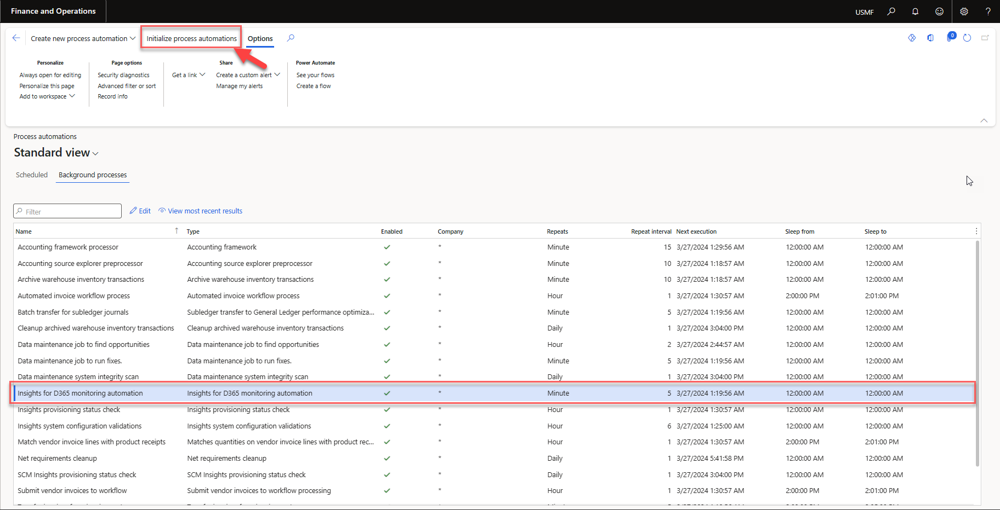

---
# required metadata

title: Insights for D365 FO
description: Insights for D365 FO - Batch job monitoring
author: Patrick Sharma
manager: Kym Parker
ms.date: 2023-10-03
ms.topic: article
ms.prod: 
ms.service: dynamics-ax-applications
ms.technology: 

# optional metadata

ms.search.form: BatchJob, BatchJobEnhanced 
audience: Application User/ Azure Administrators
# ms.devlang: 
ms.reviewer: Patrick Sharma
# ms.tgt_pltfrm: 
# ms.custom: ["21901", "intro-internal"]
ms.search.region: InsightsForD365FO
# ms.search.industry: [leave blank for most, retail, public sector]
ms.author: Patrick Sharma
ms.search.validFrom: 2023-03-28
ms.dyn365.ops.version: 10.0.32
---

# Batch job monitoring setup
Enable Batch job monitoring on the Insights for D365 parameters form.

Navigate to **System administration > Setup > Process automations** . Click on **Background process** and Ensure that the 'Insights for D365 monitoring automation' task is added to the process automation tasks schedule. is task guarantees that all relevant event handlers are attached, enabling comprehensive monitoring of batch jobs and tasks within D365 FO with Insights. 

If you do not see the 'Insights for D365 monitoring automation' task in the list, click on **Initialize process automations** in the Action pane to initialize the automated process task.

The automated task will only run if the 'Insights for D365 FO' feature is enabled, and batch jobs monitoring or batch tasks monitoring is enabled in the Insights for D365 parameters.

# Inconsistent Batch job completion Monitoring
Inconsistent Batch job completion monitoring with Insights for D365 FO allows users to monitor batch job execution completion times and detect if batch jobs are completing earlier than expected or if they are finishing later than anticipated (which might suggest performance issues or delays).
### 1. Enable batch job monitoring with Insights for D365 FO
To setup monitoring, navigate to **System administration > Inquiries > Batch jobs** and open the enhanced batch job details view in edit mode. Users will  need to :
1. Enable monitoring with Insights for D365 FO under 'Inconsistent Batch job completion' group
2. Enter the estimated minimum number of minutes that the batch job is expected to take to complete execution in the 'Minimum completion time' field.
3. Enter the estimated maximum number of minutes that the batch job is expected to take to complete execution in the 'Maximum completion time' field.
4. Click **Save**

Telemetry will be logged with Insights for D365 FO at the start and end of each batch job execution. A summary of batch jobs that finish behind schedule or too early is available on Azure Application Insights with the Insights for D365 FO Dashboard provided by DXC. You can also set up Alerts on Azure Application Insights to send a notification to a chosen destination, such as an email, SMS message, web hook, or it can even execute an action with Azure Logic App. Refer to [Setup alerts on continuous monitoring business rules](./Azure-application-insights/Azure_alerts.md#1-setup-alerts-on-continuous-monitoring-business-rules) to setup alerts  for critical batch jobs that are completing earlier than expected or if they are finishing later than anticipated.

N.B
Refer to [Batch job limitations](./Limitations.md#product-limitations) to understand current limitations on batch job monitoring