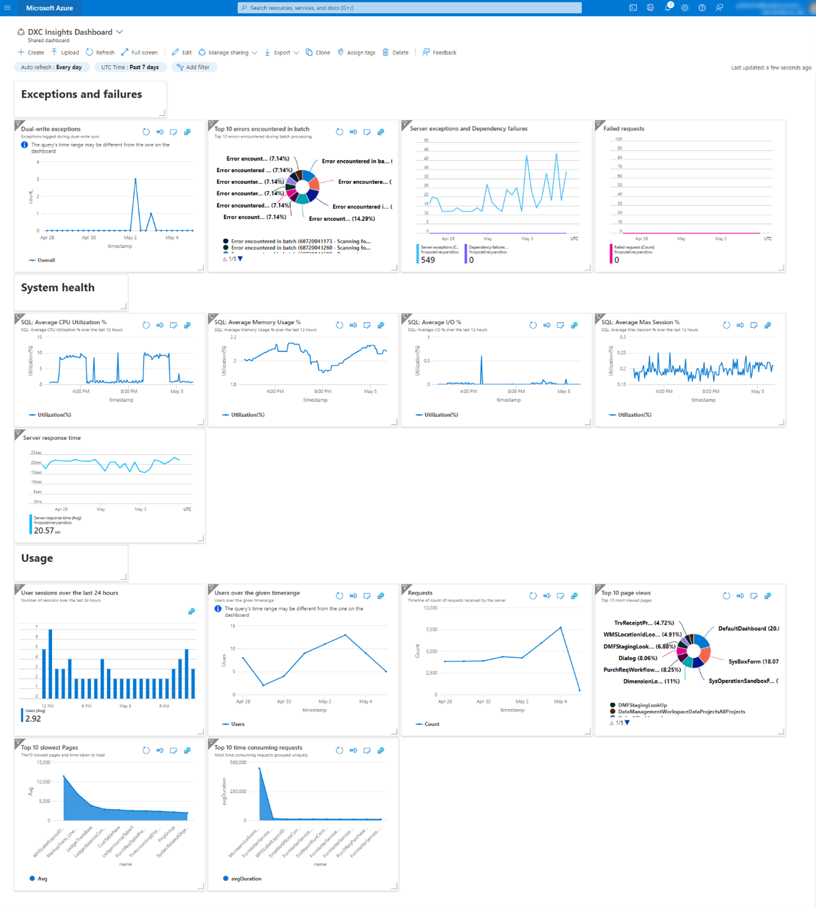
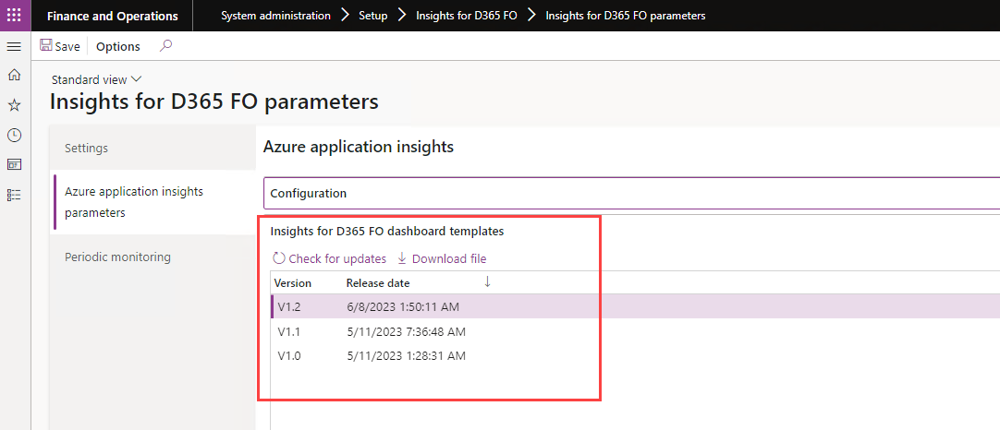
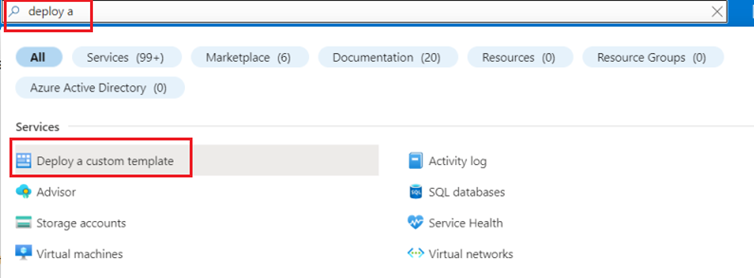
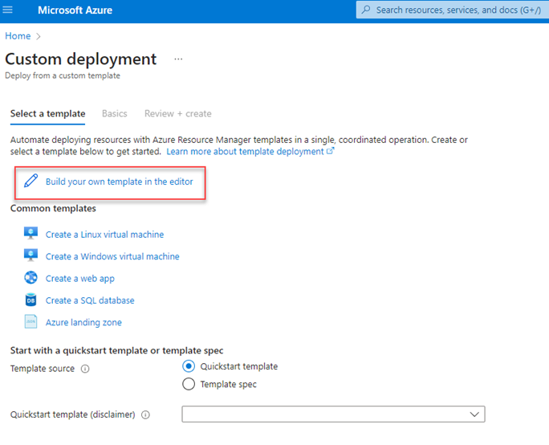
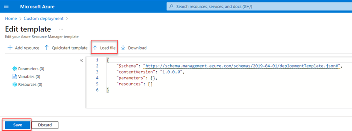
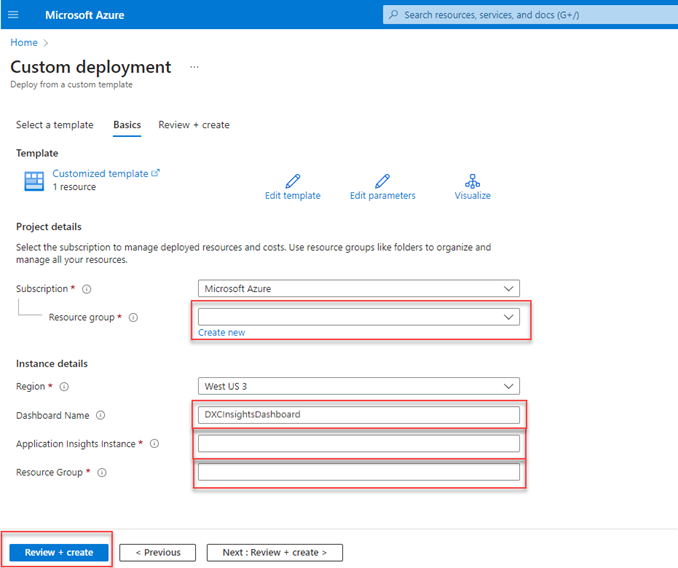
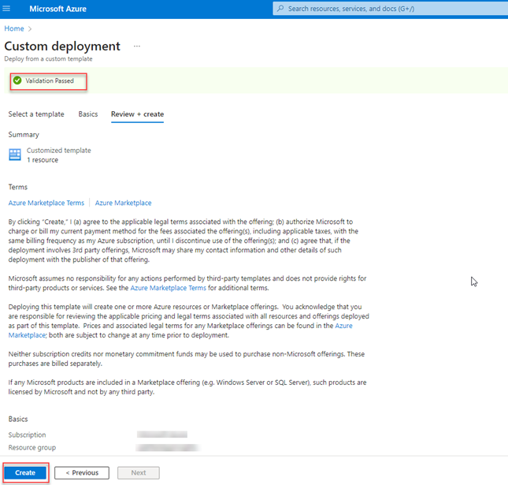
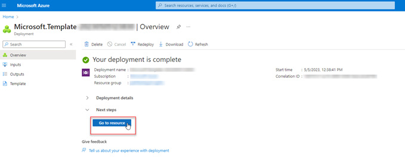

---
# required metadata

title: Insights for D365 FO
description: Insights for D365 FO - Dashboards
author: Peter Musumeci
manager: Kym Parker
ms.date: 2023-06-07
ms.topic: article
ms.prod: 
ms.service: dynamics-ax-applications
ms.technology: 

# optional metadata

ms.search.form: DXCInsightsParameters
audience: Application User/ Azure Administrators
# ms.devlang: 
ms.reviewer: Peter Musumeci
# ms.tgt_pltfrm: 
# ms.custom: ["21901", "intro-internal"]
ms.search.region: Global
# ms.search.industry: [leave blank for most, retail, public sector]
ms.author: Peter Musumeci
ms.search.validFrom: 2023-03-28
ms.dyn365.ops.version: 10.0.32
---

# Insights for D365 FO Dashboards for Application Insights

Application Insights has always provided a summary overview pane to allow quick, at-a-glance assessment of your application's health and performance. 

###  Insights for D365 FO Dashboard Overview. 
The Insights for D365 FO dashboard gives a summarized overview of Exceptions and Failures, System health telemetry and Usage data for your application.

### 1. Exceptions and failures
The exceptions and failures provide a summary of exceptions caught during Dual-write sync, top 10 errors encountered in batch processing, server exceptions and dependency failures and failed requests.

### 2. System health
The system health section provides telemetry on SQL health metrics including average CPU utilization, average memory usage, average input/output and average session utilization over the last 12 hours. These metrics are time locked for the last 12 hours and are not controlled by the dashboard time filter. The time range will need to be manually changed on these tiles to get custom time range metrics. The system health also provides a summary of the server response time based on the dashboard’s time range filter.

### 3. Usage
The usage section gives an overview of user sessions over the last 24 hours, as well as the number of users that have been active on the application over the dashboard’s time range. Requests display a count of requests received by the server. You can also see the application’s most viewed pages, slowest loading pages and top 10 most time-consuming requests on the server in this section.

### 4. Insights for D365 FO dashboard templates
Insights for D365 FO dashboard templates can be accessed from the Insights for D365 FO dashboard templates fast tab.  Navigate to  **System Administration > Setup > Insights for D365 FO > Insights for D365 FO parameters** then select the 'Azure application insights parameters' section to display the Insights for D365 FO dashboard templates fast tab. Click on ‘Check for updates’ to download the latest templates that we have released. Select a template version and Click *‘Download file’* to download the template.

### 5. Insights for D365 FO dashboard deployment
ARM templates are JSON or Bicep files that define the resources you need to deploy for your solution. To understand the concepts associated with deploying and managing your Azure solutions, see [how to create an Azure Resource Manager template](https://learn.microsoft.com/en-us/azure/azure-resource-manager/templates/quickstart-create-templates-use-the-portal) and [template deployment overview](https://learn.microsoft.com/en-us/azure/azure-resource-manager/templates/overview).

In summary, to deploy the Insights for D365 FO dashboard for your Azure Application Insights instance, download and keep a local copy of the DXCInsightsDashboardTemplate json file. In the web browser, go to the [Azure portal](https://portal.azure.com/) and sign in. From the Azure portal search bar, search for deploy a custom template and then select it from the available options.

Select *‘Build your own template in the editor’* template

Select *‘Load file’* and upload the ‘DXCInsightsDashboardTemplate.json’ file. Click *‘Save’*.

Select the Resource group to which your new dashboard will belong to. Enter the appropriate Instance details for region and the name of the dashboard. By default, the dashboard name is ‘DXCInsightsDashboard’. Enter the ‘Application Insights Instance’ name for which the dashboard will be created, and finally enter the ‘Resource group’ name to which the previously entered Application Insights instance belongs to. Select *‘Review + create’*.

The portal validates your template and the values you provided. After validation succeeds, select *‘Create’* to start the deployment.

Once your validation has passed, you will see the status of the deployment. When it completes successfully, select *‘Go to resource’* to see the dashboard.

