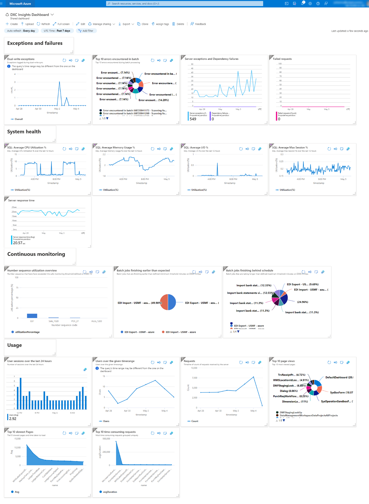
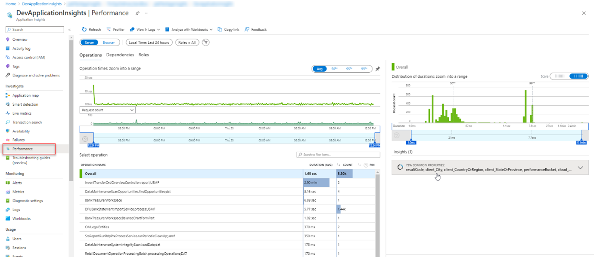
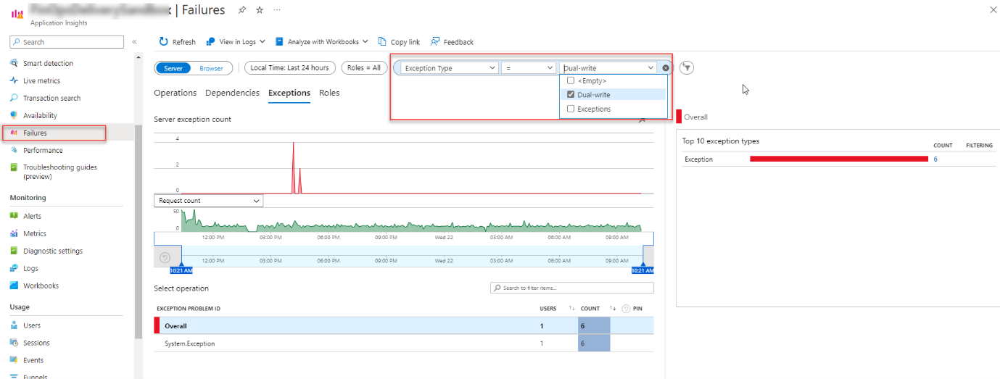
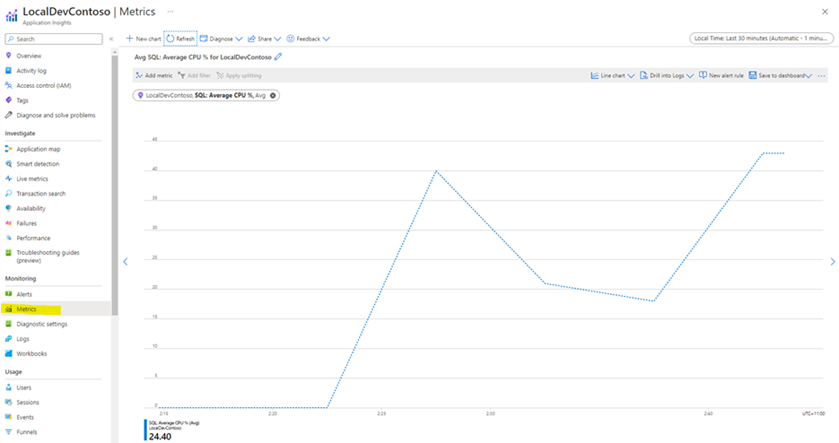

# DXC Insights Dashboards for Application Insights

Application Insights has always provided a summary overview pane to allow quick, at-a-glance assessment of your application's health and performance. 

### 1. DXC Insights Dashboard Overview. 
The DXC Insights dashboard gives a summarized overview of Exceptions and Failures, System health telemetry and Usage data for your application.

### 2. Performance
You get an overview of the most exhaustive menu items/forms to open and run, and jump into analytics with [Performance view](https://learn.microsoft.com/en-us/azure/azure-monitor/app/tutorial-performance) 
– get deep insights into how your Application or API and downstream dependencies are performing and find for a representative sample to [explore end to end](https://learn.microsoft.com/en-us/azure/azure-monitor/app/transaction-diagnostics). 

### 3.	Failures
Get an overview of the exceptions that are thrown due to errors on the [Failure view](https://learn.microsoft.com/en-us/azure/azure-monitor/app/tutorial-runtime-exceptions) – understand which components or actions are generating failures and triage errors and exceptions. 
The built-in views are helpful to track application health proactively and for reactive root-cause-analysis.

#### Dual-write exceptions
With the “Dual-write” telemetry logging enabled, see [Reoccurring monitoring](Reoccurring_monitoring.md#1-Configure-Periodic-monitoring), you can add an additional filter on the ‘Failures’ view to search for exceptions that get triggered during dual-write sync. 

On the ‘Failures’ view add a new filter pill, select ‘Exception Type’ as the property, and select ‘Dual-write’ as the value. Click ‘Refresh’ and a list of dual-write exceptions will get listed.

### 4.	Transaction Search
You can make a transaction search on the events in system based on data received from DXC Insights.

### 5.	Metrics
You can monitor performance and health metrics of SQL Database
  Read more about [Application Insights](https://learn.microsoft.com/en-us/azure/azure-monitor/app/app-insights-overview?tabs=net) and what it can do

