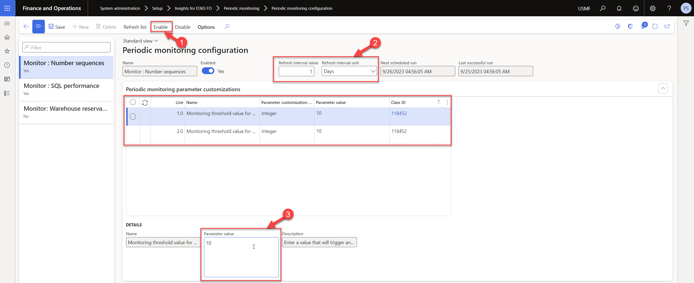
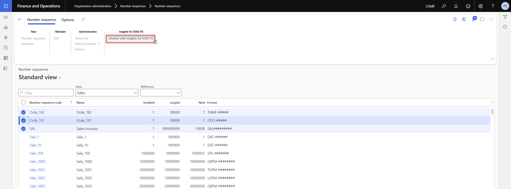
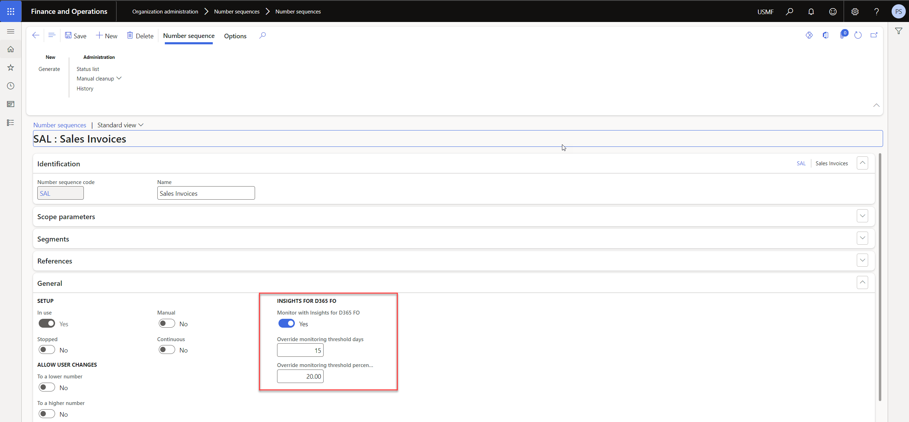

---
# required metadata

title: Insights for D365 FO
description: Insights for D365 FO - Number sequence monitoring
author: Patrick Sharma
manager: Kym Parker
ms.date: 2023-06-07
ms.topic: article
ms.prod: 
ms.service: dynamics-ax-applications
ms.technology: 

# optional metadata

ms.search.form: DXCInsights_MonitoringConfiguration, NumberSequenceTableListPage
audience: Application User/ Azure Administrators
# ms.devlang: 
ms.reviewer: Patrick Sharma
# ms.tgt_pltfrm: 
# ms.custom: ["21901", "intro-internal"]
ms.search.region: InsightsForD365FO
# ms.search.industry: [leave blank for most, retail, public sector]
ms.author: Patrick Sharma
ms.search.validFrom: 2023-03-28
ms.dyn365.ops.version: 10.0.32
---

# Number Sequence Monitoring
Number sequence monitoring in the context of D365 Finance and Operations refers to the continuous tracking of the utilization of number sequence codes. Users can actively monitor utilization rates of the number sequence codes, and setup alerts to create new number sequence codes when existing codes are nearing their end.

### 1. Number Sequence Monitoring Configuration
To setup monitoring on number sequence, users will need to :
1. Enable Number sequence monitoring on the [Periodic Monitoring Configuration form](Number_sequence_monitoring.md#1-number-sequence-monitoring-configuration). 
2. Define a Refresh interval value and Refresh interval unit for the frequency of Monitoring
3. Update the default threshold values for days / percentage that will trigger the event to be logged with Insights for D365 FO when the utilization aligns with the threshold value of remaining days or remaining percentage of number sequence codes. This is an optional setup, and can be overwritten at Number sequence line level

### 2. Select number sequences to monitor with Insights for D365 FO
Navigate to **Organization administration > Number sequences > Number sequences**, select the number sequence codes that you want to monitor, and click 'Monitor with Insights for D365 FO' from the action menu to enable monitoring on them.

You can overwrite the threshold values at line level of the Number sequence code. Open the detailed view of the Number sequence code, and expand the **General** tab. Enable 'Monitor with Insights for D365' if it has not been enabled. The default monitoring threshold values are automatically cascaded from the Number sequence monitoring parameters defined on the [Periodic Monitoring Configuration form](Number_sequence_monitoring.md#1-number-sequence-monitoring-configuration).  
You can override the threshold values for each number seqeunce code:

1. Override monitoring threshold days - Enter a value that will trigger an event with Insights for D365 when the expected number of days to fully utilize number sequence codes aligns with the specified threshold days value.

2. Override monitoring threshold percentage - Enter a value that will trigger an event with Insights for D365 when the remaining percentage of number sequence codes aligns with the specified threshold percentage value.

