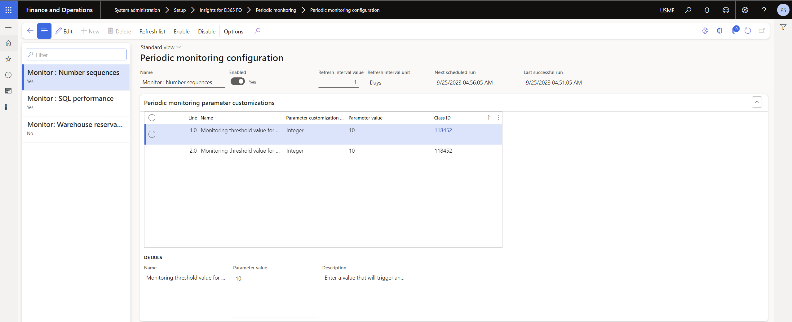
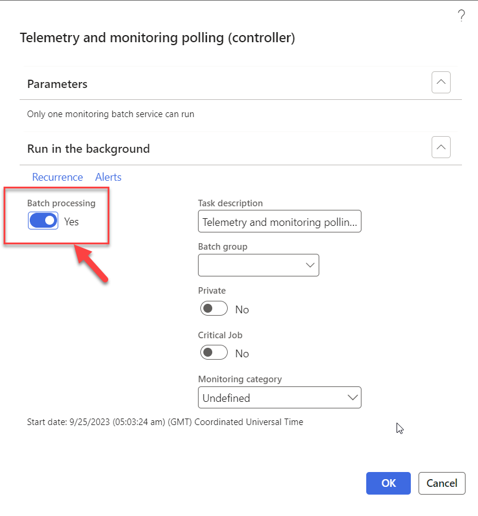

# Reoccurring monitoring
### 1. Configure Periodic monitoring  
Navigate to **System Administration > Setup > Configure monitoring**. If this is the first time you have opened the form, it will be empty. 
Click the menu button labeled ‘Refresh list’. This will scan the AOT and build a list of monitoring rules and their parameters. 
When you build a new monitoring rule, make sure to refresh so that it appears in the list.

By default, each rule is disabled. You can use the menu buttons at the top of the form to *‘Enable’* or *‘Disable’* the rule. Additionally, you can change how frequently this rule should run.

### 2.Start the Monitoring Batch Job
The monitoring rules focus on polling the current system health. This is accomplished through a single batch job that executes the monitoring business rules. Navigate to **System administrators > DXC Insights > Periodic monitoring > Monitoring batch service**

Only one instance is required, and it does not need a recurrence. The batch job will manage itself and sleep until the next time it needs to run. Leave the ‘Batch processing’ option at ‘No’ click *'OK'* to start the batch job. 

Once running, the monitoring batch job will re-scan for changes in settings and business rules. You can disable the batch job from **System administrators > DXC Insights > DXC Insights parameters > Periodic monitoring** tab if needed. Refer to section [Enable the Periodic monitoring](Reoccurring_monitoring.md#1-enable-the-periodic-monitoring)
