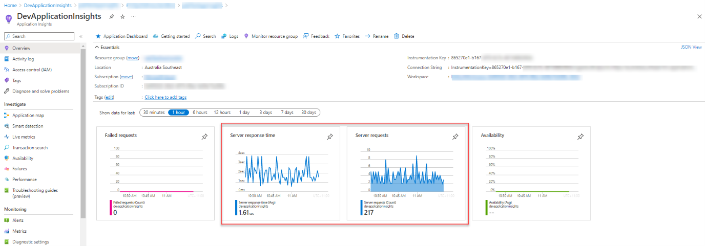
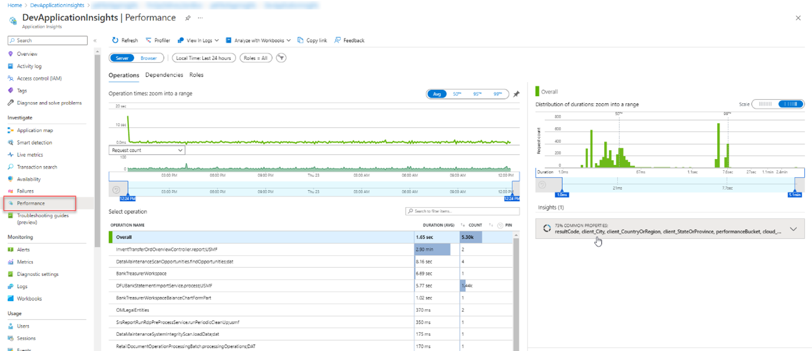
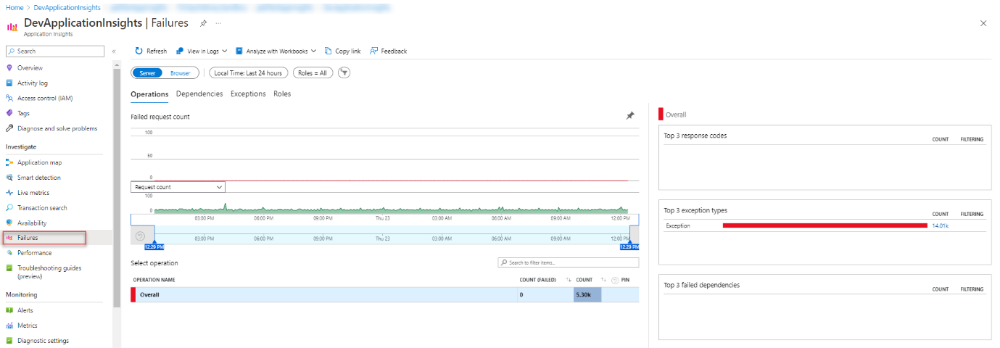
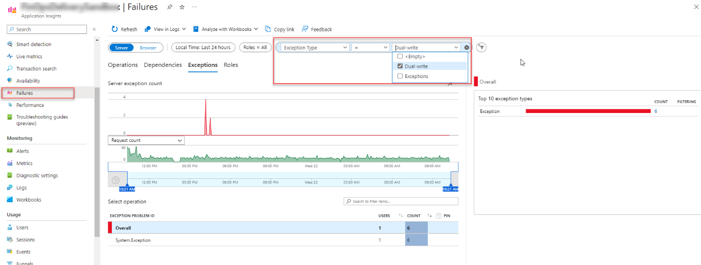
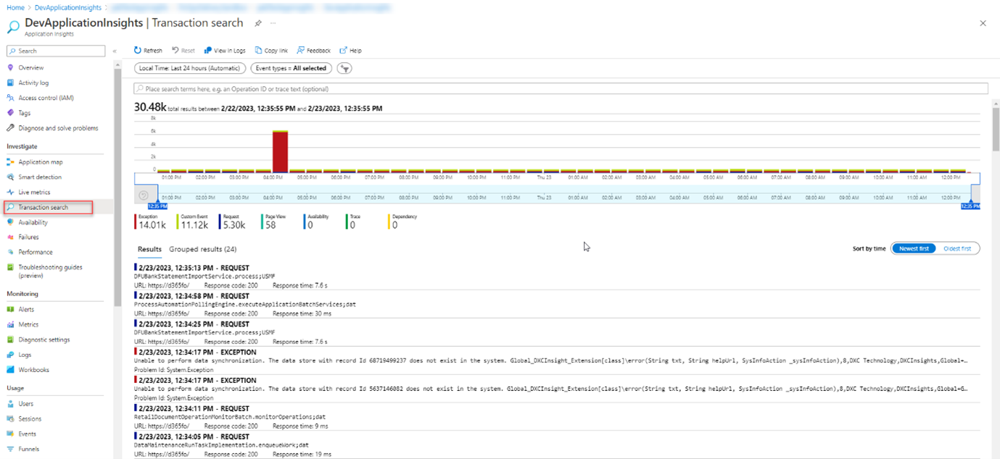
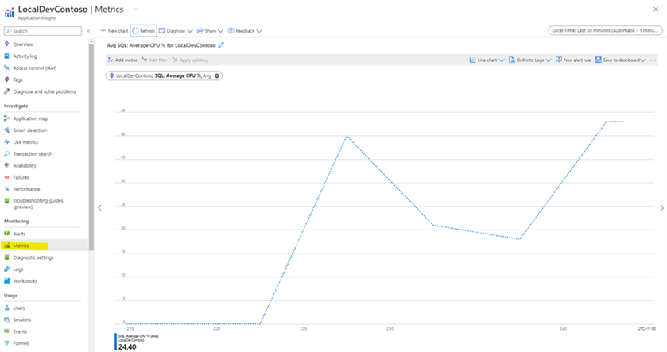

---
# required metadata

title: Insights for D365 FO
description: Insights for D365 FO - Monitoring Captured data
author: Patrick Sharma
manager: Kym Parker
ms.date: 2023-10-03
ms.topic: article
ms.prod: 
ms.service: dynamics-ax-applications
ms.technology: 

# optional metadata

ms.search.form: 
audience: Application User/ Azure Administrators
# ms.devlang: 
ms.reviewer: Patrick Sharma
# ms.tgt_pltfrm: 
# ms.custom: ["21901", "intro-internal"]
ms.search.region: InsightsForD365FO
# ms.search.industry: [leave blank for most, retail, public sector]
ms.author: Patrick Sharma
ms.search.validFrom: 2023-03-28
ms.dyn365.ops.version: 10.0.32
---

# Monitoring Captured Data 

The data sent by Insights for D365 FO can be viewed, queried and have monitoring rules applied to it in Azure application insights. The easiest way to get started consuming 
[Application insights](https://learn.microsoft.com/en-us/azure/azure-monitor/app/app-insights-overview?tabs=net#how-do-i-use-application-insights) is through the 
Azure portal and the built-in visual experiences. Advanced users can [query the underlying data](https://learn.microsoft.com/en-us/azure/azure-monitor/logs/log-query-overview)
directly to [build custom visualizations](https://learn.microsoft.com/en-us/azure/azure-monitor/app/tutorial-app-dashboards) through Azure Monitor Dashboards and 
Workbooks.

### 1. Overview
The overview page makes use of the data from Insights for D365 FO to give a quick overview of the load on the environment.

### 2. Performance
You get an overview of the most exhaustive menu items/forms to open and run, and jump into analytics with [Performance view](https://learn.microsoft.com/en-us/azure/azure-monitor/app/tutorial-performance) 
– get deep insights into how your Application or API and downstream dependencies are performing and find for a representative sample to [explore end to end](https://learn.microsoft.com/en-us/azure/azure-monitor/app/transaction-diagnostics). 

### 3.	Failures
Get an overview of the exceptions that are thrown due to errors on the [Failure view](https://learn.microsoft.com/en-us/azure/azure-monitor/app/tutorial-runtime-exceptions) – understand which components or actions are generating failures and triage errors and exceptions. 
The built-in views are helpful to track application health proactively and for reactive root-cause-analysis.

#### Dual-write exceptions
With the “Dual-write” telemetry logging enabled, see [Reoccurring monitoring](Reoccurring_monitoring.md#1-Configure-Periodic-monitoring), you can add an additional filter on the ‘Failures’ view to search for exceptions that get triggered during dual-write sync. 

On the ‘Failures’ view add a new filter pill, select ‘Exception Type’ as the property, and select ‘Dual-write’ as the value. Click ‘Refresh’ and a list of dual-write exceptions will get listed.

### 4.	Transaction Search
You can make a transaction search on the events in system based on data received from Insights for D365 FO.

### 5.	Metrics
You can monitor performance and health metrics of SQL Database
  Read more about [Application Insights](https://learn.microsoft.com/en-us/azure/azure-monitor/app/app-insights-overview?tabs=net) and what it can do

