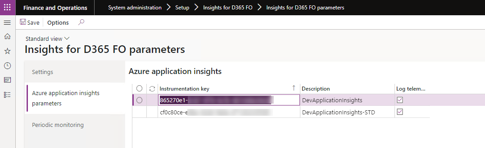

---
# required metadata

title: Insights for D365 FO
description: Insights for D365 FO - Setup
author: Patrick Sharma
manager: Kym Parker
ms.date: 2023-10-03
ms.topic: article
ms.prod: 
ms.service: dynamics-ax-applications
ms.technology: 

# optional metadata

ms.search.form: DXCInsightsParameters
audience: Application User/ Azure Administrators
# ms.devlang: 
ms.reviewer: Patrick Sharma
# ms.tgt_pltfrm: 
# ms.custom: ["21901", "intro-internal"]
ms.search.region: InsightsForD365FO
# ms.search.industry: [leave blank for most, retail, public sector]
ms.author: Patrick Sharma
ms.search.validFrom: 2023-03-28
ms.dyn365.ops.version: 10.0.32
---

# Insights for D365 FO Set up (with Azure Application Insights)

###	1. Azure Application Insights instance
Start by creating a new Application Insights instance in Azure. See [MS doc](https://docs.microsoft.com/en-us/azure/azure-monitor/app/create-new-resource)

Copy the Instrumentation Key. This will be used to link the Insights for D365 FO logger to your Azure Application Insights instance.

### 2.	Feature Activation  
Find and activate the feature ‘Insights for D365 FO’ to enable telemetry logging.

 
### 3.	Insights for D365 FO Parameters
Navigate to  **System administrators > Setup > Insights for D365 FO > Insights for D365 FO parameters.** 

On the ‘Settings’ tab, update and save the types of telemetry that Insights for D365 FO will send to Azure Application Insights or your specified telemetry logger. 

**Insights for D365 FO telemetry monitoring configuration**

**Field** | **Description**
:--       |:--
**Exceptions** | When enabled in parameters, logs all internal exceptions to a dedicated exceptions table within Azure AppInsights.
**Form runs** | When enabled in parameters, logs all form opening and running events to a dedicated pageViews table within Azure AppInsights. Details on the form name, menu item name, user id, session id, and time duration required for loading the form will be logged. This telemetry will also facilitate the analysis of user behavior and form usage patterns.
**Report runs**  | When enabled in parameters, tracks all report executions (e.g Purchase Order confirmations) along with time duration required to run the report as requests in the Azure AppInsights requests table.
**Web services** | This parameter can be used to control the logging of web service calls to your D365 FO application. The telemtry logging on web services is not an out-of-box feature, but can be implemented on your custom web service calls as an extension.
**Business events** | When enabled in parameters, logs all active business events that are triggered within you D365 FO (e.g., Purchase Order confirmation business event) to the Azure AppInsights custom events table.
**OData calls**  | When enabled in parameters, logs all ODATA calls (Create, read, Update, delete) to the custom events table on Azure AppInsights.
**Custom events** | This parameter can be used to control the logging of any other custom telemetry logging extensions that you have made to you application with Insights for D365 FO.
**Dual-write** | When enabled in parameters, logs all exceptions that arise during a dual-write sync to a dedicated exceptions table within Azure AppInsights and tags the exception type as "Dual-write". This is an additional feature controlled by its own feature key **Insights for D365 FO Dual Write**. Refer to [Feature management](./Release-notes.md#feature-management)
**Session termination**  | When enabled in parameters, logs telemetry on all unexpected session shutdown / termibnation causing an interrupt in the system to the custom events table on Azure AppInsights.
**Batch jobs** | When enabled in parameters, logs telemetry on all batch jobs as it finishes execution (including key details like batch job id, duration etc) to the custom events table on Azure AppInsights. Batch jobs that fail during execution will also be logged, and a corresponding record will be created to the exceptions table on Azure AppInsights with details on the error that ocurred. Refer to [Batch monitoring setup](./Batch_job_monitoring.md#batch-job-monitoring-setup)
**Batch tasks** | When enabled in parameters, logs telemetry on all batch tasks as it finishes execution to the custom events table on Azure AppInsights.
**User management changes**  | When enabled in parameters, logs all addition/removal of users to the custom events table on Azure AppInsights.
**User access changes**  | When enabled in parameters, logs all changes in roles of users to the custom events table on Azure AppInsights.

### 4.	Configure the Azure Application Insights telemetry
On the 'Azure application insights parameters’ tab, create a new record and paste the key you copied earlier from the [Azure Application Insights instance](setup.md#1-Azure-Application-Insights-instance) step into the ‘Instrumentation key’ field. Enter a description for the instance and enable the ‘Log telemetry’ field to allow telemetry to be logged to the Azure Application Insights instance. More than one Application insights instance can be added and enabled.

### 5.	Enable the Periodic monitoring  
Navigate to **System administrators > Setup > Insights for D365 FO > Insights for D365 FO parameters > Periodic monitoring** and enable the periodic monitoring batch service.

The 'Minimum refresh frequency' refer to the minimum recurrence time (in minutes) of the periodic monitoring batch job. The recommended minimum refresh frequency is atleast 5 minutes to reduce impact on performance.

