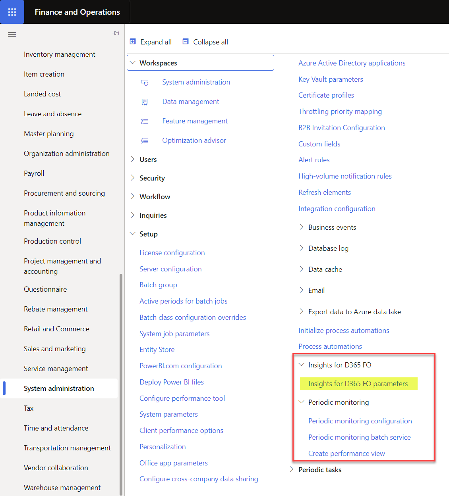
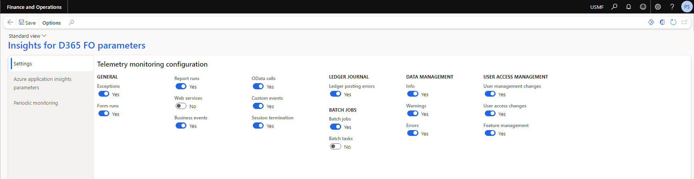
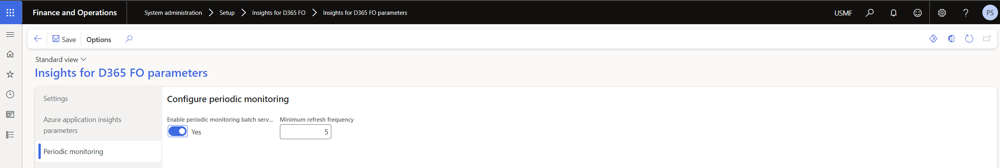

---
# required metadata

title: Insights for D365 FO
description: Insights for D365 FO - Setup
author: Patrick Sharma
manager: Kym Parker
ms.date: 2023-06-07
ms.topic: article
ms.prod: 
ms.service: dynamics-ax-applications
ms.technology: 

# optional metadata

ms.search.form: DXCInsightsParameters
audience: Application User/ Azure Administrators
# ms.devlang: 
ms.reviewer: Patrick Sharma
# ms.tgt_pltfrm: 
# ms.custom: ["21901", "intro-internal"]
ms.search.region: InsightsForD365FO
# ms.search.industry: [leave blank for most, retail, public sector]
ms.author: Patrick Sharma
ms.search.validFrom: 2023-03-28
ms.dyn365.ops.version: 10.0.32
---

# Insights for D365 FO Set up (with Azure Application Insights)

###	1. Azure Application Insights instance
Start by creating a new Application Insights instance in Azure. See [MS doc](https://docs.microsoft.com/en-us/azure/azure-monitor/app/create-new-resource)

Copy the Instrumentation Key. This will be used to link the Insights for D365 FO logger to your Azure Application Insights instance.

### 2.	Feature Activation  
Find and activate the feature ‘Insights for D365 FO’ to enable telemetry logging.

 
### 3.	Insights for D365 FO Parameters
Navigate to  **System administrators > Setup > Insights for D365 FO > Insights for D365 FO parameters.** 

On the ‘Settings’ tab, update and save the types of telemetry that Insights for D365 FO will send to Azure Application Insights or your specified telemetry logger. 

### 4.	Configure the Azure Application Insights telemetry
On the 'Azure application insights parameters’ tab, create a new record and paste the key you copied earlier from the [Azure Application Insights instance](setup.md#1-Azure-Application-Insights-instance) step into the ‘Instrumentation key’ field. Enter a description for the instance and enable the ‘Log telemetry’ field to allow telemetry to be logged to the Azure Application Insights instance. More than one Application insights instance can be added and enabled.

### 5.	Enable the Periodic monitoring  
Navigate to **System administrators > Setup > Insights for D365 FO > Insights for D365 FO parameters > Periodic monitoring** and enable the periodic monitoring batch service.

The 'Minimum refresh frequency' refer to the minimum recurrence time (in minutes) of the periodic monitoring batch job. The recommended minimum refresh frequency is atleast 5 minutes to reduce impact on performance.

