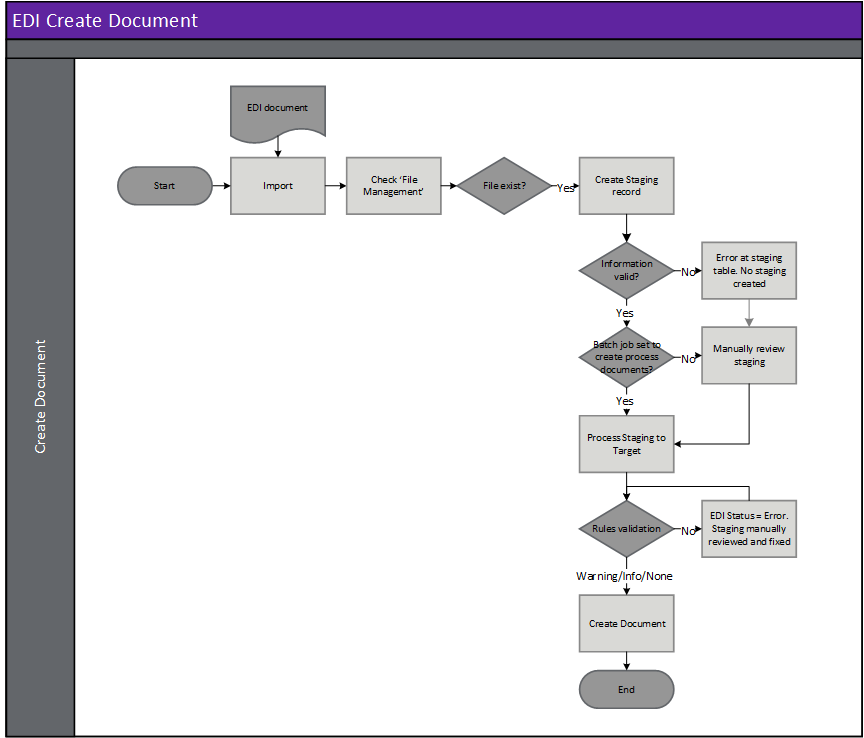

---
# required metadata

title: [EDI 3PL]
description: [EDI 3PL Documents - Inventory adjustment - Reconciliation]
author: [jdutoit2]
manager: Kym Parker
ms.date: 24/11/2021
ms.topic: article
ms.prod: 
ms.service: dynamics-ax-applications
ms.technology: 

# optional metadata

# ms.search.form:  [EDI]
audience: [Application User]
# ms.devlang: 
ms.reviewer: [jdutoit2]
ms.search.scope: [Which Operations client to show this topic as help for, to be set by content strategist, see list here: https://microsoft.sharepoint.com/teams/DynDoc/_layouts/15/WopiFrame.aspx?sourcedoc={23419e1c-eb64-42e9-aa9b-79875b428718}&action=edit&wd=target%28Core%20Dynamics%20AX%20CP%20requirements%2Eone%7C4CC185C0%2DEFAA%2D42CD%2D94B9%2D8F2A45E7F61A%2FVersions%20list%20for%20docs%20topics%7CC14BE630%2D5151%2D49D6%2D8305%2D554B5084593C%2F%29]
# ms.tgt_pltfrm: 
# ms.custom: [used by loc for topics migrated from the wiki]
ms.search.region: [Global for most topics. Set Country/Region name for localizations]
# ms.search.industry: [leave blank for most, retail, public sector]
ms.author: [author's Microsoft alias]
ms.search.validFrom: [month/year of release that feature was introduced in, in format yyyy-mm-dd]
ms.dyn365.ops.version: [name of release that feature was introduced in, see list here: https://microsoft.sharepoint.com/teams/DynDoc/_layouts/15/WopiFrame.aspx?sourcedoc={23419e1c-eb64-42e9-aa9b-79875b428718}&action=edit&wd=target%28Core%20Dynamics%20AX%20CP%20requirements%2Eone%7C4CC185C0%2DEFAA%2D42CD%2D94B9%2D8F2A45E7F61A%2FVersions%20list%20for%20docs%20topics%7CC14BE630%2D5151%2D49D6%2D8305%2D554B5084593C%2F%29]
---

# Inventory adjustment - Reconciliation

A 3PL warehouse, setup as an EDI trading partner, can send an **Inventory adjustment - Reconciliation** document which will compare the 3PL's stock to D365 stock for the warehouse in the EDI Inventory reconciliation page as at the end of the specified date. Accepted variances will be posted as a D365 movement journal.

Document settings will also specify:
- Which movement journal name to use for the adjustment.
- Ability to reconcile all on-hand for the warehouse. This will count zero for all the items not sent by the 3PL.
- Auto close option allows automatically accepting all variances and posting the movement journal. No manual accept/reject required if set to Yes.
- Create batch allows new D365 batches to be created based on the 3PL's batch details.

The following subsections will describe how to view and process the **Inventory adjustment - Reconciliation** from the 3PL warehouse.  
Viewing the [Staging table records](#view-staging-table-records) will also be discussed.

## Prerequisites
The following setup is prerequisites for the Inventory adjustment - Reconciliation

### 3PL setup
EDI > Setup > 3PL setup
1. Create [Inventory status Id mapping](../SETUP/3PL-SETUP/Inventory-status-Id-mapping.md) to map the 3PL's values to D365 inventory statuses.

### Document type setup
EDI > Setup > Document types: Inventory adjustment - Reconciliation
1. Create [Template](../../CORE/Setup/DocumentTypes/File-templates.md) for the document.
1. Create [Setting profile](../SETUP/SETTING-PROFILES/Inventory-adjustment-advice---Reconciliation.md) for the document.

### Trading partners
EDI > Setup > Trading partners
1. If the warehouse [trading partner](../SETUP/Trading-partner.md) doesn't exist, create the new trading partner.
1. Assign the 3PL setup to the warehouse trading partner's options:
    -  Inventory status Id mapping: Options from **EDI > Setup > 3PL setup > Inventory status Id mapping**
1. Add and enable the **Inventory adjustment - Reconciliation** document to the [Warehouse trading partner](../SETUP/Trading-partner.md) and select the applicable:
    - Template
    - Setting profile
    - Search mask

## Processing
Inbound files have the following three steps:
1. **Import** - Imported file can be viewed in **EDI > Files > Inbound files**.
2. **Import to staging** - Imported file is processed to staging record/s. The staging record/s can be viewed at **EDI > Documents > 3PL documents > Inventory adjustment > Inventory adjustment - Reconciliation**.
3. **Staging to target** - The staging record/s is processed to target. If the EDI document is succefully processed the target EDI Inventory reconciliation will be created where users can either manually accept/reject variances, or automatically posted if document setting allows.

### Create document

### Header checks for Inventory adjustment
Header checks are performed when:
1. Importing Inventory adjustment file
2. Processing from import to staging
3. Processing from staging to target

### Step 1 - Import
When an EDI file is imported, the file name is key to identifying the trading partner and therefore the document template. See [Trading partners](../../CORE/Setup/Trading-partners.md) for further details.  It is based on this document template that the data within the file is identified and a record created in the EDI staging table in the next step.

> Note: The file mask is used to identify the trading partner and therefore template

### Step 2 - Import to staging - Inbound file validation
When the EDI file is retrieved and imported, there are various validations that are completed before the staging record is created in the EDI staging table.
If the processing of **Import to staging** errors, the Inbound file's **Status** will be set to _Error_ and no staging record created.

**Rule Id**         |	**Details**         
:--                 |:--                  
**Check Template**  |	Identify a template for the Trading partner/Document type. This will be used to identify the whereabouts of data within the file

#### Possible issues and fixes
**Import to staging** errors for EDI file can be viewed in:
- **EDI > Files > Inbound files** filtered to **Status** set to _Error_
- **EDI > Document maintenance**, tab **3PL documents**, tile **File import errors**

At this step the issues are usually around the file not matching the template.
- Does the file have the correct template assigned (General tab, field **Template**):
  - **No**: Use **Reset template** to assign a different template. If this should apply to future documents for the Trading partner, also update in **Trading partners**.
  - **Yes**: Review **Log** and fix the applicable template in **EDI > Setup > Document types**. Examples issues are date format, new field.

Example error for file not matching template: 'Segment '<xml' not found in EDI template mapping'

### Step 3 - Staging to target
If the processing of **Staging to target** errors, the staging record's **Staging to target status** will be set to _Error_ and the EDI Inventory reconciliation won't be created for the staging record.

#### Possible issues and fixes
**Staging to target** errors for Inventory adjustment can be viewed in:
- **EDI > Documents > 3PL documents > Inventory adjustment > Inventory adjustment - Reconciliation** filtered to **Staging to target tatus** set to _Error_
- **EDI > Document maintenance**, tab **3PL documents**, tile **Inventory adjustment - Reconciliation errors**
- **EDI > Document maintenance**, tab **3PL documents**, **Documents** page, tab **Inventory adjustment - Reconciliation**

At this step the issues are usually around mapping/business logic issues.  
Review the **Log** or **Version log** for the applicable record to find the issue. Example errors and method to fix are discussed in below table.  
Example errors and possible fixes are discussed in [FAQ](../OTHER/FAQ.md#inventory-adjustment-reconciliation).

## View staging table records
To view the Inventory adjustment - Reconciliation staging records, go to **EDI > Documents > 3PL documents > Inventory adjustment > Inventory adjustment - Reconciliation**.  
Use this page to review staging and process the EDI documents, create the target EDI Inventory reconciliation where users can either manually accept/reject variances, or automatically posted if document setting allows.

### List page
The following EDI fields are available on the list page.

**Field**               | **Description**
:---                    |:---
**EDI number**          |	EDI Staging table record id. Select **EDI number** or the **Details** button on the Action Pane, to view the details for the selected record. The number sequence is determined by [EDI number](../../CORE/Setup/EDI-parameters.md#number-sequence) on the **EDI parameters**.
**Company account**     | Legal entity of the document.
**Company GLN**         | The company’s global location number is shown here.
**Staging to target status**    | The current status of the staging record. Options include:   • **Not Started** – The staging record has been successfully processed from the inbound file to the staging table but not processed to target.   • **Error** – The staging record has been processed from the staging table but no target has yet been created/updated.  There are errors with the staging record that needs to be reviewed.   • **Completed** – The staging record has been succesfully processed and created the EDI Inventory reconciliation.   • **Canceled** – The record has been manually canceled and will be excluded from processing.
**Trading partner account**     | Warehouse account assigned to the staging record.
**Trading partner GLN**         | The 3PL’s global location number is shown here.
**Inventory reconciliation**    | Inventory Reconciliation record that can be used to process adjustments if required.
**Created date and time**       | The date and time the selected record was created in the staging table.
**Sent**                        | Indicates if the **Functional acknowledgement outbound** has been sent to the trading partner for the inbound document record.

### Buttons
The following buttons are available on the **Inventory adjustment - Reconciliation**'s Action Pane, tab **Inventory adjustment - Reconciliation**.

**Button**	                    | **Description**
:---                            |:----
**Process inventory adjustment**| Process inventory adjustment for the selected record in the staging table.
**Process all inventory adjustments**	| Process inventory adjustments for the staging records that have a **Staging to target status** set to _Not started_.
**Inbound files**               | View the inbound file record the selected staging record.
**Trading partner**             | View the trading partner details in the [**Trading partners**](../SETUP/Trading-partner.md) page.
**Inventory reconciliation**    | If the EDI document has been completed it is possible to inquire on the EDI Inventory reconciliation from this button.
**Show log**                    | If there are Errors within the document, it is possible to review them at any time using this button. Shows only the current version.
**Version log**                 | View all log versions. When a document’s status is reset and reprocessed, a new log version is created. Can view all log versions.
**Reset Status**                | You can reset the **Staging to target status** to _Not started_. This can be used to reprocess the selected record/s. Documents can only be processed if **Staging to target status** is set to _Not started_.
**Edit reset status recurrence**    | If the underlying issue was resolved after all the reset attempts have been completed the user can use this button to edit the recurrence field/s. This will:   • Update **Reset status profile** to _blank_   • Update the **Reset status date/time** to next time reset will run   • **Reset status attempts** set to _Zero_ and   • **Recurrence** text updated with changed recurrence details
**Cancel**                      | Select **Cancel** to update the **Staging to target status** to _Canceled_. Button is enabled when the **Staging to target status** is not set to _Completed_.

The following buttons are available on the **Inventory adjustment - Reconciliation**'s Action Pane, tab **Acknowledgement**.
The **Acknowledgement** tab is available on all incoming documents staging pages and enables the user to process or view the **Functional acknowledgement outbound** that has been created for the inbound document.

**Button**	                    | **Description**
:---                            |:----
**Send to EDI**                 | If the **Sent** field for the staging record is set to _No_, use this button to create the **Functional acknowledgement outbound** record and also update the **Sent** field to _Yes._
**Reset flag**                  | If the **Sent** field for the staging record has been set to _Yes_, use this button to reset **Sent** to _No_.
**Functional acknowledgement**  | Use this button to view the **Functional acknowledgement outbound** record created for the inbound document.

### Header fields
The following EDI Header staging fields are available on the header page.

**Field**	            | **Description**	                                    | **D365 header target**
:---                    |:---                                                   |:---
<ins>**Identification FastTab**</ins>
<ins>**Identification**</ins>		
**EDI number**          | EDI Staging table record id                           | 
**Company account**     | Legal entity of the document
**Company GLN**         | The company’s global location number is shown here.   | 
**Staging to target status**    |  The current status of the staging record. Options include:   • **Not Started** – The staging record has been successfully processed from the inbound file to the staging table but not processed to target.   • **Error** – The staging record has been processed from the staging table but no target has yet been created/updated.  There are errors with the staging record that needs to be reviewed.   • **Completed** – The staging record has been succesfully processed and created the EDI Inventory reconciliation.   • **Canceled** – The record has been manually canceled and will be excluded from processing.
<ins>**Reset status**</ins>		
**Reset status profile**    | Reset status profile assigned to the file/document. This will default from EDI shared parameters or can be overridden on Trading partner’s incoming and outgoing documents. The profile can also be changed to another profile which will also reset the **Reset status attempts** to 0 and reset the **Reset status date/time**	
**Reset status date/time**  | Next date/time automatic reset status will run	
**Reset status attempts**   | Number of reset attempts already processed. The reset attempts will stop once this number reaches the **End after** as per assigned **Reset status profile**’s Recurrence	
**Recurrence**              | Recurrence text. Contains standard details of Recurrence, for example:   •	Interval (recurrence pattern)   • How many times the period will run (End after)   • From date/time the recurrence will start	 

### Line fields
The following EDI Line fields are available on the lines page.   

**Field**                   | **Description**                                                           | **D365 line target**
:---                        |:---                                                                       |:---
**Item number**             | The D365 item id                                                          | Movement journal line > Item number
**Quantity counted**        | 3PL's on hand quantity.   Note: Quantity in the staging table is the counted quantity.  The quantity in the movement journal is the variance between counted and D365 current on-hand at the end of the specified date.	| 3PL Quantity minus D365 Quantity = Movement journal line > Quantity
**Colour**                  | Product dimensions – Colour	                                            | Movement journal line > Colour
**Size**                    | Product dimensions – Size	                                                | Movement journal line > Size
**Style**                   | Product dimensions – Style	                                            | Movement journal line > Style
**Configuration**           | Product dimensions – Configuration	                                    | Movement journal line > Configuration
**Serial number**           | Tracking dimensions – Serial number	                                    | Movement journal line > Serial number
**Batch number**            | Tracking dimensions – Batch number.   If D365 batch doesn’t exists, and document setting **Create batch** allows batch creation this will be used in creating the new D365 batch.	                 | Movement journal line > Batch number
**Manufacturing date**      | If D365 batch doesn’t exists, and document setting **Create batch** allows batch creation this will be used in creating the new D365 batch. Doesn't update an existing D365 batch.	| Batches > Manufacturing date
**Expiration date**         | If D365 batch doesn’t exists, and document setting **Create batch** allows batch creation this will be used in creating the new D365 batch. Doesn't update an already D365 batch.	| Batches > Expiration date
**Inventory status**   | Storage dimensions – Inventory status.   Mapped value for [Inventory status](../SETUP/3PL-SETUP/Inventory-status-Id-mapping.md) | Movement journal line > Inventory status

## EDI Inventory reconciliation
Users can navigate to either of the following two optoins to review and process EDI Inventory Reconciliations.
- EDI > Inquiries and reports > Inventory reconciliation
- Via staging record - EDI > Documents > 3PL documents > Inventory adjustment > Inventory adjustment - Reconciliation, filtering to applicable record and selecting button **Inventory reconciliation**

This page is used to manually review variances and either accepting or rejecting. Once review is complete, the user will create the movement journal for the variances and mark the reconciliation as closed which will prevent any further changes and posting the movement journal.

### Review variance lines
1.	Review each of the lines and investigate the variances.
2.	For each line, use the **Accept** or **Reject** button to manually manage which variance 
3.	Additional notes can be added to validate the reason for the decision on the Line details FastTab.

### Create journal
The movement journal can either be created individually per line, or all accepted lines.

#### Create journal individually
1.	As each line is accepted, the user can select **Create journal**.
2.	To create a new journal per line, select OK.
3.	Else to add the variance to a single journal, select add to existing journal and select the journal to use.
4.	If required, **Auto post journal** can be selected, else the movement journal will be created only.
5.	Select OK

#### Create journal for all lines
1.	Once all lines have been updated to **Accepted** or **Rejected**, select all lines
2.	Select **Create journal**
3.	If required, **Auto post journal** can be selected, else the movement journal will be created only.
4.	Select OK

### Mark as closed
A reconciliation journal must be closed to identify no further action is required.
- Select **Mark as closed**. A dialog will appear allowing the user to decide what actions to take.
- For **Pending lines** where variance hasn't been accepted/rejected: Accept or Reject all pending	lines
- For **Accepted lines** that haven't been allocated to a journal:
    - **Add unallocated lines to a journal** - If not selected, a D365 movement journal will not be created/posted for the line.
    - **Add to existing journal** - Where **Add unallocated lines to a journal** is set to _Yes_, select _Yes_ to add accepted variances to an existing journal or _No_ to create a new journal
    - If **Add to existing journal** was set to _Yes_, select the journal the accepted variances should be added to.
- **Post all open journals** - Select _Yes_ to post all created but unposted movement journals.

### View Inventory reconciliation records

Users can navigate to either of the following two optoins to review and process EDI Inventory Reconciliations.
- EDI > Inquiries and reports > Inventory reconciliation
- Via staging record - EDI > Documents > 3PL documents > Inventory adjustment > Inventory adjustment - Reconciliation, filtering to applicable record and selecting button **Inventory reconciliation**

#### List page
The following EDI fields are available on the list page.

Field	                | Description
:--                     |:--
**Reconciliation Id**   | EDI Reconciliation table record id
**Site**                | Site for the reconciliation
**Warehouse**           | Warehouse for the reconciliation
**Date**                | Date of the reconciliation
**Lines**               | Number of lines included in the reconciliation
**Variance lines**      | Number of lines with a variance between on-hand and counted in the reconciliation
**Pending lines**       | Number of lines still pending in the reconciliation
**Rejected lines**      | Number of lines rejected in the reconciliation
**Closed**              | Identification of reconciliation status
**Closed on**           | The date and time the selected record was closed
**Closed by**           | The user who closed the reconciliation

#### Header fields
The following EDI Header staging fields are available on the header page.

Field	                | Description                           | D365 header target
:--                     |:--                                    |:--
**Reconciliation Id**   | EDI Reconciliation table record id
**Warehouse**           | Warehouse for the reconciliation      | Movement journal > Warehouse
**Date**                | Date of the reconciliation            | Movement journal line > Date

#### Line fields
The following EDI Line fields are available on the lines page.   

**Field**                   | **Description**                                                           | **D365 line target**
:---                        |:---                                                                       |:---
**Item number**             | The D365 item id                                                          | Movement journal line > Item number
**Colour**                  | Product dimensions – Colour	                                            | Movement journal line > Colour
**Size**                    | Product dimensions – Size	                                                | Movement journal line > Size
**Style**                   | Product dimensions – Style	                                            | Movement journal line > Style
**Configuration**           | Product dimensions – Configuration	                                    | Movement journal line > Configuration
**Version**                 | Product dimensions – Version                                              | Movement journal line > Version
**Inventory status**        | Storage dimensions – Inventory statu.   Mapped value for [Inventory status](../SETUP/3PL-SETUP/Inventory-status-Id-mapping.md) | Movement journal line > Inventory status
**Batch number**            | Tracking dimensions – Batch number	                                    | Movement journal line > Batch number
**On-hand**                 | Physical D365 Inventory on-hand at end of specified date	
**Quantity counted**        | 3PL Counted quantity from the file	
**Quantity variance**       | Variance between D365 on-hand and 3PL counted quantity	                | Movement journal line > Quantity
**Status**                  | The current status of the line.   Options include:   • **Pending** – The line should be investigated and accepted or rejected.   • **Accepted** – The line variance has been accepted and arrival journal should be created and posted. Lines with no variances are automatically marked as accepted.   • **Rejected** – The line variance has been rejected. Please add notes to document the reason the line was rejected.	
**Journal**                 | The journal created for accepted lines	                                | Populated by Movement journal > Journal
**Posted**                  | Identify that the journal has been posted	                                | Populated by Movement journal > Posted

> Note: 
> 1.	If the Inventory journal has been created but not posted, and reconciliation line is changed to rejected: The applicable movement journal line must be manually deleted from the already created inventory journal.
> 2.	Movement journals are utilised to update the stock on-hand with the variance calculated. This means the open movement journal doesn’t lock the applicable stock for creating additional count journals.
