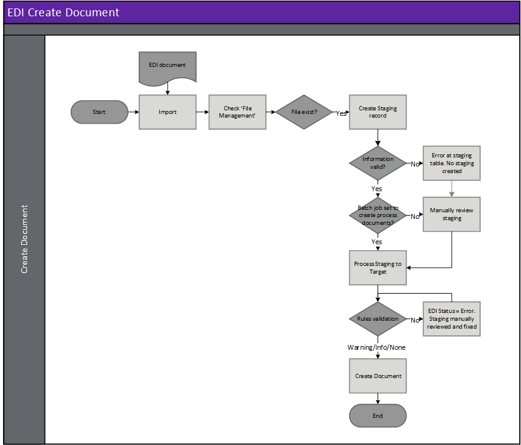

---
# required metadata

title: [EDI 3PL]
description: [EDI 3PL Documents - Picking list registration]
author: [jdutoit2]
manager: Kym Parker
ms.date: 22/11/2021
ms.topic: article
ms.prod: 
ms.service: dynamics-ax-applications
ms.technology: 

# optional metadata

# ms.search.form:  [Operations AOT form name to tie this topic to]
audience: [Application User]
# ms.devlang: 
ms.reviewer: [jdutoit2]
ms.search.scope: [Which Operations client to show this topic as help for, to be set by content strategist, see list here: https://microsoft.sharepoint.com/teams/DynDoc/_layouts/15/WopiFrame.aspx?sourcedoc={23419e1c-eb64-42e9-aa9b-79875b428718}&action=edit&wd=target%28Core%20Dynamics%20AX%20CP%20requirements%2Eone%7C4CC185C0%2DEFAA%2D42CD%2D94B9%2D8F2A45E7F61A%2FVersions%20list%20for%20docs%20topics%7CC14BE630%2D5151%2D49D6%2D8305%2D554B5084593C%2F%29]
# ms.tgt_pltfrm: 
# ms.custom: [used by loc for topics migrated from the wiki]
ms.search.region: [Global for most topics. Set Country/Region name for localizations]
# ms.search.industry: [leave blank for most, retail, public sector]
ms.author: [author's Microsoft alias]
ms.search.validFrom: [month/year of release that feature was introduced in, in format yyyy-mm-dd]
ms.dyn365.ops.version: [name of release that feature was introduced in, see list here: https://microsoft.sharepoint.com/teams/DynDoc/_layouts/15/WopiFrame.aspx?sourcedoc={23419e1c-eb64-42e9-aa9b-79875b428718}&action=edit&wd=target%28Core%20Dynamics%20AX%20CP%20requirements%2Eone%7C4CC185C0%2DEFAA%2D42CD%2D94B9%2D8F2A45E7F61A%2FVersions%20list%20for%20docs%20topics%7CC14BE630%2D5151%2D49D6%2D8305%2D554B5084593C%2F%29]
---

# Picking list registration

The following subsections will describe how to view and process the picking list registration from the 3PL warehouse.  
Viewing the [Staging table records](#view-staging-table-records) will also be discussed.

If the 3PL doesn't pick all the original picking list lines/short pick:
- The lines not included in the inbound picking list registration's **Handling status** will be marked as **Canceled**
- The company will need to generate a new D365 picking list if the remaining lines and short picked quantities still requires picking

Optional document settings also allow posting the sales order's delivery note and/or shipping the transfer order.

## Prerequisites
The following setup is prerequisites for the picking list registration

1. Create [Inventory status Id mapping](../SETUP/3PL%20SETUP/Inventory%20status%20Id%20mapping.md) to map the 3PL's values to D365 inventory statuses.
1. Create [Template](../../CORE/Setup/DocumentTypes/File%20templates.md) for the document.
1. Create [Setting profile](../SETUP/SETTING%20PROFILES/Picking%20list%20registration.md) for the document.
1. Create [Validation profile](../SETUP/VALIDATION%20PROFILES/Picking%20list%20registration.md) for the document.
1. If the warehouse [trading partner](../SETUP/Trading%20partner.md) doesn't exist, create the new trading partner.
1. Assign the 3PL setup to the warehouse trading partner's options.
1. Add and enable the **picking list** document to the [Warehouse trading partner](../SETUP/Trading%20partner.md) and select the applicable:
    - Template
    - Setting profile
    - Validation profile
    - Search mask

## Processing
Inbound files have the following three steps:
1. **Import** - Imported file can be viewed in **EDI > Files > Inbound files**.
2. **Import to staging** - Imported file is processed to staging record/s. The staging record/s can be viewed at **EDI > Documents > 3PL documents > Picking list registration**.
3. **Staging to target** - The staging record/s is processed to target. If the EDI picking list registration is succefully processed the D365 stock will be picked. 

### Create document

### Header checks for Picking list registration
Header checks are performed when:
1. Importing Picking list registration file
2. Processing from import to staging
3. Processing from staging to target

### Step 1 - Import
When an EDI file is imported, the file name is key to identifying the trading partner and therefore the document template. See [Trading partners](../../CORE/Setup/Trading%20partners.md) for further details.  It is based on this document template that the data within the file is identified and a record created in the EDI staging table in the next step.

> Note: The file mask is used to identify the trading partner and therefore template

### Step 2 - Import to staging - Inbound file validation
When the EDI file is retrieved and imported, there are various validations that are completed before the staging record is created in the EDI staging table.
If the processing of **Import to staging** errors, the Inbound file's **Status** will be set to _Error_ and no staging record created.

**Rule Id**         |	**Details**         
:--                 |:--                  
**Check Template**  |	Identify a template for the Trading partner/Document type. This will be used to identify the whereabouts of data within the file

#### Possible issues and fixes
**Import to staging** errors for EDI file can be viewed in:
- **EDI > Files > Inbound files** filtered to **Status** set to _Error_
- **EDI > Document maintenance**, tab **3PL documents**, tile **File import errors**

At this step the issues are usually around the file not matching the template.
- Does the file have the correct template assigned (General tab, field **Template**):
  - **No**: Use **Reset template** to assign a different template. If this should apply to future documents for the Trading partner, also update in **Trading partners**.
  - **Yes**: Review **Log** and fix the applicable template in **EDI > Setup > Document types**. Examples issues are date format, new field.

Example error for file not matching template: 'Segment '<xml' not found in EDI template mapping'

### Step 3 - Staging to target
If the processing of **Staging to target** errors, the staging record's **Staging to target status** will be set to _Error_ and the D365 stock won't be be picked for the picking list registration.

#### Possible issues and fixes
**Staging to target** errors for Picking list registrations can be viewed in:
- **EDI > Documents > 3PL documents > Picking list registration** filtered to **Staging to target tatus** set to _Error_
- **EDI > Document maintenance**, tab **3PL documents**, tile **Picking list registration errors**
- **EDI > Document maintenance**, tab **3PL documents**, **Documents** page, tab **Picking list registration**

At this step the issues are usually around mapping/business logic issues.
Review the **Log** or **Version log** for the applicable record to find the issue. Example errors and method to fix are discussed in below table.

> Note: When the Version log displays an **Error type** of _Processing error_, the processing has stopped because of a standard D365 error and the **Message** will display the standard D365 error.  
> Note: Similar to manually processing a D365 transaction, EDI will stop at the first processing error and only this error is displayed. Fixing the error and reprocessing might result in subsequent standard processing errors which need to be dealt with.

#### Example header errors:
**Error message**       | **Error type**         | **Method to fix**
:---------------------- |:----                   |:----
Item %, dimensions: % Physical on-hand %=Available % cannot be picked because only % is/are available from the inventory    | Processing error  | Adjust D365 on-hand if staging record correct
Picking list % is in status Completed   | Wrong status  | The D365 picking list registration has already been completed. Verify if duplication and either fix record's picking route id or cancel staging record if duplication.

> Note: % contains staging data for the record

### Staging line validation - Picking list registration

**Rule Id**                 | **Details**                                               | Error    
:---                        |:---                                                       |:---              
**Line number / Lot Id / Item number / Inventory dimensions**   | Find the EDI picking list line number/ Lot Id to which the staging line belongs    | Error at Staging table.   D365 stock not picked

#### Possible issues and fixes
**Staging to target** errors for Picking list registration can be viewed in:
- **EDI > Documents > 3PL documents > Picking list registration** filtered to **Staging to target tatus** set to _Error_
- **EDI > Document maintenance**, tab **3PL documents**, tile **Picking list registration errors**
- **EDI > Document maintenance**, tab **3PL documents**, **Documents** page, tab **Picking list registration**

At this step the issues are usually around setup/business logic issues.
Review the **Log** or **Version log** for the applicable record to find the issue. Example errors and method to fix are discussed in below table.

#### Example line errors:
**Error message**                     | **Error type**         | **Method to fix**
:------------------------------------ |:----                   |:----
Unable to find an activated picking list line: %	                  | No line found         | EDI couldn't find the line based on line number/ lot id and item number/item dimensions. **EDI > Documents > 3PL documents > Picking list registration** and/or   **Product information management > Products > Released products**

### Validation

[Validation profiles](../SETUP/VALIDATION%20PROFILES/Picking%20list%20registration.md) can be specified and linked to the template along with a rule error tolerance which is used to determine how D365 will react.  Options are:
-	**Info** - An infolog is displayed with information only, it is not identified as a warning
-	**Warning** - An infolog is displayed with a warning. It is possible to carry on processing
-	**Error** - An infolog is displayed with an error. It is not possible to carry on processing until the error has been corrected. EDI Status = Error

The following table describes each validation option for the EDI document. It also describes if the validation rule is not met, but only has an info or warning error tolerance, how the D365 target will be created/updated.

Rule Id	                | Details	                            | Info/Warning tolerance updates
:--                     |:--                                    |:--
**Short pick**          | Where the pick list registration is less than the original pick list quantity | Post picking list registration even when short picked

## View staging table records
To view the Picking list registration staging records, go to **EDI > Documents > 3PL documents > Picking list registration**.  
Use this page to review staging and process EDI Picking list registration documents, pick the D365 stock and/or cancel picking list line(s).

### List page
The following EDI fields are available on the list page.

**Field**               | **Description**
:---                    |:---
**EDI number**          |	EDI Staging table record id. Select **EDI number** or the **Details** button on the Action Pane, to view the details for the selected record. The number sequence is determined by [EDI number](../../CORE/Setup/EDI%20parameters.md#number-sequence) on the **EDI parameters**.
**Company account**     | Legal entity of the document.
**Company GLN**         | The company’s global location number is shown here.
**Staging to target status**    | The current status of the staging record. Options include:   • **Not Started** – The staging record has been successfully processed from the inbound file to the staging table but not processed to target.   • **Error** – The staging record has been processed from the staging table but no target has yet been created/updated.  There are errors with the staging record that needs to be reviewed.   • **Completed** – The staging record has been succesfully processed and updated the D365 purchase order and sent a purchase order confirmation (where set to automatic).   • **Canceled** – The record has been manually canceled and will be excluded from processing.
**Trading partner account**     | Warehouse account assigned to the staging record.
**Trading partner GLN**         | The 3PL’s global location number is shown here.
**Picking route**               | Picking route number.
**Created date and time**       | The date and time the selected record was created in the staging table.
**Sent**                        | Indicates if the **Functional acknowledgement outbound** has been sent to the trading partner for the inbound document record.

### Buttons
The following buttons are available on the **Picking list registration**'s Action Pane, tab **Picking list registration import**.

**Button**	                    | **Description**
:---                            |:----
**Process pick list registration**   | Process picking list registration for the selected record in the staging table.
**Process all pick list registrations**   | Process picking list registration for the staging records that have a **Staging to target status** set to _Not started_. 
**Inbound files**               | View the inbound file record the selected staging record.
**Trading partner**             | View the trading partner details in the [**Trading partners**](../SETUP/Trading%20partner.md) page.
**Pick list registration**      | If the staging record has been completed it is possible to inquire on the pick list registration it updated from this button.
**Show log**                    | If there are Errors within the document, it is possible to review them at any time using this button. Shows only the current version.
**Version log**                 | View all log versions. When a document’s status is reset and reprocessed, a new log version is created. Can view all log versions.
**Reset Status**                | You can reset the **Staging to target status** to _Not started_. This can be used to reprocess the selected record/s. Documents can only be processed if **Staging to target status** is set to _Not started_.
**Edit reset status recurrence**    | If the underlying issue was resolved after all the reset attempts have been completed the user can use this button to edit the recurrence field/s. This will:   • Update **Reset status profile** to _blank_   • Update the **Reset status date/time** to next time reset will run   • **Reset status attempts** set to _Zero_ and   • **Recurrence** text updated with changed recurrence details
**Cancel**                      | Select **Cancel** to update the **Staging to target status** to _Canceled_. Button is enabled when the **Staging to target status** is not set to _Completed_.

The following buttons are available on the **Picking list registration**'s Action Pane, tab **Acknowledgement**.
The **Acknowledgement** tab is available on all incoming documents staging pages and enables the user to process or view the **Functional acknowledgement outbound** that has been created for the inbound document.

**Button**	                    | **Description**
:---                            |:----
**Send to EDI**                 | If the **Sent** field for the staging record is set to _No_, use this button to create the **Functional acknowledgement outbound** record and also update the **Sent** field to _Yes._
**Reset flag**                  | If the **Sent** field for the staging record has been set to _Yes_, use this button to reset **Sent** to _No_.
**Functional acknowledgement**  | Use this button to view the **Functional acknowledgement outbound** record created for the inbound document.

### Header fields
The following EDI Header staging fields are available on the header page.

**Field**	            | **Description**	                                    | **D365 header update**
:---                    |:---                                                   |:---
<ins>**Identification FastTab**</ins>
<ins>**Identification**</ins>		
**EDI number**          | EDI Staging table record id                           | History page on D365 sales order
**Company account**     | Legal entity of the document
**Company GLN**         | The company’s global location number is shown here.   | 
**Staging to target status**    |  The current status of the staging record. Options include:   • **Not Started** – The staging record has been successfully processed from the inbound file to the staging table but not processed to target.   • **Error** – The staging record has been processed from the staging table but no target has yet been created/updated.  There are errors with the staging record that needs to be reviewed.   • **Completed** – The staging record has been succesfully processed and updated the D365 purchase order and sent a purchase order confirmation (where set to automatic).   • **Canceled** – The record has been manually canceled and will be excluded from processing.
<ins>**Reset status**</ins>		
**Reset status profile**    | Reset status profile assigned to the file/document. This will default from EDI shared parameters or can be overridden on Trading partner’s incoming and outgoing documents. The profile can also be changed to another profile which will also reset the **Reset status attempts** to 0 and reset the **Reset status date/time**	
**Reset status date/time**  | Next date/time automatic reset status will run	
**Reset status attempts**   | Number of reset attempts already processed. The reset attempts will stop once this number reaches the **End after** as per assigned **Reset status profile**’s Recurrence	
**Recurrence**              | Recurrence text. Contains standard details of Recurrence, for example:   •	Interval (recurrence pattern)   • How many times the period will run (End after)   • From date/time the recurrence will start	
<ins>**General FastTab**</ins>	
<ins>**General**</ins>	
**Consignment note number** | Consignment note number received from the 3PL provider	| Pick route > Consignment note number
**Start date/time**         | Date/time the pick route was started	                    | Pick route > Start date/time
**End date/time**           | Date/time the pick route was completed	                | Pick route > End date/time
**Dispatch date**           | Shipping date/time	                                    | Sales order > Packing slip > Ship date
**Trading partner GLN**     | The 3PL’s global location number is shown here.	

### Line fields
The following EDI Line fields are available on the lines page.   

**Field**                   | **Description**                                                           | **D365 line update**
:---                        |:---                                                                       |:---
**Line number**             | Picking list line number. If ‘_Line number_ is used in **Line matching strategy** this needs to match to Line number from the related Picking list staging record.	| Used to find matching line when **Line matching strategy** is _Line number_
**Item number**             | The D365 item number                                                      | Used for validation
**Lot Id**                  | Lot id for the sales/transfer order line. If ‘_Lot ID_ is used in **Line matching strategy** this needs to match to Lot ID from the related Picking list staging record.	             | Used to find matching line when **Line matching strategy** is _Lot ID_
**Picked**                  | Picked Quantity	                                                        | Pick route line > Pick quantity
**SSCC**                    | SSCC received from the 3PL provider	                                    | Pick route line > SSCC
**Colour**                  | Product dimensions – Colour	                                            | Used for validation
**Size**                    | Product dimensions – Size	                                                | Used for validation
**Style**                   | Product dimensions – Style	                                            | Used for validation
**Configuration**           | Product dimensions – Configuration	                                    | Used for validation
**Batch number**            | Tracking dimensions – Batch number	                                    | Used for validation. If **Batch id** allows update, can also update Pick route line > Batch number
**Serial number**           | Tracking dimensions – Serial number	                                    | Pick route line > Serial number
**Inventory status**        | Storage dimensions – Inventory status. Mapped value for Inventory status  | Used for validation
