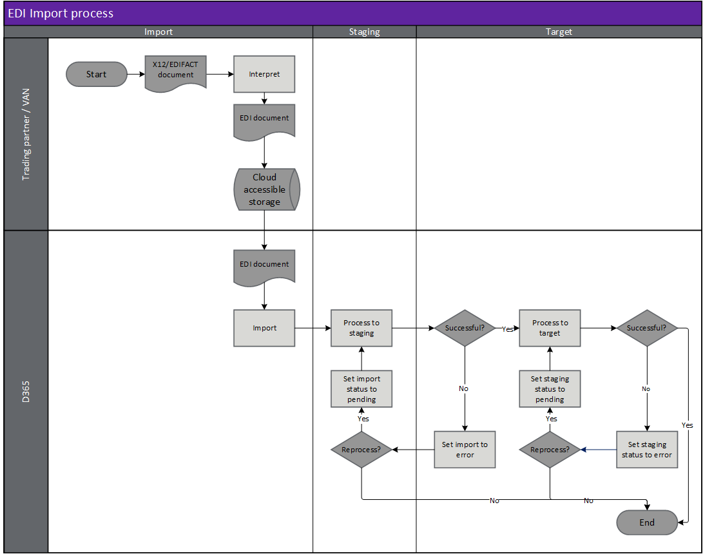
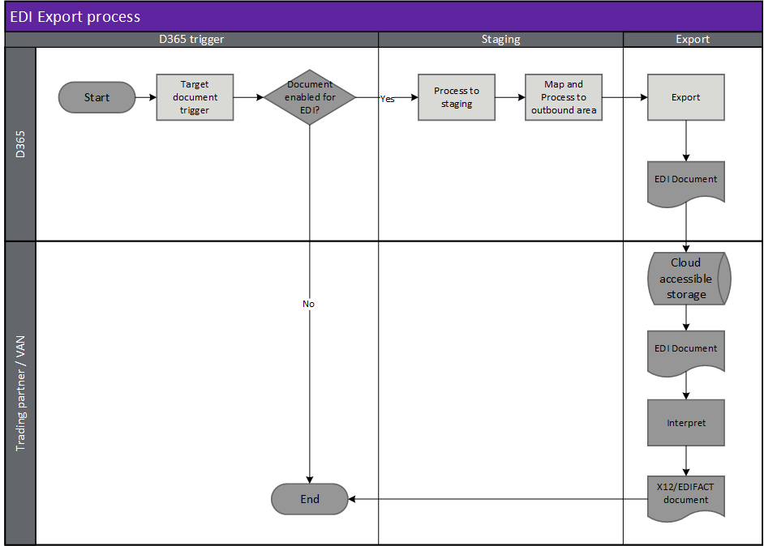

---
# required metadata

title: [EDI Process overview]
description: [Overview of the EDI import and export process]
author: [jdutoit2]
manager: Kym Parker
ms.date: 21/07/2021
ms.topic: article
ms.prod: 
ms.service: dynamics-ax-applications
ms.technology: 

# optional metadata

# ms.search.form:  [Operations AOT form name to tie this topic to]
audience: [Application User]
# ms.devlang: 
ms.reviewer: [jdutoit2]
ms.search.scope: [Which Operations client to show this topic as help for, to be set by content strategist, see list here: https://microsoft.sharepoint.com/teams/DynDoc/_layouts/15/WopiFrame.aspx?sourcedoc={23419e1c-eb64-42e9-aa9b-79875b428718}&action=edit&wd=target%28Core%20Dynamics%20AX%20CP%20requirements%2Eone%7C4CC185C0%2DEFAA%2D42CD%2D94B9%2D8F2A45E7F61A%2FVersions%20list%20for%20docs%20topics%7CC14BE630%2D5151%2D49D6%2D8305%2D554B5084593C%2F%29]
# ms.tgt_pltfrm: 
# ms.custom: [used by loc for topics migrated from the wiki]
ms.search.region: [Global for most topics. Set Country/Region name for localizations]
# ms.search.industry: [leave blank for most, retail, public sector]
ms.author: [author's Microsoft alias]
ms.search.validFrom: [month/year of release that feature was introduced in, in format yyyy-mm-dd]
ms.dyn365.ops.version: [name of release that feature was introduced in, see list here: https://microsoft.sharepoint.com/teams/DynDoc/_layouts/15/WopiFrame.aspx?sourcedoc={23419e1c-eb64-42e9-aa9b-79875b428718}&action=edit&wd=target%28Core%20Dynamics%20AX%20CP%20requirements%2Eone%7C4CC185C0%2DEFAA%2D42CD%2D94B9%2D8F2A45E7F61A%2FVersions%20list%20for%20docs%20topics%7CC14BE630%2D5151%2D49D6%2D8305%2D554B5084593C%2F%29]
---

# Process Overview

## Import process overview
The Trading partner or VAN will place data into a ‘cloud accessible’ location (i.e. FTP, SFTP or Azure blob) and D365 will periodically import these files into an inbound document staging area for processing.

D365 will use templates to read the data from the inbound documents and create staging data. The staging data is then processed into target documents within D365 and standard application processing rules are applied.

## Export process overview
An event in D365 will trigger an EDI document to be evaluated. If the document is enabled (based on an associated Trading partner) D365 will create staging data from the event’s information (i.e. invoice posting, picking list posting).

Once the staging data is created an appropriate template is applied to generate an EDI document file and placed into the outbound documents queue. 

The outbound documents queue is periodically processed, and the files are placed into their setup destinations for the Trading partner or VAN to retrieve.

