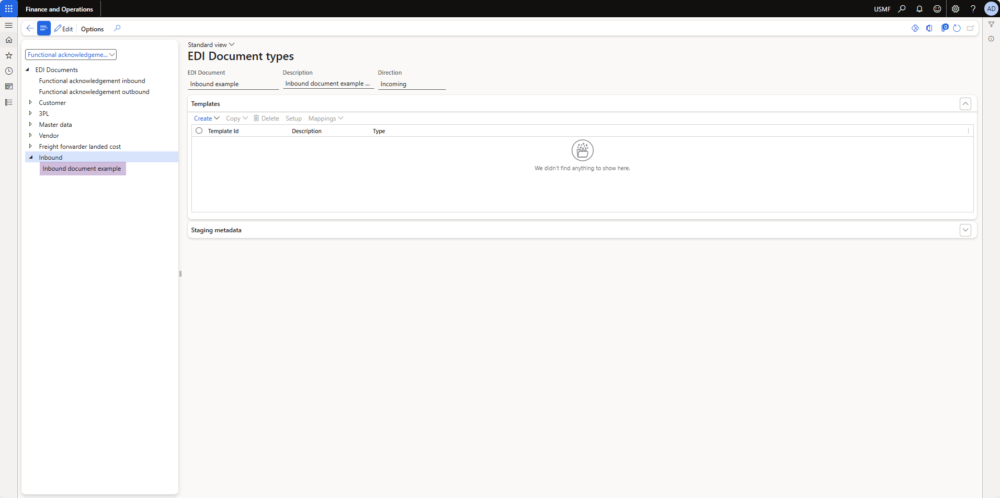
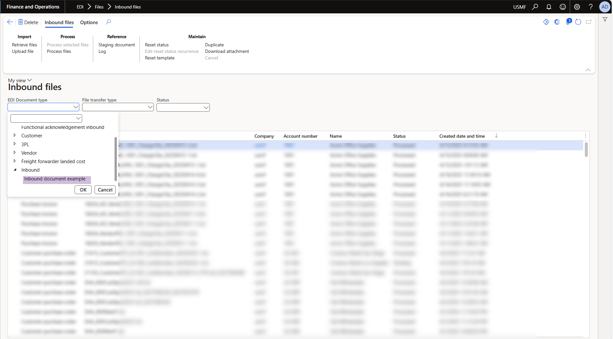
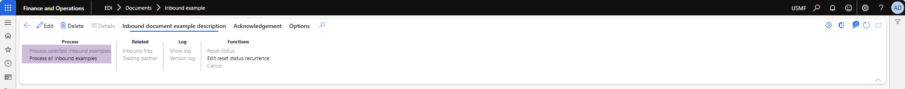

# DXC Electronic Data Interchange (EDI) - Technical Guide

The DXC EDI module provides enhanced functionalities to Microsoft Dynamics 365 for Finance and Operations (FinOps). This guide provides an overview of the technical requirements for making extensions to specific features.

**Table of contents**  
[Create new document type](#create-new-document-type)  
[EDI module library for D365 FSCM](#edi-module-library-for-d365-fscm)

## Create new document type

1. Update your model parameters to reference package, **DXC EDI**  
    Note: if working on customizations for any of the following modules, then please select the appropriate reference packages for it
    - **DXC EDI 3PL Documents**
    - **DXC EDI Customer Documents**
    - **DXC EDI Freight Forwarder Landed Cost Documents**
    - **DXC EDI Vendor Documents**
1. Add new document type  
    - Extend the enum, **SAB_EDIDocumentType** from the parent module, **DXC EDI**
    - Add new element for your inbound or outbound document type and provide an appropriate label for it
1. Create and implement the document type class.
    - See [Implement SAB_EDIDocumentTypeClass for EDI documents](#implement-sab_edidocumenttypeclass-for-edi-documents) for more information.

**EDI > Setup > Document type**


---

**EDI > Files > Inbound files**

  
----

**EDI > Files > Inbound files > Upload files**

  
----
  

Note: If your document type if not visible, navigate to EDI > Setup > EDI parameters > General and run refresh module. 

### Implement SAB_EDIDocumentTypeClass for EDI documents
#### Pre-requisites
1. [Create staging data tables for EDI documents](#create-staging-data-tables-for-edi-documents)
1. [Document settings profile](#document-settings-profile)
1. EDI document processing
    - [Inbound documents](#edi-document-processing-inbound)
    - [Outbound documents](#edi-document-processing-outbound)

#### Inbound documents
1. Extend the abstract class [SAB_EDIDocumentTypeClass](#sab_edidocumenttypeclass)
1. Add SAB_EDIDocumentTypeFactoryAttribute attribute to the class declaration and pass your SAB_EDIDocumentType enum as value.  
    Example: [SAB_EDIDocumentTypeFactoryAttribute(SAB_EDIDocumentType::InboundExample)]  
1. Implement all of the following methods, see the [class library](#sab_edidocumenttypeclass) for more information.  
    - documentDescription
    - documentDirection
    - documentHierarchyPath
    - documentName
    - documentRootNodeName
    - processMenuItem
    - processMenuItemSingle
    - stagingHeaderFromCommon
    - stagingHeaderKeyField
    - stagingHeaderTransferStatusFieldId
    - stagingLineFromCommon
    - tableIdHeader
    - tableIdLine
    - tableIdTradingPartnerDefault    

#### Outbound documents
1. Extend the abstract class [SAB_EDIOutboundDocumentTypeClass](#sab_edioutbounddocumenttypeclass)
1. Add SAB_EDIDocumentTypeFactory attribute to the class declaration and pass your SAB_EDIDocumentType enum as value.  
    Example: [SAB_EDIDocumentTypeFactory(SAB_EDIDocumentType::InboundExample)]  
1. Implement all of the following methods, see the [class library](#sab_edidocumenttypeclass) for more information.  
    - documentDescription
    - documentHierarchyPath
    - documentName
    - documentRootNodeName
    - stagingHeaderFromCommon
    - stagingHeaderKeyField
    - stagingHeaderTransferStatusFieldId
    - stagingLineFromCommon
    - tableIdHeader
    - tableIdLine
    - tableIdTradingPartnerDefault 

### Create staging data tables for EDI documents
#### Header table
1. Create new table to store your staging header data.  
    Example:  
    - EDI[Extension][Inbound]HeaderStaging  
    - EDI[Extension][Outbound]HeaderStaging
1. Add and link all fields in the map [SAB_EDIStagingHeader](#sab_edistagingheader) within the table designer.
1. Add any additional fields for your document type to the table

#### Line table
1. Create new table to store your staging line data.  
    Example:  
    - EDI[Extension][Inbound]LineStaging  
    - EDI[Extension][Outbound]LineStaging
1. Add and link all fields in the map [SAB_EDIStagingLine](#sab_edistagingline) within the table designer.
1. Add any additional fields for your document type to the table

### Document settings profile
1. Create new table for settings profile.   
    Example: SAB_EDIDocumentSettingProfile_[InboundExample]
1. Add [SAB_EDIDocumentSettingsProfile](#tables) as relation to your table
    1. Add the following field, to be used by EDI to uniquely identify your setting profile
        - Name: DocumentSettingsProfile
        - Data type: Int64
        - EDT - SAB_EDIDocumentSettingsProfileRecId
    1. Create new index
        - Name - DocumentSettingsProfileIdx
        - Field - DocumentSettingsProfile
        - Alternate key - Yes
    1. Add relationship
        - Related table - SAB_EDIDocumentSettingsProfile
        - Cardinality - ExactlyOne
        - Index - RecId
        - On Delete - Cascade
        - Relationship - Association
1. [Implement SAB_EDIDocumentSettingsContract class for document settings profile parameters](#implement-sab_edidocumentsettingscontract-class-for-document-settings-profile-parameters)
1. [Implement SAB_EDIDocumentSettingsDialogService class for document settings profile dialog](#implement-sab_edidocumentsettingsdialogservice-class-for-document-settings-profile-dialog)
1. [Implement SAB_EDIDocumentSettingsUIBuilder class for document settings profile UI](#sab_edidocumentsettingsuibuilder)
1. Create data entity for the settings profile and assign security privileges as required  
    Example: SAB_EDIDocumentSettingProfile_[InboundExample]Entity, SAB_EDIDocumentSettingProfile_[InboundExample]EntityMaintain, SAB_EDIDocumentSettingProfile_[InboundExample]EntityView

**EDI > Setup > Document types**


---
**[Document name] > Setting profiles > Setup**


#### Implement SAB_EDIDocumentSettingsContract class for document settings profile parameters
1. Extend the abstract class [SAB_EDIDocumentSettingsContract](#sab_edidocumentsettingscontract)
1. Add DataContract attribute to the class declaration
1. Add SAB_EDIDocumentTypeFactory attribute to the class declaration and pass your SAB_EDIDocumentType enum as value.  
    Example:  
    ``` x++
    [SAB_EDIDocumentTypeFactory(SAB_EDIDocumentType::InboundDocument)]
    ```
1. Add SysOperationContractProcessing attribute to the class declaration and pass your UI builder class as parameter
    Example:  
    ``` x++ 
    [SysOperationContractProcessing(classStr(SAB_EDIDocumentSettingsUIBuilder))]
    ```
1. Implement all of the following methods, see the [class library](#sab_edidocumentsettingscontract) for more information. 
    - getProfileFieldId
    - getPprofileTableId
    - serviceClassStr
    - serviceMethodStr
- Add your dialog fields as follows  
    Example:  
    ``` x++
    [DataMember,
    SAB_EDIDocumentSettingsFieldMember(fieldStr(SAB_EDIDocumentSettingsProfile_InboundExample, DocumentSettingField1))]
    public Name parmDocumentSettingField1(Name _field1 = documentSettingProfile.DocumentSettingField1)
    {
        documentSettingProfile.DocumentSettingField1 = _field1;

        return documentSettingProfile.DocumentSettingField1;
    }
    ```

#### Implement SAB_EDIDocumentSettingsDialogService class for document settings profile dialog
1. Extend the abstract class [SAB_EDIDocumentSettingsDialogService](#sab_edidocumentsettingsdialogservice)
1. Add your method that will save the settings
    Example:  
    ``` x++
    public void run(SAB_EDIDocumentSettingsContract_InboundExample _contract)
    {
        this.saveSettings(_contract);
    }
    ```

### EDI document processing (Inbound)
1. Create two action menu items for processing the EDI document.  
    - Example:  
        - SAB_EDIProcessor_InboundExampleSingle  
        - SAB_EDIProcessor_InboundExample    
    - Properties:  
        - Object Type: Class  
        - Object: SAB_EDIProcessorController  
        - Enum Type Parmeter: SAB_EDIDocumentType  
        - Enum Parameter: [Inbound Example] - pass your document type enum  
        - Set the multi-select to yes for the non-single one  
      
     **EDI > Documents > Inbound example** (Note: This will be accessible once step 3 is completed)
      
1. [Implement EDI processor class to process inbound documents](#implement-edi-processor-class-to-process-inbound-documents)
1. [Create staging forms for EDI documents](#create-staging-forms-for-edi-documents)

#### Implement EDI processor class to process inbound documents
1. Extend the EDI processor class dependening on your extension scenario
    - Customers documents - SAB_EDIProcessor_Cust
    - Vendor documents - SAB_EDIProcessor_Vend
    - Freight forwarder landed costs documents - SAB_EDIProcessor_FreightForwarderLandedCost
    - 3PL documents - SAB_EDIProcessor_3PL
    - All other documents - SAB_EDIProcessor
1. Add SAB_EDIDocumentTypeFactory attribute to the class declaration and pass your SAB_EDIDocumentType enum as value.  
    Example:  
    ``` x++
    [SAB_EDIDocumentTypeFactory(SAB_EDIDocumentType::InboundDocument)]
    ```
1. Implement all of the following methods, see the [class library](#sab_ediprocessor) for more information.  
    - initDocument
    - process
    - postProcess 

### EDI document processing (Outbound)
1. Create nnw action menu items for processing the EDI document.  
    - Example:  
        - SAB_EDIOutboundStagingWriter_OutboundExample
    - Properties:  
        - Object Type: Class  
        - Object: SAB_EDIOutboundStagingWriterServiceController  
        - Enum Type Parmeter: SAB_EDIDocumentType  
        - Enum Parameter: [Outbound Example] - pass your document type enum  
1. [Implement EDI staging writer class to process outbound documents](#implement-edi-staging-writer-class-to-process-outbound-documents)
1. [Create staging forms for EDI documents](#create-staging-forms-for-edi-documents)

#### Implement EDI staging writer class to process outbound documents
1. Extend the SAB_EDIOutboundStagingWriter class dependening on your extension scenario
    - Customers documents - SAB_EDIOutboundStagingWriter_Customer
    - Vendor documents - SAB_EDIOutboundStagingWriter_Vend
    - 3PL documents - SAB_EDIOutboundStagingWriter_3PL
    - All other documents - SAB_EDIOutboundStagingWriter
1. Add SAB_EDIDocumentTypeFactory attribute to the class declaration and pass your SAB_EDIDocumentType enum as value.  
    Example:  
    ``` x++
    [SAB_EDIDocumentTypeFactory(SAB_EDIDocumentType::OutboundDocument)]
    ```
1. Implement all of the following methods, see the [class library](#sab_edioutboundstagingwriter) for more information.
    - caption
    - composeStagingHeader
    - composeStagingLine
    - initQueryRun
    - initQueryRunFromBuffer
    - sourceTableIdHeader
    - sourceTableIdLine
    - tradingPartnerFromSourceHeader
    - tradingPartnerTableId 

### Create staging forms for EDI documents
1. Create action menu item for EDI document staging form.  
    - Example:  
        - SAB_EDIStagingFormRun_InboundExample    
    - Properties:  
        - Object Type: Class  
        - Object: SAB_EDIStagingFormRun  
        - Enum Type Parmeter: SAB_EDIDocumentType  
        - Enum Parameter: [Inbound Example] - pass your document type enum
1. [Implement SAB_EDIStagingFormClass for EDI documents](#implement-sab_edistagingformclass-for-edi-documents)
1. Create action menu item for EDI workspace.  
    - Example:  
        - SAB_EDIStagingFormRunError_InboundExample   
    - Properties:  
        - Object Type: Class  
        - Object: SAB_EDIStagingFormRun  
        - Enum Type Parmeter: SAB_EDIDocumentType  
        - Enum Parameter: [Inbound Example] - pass your document type enum
1. Extend the EDI menu item and add your staging form run action menu item under Documents

**EDI > Documents > Inbound example**


---


#### Implement SAB_EDIStagingFormClass for EDI documents
1. Extend the SAB_EDIStagingFormClass
1. Add SAB_EDIDocumentTypeFactoryAttribute attribute to the class declaration and pass your SAB_EDIDocumentType enum as value.  
    Example:  
    ``` x++
    [SAB_EDIDocumentTypeFactoryAttribute(SAB_EDIDocumentType::InboundDocument)]
    ```
1. Implement all of the following methods, see the [class library](#sab_edistagingformclass) for more information.
    - DocumentType
        Example:
        ``` x++
        protected SAB_EDIDocumentType DocumentType()
        {
            return SAB_EDIDocumentType::InboundExample;
        }
        ```
    - HeaderIdentificationFieldGroups
        Example:  
        ``` x++
        protected List HeaderIdentificationFieldGroups()
        {
            List fieldGroups = new List(Types::String);
                    
            fieldGroups.addEnd(tableFieldGroupStr(EDIExtensionInboundHeaderStaging, Overview));
            fieldGroups.addEnd(tableFieldGroupStr(EDIExtensionInboundHeaderStaging, Details));

            return fieldGroups;
        }
        ```
    - LinesHeaderFieldGroups
        Example:  
        ``` x++
        protected List LinesHeaderFieldGroups()
        {
            List fieldGroups = new List(Types::String);
                    
            fieldGroups.addEnd(tableFieldGroupStr(EDIExtensionInboundHeaderStaging, Overview));
            fieldGroups.addEnd(tableFieldGroupStr(EDIExtensionInboundHeaderStaging, Details));

            return fieldGroups;
        }
        ```
    - lineViewGridFieldGroup
        Example:  
        ``` x++
        protected str lineViewGridFieldGroup()
        {
            return tableFieldGroupStr(EDIExtensionInboundLineStaging, Details);
        }
        ```
    - mainGridFieldGroup
        Example:
        ``` x++
        protected str mainGridFieldGroup()
        {
            return tableFieldGroupStr(EDIExtensionInboundHeaderStaging, Overview);
        }
        ```

## EDI module library for D365 FSCM
### Enums
For more information on the enums for DXC EDI and it's related modules, refer to the Application Explorer (AOT) within a D365 FSCM development environment.  

|Enum name| Description|
|--|--|
|SAB_EDIDocumentType||
|SAB_EDIDocumentTypeHierarchyType||


### Classes
|||
|--|--|
|[SAB_EDIDocumentSettingsContract](#sab_edidocumentsettingscontract)|Abstract class for document settings profile parameters|
|[SAB_EDIDocumentSettingsDialogService](#sab_edidocumentsettingsdialogservice)|Abstract class for document settings profile dialog|
|[SAB_EDIDocumentSettingsUIBuilder](#sab_edidocumentsettingsuibuilder)|UI builder class for document settings profile dialog UI|
|[SAB_EDIDocumentTypeClass](#sab_edidocumenttypeclass)| Abstract class for implement EDI document types. |
|SAB_EDIDocumentTypeFactoryAttribute|Attribute class for EDI document type, [SAB_EDIDocumentType](#enums)|
|[SAB_EDIStagingFormClass](#sab_edistagingformclass)|Abstract class for staging forms for document types|
|[SAB_EDIProcessor](#sab_ediprocessor)|Contains logic for processing inbound documents|
|[SAB_EDIProcessor_PicklistRegistration](#sab_ediprocessor_picklistregistration)|Performs the core process of picking list registration inbound document import |
|[SAB_EDIOutboundStagingWriter](#sab_edistagingoutboundwriter)|Abstract class for processing outbound documents|
|[SAB_EDIXSDGenerator](#sab_edixsdgenerator)||
|[SAB_EDIXSDGeneratorSchemaItem](#sab_edixsdgeneratorschemaitem)||

#### SAB_EDIDocumentSettingsContract
| Definition| |
|--|--|  
|__Access modifier__| public  |
|__Non-access modifier__| abstract|
|__Source__| SAB_EDIDocumentSettingsContract.xpp |  

__Properties__

||||
|--|--|--|
|SAB_EDIDocumentSettingsProfileRefRecId|profile|


__Methods__
|Name|Returns|Description|
|--|--|--|
|constructBasedOnDocumentType(SAB_EDIDocumentType, boolean _throwErrorOnNotFound = false |SAB_EDIDocumentSettingsContract||
|create(SAB_EDIDocumentSettingsProfile)|SAB_EDIDocumentSettingsContract||
|findOrInitBufferForUpdate|Common||
|getProfileFieldId|FieldId|Abstract method to return the field id for the document type's profile settings table foreign key record Id|
|getPprofileTableId|TableId|Abstract method to return the table id for the profile settings table|
|initContractParent(SAB_EDIDocumentSettingsProfile)|void||
|serviceClassStr|IdentifierName|Abstract method to return the name of your dialog service class example, classStr(SAB_EDIDocumentSettingsDialogService_InboundExample)|
|serviceMethodStr|IdentifierName|Abstract method to return the name of your dialog service run method, example, methodStr(SAB_EDIDocumentSettingsDialogService_InboundExample, run)|

#### SAB_EDIDocumentSettingsDialogService
| Definition| |
|--|--|  
|__Access modifier__| public  |
|__Non-access modifier__| abstract|
|__Source__| SAB_EDIDocumentSettingsDialogService.xpp |

__Methods__
|Name|Returns|Description|
|--|--|--|
|saveSettings(SAB_EDIDocumentSettingsContract) |final void|Saves the contract settings|

#### SAB_EDIDocumentSettingsUIBuilder
| Definition| |
|--|--|  
|__Access modifier__| public  |
|__Source__| SAB_EDIDocumentSettingsUIBuilder.xpp |
|__Extends__| SysOperationAutomaticUIBuilder |

#### SAB_EDIDocumentTypeClass
| Definition| |
|--|--|  
|__Access modifier__| public  |
|__Non-access modifier__| abstract|
|__Source__| SAB_EDIDocumentTypeClass.xpp |  

__Constructors__
|  |  |  |
| -- | -- | -- |
| new() | Initializes a new instance of SAB_EDIDocumentTypeClass class. |

__Properties__

||||
|--|--|--|
|SAB_EDIDocumentTypeTable|documentTypeTable|
|SAB_EDIDocumentType|documentType|
|UnknownNoYes|featureEnaled|
|Map|documentTypeEnabledMap|

__Methods__
|Name|Returns|Description|
|--|--|--|
|allowDuplicateStagingSourceDocs| boolean | The allowDuplicateStagingSourceDocs returns boolean flag to indicate if the document type allows duplicate staging source documents.|
|documentDescription| [SAB_EDIDocumentTypeDescription](#edts)| The documentDescription returns the description for the document|
|documentDirection| [SAB_EDIDocumentDirection](#enums) | The documentDirection returns the document direction, for example, incoming or outgoing|
|documentHierarchyPath| List | The documentHierarchyPath returns a list of the hierarchy path for the document, populated using the enum, SAB_EDIDocumentTypeHierarchyType|
|documentName|[SAB_EDIDocumentTypeTableName](#edts)|The documentName returns the name of the document|
|documentRootNodeName| str | The documentRootNodeName returns the root node name, for example Product_Master. Note: this should not have any spaces|
|processMenuItemSingle|str|The processMenuItemSingle returns the menu item action string for processing single document |
|processMenuItem| str | The processMenuItem returns the menu item action string for processing multiple documents|
|stagingHeaderFromCommon(Common)|[SAB_EDIStagingHeader](#sab_edistagingheader)|The stagingHeaderFromCommon returns the staging header record|
|stagingHeaderKeyFields| container| The stagingHeaderKeyFields returns a container (fieldNum) with all fields that are to be used as key for the staging data|
|stagingHeaderTransferStatusFieldId|FieldId|The stagingHeaderTransferStatusFieldId returns the transfer status field id from the header table |
|stagingLineFromCommon(Common)|[SAB_EDIStagingLine](#sab_edistagingline)|The stagingLineFromCommon returns the staging line record|
|tableIdHeader|TableId|The tableIdHeader returns the table Id for the EDI document header table|
|tableIdLine|TableId|The tableIdLine returns the table Id for the EDI document line table|
|tableIdTradingPartnerDefault|TableId|The tableIdTradingPartnerDefault returns the table id of the trading partner defaulting table|

#### SAB_EDIStagingFormClass
| Definition| |
|--|--|  
|__Access modifier__| public  |
|__Non-access modifier__| abstract|
|__Source__| SAB_EDIStagingFormClass.xpp |  

__Methods__
|Name|Returns|Description|
|--|--|--|
|DocumentType|SAB_EDIDocumentType| The DocumentType returns the document type enum value, SAB_EDIDocumentType(#enums)|
|HeaderIdentificationFieldGroups| List | The HeaderIdentificationFieldGroups returns a list of field groups that contains field for identifying the header|
|lineViewGridFieldGroup|str| The lineViewGridFieldGroup returns the tableFieldGroupStr of the field group that comprises of all data required to be displayed in the line grid in the details view|
|LinesHeaderFieldGroups|List|The LinesHeaderFieldGroups returns the list of table field groups that needs to be displayed within the lines header tab within the staging form.|
|mainGridFieldGroup|str|The mainGridFieldGroup the tableFieldGroupStr of the field group that comprises of all data required to be displayed on the main grid of the staging form|

#### SAB_EDIProcessor
| Definition| |
|--|--|  
|__Access modifier__| public  |
|__Non-access modifier__| abstract|
|__Source__| SAB_EDIProcessor.xpp |  

__Properties__

||||
|--|--|--|
|SAB_EDIStagingHeader|ediStagingHeader|
|RecId|stagingTableRecId|
|SAB_EDIDocumentType|documentType|
|SAB_EDIDocumentTypeClass|documentTypeClass|
|SAB_EDITradingPartner|tradingPartner|
|NoYes|overrideError|

__Methods__
|Name|Returns|Description|
|--|--|--|
|initDocument|void|Abstract method to initialize variables for document processing |
|process|void|Abstract method to perform all logic required to process inbound document|
|postProcess|void|Abstract method to perform any additional logic after document has been processed |

#### SAB_EDIProcessor_PicklistRegistration
| Definition| |
|--|--|  
|__Access modifier__| public  |
|__Source__| SAB_EDIProcessor_PicklistRegistration.xpp |  
|__Extends__|SAB_EDIProcessor_3PL|

__Properties__

||||
|--|--|--|
|SAB_EDIPicklistRegistrationStaging|stagingCaller|
|SAB_EDIDocumentSettingsContract_PicklistRegistration|

__Methods__
|Name|Returns|Description|
|--|--|--|
|processPackingSlip(WMSPickingRouteSAB_EDIWMSPickingRouteExt| void | Processes packing slip based on transType of the picking route.  Sales - Executes processPackingSlip_salesOrder. TransferOrderShip - Executes processShipTransferOrder. Default - Executes delegate processPackingSlip_delegate |
|processPackingSlip_delegate(WMSPickingRoute, SAB_EDIDocumentSettingsContract_PicklistRegistration, EventHandlerAcceptResult) |void|
|processPackingSlip_salesOrder(WMSPickingRoute)|void|Process sales order|
|processShipTransferOrder(WMSPickingRoute)|void|Process transfer order|

#### SAB_EDIOutboundStagingWriter
| Definition| |
|--|--|  
|__Access modifier__| public  |
|__Non-access modifier__| abstract|
|__Source__| SAB_EDIOutboundStagingWriter.xpp |  

__Properties__

||||
|--|--|--|
|QueryRun|queryRun|
|Common|sourceBuffer|
|SAB_EDIDocumentType|documentType|
|SAB_EDIDocumentTypeClass|documentTypeClass|
|TableId|queryRunTableIdHeader|
|TableId|queryRunTableIdLine|
|TableId|sourceTableIdLine|
|SAB_EDIStagingHeader|stagingHeaderCurrent|
|SAB_EDIStagingLine|stagingLineCurrent|
|SAB_EDITradingPartner|tradingPartnerBuffer|
|SAB_EDITradingPartner|headerCount|
|boolean|isDocumentHasLines|
|SAB_EDILineNum|ediLineNumber|

__Methods__
|Name|Returns|Description|
|--|--|--|
|caption|str|Name of the document|
|composeStagingHeader(Common)|SAB_EDIStagingHeader|Populate data within your staging table for export|
|composeStagingLine(Common,SAB_EDIStagingLine, queryRun)|SAB_EDIStagingLine|Populate data within your staging table for export|
|initQueryRun| void | Initialize  | Initializes queryRun |
|initQueryRunFromBuffer|void| Initializes queryRun from sourceBuffer|  
|sourceTableIdHeader| TableId | Returns the table Id for the source table |
|sourceTableIdLine| TableId | Returns the table Id for the source line table |
|tradingPartnerFromSourceHeader(Common)|SAB_EDITradingPartner | Returns the trading partner record |
|tradingPartnerTableId|TableId | Returns the table Id for the trading partner |

### SAB_EDIXSDGenerator
| Definition| |
|--|--|  
|__Access modifier__| public  |
|__Source__| SAB_EDIXSDGenerator.xpp |  

__Properties__

||||
|--|--|--|
|System.Xml.Schema.XmlSchema|schema|
|SAB_EDITemplate|template|
|SAB_EDIXSDGeneratorSchemaItem|currentSchemaItem|
|SAB_EDIITemplateTreeNode|templateRootNode|

__Methods__
|Name|Returns|Description|
|--|--|--|
|init|boolean||
|writeStartSection(Name _sectionName, TableId _staginTableId, int64 _sectionId)|void||
|createElement||Has been moved to [SAB_EDIXSDGeneratorSchemaItem](#sab_edixsdgeneratorschemaitem)| 

#### SAB_EDIXSDGeneratorSchemaItem
| Definition| |
|--|--|  
|__Access modifier__| public  |
|__Source__| SAB_EDIXSDGeneratorSchemaItem.xpp |

__Methods__
|Name|Returns|Description|
|--|--|--|
|createElement(SAB_EDIField _ediField)|System.Xml.Schema.XmlSchemaElement||

### Maps

|||
|--|--|
|[SAB_EDIStagingHeader](#sab_edistagingheader)| Contains all fields required to be present within an EDI staging header table|
|[SAB_EDIStagingLine](#sab_edistagingline)|Contains all fields required to be present within an EDI staging line table|

#### SAB_EDIStagingHeader
__Methods__
|Name|Returns|Description|
|--|--|--|
|newStagingHeader(SAB_EDIDocumentType)|SAB_EDIStagingHeader|The newStagingHeader returns staging header record based on the document type |
|updateTransferStatus(RecId, SAB_EDIDocumentType, SAB_EDITransferStatus)|SAB_EDIStagingHeader|The updateTransferStatus updates transfer status for the staging header record for the specified document type.|
|isFileImportedBefore(SAB_EDIFileImport) | boolean | The isFileImportedBefore returns boolean flag to indicate is the file has already been imported or not.|
|initFromFileImport(SAB_EDIFileImport)|void|The initFromFileImport initializes the file import|
|initFromEDITradingPartner(SAB_EDITradingPartner)|void|The initFromEDITradingPartner initializes the trading partner fields for the staging header table| 
|ediTradingPartner|SAB_EDITradingPartner|The ediTradingPartner returns the EDI trading partner record|
|name|Name|The name returns the trading partner name|
|accountNum| SAB_EDITradingPartnerAccount | The accountNum returns the trading partner account |
|documentType|SAB_EDIDocumentType|The documentType returns the document type of the EDI staging header record|
|resetStatus|void|The resetStatus resets the status of the document to not started|
|canResetStatus|canBeCancelled|The canResetStatus returns a boolean flag to indicate if the document status can be reset or not|
|canBeCancelled|boolean||
|cancel|boolean||
|functionalAckSentToEDI|SAB_EDISentToEDI||
|getNextLineNum|SAB_EDIStagingLineNum||
|findByEdiId(SAB_EDIDocumentType, SAB_EDIId, boolean forUpdate)|SAB_EDIStagingHeader||
|documentSettingsExistByTradingPartner(SAB_EDIDocumentType, RefRecId, RefTableId)|boolean||
|documentSettingsExist|boolean||
|documentSettings(boolean silent)|SAB_EDIDocumentSettingsContract||
|validationProfile|SAB_EDIValidationProfileRecId||
|getStagingHeaderQuery(SAB_EDIDocumentTypeClass)|Query||


#### SAB_EDIStagingLine
__Methods__
|Name|Returns|Description|
|--|--|--|
|initFromEDIStagingHeader|void|The initFromEDIStagingHeader initializes EDI Id and EDI line number for the staging line from the header record|
