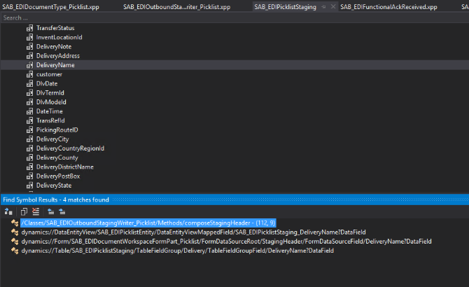

---
# required metadata

title: EDI
description: Technical guide - FAQ
author: jdutoit2
manager: Kym Parker
ms.date: 2022-06-20
ms.topic: article
ms.prod: 
ms.service: dynamics-ax-applications
ms.technology: 

# optional metadata

ms.search.form:  
audience: Application User
# ms.devlang: 
ms.reviewer: jdutoit2

# ms.tgt_pltfrm: 
ms.custom: ["21901", "intro-internal"]
ms.search.region: Global
# ms.search.industry: [leave blank for most, retail, public sector]
ms.author: jdutoit2
ms.search.validFrom:   2016-05-31
ms.dyn365.ops.version:  AX 7.0.1
---

# Technical FAQ

## Adding fields to an existing EDI document

Additional fields can be added to staging header and/or line table(s). Classes that need to be updated can be found by using references on other/similar fields from the applicable staging table(s). For instance references for DeliveryName on below screenshot.

The SAB_EDIStagingTableFieldMetaData table will be updated by the **Refresh EDI module** button on the **EDI parameters** form after staging fields were added.
 
Build model with changes, with DB sync option checked.   
Check-in changes and build deployable package and deploy to UAT and after sign-off to Prod systems.

## Adding an XML declaration to an XSLT output

https://our.umbraco.com/forum/templating/templates-and-document-types/10621-How-to-have-a-template-have-an-xml-header#comment-38842

\<?xml version="1.0" encoding="utf-8"?>

\<xsl:stylesheet version="1.0" xmlns:xsl="http://www.w3.org/1999/XSL/Transform">

\<xsl:template match="/">

**<xsl:text disable-output-escaping="yes">&lt;?xml version="1.0" encoding="utf-8"?&gt;</xsl:text>**

        \<Purord>

…

Line breaks improves output: <xsl:text disable-output-escaping="yes">&lt;?xml version="1.0" encoding="utf-8"?&gt;&**#xD;&#xA**;</xsl:text>

## 'Insert into' SQL errors on views

Run full DB sync

## Deployment issues

Standard actions you can try:

1. Try to repeat the deploy one more time and/or restart UAT VM in case if something went wrong and the file mentioned  is really locked by some system process
1. If still doesn’t work, follow the recommended implementation steps as per [release notes](../../Release-notes.md#installation-process) (example remove source code of previous EDI version)

## Deployment issues with model source code

1. Redeploy binaries from the package
2. Add SFTP folder to check-in and  
3.1. Check-in code without local build if you wish to have source code remain on the DEV system OR  
3.2. Remove source code from the DEV system first and then redeploy binaries

