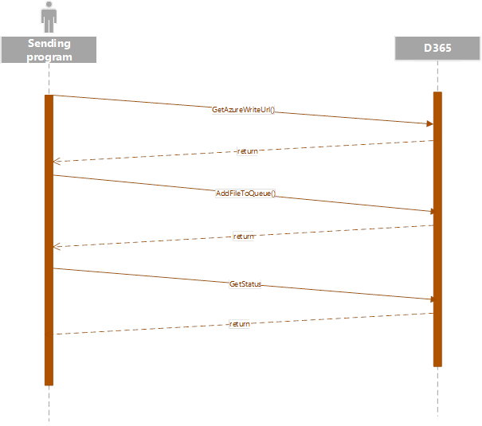

---
# required metadata

title: [EDI]
description: [Technical guide - Web API]
author: [jdutoit2]
manager: Kym Parker
ms.date: 10/06/2022
ms.topic: article
ms.prod: 
ms.service: dynamics-ax-applications
ms.technology: 

# optional metadata

# ms.search.form:  [Operations AOT form name to tie this topic to]
audience: [Application User]
# ms.devlang: 
ms.reviewer: [jdutoit2]
ms.search.scope: [Which Operations client to show this topic as help for, to be set by content strategist, see list here: https://microsoft.sharepoint.com/teams/DynDoc/_layouts/15/WopiFrame.aspx?sourcedoc={23419e1c-eb64-42e9-aa9b-79875b428718}&action=edit&wd=target%28Core%20Dynamics%20AX%20CP%20requirements%2Eone%7C4CC185C0%2DEFAA%2D42CD%2D94B9%2D8F2A45E7F61A%2FVersions%20list%20for%20docs%20topics%7CC14BE630%2D5151%2D49D6%2D8305%2D554B5084593C%2F%29]
# ms.tgt_pltfrm: 
# ms.custom: [used by loc for topics migrated from the wiki]
ms.search.region: [Global for most topics. Set Country/Region name for localizations]
# ms.search.industry: [leave blank for most, retail, public sector]
ms.author: [author's Microsoft alias]
ms.search.validFrom: [month/year of release that feature was introduced in, in format yyyy-mm-dd]
ms.dyn365.ops.version: [name of release that feature was introduced in, see list here: https://microsoft.sharepoint.com/teams/DynDoc/_layouts/15/WopiFrame.aspx?sourcedoc={23419e1c-eb64-42e9-aa9b-79875b428718}&action=edit&wd=target%28Core%20Dynamics%20AX%20CP%20requirements%2Eone%7C4CC185C0%2DEFAA%2D42CD%2D94B9%2D8F2A45E7F61A%2FVersions%20list%20for%20docs%20topics%7CC14BE630%2D5151%2D49D6%2D8305%2D554B5084593C%2F%29]
---

# Technical guide - Web API

## Inbound services
The EDI module exposes various functions to send files into the inbound staging area for processing. 

### GetAzureWriteUrl

**GET /api/Services/SAB_EDIServices/SAB_EDIInboundService/GetAzureWriteUrl**

Retrieves a writable Azure URL to upload a file for reading into D365

#### Request

Name 	          | Type	        | Description
:--             |:--            |:--
uniqueFileName	| String	      | **Required** The name of the file

Sample:  
application/json, text/json  
{  
      "uniqueFileName": "exampleFile.xml"  
}

#### Response

Name 	          | Type	        | Description
:--             |:--            |:--
AzureWriteId	  | GUID	        | A unique identifier
AzureWriteUrl	  | String	      | An Azure writable URL

Sample:
application/json, text/json
{
    "AzureWriteId": "8e59a2ba-ca6f-4d14-bafa-28e49c6528c9",
    "AzureWriteUrl": " https://XXXX.blob.core.windows.net/dmf/exampleFile"
}

 
### AddFileToQueue
GET /api/Services/SAB_EDIServices/SAB_EDIInboundService/AddFileToQueue

Parameters to add a single file into the inbound file queue

#### Request

Name 	          | Type	        | Description
:--             |:--            |:--
AddFileToQueueContract		  |   |  
AzureWriteUrl	  | String	      | **Required** The azure blob storage URL of the file
DocumentType	  | String	      | **Required** The EDI Document type the file relates to
TradingPartnerCompanyId	| String	| **Required** The legal entity the file relates to
TradingPartnerId | String	      | **Required** The trading partner GLN the file relates to
TradingPartnerType	| String	  | **Required** The Trading partner type the file relates to
FileName	       | String	      | **Required** The name of the file

Sample:
application/json, text/json

{
	"AddFileToQueueContract":{
		"AzureWriteUrl": "https://XXXX.blob.core.windows.net/dmf/exampleFile",
		"DocumentType": "Customer purchase order",
		"FileName": "ExampleFile001.xml",
		"TradingPartnerCompanyId": "USMF",
		"TradingPartnerId": "GLN00001",
		"TradingPartnerType": "Customer"
	}
}

#### Response

Name 	          | Type	        | Description
:--               |:--                  |:--
Reference	  | Long	        | Unique identifier of the added file
ErrorMsg	  | String	        | Any error message generated
Success	          | Boolean	        | Whether the add was successful
FileName	  | String	        | Filename

Sample:
application/json, text/json
{
    "Reference": "65468431638",
    "ErrorMsg": "",
    "Success": true,
    " FileName": “ExampleFile001.xml”
}
 
### GetStatus
GET /api/Services/SAB_EDIServices/SAB_EDIInboundService/GetStatus

A function to retrieve the status of a queued inbound file. It also has the ability to provide information on the processed document’s status if the inbound file has been processed.

#### Request

Name 	          | Type	        | Description
:--             |:--            |:--
reference	      | Long	        | **Required** Unique identifier of the file
includeStagingStatus	| Boolean	| **Required** also return the status of the staging record if processed

Sample:
application/json, text/json
{
    "reference": "65468431638",
    " includeStagingStatus": true
}

#### Response

Name 	        | Type	        | Description
:--             |:--            |:--
Status		| String	| The status of the file
ProcessedDateTime	| UTC Date time		| The date time the file was processed
ProcessedDocumentId	| String		| The processed file’s EDI Id
processedDocumentStatus	| String		| The processed files status

Sample:
application/json, text/json
{
    "Status": "Processed",
    "ProcessedDateTime": "1900-01-01T00:00:00Z",
    "ProcessedDocumentId": "",
    "processedDocumentStatus": "Not started" 
}

 
### AddFilesToQueue
GET /api/Services/SAB_EDIServices/SAB_EDIInboundService/AddFilesToQueue

A collection of AddFileToQueueContract parameters

#### Request

Name 	          | Type	        | Description
:--             |:--            |:--
AddFileToQueueContracts		|	|
AzureWriteUrl			| String	| **Required** The azure blob storage URL of the file
DocumentType			| String	| **Required** The EDI Document type the file relates to
TradingPartnerCompanyId		| String	| **Required** The legal entity the file relates to
TradingPartnerId		| String	| **Required** The trading partner GLN the file relates to
TradingPartnerType		| String	| **Required** The Trading partner type the file relates to
FileName			| String	| **Required** The name of the file

Sample:
application/json, text/json

{
	"AddFileToQueueContracts": [{
			"AzureWriteUrl": "https://XXXX.blob.core.windows.net/dmf/exampleFile",
			"DocumentType": "Customer purchase order",
			"FileName": "ExampleFile001.xml",
			"TradingPartnerCompanyId": "USMF",
			"TradingPartnerId": "GLN00001",
			"TradingPartnerType": "Customer"
		}, {
			"AzureWriteUrl": "https://XXXX.blob.core.windows.net/dmf/exampleFile02",
			"DocumentType": "Customer purchase order",
			"FileName": "ExampleFile002.xml",
			"TradingPartnerCompanyId": "USMF",
			"TradingPartnerId": "GLN00001",
			"TradingPartnerType": "Customer"
		}
	]
}

#### Response

Name 	          | Type	        | Description
:--             |:--            |:--
Reference	| Long		| Unique identifier of the added file
ErrorMsg	| String	| Any error message generated
Success		| Boolean	| Whether the add was successful
FileName	| String	| Filename

Sample:
application/json, text/json
[
    {
        "Reference": 6546813513,
        "ErrorMsg": "",
        "Success": true,
        " FileName": “ExampleFile001.xml”
    },
    {
        "Reference": 6413813168,
        "ErrorMsg": "",
        "Success": true,
        " FileName": “ExampleFile002.xml”
    }
]

### AddFileToQueue_package
GET /api/Services/SAB_EDIServices/SAB_EDIInboundService/AddFileToQueue_package

A function to push a data package which will be extracted and its contents put into the inbound file queue.

#### Data package
The data package is a zip file that includes a ‘manifest.xml’ xml file. The manifest file defines the files within the data package in the following XML structure

<Documents>
	<Document>		
		<DocumentType/>
		<FileName/>
		<TradingPartnerCompanyId/>
		<TradingPartnerId/>
		<TradingPartnerType/>
	</Document>
</Documents>	

Name 	           | Type	        | Description
:--                |:--                  |:--
DocumentType	   | String		| **Required** The EDI Document type the file relates to
TradingPartnerCompanyId	| String	| **Required** The legal entity the file relates to
TradingPartnerId   | String		| **Required** The trading partner GLN the file relates to
TradingPartnerType | String		| **Required** The Trading partner type the file relates to
FileName	   | String		| **Required** The name of the file

Sample:
<?xml version="1.0" encoding="utf-8"?>
<Documents>
	<Document>		
		<DocumentType>PO</DocumentType>
		<FileName>FileUpload_01.xml</FileName>
		<TradingPartnerCompanyId>USMF</TradingPartnerCompanyId>
		<TradingPartnerId>GLN00001</TradingPartnerId>
		<TradingPartnerType>Customer</TradingPartnerType>
	</Document>
	<Document>		
		<DocumentType>PO</DocumentType>
		<FileName>FileUpload_02.xml</FileName>
		<TradingPartnerCompanyId> USMF </TradingPartnerCompanyId>
		<TradingPartnerId>GLN00001</TradingPartnerId>
		<TradingPartnerType>Customer</TradingPartnerType>
	</Document>
</Documents>

#### Request

Name 	        | Type	        | Description
:--             |:--            |:--
azureWriteUrl	| String	| **Required** The azure blob storage URL of the data package

Sample:
application/json, text/json
{
    " azureWriteUrl ": " https://XXXX.blob.core.windows.net/dmf/exampleDataPackage"
}

#### Response
A collection of results

Name 	          | Type	        | Description
:--             |:--            |:--
Reference	| Long		| Unique identifier of the added file
ErrorMsg	| String	| Any error message generated
Success		| Boolean	| Whether the add was successful
FileName	| String	| Filename

Sample:
application/json, text/json
[
    {
        "Reference": 6546813513,
        "ErrorMsg": "",
        "Success": true,
        " FileName": “ExampleFile001.xml”
    },
    {
        "Reference": 6413813168,
        "ErrorMsg": "",
        "Success": true,
        " FileName": “ExampleFile002.xml”
    }
]

## Outbound services
The EDI module exposes various functions to pull files from the outbound staging area for download.

An oData feed of the outbound file queue (/data/SAB_EDIFileExport) is available for discovering the outbound queued file references.

### GetFileDetailFromQueue
##### Request

Name 	          | Type	        | Description
:--               |:--                  |:--
reference	  | Long		| **Required** The reference of the queued file

Sample:
application/json, text/json
{
	"reference": 61684163581
}

#### Response

Name 	          | Type	        | Description
:--               |:--                  |:--
FileName	  | String		| The filename
Reference	  | Long		| The reference of the file
AzureUrl	  | String		| The URL of the file for download

Sample:
application/json, text/json
{
    "FileName": "packageDownload.zip",
    "Reference": 61684163581,
    "AzureUrl": "https://icondev803825a2135bfabe1.blob.core.windows.net/edi/exampleFile001.zip"
}

 
### GetFileDetailFromQueue_Package
#### Request

Name 	         | Type	        | Description
:--              |:--           |:--
packageFileName	 | String	| **Required** The name of the package to be created
References	 | Collection of longs	| **Required** The reference of the queued file

Sample:
application/json, text/json
{
	"packageFileName" : "packageDownload.zip",
	"references": [5637149076, 5637149076]
} 

#### Response

Name 	        | Type	        | Description
:--             |:--            |:--
FileName	| String	| The filename
AzureUrl	| String	| The URL of the file for download

Sample:
application/json, text/json
{
    "FileName": "packageDownload.zip",
    "AzureUrl": "https://icondev803825a2135bfabe1.blob.core.windows.net/edi/exampleFile001.zip"
}

#### Data package
The data package is a zip file that includes a ‘manifest.xml’ xml file. The manifest file defines the files within the data package in the following XML structure

<Documents>
	<Document>		
		<DocumentType/>
		<FileName/>
		<TradingPartnerCompanyId/>
		<TradingPartnerId/>
		<TradingPartnerType/>
	</Document>
</Documents>	

Name 	          | Type	        | Description
:--             |:--            	|:--
DocumentType	| String		| **Required** The EDI Document type the file relates to
TradingPartnerCompanyId	| String	| **Required** The legal entity the file relates to
TradingPartnerId	| String	| **Required** The trading partner GLN the file relates to
TradingPartnerType	| String	| **Required** The Trading partner type the file relates to
FileName		| String	| **Required** The name of the file

Sample:
<?xml version="1.0" encoding="utf-8"?>
<Documents>
	<Document>		
		<DocumentType>PO</DocumentType>
		<FileName>FileUpload_01.xml</FileName>
		<TradingPartnerCompanyId>USMF</TradingPartnerCompanyId>
		<TradingPartnerId>GLN00001</TradingPartnerId>
		<TradingPartnerType>Customer</TradingPartnerType>
	</Document>
	<Document>		
		<DocumentType>PO</DocumentType>
		<FileName>FileUpload_02.xml</FileName>
		<TradingPartnerCompanyId> USMF </TradingPartnerCompanyId>
		<TradingPartnerId>GLN00001</TradingPartnerId>
		<TradingPartnerType>Customer</TradingPartnerType>
	</Document>
</Documents>

