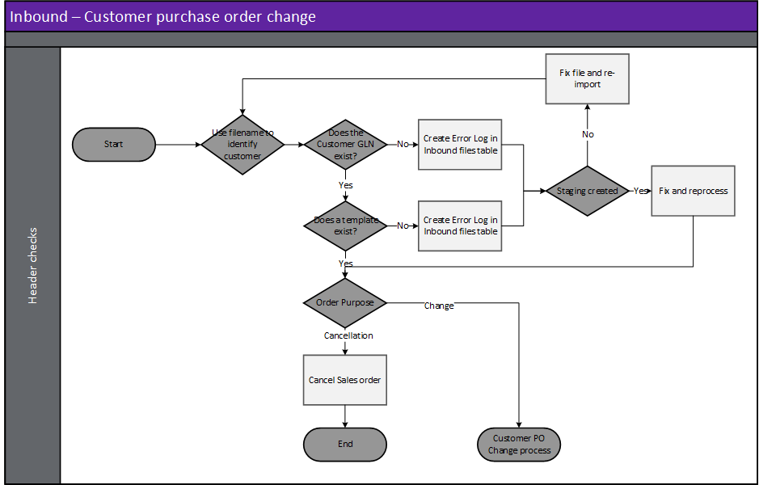
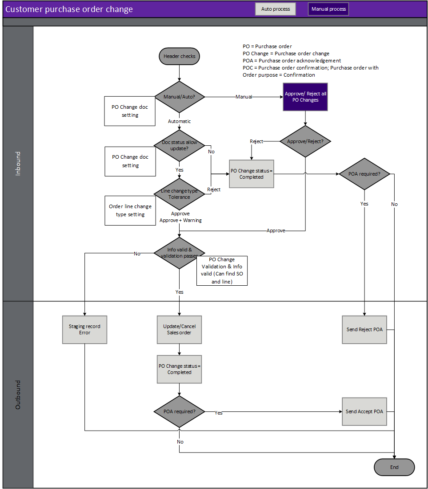

---
# required metadata

title: [EDI Customer]
description: [EDI Customer Documents - Customer purchase order change]
author: [jdutoit2]
manager: Kym Parker
ms.date: 7/10/2021
ms.topic: article
ms.prod: 
ms.service: dynamics-ax-applications
ms.technology: 

# optional metadata

# ms.search.form:  [Operations AOT form name to tie this topic to]
audience: [Application User]
# ms.devlang: 
ms.reviewer: [jdutoit2]
ms.search.scope: [Which Operations client to show this topic as help for, to be set by content strategist, see list here: https://microsoft.sharepoint.com/teams/DynDoc/_layouts/15/WopiFrame.aspx?sourcedoc={23419e1c-eb64-42e9-aa9b-79875b428718}&action=edit&wd=target%28Core%20Dynamics%20AX%20CP%20requirements%2Eone%7C4CC185C0%2DEFAA%2D42CD%2D94B9%2D8F2A45E7F61A%2FVersions%20list%20for%20docs%20topics%7CC14BE630%2D5151%2D49D6%2D8305%2D554B5084593C%2F%29]
# ms.tgt_pltfrm: 
# ms.custom: [used by loc for topics migrated from the wiki]
ms.search.region: [Global for most topics. Set Country/Region name for localizations]
# ms.search.industry: [leave blank for most, retail, public sector]
ms.author: [author's Microsoft alias]
ms.search.validFrom: [month/year of release that feature was introduced in, in format yyyy-mm-dd]
ms.dyn365.ops.version: [name of release that feature was introduced in, see list here: https://microsoft.sharepoint.com/teams/DynDoc/_layouts/15/WopiFrame.aspx?sourcedoc={23419e1c-eb64-42e9-aa9b-79875b428718}&action=edit&wd=target%28Core%20Dynamics%20AX%20CP%20requirements%2Eone%7C4CC185C0%2DEFAA%2D42CD%2D94B9%2D8F2A45E7F61A%2FVersions%20list%20for%20docs%20topics%7CC14BE630%2D5151%2D49D6%2D8305%2D554B5084593C%2F%29]
---

# Customer purchase order change

When a purchase order change file is imported, the file name is key to identifying the customer and therefore the document template. See [Trading partners](../SETUP/Trading%20partner.md) at **EDI > Setup > Trading partners** for further details.  It is based on this document template that the data within the file is identified and a record created in the EDI staging table.  
There are two order purposes (**Change** and **Cancellation**) that can be processed via the **Customer purchase order change** document. These order purposes can be specified in Trading partners and will change the way the record is processed.
Expectation is the customer sends price inclusive of discounts. 

The following [**Customer EDI order types**](../SETUP/CUSTOMER%20SETUP/Purchase%20order%20types.md) and [**Order purposes**](../SETUP/CUSTOMER%20SETUP/Order%20purpose%20group.md) are supported by each Customer inbound document:
**Document type**		                  | **Order type**	| **Order purpose**
:----                                 |:----            |:----
**Customer purchase order**	          | Order     Agreement   Release order | Original   Confirmation   Cancellation   Original   Original
**Customer purchase order change**	  | Order		        | Change   Cancellation

Inbound files have the following three steps:
1. **Import** - Imported file can be viewed in **EDI > Files > Inbound files**
2. **Import to staging** - Imported file is processed to staging record/s. The staging record/s can be viewed at **EDI > Documents > Customer documents > Customer purchase order**
3. **Staging to target** - The staging record/s is processed to target. Based on the **Order type**, the target will be either a:
    - Sales order (**Accounts receivable > Orders > All sales orders**)
    - Sales agreement (**Accounts receivable > Orders > Sales agreements**

### Create document

### Header checks for Customer purchase order change
Header checks are performed when:
1. Importing Customer purchase order change file
2. Processing from import to staging
3. Processing from staging to target.

## Step 1 - Import
When a purchase order change file is imported, the file name is key to identifying the customer and therefore the document template. See [Trading partners](../../CORE/Setup/Trading%20partners.md) for further details.  It is based on this document template that the data within the file is identified and a record created in the EDI staging table in the next step.

> Note: The file mask is used to identify the trading partner and therefore template

## Step 2 - Import to staging - Inbound file validation
When the purchase order change file is retrieved and imported, there are various validations that are completed before the staging record is created in the EDI staging table.
If the processing of **Import to staging** errors, the Inbound file's **Status** will be set to _Error_ and no staging record created.

**Rule Id**         |	**Details**         
:--                 |:--                  
**Check Template**  |	Identify a template for the Customer/Document type. This will be used to identify the whereabouts of data within the file

#### Possible issues and fixes
**Import to staging** errors for Customer purchase order change can be viewed in:
- **EDI > Files > Inbound files** filtered to **Status** set to _Error_
- **EDI > Document maintenance**, tab **Customer documents**, tile **File import errors**

At this step the issues are usually around the file not matching the template.
- Does the file have the correct template assigned (General tab, field **Template**):
  - **No**: Use **Reset template** to assign a different template. If this should apply to future documents for the Trading partner, also update in **Trading partners**.
  - **Yes**: Review **Log** and fix the applicable template in **EDI > Setup > Document types**. Examples issues are date format, new field.

Example error for file not matching template: 'Segment '<xml' not found in EDI template mapping'

## Step 3 - Staging to target
If the processing of **Staging to target** errors, the staging record's **Staging to target status** will be set to _Error_ and D365 target hasn't been edited, for example sales lines updated/added.

### Staging header validation - Sales order
There are various **Order purposes** that can be processed via the purchase order changedocument. These order purposes can be specified in **Trading partners** Options and will change the way the record is processed.  

> Note: Expectation is the customer sends price _inclusive of discounts_. 

**Rule Id**                 | **Details**               
:---                        |:---                 
**Check Order purpose**     | Check the Order purpose field on the order which indicate whether it is a **Change** or **Cancellation**
**Document status**         |	Check if the existing D365 sales order’s **Document status** <= Customer purchase order change’s Document status setting. For example if the sales order has been picked, but the Document setting only allows changes up to Document status set to _Confirmation_, the staging record will error.
**Line status**             |	If existing D365 sales order line’s status is Completed then sales line can’t be updated, and staging record will error.

#### Possible issues and fixes
**Staging to target** errors for Customer purchase order can be viewed in:
- **EDI > Documents > Customer purchase order** filtered to **Staging to target tatus** set to _Error_
- **EDI > Document maintenance**, tab **Customer documents**, tile **Purchase order errors**
- **EDI > Document maintenance**, tab **Customer documents**, **Documents** page, tab **PO**

At this step the issues are usually around mapping/business logic issues.
Review the **Log** or **Version log** for the applicable record to find the issue. Example errors and method to fix are discussed in below table.

> Note: When the Version log displays an **Error type** of _Processing error_, the processing has stopped because of a standard D365 error and the **Message** will display the standard D365 error.  
> Note: Similar to manually processing a D365 transaction, EDI will stop at the first processing error and only this error is displayed. Fixing the error and reprocessing might result in subsequent standard processing errors which need to be dealt with.

#### Example header errors:
**Error message**       | **Error type**         | **Method to fix**
:---------------------- |:----                   |:----

