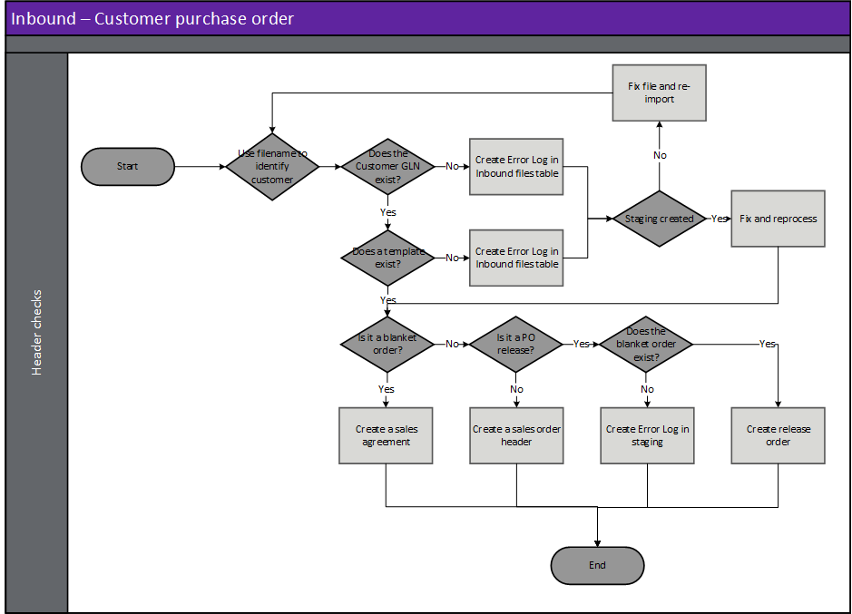

---
# required metadata

title: [EDI Customer]
description: [EDI Customer Documents - Customer purchase order]
author: [jdutoit2]
manager: Kym Parker
ms.date: 5/10/2021
ms.topic: article
ms.prod: 
ms.service: dynamics-ax-applications
ms.technology: 

# optional metadata

# ms.search.form:  [Operations AOT form name to tie this topic to]
audience: [Application User]
# ms.devlang: 
ms.reviewer: [jdutoit2]
ms.search.scope: [Which Operations client to show this topic as help for, to be set by content strategist, see list here: https://microsoft.sharepoint.com/teams/DynDoc/_layouts/15/WopiFrame.aspx?sourcedoc={23419e1c-eb64-42e9-aa9b-79875b428718}&action=edit&wd=target%28Core%20Dynamics%20AX%20CP%20requirements%2Eone%7C4CC185C0%2DEFAA%2D42CD%2D94B9%2D8F2A45E7F61A%2FVersions%20list%20for%20docs%20topics%7CC14BE630%2D5151%2D49D6%2D8305%2D554B5084593C%2F%29]
# ms.tgt_pltfrm: 
# ms.custom: [used by loc for topics migrated from the wiki]
ms.search.region: [Global for most topics. Set Country/Region name for localizations]
# ms.search.industry: [leave blank for most, retail, public sector]
ms.author: [author's Microsoft alias]
ms.search.validFrom: [month/year of release that feature was introduced in, in format yyyy-mm-dd]
ms.dyn365.ops.version: [name of release that feature was introduced in, see list here: https://microsoft.sharepoint.com/teams/DynDoc/_layouts/15/WopiFrame.aspx?sourcedoc={23419e1c-eb64-42e9-aa9b-79875b428718}&action=edit&wd=target%28Core%20Dynamics%20AX%20CP%20requirements%2Eone%7C4CC185C0%2DEFAA%2D42CD%2D94B9%2D8F2A45E7F61A%2FVersions%20list%20for%20docs%20topics%7CC14BE630%2D5151%2D49D6%2D8305%2D554B5084593C%2F%29]
---

# Customer purchase order
The following [**Customer EDI order types**](../SETUP/CUSTOMER%20SETUP/Purchase%20order%20types.md) and [**Order purposes**](../SETUP/CUSTOMER%20SETUP/Order%20purpose%20group.md) are supported by each Customer inbound document:
**Document type**		                  | **Order type**	| **Order purpose**
:----                                 |:----            |:----
**Customer purchase order**	          | Order		        | Original   Confirmation   Cancellation
**Customer purchase order**	          | Agreement		    | Original
**Customer purchase order**	          | Release order	  | Original
**Customer purchase order change**	  | Order		        | Change   Cancellation

Inbound files have the following three steps:
1. **Import** - Imported file can be viewed in **EDI > Files > Inbound files**
2. **Import to staging** - Imported file is processed to staging record/s. The staging record/s can be viewed at **EDI > Documents > Customer documents > Customer purchase order**
3. **Staging to target** - The staging record/s is processed to target. Based on the **Order type**, the target will be either a:
    - Sales order (**Accounts receivable > Orders > All sales orders**)
    - Sales agreement (**Accounts receivable > Orders > Sales agreements**

### Create document

### Header checks for Customer purchase order
Header checks are performed when:
1. Importing Customer purchase order file
2. Processing from import to staging
3. Processing from staging to target.

## Step 1 - Import
When a purchase order file is imported, the file name is key to identifying the customer and therefore the document template. See [Trading partners](../../CORE/Setup/Trading%20partners.md) for further details.  It is based on this document template that the data within the file is identified and a record created in the EDI staging table in the next step.

> Note: The file mask is used to identify the trading partner and therefore template

## Step 2 - Import to staging - Inbound file validation
When the purchase order file is retrieved and imported, there are various validations that are completed before the staging record is created in the EDI staging table.
If the processing of **Import to staging** errors, the Inbound file's **Status** will be set to _Error_ and no staging record created.

**Rule Id**         |	**Details**         
:--                 |:--                  
**Check Template**  |	Identify a template for the Customer/Document type. This will be used to identify the whereabouts of data within the file

### Possible issues and fixes
**Import to staging** errors for Customer purchase orders can be viewed in:
- **EDI > Files > Inbound files** filtered to **Status** set to _Error_
- **EDI > Document maintenance**, tab **Customer documents**, tile **File import errors**

At this step the issues are usually around the file not matching the template.
- Does the file have the correct template assigned (General tab, field **Template**):
  - **No**: Use **Reset template** to assign a different template. If this should apply to future documents for the Trading partner, also update in **Trading partners**.
  - **Yes**: Review **Log** and fix the applicable template in **EDI > Setup > Document types**. Examples issues are date format, new field.

## Step 3 - Staging to target - Staging table validation
There are various **Order types** that can be processed via the purchase order document. These order types can be specified in **Trading partners** Options and will change the way the record is processed.  
If the processing of **Staging to target** errors, the staging record's **Staging to target status** will be set to _Error_ and no D365 target created i.e. sales order, sales agreement or release order is created.

> Note: Expectation is the customer sends price _inclusive of discounts_. 

**Rule Id**                 | **Details**               
:---                        |:---                       
**Check Order type**	    | Check the **EDI order type** field on the staging record, which indicates whether the record should create a sales order, sales agreement (blanket order) or release order.
**Duplicate PO number**     | Check the customer purchase order rules to validate the purchase order is valid. If document setting **Duplicate tolerance** doesn’t allow duplicates. If duplicates are allowed, a new D365 Sales order will be created with the same Customer requisition.

### Possible issues and fixes
**Staging to target** errors for Customer purchase order can be viewed in:
- **EDI > Documents > Customer purchase order** filtered to **Staging to target tatus** set to _Error_
- **EDI > Document maintenance**, tab **Customer documents**, tile **Purchase order errors**
- **EDI > Document maintenance**, tab **Customer documents**, **Documents** page, tab **PO**

At this step the issues are usually around mapping/business logic issues.
Review the **Log** or **Version log** for the applicable record to find the issue. Example errors and method to fix are discussed in below table.
When the Version log displayes an **Error type** of _Processing error_, the error hasn't been defined and is displaying standard D365 error.

**Error message**       | **Error type**         | **Method to fix**
:---                    |:----                   |:----
Could not find address for store code '%'	| Store code not found    | Add/update existing Customer address with store code in:   • [**Trading partners**](../SETUP/Trading%20partner.md) page at **EDI > Setup > Trading partners**, or   • Customers page at **Accounts receivable > Customers > All customers**
Field 'Agreement classification' must be filled in |                   | **EDI > Setup > Document types**. Select applicable **Agreement classification** on Customer purchase order document **Setting profile** in [**Document types**](../SETUP/SETTING%20PROFILES/Customer%20purchase%20order.md)
Inventory dimension Site is mandatory and must consequently be specified.   | Processing error    | **Accounts receivable > Customers > All customers**. Setup default site or warehouse on the customer or if no default, the original EDI file needs to include these details.  
The entered receipt date ‘%’ is not valid because it is before today. |     | **EDI > Documents > Customer documents > Customer purchase order**. Edit requested receipt date in the staging page.
Item not found	    |       |**EDI > Documents > Customer documents > Customer purchase order** and/or **Product information management > Products > Released products**   Dependening on **Item Id source** assigned to Trading partner’s Document [**Setting profile**](../SETUP/SETTING%20PROFILES/Customer%20purchase%20order.md), EDI couldn’t find the staging record's Item Id / Barcode. Either fix staging or setup on the Item.
Sales Agreement for customer '%', purchase number ‘%’ not found     |   	| Received a Release order referring to Sales agreement that could not be found for the Customer.   1. **EDI > Setup > Docuemnt types** or **EDI > Setup > Trading partners**. If sales agreement is not required, either update document setting **Create release order without blanket order**’ to _Yes_ or assign the correct Setting on the Trading partner.   2. If blanket order is required, create/import the sales agreement or fix the **Customer requisition** on existing sales agreement (if D365 incorrect) or on the staging record (if staging incorrect).
Invalid order type  | Order type not found          | Review the staging record's **EDI order type** is mapped in the [**Customer EDI order types**](SETUP/CUSTOMER%20SETUP/Purchase%20order%20types.md) assigned to the Trading partner.
Purchase order '' already exists on sales order ''  | Order duplicate    | The document setting **Duplicate tolerance** doesn't allow duplicate orders. If duplicates are allowed for flagged orders, update the **Bypass duplicate check** on the Sales order hearder under the **EDI** FastTab.

