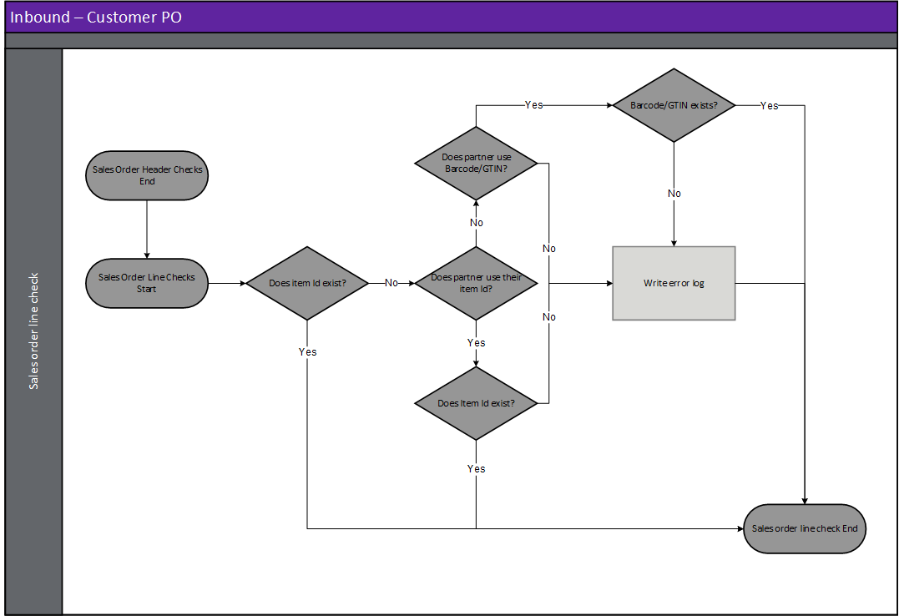

---
# required metadata

title: [EDI Customer]
description: [EDI Customer Documents - Customer purchase order change]
author: [jdutoit2]
manager: Kym Parker
ms.date: 7/10/2021
ms.topic: article
ms.prod: 
ms.service: dynamics-ax-applications
ms.technology: 

# optional metadata

# ms.search.form:  [Operations AOT form name to tie this topic to]
audience: [Application User]
# ms.devlang: 
ms.reviewer: [jdutoit2]
ms.search.scope: [Which Operations client to show this topic as help for, to be set by content strategist, see list here: https://microsoft.sharepoint.com/teams/DynDoc/_layouts/15/WopiFrame.aspx?sourcedoc={23419e1c-eb64-42e9-aa9b-79875b428718}&action=edit&wd=target%28Core%20Dynamics%20AX%20CP%20requirements%2Eone%7C4CC185C0%2DEFAA%2D42CD%2D94B9%2D8F2A45E7F61A%2FVersions%20list%20for%20docs%20topics%7CC14BE630%2D5151%2D49D6%2D8305%2D554B5084593C%2F%29]
# ms.tgt_pltfrm: 
# ms.custom: [used by loc for topics migrated from the wiki]
ms.search.region: [Global for most topics. Set Country/Region name for localizations]
# ms.search.industry: [leave blank for most, retail, public sector]
ms.author: [author's Microsoft alias]
ms.search.validFrom: [month/year of release that feature was introduced in, in format yyyy-mm-dd]
ms.dyn365.ops.version: [name of release that feature was introduced in, see list here: https://microsoft.sharepoint.com/teams/DynDoc/_layouts/15/WopiFrame.aspx?sourcedoc={23419e1c-eb64-42e9-aa9b-79875b428718}&action=edit&wd=target%28Core%20Dynamics%20AX%20CP%20requirements%2Eone%7C4CC185C0%2DEFAA%2D42CD%2D94B9%2D8F2A45E7F61A%2FVersions%20list%20for%20docs%20topics%7CC14BE630%2D5151%2D49D6%2D8305%2D554B5084593C%2F%29]
---

# Customer purchase order change

## Prerequisites
The following setup is prerequisites for the customer purchase order change

1. If required to put sales orders on hold till the purchase order confirmation has been received, assign the applicable hold code to [POC pending hold code](../SETUP/CUSTOMER-SETUP/Hold-codes.md) in EDI parameters.
3. Create [Order purpose groups](../SETUP/CUSTOMER-SETUP/Order-purpose-group.md) to map the customer's values to EDI order purpose groups.
4. If Automatic processing will be used, create [Order line change type groups](../SETUP/CUSTOMER-SETUP/Order-line-change-type-group.md)
5. Create [Template](../../CORE/Setup/DocumentTypes/File-templates.md) for the document.
6. Create [Setting profile](../SETUP/SETTING-PROFILES/Customer-purchase-order-change.md) for the document.
7. Create [Validation profile](../SETUP/VALIDATION-PROFILES/Customer-purchase-order-change.md) for the document.
8. If the customer [trading partner](../SETUP/Trading-partner.md) doesn't exist, create the new trading partner.
9. Assign the Order purpose group and Order line change type group (where applicable) to the customer trading partner.
10. Add and enable the customer purchase order change document to the [Customer trading partner](../SETUP/Trading-partner.md) and select the applicable:
    - Template
    - Setting profile
    - Validation profile
    - Search mask

## Target D365 transactions

When a purchase order change file is imported, the file name is key to identifying the customer and therefore the document template. See [Trading partners](../SETUP/Trading-partner.md) at **EDI > Setup > Trading partners** for further details.  It is based on this document template that the data within the file is identified and a record created in the EDI staging table.  
There are two order purposes (**Change** and **Cancellation**) that can be processed via the **Customer purchase order change** document. These order purposes can be specified in Trading partners and will change the way the record is processed.
Expectation is the customer sends price inclusive of discounts. 

The following [**Customer EDI order types**](../SETUP/CUSTOMER-SETUP/Purchase-order-types.md) and [**Order purposes**](../SETUP/CUSTOMER-SETUP/Order-purpose-group.md) are supported by each Customer inbound document:
**Document type**		              | **Order type**	| **Order purpose**
:----                                 |:----                |:----
**Customer purchase order**	          | Order		        | Original   Confirmation   Cancellation
**Customer purchase order**	          | Agreement		    | Original
**Customer purchase order**	          | Release order	    | Original
**Customer purchase order change**	  | Order		        | Change   Cancellation

Inbound files have the following three steps:
1. **Import** - Imported file can be viewed in **EDI > Files > Inbound files**
2. **Import to staging** - Imported file is processed to staging record/s. The staging record/s can be viewed at **EDI > Documents > Customer documents > Customer purchase order change**
3. **Staging to target** - The staging record/s is processed to the target Sales order (**Accounts receivable > Orders > All sales orders**)

### Create document

### Header checks for Customer purchase order change
Header checks are performed when:
1. Importing Customer purchase order change file
2. Processing from import to staging
3. Processing from staging to target.

## Step 1 - Import
When a purchase order change file is imported, the file name is key to identifying the customer and therefore the document template. See [Trading partners](../../CORE/Setup/Trading-partners.md) for further details.  It is based on this document template that the data within the file is identified and a record created in the EDI staging table in the next step.

> Note: The file mask is used to identify the trading partner and therefore template

## Step 2 - Import to staging - Inbound file validation
When the purchase order change file is retrieved and imported, there are various validations that are completed before the staging record is created in the EDI staging table.
If the processing of **Import to staging** errors, the Inbound file's **Status** will be set to _Error_ and no staging record created.

**Rule Id**         |	**Details**         
:--                 |:--                  
**Check Template**  |	Identify a template for the Customer/Document type. This will be used to identify the whereabouts of data within the file

#### Possible issues and fixes
**Import to staging** errors for Customer purchase order change can be viewed in:
- **EDI > Files > Inbound files** filtered to **Status** set to _Error_
- **EDI > Document maintenance**, tab **Customer documents**, tile **File import errors**

At this step the issues are usually around the file not matching the template.
- Does the file have the correct template assigned (General tab, field **Template**):
  - **No**: Use **Reset template** to assign a different template. If this should apply to future documents for the Trading partner, also update in **Trading partners**.
  - **Yes**: Review **Log** and fix the applicable template in **EDI > Setup > Document types**. Examples issues are date format, new field.

Example error for file not matching template: 'Segment '<xml' not found in EDI template mapping'

## Step 3 - Staging to target
If the processing of **Staging to target** errors, the staging record's **Staging to target status** will be set to _Error_ and D365 target hasn't been edited, for example sales lines updated/added.

### Staging header validation - Sales order
There are various **Order purposes** that can be processed via the purchase order changedocument. These order purposes can be specified in **Trading partners** Options and will change the way the record is processed.  

> Note: Expectation is the customer sends price _inclusive of discounts_. 

**Rule Id**                 | **Details**               
:---                        |:---                 
**Check Order purpose**     | Check the Order purpose field on the order which indicate whether it is a **Change** or **Cancellation**
**Document status**         | Check if the existing D365 sales order’s **Document status** <= Customer purchase order change’s Document status setting. For example if the sales order has been picked, but the Document setting only allows changes up to Document status set to _Confirmation_, the staging record will error.
**Line status**             | If existing D365 sales order line’s status is Completed then sales line can’t be updated, and staging record will error.

### Staging line validation - Sales order

**Rule Id**                 | **Details**               
:---                        |:---                 
**No Valid Item**           | No valid item based on the different options available
**No Valid Item and line number combination**   | Item and line number combination used to find applicable Sales line to update. Except where adding new lines.

### Sales order header checks
The following sales order checks are done when the document is being:
- Automatically processed and document setting **Allow header update** is set to _Yes_ or 
- Manually accepted by the user

**Rule Id**             | **Details**
:---                    |:---
**Deadline date**       | A check of this date against the standard rules is required. (i.e. Dates are not historical)

### Possible issues and fixes
**Staging to target** errors for Customer purchase order can be viewed in:
- **EDI > Documents > Customer purchase order change** filtered to **Staging to target tatus** set to _Error_
- **EDI > Document maintenance**, tab **Customer documents**, tile **PO change errors**
- **EDI > Document maintenance**, tab **Customer documents**, **Documents** page, tab **PO change**

At this step the issues are usually around setup/business logic issues.  
Review the **Log** or **Version log** for the applicable record to find the issue.  
Example errors and possible fixes are discussed in [FAQ](../OTHER/FAQ.md#customer-purchase-order-change)

#### Settings
Settings profiles can be specified and linked to the template which is used to determine how D365 will react.  Options are:

**Setting**                                 | **Details**
:---                                        |:---
**Processing method**                       |	Specifies if the changes should automatically be applied or flagged for manual approval.
**Document status**                         |	Check if the existing D365 sales order’s Document status <= Customer purchase order change **Document setting**'s **Document status** setting. If the Sales order’s document status is “higher”, then the change will not be applied and the EDI staging record will Error.

### Sales order line checks
The following sales order line checks are performed when a new sales line is added.  

**Rule Id**                                 | **Details**
:---                                        |:---
**Unit of measurement**                     | It should first check that this unit of measurement actually exists, a second check should be the measurement on the inventory table module for sales. If the Customer has a **UOM** mapping assigned, this will also be used to map their value to D365 value.
**Unit price**                              | The unit price should be checked using the standard D365 pricing rules.  If the prices are slightly different it should check both the **Maximum positive and negative tolerance** and **Use customer price** flag on document's setting before giving an error/warning. Example:   Item X trade agreement price 10.25   Item Y trade agreement price 8.88   Customer has a min and max tolerance setting of 0.05   Customer does not have their trade agreements entered including tax   Customer sends their EDI orders including tax   The setting use customer pricing is given   Item X EDI file price (before converting) 11.26 (after conversion) 10.24   Item Y EDI file price (before converting) 9.70 (after conversion) 8.82   Template setting against this field is warning.   A warning is only given for Item Y because it is outside of the tolerance. 
**Check multiple**                          | The quantity should be devisable by the multiple specified on the customer multiple table, if there isn’t one then it check the sales multiple on the item table.  

## View staging table records
To view the Customer purchase order change's staging records, go to **EDI > Documents > Customer documents > Customer purchase order change**. 
Use this page to review staging and process EDI Customer purchase order change documents to cancel or edit an existing D365 sales order.

### List page
The following EDI fields are available on the list page.

**Field**               | **Description**
:---                    |:---
**EDI number**          |	EDI Staging table record id. Select **EDI number** or the **Details** button on the Action Pane, to view the details for the selected record. The number sequence is determined by [EDI number](../../CORE/Setup/EDI-parameters.md#number-sequence) on the **EDI parameters**.
**Company account**     | Legal entity of the document.
**Company GLN**         | The company’s global location number is shown here.
**Staging to target status**    | The current status of the staging record. Options include:   • **Not Started** – the order change has been successfully processed from the inbound file to the staging table but not processed.   •	**Error** – The order change has been processed from the staging table, but no updates processed to existing D365 Sales order.  There are errors with the record that need to be reviewed.   •	**Completed** – The order change has been processed and either automatically processed and D365 Sales order updated or ready for Manual approval. • **Canceled** – The record has been manually canceled and will be excluded from processing.
**Trading partner account**     | Customer account assigned to the staging record.
**Trading partner GLN**         | The Customer’s global location number is shown here.
**Customer Requisition**        | Customer's purchase order number which will be used to find the existing D365 sales order which requires changes.
**Purchase order date**         | The purchase order date from the EDI record is shown here.
**EDI order purpose**           | The EDI order purpose is shown here. Receiving an Order purpose **Original** and **Confirmation** will error the staging record, since these should be sent as **Customer purchase order** document. Only **Change** and **Cancellation** order purposes are allowed for **Customer purchase order change** document.
**Store code**                  | The store code from the EDI record is shown here.
**Store zone**                  | The store zone from the EDI record is shown here.
**Created Date and Time**       | The date and time the selected record was created in the staging table.
**Sent**                        | Indicates if the **Functional acknowledgement outbound** has been sent to the trading partner for the inbound document record.

### Buttons
The following buttons are available on the **Customer purchase order change** Action Pane, tab **Customer purchase order change**.

**Button**	                    | **Description**
:---                            |:----
**Process customer changes**    |	Process selected record’s change. If document setting's **Processing method** is:   • **Automatic** – The **Update tolerance** on Order line change type group’ is used to determine if the line can be changed.      - **Approve**: If all the line changes received are approved, the sales order will be updated.     -	**Approve with warning log**: If all the line changes received are approved, the sales order will be updated. Warning log created on EDI staging record.     - **Reject with warning log**: If any of the line changes received are Reject, the sales order will not be updated. The Staging record will error, but change can still be viewed via Changes on the Sales order header – EDI ribbon   •	**Manual** – The record is processed and available for manual Approve/Reject on ‘EDI Sales order processing > Pending PO changes’ or via Changes on the Sales order header on the EDI tab on the ActionPane.
**Process all customer changes**	| As per above, but for all staging records that have a **Staging to target status** set to _Not started_. 
**Inbound files**               | View the inbound file record the selected staging record.
**Trading partner**             | View the trading partner details in the [**Trading partners**](../SETUP/Trading-partner.md) page.
**Sales Order**	                | If the staging record has been completed it is possible to inquire on the **Sales order** it updated from this button.
**Customers**                   | Inquire on the Customer for the selected record.
**Show log**                    | If there are Errors within the document, it is possible to review them at any time using this button. Shows only the current version.
**Version log**                 | View all log versions. When a document’s status is reset and reprocessed, a new log version is created. Can view all log versions.
**Reset Status**                | You can reset the **Staging to target status** to _Not started_. This can be used to reprocess the selected record/s. Documents can only be processed if **Staging to target status** is set to _Not started_.
**Edit reset status recurrence**    | If the underlying issue was resolved after all the reset attempts have been completed the user can use this button to edit the recurrence field/s. This will:   • Update **Reset status profile** to _blank_   • Update the **Reset status date/time** to next time reset will run   • **Reset status attempts** set to _Zero_ and   • **Recurrence** text updated with changed recurrence details
**Cancel**                      | Select **Cancel** to update the **Staging to target status** to _Canceled_. Button is enabled when the **Staging to target status** is not set to _Completed_.

The following buttons are available on the **Customer purchase order change**'s Action Pane, tab **Acknowledgement**.
The **Acknowledgement** tab is available on all incoming documents staging pages and enables the user to process or view the **Functional acknowledgement outbound** that has been created for the inbound document.

**Button**	                    | **Description**
:---                            |:----
**Send to EDI**                 | If the **Sent** field for the staging record is set to _No_, use this button to create the **Functional acknowledgement outbound** record and also update the **Sent** field to _Yes._
**Reset flag**                  | If the **Sent** field for the staging record has been set to _Yes_, use this button to reset **Sent** to _No_.
**Functional acknowledgement**  | Use this button to view the **Functional acknowledgement outbound** record created for the inbound document.

### Header fields
The Customer Purchase order change can update the following Sales order header fields:
-	**Sales order** - If document setting **Allow header update** is set to _Yes_.
    -	Delivery address: either from Store code or Delivery address
    -	Requested ship date
    -	Requested receipt date
    -	Confirmed dates: If purchase order change’s document setting **Update confirmed ship date** allows automatic update
-	**Sales order EDI section** - Most recent EDI change record:
    -	Change EDI number
    -	Change order date
    -	Store code
    -	Requested ship date
    -	Requested receipt date
    -	Delivery time
    -	Change version number
    -	POA status: If POA required for change, will change to Pending

The following EDI Header staging fields are available on the header page.

**Field**	              | **Description**	                                      | **Target D365 field**
:---                    |:---                                                   |:---
<ins>**Identification**</ins>
**EDI number**          |	EDI Staging table record id	                          | Sales Order > EDI > Change EDI number
**Company account**     |	Legal entity of the document	
**Company GLN**         |	The company’s global location number is shown here. 	
**Staging to target status**  |	The current status of the staging record. Options include:   • **Not Started** – The staging record has been successfully processed from the inbound file to the staging table but not processed to target.   • **Error** – The staging record has been processed from the staging table but no target has yet been created/updated.  There are errors with the staging record that needs to be reviewed.   • **Completed** – The order change has been processed and either automatically processed and D365 Sales order updated or ready for Manual approval. • **Canceled** – The record has been manually canceled and will be excluded from processing.
<ins>**Reset status**</ins>
**Reset status profile**    | Reset status profile assigned to the file/document. This will default from EDI shared parameters or can be overridden on Trading partner’s incoming and outgoing documents. The profile can also be changed to another profile which will also reset the **Reset status attempts** to 0 and reset the **Reset status date/time**	
**Reset status date/time**  | Next date/time automatic reset status will run	
**Reset status attempts**   | Number of reset attempts already processed. The reset attempts will stop once this number reaches the **End after** as per assigned **Reset status profile**’s Recurrence	
**Recurrence**              | Recurrence text. Contains standard details of Recurrence, for example:   •	Interval (recurrence pattern)   • How many times the period will run (End after)   • From date/time the recurrence will start
<ins>**Overview**</ins>
**Customer Requisition**    |	Customer's purchase order number which will be used to find the existing D365 sales order which requires changes.
**Purchase order date**     |	The purchase order date from the EDI record is shown here.	| Sales Order > EDI > Change order date
**EDI order purpose**       |	The EDI order purpose is shown here. Receiving an Order purpose **Original** and **Confirmation** will error the staging record, since these should be sent as **Customer purchase order** document. Only **Change** and **Cancellation** order purposes are allowed for **Customer purchase order change** document.	
**Store code**              |	The store code from the EDI record is shown here.	          | Sales Order > EDI > Store code   And used to populate Sales order delivery address if header updates are allowed.
**Store zone**              |	The store zone from the EDI PO is shown here.	
<ins>**General**</ins>
**Customer Requisition**    | Customer's purchase order number which will be used to find the existing D365 sales order which requires changes.	
**Customer Reference**      |	Customer's purchase order reference.
**Purchase order date**     |	The purchase order date from the EDI record is shown here.	| Sales Order > EDI > Change order date
**Currency**                |	The currency of the order	
**Company GLN**             |	The company’s global location number is shown here. 	
**Customer GLN**            |	The Customer’s global location number is shown here.	
**Buyer code**              |	The customer’s buyer code from the EDI record is shown here.	
**Retail buyer location**   |	The customer’s retail buyer location from the EDI record is shown here.	
**Purpose code**            |	The customer’s purpose code from the EDI record is shown here.	
**Department**              |	The customer’s department from the EDI record is shown here.	
**Package characteristic code** |	The code used to for the package contents.	
**Package label code**      |	The code used for the label.	
**Advertisement date**	    | The advertisement date applicable for the order	
**Template Id**             |	The EDI templates used to create the staging table record	
**PO version number**       |	The PO version number from the EDI record.	                | Sales Order > EDI > Change version number
<ins>**Delivery**</ins>
**Delivery Name**           |	Address for Delivery	                                      | Sales Order > Delivery Address. If header updates are allowed.
**Store code**              |	The store code from the EDI record is shown here.	          | Sales Order > EDI > Store code. If header updates are allowed.
**Store zone**	            | The store zone from the EDI record is shown here.	
**Name or description**    **Street number**   **Street**   **City**    **Suburb**    **State**	  **Postcode**   **Country/region** |	Address for Delivery | Sales Order > Delivery Address. If header updates are allowed.   Store code:   • Y – Determines Delivery address   •	N – EDI delivery address
**Requested ship date**     |	The requested ship date (delivery window) from the EDI record is shown here.	| Sales Order > EDI > Requested ship date   If staging blank will be populated by Transport days
**Requested receipt date**  |	The requested receipt date (delivery window) from the EDI record is shown here.	| Sales Order > EDI > Requested receipt date.   Sales order > Requested receipt date. If header updates are allowed.
**Delivery time**           |	The delivery time from the EDI record is shown here.	    | Sales Order > EDI > Delivery time. If header updates are allowed.

### Line fields
Document setting **Processing method** determines if the Customer Purchase order change can update the below Sales order line fields:
- **Automatic** - **Order line change type group**'s **Update tolerance** determines automatic update is allowed for the change type.
- **Manual** - User manually accepts change, and **Order line change type group**'s **Update tolerance** has no effect.

Fields:
-	**Sales order line**
    - Quantity
    - Unit price
    - Requested ship date
    - Requested receipt date
    - Delivery address
-	**Sales order line EDI tab** - Most recent EDI change record:
    - Order line change type

The following EDI Line staging fields are available on the line page.
**Field**	              | **Description**	                                      | **Target D365 field**
:---                    |:---                                                   |:---
**Line number**         |	The line within the EDI table/file.   Used to find applicable sales line to update. Except where adding new lines.	| New lines: Sales Line > EDI > General > Line number
**EDI order change type** |	The Change or Response type code. Code specifying the type of change to the line item. Used where document setting **Processing method** is set to _Automatic_ to find a match in **Order line change type group** assigned to the Trading partner. | Sales line > EDI General > Order line change type
**Item number**         |	The item identifier as sent by the trading partner. Used when **Item Id source** is:   •	**Our item number**   •	**External item number**	| New lines: Sales line> EDI > General > EDI Item number   **Barcode**	The item identifier as sent by the trading partner. Used when **Item Id source** is:   •	**GTIN**   •	Barcode
**SKU**                 |	SKU for item	
**Unit Price**          |	Customer unit price inclusive of discounts (net price)	| Sales line > Unit price   If document setting **Use customer price** set to _Yes_
**Customer sales quantity** |	The customer order quantity for this line.	        | Sales line > EDI > POA response > Customer > Quantity
**Unit**                |	The customer unit of measure for this line	
**Line amount excluding tax** |	The total line amount excluding tax.	            | Sales line > Unit price   If document setting **Use customer price** set to _Yes_ AND Staging's **Unit price** is blank AND document setting **Prices include GST** set to _No_: Sales line's **Unit price** is calculated by **Line amount excluding tax** / **Customer sales quantity**
**Line amount including tax** |	The total line amount including tax (if provided else 0)	| Sales line > Unit price   If document setting **Use customer price** set to _Yes_ AND Staging's **Unit price** is blank AND document setting **Prices include GST** set to _Yes_: Sales line **Unit price** is calculated by **Line amount including tax** / **Customer sales quantity**
**Customer inners**     |	The customer’s inners per outer quantity	              | Sales line > EDI > POA response > Customer > Inner
**Customer pack**       |	The customer’s pack quantity	                          | Sales line > EDI > POA response > Customer > Pack
**Configuration**       |	Product dimension - Configuration	                      | Sales line > Product dimension
**Colour**	            |   Product dimension - Colour	                              | Sales line > Product dimension
**Size**                |	Product dimension - Size	                              | Sales line > Product dimension
**Style**               |	Product dimension - Style	                              | Sales line > Product dimension
**Version**             |   Product dimension - Version                               | Sales line > Product dimension
**Site**                |	Storage dimension - Site	                              | Sales line > Site. If staging blank will be populated by Sales order Header
**Warehouse**           |	Storage dimension - Warehouse	                          | Sales line > Warehouse. If staging blank will be populated by Sales order Header
**Store code**          |	The store code from the EDI record line is shown here.	| Sales line> EDI > General > Store code. EDI supports different store codes on line level
**Delivery name**       |	Address for Delivery – Delivery name	
**Requested ship date** |	The requested ship date (delivery window) from the EDI record is shown here.	| Sales line > Delivery > Requested ship date. If staging blank will be populated by Sales order Header
**Requested receipt date**  |	The requested receipt date (delivery window) from the EDI record is shown here.	| Sales line > Delivery > Requested receipt date. If staging blank will be populated by Sales order Header
