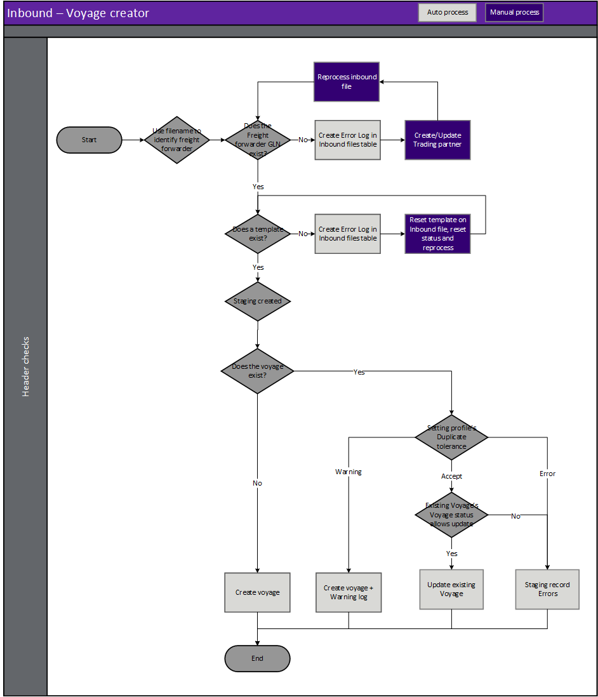
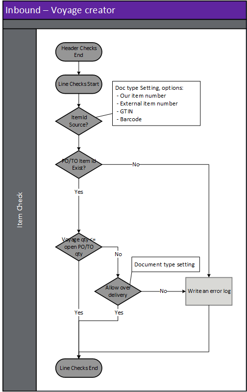

---
# required metadata

title: [EDI Freight forwarder]
description: [EDI Freight forwarder Documents - Voyage creator]
author: [jdutoit2]
manager: Kym Parker
ms.date: 26/11/2021
ms.topic: article
ms.prod: 
ms.service: dynamics-ax-applications
ms.technology: 

# optional metadata

# ms.search.form:  [Operations AOT form name to tie this topic to]
audience: [Application User]
# ms.devlang: 
ms.reviewer: [jdutoit2]
ms.search.scope: [Which Operations client to show this topic as help for, to be set by content strategist, see list here: https://microsoft.sharepoint.com/teams/DynDoc/_layouts/15/WopiFrame.aspx?sourcedoc={23419e1c-eb64-42e9-aa9b-79875b428718}&action=edit&wd=target%28Core%20Dynamics%20AX%20CP%20requirements%2Eone%7C4CC185C0%2DEFAA%2D42CD%2D94B9%2D8F2A45E7F61A%2FVersions%20list%20for%20docs%20topics%7CC14BE630%2D5151%2D49D6%2D8305%2D554B5084593C%2F%29]
# ms.tgt_pltfrm: 
# ms.custom: [used by loc for topics migrated from the wiki]
ms.search.region: [Global for most topics. Set Country/Region name for localizations]
# ms.search.industry: [leave blank for most, retail, public sector]
ms.author: [author's Microsoft alias]
ms.search.validFrom: [month/year of release that feature was introduced in, in format yyyy-mm-dd]
ms.dyn365.ops.version: [name of release that feature was introduced in, see list here: https://microsoft.sharepoint.com/teams/DynDoc/_layouts/15/WopiFrame.aspx?sourcedoc={23419e1c-eb64-42e9-aa9b-79875b428718}&action=edit&wd=target%28Core%20Dynamics%20AX%20CP%20requirements%2Eone%7C4CC185C0%2DEFAA%2D42CD%2D94B9%2D8F2A45E7F61A%2FVersions%20list%20for%20docs%20topics%7CC14BE630%2D5151%2D49D6%2D8305%2D554B5084593C%2F%29]
---

# Voyage creator

The following subsections will describe how to view and process the **Voyage creator** from the Freight forwarder.  
Viewing the [Staging table records](#view-staging-table-records) will also be discussed.

Processing this document adds the relevant purchase and/or transfer orders to an existing open Voyage (if document setting allows) or create new Voyage(s).  

## Prerequisites
The following setup is prerequisites for the **Voyage creator**

### Freight forwarder landed cost setup
EDI > Setup > Freight forwarder landed cost setup  
Where the Freight forwarder's values differ to D365/EDI values - use the following mappings for the Voyage creator:
1. Create [Shipping port mapping](../SETUP/FF%20SETUP/Shipping%20port%20mapping.md) to map the Trading partner's values to D365 Landed cost shipping port.
2. Create [Modes of delivery mapping](../SETUP/FF%20SETUP/Modes%20of%20delivery%20mapping.md) to map the Trading partner's values to D365 Modes of delivery.
3. Create [Customs broker mapping](../SETUP/FF%20SETUP/Customs%20broker%20mapping.md) to map the Trading partner's values to D365 Vendor of Shipping type set to _Customs broker_.
4. Create [Shipping container types mapping](../SETUP/FF%20SETUP/Shipping%20container%20types%20mapping.md) to map the Trading partner's values to D365 Landed cost shipping conntainer types.
5. Create [Shipping measurement unit mapping](../SETUP/FF%20SETUP/Shipping%20measurement%20unit%20mapping.md) to map the Trading partner's values to D365 Landed cost shipping measurement units.

### Document type setup
EDI > Setup > Document types: Voyage creator
1. Create [Template](../../CORE/Setup/DocumentTypes/File%20templates.md) for the document.
1. Create [Setting profile](../SETUP/SETTING%20PROFILES/Voyage%20creator.md) for the document.

### Trading partners
EDI > Setup > Trading partners
1. If the Freight forwarder landed cost [trading partner](../SETUP/Trading%20partner.md) doesn't exist, create the new trading partner.
1. Assign the Freight forwarder landed cost setup to the trading partner's options:
    -  Shipping port mapping: Options from **EDI > Setup > Freight forwarder landed cost setup > Shipping port mapping**
    -  Modes of delivery mapping: Options from **EDI > Setup > Freight forwarder landed cost setup > Modes of delivery mapping**
    -  Customs broker mapping: Options from **EDI > Setup > Freight forwarder landed cost setup > Customs broker mapping**
    -  Shipping container types mapping: Options from **EDI > Setup > Freight forwarder landed cost setup > Shipping container types mapping**
    -  Shipping measurement unit mapping: Options from **EDI > Setup > Freight forwarder landed cost setup > Shipping measurement unit mapping**
1. Add and enable the **Voyage creator** document to the [Freight forwarder landed cost trading partner](../SETUP/Trading%20partner.md) and select the applicable:
    - Template
    - Setting profile
    - Search mask

## Processing
Inbound files have the following three steps:
1. **Import** - Imported file can be viewed in **EDI > Files > Inbound files**.
2. **Import to staging** - Imported file is processed to staging record/s. The staging record/s can be viewed at **EDI > Documents > Freight forwarder landed cost documents > Voyage creator**.
3. **Staging to target** - The staging record/s is processed to target. If the Voyage creator is succefully processed the relevent D365 purchase and/or transfer orders will be added to an existing open Voyage (if document setting allows) or create a new Voyage.

### Create document

### Header checks for Voyage creator
Header checks are performed when:
1. Importing Voyage creator file
2. Processing from import to staging
3. Processing from staging to target

### Step 1 - Import
When an EDI file is imported, the file name is key to identifying the trading partner and therefore the document template. See [Trading partners](../../CORE/Setup/Trading%20partners.md) for further details.  It is based on this document template that the data within the file is identified and a record created in the EDI staging table in the next step.

> Note: The file mask is used to identify the trading partner and therefore template

### Step 2 - Import to staging - Inbound file validation
When the EDI file is retrieved and imported, there are various validations that are completed before the staging record is created in the EDI staging table.
If the processing of **Import to staging** errors, the Inbound file's **Status** will be set to _Error_ and no staging record created.

**Rule Id**         |	**Details**         
:--                 |:--                  
**Check Template**  |	Identify a template for the Trading partner/Document type. This will be used to identify the whereabouts of data within the file

#### Possible issues and fixes
**Import to staging** errors for EDI file can be viewed in:
- **EDI > Files > Inbound files** filtered to **Status** set to _Error_
- **EDI > Document maintenance**, tab **3PL documents**, tile **File import errors**

At this step the issues are usually around the file not matching the template.
- Does the file have the correct template assigned (General tab, field **Template**):
  - **No**: Use **Reset template** to assign a different template. If this should apply to future documents for the Trading partner, also update in **Trading partners**.
  - **Yes**: Review **Log** and fix the applicable template in **EDI > Setup > Document types**. Examples issues are date format, new field.

Example error for file not matching template: 'Segment '<xml' not found in EDI template mapping'

### Step 3 - Staging to target
If the processing of **Staging to target** errors, the staging record's **Staging to target status** will be set to _Error_ and the D365 Landed cost voyage won't be created/added to for the staging record.

#### Possible issues and fixes
**Staging to target** errors for Voyage creator can be viewed in:
- **EDI > Documents > Freight forwarder landed cost documents > Voyage creator** filtered to **Staging to target tatus** set to _Error_
- **EDI > Document maintenance**, tab **Freight forwarder landed cost documents**, tile **Voyage creator errors**
- **EDI > Document maintenance**, tab **Freight forwarder landed cost documents**, **Documents** page, tab **Voyage creator**

At this step the issues are usually around mapping/business logic issues.  
Review the **Log** or **Version log** for the applicable record to find the issue.  
Example errors and possible fixes are discussed in [FAQ](../OTHER/FAQ.md#voyage-creator).

### Staging line validation

**Rule Id**                 | **Details**                                               | Error    
:---                        |:---                                                       |:---              
Purchase/Transfer order number	| Find the D365 purchase or transfer order number to which the voyage creator belongs	| Error at Staging table.    No voyage created
No Valid Item	            | No valid item based on the different options available    | Error at Staging table.    No voyage created

### Journey template calculation
The following fields from the EDI Voyage creator document is used when calculating the target Landed cost's Voyage field **Journey template**:
- From port
- To port
- Mode of delivery

> Note: If **multiple** journey templates are found, the staging-to-target step will error, and user will be able to select the correct **Journey template** in the staging page and process.

#### Example
Inbound file fields example:
- From port (ShipFromPort): CNSHA
- To port (ShipToPort): USLGB
- Mode of delivery (DlvModeId): SEA 

Our example mapped to delivery mode 40 on Trading partner, will find the following Journey template:
Journey template	| From port	    | To port	    | Mode of delivery	| Journey from port	    | Journey to port
:--                 |:--            |:--            |:--                |:--                    |:--
CNSHA-USLGB(S)	    | CNSHA	        | USLGB	        | 40	            | √	                    | √

**Journey template** (ShipJourneyId) field in the Voyage creator, also allows for inbound file to specify the Journey template which will then disregard the port and delivery mode fields. This field isn’t mandatory but provides flexibility.

### Duplicate tolerance
Document setting [Duplicate tolerance](../SETUP/SETTING%20PROFILES/Voyage%20creator.md) manages the outcome when an EDI Voyage creator document is received and the **Booking reference** is already used on an existing D365 Landed cost Voyage. The options are:
- **Accept** – Add to existing Open Voyage
- **Warning** – Creates new Voyage and staging record has Warning log
- **Error** – Staging record errors, and Voyage isn’t created

> Note: When the **Voyage status** assigned to the existing D365 Landed cost allows modification, the existing D365 Voyage is considered _Open_. 

## View staging table records
To view the Voyage creator staging records, go to **EDI > Documents > Freight forwarder landed cost documents > Voyage creator**.  
Use this page to review staging and process the EDI documents. Succesully processing to target adds the relevant purchase and/or transfer orders to an existing open Voyage (if document setting allows) or create new Voyage(s).

### List page
The following EDI fields are available on the list page.

**Field**               | **Description**
:---                    |:---
**EDI number**          |	EDI Staging table record id. Select **EDI number** or the **Details** button on the Action Pane, to view the details for the selected record. The number sequence is determined by [EDI number](../../CORE/Setup/EDI%20parameters.md#number-sequence) on the **EDI parameters**.
**Company account**     | Legal entity of the document.
**Company GLN**         | The company’s global location number is shown here.
**Staging to target status**    | The current status of the staging record. Options include:   • **Not Started** – The staging record has been successfully processed from the inbound file to the staging table but not processed to target.   • **Error** – The staging record has been processed from the staging table but no target has yet been created/updated.  There are errors with the staging record that needs to be reviewed.   • **Completed** – The staging record has been succesfully processed and created/added to Landed cost voyage(s).   • **Canceled** – The record has been manually canceled and will be excluded from processing.
**Trading partner account**     | Vendor account of **Shipping type** set to _Shipping company_ assigned to the staging record.
**Trading partner GLN**         | The Freight forwarder’s global location number is shown here.
**Created date and time**       | The date and time the selected record was created in the staging table.
**Sent**                        | Indicates if the **Functional acknowledgement outbound** has been sent to the trading partner for the inbound document record.
**Message**                     | Displays the first error's message from **Version log**.

### Buttons
The following buttons are available on the **Voyage creator**'s Action Pane, tab **Voyage creator**.

**Button**	                    | **Description**
:---                            |:----
**Process selected voyages**    | Process voyage creator for the selected record in the staging table.
**Process all voyages**         | Process voyage creator for the staging records that have a **Staging to target status** set to _Not started_. 
**Inbound files**               | View the inbound file record the selected staging record.
**Trading partner**             | View the trading partner details in the [Trading partners](../SETUP/Trading%20partner.md) page.
**Voyages**                     | If the EDI staging record has been completed it is possible to inquire on the Landed cost voyages created or added to.
**Show log**                    | If there are Errors within the document, it is possible to review them at any time using this button. Shows only the current version.
**Version log**                 | View all log versions. When a document’s status is reset and reprocessed, a new log version is created. Can view all log versions.
**Reset Status**                | You can reset the **Staging to target status** to _Not started_. This can be used to reprocess the selected record/s. Documents can only be processed if **Staging to target status** is set to _Not started_.
**Edit reset status recurrence**    | If the underlying issue was resolved after all the reset attempts have been completed the user can use this button to edit the recurrence field/s. This will:   • Update **Reset status profile** to _blank_   • Update the **Reset status date/time** to next time reset will run   • **Reset status attempts** set to _Zero_ and   • **Recurrence** text updated with changed recurrence details
**Cancel**                      | Select **Cancel** to update the **Staging to target status** to _Canceled_. Button is enabled when the **Staging to target status** is not set to _Completed_.

The following buttons are available on the **Voyage creator**'s Action Pane, tab **Acknowledgement**.
The **Acknowledgement** tab is available on all incoming documents staging pages and enables the user to process or view the **Functional acknowledgement outbound** that has been created for the inbound document.

**Button**	                    | **Description**
:---                            |:----
**Send to EDI**                 | If the **Sent** field for the staging record is set to _No_, use this button to create the **Functional acknowledgement outbound** record and also update the **Sent** field to _Yes._
**Reset flag**                  | If the **Sent** field for the staging record has been set to _Yes_, use this button to reset **Sent** to _No_.
**Functional acknowledgement**  | Use this button to view the **Functional acknowledgement outbound** record created for the inbound document.

### Header fields
The following EDI Header staging fields are available on the header page.

**Field**	            | **Description**	                                    | **D365 header target**
:---                    |:---                                                   |:---
<ins>**Identification FastTab**</ins>
<ins>**Identification**</ins>		
**EDI number**          | EDI Staging table record id                           | 
**Company account**     | Legal entity of the document
**Company GLN**         | The company’s global location number is shown here.   | 
**Staging to target status**    |  The current status of the staging record. Options include:   • **Not Started** – The staging record has been successfully processed from the inbound file to the staging table but not processed to target.   • **Error** – The staging record has been processed from the staging table but no target has yet been created/updated.  There are errors with the staging record that needs to be reviewed.   • **Completed** – The staging record has been succesfully processed and created/added to Landed cost voyage(s).   • **Canceled** – The record has been manually canceled and will be excluded from processing.
<ins>**Reset status**</ins>		
**Reset status profile**    | Reset status profile assigned to the file/document. This will default from EDI shared parameters or can be overridden on Trading partner’s incoming and outgoing documents. The profile can also be changed to another profile which will also reset the **Reset status attempts** to 0 and reset the **Reset status date/time**	
**Reset status date/time**  | Next date/time automatic reset status will run	
**Reset status attempts**   | Number of reset attempts already processed. The reset attempts will stop once this number reaches the **End after** as per assigned **Reset status profile**’s Recurrence	
**Recurrence**              | Recurrence text. Contains standard details of Recurrence, for example:   •	Interval (recurrence pattern)   • How many times the period will run (End after)   • From date/time the recurrence will start	

### Line fields
The following EDI Line fields are available on the lines page.   

**Field**                   | **Description**                                                           | **D365 target**
:---                        |:---                                                                       |:---
**Line number**             | The line within the EDI table/file. Does not refer to Purchase or Transfer order line number.	
**Booking reference**       | Freight forwarder’s reference for the voyage. Can also be used as reference for Voyage tracking document   | Voyage > Booking reference
**Description**             | Voyage description	                                                    | Voyage > Description
**Voyage**                  | Populated with target Voyage, once staging record has been completed and created a voyage/s	| Voyage > Voyage
**Shipping container**      | Shipping container identification. Used to create a new Landed cost shipping container or add to existing container for the voyage  | Voyage lines > Shipping container
**Shipping container type** | Used to populate to Shipping container type for the target Shipping container. Mapped values can be used by assigning [Shipping container types mapping](../SETUP/FF%20SETUP/Shipping%20container%20types%20mapping.md) to the Trading partner.	| Shipping container > Shipping container type
**Ship date**               | Voyage and Shipping container’s ship date	                                | Voyage > Ship date   Shipping container > Ship date
**From port**               | The originating **From port**. If Journey template is not provided, this field is used to determine Journey template	| Used in [calculation](#journey-template-calculation) for Voyage > Journey template
**To port**                 | The final destination’s **To port**. If Journey template not provided, this field is used to determine Journey template	| Used in [calculation](#journey-template-calculation) for Voyage > Journey template
**Mode of delivery**        | The mode of delivery between **From** and **To port**. If Journey template not provided, this field is used to determine Journey template	| Used in calculation for Voyage > Journey template
**Number**                  | The D365 **Purchase** or **Transfer order number** for the voyage line	| Voyage lines > Number
**Reference**               | Indicates the reference for Number. Options are:   • Purchase order   • Transfer	| Voyage lines > Reference
**Bar code**                | The item identifier as sent by the trading partner. Used when Item Id source is:   • GTIN   • Barcode   Converted to internal item number by using **Item id source** on document settings.	| Voyage lines > Item number
**Item number**             | The item identifier as sent by the trading partner. Used when Item Id source is:   • Our item number   • External item number   Converted to internal item number by using **Item id source** on document settings.	| Voyage lines > Item number
**Size**                    | Product dimension - Size	                                            | Voyage lines > Size
**Style**                   | Product dimension - Style	                                            | Voyage lines > Style
**Version**                 | Product dimension - Version                                           | Voyage lines > Version
**Configuration**           | Product dimension - Configuration	                                    | Voyage lines > Configuration
**Color**                   | Product dimension - Colour	                                        | Voyage lines > Color
**Quantity**                | Voyage line’s quantity	                                                | Voyage lines > Quantity
**Unit**                    | Unit of measure of Voyage line quantity.   Mapped values can be used by assigning [UOM mapping](../../CORE/Setup/UOM%20mapping.md) to the Trading partner.	    | Voyage line details > Reference > Unit
**House air waybill/Bill of lading**    | HAWB for voyage line	                                        | Voyage > House air waybill/Bill of lading
**Master air waybill/Bill of lading**   | MAWB for voyage line	                                        | Voyage > Master air waybill/Bill of lading
**Folio**                   | Folio for voyage line.   If blank, the Landed cost Folio number sequence will be used to create a new folio | Voyage lines > Folio
**Vendor account**          | Folio’s vendor account	                                                | Folios > Vendor account
**Customs broker**          | Folio’s customer broker.   Mapped values can be used by assigning [Customs broker mapping](../SETUP/FF%20SETUP/Customs%20broker%20mapping.md) to the Trading partner.	| Folios > Customs broker
**Number of cartons**       | Voyage line and folio’s number of cartons	                                | Voyage lines > Number of cartons   Folios > Number of cartons
**Measurement**             | Voyage measurement	                                                    | oyage > Measurement
**Measurement unit**        | Voyage measurement unit.   Mapped values can be used by assigning [Shipping measurement unit mapping](../SETUP/FF%20SETUP/Shipping%20measurement%20unit%20mapping.md) to the Trading partner.	| Voyage > Measurement unit
**Line measurement**        | Voyage line measurement	                                                | Voyage lines > Measurement
**Line measurement unit**   | Voyage line measurement unit.   Mapped values can be used by assigning [Shipping measurement unit mapping](../SETUP/FF%20SETUP/Shipping%20measurement%20unit%20mapping.md) to the Trading partner.	 | Voyage lines > Measurement unit
**Vessel**                  | Voyage vessel	                                                            | Voyage > Vessel
**External Voyage Id**      | External voyage identification	                                        | Voyage > External voyage ID
**Journey template**        | Journey template to be used for Landed cost Tracking.   If blank, the following will be used to determine the applicable Journey template:   • From port   •	To port   •	Mode of delivery    | Voyage > Journey template
**Departure date**          | Departure date for the voyage	                                            | Voyage > Departure date
**ETA at shipping port**    | Estimated arrival at shipping port	                                    | Voyage > ETA at shipping port
**Shipment estimated delivery date**    | Estimated delivery date	                                    | Voyage > Estimated delivery date   Container > Estimated delivery date - if **Container estimated delivery date** blank
**Container estimated delivery date**	| Estimated delivery date for container.   If blank, **Shipment estimated delivery date** will be used	| Container > Estimated delivery date
**Shipping company seal number**    | Container’s shipping company seal number	                        | Container > Shipping company seal number

