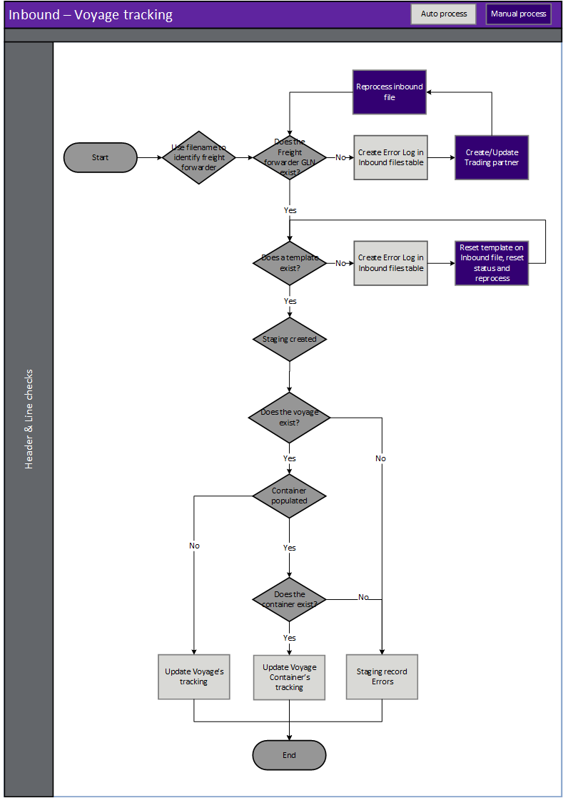

---
# required metadata

title: [EDI Freight forwarder]
description: [EDI Freight forwarder Documents - Voyage tracking]
author: [jdutoit2]
manager: Kym Parker
ms.date: 29/11/2021
ms.topic: article
ms.prod: 
ms.service: dynamics-ax-applications
ms.technology: 

# optional metadata

# ms.search.form:  [Operations AOT form name to tie this topic to]
audience: [Application User]
# ms.devlang: 
ms.reviewer: [jdutoit2]
ms.search.scope: [Which Operations client to show this topic as help for, to be set by content strategist, see list here: https://microsoft.sharepoint.com/teams/DynDoc/_layouts/15/WopiFrame.aspx?sourcedoc={23419e1c-eb64-42e9-aa9b-79875b428718}&action=edit&wd=target%28Core%20Dynamics%20AX%20CP%20requirements%2Eone%7C4CC185C0%2DEFAA%2D42CD%2D94B9%2D8F2A45E7F61A%2FVersions%20list%20for%20docs%20topics%7CC14BE630%2D5151%2D49D6%2D8305%2D554B5084593C%2F%29]
# ms.tgt_pltfrm: 
# ms.custom: [used by loc for topics migrated from the wiki]
ms.search.region: [Global for most topics. Set Country/Region name for localizations]
# ms.search.industry: [leave blank for most, retail, public sector]
ms.author: [author's Microsoft alias]
ms.search.validFrom: [month/year of release that feature was introduced in, in format yyyy-mm-dd]
ms.dyn365.ops.version: [name of release that feature was introduced in, see list here: https://microsoft.sharepoint.com/teams/DynDoc/_layouts/15/WopiFrame.aspx?sourcedoc={23419e1c-eb64-42e9-aa9b-79875b428718}&action=edit&wd=target%28Core%20Dynamics%20AX%20CP%20requirements%2Eone%7C4CC185C0%2DEFAA%2D42CD%2D94B9%2D8F2A45E7F61A%2FVersions%20list%20for%20docs%20topics%7CC14BE630%2D5151%2D49D6%2D8305%2D554B5084593C%2F%29]
---

# Voyage tracking

The following subsections will describe how to view and process the **Voyage tracking** from the Freight forwarder.  
Viewing the [Staging table records](#view-staging-table-records) will also be discussed.

Processing this document provides the ability to update the following tracking leg fields on D365 voyage(s) / container(s):
- Start date
- Estimated end date
- Actual end date
- Note

The following fields are automatically updated as well when the tracking leg dates are updated:
- Estimated days
- Actual days

The tracking leg for the complete voyage can be updated, or per container.

## Prerequisites
The following setup is prerequisites for the **Voyage tracking**

### Freight forwarder landed cost setup
EDI > Setup > Freight forwarder landed cost setup  
Where the Freight forwarder's values differ to D365/EDI values - use the following mappings for the Voyage tracking:
1. Create [Shipping port mapping](../SETUP/FF-SETUP/Shipping-port-mapping.md) to map the Trading partner's values to D365 Landed cost shipping port.
2. Create [Modes of delivery mapping](../SETUP/FF-SETUP/Modes-of-delivery-mapping.md) to map the Trading partner's values to D365 Modes of delivery.
3. Create [Activity mapping](../SETUP/FF-SETUP/Activity-mapping.md) to map the Trading partner's values to EDI Activities.
4. Create [Shipping port qualifier mapping](../SETUP/FF-SETUP/Shipping-port-qualifier-mapping.md) to map the Trading partner's values to EDI Shipping port qualifier.

### Document type setup
EDI > Setup > Document types: Voyage tracking
1. Create [Template](../../CORE/Setup/DocumentTypes/File-templates.md) for the document.
1. Create [Setting profile](../SETUP/SETTING-PROFILES/Voyage-tracking.md) for the document.

### Trading partners
EDI > Setup > Trading partners
1. If the Freight forwarder landed cost [trading partner](../SETUP/Trading-partner.md) doesn't exist, create the new trading partner.
1. Assign the Freight forwarder landed cost setup to the trading partner's options:
    -  Shipping port mapping: Options from **EDI > Setup > Freight forwarder landed cost setup > Shipping port mapping**
    -  Modes of delivery mapping: Options from **EDI > Setup > Freight forwarder landed cost setup > Modes of delivery mapping**
    -  Activity mapping: Options from **EDI > Setup > Freight forwarder landed cost setup > Activity mapping**
    -  Shipping port qualifier mapping: Options from **EDI > Setup > Freight forwarder landed cost setup > Shipping port qualifier mapping**
1. Add and enable the **Voyage tracking** document to the [Freight forwarder landed cost trading partner](../SETUP/Trading-partner.md) and select the applicable:
    - Template
    - Setting profile
    - Search mask

## Processing
Inbound files have the following three steps:
1. **Import** - Imported file can be viewed in **EDI > Files > Inbound files**.
2. **Import to staging** - Imported file is processed to staging record/s. The staging record/s can be viewed at **EDI > Documents > Freight forwarder landed cost documents > Voyage tracking**.
3. **Staging to target** - The staging record/s is processed to target. If the Voyage tracking is succefully processed the relevent D365 Landed cost Voyage or Container's tracking leg will be updated.

### Create document

### Header checks for Voyage tracking
Header checks are performed when:
1. Importing Voyage tracking file
2. Processing from import to staging
3. Processing from staging to target

### Step 1 - Import
When an EDI file is imported, the file name is key to identifying the trading partner and therefore the document template. See [Trading partners](../../CORE/Setup/Trading-partners.md) for further details.  It is based on this document template that the data within the file is identified and a record created in the EDI staging table in the next step.

> Note: The file mask is used to identify the trading partner and therefore template

### Step 2 - Import to staging - Inbound file validation
When the EDI file is retrieved and imported, there are various validations that are completed before the staging record is created in the EDI staging table.
If the processing of **Import to staging** errors, the Inbound file's **Status** will be set to _Error_ and no staging record created.

**Rule Id**         |	**Details**         
:--                 |:--                  
**Check Template**  |	Identify a template for the Trading partner/Document type. This will be used to identify the whereabouts of data within the file

#### Possible issues and fixes
**Import to staging** errors for EDI file can be viewed in:
- **EDI > Files > Inbound files** filtered to **Status** set to _Error_
- **EDI > Document maintenance**, tab **3PL documents**, tile **File import errors**

At this step the issues are usually around the file not matching the template.
- Does the file have the correct template assigned (General tab, field **Template**):
  - **No**: Use **Reset template** to assign a different template. If this should apply to future documents for the Trading partner, also update in **Trading partners**.
  - **Yes**: Review **Log** and fix the applicable template in **EDI > Setup > Document types**. Examples issues are date format, new field.

Example error for file not matching template: 'Segment '<xml' not found in EDI template mapping'

### Step 3 - Staging to target
If the processing of **Staging to target** errors, the staging record's **Staging to target status** will be set to _Error_ and the D365 Landed cost voyage's tracking leg won't be updated based on information from the staging record.

#### Possible issues and fixes
**Staging to target** errors for Voyage tracking can be viewed in:
- **EDI > Documents > Freight forwarder landed cost documents > Voyage tracking** filtered to **Staging to target tatus** set to _Error_
- **EDI > Document maintenance**, tab **Freight forwarder landed cost documents**, tile **Voyage tracking errors**
- **EDI > Document maintenance**, tab **Freight forwarder landed cost documents**, **Documents** page, tab **Voyage tracking**

At this step the issues are usually around mapping/business logic issues.  
Review the **Log** or **Version log** for the applicable record to find the issue.  
Example errors and possible fixes are discussed in [FAQ](../OTHER/FAQ.md#voyage-tracking).

### Staging line validation

**Rule Id**                 | **Details**                                               | **Error**    
:---                        |:---                                                       |:---              
Voyage	                    | Find the D365 Voyage to which the voyage tracking belongs | Error at Staging table.  No voyage tracking updated

### Activity
Activity is mapped on Trading partner form’s Options. This is used to find the applicable leg on the Voyage’s tracking and if the start or end date should be updated. 

Example X12 Shipment status codes mapped to D365 Activity in EDI's [Activity mapping](../SETUP/FF-SETUP/Activity-mapping.md):

X12 Shipment status code    | X12 Description	                                | Landed cost Activity	    | Date selection
:--                         |:--                                                |:--                        |:--
**L**                       | Loading	                                        | Load	                    | Start date
**AE**                      | Loaded on Board at First Port of Load             | Load	                    | End date
**VD**                      | Vessel Departure	                                | Sail	                    | Start date
**UV**                      | Discharged from Vessel at Last Port of Discharge	| Sail	                    | End date
**VA**                      | Vessel Arrival	                                | Sail	                    | End date
**CT**                      | Customs Released	                                | Customs	                | End date
**AM**                      | Loaded on Truck	                                | Local	                    | Start date
**D**                       | Actual Door Delivery	                            | Local	                    | End date

#### Estimated/Actual days
The [Voyage tracking’s](../SETUP/SETTING-PROFILES/Voyage-tracking.md) document setup specifies what indicator the Trading partner will use for estimated vs. actual days.  
Since Landed cost only has an estimate for end dates, the date qualifier doesn’t affect start dates.  

Example X12 date qualifiers:
- 139 = Estimated
- 140 = Actual

#### Port qualifier
Port qualifier is mapped on Trading partner form’s Options.

Example X12 qualifiers:
- L = Port of Loading (From port)
- R = Place of Receipt (From port)
- D = Port of Discharge (To port)
- E = Place of Delivery (To port)

This is used to find the applicable leg on the Voyage tracking to update, for example a port could appear multiple times on a multi-leg journey. 

#### Examples
Examples below using above X12 shipment status codes, port qualifiers and date qualifiers of 139 for estimated and 140 for actual.

Field & Example	            | Tracking leg update result
:--                         |:--    
Activity = L   Date qualifier = 140 | Update tracking leg with **Activity** set to _Load_'s **Start date**
Activity = OA   Date qualifier = 139   Port = CNNGB   Port qualifier = L | Update tracking leg with **Activity** set to _Sail_ where CNNGB is the _From port_'s **Start date**
Activity = VA   Date qualifier = 139   Port = AUMEL   Port qualifier = D | Update tracking leg with **Activity** set to _Sail_ where AUMEL is the _To port_'s **Estimated end date**
Activity = VA   Date qualifier = 140   Port = AUMEL   Port qualifier = D | Update tracking leg with **Activity** set to _Sail_ where AUMEL is the _To port_'s **Actual end date**

## View staging table records
To view the Voyage tracking staging records, go to **EDI > Documents > Freight forwarder landed cost documents > Voyage tracking**.  
Use this page to review staging and process the EDI documents. Succesully processing to target adds the relevant purchase and/or transfer orders to an existing open Voyage (if document setting allows) or create new Voyage(s).

### List page
The following EDI fields are available on the list page.

**Field**               | **Description**
:---                    |:---
**EDI number**          |	EDI Staging table record id. Select **EDI number** or the **Details** button on the Action Pane, to view the details for the selected record. The number sequence is determined by [EDI number](../../CORE/Setup/EDI-parameters.md#number-sequence) on the **EDI parameters**.
**Company account**     | Legal entity of the document.
**Company GLN**         | The company’s global location number is shown here.
**Staging to target status**    | The current status of the staging record. Options include:   • **Not Started** – The staging record has been successfully processed from the inbound file to the staging table but not processed to target.   • **Error** – The staging record has been processed from the staging table but no target has yet been created/updated.  There are errors with the staging record that needs to be reviewed.   • **Completed** – The staging record has been succesfully processed and updated Landed cost Voyage's tracking leg.   • **Canceled** – The record has been manually canceled and will be excluded from processing.
**Trading partner account**     | Vendor account of **Shipping type** set to _Shipping company_ assigned to the staging record.
**Trading partner GLN**         | The Freight forwarder’s global location number is shown here.
**Created date and time**       | The date and time the selected record was created in the staging table.
**Sent**                        | Indicates if the **Functional acknowledgement outbound** has been sent to the trading partner for the inbound document record.
**Message**                     | Displays the first error's message from **Version log**.

### Buttons
The following buttons are available on the **Voyage tracking**'s Action Pane, tab **Voyage tracking**.

**Button**	                    | **Description**
:---                            |:----
**Process selected voyages**    | Process voyage tracking for the selected record in the staging table.
**Process all voyages**         | Process voyage tracking for the staging records that have a **Staging to target status** set to _Not started_. 
**Inbound files**               | View the inbound file record the selected staging record.
**Trading partner**             | View the trading partner details in the [Trading partners](../SETUP/Trading-partner.md) page.
**Voyages**                     | If the EDI staging record has been completed it is possible to inquire on the applicable Landed cost voyages.
**Show log**                    | If there are Errors within the document, it is possible to review them at any time using this button. Shows only the current version.
**Version log**                 | View all log versions. When a document’s status is reset and reprocessed, a new log version is created. Can view all log versions.
**Reset Status**                | You can reset the **Staging to target status** to _Not started_. This can be used to reprocess the selected record/s. Documents can only be processed if **Staging to target status** is set to _Not started_.
**Edit reset status recurrence**    | If the underlying issue was resolved after all the reset attempts have been completed the user can use this button to edit the recurrence field/s. This will:   • Update **Reset status profile** to _blank_   • Update the **Reset status date/time** to next time reset will run   • **Reset status attempts** set to _Zero_ and   • **Recurrence** text updated with changed recurrence details
**Cancel**                      | Select **Cancel** to update the **Staging to target status** to _Canceled_. Button is enabled when the **Staging to target status** is not set to _Completed_.

The following buttons are available on the **Voyage tracking**'s Action Pane, tab **Acknowledgement**.
The **Acknowledgement** tab is available on all incoming documents staging pages and enables the user to process or view the **Functional acknowledgement outbound** that has been created for the inbound document.

**Button**	                    | **Description**
:---                            |:----
**Send to EDI**                 | If the **Sent** field for the staging record is set to _No_, use this button to create the **Functional acknowledgement outbound** record and also update the **Sent** field to _Yes._
**Reset flag**                  | If the **Sent** field for the staging record has been set to _Yes_, use this button to reset **Sent** to _No_.
**Functional acknowledgement**  | Use this button to view the **Functional acknowledgement outbound** record created for the inbound document.

### Header fields
The following EDI Header staging fields are available on the header page.

**Field**	            | **Description**	                                    | **D365 header target**
:---                    |:---                                                   |:---
<ins>**Identification FastTab**</ins>   |
<ins>**Identification**</ins>		|
**EDI number**          | EDI Staging table record id                           | 
**Company account**     | Legal entity of the document
**Company GLN**         | The company’s global location number is shown here.   | 
**Staging to target status**    |  The current status of the staging record. Options include:   • **Not Started** – The staging record has been successfully processed from the inbound file to the staging table but not processed to target.   • **Error** – The staging record has been processed from the staging table but no target has yet been created/updated.  There are errors with the staging record that needs to be reviewed.   • **Completed** – The staging record has been succesfully processed and updated Landed cost Voyage's tracking leg.   • **Canceled** – The record has been manually canceled and will be excluded from processing.
<ins>**Reset status**</ins>		|
**Reset status profile**    | Reset status profile assigned to the file/document. This will default from EDI shared parameters or can be overridden on Trading partner’s incoming and outgoing documents. The profile can also be changed to another profile which will also reset the **Reset status attempts** to 0 and reset the **Reset status date/time**	
**Reset status date/time**  | Next date/time automatic reset status will run	
**Reset status attempts**   | Number of reset attempts already processed. The reset attempts will stop once this number reaches the **End after** as per assigned **Reset status profile**’s Recurrence	
**Recurrence**              | Recurrence text. Contains standard details of Recurrence, for example:   •	Interval (recurrence pattern)   • How many times the period will run (End after)   • From date/time the recurrence will start	

### Line fields
The following EDI Line fields are available on the lines page.   

**Field**                   | **Description**                                                           | **D365 target**
:---                        |:---                                                                       |:---
**Voyage**                  | Internal or external id for the Voyage.   Document setting **Voyage Id source** (External Id or Internal Id) used to find the applicable D365 Voyage   • External Id = Voyage’s Booking reference   • Internal Id = Voyage	                   | Used to find Voyage target
**Shipping container**      | Shipping container identification.    If left blank, the complete voyage’s tracking will be updated. If populated, only the applicable container on the voyage’s tracking will be updated.	        | Used to find Voyage’s Shipping container
**Activity**                | Activity/ Shipment status code of the voyage.   Used to find the applicable Tracking leg and determines if start/end date is updated.   Mapped values must be used by assigning Activity mapping to the Trading partner.   Voyage tracking document setting profile’s date qualifiers for Estimated and Actual is also required when end date is updated.	| Used to find Voyage tracking leg and which end date to populate
**Port**                    | Activity location	    | Used to find Voyage tracking leg
**Port qualifier**          | If port is provided, indicates if it is the **From** or **To port** for the leg	| Used to find Voyage tracking leg
**Mode of delivery**        | Mode of delivery for the leg	
**Date**                    | Date the activity will or has occurred	| Voyage > Tracking > Start date OR   Estimated end date OR   Actual end date
**Date qualifier**          | Specifies the type of Date and mapped in [document settings](../SETUP/SETTING-PROFILES/Voyage-tracking.md). Options are:   • Estimated   • Actual   Used to determine which Tracking date will be updated where the Activity is for an End date.   Start date doesn’t have an estimated vs. actual, therefor no effect on where date is populated for a Start date.	
**Note**                    | Notes for the tracking update. Will override any current notes for the tracking leg.  | Voyage > Tracking > Notes
