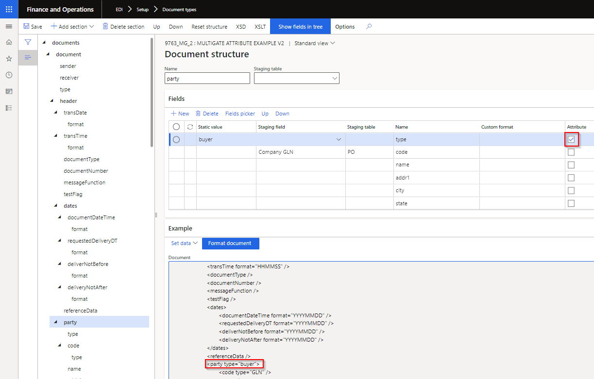
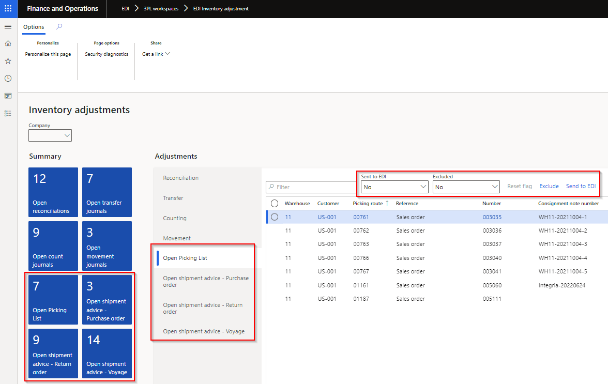
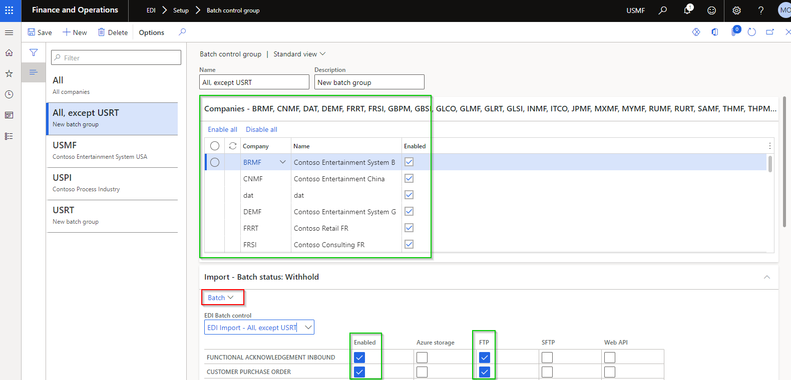
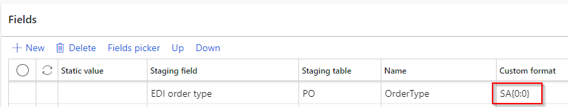
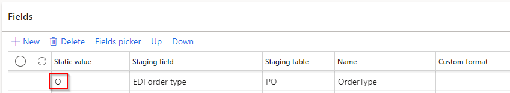
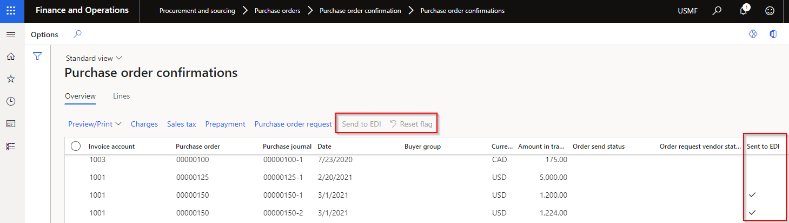
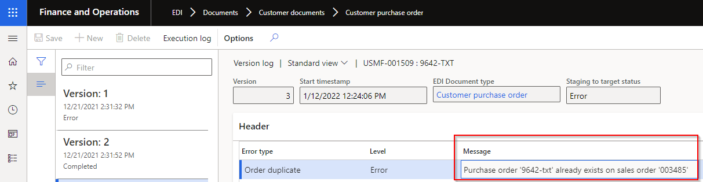
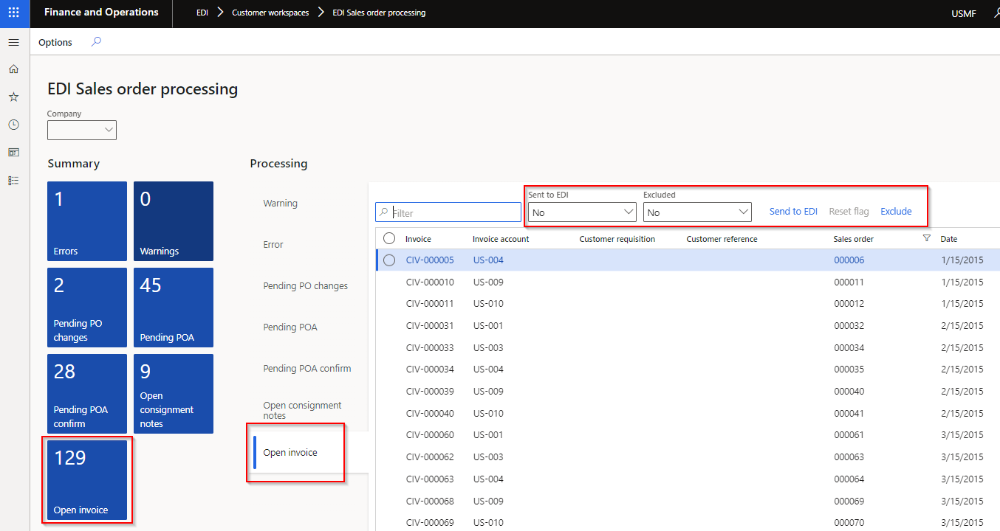

---
# required metadata

title: EDI
description: EDI - Release notes
author: jdutoit2
manager: Kym Parker
ms.date: 2023-01-18
ms.topic: article
ms.prod: 
ms.service: dynamics-ax-applications
ms.technology: 

# optional metadata

# ms.search.form: 
audience: Application User
# ms.devlang: 
ms.reviewer: jdutoit2

# ms.tgt_pltfrm: 
# ms.custom: ["21901", "intro-internal"]
ms.search.region: Global
# ms.search.industry: [leave blank for most, retail, public sector]
ms.author: jdutoit2
ms.search.validFrom:  2016-05-31
ms.dyn365.ops.version: AX 7.0.1
---

# 	Release notes
This document describes the features that are either new or changed in the release version mentioned.

# Next version

Next release is planned for 31 January 2023.

### Release 10.0.29.TBD

DXC EDI 10.0.29 runs on the following Microsoft releases

Base	  | Version	  | Release
:--       |:--            |:--
Microsoft Dynamics 365 application	| 10.0.29	  | [What’s new or changed in Dynamics 365 application version 10.0.29](https://docs.microsoft.com/en-us/dynamics365/finance/get-started/whats-new-changed-10-0-29)
Microsoft Dynamics 365 application	| 10.0.30	  | [What’s new or changed in Dynamics 365 application version 10.0.30](https://docs.microsoft.com/en-us/dynamics365/finance/get-started/whats-new-changed-10-0-30)
Microsoft Dynamics 365 application	| 10.0.31	  | [What’s new or changed in Dynamics 365 application version 10.0.31](https://docs.microsoft.com/en-us/dynamics365/finance/get-started/whats-new-changed-10-0-31)

#### Build 10.0.29.TBD
Planned release date: 31 January 2023   

<ins>New features</ins>

**Core module**	- Applies to all modules

Number	| Functionality	  	| Reason
:--	|:--		  	|:--	
11625	| EDI history		| Move EDI history extensions to shared EDI module and Replace SAB_EDISalesOrderHistory
5664	| Staging metadata	| The following non-editable SQL fields have been added to Document types' **Staging metadata**:   • Field type   • Field length   • Mandatory
10646	| Outbound files	| **File transfer type** filter added to Outbound files.
11978	| EDI Document maintenance workspace	| Ability to select multiple records and use **Reset status** or **Cancel**.
12007	| Connections	| **Log** ability added to all connection types. Ability to set **Logging level** and **Retention period**. This provides users the ability to set Custom alerts. For example if a connection can't connect a log with level _Error_ can be created.

**Customer module**	

Number	| Functionality	  	| Reason
:--	|:--		  	|:--
4467	| Customer purchase order | New field **Sales origin** added to Customer purchase order's Setting profile (default is Blank). Field has also been added to the Staging header. If new header staging field or document setting is not blank, the value will be written to the created Sales order's Sales origin field.
11747	| Customer advanced shipping notice| New document setting **Send only for EDI orders**. When set to _Yes_, and the sales order wasn't created via EDI, an outbound ASN staging record will not be created.
11747	| Sales invoice	| New document setting **Send only for EDI orders**. When set to _Yes_, and the sales order wasn't created via EDI, an outbound Sales invoice staging record will not be created.
12254	| Customer advanced shipping notice	| **Line number document** added to staging lines. Existing **Line number** uses Packing slip's Line numbers, but the ASN could contain multiple packing slips, thus we added the additional field **Line number document** for unique staging line numbers.
12286	| Customer purchase order	| New line field **Customer reference** added to lines. If the staging line fields **Customer requisition** and **Customer reference** is populated, these will be used when creating the sales order lines. If staging fields not populated it will use the header fields to populate new sales orders lines (previous process).
12369	| Customer purchase order acknowledgement	| New header fields added to staging:   • Terms of payment   • Terms of payment description   • Sales responsible   • Sales taker   • Email   • Telephone   • Delivery terms   • Delivery terms description   • Mode of delivery   • Mode of delivery description
12385	| Customer advanced shipping notice	| New line fields added to staging:   • Email   • Telephone   • Country of origin (as setup on product)   • Mode of delivery   • Mode of delivery description   • Way bill number - if ASN created from Shipments     New line fields added to Consignment note   • Email   • Telephone   • Mode of delivery   • Mode of delivery description

**Vendor module**	

Number	| Functionality	  	| Reason
:--	|:--		  	|:--
12224	| Vendor purchase order acknowledgement	| If populated, the POA staging line's 'Acknowledged delivery date' can update the applicable purchase order line's **Confirmed delivery date**. Previously it was updated only by the POA header's 'Acknowledged delivery date'.
12294	| Vendor purchase order acknowledgement	| Ability for the POA to add a new line to the D365 purchase order.   Map vendor's value to POA response code **Line item - added**. Set a validation option of Info, Warning or Error if allowed to add this new line to the purchase order. Warning and Error records will be displayed in the **EDI Purchase order processing** workspace.

<ins>Bug fixes</ins>

**Core module**	

Number	| Name		 | Description
:--	|:--		 |:--
11984	| Inbound text templates	| Fix CAR resolution change in 10.0.27.20220930 release for text template's line number calculation on import-to-staging step.   Issue for processing import-to-staging where the staging table's line number is the unique index.
11999	| Export template for text types	| Fix Error 'Buffer for call of SAB_EDITemplateFile is not specified.' when clicking 'Export template' for Text templates via Mappings.
5898	| Inbound files   Outbound files	| **Attachment** tab not always visible. 

**Customer module**

Number	| Name		 | Description
:--	|:--		 |:--
1603	| Customer advanced shipping notice	| Only applicable to Warehouse ASN line config **WHSContainerization**. Customer advanced shipping notice lines duplicated when lines are split (for example multiple batches).
11723	| Sales invoice	| Unticking **Send to EDI** when posting the Sales invoice still created a staging record.

**Vendor module**

Number	| Name		 | Description
:--	|:--		 |:--
1989	| Purchase agreement	| Fix **External item number** for Vendor purchase order document where created from a Purchase agreements.

# Current version

Next release is planned for 31 January 2023.

### Release 10.0.27.20221108

#### Build 10.0.27.202211082
Release date: 8 November 2022   

<ins>New features</ins>

**Core module**	- Applies to all modules

Number	| Functionality	  	| Reason
:--	|:--		  	|:--	
10535	| Refresh module	| In the unlikely scenario of a field being removed from a document, the **Refresh module** now includes removing these deleted fields when updating EDI.
11635	| Trading partners	| The following system fields have been activated for **Trading partners**, **Trading partner's incoming and outgoing documents** and **Trading partner's Connection profile**:   • Created by   • Created date and time   • Modified by   • Modified date and time   Note: For existing records the created and modified dates will be updated with **Refresh module** and the created by and modified by will be a ?

**Customer module**	

Number	| Functionality	  	| Reason
:--	|:--		  	|:--	
8057	| EDI history		| Added the following on **Sales order**'s EDI history:   • Customer purchase order where Order type = Release order
11552	| EDI history		| Added the following on **Sales agreement**'s EDI history:   • Customer purchase order where Order type = Agreement
11637	| Sales order processing workspace - Open invoice | Where the Customer trading partner's **Sales invoice** document setting **Don't send credit note** is set to Yes, these credits will be excluded on **Sales order processing workspace's** **Open invoice**

**3PL module**	

Number	| Functionality	  	| Reason
:--	|:--		  	|:--	
8057	| EDI history		| Added the following on **Sales order**'s EDI history:   • Picking list registration
8057	| EDI history		| Added the following on **Purchase order**'s EDI history:   • Shipment advice - Purchase order    • Shipment receipt - Purchase order
11552	| EDI history		| Added the following on **Transfer order**'s EDI history:   • Picking list   • Picking list registration   • Shipment advice - Transfer order   • Shipment receipt - Transfer order
11552	| EDI history		| Added the following on **Return order**'s EDI history:   • Shipment advice - Return order   • Shipment receipt - Return order
11552	| EDI history		| Added the following on **Landed cost Voyage**'s EDI history:   • Shipment advice - Voyage   • Shipment receipt - Voyage
10519	| Transfer order Picking list	| Added the ability to send a Transfer order's Picking list to EDI and reset flag in order to resend.   This was achieved by adding the following to **Transfer order history**:   • Button **Send to EDI**   • Button **Reset flag**   • Field **Sent to EDI** 

**Freight forwarder for Landed cost module**	

Number	| Functionality	  	| Reason
:--	|:--		  	|:--	
11552	| EDI history		| Added the following on **Landed cost Voyage**'s EDI history:   • Voyage creator   • Voyage tracking

<ins>Bug fixes</ins>

**Core module**	

Number	| Name		 | Description
:--	|:--		 |:--
10563	| Test path connection for Azure	| Previously if an Azure container didn't contain a file, the **Test path connection** would return a failed result.
11597	| EDI history		| Updated the link on EDI history's **EDI Document type** to filter to the applicable document type.

**3PL module**	

Number	| Name		 | Description
:--	|:--		 |:--
11649	| Transfer order	| EDI was automatically setting **Explode lines** on outbound documents:   • **Picking list**   • **Shipment advice - Transfer order**.   Since this can be set by the user, EDI doesn't need to automatically set this to Yes.     New feature: New document setting **Don't explode lines** have been added for the following inbound documents to set if **Explode lines** should automatically be Yes:   • **Picking list registration** - Applicable when **Ship transfer order** set to Yes   • **Shipment receipt - Transfer order** - Applicable when **Auto receive** set to Yes

# Previous version(s)

One year of previous versions are included below.

### Release 10.0.27.20220930

#### Build 10.0.27.202211173
Release date: 17 November 2022

<ins>Bug fixes</ins>

**Core module**	

Number	| Name		 | Description
:--	|:--		 |:--
11984	| Inbound text templates	| Fix CAR resolution change in 10.0.27.20220930 release for text template's line number calculation on import-to-staging step.   Issue for processing import-to-staging where the staging table's line number is the unique index.

#### Build 10.0.27.202209301
Release date: 30 September 2022   
Excludes Inbound Transportation management (ITM) & ITM version Freight forwarder

<ins>New features</ins>

**Core module**	- Applies to all modules

Number	| Functionality	  	| Reason
:--	|:--		  	|:--	
10549	| CAR report		| CAR resolution
10549	| Workspace		| Workspace pattern version changed from 1.1 to 1.2
10297	| XSLT scripting	| Due to MS deprecating XSLT scripting, the **Enable XSLT scripting** option has been removed from **EDI shared parameters**
8408   11577	| Data entities		| EDI fields 'Inner unit' and 'Outer unit' added to standard entity **Released products V2**   EDI entities added: **EDI Azure sites**, **EDI Azure container setup** and **EDI Web API settings**

**Customer module**	

Number	| Functionality	  	| Reason
:--	|:--		  	|:--	
11255	| Customer purchase order	| Applicable to where store code isn't used and the order refers to a new customer address. Previously if the new address couldn't be created, the sales order was created without a delivery address. Now it will rather error the staging record, so the address details can be fixed and the sales order created with a delivery address. Example: EDI order's delivery address refers to a state that can't be found in D365, i.e. Victoria instead of VIC.
4470	| Customer purchase order	| New field **Item description** added to 'Customer purchase order' and 'Customer purchase order change'. When these documents create a new sales order line, new field **Item description** (available on EDI tab on sales order lines) will be populated.

**Vendor module**	

Number	| Functionality	  | Reason
:--	|:--		  |:--	
11185	| Purchase invoice	| Related to 10372, but calculation has been updated to include equal.   If the Shipped quantity is higher **or equal** to the Invoice quantity, the 'Product receipt quantity to match' will be set to _Invoice quantity_
11272	| Vendor purchase order	| New header fields **Requester email** and **Requester phone** added to 'Vendor purchase order' and 'Vendor purchase order change' documents

<ins>Bug fixes</ins>

**Customer module**	

Number	| Name		 | Description
:--	|:--		 |:--
11309	| Validate on Sales order	| **Validate** button is now disabled on Sales order when the Document status is set to _Tax invoice_. 
10648	| POA		| When a sales line is out of stock, still send unit price on Customer purchase order acknowledgement.

**3PL module**	

Number	| Name		 	| Description
:--	|:--		 	|:--
10527	| Picking list		| When generating the Picking list and unticking **Send to EDI**, the picking list staging record was still created.

#### Build 10.0.27.202209302
Release date: 30 September 2022  
Includes Inbound Transportation management (ITM) & ITM version Freight forwarder of 10.0.27.20220930
	

### Release 10.0.22.20220630

#### Build 10.0.25.202206301

Excludes Inbound Transportation management (ITM) & ITM version Freight forwarder

<ins>**Manual actions required**</ins>
 - Recreate Import batch

<ins>New features</ins>

**License manager** - Applies to all products

Number	| Functionality	  | Reason
:--	|:--		  |:--	
10341	| DXC License manager   10.8.32.10141	| New workspace **Organization administration > Workspaces > DXC support**.   Links for licensed products to:   • User guide   • Release notes   • Contact - email address for support	

**Core module**	- Applies to all modules

Number	| Functionality	  | Reason
:--	|:--		  |:--	
9767	| Import - batch group with multiple companies			| After moving Batch control to groups, the import batch can fail when another legal entity isn't setup for EDI. This change will ensure the remaining legal entities are still processed.
9659 	| Document template - Custom format	| Ability to set a custom date format on inbound file	
9608	| Document template - Dates		| Allow empty dates
8321	| Copy		| **Copy** button on Document type's Template, Setting profiles, Validation profiles and Trading partner
8268	| Outbound file name	| Improvements to outbound file name **Editor**. Can also set date format, example currentSessionDate(ddMMyyyy)	
9763	| XML document template mapping	| Ability to send and extract **Attributes** for XML document templates. New button **Show fields in tree** added to facilitate mapping. **Refresh module** will update **Attribute** column on existing templates.   	
9819	| Functional acknowledgement received | Company field has been added to **EDI > Inquiries and reports > Functional acknowledgement received**. Previously using Trading partner's company, which prevented Company filter to filter appropriately.
10229	| Outbound files	| Additional fields on where file will be/have been sent:   • File transfer type   • Original folder. Only applies to new records.
10442	| Connection type	| New Incoming path type **Error**. Where file already exists in D365 for trading partner and document type, the file will be moved from Import path to Error path. If the Error path isn't setup, the duplicate file will remain in Import path.
10446	| EDI parameters	| Removed **About** tab on EDI parameters

**Customer module**	

Number	| Functionality	  | Reason
:--	|:--		  |:--	
4302	| Customer purchase order & Customer purchase order change	| New document setting **Blank unit** for documents **Customer purchase order** and **Customer purchase order change** (Add additional item). Where the staging record will create a new sales line and the **Unit** is not provided in the file, the document setting provides options to use one of the following for the blank units:   • Sales unit   • Sales trade agreement unit   • Inventory unit   • Error (errors the complete staging record)
10436	| Customer purchase order	| New field **Comment** added to Header and line staging. Written to new EDI fields on D365 Sales order	header and lines.

**Vendor module**	

Number	| Functionality	  | Reason
:--	|:--		  |:--	
2129	| Purchase order line	| Add **Line change type** to Purchase order line EDI tab. 	
10372	| Purchase invoice	| **Product receipt quantity to match**. A Purchase invoice could be partial, i.e. not match the complete qty of the product receipt processed on D365. Previously when PackingSlipID is blank (not provided in file), EDI fully matches to the product receipt(s) processed for the order, even if Invoice qty < Product received qty. Now EDI will check staging line field ShippedQuantity, if InvoiceQuantity is less than ShippedQuantity, then 'Product receipt quantity to match' will be set to InvoiceQuantity.

**3PL module**	

Number	| Functionality	  | Reason
:--	|:--		  |:--	
9830	| **Sent to EDI** on EDI processing workspaces	| <ins>EDI Inventory adjustment workspace</ins>   New tile and tab for following 3PL documents, where the document is enabled for the 3PL trading partner, but record's **Sent to EDI** is set to _No_:   • Open Picking list   • Open shipment advice - Purchase order    • Open shipment advice - Return order   • Open shipment advice - Voyage     Additional functionality on Processing for all the Open tabs:   •	Filtered to Sent to EDI is No   •	Filtered to Excluded set to No   •	Buttons:   o	**Send to EDI** - can create staging record from workspace and update **Sent to EDI** to _Yes_   o	**Reset flag** – Enabled when **Sent to EDI** is _Yes_. Reset ‘Sent to EDI’ to No which enables ‘Send to EDI’ button   o	**Exclude / Include** (New functionality) – Ability to exclude the record from the “outstanding” list. Use filter Excluded to view records that has been excluded and can use button Include to include record again. Doesn’t create the staging record, but assist users in managing their “outstanding” list.   	

<ins>Bug fixes</ins>

**Core module**	- Applies to all modules	

Number	| Name		 | Description
:--	|:--		 |:--
9261	| Show log on outbound staging		| Showed Empty for previously processed outbound staging records
8312	| Trading partner			| Connection profile wasn't saved if adding a connection to newly created trading partner or adding to newly created document on the trading partner
10149	| Trading partner			| When a template for Vendors and/or Customers exist and user opens the EDI Trading partner's form, the options to 'Select a template for Vendors' and 'Select a template for Customers' pop ups.
10485	| Text template type	| Fixed text type template with missing closing double quote in source file caused **Process to staging** batch to remain in Executing status
10433	| Connection type - FTP	| Port fix

**Customer module**	

Number	| Name		 | Description
:--	|:--		 |:--
10305	| Entity **EDI Settings - PO**	| Fix error "Results. Field 'Relation type field' must be filled in. Results. validateWrite failed on data source 'AgreementClassification (AgreementClassification)'"
10406	| Customer purchase order	| When store code is not provided in staging, the staging header's address fields are used to find the applicable address on the customer to set on the sales order header. When the address doesn't exist on the D365 customer, the address is added to the customer.
10514	| EDI Sales order processing workspace	| Fix to filter when opening tile **Pending PO changes**

**Vendor module**	

Number	| Name		 | Description
:--	|:--		 |:--
6642	| Can't delete Vendor outbound files			| Previously errored with: "File exports cannot be deleted while dependent EDI Vendor purchase order exist. Delete dependent EDI Vendor purchase order and try again." Will now allow deletion of outbound file.
10374	| Purchase invoice	| Error 'Item % Update has been cancelled' when processing a Purchase invoice with blank 'Product receipt' and the purchase order includes a cancelled product receipt.
10514	| EDI Purchase order processing workspace	| Fix to filter when opening tile **Pending POA** and **Pending POA  confirm**

**3PL module**	

Number	| Name		 | Description
:--	|:--		 |:--
9691	| Shipment receipt - Purchase order	| Same PackingSlipId on multiple lines
10514	| EDI Inventory adjustment workspace	| Fix to filter when opening tile **Open count journals** and **Open movement journals**

#### Build 10.0.25.202206302
Includes Inbound Transportation management (ITM) & ITM version Freight forwarder of 10.0.25.20220630

### Release 10.0.22.202204101

#### Build 10.0.22.2022041012

Excludes Inbound Transportation management (ITM) & ITM version Freight forwarder

<ins>Deprecated</ins>

Functionality		| Reason
:--			|:--
EDI > Setup > Batch control   EDI > Batch control (workspace)	| Replaced with **EDI > Setup > EDI batch control groups**, which allows companies to setup a batch for one or multiple legal entities.   **Note**: Running **Refresh module** will transfer the “tick’s” (green in screenshot) from deprecated Batch control to new Batch control groups.   Next step is to delete the company specific EDI Batch jobs (via System administration > Inquiries > Batch jobs) and then create new batch jobs for each process via red in below screenshot. These will automatically be created on Company account dat, which enables the batch to run for multiple company accounts.   

<ins>New features</ins>

Number	  | Functionality	  | Reason
:--       |:--              |:--
9314	  | Batch control groups	| Allows companies to setup a batch group for one or multiple legal entities.   **Note**: See note in Deprecated section.
9733	  | Fixed text file template	| Alignment and Padding character have been added to Fixed Text Document Type Templates.   **Note**: new index has been added to Field position for Text fixed templates, which doesn’t allow multiple fields to start in same position. Before upgrading, update template/s if **Field position** isn’t unique.
9732	 | Text file template	| Text Document type’s Setup: Decimal separator ‘None’ option.
9653	 | XML and JSON document template mapping	| **Static values** and **Custom format** on inbound XML and JSON document mapping. Examples:   •	Where a field is in the inbound file, but should be replaced with another value: Use Custom format and substring formula. Example:       •	Where a field isn’t in the inbound file, but a static value should be populated in staging: Use Static value. Example:   
10073	| UOM mapping	| UOM mapping enhanced to include:   •	Company (Blank Company is allowed where Item code is set to All)   •	Item code (Table, Group, All)   •	Item relation   •	Inventory dimensions   **Note**: All existing UOM mappings will have Company set to Blank and Item code set to All. Should be no issues with backwards compatibility.
9660	| EDI batches	| Enable automated retries - if D365 experience a brief loss of connection to MS SQL Server. isRetryable set to True
9792	| Process to outbound	| Added **Records to include** filter on **Process to outbound**
9742	| Sales invoice	 | Additional sales invoice fields:   • Header:   o	Invoice contact name   o	Invoice phone number   •	Lines:   o	Customer account   o	Customer contact name   o	Customer phone number   o	Delivery address details from sales order line   o	Backorder quantity   o	Sales unit price (unit price before discounts excluding tax)   o	Sales unit price include tax (unit price before discounts including tax)   o	Unit discount   o	Unit discount percent
9612	| EDI Document maintenance workspace	| New Tile **File export errors** added to **EDI Document maintenance workspace** (per module).   Displays Outbound files with **Status** is set to _Error_ per module
9714	| Outbound filename	| Enhancements to form layout.   And additional currentSessionDate placeholders.
9692	| Purchase order confirmations	| Procurement and sourcing > Purchase orders > Purchase order confirmation > Purchase order confirmations   Added **Sent to EDI** to list page, and buttons **Send to EDI** and **Reset flag**.   
10084	| Version log’s Message	| Changed **Message** to unlimited type string   
10026	| Stock transfer receipt – Purchase order	| New button **Product receipt** added to staging form. Enabled if the document setting **Auto post receipt** is set to _Yes_.
9496	| Staging line height	| New EDI extended data types to improve staging forms lines’ height.
10147	| Consignment notes	| Removed error message **No document setting specified** where a customer doesn’t have a setting profile assigned to Customer advanced shipping notice document. **Add** button will be disabled if no setting profile assigned. **Add** button is only enabled where document setting **ASN strategy** is set to _Consolidated packing slip_ and **Sent to EDI** is _No_.
9827   9829	| **Sent to EDI** on EDI processing workspaces	| <ins>EDI Sales order processing workspace</ins>   New tile and tab for **Open invoice**. Filtered to sales invoices for customer trading partners with ‘Sales invoice’ document enabled. Below new buttons and filters also added to **Open consignment notes**   <ins>EDI Purchase order processing workspace</ins>   New tile and tab for **Open confirmation**. Filtered to purchase confirmations for vendor trading partners with **Vendor purchase order** document enabled.   <ins>All above processing workspaces</ins>   Additional functionality on Processing for all the Open tabs:   •	Filtered to Sent to EDI is No   •	Filtered to Excluded set to No   •	Buttons:   o	**Send to EDI** - can create staging record from workspace and update **Sent to EDI** to _Yes_   o	**Reset flag** – Enabled when **Sent to EDI** is _Yes_. Reset ‘Sent to EDI’ to No which enables ‘Send to EDI’ button   o	**Exclude / Include** (New functionality) – Ability to exclude the record from the “outstanding” list. Use filter Excluded to view records that has been excluded and can use button Include to include record again. Doesn’t create the staging record, but assist users in managing their “outstanding” list.   

<ins>Bug fixes</ins>

Number	| Name		 | Description
:--	|:--		 |:--
9990	| 10.0.26 PEAP	 | Compile error fixes for 10.0.26 PEAP
10023	| Customer advanced shipping notice	| SSCC blank for 'ASN line configuration' PickingList
9707	| 3PL Document maintenance	| Tile vs. Document list (all legal entities)
9644	| Batch jobs	 | ‘Process to outbound’ ran for all legal entities
9795	| Purchase invoice	| Using OrderedQty instead of InvoiceQuantity
9694	| Saved views	 | Saved views not applied to all EDI forms	
10080	| Staging forms	 | Staging forms wasn’t opening correct record after inserting a column on lines
9820	| XSLT format	 | ‘Format outbound document’ not applied to XSLT
5402	| Display method | Ability to add display method field (example numberOf Lines) to text template mapping and ability to import via entity
8341	| 3PL UI fixes	 | Various small user interface fixes on staging forms (removing duplicates etc.) Also updated entity ‘EDI Shipment Receipt settings – Transfer order’ to ‘EDI Settings Shipment Receipt - Transfer order’ for consistency
4432	| Customer UI fixes | Various small user interface fixes to staging forms, POA document setting profile and adding Store code to Trading partner’s Address

#### Build 10.0.22.2022041013
Includes Inbound Transportation management (ITM) & ITM version Freight forwarder of 2022041012

#### Build 10.0.22.2022041014 
	
Number	| Name	 | Description
:--	|:--	 |:--
10236	| Text document type template	| **Field position** index reverted to not unique 

#### Build 10.0.22.2022041015
Includes Inbound Transportation management (ITM) & ITM version Freight forwarder of 2022041014

### Release 10.0.18.20220110

#### Build 10.0.18.202201101
	
Excludes Inbound Transportation management (ITM) & ITM version Freight forwarder

<ins>New features</ins>
	
Number	| Functionality	  | Reason
:--	|:--		  |:--
8337	| XML and JSON document template mapping	| Additional mapping functionality for document templates XML and JSON
9642	| Product dimension – Version	| Added **Version** to all document types when **Product dimension – Version** is enabled – see [MS](https://docs.microsoft.com/en-us/dynamics365/supply-chain/pim/product-dimensions) for enabling steps
9690	| Sales invoice – Product dimensions	| Product dimensions added to Sales invoice document type

<ins>Bug fixes</ins>

Number	| Name		 | Description
:--	|:--		 |:--
9597	| Sales order header, EDI FastTab	| Fix to **Original EDI number** on Sales order.   Also added link on ‘Change EDI number’.
9601	| currentSessionTimeHMS()	| Fix to Outbound filename placeholder currentSessionTimeHMS(). Minutes showing as 90 instead of 09 for example.

#### Build 10.0.18.202201102

Includes Inbound Transportation management (ITM) & ITM version Freight forwarder

### Release 10.0.18.20211029

#### Build 10.0.18.202110291
	
Excludes Inbound Transportation management (ITM) & ITM version Freight forwarder

<ins>New features</ins>
	
Number	| Functionality	  | Reason
:--	|:--		  |:--
9521	| Purchase invoice	| Purchase invoice unit price rounding on conversion. Where document setting ‘Prices include sales tax’ is set to ‘Including tax’.
  	| Compile error	  | Compile error for SAB_EDIClerk.SAB_EDIFreightForwarderLandedCost.xml. Caught in 10.0.21

#### Build 10.0.18.202110292

Includes Inbound Transportation management (ITM) & ITM version Freight forwarder

### Release 10.0.18.20211021

#### Build 10.0.18.202110211
	
Excludes Inbound Transportation management (ITM) & ITM version Freight forwarder

<ins>New features</ins>
	
Number	| Functionality	  | Reason
:--	|:--		  |:--
52	| Customer credit note	| •	Setting profile added to Customer document type ‘Sales invoice’.   o	 Mappings for ‘Invoice’ and ‘Credit adjustment note’   o	Don’t send credit note – Y/N   •	New field InvoiceType added to Customer document type ‘Sales invoice’.    **Backwards compatibility**: Not mandatory to setup profile on Trading partner. If mapping not setup, ‘Invoice’ or ‘Credit note’ will be written to new field InvoiceType.
9310	| Display first error	| Display first error on inbound staging record (uses Version log) in new field on list page called ‘Message’. Also available on Inbound documents in Document maintenance workspace
9311	| Canceled	| Ability to change inbound file and staging record’s status to Canceled. Available on all inbound files, staging forms and Document maintenance workspace.
9479	| Sent timestamp | EDI > Inquiries and reports > Functional acknowledgement received: ‘Sent timestamp’ changed from Date to Date and time

<ins>Bug fixes</ins>

Number	| Name		 | Description
:--	|:--		 |:--
9263	| Picking list cancellation	| When 3PL sends a picking list registration with all the line quantities set to zero, which effectively cancels the complete picking list: EDI automatically creates a Picking list staging back to the 3PL with Order purpose = Cancellation.   Fix: Don’t send cancellation back to 3PL
8775	| Integration – Customer group	| Field length on SAB_EDICustGroupStaging.GroupControlNumber changed to use EDT

#### Build 10.0.18.202110212

Includes Inbound Transportation management (ITM) & ITM version Freight forwarder

### Release 10.0.18.20210928

#### Build 10.0.18.202109283
	
Excludes Inbound Transportation management (ITM) & ITM version Freight forwarder

<ins>New features</ins>
	
Number	| Functionality	  | Reason
:--	|:--		  |:--
8343	| EDIFACT	  | New module & licensing for ‘EDI – Standard formats’.   Includes ability to map **EDIFACT** document template type.

#### Build 10.0.18.202109284

Includes Inbound Transportation management (ITM) & ITM version Freight forwarder

	
# Installation process
To align with MS best practice and to protect our IP the following changes have been made to the release process.
- The license models DXCLicense and Sable37License will only be released as binaries as part of a deployable package. 
- We will no longer be providing test models for the products, neither as binary or source code. 
- We will only publish the release as a deployable package. 
- Model source code can be provided on request if needed for extensions or debugging.
	- If you have been given the source code to our model for extension or debugging purpose, never make modifications directly to our models! 
	- If you need an extension point, please send an email to ECLANZProductSupport@dxc.com and request it to be implemented. 

Depending on the installation history follow one of these guides to install the new release. 
## Installation without existing installed product
1. Apply the deployable package to your environment. 
2. If you have requested any model for extension or debugging purposes. Install the model source code. 
a.	Note, once the model source code is compiled it will overwrite the binaries installed when the deployable package was applied. 

## Installation with existing installed product
If you’re installing the new release in an installation that already has a previous version of the product installed and you’re not using it for debugging or extension. We recommend that you;  
1. Remove the release product model source code from your source control, if source control is used. 
2. Apply the deployable package, installing the latest version of the product models as binaries.  
3. Check in the binaries for the models to source control, if source control is used. 

If you’re using our model source code for extension or debugging and would like to continue using it, please do the following to apply the new release with the source code. 

1. Remove product license model from your source control that is applicable to the release. You’ll find the license model in the deployable package. It will either be called DXCLicense and Sable37License. 
2. Apply the deployable package to your environment to install the latest binaries. Check in the binaries for the license model that was removed in step 1 to source control. Note, this step will also install the binaries for all the models in the new release. 
3. Install the product release model source code and check into source control. 

If you don’t follow these instructions and continue building your installation deployable package using the license model source code, the installation will continue using the same license model as before applying the release. 

## Feature management
Enable all licensed modules via Feature management. Features are called:
- EDI (enable first)
- EDI – 3PL Documents
- EDI – Customer documents
- EDI – Vendor documents
- EDI – Freight forwarder documents (for ITM)
- EDI – Freight forwarder landed cost documents (for Landed cost)
- EDI – Standard formats

If above features are not visible, press **Check for updates** to refresh the feature management list.

## Refresh EDI module
**EDI > Setup > EDI parameters**  
After each deployment, click **Refresh module**.  
This will flush EDI caches and refresh EDI module metadata such as EDI document types, XML structures, field names etc.

