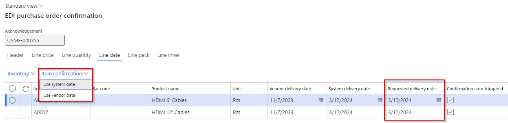

---
# required metadata

title: EDI
description: Release notes
author: Monica du Toit
manager: Pontus Ek
ms.date: 2025-08-22
ms.topic: article
ms.prod: 
ms.service: dynamics-ax-applications
ms.technology: 

# optional metadata

# ms.search.form: 
audience: Application User
# ms.devlang: 
ms.reviewer: Monica du Toit

# ms.tgt_pltfrm: 
# ms.custom: ["21901", "intro-internal"]
ms.search.region: IconEDI
# ms.search.industry: [leave blank for most, retail, public sector]
ms.author: Monica du Toit
ms.search.validFrom:  2016-05-31
ms.dyn365.ops.version: AX 7.0.1
---

# 	Release notes
This document describes the features that are either new or changed in the release version mentioned.
[Installation process](https://dxcanzproduct.github.io/DXC-Products-for-Microsoft-Business-Applications/EDI/Release-notes.html#installation-process) 

# Version compatibility
The matrix shows the minimum DXC build versions compatible per Microsoft versions and builds.  
If blank: investigations are ongoing.  

D365 Version	  | Any issues found in testing?	  | Product version tested
:--       	  |:--           			  |:--
Product version: 10.0.43   App build: 10.0.2177.18	  | No	          | 10.0.40.2024120421
Product version: 10.0.44   App build: 10.0.2263.11	  | No	          | 10.0.42.202504031
Product version: 10.0.45   App build: 10.0.2345.13	  | No	          | 10.0.43.2025051921

Release notes for other models included in product:
- [DXC Connections](../CONNECTIONS/Release-notes.md)
- [DXC License Manager](../LMG/Release-notes.md#dxc-license-manager)
- [DXC License](../LMG/Release-notes.md#dxc-license)

### Microsoft deprecation notice

[Microsoft notice](https://learn.microsoft.com/en-us/dynamics365/fin-ops-core/fin-ops/get-started/removed-deprecated-features-platform-updates#feature-deprecation-effective-october-2024)
- **Likely to affect**: Companies that uses **Database** credential type for their **Azure blob** connections. **Key Vault** credential type is not affected. These connections can be found at 'EDI > Setup > Connection setup > Azure sites'  
- **Status**: Rollout for the change by Microsoft begins in **October 2024** in a phased manner. Changes will be backported to **10.0.41 (PU65)** and all later releases.   
- **What do you need to do if affected**: 
	- Step 1 - Create Connection string in Azure portal
	- Step 2 - In **Key vault parameters** create a Secret using the value created in step 1.
	- Step 3 - Change all applicable **Azure blob** connections:   
		• Credential type: Key Vault  
		• Key vault: Secret setup in step 2

# Next version

### Release 10.0.43.202508TBD

<ins>New features</ins>

**Standard formats module**	

Number	| Name		 | Description
:--	|:--		 |:--
22897	| X12		| Resolve Pull request (PR) comments for 22720 and 22897
21307	| X12		| Modified data entities to support X12 data entity imports. [User guide](CORE/Other/Data-entities.md#document-types)
22049	| X12		| New tab called **Preview** on **Inbound files** and **Outbound files** provides a user-friendly preview for X12 formats   

**Customer module**	

Number	| Name		 | Description
:--	|:--		  	|:--
21322   23030 | Project sales invoice	| New outbound customer document called **Project sales invoice**. Triggered by posting a Project's Invoice proposal for Sales orders where the customer is setup to receive this document.   • [Setting profile](CUSTOMER/SETUP/SETTING-PROFILES/Project-sales-invoice.md)   • [Processing](CUSTOMER/DOCUMENTS/Project-sales-invoice.md)

<ins>Bug fixes</ins>

**Customer module**	

Number	| Name		 | Description
:--	|:--		  	|:--
22622	| Customer purchase order acknowledgement	| Where 'POA pending hold code' was not setup in 'EDI parameters' and POA document settings 'POA required with order hold' was set to No, the sales order was incorrectly created with 'POA status' = Pending.   'POA status' will now be created as blank for this scenario.
23249	| Customer purchase order	| Where using 'Enable store code identification' on the customer trading partner (i.e. instead of Customer GLN) and the store code couldn't be found, the file will now rather error on inbound-to-staging step. This allows users to create the store code against the applicable trading partner and reprocess the inbound file and create the staging record against the correct trading partner.

**Vendor module**	

Number	| Name		 | Description
:--	|:--		  	|:--	
22894	| Vendor purchase order change	| Modified price comparison calculations for determining 'Line change type'. Large price units were causing issues in the comparison.

**3PL module**	

Number	| Name		 | Description
:--		|:--		 |:--
22950	| Transfer order - Picking list	| Issue in SAB_EDIOutboundStagingWriter_Picklist - there is no implementation for type transfer order only for sales order. Similar to SAB_EDISalesOrderHistoryOutboundProcessorInterface created interface for transfer order and any other related components. Implemented this class in SAB_EDIOutboundStagingWriter_Picklist.

# Current version

### Release 10.0.43.20250519

DXC EDI 10.0.43 runs on the following Microsoft releases

Base	  | Version	  | Release
:--       |:--            |:--
Microsoft Dynamics 365 application	| 10.0.43 	  | [What’s new or changed in Dynamics 365 application version 10.0.43](https://docs.microsoft.com/en-us/dynamics365/finance/get-started/whats-new-changed-10-0-43)
Microsoft Dynamics 365 application	| 10.0.44 	  | [What’s new or changed in Dynamics 365 application version 10.0.44](https://docs.microsoft.com/en-us/dynamics365/finance/get-started/whats-new-changed-10-0-44)
Microsoft Dynamics 365 application	| 10.0.45 	  | [What’s new or changed in Dynamics 365 application version 10.0.45](https://docs.microsoft.com/en-us/dynamics365/finance/get-started/whats-new-changed-10-0-45)

#### Build 10.0.43.2025051921
Release date: 10 June 2025

<ins>Bug fixes</ins>

**3PL module**	

Number	| Name		 | Description
:--	|:--		 |:--
23022	| Picking list	 | Reverting 10527.  Batch processing not creating Picking list EDI staging records.

#### Build 10.0.43.202505191
Release date: 19 May 2025

<ins>New features</ins>

**Standard formats module**	

Number	| Name		 | Description
:--	|:--		 |:--
22871	| X12 template	| New outbound template mapping field **Skip segment if blank** now also includes support for **zero values**. Where set to Yes and the staging value is **blank or zero**, the segment will be skipped when creating the outbound X12 file. 

<ins>Bug fixes</ins>

**Standard formats module**	

Number	| Name		 | Description
:--	|:--		 |:--
22720	| X12 template	 | New outbound template mapping field **Skip segment if blank** didn't work on Lines level.

# Previous version(s)

Approximately two years of previous versions are included below.

### Release 10.0.43.20250509

#### Build 10.0.43.202505091
Release date: 9 May 2025

<ins>New features</ins>

**Core module**	- Applies to all modules	

Number	| Name		 | Description
:--	|:--		 |:--
19356	| DXC connections - SFTP	| DXC Connections 10.0.42.202504042. SFTP library moved to DXC Connections model. [Release notes](../CONNECTIONS/Release-notes.md)

**Standard formats module**	

Number	| Name		 | Description
:--	|:--		 |:--
21993	| X12 template	| New outbound template mapping field **Skip segment if blank**. Where set to Yes and the staging value is blank, the segment will be skipped when creating the outbound X12 file.   In below example the SAC segment will not be sent where the sales invoice has no charges.   

**Customer module**	

Number	| Name		 | Description
:--	|:--		  	|:--
21982	| • Customer purchase order   • Customer purchase order acknowledgement (POA)   • Customer advanced shipping notice (ASN)   • Sales invoice	| **SKU** line field size increased
21997	| • Customer purchase order acknowledgement (POA)   • Customer advanced shipping notice (ASN)   • Sales invoice	| **Product name** and **Text** line fields standardised across customer documents.
22052	| • Customer purchase order   • Customer purchase order acknowledgement (POA)   • Customer advanced shipping notice (ASN)   • Sales invoice	| New **LineNumText** field added to in and outbound customer documents. This supports the requirement where the customer purchase order's line number field is not numeric (for example 001) and these needs to be used in the same format on the outbound documents.
22067	| • Customer purchase order   • Customer purchase order acknowledgement (POA)   • Customer advanced shipping notice (ASN)   • Sales invoice	| Ten **Reserved** header string fields to assist rapid start implementations. These fields can be used where Customer purchase order values, not covered by existing EDI fields, needs to populate header fields on the outbound customer documents.   Companies can update the field label of these fields via Document types Staging metadata.   

**Vendor module**	

Number	| Name		 | Description
:--	|:--		  	|:--	
16024	| Purchase invoice	| Performance improvement on posting EDI Purchase invoice - Batch administration enabled.

<ins>Bug fixes</ins>

**Customer module**	

Number	| Name		 | Description
:--	|:--		  	|:--	
21845	| Customer purchase order	| Skip error lines - Fix to incorrect error when staging line needs to be skipped where 'Skip error lines' applies to the Trading partner. Error 'Cannot edit a record in EDI sales order line (SAB_EDISalesOrderLineStaging).The record has never been selected.'
21893	| Customer purchase order acknowledgement	| Summarised 'POA code line' value was reliant on mapped values in POA code response groups. "Duplicate" mappings caused an issue with the value in 'POA code line'.
21988	| Sales order processing workspace	| Where the Customer purchase acknowledgement was created via 'Send to EDI' on the Sales order processing workspace, the POA response codes where not populated.

**Standard formats module**	

Number	| Name		 | Description
:--	|:--		 |:--
22064	| X12 template	 | Few scenarios where hanging when processing X12 inbound file to processing. Issue on PO1 line level.

### Release 10.0.42.20250403

#### Build 10.0.42.202504031
Release date: 3 April 2025

<ins>New features</ins>

**Customer module**	

Number	| Name		 | Description
:--	|:--		  	|:--	
21615	| • Customer purchase order acknowledgement (POA) | New **POA code** options on **POA response group**:   • Line - out of stock   • Line - partial stock   • Line - price advice   • Date - backorder   • Date - confirmed          <ins>Updated logic</ins>:   POA staging line field **POA code line**:   • **Line - out of stock**: 100% out of stock / full backorder   • **Line - partial stock**: <100% out of stock / partial backorder    • **Line - price advice**: full shipment with only price change    • **Line - advice**: full shipment with multiple changes    • **Line - accept**: full shipment with no changes    • **Line - reject**: line rejected     New POA line staging field **POA code date**:    • **Date - backorder**: When 'Line - out of stock' applies (only full backorder)    • **Date - confirmed**: When 'Line - out of stock' doesn't applies (partial backorder and full shipment)   
21729	| • Customer purchase order acknowledgement (POA)   • Customer advanced shipping notice (ASN)   • Sales invoice | Added line field **SKU** from EDI Customer purchase order lines to all outbound documents. Also added to Sales order Line details, EDI tab.
21714	| • Customer advanced shipping notice (ASN)   • Sales invoice | Added field **Order line number** to staging lines. Source is EDI Customer purchase order line's 'Line number', and for non-EDI sales orders it will populate with same value as ASN and Invoice's 'Line number document'.
21849	| • Customer advanced shipping notice (ASN)   • Sales invoice | Added header field **Buyer code** from EDI Customer purchase order header.
21887	| • Customer Trading partner   • Customer purchase order	| Added new field **Buyer code** to Customer trading partner. Where **Buyer code** is blank in Customer purchase order header staging record, it will use the Buyer code from the Trading partner on the Sales order header, EDI section. And subsequently on all outbound customer documents.

**Standard formats module**	

Number	| Name		 | Description
:--	|:--		 |:--
21811	| X12 template	 | Inbound documents: Added **Static value dynamic position**. In below example the values for VC, CG and IN can be found in any order in the file.        Outbound documents: Added **Static value do not send if blank**. In below example if staging value for SKU is blank it won't send IN elements.   

<ins>Bug fixes</ins>

**Customer module**	

Number	| Name		 | Description
:--	|:--		  	|:--	
21725	| • Customer advanced shipping notice (ASN)   • Sales invoice | Use **Company GLN** from Customer purchase order staging record. For non EDI sales orders or consolidated packing slips, use the **Company GLN** from the Trading partner setup.

### Release 10.0.40.20250221

#### Build 10.0.40.202502211
Release date: 21 February 2025

<ins>New features</ins>

**Core module**	- Applies to all modules	

Number	| Name		 | Description
:--	|:--		 |:--
21113	| Outbound files - Cancel	| Ability to use **Cancel** to change selected Outbound file's Status to **Canceled**.   The following statuses are excluded from cancel:   • Processed   • Processing   • Archived     

**Customer module**	

Number	| Name		 | Description
:--	|:--		  	|:--	
21449	| Sales invoice		| Two extra header fields added:   • Line discount   • Total discount

<ins>Bug fixes</ins>

**Standard formats module**	

Number	| Name		 | Description
:--	|:--		 |:--
18798	| X12 templates - Copy	| Copy functionality didn't copy all mappings for X12 templates

**Customer module**	

Number	| Name		 | Description
:--	|:--		  	|:--	
21332	| Customer advanced shipping notice	| Auto assign consignment note number - Not populated where the lines were from different locations.

**Vendor module**	

Number	| Name		 | Description
:--	|:--		  	|:--	
20857	| Vendor purchase order change | Additional fix to 19584, which didn't cover small rounding scenarios. 

### Release 10.0.40.20241204

#### Build 10.0.40.2024120421
Release date: 6 December 2024

<ins>Bug fixes</ins>

**Freight forwarder landed cost module**

Number	| Name		 | Description
:--	|:--		  	|:--
20623	| Voyage creator  | Voyage creator failed when running in batch mode and set to auto create backorder voyage advice.   Error: "Stack trace: Cannot run form on non interactive session. EDI % Voyage creator Purchase order % line number % cannot be split because of following errors. You may need add the entire quantity of the order line to the voyage."   Issue only applicable to 10.0.40.202412041

#### Build 10.0.40.202412041
Release date: 4 December 2024

<ins>New features</ins>

**Core module**	- Applies to all modules	

Number	| Name		 | Description
:--	|:--		 |:--
19356	| Azure connection - SAS	| Support Azure blob site using SAS account level key vault.
17514	| DXC License manager	| New DXC License manager 10.0.40.202412041. See [Release notes](../LMG/Release-notes.md#d365-finance-and-operations) for more detail.
20389	| DXC Connections	| New DXC Connections 10.0.40.202412041. Affects Azure connections.   See [Release notes](../CONNECTIONS/Release-notes.md) for more detail.

**Customer module**	

Number	| Name		 | Description
:--	|:--		  	|:--	
18847	| EDI Sales order processing workspaces	- Skip error lines	| New tile and list **Skip error lines** added for Customer purchase order records that completed succesfully but contains skipped lines where the 'Skip error lines' document setting is used.    
18821	| Customer purchase order - Skip error lines	| 'The final sell date for item % has passed' now included in supported skip error lines scenarios. If skip error lines is set to No on the document setting, the staging record will error if the sell date has passed.
19950	| Customer purchase order - Default product variant	| Where the product variant isn't provided by Staging, GTIN, Barcode or External item number, the default product variant will default to the sales order line.
19964	| Unified pricing management	| Ability to process Customer purchase order record with Unified pricing management enabled.
20158	| Customer purchase order acknowledgement	| More options for POA required:   • **POA required with order hold** - Sales order **POA status** set to _Pending_ and Sales order **put on hold** (no change to processing, only relabeled to 'Lock order')   • **POA required without order hold** - Sales order **POA status** set to _Pending_ (new option)     The new option sets the POA status to Pending, thus the sales order is considered in the periodic task 'Send customer purchase order acknowledgement' without putting the sales order on hold.    

**Freight forwarder landed cost module**

Number	| Name		 | Description
:--	|:--		  	|:--
19178	| Voyage advice	| Ability to automatically trigger a new **Voyage advice** record for remaining purchase order lines after processing inbound **Voyage creator** when:   • Trading partner's **Auto send backorder voyage advice** set to _Yes_   • Trading partner has **Voyage advice** document enabled   • Vendor's **No landed cost backorder** set to _No_   • Purchase order line's **Deliver remainder** > 0   • Purchase order line's **Voyage** is blank
19455	| Workspace	| New workspace **EDI Landed cost processing**. Ability to view purchase orders that that should still be sent as **Voyage advice**.   For example the Purchase order has been created, but not yet confirmed (which includes an auto Voyage advice).   [User guide](FREIGHT-FORWARDER/WORKSPACES/EDI-Landed-cost-processing.md)      

<ins>Bug fixes</ins>

**Core module**	- Applies to all modules	

Number	| Name		 | Description
:--	|:--		 |:--
18960	| Data entity 'EDI Azure container setup' | Missing field 'Folder name'

**Customer module**	

Number	| Name		 | Description
:--	|:--		  	|:--	
18814	| Customer purchase order - Skip error lines	| Also now includes stopped for sales orders for a specific site not on Rank 0.
19389	| Trading partner	| Fix to label 'Enable store code identification'.
19316	| Sales order - EDI history	| Not all staging records displayed on EDI history - where same sales id used in multiple legal entities. This fix only works for new records.
19766	| Customer purchase order - Version log	| Added 'Product is on hold' to Version log.

**Vendor module**	

Number	| Name		 | Description
:--	|:--		  	|:--	
19159	| Vendor purchase order acknowledgement - Unit conversion	| When vendor has UOM mapping assigned that has the D365 unit mapped to a different D365 unit. Error when processing document: "Unit conversion from % to % does not exist". Changed: Where the units are the same, it will now skip the logic to find unit conversion.
19584	| Vendor purchase order change	| Only applicable to where the line's price unit was not 1. Incorrect 'Line change type' of 'Price change' where the price hasn't been changed.
20117	| Vendor purchase order change	| Fix to cancelled purchase order line's 'Line change type' which were incorrectly 'Quantity decrease' instead of 'Delete items'.

### Release 10.0.40.20240905

#### Build  10.0.40.202409051
Release date: 5 September 2024  

<ins>Manual actions required</ins>

With additional new Azure connection option **Azure file share**, we've added a new field called **Azure connection type** to Azure sites.   If using Azure connections, and your existing Azure sites have **Azure connection type** set to blank, please select _Azure blob_
   

<ins>New features</ins>

**Core module**	- Applies to all modules

Number	| Name		 | Description
:--	|:--		  	|:--
18222	| Connection type - Azure file share | New option to use **Azure file share** in Connection type **Azure sites**.    
18224	| DXC connections	| Azure dll moved to new model called DXCConnections.   DXC Connections release 10.0.40.202409192 - [Release notes](../CONNECTIONS/Release-notes.md)

**Customer module**	

Number	| Name		 | Description
:--	|:--		  	|:--	
18346	| Customer purchase order	| Find Customer and Address by Store code functionality.   New Customer Trading partner field **Enable store code identification** provides the ability to use the Customer purchase order header **Store code** field to find the applicable Trading partner to create the sales order against.   This is useful where the orders are sent for various GLN/Store codes, but these various GLN/store codes are created as one D365 customer account.

**3PL module**

Number	| Name		 | Description
:--	|:--		  	|:--	
18152	| Picking list		| Two new document line fields:   • SalesUnit   • SalesQty

<ins>Bug fixes</ins>

**Standard formats module**	

Number	| Name		 | Description
:--	|:--		 |:--
18340	| X12		 | X12's Document type Template ISA mapping not displayed in Example section

**Customer module**	

Number	| Name		 | Description
:--	|:--		  	|:--	
18432	| Sales order packing slip	| Couldn't post a packing slip for a picking list when:   • Consignment note populated on picking list registration and   • Customer doesn't have Customer Advanced shipping notice   Incorrectly errored with "No document setting specified."
18616	| Skip error lines	| Where the Customer purchase order acknowledgement line wasn't created on the sales order via 'Skip error lines' functionality, POA staging line fields 'Bar code' now obtained from the original Customer purchase order's 'Bar code' field.

**3PL module**

Number	| Name		 | Description
:--	|:--		  	|:--	
18315	| Product master	| Base physical dimensions on the Product master unit
18596	| Transfer order picking list registration	| Error when processing Transfer order Picking list registration Inbound file to Staging: Function SAB_EDIStagingHistory::logHistory has been incorrectly called

### Release 10.0.37.20240530

#### Build  10.0.37.202405302
Release date: 31 May 2024  

<ins>New features</ins>

**Core module**	- Applies to all modules

Number	| Name		 | Description
:--	|:--		  	|:--
17218	| Connection types - Azure	| Replace deprecated [Microsoft.WindowsAzure.Storage](https://learn.microsoft.com/en-us/dotnet/api/overview/azure/storage/windowsazurestorage%28deprecated%29?view=azure-dotnet-legacy) with [Azure.Storage.Blobs](https://learn.microsoft.com/en-us/azure/storage/blobs/storage-blob-dotnet-get-started?tabs=azure-ad).    DXC_AzureClient 2024.05.30.1
N/A	| DXC License	| New DXC License model 10.0.37.202405231. See [Release notes](../LMG/Release-notes.md) for more details.

**Standard formats module**	

Number	| Name		 | Description
:--	|:--		 |:--
9488	| X12		 | Support for **X12** format in Template type. See [user guide](CORE/Setup/DocumentTypes/File-templates.md#x12-files)

**Customer module**	

Number	| Name		 | Description
:--	|:--		  	|:--	
17851	| Customer purchase order acknowledgement | New field **Total charges**
17850	| Sales invoice		| New field **Total charges**

**3PL module**

Number	| Name		 | Description
:--	|:--		  	|:--	
17864	| Product master	| New fields:   • Inventory unit   • Unit conversion

<ins>Bug fixes</ins>

**Core module**	- Applies to all modules

Number	| Name		 | Description
:--	|:--		  	|:--
17895	| Filter		| Incorrect filtering when accessing 'Customer purchase order' and 'Inbound files' with custom views via Document maintenance workspace
17520	| Outbound files	| 'Original folder' not populated for File transfer type SFTP

**Vendor module**	

Number	| Name		 | Description
:--	|:--		  	|:--	
17978	| Pending invoice	| 10.0.40 build error caused by missing reference for the ProcessAutomation Model which is now used by the VendInvoiceInfoTable.   Used to determine whether the Pending invoices button is enabled/disabled in the Vendor Purchase Invoice form.

**3PL module**

Number	| Name		 | Description
:--	|:--		  	|:--	
17864	| Product master	| Fix to Barcode and GTIN after adding UOM mapping in 10.0.37.202405023

### Release 10.0.37.20240502

#### Build  10.0.37.202405023
Release date: 2 May 2024  

<ins>New features</ins>

**Core module**	- Applies to all modules

Number	| Name		 | Description
:--	|:--		  	|:--
17434	| SFTP connection	| Upgrade SFTP SSH.NET to latest [2024.0.0](https://github.com/sshnet/SSH.NET/releases/tag/2024.0.0) release
16962   | Connections | Increase EDT for usernames, passwords (sftp, ftp) and storage account name, storage account key (Azure blob)
17724	| Licensing		| Improvements to licensing - see [Licensing release notes](../LMG/Release-notes.md#release-10037202404262) for detailed information.

**Customer module**	

Number	| Name		 | Description
:--	|:--		  	|:--	
17001	| - Customer purchase order   - Customer purchase order change | New document setting **Price variance type** with options **Amount** and **Percentage**.   Previously the **Maximum negative price variance** and **Maximum positive price variance** values were only in Amount.   Price variance type now allows **Percentage** option as well with this new document setting.   [User guide](CUSTOMER/SETUP/SETTING-PROFILES/Customer-purchase-order.md)    

**Vendor module**	

Number	| Name		 | Description
:--	|:--		  	|:--	
17004	| Vendor purchase order acknowledgement | New document setting **Price variance type** with options **Amount** and **Percentage**.   Previously the **Maximum negative price variance** and **Maximum positive price variance** values were only in Amount.   Price variance type now allows **Percentage** option as well with this new document setting.   [User guide](VENDOR/SETUP/SETTING-PROFILES/Vendor-purchase-order-acknowledgement.md)    

**3PL module**

Number	| Name		 | Description
:--	|:--		  	|:--	
17506	| Inventory adjustment - Transfer	| Ability to transfer between **locations** for the 3PL warehouse.   Additional fields:   • From location   • To location
17510	| UOM mapping		| Similar to Customer and Vendor module, **UOM mapping** functionality added to 3PL Trading partner.   Unit also added to all inbound and outbound 3PL documents   • **Outbound files**: Where applicable, the mapped value will be sent. Where no mapped value for the unit, the unit will be sent as-is.   • **Inbound files**: Ability to receive and process mapped unit values on incoming documents. Where no unit is received, it will work as per prior this extra functionality. 
17509	| Product master - Unit	| Ability to send records for non inventory **Unit** on outbound **Product master**.   Periodic task **Product configuration update** creates records for inventory units, other units for the product can now be manually added to **EDI 3PL product setup**.   New fields on **EDI 3PL product setup**:   • Unit - where blank, the inventory unit will be sent on **Product master**   • Unit conversion (display method)   • Inventory unit (display method)   [User guide](3PL/DOCUMENTS/Product-master.md)

**Freight forwarder landed cost module**

Number	| Name		 | Description
:--	|:--		  	|:--	
16146	| Voyage advice		| Ability to create **Voyage advice** with Purchase order **Confirmation** or **Confirm**.   [User guide](FREIGHT-FORWARDER/DOCUMENTS/Voyage-advice.md)   

<ins>Bug fixes</ins>

**Core module**	- Applies to all modules

Number	| Name		 | Description
:--	|:--		  	|:--
17417	| SFTP connection	| Update **Private key** to Password style
17599	| Filter		| Error when filtering on a custom view in 'Customer purchase order' and 'Inbound files': "Getting the parent node failed"

**Customer module**	

Number	| Name		 | Description
:--	|:--		  	|:--	
17260	| Sales order - Log | EDI tab 'Log' button on Sales order's ActionPane not showing message

**Vendor module**	

Number	| Name		 | Description
:--	|:--		  	|:--	
10755	| Vendor purchase order change | Fix to **Acknowledgement required**. If set to _Yes_, Purchase order's:   • **Approval status** set to _In external review_   • **Acknowledgement status** set to _Acknowledgement pending_
16510	| Vendor purchase order change | Previously Vendor purchase order change line field **Requested receipt date** was set to POA's _Confirmed delivery date_.   Thus if PO line's **Requested receipt date** was manually overridden on the PO line after receiving the POA, this change didn't reflect in the Vendor purchase order change record.   Changes:   • New header and line field **Confirmed receipt date** - Source is Purchase order's Confirmed receipt date   • Existing header and line field **Requested receipt date** - Updated source is Purchase order's Requested receipt date     • Processing Confirmation:   • Requested receipt date - Default is system delivery date.   • **Use vendor date** sets the Requested receipt date to Vendor's acknowledged delivery date from the POA     
16785	| Vendor purchase order change | Incorrect order line change type **Delete items** assigned where line's Deliver remainder is zero because of full receipt.
17307	| Vendor purchase order change | • When cancelled purchase order change is sent to vendor, and the vendor accepts the cancel in the returned POA: it shouldn't send another Vendor purchase order change with purpose Confirmation back to vendor   • When cancelling the complete purchase order and the 'Acknowledgement required' = Yes on Vendor purchase order change, the Purchase order's Approval status should be 'In external review', not 'Approved'.   • Cancel's 'Send to EDI' will now also default to No, since std prompts user to confirm the order again, which will result in the cancellation sent twice to the vendor.

**3PL module**

Number	| Name		 | Description
:--	|:--		  	|:--	
16295	| Shipment advice - Voyage | Applicable to Voyages created for **Transfer orders**. **From warehouse** was used to determine if **Send to EDI** was enabled and applicable Trading partner settings. **To warehouse** for the Transfer order is now used.

### Archive
Older releases notes can be accessed [here](Release-notes-Archive.md)

	
# Installation process
To align with MS best practice and to protect our IP the following applies to the release process.
- The license models DXCLicense and Sable37License will only be released as binaries as part of a deployable package. 
- We will not provide test models for the products, neither as binary or source code. 
- We will only publish the release as a deployable package. 
- Model source code can be provided at our discretion. It can be requested for debugging upgrade errors, or if required for extensions.
	- If you have been given the source code to our model for extension or debugging purpose, never make modifications directly to our models! 
	- If you need an extension point, please send an email to ECLANZProductSupport@dxc.com and request it to be implemented. 

Depending on the installation history follow one of these guides to install the new release. 
## Installation without existing installed product
1. Apply the deployable package to your environment. 
2. If you have requested any model for extension or debugging purposes. Install the model source code. 
a.	Note, once the model source code is compiled it will overwrite the binaries installed when the deployable package was applied. 

## Installation with existing installed product
If you’re installing the new release in an installation that already has a previous version of the product installed and you’re not using it for debugging or extension. We recommend that you;  
1. Remove the release product model source code from your source control, if source control is used. 
2. Apply the deployable package, installing the latest version of the product models as binaries.  
3. Check in the binaries for the models to source control, if source control is used. 

If you’re using our model source code for extension or debugging and would like to continue using it, please do the following to apply the new release with the source code. 

1. Remove product license model from your source control that is applicable to the release. You’ll find the license model in the deployable package. It will either be called DXCLicense and Sable37License. 
2. Apply the deployable package to your environment to install the latest binaries. Check in the binaries for the license model that was removed in step 1 to source control. Note, this step will also install the binaries for all the models in the new release. 
3. Install the product release model source code and check into source control. 

If you don’t follow these instructions and continue building your installation deployable package using the license model source code, the installation will continue using the same license model as before applying the release. 

## Feature management
Enable all licensed modules via Feature management. Features are called:
- EDI (enable first)
- EDI – 3PL Documents
- EDI – Customer documents
- EDI – Vendor documents
- EDI – Freight forwarder landed cost documents
- EDI – Standard formats

If above features are not visible, press **Check for updates** to refresh the feature management list.

## Refresh EDI module
**EDI > Setup > EDI parameters**  
After each deployment, click **Refresh module**.  
This will flush EDI caches and refresh EDI module metadata such as EDI document types, XML structures, field names etc.

