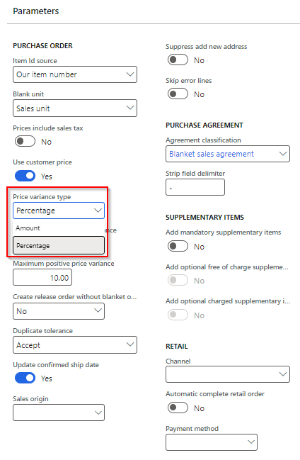
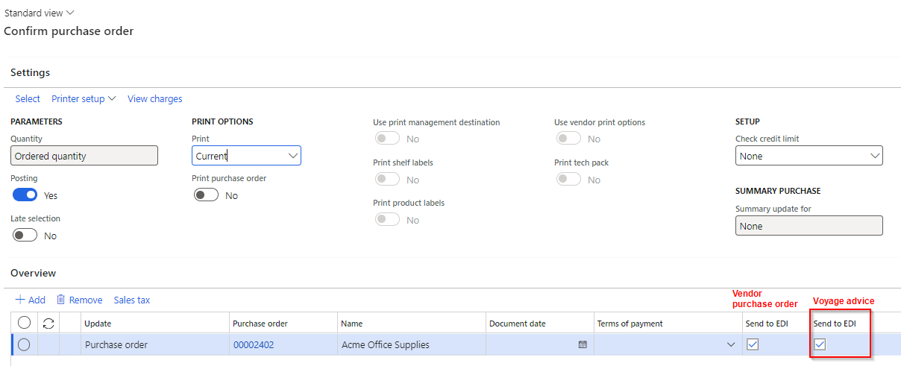
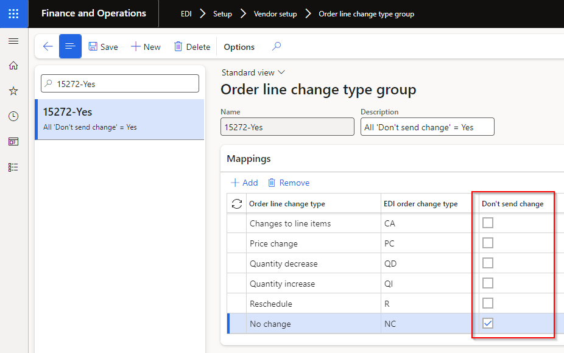
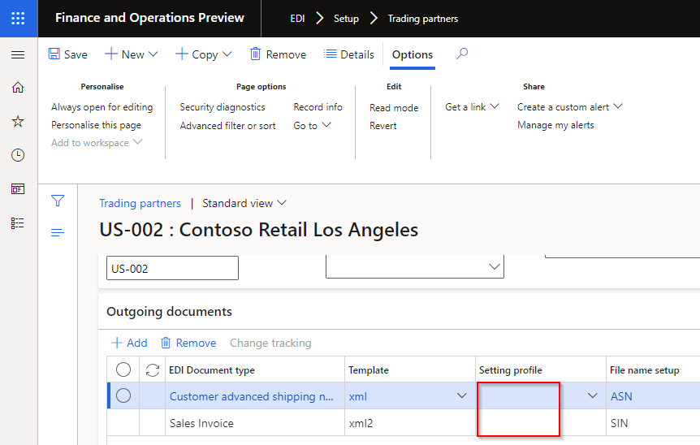

---
# required metadata

title: EDI
description: Release notes
author: Monica du Toit
manager: Pontus Ek
ms.date: 2025-08-14
ms.topic: article
ms.prod: 
ms.service: dynamics-ax-applications
ms.technology: 

# optional metadata

# ms.search.form: 
audience: Application User
# ms.devlang: 
ms.reviewer: Monica du Toit

# ms.tgt_pltfrm: 
# ms.custom: ["21901", "intro-internal"]
ms.search.region: IconEDI
# ms.search.industry: [leave blank for most, retail, public sector]
ms.author: Monica du Toit
ms.search.validFrom:  2016-05-31
ms.dyn365.ops.version: AX 7.0.1
---

# 	Release notes
This document describes the features that are either new or changed in the release version mentioned.
[Installation process](https://dxcanzproduct.github.io/DXC-Products-for-Microsoft-Business-Applications/EDI/Release-notes.html#installation-process) 

# Version compatibility
The matrix shows the minimum DXC build versions compatible per Microsoft versions and builds.  
If blank: investigations are ongoing.  

D365 Version	  | Any issues found in testing?	  | Product version tested
:--       	  |:--           			  |:--
Product version: 10.0.42   App build: 10.0.2095.13	  | No	          | 10.0.40.202409051
Product version: 10.0.43   App build: 10.0.2177.18	  | No	          | 10.0.40.2024120421
Product version: 10.0.44   App build: 10.0.2263.11	  | No	          | 10.0.42.202504031

Release notes for other models included in product:
- [DXC Connections](../CONNECTIONS/Release-notes.md)
- [DXC License Manager](../LMG/Release-notes.md#dxc-license-manager)
- [DXC License](../LMG/Release-notes.md#dxc-license)

### Microsoft deprecation notice

[Microsoft notice](https://learn.microsoft.com/en-us/dynamics365/fin-ops-core/fin-ops/get-started/removed-deprecated-features-platform-updates#feature-deprecation-effective-october-2024)
- **Likely to affect**: Companies that uses **Database** credential type for their **Azure blob** connections. **Key Vault** credential type is not affected. These connections can be found at 'EDI > Setup > Connection setup > Azure sites'  
- **Status**: Rollout for the change by Microsoft begins in **October 2024** in a phased manner. Changes will be backported to **10.0.41 (PU65)** and all later releases.   
- **What do you need to do if affected**: 
	- Step 1 - Create Connection string in Azure portal
	- Step 2 - In **Key vault parameters** create a Secret using the value created in step 1.
	- Step 3 - Change all applicable **Azure blob** connections:   
		• Credential type: Key Vault  
		• Key vault: Secret setup in step 2

# Next version

### Release 10.0.43.202508TBD

<ins>New features</ins>

**Standard formats module**	

Number	| Name		 | Description
:--	|:--		 |:--
22897	| X12		| Resolve Pull request (PR) comments for 22720 and 22897
21307	| X12		| Modified data entities to support X12 data entity imports. [User guide](CORE/Other/Data-entities.md#document-types)
22049	| X12		| New tab called **Preview** on **Inbound files** and **Outbound files** provides a user-friendly preview for X12 formats   

**Customer module**	

Number	| Name		 | Description
:--	|:--		  	|:--
21322   23030 | Project sales invoice	| New outbound customer document called **Project sales invoice**. Triggered by posting a Project's Invoice proposal for Sales orders where the customer is setup to receive this document.   • [Setting profile](CUSTOMER/SETUP/SETTING-PROFILES/Project-sales-invoice.md)   • [Processing](CUSTOMER/DOCUMENTS/Project-sales-invoice.md)

<ins>Bug fixes</ins>

**Customer module**	

Number	| Name		 | Description
:--	|:--		  	|:--
22622	| Customer purchase order acknowledgement	| Where 'POA pending hold code' not setup in 'EDI parameters' and POA document settings 'POA required with order hold' set to No, the sales order was incorrectly created with **POA status** = Pending

**Vendor module**	

Number	| Name		 | Description
:--	|:--		  	|:--	
22894	| Vendor purchase order change	| Modified price comparison calculations for determining 'Line change type'. Large price units were causing issues in the comparison.

# Current version

### Release 10.0.43.20250519

DXC EDI 10.0.43 runs on the following Microsoft releases

Base	  | Version	  | Release
:--       |:--            |:--
Microsoft Dynamics 365 application	| 10.0.43 	  | [What’s new or changed in Dynamics 365 application version 10.0.43](https://docs.microsoft.com/en-us/dynamics365/finance/get-started/whats-new-changed-10-0-43)
Microsoft Dynamics 365 application	| 10.0.44 	  | [What’s new or changed in Dynamics 365 application version 10.0.44](https://docs.microsoft.com/en-us/dynamics365/finance/get-started/whats-new-changed-10-0-44)

#### Build 10.0.43.2025051921
Release date: 10 June 2025

<ins>Bug fixes</ins>

**3PL module**	

Number	| Name		 | Description
:--	|:--		 |:--
23022	| Picking list	 | Reverting 10527.  Batch processing not creating Picking list EDI staging records.

#### Build 10.0.43.202505191
Release date: 19 May 2025

<ins>New features</ins>

**Standard formats module**	

Number	| Name		 | Description
:--	|:--		 |:--
22871	| X12 template	| New outbound template mapping field **Skip segment if blank** now also includes support for **zero values**. Where set to Yes and the staging value is **blank or zero**, the segment will be skipped when creating the outbound X12 file. 

<ins>Bug fixes</ins>

**Standard formats module**	

Number	| Name		 | Description
:--	|:--		 |:--
22720	| X12 template	 | New outbound template mapping field **Skip segment if blank** didn't work on Lines level.

# Previous version(s)

Approximately two years of previous versions are included below.

### Release 10.0.43.20250509

#### Build 10.0.43.202505091
Release date: 9 May 2025

<ins>New features</ins>

**Core module**	- Applies to all modules	

Number	| Name		 | Description
:--	|:--		 |:--
19356	| DXC connections - SFTP	| DXC Connections 10.0.42.202504042. SFTP library moved to DXC Connections model. [Release notes](../CONNECTIONS/Release-notes.md)

**Standard formats module**	

Number	| Name		 | Description
:--	|:--		 |:--
21993	| X12 template	| New outbound template mapping field **Skip segment if blank**. Where set to Yes and the staging value is blank, the segment will be skipped when creating the outbound X12 file.   In below example the SAC segment will not be sent where the sales invoice has no charges.   

**Customer module**	

Number	| Name		 | Description
:--	|:--		  	|:--
21982	| • Customer purchase order   • Customer purchase order acknowledgement (POA)   • Customer advanced shipping notice (ASN)   • Sales invoice	| **SKU** line field size increased
21997	| • Customer purchase order acknowledgement (POA)   • Customer advanced shipping notice (ASN)   • Sales invoice	| **Product name** and **Text** line fields standardised across customer documents.
22052	| • Customer purchase order   • Customer purchase order acknowledgement (POA)   • Customer advanced shipping notice (ASN)   • Sales invoice	| New **LineNumText** field added to in and outbound customer documents. This supports the requirement where the customer purchase order's line number field is not numeric (for example 001) and these needs to be used in the same format on the outbound documents.
22067	| • Customer purchase order   • Customer purchase order acknowledgement (POA)   • Customer advanced shipping notice (ASN)   • Sales invoice	| Ten **Reserved** header string fields to assist rapid start implementations. These fields can be used where Customer purchase order values, not covered by existing EDI fields, needs to populate header fields on the outbound customer documents.   Companies can update the field label of these fields via Document types Staging metadata.   

**Vendor module**	

Number	| Name		 | Description
:--	|:--		  	|:--	
16024	| Purchase invoice	| Performance improvement on posting EDI Purchase invoice - Batch administration enabled.

<ins>Bug fixes</ins>

**Customer module**	

Number	| Name		 | Description
:--	|:--		  	|:--	
21845	| Customer purchase order	| Skip error lines - Fix to incorrect error when staging line needs to be skipped where 'Skip error lines' applies to the Trading partner. Error 'Cannot edit a record in EDI sales order line (SAB_EDISalesOrderLineStaging).The record has never been selected.'
21893	| Customer purchase order acknowledgement	| Summarised 'POA code line' value was reliant on mapped values in POA code response groups. "Duplicate" mappings caused an issue with the value in 'POA code line'.
21988	| Sales order processing workspace	| Where the Customer purchase acknowledgement was created via 'Send to EDI' on the Sales order processing workspace, the POA response codes where not populated.

**Standard formats module**	

Number	| Name		 | Description
:--	|:--		 |:--
22064	| X12 template	 | Few scenarios where hanging when processing X12 inbound file to processing. Issue on PO1 line level.

### Release 10.0.42.20250403

#### Build 10.0.42.202504031
Release date: 3 April 2025

<ins>New features</ins>

**Customer module**	

Number	| Name		 | Description
:--	|:--		  	|:--	
21615	| • Customer purchase order acknowledgement (POA) | New **POA code** options on **POA response group**:   • Line - out of stock   • Line - partial stock   • Line - price advice   • Date - backorder   • Date - confirmed          <ins>Updated logic</ins>:   POA staging line field **POA code line**:   • **Line - out of stock**: 100% out of stock / full backorder   • **Line - partial stock**: <100% out of stock / partial backorder    • **Line - price advice**: full shipment with only price change    • **Line - advice**: full shipment with multiple changes    • **Line - accept**: full shipment with no changes    • **Line - reject**: line rejected     New POA line staging field **POA code date**:    • **Date - backorder**: When 'Line - out of stock' applies (only full backorder)    • **Date - confirmed**: When 'Line - out of stock' doesn't applies (partial backorder and full shipment)   
21729	| • Customer purchase order acknowledgement (POA)   • Customer advanced shipping notice (ASN)   • Sales invoice | Added line field **SKU** from EDI Customer purchase order lines to all outbound documents. Also added to Sales order Line details, EDI tab.
21714	| • Customer advanced shipping notice (ASN)   • Sales invoice | Added field **Order line number** to staging lines. Source is EDI Customer purchase order line's 'Line number', and for non-EDI sales orders it will populate with same value as ASN and Invoice's 'Line number document'.
21849	| • Customer advanced shipping notice (ASN)   • Sales invoice | Added header field **Buyer code** from EDI Customer purchase order header.
21887	| • Customer Trading partner   • Customer purchase order	| Added new field **Buyer code** to Customer trading partner. Where **Buyer code** is blank in Customer purchase order header staging record, it will use the Buyer code from the Trading partner on the Sales order header, EDI section. And subsequently on all outbound customer documents.

**Standard formats module**	

Number	| Name		 | Description
:--	|:--		 |:--
21811	| X12 template	 | Inbound documents: Added **Static value dynamic position**. In below example the values for VC, CG and IN can be found in any order in the file.        Outbound documents: Added **Static value do not send if blank**. In below example if staging value for SKU is blank it won't send IN elements.   

<ins>Bug fixes</ins>

**Customer module**	

Number	| Name		 | Description
:--	|:--		  	|:--	
21725	| • Customer advanced shipping notice (ASN)   • Sales invoice | Use **Company GLN** from Customer purchase order staging record. For non EDI sales orders or consolidated packing slips, use the **Company GLN** from the Trading partner setup.

### Release 10.0.40.20250221

#### Build 10.0.40.202502211
Release date: 21 February 2025

<ins>New features</ins>

**Core module**	- Applies to all modules	

Number	| Name		 | Description
:--	|:--		 |:--
21113	| Outbound files - Cancel	| Ability to use **Cancel** to change selected Outbound file's Status to **Canceled**.   The following statuses are excluded from cancel:   • Processed   • Processing   • Archived     

**Customer module**	

Number	| Name		 | Description
:--	|:--		  	|:--	
21449	| Sales invoice		| Two extra header fields added:   • Line discount   • Total discount

<ins>Bug fixes</ins>

**Standard formats module**	

Number	| Name		 | Description
:--	|:--		 |:--
18798	| X12 templates - Copy	| Copy functionality didn't copy all mappings for X12 templates

**Customer module**	

Number	| Name		 | Description
:--	|:--		  	|:--	
21332	| Customer advanced shipping notice	| Auto assign consignment note number - Not populated where the lines were from different locations.

**Vendor module**	

Number	| Name		 | Description
:--	|:--		  	|:--	
20857	| Vendor purchase order change | Additional fix to 19584, which didn't cover small rounding scenarios. 

### Release 10.0.40.20241204

#### Build 10.0.40.2024120421
Release date: 6 December 2024

<ins>Bug fixes</ins>

**Freight forwarder landed cost module**

Number	| Name		 | Description
:--	|:--		  	|:--
20623	| Voyage creator  | Voyage creator failed when running in batch mode and set to auto create backorder voyage advice.   Error: "Stack trace: Cannot run form on non interactive session. EDI % Voyage creator Purchase order % line number % cannot be split because of following errors. You may need add the entire quantity of the order line to the voyage."   Issue only applicable to 10.0.40.202412041

#### Build 10.0.40.202412041
Release date: 4 December 2024

<ins>New features</ins>

**Core module**	- Applies to all modules	

Number	| Name		 | Description
:--	|:--		 |:--
19356	| Azure connection - SAS	| Support Azure blob site using SAS account level key vault.
17514	| DXC License manager	| New DXC License manager 10.0.40.202412041. See [Release notes](../LMG/Release-notes.md#d365-finance-and-operations) for more detail.
20389	| DXC Connections	| New DXC Connections 10.0.40.202412041. Affects Azure connections.   See [Release notes](../CONNECTIONS/Release-notes.md) for more detail.

**Customer module**	

Number	| Name		 | Description
:--	|:--		  	|:--	
18847	| EDI Sales order processing workspaces	- Skip error lines	| New tile and list **Skip error lines** added for Customer purchase order records that completed succesfully but contains skipped lines where the 'Skip error lines' document setting is used.    
18821	| Customer purchase order - Skip error lines	| 'The final sell date for item % has passed' now included in supported skip error lines scenarios. If skip error lines is set to No on the document setting, the staging record will error if the sell date has passed.
19950	| Customer purchase order - Default product variant	| Where the product variant isn't provided by Staging, GTIN, Barcode or External item number, the default product variant will default to the sales order line.
19964	| Unified pricing management	| Ability to process Customer purchase order record with Unified pricing management enabled.
20158	| Customer purchase order acknowledgement	| More options for POA required:   • **POA required with order hold** - Sales order **POA status** set to _Pending_ and Sales order **put on hold** (no change to processing, only relabeled to 'Lock order')   • **POA required without order hold** - Sales order **POA status** set to _Pending_ (new option)     The new option sets the POA status to Pending, thus the sales order is considered in the periodic task 'Send customer purchase order acknowledgement' without putting the sales order on hold.    

**Freight forwarder landed cost module**

Number	| Name		 | Description
:--	|:--		  	|:--
19178	| Voyage advice	| Ability to automatically trigger a new **Voyage advice** record for remaining purchase order lines after processing inbound **Voyage creator** when:   • Trading partner's **Auto send backorder voyage advice** set to _Yes_   • Trading partner has **Voyage advice** document enabled   • Vendor's **No landed cost backorder** set to _No_   • Purchase order line's **Deliver remainder** > 0   • Purchase order line's **Voyage** is blank
19455	| Workspace	| New workspace **EDI Landed cost processing**. Ability to view purchase orders that that should still be sent as **Voyage advice**.   For example the Purchase order has been created, but not yet confirmed (which includes an auto Voyage advice).   [User guide](FREIGHT-FORWARDER/WORKSPACES/EDI-Landed-cost-processing.md)      

<ins>Bug fixes</ins>

**Core module**	- Applies to all modules	

Number	| Name		 | Description
:--	|:--		 |:--
18960	| Data entity 'EDI Azure container setup' | Missing field 'Folder name'

**Customer module**	

Number	| Name		 | Description
:--	|:--		  	|:--	
18814	| Customer purchase order - Skip error lines	| Also now includes stopped for sales orders for a specific site not on Rank 0.
19389	| Trading partner	| Fix to label 'Enable store code identification'.
19316	| Sales order - EDI history	| Not all staging records displayed on EDI history - where same sales id used in multiple legal entities. This fix only works for new records.
19766	| Customer purchase order - Version log	| Added 'Product is on hold' to Version log.

**Vendor module**	

Number	| Name		 | Description
:--	|:--		  	|:--	
19159	| Vendor purchase order acknowledgement - Unit conversion	| When vendor has UOM mapping assigned that has the D365 unit mapped to a different D365 unit. Error when processing document: "Unit conversion from % to % does not exist". Changed: Where the units are the same, it will now skip the logic to find unit conversion.
19584	| Vendor purchase order change	| Only applicable to where the line's price unit was not 1. Incorrect 'Line change type' of 'Price change' where the price hasn't been changed.
20117	| Vendor purchase order change	| Fix to cancelled purchase order line's 'Line change type' which were incorrectly 'Quantity decrease' instead of 'Delete items'.

### Release 10.0.40.20240905

#### Build  10.0.40.202409051
Release date: 5 September 2024  

<ins>Manual actions required</ins>

With additional new Azure connection option **Azure file share**, we've added a new field called **Azure connection type** to Azure sites.   If using Azure connections, and your existing Azure sites have **Azure connection type** set to blank, please select _Azure blob_
   

<ins>New features</ins>

**Core module**	- Applies to all modules

Number	| Name		 | Description
:--	|:--		  	|:--
18222	| Connection type - Azure file share | New option to use **Azure file share** in Connection type **Azure sites**.    
18224	| DXC connections	| Azure dll moved to new model called DXCConnections.   DXC Connections release 10.0.40.202409192 - [Release notes](../CONNECTIONS/Release-notes.md)

**Customer module**	

Number	| Name		 | Description
:--	|:--		  	|:--	
18346	| Customer purchase order	| Find Customer and Address by Store code functionality.   New Customer Trading partner field **Enable store code identification** provides the ability to use the Customer purchase order header **Store code** field to find the applicable Trading partner to create the sales order against.   This is useful where the orders are sent for various GLN/Store codes, but these various GLN/store codes are created as one D365 customer account.

**3PL module**

Number	| Name		 | Description
:--	|:--		  	|:--	
18152	| Picking list		| Two new document line fields:   • SalesUnit   • SalesQty

<ins>Bug fixes</ins>

**Standard formats module**	

Number	| Name		 | Description
:--	|:--		 |:--
18340	| X12		 | X12's Document type Template ISA mapping not displayed in Example section

**Customer module**	

Number	| Name		 | Description
:--	|:--		  	|:--	
18432	| Sales order packing slip	| Couldn't post a packing slip for a picking list when:   • Consignment note populated on picking list registration and   • Customer doesn't have Customer Advanced shipping notice   Incorrectly errored with "No document setting specified."
18616	| Skip error lines	| Where the Customer purchase order acknowledgement line wasn't created on the sales order via 'Skip error lines' functionality, POA staging line fields 'Bar code' now obtained from the original Customer purchase order's 'Bar code' field.

**3PL module**

Number	| Name		 | Description
:--	|:--		  	|:--	
18315	| Product master	| Base physical dimensions on the Product master unit
18596	| Transfer order picking list registration	| Error when processing Transfer order Picking list registration Inbound file to Staging: Function SAB_EDIStagingHistory::logHistory has been incorrectly called

### Release 10.0.37.20240530

#### Build  10.0.37.202405302
Release date: 31 May 2024  

<ins>New features</ins>

**Core module**	- Applies to all modules

Number	| Name		 | Description
:--	|:--		  	|:--
17218	| Connection types - Azure	| Replace deprecated [Microsoft.WindowsAzure.Storage](https://learn.microsoft.com/en-us/dotnet/api/overview/azure/storage/windowsazurestorage%28deprecated%29?view=azure-dotnet-legacy) with [Azure.Storage.Blobs](https://learn.microsoft.com/en-us/azure/storage/blobs/storage-blob-dotnet-get-started?tabs=azure-ad).    DXC_AzureClient 2024.05.30.1
N/A	| DXC License	| New DXC License model 10.0.37.202405231. See [Release notes](../LMG/Release-notes.md) for more details.

**Standard formats module**	

Number	| Name		 | Description
:--	|:--		 |:--
9488	| X12		 | Support for **X12** format in Template type. See [user guide](CORE/Setup/DocumentTypes/File-templates.md#x12-files)

**Customer module**	

Number	| Name		 | Description
:--	|:--		  	|:--	
17851	| Customer purchase order acknowledgement | New field **Total charges**
17850	| Sales invoice		| New field **Total charges**

**3PL module**

Number	| Name		 | Description
:--	|:--		  	|:--	
17864	| Product master	| New fields:   • Inventory unit   • Unit conversion

<ins>Bug fixes</ins>

**Core module**	- Applies to all modules

Number	| Name		 | Description
:--	|:--		  	|:--
17895	| Filter		| Incorrect filtering when accessing 'Customer purchase order' and 'Inbound files' with custom views via Document maintenance workspace
17520	| Outbound files	| 'Original folder' not populated for File transfer type SFTP

**Vendor module**	

Number	| Name		 | Description
:--	|:--		  	|:--	
17978	| Pending invoice	| 10.0.40 build error caused by missing reference for the ProcessAutomation Model which is now used by the VendInvoiceInfoTable.   Used to determine whether the Pending invoices button is enabled/disabled in the Vendor Purchase Invoice form.

**3PL module**

Number	| Name		 | Description
:--	|:--		  	|:--	
17864	| Product master	| Fix to Barcode and GTIN after adding UOM mapping in 10.0.37.202405023

### Release 10.0.37.20240502

#### Build  10.0.37.202405023
Release date: 2 May 2024  

<ins>New features</ins>

**Core module**	- Applies to all modules

Number	| Name		 | Description
:--	|:--		  	|:--
17434	| SFTP connection	| Upgrade SFTP SSH.NET to latest [2024.0.0](https://github.com/sshnet/SSH.NET/releases/tag/2024.0.0) release
16962   | Connections | Increase EDT for usernames, passwords (sftp, ftp) and storage account name, storage account key (Azure blob)
17724	| Licensing		| Improvements to licensing - see [Licensing release notes](../LMG/Release-notes.md#release-10037202404262) for detailed information.

**Customer module**	

Number	| Name		 | Description
:--	|:--		  	|:--	
17001	| - Customer purchase order   - Customer purchase order change | New document setting **Price variance type** with options **Amount** and **Percentage**.   Previously the **Maximum negative price variance** and **Maximum positive price variance** values were only in Amount.   Price variance type now allows **Percentage** option as well with this new document setting.   [User guide](CUSTOMER/SETUP/SETTING-PROFILES/Customer-purchase-order.md)    

**Vendor module**	

Number	| Name		 | Description
:--	|:--		  	|:--	
17004	| Vendor purchase order acknowledgement | New document setting **Price variance type** with options **Amount** and **Percentage**.   Previously the **Maximum negative price variance** and **Maximum positive price variance** values were only in Amount.   Price variance type now allows **Percentage** option as well with this new document setting.   [User guide](VENDOR/SETUP/SETTING-PROFILES/Vendor-purchase-order-acknowledgement.md)    

**3PL module**

Number	| Name		 | Description
:--	|:--		  	|:--	
17506	| Inventory adjustment - Transfer	| Ability to transfer between **locations** for the 3PL warehouse.   Additional fields:   • From location   • To location
17510	| UOM mapping		| Similar to Customer and Vendor module, **UOM mapping** functionality added to 3PL Trading partner.   Unit also added to all inbound and outbound 3PL documents   • **Outbound files**: Where applicable, the mapped value will be sent. Where no mapped value for the unit, the unit will be sent as-is.   • **Inbound files**: Ability to receive and process mapped unit values on incoming documents. Where no unit is received, it will work as per prior this extra functionality. 
17509	| Product master - Unit	| Ability to send records for non inventory **Unit** on outbound **Product master**.   Periodic task **Product configuration update** creates records for inventory units, other units for the product can now be manually added to **EDI 3PL product setup**.   New fields on **EDI 3PL product setup**:   • Unit - where blank, the inventory unit will be sent on **Product master**   • Unit conversion (display method)   • Inventory unit (display method)   [User guide](3PL/DOCUMENTS/Product-master.md)

**Freight forwarder landed cost module**

Number	| Name		 | Description
:--	|:--		  	|:--	
16146	| Voyage advice		| Ability to create **Voyage advice** with Purchase order **Confirmation** or **Confirm**.   [User guide](FREIGHT-FORWARDER/DOCUMENTS/Voyage-advice.md)   

<ins>Bug fixes</ins>

**Core module**	- Applies to all modules

Number	| Name		 | Description
:--	|:--		  	|:--
17417	| SFTP connection	| Update **Private key** to Password style
17599	| Filter		| Error when filtering on a custom view in 'Customer purchase order' and 'Inbound files': "Getting the parent node failed"

**Customer module**	

Number	| Name		 | Description
:--	|:--		  	|:--	
17260	| Sales order - Log | EDI tab 'Log' button on Sales order's ActionPane not showing message

**Vendor module**	

Number	| Name		 | Description
:--	|:--		  	|:--	
10755	| Vendor purchase order change | Fix to **Acknowledgement required**. If set to _Yes_, Purchase order's:   • **Approval status** set to _In external review_   • **Acknowledgement status** set to _Acknowledgement pending_
16510	| Vendor purchase order change | Previously Vendor purchase order change line field **Requested receipt date** was set to POA's _Confirmed delivery date_.   Thus if PO line's **Requested receipt date** was manually overridden on the PO line after receiving the POA, this change didn't reflect in the Vendor purchase order change record.   Changes:   • New header and line field **Confirmed receipt date** - Source is Purchase order's Confirmed receipt date   • Existing header and line field **Requested receipt date** - Updated source is Purchase order's Requested receipt date     • Processing Confirmation:   • Requested receipt date - Default is system delivery date.   • **Use vendor date** sets the Requested receipt date to Vendor's acknowledged delivery date from the POA     
16785	| Vendor purchase order change | Incorrect order line change type **Delete items** assigned where line's Deliver remainder is zero because of full receipt.
17307	| Vendor purchase order change | • When cancelled purchase order change is sent to vendor, and the vendor accepts the cancel in the returned POA: it shouldn't send another Vendor purchase order change with purpose Confirmation back to vendor   • When cancelling the complete purchase order and the 'Acknowledgement required' = Yes on Vendor purchase order change, the Purchase order's Approval status should be 'In external review', not 'Approved'.   • Cancel's 'Send to EDI' will now also default to No, since std prompts user to confirm the order again, which will result in the cancellation sent twice to the vendor.

**3PL module**

Number	| Name		 | Description
:--	|:--		  	|:--	
16295	| Shipment advice - Voyage | Applicable to Voyages created for **Transfer orders**. **From warehouse** was used to determine if **Send to EDI** was enabled and applicable Trading partner settings. **To warehouse** for the Transfer order is now used.

### Release 10.0.34.20231031

#### Build  10.0.34.202310312
Release date: 31 October 2023  

<ins>New features</ins>

**Core module**	- Applies to all modules

Number	| Name		 | Description
:--	|:--		  	|:--
16412	| DXC License		| DXC License 10.0.34.202310311.   DXC License updated to include feature managed SmartSend and Core extensions. If your environment includes these products, they would also require upgrade to feature managed releases.
12020	| Outbound files	| Trading partner button on Outbound files
16326	| Trading partners	| Increased Trading partner's **Search mask** length from 30 to 60 characters

**Customer module**	

Number	| Name		 | Description
:--	|:--		  	|:--	
16125	| Customer purchase order	| New Setting profile option **Suppress add new address**. Not applicable to staging records that have **Store code** populated, only applicable where the staging header's address fields are used to create the new sales order. When the staging header's address can't be found against the customer and **Suppress add new address** is set to _Yes_, a new address will not automatically be added to the customer and used on the sales order - the staging record will error instead.
16292	| Customer purchase order	| Increased **Buyer code** EDT length from 20 to 60 characters.
16131	| Customer purchase order     Customer purchase order acknowledgement	| New Customer purchase order setting profile option **Skip error lines**.   When set to _Yes_, the staging lines that _can't_ be created as sales order lines are skipped and the sales order contains only the lines that could be created.   Examples currently supported: product is stopped for sales, or item number can't be found.     The customer purchase order acknowledgement to the customer still contains the skipped line(s), with **POA code item** set to the mapped value for new POA response code **Line item - error**.     Implementation requirements to use new functionality:   • Set Customer purchase order setting profile **Skip error lines** to _Yes_   • If POA will be sent, set a mapped value for new response code **Line item - error**
16299   16350	| Customer purchase order acknowledgement	| Staging line field 'POA code item' is a concat of 'Price code + Qty code + Pack code + Inner Code'. Field 'POA code item' stays as-is.   We've added a new "summarised" field called 'POA code line' with either of the following results (if new response codes are mapped):   • **Line - accept**: If all the applicable line codes are accept   • **Line - reject**: If all the applicable line codes are reject   • **Line - advise**: If all the applicable line codes are combination of advise and reject     New response codes have been added to 'Customer setup > POA response code group' for these three "summarised" response codes.   Response code is only applicable if mapped.     The following responses are deemed Accept:   • Line price - accept   • Line item - accept   • Line item - pack accept   • Line item - inner accept   • Response code not mapped     The following responses are deemed Reject:   • Line price - advise   • Line item - out of stock   • Line item - withdrawn   • Line item - pack difference   • Line item - inner difference

**Vendor module**	

Number	| Name		 | Description
:--	|:--		  	|:--	
15272	| Vendor purchase order change - Order line change type group	| Ability to limit when a staging record is created.   Staging record will not be created where all line's **Order line change type**'s **Don't send change** is set to _Yes_.     
15356	| Vendor purchase order change - Order line change type group	| **Order line change types** - Additional options added:   • **Price change** - Price change only to existing purchase order line. X12 example: PC   • **Quantity decrease** - Only quantity decrease to existing purchase order line. X12 example: QD   • **Quantity increase** - Only quantity increase to existing purchase order line. X12 example: QI   • **Reschedule** - Only requested delivery date change to existing purchase order line. X12 example: RS   • **No change** - No changes to existing purchase order line. X12 example: NC     **Order line change types** - Existing option modified:   • **Changes to line items**  - Multiple changes to existing purchase order line, for example quantity and price. X12 example: CA

**3PL module**

Number	| Name		 | Description
:--	|:--		  	|:--	
16009	| Shipment receipt - Voyage	| Ability for inbound document to create a D365 batch if it doesn't exist in D365.   • Setting profile: New option **Create batch**   • Staging lines: New fields **Manufacturing date** and **Expiration date** - to be used when creating the new batch in D365.
16128	| Shipment advice - Voyage	| Additional fields add to staging and template lines:   • **Line number** - Staging line number   • **Line number document** - Source document's line number   • **Order** - Source Purchase order or Transfer order number

**Freight forwarder landed cost module**

Number	| Name		 | Description
:--	|:--		  	|:--	
16030	| Voyage advice		| New outbound document that provides the ability to send **Purchase order details** to the Landed cost freight forwarder.   [User guide](FREIGHT-FORWARDER/DOCUMENTS/Voyage-advice.md)     **Setup**:   Add Templates and Outbound files on **Document types** and assign to applicable **Freight forwarder landed cost Trading partner**     **Processing**:   • Assign applicable **Shipping company** on the Purchase order header Landed cost FastTab.   • Use **Send to EDI** on the Purchase order's Action Pane, Purchase tab, Landed cost heading, to create the outbound staging record   
16343	| Voyage creator	| New option on Setting profile's **Source line search strategy** and new **Staging lines** field called **Line number document**.   Provides the ability for Voyage creator to match to the source document's (Purchase or Transfer order) **Line number** when creating the Voyage lines. 

<ins>Bug fixes</ins>

**Core module**	- Applies to all modules

Number	| Name		 | Description
:--	|:--		  	|:--
14981	| Document types	| When using the **Copy** button on **Setting profiles** and **Validation profiles**, limit the string size for **Name**. 

**Customer module**	

Number	| Name		 | Description
:--	|:--		  	|:--	
16356	| Customer purchase order acknowledgement	| If the user clicked 'Send to EDI' on the Sales order's Action pane (EDI tab) without opening Acknowledgement first, the POA codes haven't been initialised yet and blank values would be populated for the POA codes in the staging record. The POA codes are now also initialised when clicking 'Send to EDI' on the Sales order's Action Pane (if POA codes are blank).   
16121	| Customer advanced shipping notice	| The ASN staging record wasn't displayed in Sales order's EDI **History**.
16394	| Customer advanced shipping notice	| Blank **Ship date** and **Scheduled delivery date** for Intercompany ASN.
16402	| Customer advanced shipping notice	| Only relevant to Intercompany ASN. When the intercompany shipping sales order had multiple shipments, received error 'Cannot create a record in Consignment note lines (SAB_EDIConsignmentNoteLines). The record already exists.'

**3PL module**

Number	| Name		 | Description
:--	|:--		  	|:--	
10528	| Shipment advice - Voyage   Shipment receipt - Voyage	| Missing security to access staging forms

**Freight forwarder landed cost module**

Number	| Name			| Description
:--	|:--		  	|:--	
16149	| Voyage creator	| When the purchase order line contained a different unit to the product's inventory unit and the voyage creator line used the same unit as the purchase order line, the voyage quantity was incorrectly multiplied by the unit conversion.   To support this fix, we implemented 16343 **Source line search strategy** called **Line number document** for voyage creator to find the applicable source line's unit for correct unit conversion.   Thus if your purchase order line's unit differ to inventory unit, you need to use this new source line search strategy option.
10637	| Voyage creator   Voyage tracking	| Voyages button enabled prior to processing of record
12598	| Document types	| Description in Document types updated for new records for:   • Voyage creator   • Voyage tracking
16055	| Voyage tracking	| 'SAB_EDIStagingHistory::logHistory has been incorrectly called' error when processing staging record when 'Voyage id source' set to 'External id'

### Release 10.0.34.20230731

#### Build  10.0.34.202307313
Release date: 18 October 2023  

<ins>Bug fixes</ins>

**Customer module**	

Number	| Name		 | Description
:--	|:--		  	|:--	
16289	| Customer advanced shipping notice	| Updates to Intercompany ASN as there were still settings used from intercompany trading partner (shipping company) instead of customer the ASN will be sent to (originating EDI customer). The intercompany ASN now doesn't require the shipping company setup as customer trading partner.
16134	| Customer advanced shipping notice	| Only applies to 'Auto assign consignment note number' document type set to _Yes_:   • Use sales order header's delivery address when creating/assigning consolidated packing slip     Only applies to 'Auto assign consignment note number' document type set to _Yes_ and 'ASN strategy set to _Consolidated packing slips_:   • If a packing slip should be sent to EDI, for example 'Send only for EDI orders' is _Yes_ and the order is EDI, but an existing open Consolidated packing slip exists for a packing slip(s) that shouldn't be sent to EDI (for example order isn't EDI), the packing slip will not be added to the consignment that can't be sent to EDI.

#### Build  10.0.34.202307312
Release date: 28 September 2023  

<ins>Bug fixes</ins>

**Core module**	- Applies to all modules

Number	| Name		 | Description
:--	|:--		  	|:--	
15887	| Connection types - SFTP	| The underlying connection was closed: The server committed a protocol violation.   Issue only for release 10.0.34.202307311 that prevented file moved to archive/error folders.

**Customer module**

Number	| Name		 | Description
:--	|:--		  	|:--
16094	| Customer advanced shipping notice	| Intercompany order not identified as EDI order for sending ASN. Use 'Send only for EDI orders' from originating company for intercompany orders.

#### Build  10.0.34.202307311
Release date: 31 July 2023  

<ins>New features</ins>

**Core module**	- Applies to all modules

Number	| Name		 | Description
:--	|:--		  	|:--
14455	| Connection types - Azure, FTP and SFTP	| New option **Disable delete**. When set to _Yes_, the file will not be deleted from the import path. This is useful where company doesn't have edit rights on the connection and don't want to see an error in the connection log.   FTP: Enabling this option may cause a performance impact. Each file will be downloaded and uploaded to its specific directory to retain file in source directory.
N/A	| Licensing	| New versions included:   • DXC License 10.0.34.202307311   • DXC License Manager 10.0.32.202307312

**Customer module**

Number	| Name		 | Description
:--	|:--		  	|:--
14184   15009	| Customer advanced shipping notice	| Support Intercompany Customer ASN. Creates the ASN against the originating EDI order's Trading partner and applies their ASN document setting, for example only create for EDI order.   The intercompany ASN's **External item number** will be obtained from the originating sales order line - only applies to EDI orders.
14569	| Customer advanced shipping notice	| New document setting **Auto assign consignment note number** and EDI parameter's Number sequence **Consignment note number**. Ability to auto generate consignment numbers for Single and Consolidated packing slips. Where Shipping carrier is set to auto generate consignment numbers, the pro number sequence will still be used. This new document setting option applies to sales orders where no shipping carrier is assigned, or the shipping carrier doesn't auto generate consignment notes.    Where the document setting's **ASN strategy** is set to _Consolidated packing slips_ and **Auto assign consignment note number** is set to _Yes_, the packing slip will automatically be assigned to latest open (not sent to EDI) consignment that matches the packing slip (for example shipping carrier, customer, address). If an open consignment note is not found, a new consignment note will be created and the packing slip assigned.   Users can still manually create and assign consignment note numbers as well.   [User guide](https://dxcanzproduct.github.io/DXC-Products-for-Microsoft-Business-Applications/EDI/CUSTOMER/DOCUMENTS/Customer-advanced-shipping-notice.html#auto-generate-a-consignment-note-number)
14964	| Customer advanced shipping notice	| New periodic task called **Send customer advanced shipping notice**.   Ability to set a recurrence for automatically sending open (**Sent to EDI** is set to _No_) consignment note numbers to EDI which sets the Consignment note's **Sent to EDI** to _Yes_ and creates the ASN record.   This is useful for consolidated packing slips that can be automatically "closed" and ASN created after a certain time in the day.   [User guide](https://dxcanzproduct.github.io/DXC-Products-for-Microsoft-Business-Applications/EDI/CUSTOMER/DOCUMENTS/Customer-advanced-shipping-notice.html#periodic-task)

**3PL module**	

Number	| Functionality	  	| Reason
:--	|:--		  	|:--
14343	| Product master	| Ability to filter to multiple **Lifecycle states** on the **Product configuration update** periodic task.   This periodic task's purpose is to flag the product as applicable to the 3PL warehouse if inventory transactions exist. 

<ins>Bug fixes</ins>

**Core module**	- Applies to all modules

Number	| Name		 | Description
:--	|:--		  	|:--	
11657	| Saved views		| Applicable when feature 'Saved views performance enhancement' is enabled, and user navigates from a staging form to Inbound files using the **Inbound files** button.   Inbound file's Default view is applied and could result in applicable inbound file not displaying.   When setting new EDI parameters field **Apply standard view** to:   • **Yes**: the standard view will be applied   • **No**: the default view will be applied     
14821	| Connection types - Azure and FTP	| File delete was attempted after file has been moved to error folder. Functionally worked, but log indicated an error for attempted delete. FTP filename will get a date/time stamp suffix when moved to archive and error paths.
14437	| Connection types - Azure, FTP and SFTP | When Archive path / container is not setup the intention is not to archive the import file, example where company doesn't have edit rights on the connection.   The connection log should not give a warning that it failed to archive in this case.
15269	| Data entity - EDI Outbound file names	| Import failed with: Field 'EDI Document type' must be filled in

**Customer module**

Number	| Name		 | Description
:--	|:--		  	|:--
13069	| Data entity	| Entity **POA response code group lines** didn't allow importing values where **Allow auto trigger** is set to _No_.
14648	| Customer advanced shipping notice	| The Shipped quantity (field Quantity / OrderQty) was in Inventory unit, now changed to match the Sales unit for the ASN line. Field InventQty is still in the Inventory unit.
12619	| Customer advanced shipping notice	| Update label for InventQuantity to **Inventory quantity** and added to the staging form.
15192	| Customer purchase order acknowledgement	| Fix to mapped values for staging line field **POA code item**. Extra character added to lines after line 1.

### Release 10.0.34.20230615

#### Build 10.0.34.202306151
Release date: 15 June 2023   

<ins>**Manual actions required**</ins>

Due to moving to the DXC License model in 14561, it is required to create an uninstall package to remove the Sable37 License model.  
Otherwise you will receive duplicate object errors.  
See [MS instructions](https://learn.microsoft.com/en-us/dynamics365/fin-ops-core/dev-itpro/deployment/uninstall-deployable-package).

<ins>New features</ins>

**Core module**	- Applies to all modules

Number	| Name		 | Description
:--	|:--		  	|:--	
14561	| Update model display names and licensing	| About > Version: Update to models' display name to include DXC.   Moved to the DXC License model, see 'Manual actions required'.
14205	| Connection type - Azure Blob Storage | Update to support Azure Blob Storage related method depreciation in 10.0.34.   Replaced StartCopy with BeginStartCopy   Update method for moving File in Azure Blob Storage   [Obsolete API](https://learn.microsoft.com/en-us/previous-versions/azure/jj732079(v=azure.100))
14178	| Process to staging	| With the change to allow multiple incoming documents for the same document type for a Trading partner (8420), the setting and validation profile assigned to the document for the trading partner was assigned to the inbound file.   To support scenarios where the filename isn't unique per trading partner, and the staging record created against a different trading partner (using GLN inside file), this change assigns the setting and validation profile when processing the inbound file to staging and thus applying the staging trading partner's setting and validation profiles.

**Customer module**	

Number	| Name		 | Description
:--	|:--		  	|:--	
14131   14584 | • Customer purchase order   • Customer purchase order change	| Support for 10.0.34 feature **Apply sales tax group for product variants in sales and procurement**. Ability to use "override" item sales tax group for a variant when creating the sales order line.
14157	| • Customer purchase order acknowledgement   • Customer advanced shipping notice	| Add fields:   • Ordered quantity   • Backorder quantity

**Vendor module**	

Number	| Name		 | Description
:--	|:--		  	|:--	
14581 | Vendor purchase order acknowledgement	| Support for 10.0.34 feature **Apply sales tax group for product variants in sales and procurement**. Ability to use "override" item sales tax group for a variant when creating the purchase order line.

<ins>Bug fixes</ins>

**Core module**	- Applies to all modules

Number	| Name		 | Description
:--	|:--		  	|:--	
14434	| Trading partners	| Couldn't delete an EDI Trading partner when no EDI transactions existed for the Trading partner.   Fixed transactions validation to allow empty trading partner's deletion

**Customer module**	

Number	| Name		 | Description
:--	|:--		  	|:--	
14112	| • Customer purchase order   • Customer purchase order change	| Where the staging line's **Unit** is _empty_ and Document setting's **Blank sales unit** is set to use _Sales trade agreement unit_ and the **Itemd id source** is _Barcode_ or _GTIN_, the unit from the Barcode or GTIN will be used when creating the sales order line.  

**Vendor module**	

Number	| Name		 | Description
:--	|:--		  	|:--	
9231	| Purchase order	| When the Vendor Trading partner had Vendor purchase order acknowledgement (POA) enabled, and the Purchase order has been confirmed but the POA hasn't been received yet: When clicking on Purchase order line details' 'EDI acknowledgement' tab, errored with 'Function SAB_EDIDocumentTypeClass::constructBasedOnDocumentType has been incorrectly called.' Update to document settings function.

### Release 10.0.31.20230505

#### Build 10.0.31.202305054
Release date: 25 May 2023   

<ins>Bug fixes</ins>

**Vendor module**	

Number	| Name		 | Description
:--	|:--		  	|:--	
14407	| Purchase invoice	| Where the purchase invoice contained a zero unit price, the purchase order line's unit price was used in calculation the invoice's line amount. This has now been fixed to use staging values.

#### Build 10.0.29.202305053
Release date: 5 May 2023   

<ins>New features</ins>

**Core module**	- Applies to all modules

Number	| Functionality	  	| Reason
:--	|:--		  	|:--	
12869	| Azure connection	| New field **Folder name** for Azure connections adds the ability to set an azure folder for incoming and outgoing paths.   **Test path connection** excludes folder names.
13014	| Text template		| Additional **Row delimiter** option Tilde {~} 
12403	| Export batch job	| Where there is no data to export, change export batch's log from error to info log
13519	| Picking list		| New option **Restrict EDI picking route generation to allowed document types** on EDI parameters   • **No** (default) - Record created in table SAB_EDIWMSPICKINGROUTEEXT each time a picking list is posted.   • **Yes** - Record will only be created in table SAB_EDIWMSPICKINGROUTEEXT for customers with Customer advanced shipping notice and Warehouses with Picking list documents enabled.
N/A	| License manager	| License manager version 10.8.32.10171   Enhanced Licensing capabilities to assist with licensing support and scaling.   **Note:** Required to upgrade all installed DXC products to at least the following versions:   • EDI 10.0.29.202305053   • Finance utilities 10.0.29.202305051   • SmartSend 10.0.29.202304142   • Core extensions 10.0.29.202304142   • DocuSign 10.0.29.202304211   • Item creation 10.0.29.202304211   •  PLM 10.0.29.202304211   • Forex 10.0.29.202305101    

**Customer module**	

Number	| Functionality	  	| Reason
:--	|:--		  	|:--
12615	| Sales invoice		| Additional Sales order header fields added to Sales invoice line fields:   • Sales responsible   • Sales taker
12647	| New entity 'EDI sales order entity' | New entity **EDI sales order entity** (SAB_EDISalesTable) provides users the ability to populate this table for sales order orders not created via EDI. This is useful for cutover sales orders where a customer is not set to receive EDI ASN or Sales invoice for non-EDI Sales orders.
13782	| SAB_EDISalesUseCustomerPrice	| Changed SAB_EDISalesUseCustomerPrice from Private to Public
13698	| EDI Sales order processing - Pending POA	| Ability to select multiple **Pending POA** records and click **Send to EDI** on the EDI Sales order processing workspace

**Vendor module**	

Number	| Functionality	  	| Reason
:--	|:--		  	|:--
12897	| Vendor purchase order acknowledgement (POA) | When **Line item - added** is used to create a new line on the D365 Purchase order (PO), the PO line's **Site** and **Warehouse** will be set by POA staging line if these fields are provided, else set by the Site and Warehouse on the PO header.
13075	| Vendor purchase order acknowledgement (POA) | Where a Vendor purchase order acknowledgement staging record has errored because of Error tolerance validation, button **Override error validation** can be used to override and process to target.   The button is available on:   • EDI > Vendor workspaces > EDI purchase order processing. Select the Validation tab and select **POA Errors** under Processing or the tile under Summary.   • EDI > Documents > Vendor documents > Vendor purchase order acknowledgement. Button is enabled when status is not completed or canceled.
12898	| Vendor advanced shipping notice (ASN) | Use the purchase order line's **location** when creating the Arrival journal. Previously used the default location.
13649	| Purchase invoice	| Related to 10372, **Product receipt quantity to match** logic has been updated to include invoice quantity of zero.

**3PL module**	

Number	| Functionality	  	| Reason
:--	|:--		  	|:--
12403	| Product master	| New document **Product master** in 3PL module.   Can be used to provide information about new products and changes to existing products that apply to the warehouse. Products can be manually flagged and/or use periodic job to flag as applicable to the warehouse.   [Setup](3PL/SETUP/SETTING-PROFILES/Product-master.md) and [Processing](3PL/DOCUMENTS/Product-master.md).

<ins>Bug fixes</ins>

**Core module**	

Number	| Name		 | Description
:--	|:--		 |:--
10532	| Inbound files   Outbound files	| When file was processed by batch **Log** didn't show the log message.
12628	| Trading partner documents	| **EDI > Inquiries and reports > Trading partner documents**. Form couldn't open if environment contains a large number of trading partners (example 3000 EDI trading partners).
12715	| Document type - XML and JSON templates | Removed automatic upper case applied to mapping name. For example renaming Currency**C**ode to Currency**c**ode, used to automatically revert to Currency**C**ode and processing would fail if the incoming document field was called Currency**c**ode.
13854	| FTP and SFTP Connection types	| When new was selected on Incoming paths, the first Outgoing path document's Type was changed from Outbound to Inbound

**Customer module**	

Number	| Name		 | Description
:--	|:--		 |:--
14057	| Sales order	 | Fix to query on Trading partners link on Sales order (EDI tab on ActionPane).
13654	| Sales invoice	 | Revert changes from 11723. Caused Batch invoicing not creating Sales invoice EDI staging records.

**Vendor module**

Number	| Name		 | Description
:--	|:--		 |:--
12747	| Vendor purchase order acknowledgement (POA) | When the Vendor purchase order acknowledgement is processed from import to staging, and there are two vendors with the same GLN (two different legal entities), it would pick up the first Vendor GLN's Company to create the staging record.   And then tries to find the purchase order in the incorrect company when processing to target.

**3PL module**

Number	| Name		 | Description
:--	|:--		 |:--
14108	| Transfer order - History	| EDI History was limited to Transfer orders where the To (receiving) warehouse was setup for EDI. Now includes From (shipping) warehouse that are setup for EDI.

### Release 10.0.29.20230130

#### Build 10.0.29.202301301
Release date: 30 January 2023   

<ins>**Manual actions required**</ins>

Due to new setting **Send only for EDI orders**. Ensure **Customer** Trading partners have setting profiles assigned to below documents:
- Customer advanced shipping notice
- Sales invoice 

Else users will receive error 'Update has been cancelled. No document setting specified' when trying to post the Sales order's Packing slip and Invoice.  
Can be manually updated in **EDI > Setup > Trading partners** or by using data entity **EDI Documents - Customers**

<ins>New features</ins>

**Core module**	- Applies to all modules

Number	| Functionality	  	| Reason
:--	|:--		  	|:--	
11625	| EDI history		| Move EDI history extensions to shared EDI module and Replace SAB_EDISalesOrderHistory
5664	| Staging metadata	| The following non-editable SQL fields have been added to Document types' **Staging metadata**:   • Field type   • Field length   • Mandatory
10646	| Outbound files	| **File transfer type** filter added to Outbound files.
11978	| EDI Document maintenance workspace	| Ability to select multiple records and use **Reset status** or **Cancel**.
12007	| Connections	| **Log** ability added to all connection types. Ability to set **Logging level** and **Retention period**. This provides users the ability to set Custom alerts. For example if a connection can't connect a log with level _Error_ can be created.
12609	| SFTP			| Keyboard Interactive Authentication added to SFTP.   Upgraded Renci.SSHNet library to 2020.0.2
N/A	| License manager	| License manager version 10.8.32.10156

**Customer module**	

Number	| Functionality	  	| Reason
:--	|:--		  	|:--
4467	| Customer purchase order | New field **Sales origin** added to Customer purchase order's Setting profile (default is Blank). Field has also been added to the Staging header. If new header staging field or document setting is not blank, the value will be written to the created Sales order's Sales origin field.
12286	| Customer purchase order	| New line field **Customer reference** added to lines. If the staging line fields **Customer requisition** and **Customer reference** is populated, these will be used when creating the sales order lines. If staging fields not populated it will use the header fields to populate new sales orders lines (previous process).
12369	| Customer purchase order acknowledgement	| New header fields added to staging:   • Terms of payment   • Terms of payment description   • Sales responsible   • Sales taker   • Email   • Telephone   • Delivery terms   • Delivery terms description   • Mode of delivery   • Mode of delivery description
11747	| Customer advanced shipping notice| New document setting **Send only for EDI orders**. When set to _Yes_, and the sales order wasn't created via EDI, an outbound ASN staging record will not be created.
12254	| Customer advanced shipping notice	| **Line number document** added to staging lines. Existing **Line number** uses Packing slip's Line numbers, but the ASN could contain multiple packing slips, thus we added the additional field **Line number document** for unique staging line numbers.
12385	| Customer advanced shipping notice	| New line fields added to staging:   • Email   • Telephone   • Country of origin (as setup on product)   • Mode of delivery   • Mode of delivery description   • Way bill number - if ASN created from Shipments     New line fields added to Consignment note   • Email   • Telephone   • Mode of delivery   • Mode of delivery description
11747	| Sales invoice	| New document setting **Send only for EDI orders**. When set to _Yes_, and the sales order wasn't created via EDI, an outbound Sales invoice staging record will not be created.
12412	| EDI Sales order processing workspace	| Open consignment notes - Exclude for non ASN customers.

**Vendor module**	

Number	| Functionality	  	| Reason
:--	|:--		  	|:--
12224	| Vendor purchase order acknowledgement	| If populated, the POA staging line's 'Acknowledged delivery date' can update the applicable purchase order line's **Confirmed delivery date**. Previously it was updated only by the POA header's 'Acknowledged delivery date'.
12294	| Vendor purchase order acknowledgement	| Ability for the POA to add a new line to the D365 purchase order.   Map vendor's value to POA response code **Line item - added**. Set a validation option of Info, Warning or Error if allowed to add this new line to the purchase order. Warning and Error records will be displayed in the **EDI Purchase order processing** workspace.

<ins>Bug fixes</ins>

**Core module**	

Number	| Name		 | Description
:--	|:--		 |:--
11984	| Inbound text templates	| Fix CAR resolution change in 10.0.27.20220930 release for text template's line number calculation on import-to-staging step.   Issue for processing import-to-staging where the staging table's line number is the unique index.
11999	| Export template for text types	| Fix Error 'Buffer for call of SAB_EDITemplateFile is not specified.' when clicking 'Export template' for Text templates via Mappings.
5898	| Inbound files   Outbound files	| **Attachment** tab not always visible. 
12199	| Trading partners	| Could only filter to one company in column.
12424	| Batch recurrence	| Added batch recurrence options **Months** and **Years** to:   • Batch control group   • Inbound file's Retrieve files   • Export batch jobs's New batch job

**Customer module**

Number	| Name		 | Description
:--	|:--		 |:--
12390	| Customer purchase order change	| Quantity change not updating the Pick / Invent quantity on the sales order line.
12391	| Customer purchase order acknowledgment	| Only applicable for POA created after Customer purchase order change. POA's SalesQty still showed original quantity, not updated quantity.
1603	| Customer advanced shipping notice	| Only applicable to Warehouse ASN line config **WHSContainerization**. Customer advanced shipping notice lines duplicated when lines are split (for example multiple batches).
12299	| Customer advanced shipping notice	| Populate **PackingSlipId** on lines.
11723	| Sales invoice	| Unticking **Send to EDI** when posting the Sales invoice still created a staging record.

**Vendor module**

Number	| Name		 | Description
:--	|:--		 |:--
1989	| Purchase agreement	| Fix **External item number** for Vendor purchase order document where created from a Purchase agreements.
12291	| Vendor purchase order acknowledgement	| **Vendor price** rounded on **EDI purchase order confirmation**.

**3PL module**

Number	| Name		 | Description
:--	|:--		 |:--
11913	| Transactional locking type	| When there’s insufficient physical inventory available to post write-off transactions with 'Picking list registration', ‘Inventory adjustment - Transfer’ and ‘Inventory adjustment - Movement’ documents, the ‘Process to target’ batch job crashes with this update conflict error:   Batch task failed: Cannot edit a record in Inventory order transaction (WMSOrderTrans). An update conflict occurred due to another user process deleting the record or changing one or more fields in the record.   Resulted in staging records after issue record not being processed.   Changed: Transactional locking type allow multiple updates.
12425	| Picking list	| **Sent to EDI** incorrectly displayed _No_ where the sent Picking list has received a Picking list registration and the lines have been split (for example multiple batches).
12550	| Inventory adjustment workspace	| Updated security on the **Reset flag**, **Exclude**, **Include**, **Send to EDI** buttons for:   •  Open picking list   •  Open shipment advice - Purchase order   •  Open shipment advice - Return order   •  Open shipment advice - Voyage

### Archive
Older releases notes can be accessed [here](Release-notes-Archive.md)

	
# Installation process
To align with MS best practice and to protect our IP the following applies to the release process.
- The license models DXCLicense and Sable37License will only be released as binaries as part of a deployable package. 
- We will not provide test models for the products, neither as binary or source code. 
- We will only publish the release as a deployable package. 
- Model source code can be provided at our discretion. It can be requested for debugging upgrade errors, or if required for extensions.
	- If you have been given the source code to our model for extension or debugging purpose, never make modifications directly to our models! 
	- If you need an extension point, please send an email to ECLANZProductSupport@dxc.com and request it to be implemented. 

Depending on the installation history follow one of these guides to install the new release. 
## Installation without existing installed product
1. Apply the deployable package to your environment. 
2. If you have requested any model for extension or debugging purposes. Install the model source code. 
a.	Note, once the model source code is compiled it will overwrite the binaries installed when the deployable package was applied. 

## Installation with existing installed product
If you’re installing the new release in an installation that already has a previous version of the product installed and you’re not using it for debugging or extension. We recommend that you;  
1. Remove the release product model source code from your source control, if source control is used. 
2. Apply the deployable package, installing the latest version of the product models as binaries.  
3. Check in the binaries for the models to source control, if source control is used. 

If you’re using our model source code for extension or debugging and would like to continue using it, please do the following to apply the new release with the source code. 

1. Remove product license model from your source control that is applicable to the release. You’ll find the license model in the deployable package. It will either be called DXCLicense and Sable37License. 
2. Apply the deployable package to your environment to install the latest binaries. Check in the binaries for the license model that was removed in step 1 to source control. Note, this step will also install the binaries for all the models in the new release. 
3. Install the product release model source code and check into source control. 

If you don’t follow these instructions and continue building your installation deployable package using the license model source code, the installation will continue using the same license model as before applying the release. 

## Feature management
Enable all licensed modules via Feature management. Features are called:
- EDI (enable first)
- EDI – 3PL Documents
- EDI – Customer documents
- EDI – Vendor documents
- EDI – Freight forwarder landed cost documents
- EDI – Standard formats

If above features are not visible, press **Check for updates** to refresh the feature management list.

## Refresh EDI module
**EDI > Setup > EDI parameters**  
After each deployment, click **Refresh module**.  
This will flush EDI caches and refresh EDI module metadata such as EDI document types, XML structures, field names etc.

