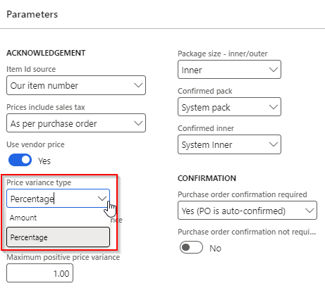
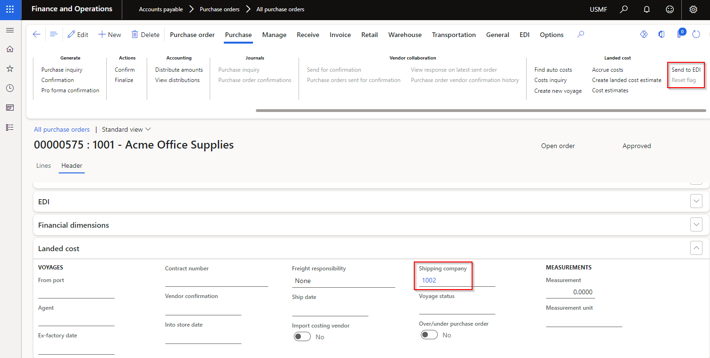
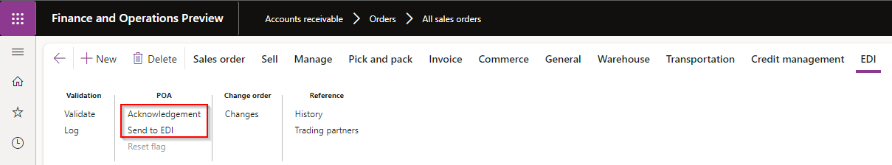
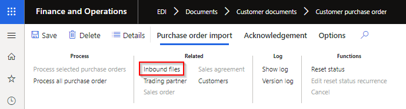

---
# required metadata

title: EDI
description: EDI - Release notes
author: jdutoit2
manager: Kym Parker
ms.date: 2024-04-04
ms.topic: article
ms.prod: 
ms.service: dynamics-ax-applications
ms.technology: 

# optional metadata

# ms.search.form: 
audience: Application User
# ms.devlang: 
ms.reviewer: jdutoit2

# ms.tgt_pltfrm: 
# ms.custom: ["21901", "intro-internal"]
ms.search.region: IconEDI
# ms.search.industry: [leave blank for most, retail, public sector]
ms.author: jdutoit2
ms.search.validFrom:  2016-05-31
ms.dyn365.ops.version: AX 7.0.1
---

# 	Release notes
This document describes the features that are either new or changed in the release version mentioned.
[Installation process](https://dxcanzproduct.github.io/DXC-Products-for-Microsoft-Business-Applications/EDI/Release-notes.html#installation-process) 

# Next version

### Release 10.0.36.202404TBD
Estimated release date: 30 April 2024

<ins>New features</ins>

**Core module**	- Applies to all modules

Number	| Name		 | Description
:--	|:--		  	|:--
17434	| SFTP connection	| Upgrade SFTP to latest [2024.0.0](https://github.com/sshnet/SSH.NET/releases/tag/2024.0.0) release

**Customer module**	

Number	| Name		 | Description
:--	|:--		  	|:--	
17001	| - Customer purchase order   - Customer purchase order change | New document setting **Price variance type** with options **Amount** and **Percentage**.   Previously the **Maximum negative price variance** and **Maximum positive price variance** values were only in Amount.   Price variance type now allows **Percentage** option as well with this new document setting.   [User guide](CUSTOMER/SETUP/SETTING-PROFILES/Customer-purchase-order.md)    

**Vendor module**	

Number	| Name		 | Description
:--	|:--		  	|:--	
17004	| Vendor purchase order acknowledgement | New document setting **Price variance type** with options **Amount** and **Percentage**.   Previously the **Maximum negative price variance** and **Maximum positive price variance** values were only in Amount.   Price variance type now allows **Percentage** option as well with this new document setting.   [User guide](VENDOR/SETUP/SETTING-PROFILES/Vendor-purchase-order-acknowledgement.md)    

**Freight forwarder landed cost module**

Number	| Name		 | Description
:--	|:--		  	|:--	
16146	| Voyage advice		| Ability to create **Voyage advice** with Purchase order **Confirmation** or **Confirm**.   [User guide](FREIGHT-FORWARDER/DOCUMENTS/Voyage-advice.md)   

<ins>Bug fixes</ins>

**Core module**	- Applies to all modules

Number	| Name		 | Description
:--	|:--		  	|:--
17417	| SFTP connection	| Update **Private key** to Password style

**Vendor module**	

Number	| Name		 | Description
:--	|:--		  	|:--	
10755	| Vendor purchase order change | Fix to **Acknowledgement required**. If set to _Yes_, Purchase order's:   • **Approval status** set to _In external review_   • **Acknowledgement status** set to _Acknowledgement pending_
16510	| Vendor purchase order change | Previously Vendor purchase order change line field **Requested receipt date** was set to POA's _Confirmed delivery date_.   Thus if PO line's **Requested receipt date** was manually overridden on the PO line after receiving the POA, this change didn't reflect in the Vendor purchase order change record.   Changes:   • New header and line field **Confirmed receipt date** - Source is Purchase order's Confirmed receipt date   • Existing header and line field **Requested receipt date** - Updated source is Purchase order's Requested receipt date     • Processing Confirmation:   • Requested receipt date - Default is system delivery date.   • **Use vendor date** sets the Requested receipt date to Vendor's acknowledged delivery date from the POA     
16785	| Vendor purchase order change | Incorrect order line change type **Delete items** assigned where line's Deliver remainder is zero because of full receipt.

**3PL module**

Number	| Name		 | Description
:--	|:--		  	|:--	
16295	| Shipment advice - Voyage | Applicable to Voyages created for **Transfer orders**. **From warehouse** was used to determine if **Send to EDI** was enabled and applicable Trading partner settings. **To warehouse** for the Transfer order is now used.

# Current version

Next release is planned for 30 April 2024.

### Release 10.0.34.20231031

DXC EDI 10.0.34 runs on the following Microsoft releases

Base	  | Version	  | Release
:--       |:--            |:--
Microsoft Dynamics 365 application	| 10.0.34	  | [What’s new or changed in Dynamics 365 application version 10.0.34](https://docs.microsoft.com/en-us/dynamics365/finance/get-started/whats-new-changed-10-0-34)
Microsoft Dynamics 365 application	| 10.0.35	  | [What’s new or changed in Dynamics 365 application version 10.0.35](https://docs.microsoft.com/en-us/dynamics365/finance/get-started/whats-new-changed-10-0-35)
Microsoft Dynamics 365 application	| 10.0.36	  | [What’s new or changed in Dynamics 365 application version 10.0.36](https://docs.microsoft.com/en-us/dynamics365/finance/get-started/whats-new-changed-10-0-36)
Microsoft Dynamics 365 application	| 10.0.37	  | [What’s new or changed in Dynamics 365 application version 10.0.37](https://docs.microsoft.com/en-us/dynamics365/finance/get-started/whats-new-changed-10-0-37)
Microsoft Dynamics 365 application	| 10.0.38	  | [What’s new or changed in Dynamics 365 application version 10.0.38](https://docs.microsoft.com/en-us/dynamics365/finance/get-started/whats-new-changed-10-0-38)
Microsoft Dynamics 365 application	| 10.0.39	  | [What’s new or changed in Dynamics 365 application version 10.0.39](https://docs.microsoft.com/en-us/dynamics365/finance/get-started/whats-new-changed-10-0-39)

#### Build  10.0.34.202310312
Release date: 31 October 2023  

<ins>New features</ins>

**Core module**	- Applies to all modules

Number	| Name		 | Description
:--	|:--		  	|:--
16412	| DXC License		| DXC License 10.0.34.202310311.   DXC License updated to include feature managed SmartSend and Core extensions. If your environment includes these products, they would also require upgrade to feature managed releases.
12020	| Outbound files	| Trading partner button on Outbound files
16326	| Trading partners	| Increased Trading partner's **Search mask** length from 30 to 60 characters

**Customer module**	

Number	| Name		 | Description
:--	|:--		  	|:--	
16125	| Customer purchase order	| New Setting profile option **Suppress add new address**. Not applicable to staging records that have **Store code** populated, only applicable where the staging header's address fields are used to create the new sales order. When the staging header's address can't be found against the customer and **Suppress add new address** is set to _Yes_, a new address will not automatically be added to the customer and used on the sales order - the staging record will error instead.
16292	| Customer purchase order	| Increased **Buyer code** EDT length from 20 to 60 characters.
16131	| Customer purchase order     Customer purchase order acknowledgement	| New Customer purchase order setting profile option **Skip error lines**.   When set to _Yes_, the staging lines that _can't_ be created as sales order lines are skipped and the sales order contains only the lines that could be created.   Examples: product is stopped for sales, or item number can't be found.     The customer purchase order acknowledgement to the customer still contains the skipped line(s), with **POA code item** set to the mapped value for new POA response code **Line item - error**.     Implementation requirements to use new functionality:   • Set Customer purchase order setting profile **Skip error lines** to _Yes_   • If POA will be sent, set a mapped value for new response code **Line item - error**
16299   16350	| Customer purchase order acknowledgement	| Staging line field 'POA code item' is a concat of 'Price code + Qty code + Pack code + Inner Code'. Field 'POA code item' stays as-is.   We've added a new "summarised" field called 'POA code line' with either of the following results (if new response codes are mapped):   • **Line - accept**: If all the applicable line codes are accept   • **Line - reject**: If all the applicable line codes are reject   • **Line - advise**: If all the applicable line codes are combination of advise and reject     New response codes have been added to 'Customer setup > POA response code group' for these three "summarised" response codes.   Response code is only applicable if mapped.     The following responses are deemed Accept:   • Line price - accept   • Line item - accept   • Line item - pack accept   • Line item - inner accept   • Response code not mapped     The following responses are deemed Reject:   • Line price - advise   • Line item - out of stock   • Line item - withdrawn   • Line item - pack difference   • Line item - inner difference

**Vendor module**	

Number	| Name		 | Description
:--	|:--		  	|:--	
15272	| Vendor purchase order change - Order line change type group	| Ability to limit when a staging record is created.   Staging record will not be created where all line's **Order line change type**'s **Don't send change** is set to _Yes_.     
15356	| Vendor purchase order change - Order line change type group	| **Order line change types** - Additional options added:   • **Price change** - Price change only to existing purchase order line. X12 example: PC   • **Quantity decrease** - Only quantity decrease to existing purchase order line. X12 example: QD   • **Quantity increase** - Only quantity increase to existing purchase order line. X12 example: QI   • **Reschedule** - Only requested delivery date change to existing purchase order line. X12 example: RS   • **No change** - No changes to existing purchase order line. X12 example: NC     **Order line change types** - Existing option modified:   • **Changes to line items**  - Multiple changes to existing purchase order line, for example quantity and price. X12 example: CA

**3PL module**

Number	| Name		 | Description
:--	|:--		  	|:--	
16009	| Shipment receipt - Voyage	| Ability for inbound document to create a D365 batch if it doesn't exist in D365.   • Setting profile: New option **Create batch**   • Staging lines: New fields **Manufacturing date** and **Expiration date** - to be used when creating the new batch in D365.
16128	| Shipment advice - Voyage	| Additional fields add to staging and template lines:   • **Line number** - Staging line number   • **Line number document** - Source document's line number   • **Order** - Source Purchase order or Transfer order number

**Freight forwarder landed cost module**

Number	| Name		 | Description
:--	|:--		  	|:--	
16030	| Voyage advice		| New outbound document that provides the ability to send **Purchase order details** to the Landed cost freight forwarder.   [User guide](FREIGHT-FORWARDER/DOCUMENTS/Voyage-advice.md)     **Setup**:   Add Templates and Outbound files on **Document types** and assign to applicable **Freight forwarder landed cost Trading partner**     **Processing**:   • Assign applicable **Shipping company** on the Purchase order header Landed cost FastTab.   • Use **Send to EDI** on the Purchase order's Action Pane, Purchase tab, Landed cost heading, to create the outbound staging record   
16343	| Voyage creator	| New option on Setting profile's **Source line search strategy** and new **Staging lines** field called **Line number document**.   Provides the ability for Voyage creator to match to the source document's (Purchase or Transfer order) **Line number** when creating the Voyage lines. 

<ins>Bug fixes</ins>

**Core module**	- Applies to all modules

Number	| Name		 | Description
:--	|:--		  	|:--
14981	| Document types	| When using the **Copy** button on **Setting profiles** and **Validation profiles**, limit the string size for **Name**. 

**Customer module**	

Number	| Name		 | Description
:--	|:--		  	|:--	
16356	| Customer purchase order acknowledgement	| If the user clicked 'Send to EDI' on the Sales order's Action pane (EDI tab) without opening Acknowledgement first, the POA codes haven't been initialised yet and blank values would be populated for the POA codes in the staging record. The POA codes are now also initialised when clicking 'Send to EDI' on the Sales order's Action Pane (if POA codes are blank).   
16121	| Customer advanced shipping notice	| The ASN staging record wasn't displayed in Sales order's EDI **History**.
16394	| Customer advanced shipping notice	| Blank **Ship date** and **Scheduled delivery date** for Intercompany ASN.
16402	| Customer advanced shipping notice	| Only relevant to Intercompany ASN. When the intercompany shipping sales order had multiple shipments, received error 'Cannot create a record in Consignment note lines (SAB_EDIConsignmentNoteLines). The record already exists.'

**3PL module**

Number	| Name		 | Description
:--	|:--		  	|:--	
10528	| Shipment advice - Voyage   Shipment receipt - Voyage	| Missing security to access staging forms

**Freight forwarder landed cost module**

Number	| Name		 | Description
:--	|:--		  	|:--	
16149	| Voyage creator	| When the purchase order line contained a different unit to the product's inventory unit and the voyage creator line used the same unit as the purchase order line, the voyage quantity was incorrectly multiplied by the unit conversion.   To support this fix, we implemented 16343 **Source line search strategy** called **Line number document** for voyage creator to find the applicable source line's unit for correct unit conversion.   Thus if your purchase order line's unit differ to inventory unit, you need to use this new source line search strategy option.
10637	| Voyage creator   Voyage tracking	| Voyages button enabled prior to processing of record
12598	| Document types	| Description in Document types updated for new records for:   • Voyage creator   • Voyage tracking
16055	| Voyage tracking	| 'SAB_EDIStagingHistory::logHistory has been incorrectly called' error when processing staging record when 'Voyage id source' set to 'External id'

# Previous version(s)

Approximately one year of previous versions are included below.

### Release 10.0.34.20230731

#### Build  10.0.34.202307313
Release date: 18 October 2023  

<ins>Bug fixes</ins>

**Customer module**	

Number	| Name		 | Description
:--	|:--		  	|:--	
16289	| Customer advanced shipping notice	| Updates to Intercompany ASN as there were still settings used from intercompany trading partner (shipping company) instead of customer the ASN will be sent to (originating EDI customer). The intercompany ASN now doesn't require the shipping company setup as customer trading partner.
16134	| Customer advanced shipping notice	| Only applies to 'Auto assign consignment note number' document type set to _Yes_:   • Use sales order header's delivery address when creating/assigning consolidated packing slip     Only applies to 'Auto assign consignment note number' document type set to _Yes_ and 'ASN strategy set to _Consolidated packing slips_:   • If a packing slip should be sent to EDI, for example 'Send only for EDI orders' is _Yes_ and the order is EDI, but an existing open Consolidated packing slip exists for a packing slip(s) that shouldn't be sent to EDI (for example order isn't EDI), the packing slip will not be added to the consignment that can't be sent to EDI.

#### Build  10.0.34.202307312
Release date: 28 September 2023  

<ins>Bug fixes</ins>

**Core module**	- Applies to all modules

Number	| Name		 | Description
:--	|:--		  	|:--	
15887	| Connection types - SFTP	| The underlying connection was closed: The server committed a protocol violation.   Issue only for release 10.0.34.202307311 that prevented file moved to archive/error folders.

**Customer module**

Number	| Name		 | Description
:--	|:--		  	|:--
16094	| Customer advanced shipping notice	| Intercompany order not identified as EDI order for sending ASN. Use 'Send only for EDI orders' from originating company for intercompany orders.

#### Build  10.0.34.202307311
Release date: 31 July 2023  

<ins>New features</ins>

**Core module**	- Applies to all modules

Number	| Name		 | Description
:--	|:--		  	|:--
14455	| Connection types - Azure, FTP and SFTP	| New option **Disable delete**. When set to _Yes_, the file will not be deleted from the import path. This is useful where company doesn't have edit rights on the connection and don't want to see an error in the connection log.   FTP: Enabling this option may cause a performance impact. Each file will be downloaded and uploaded to its specific directory to retain file in source directory.
N/A	| Licensing	| New versions included:   • DXC License 10.0.34.202307311   • DXC License Manager 10.0.32.202307312

**Customer module**

Number	| Name		 | Description
:--	|:--		  	|:--
14184   15009	| Customer advanced shipping notice	| Support Intercompany Customer ASN. Creates the ASN against the originating EDI order's Trading partner and applies their ASN document setting, for example only create for EDI order.   The intercompany ASN's **External item number** will be obtained from the originating sales order line - only applies to EDI orders.
14569	| Customer advanced shipping notice	| New document setting **Auto assign consignment note number** and EDI parameter's Number sequence **Consignment note number**. Ability to auto generate consignment numbers for Single and Consolidated packing slips. Where Shipping carrier is set to auto generate consignment numbers, the pro number sequence will still be used. This new document setting option applies to sales orders where no shipping carrier is assigned, or the shipping carrier doesn't auto generate consignment notes.    Where the document setting's **ASN strategy** is set to _Consolidated packing slips_ and **Auto assign consignment note number** is set to _Yes_, the packing slip will automatically be assigned to latest open (not sent to EDI) consignment that matches the packing slip (for example shipping carrier, customer, address). If an open consignment note is not found, a new consignment note will be created and the packing slip assigned.   Users can still manually create and assign consignment note numbers as well.   [User guide](https://dxcanzproduct.github.io/DXC-Products-for-Microsoft-Business-Applications/EDI/CUSTOMER/DOCUMENTS/Customer-advanced-shipping-notice.html#auto-generate-a-consignment-note-number)
14964	| Customer advanced shipping notice	| New periodic task called **Send customer advanced shipping notice**.   Ability to set a recurrence for automatically sending open (**Sent to EDI** is set to _No_) consignment note numbers to EDI which sets the Consignment note's **Sent to EDI** to _Yes_ and creates the ASN record.   This is useful for consolidated packing slips that can be automatically "closed" and ASN created after a certain time in the day.   [User guide](https://dxcanzproduct.github.io/DXC-Products-for-Microsoft-Business-Applications/EDI/CUSTOMER/DOCUMENTS/Customer-advanced-shipping-notice.html#periodic-task)

**3PL module**	

Number	| Functionality	  	| Reason
:--	|:--		  	|:--
14343	| Product master	| Ability to filter to multiple **Lifecycle states** on the **Product configuration update** periodic task.   This periodic task's purpose is to flag the product as applicable to the 3PL warehouse if inventory transactions exist. 

<ins>Bug fixes</ins>

**Core module**	- Applies to all modules

Number	| Name		 | Description
:--	|:--		  	|:--	
11657	| Saved views		| Applicable when feature 'Saved views performance enhancement' is enabled, and user navigates from a staging form to Inbound files using the **Inbound files** button.   Inbound file's Default view is applied and could result in applicable inbound file not displaying.   When setting new EDI parameters field **Apply standard view** to:   • **Yes**: the standard view will be applied   • **No**: the default view will be applied     
14821	| Connection types - Azure and FTP	| File delete was attempted after file has been moved to error folder. Functionally worked, but log indicated an error for attempted delete. FTP filename will get a date/time stamp suffix when moved to archive and error paths.
14437	| Connection types - Azure, FTP and SFTP | When Archive path / container is not setup the intention is not to archive the import file, example where company doesn't have edit rights on the connection.   The connection log should not give a warning that it failed to archive in this case.
15269	| Data entity - EDI Outbound file names	| Import failed with: Field 'EDI Document type' must be filled in

**Customer module**

Number	| Name		 | Description
:--	|:--		  	|:--
13069	| Data entity	| Entity **POA response code group lines** didn't allow importing values where **Allow auto trigger** is set to _No_.
14648	| Customer advanced shipping notice	| The Shipped quantity (field Quantity / OrderQty) was in Inventory unit, now changed to match the Sales unit for the ASN line. Field InventQty is still in the Inventory unit.
12619	| Customer advanced shipping notice	| Update label for InventQuantity to **Inventory quantity** and added to the staging form.
15192	| Customer purchase order acknowledgement	| Fix to mapped values for staging line field **POA code item**. Extra character added to lines after line 1.

### Release 10.0.34.20230615

#### Build 10.0.34.202306151
Release date: 15 June 2023   

<ins>**Manual actions required**</ins>

Due to moving to the DXC License model in 14561, it is required to create an uninstall package to remove the Sable37 License model.  
Otherwise you will receive duplicate object errors.  
See [MS instructions](https://learn.microsoft.com/en-us/dynamics365/fin-ops-core/dev-itpro/deployment/uninstall-deployable-package).

<ins>New features</ins>

**Core module**	- Applies to all modules

Number	| Name		 | Description
:--	|:--		  	|:--	
14561	| Update model display names and licensing	| About > Version: Update to models' display name to include DXC.   Moved to the DXC License model, see 'Manual actions required'.
14205	| Connection type - Azure Blob Storage | Update to support Azure Blob Storage related method depreciation in 10.0.34.   Replaced StartCopy with BeginStartCopy   Update method for moving File in Azure Blob Storage   [Obsolete API](https://learn.microsoft.com/en-us/previous-versions/azure/jj732079(v=azure.100))
14178	| Process to staging	| With the change to allow multiple incoming documents for the same document type for a Trading partner (8420), the setting and validation profile assigned to the document for the trading partner was assigned to the inbound file.   To support scenarios where the filename isn't unique per trading partner, and the staging record created against a different trading partner (using GLN inside file), this change assigns the setting and validation profile when processing the inbound file to staging and thus applying the staging trading partner's setting and validation profiles.

**Customer module**	

Number	| Name		 | Description
:--	|:--		  	|:--	
14131   14584 | • Customer purchase order   • Customer purchase order change	| Support for 10.0.34 feature **Apply sales tax group for product variants in sales and procurement**. Ability to use "override" item sales tax group for a variant when creating the sales order line.
14157	| • Customer purchase order acknowledgement   • Customer advanced shipping notice	| Add fields:   • Ordered quantity   • Backorder quantity

**Vendor module**	

Number	| Name		 | Description
:--	|:--		  	|:--	
14581 | Vendor purchase order acknowledgement	| Support for 10.0.34 feature **Apply sales tax group for product variants in sales and procurement**. Ability to use "override" item sales tax group for a variant when creating the purchase order line.

<ins>Bug fixes</ins>

**Core module**	- Applies to all modules

Number	| Name		 | Description
:--	|:--		  	|:--	
14434	| Trading partners	| Couldn't delete an EDI Trading partner when no EDI transactions existed for the Trading partner.   Fixed transactions validation to allow empty trading partner's deletion

**Customer module**	

Number	| Name		 | Description
:--	|:--		  	|:--	
14112	| • Customer purchase order   • Customer purchase order change	| Where the staging line's **Unit** is _empty_ and Document setting's **Blank sales unit** is set to use _Sales trade agreement unit_ and the **Itemd id source** is _Barcode_ or _GTIN_, the unit from the Barcode or GTIN will be used when creating the sales order line.  

**Vendor module**	

Number	| Name		 | Description
:--	|:--		  	|:--	
9231	| Purchase order	| When the Vendor Trading partner had Vendor purchase order acknowledgement (POA) enabled, and the Purchase order has been confirmed but the POA hasn't been received yet: When clicking on Purchase order line details' 'EDI acknowledgement' tab, errored with 'Function SAB_EDIDocumentTypeClass::constructBasedOnDocumentType has been incorrectly called.' Update to document settings function.

### Release 10.0.31.20230505

#### Build 10.0.31.202305054
Release date: 25 May 2023   

<ins>Bug fixes</ins>

**Vendor module**	

Number	| Name		 | Description
:--	|:--		  	|:--	
14407	| Purchase invoice	| Where the purchase invoice contained a zero unit price, the purchase order line's unit price was used in calculation the invoice's line amount. This has now been fixed to use staging values.

#### Build 10.0.29.202305053
Release date: 5 May 2023   

<ins>New features</ins>

**Core module**	- Applies to all modules

Number	| Functionality	  	| Reason
:--	|:--		  	|:--	
12869	| Azure connection	| New field **Folder name** for Azure connections adds the ability to set an azure folder for incoming and outgoing paths.   **Test path connection** excludes folder names.
13014	| Text template		| Additional **Row delimiter** option Tilde {~} 
12403	| Export batch job	| Where there is no data to export, change export batch's log from error to info log
13519	| Picking list		| New option **Restrict EDI picking route generation to allowed document types** on EDI parameters   • **No** (default) - Record created in table SAB_EDIWMSPICKINGROUTEEXT each time a picking list is posted.   • **Yes** - Record will only be created in table SAB_EDIWMSPICKINGROUTEEXT for customers with Customer advanced shipping notice and Warehouses with Picking list documents enabled.
N/A	| License manager	| License manager version 10.8.32.10171   Enhanced Licensing capabilities to assist with licensing support and scaling.   **Note:** Required to upgrade all installed DXC products to at least the following versions:   • EDI 10.0.29.202305053   • Finance utilities 10.0.29.202305051   • SmartSend 10.0.29.202304142   • Core extensions 10.0.29.202304142   • DocuSign 10.0.29.202304211   • Item creation 10.0.29.202304211   •  PLM 10.0.29.202304211   • Forex 10.0.29.202305101    

**Customer module**	

Number	| Functionality	  	| Reason
:--	|:--		  	|:--
12615	| Sales invoice		| Additional Sales order header fields added to Sales invoice line fields:   • Sales responsible   • Sales taker
12647	| New entity 'EDI sales order entity' | New entity **EDI sales order entity** (SAB_EDISalesTable) provides users the ability to populate this table for sales order orders not created via EDI. This is useful for cutover sales orders where a customer is not set to receive EDI ASN or Sales invoice for non-EDI Sales orders.
13782	| SAB_EDISalesUseCustomerPrice	| Changed SAB_EDISalesUseCustomerPrice from Private to Public
13698	| EDI Sales order processing - Pending POA	| Ability to select multiple **Pending POA** records and click **Send to EDI** on the EDI Sales order processing workspace

**Vendor module**	

Number	| Functionality	  	| Reason
:--	|:--		  	|:--
12897	| Vendor purchase order acknowledgement (POA) | When **Line item - added** is used to create a new line on the D365 Purchase order (PO), the PO line's **Site** and **Warehouse** will be set by POA staging line if these fields are provided, else set by the Site and Warehouse on the PO header.
13075	| Vendor purchase order acknowledgement (POA) | Where a Vendor purchase order acknowledgement staging record has errored because of Error tolerance validation, button **Override error validation** can be used to override and process to target.   The button is available on:   • EDI > Vendor workspaces > EDI purchase order processing. Select the Validation tab and select **POA Errors** under Processing or the tile under Summary.   • EDI > Documents > Vendor documents > Vendor purchase order acknowledgement. Button is enabled when status is not completed or canceled.
12898	| Vendor advanced shipping notice (ASN) | Use the purchase order line's **location** when creating the Arrival journal. Previously used the default location.
13649	| Purchase invoice	| Related to 10372, **Product receipt quantity to match** logic has been updated to include invoice quantity of zero.

**3PL module**	

Number	| Functionality	  	| Reason
:--	|:--		  	|:--
12403	| Product master	| New document **Product master** in 3PL module.   Can be used to provide information about new products and changes to existing products that apply to the warehouse. Products can be manually flagged and/or use periodic job to flag as applicable to the warehouse.   [Setup](3PL/SETUP/SETTING-PROFILES/Product-master.md) and [Processing](3PL/DOCUMENTS/Product-master.md).

<ins>Bug fixes</ins>

**Core module**	

Number	| Name		 | Description
:--	|:--		 |:--
10532	| Inbound files   Outbound files	| When file was processed by batch **Log** didn't show the log message.
12628	| Trading partner documents	| **EDI > Inquiries and reports > Trading partner documents**. Form couldn't open if environment contains a large number of trading partners (example 3000 EDI trading partners).
12715	| Document type - XML and JSON templates | Removed automatic upper case applied to mapping name. For example renaming Currency**C**ode to Currency**c**ode, used to automatically revert to Currency**C**ode and processing would fail if the incoming document field was called Currency**c**ode.
13854	| FTP and SFTP Connection types	| When new was selected on Incoming paths, the first Outgoing path document's Type was changed from Outbound to Inbound

**Customer module**	

Number	| Name		 | Description
:--	|:--		 |:--
14057	| Sales order	 | Fix to query on Trading partners link on Sales order (EDI tab on ActionPane).
13654	| Sales invoice	 | Revert changes from 11723. Caused Batch invoicing not creating Sales invoice EDI staging records.

**Vendor module**

Number	| Name		 | Description
:--	|:--		 |:--
12747	| Vendor purchase order acknowledgement (POA) | When the Vendor purchase order acknowledgement is processed from import to staging, and there are two vendors with the same GLN (two different legal entities), it would pick up the first Vendor GLN's Company to create the staging record.   And then tries to find the purchase order in the incorrect company when processing to target.

**3PL module**

Number	| Name		 | Description
:--	|:--		 |:--
14108	| Transfer order - History	| EDI History was limited to Transfer orders where the To (receiving) warehouse was setup for EDI. Now includes From (shipping) warehouse that are setup for EDI.

### Release 10.0.29.20230130

#### Build 10.0.29.202301301
Release date: 30 January 2023   

<ins>**Manual actions required**</ins>

Due to new setting **Send only for EDI orders**. Ensure **Customer** Trading partners have setting profiles assigned to below documents:
- Customer advanced shipping notice
- Sales invoice 

Else users will receive error 'Update has been cancelled. No document setting specified' when trying to post the Sales order's Packing slip and Invoice.  
Can be manually updated in **EDI > Setup > Trading partners** or by using data entity **EDI Documents - Customers**

<ins>New features</ins>

**Core module**	- Applies to all modules

Number	| Functionality	  	| Reason
:--	|:--		  	|:--	
11625	| EDI history		| Move EDI history extensions to shared EDI module and Replace SAB_EDISalesOrderHistory
5664	| Staging metadata	| The following non-editable SQL fields have been added to Document types' **Staging metadata**:   • Field type   • Field length   • Mandatory
10646	| Outbound files	| **File transfer type** filter added to Outbound files.
11978	| EDI Document maintenance workspace	| Ability to select multiple records and use **Reset status** or **Cancel**.
12007	| Connections	| **Log** ability added to all connection types. Ability to set **Logging level** and **Retention period**. This provides users the ability to set Custom alerts. For example if a connection can't connect a log with level _Error_ can be created.
12609	| SFTP			| Keyboard Interactive Authentication added to SFTP.   Upgraded Renci.SSHNet library to 2020.0.2
N/A	| License manager	| License manager version 10.8.32.10156

**Customer module**	

Number	| Functionality	  	| Reason
:--	|:--		  	|:--
4467	| Customer purchase order | New field **Sales origin** added to Customer purchase order's Setting profile (default is Blank). Field has also been added to the Staging header. If new header staging field or document setting is not blank, the value will be written to the created Sales order's Sales origin field.
12286	| Customer purchase order	| New line field **Customer reference** added to lines. If the staging line fields **Customer requisition** and **Customer reference** is populated, these will be used when creating the sales order lines. If staging fields not populated it will use the header fields to populate new sales orders lines (previous process).
12369	| Customer purchase order acknowledgement	| New header fields added to staging:   • Terms of payment   • Terms of payment description   • Sales responsible   • Sales taker   • Email   • Telephone   • Delivery terms   • Delivery terms description   • Mode of delivery   • Mode of delivery description
11747	| Customer advanced shipping notice| New document setting **Send only for EDI orders**. When set to _Yes_, and the sales order wasn't created via EDI, an outbound ASN staging record will not be created.
12254	| Customer advanced shipping notice	| **Line number document** added to staging lines. Existing **Line number** uses Packing slip's Line numbers, but the ASN could contain multiple packing slips, thus we added the additional field **Line number document** for unique staging line numbers.
12385	| Customer advanced shipping notice	| New line fields added to staging:   • Email   • Telephone   • Country of origin (as setup on product)   • Mode of delivery   • Mode of delivery description   • Way bill number - if ASN created from Shipments     New line fields added to Consignment note   • Email   • Telephone   • Mode of delivery   • Mode of delivery description
11747	| Sales invoice	| New document setting **Send only for EDI orders**. When set to _Yes_, and the sales order wasn't created via EDI, an outbound Sales invoice staging record will not be created.
12412	| EDI Sales order processing workspace	| Open consignment notes - Exclude for non ASN customers.

**Vendor module**	

Number	| Functionality	  	| Reason
:--	|:--		  	|:--
12224	| Vendor purchase order acknowledgement	| If populated, the POA staging line's 'Acknowledged delivery date' can update the applicable purchase order line's **Confirmed delivery date**. Previously it was updated only by the POA header's 'Acknowledged delivery date'.
12294	| Vendor purchase order acknowledgement	| Ability for the POA to add a new line to the D365 purchase order.   Map vendor's value to POA response code **Line item - added**. Set a validation option of Info, Warning or Error if allowed to add this new line to the purchase order. Warning and Error records will be displayed in the **EDI Purchase order processing** workspace.

<ins>Bug fixes</ins>

**Core module**	

Number	| Name		 | Description
:--	|:--		 |:--
11984	| Inbound text templates	| Fix CAR resolution change in 10.0.27.20220930 release for text template's line number calculation on import-to-staging step.   Issue for processing import-to-staging where the staging table's line number is the unique index.
11999	| Export template for text types	| Fix Error 'Buffer for call of SAB_EDITemplateFile is not specified.' when clicking 'Export template' for Text templates via Mappings.
5898	| Inbound files   Outbound files	| **Attachment** tab not always visible. 
12199	| Trading partners	| Could only filter to one company in column.
12424	| Batch recurrence	| Added batch recurrence options **Months** and **Years** to:   • Batch control group   • Inbound file's Retrieve files   • Export batch jobs's New batch job

**Customer module**

Number	| Name		 | Description
:--	|:--		 |:--
12390	| Customer purchase order change	| Quantity change not updating the Pick / Invent quantity on the sales order line.
12391	| Customer purchase order acknowledgment	| Only applicable for POA created after Customer purchase order change. POA's SalesQty still showed original quantity, not updated quantity.
1603	| Customer advanced shipping notice	| Only applicable to Warehouse ASN line config **WHSContainerization**. Customer advanced shipping notice lines duplicated when lines are split (for example multiple batches).
12299	| Customer advanced shipping notice	| Populate **PackingSlipId** on lines.
11723	| Sales invoice	| Unticking **Send to EDI** when posting the Sales invoice still created a staging record.

**Vendor module**

Number	| Name		 | Description
:--	|:--		 |:--
1989	| Purchase agreement	| Fix **External item number** for Vendor purchase order document where created from a Purchase agreements.
12291	| Vendor purchase order acknowledgement	| **Vendor price** rounded on **EDI purchase order confirmation**.

**3PL module**

Number	| Name		 | Description
:--	|:--		 |:--
11913	| Transactional locking type	| When there’s insufficient physical inventory available to post write-off transactions with 'Picking list registration', ‘Inventory adjustment - Transfer’ and ‘Inventory adjustment - Movement’ documents, the ‘Process to target’ batch job crashes with this update conflict error:   Batch task failed: Cannot edit a record in Inventory order transaction (WMSOrderTrans). An update conflict occurred due to another user process deleting the record or changing one or more fields in the record.   Resulted in staging records after issue record not being processed.   Changed: Transactional locking type allow multiple updates.
12425	| Picking list	| **Sent to EDI** incorrectly displayed _No_ where the sent Picking list has received a Picking list registration and the lines have been split (for example multiple batches).
12550	| Inventory adjustment workspace	| Updated security on the **Reset flag**, **Exclude**, **Include**, **Send to EDI** buttons for:   •  Open picking list   •  Open shipment advice - Purchase order   •  Open shipment advice - Return order   •  Open shipment advice - Voyage

### Release 10.0.27.20221108

#### Build 10.0.27.202211082
Release date: 8 November 2022   

<ins>New features</ins>

**Core module**	- Applies to all modules

Number	| Functionality	  	| Reason
:--	|:--		  	|:--	
10535	| Refresh module	| In the unlikely scenario of a field being removed from a document, the **Refresh module** now includes removing these deleted fields when updating EDI.
11635	| Trading partners	| The following system fields have been activated for **Trading partners**, **Trading partner's incoming and outgoing documents** and **Trading partner's Connection profile**:   • Created by   • Created date and time   • Modified by   • Modified date and time   Note: For existing records the created and modified dates will be updated with **Refresh module** and the created by and modified by will be a ?

**Customer module**	

Number	| Functionality	  	| Reason
:--	|:--		  	|:--	
8057	| EDI history		| Added the following on **Sales order**'s EDI history:   • Customer purchase order where Order type = Release order
11552	| EDI history		| Added the following on **Sales agreement**'s EDI history:   • Customer purchase order where Order type = Agreement
11637	| Sales order processing workspace - Open invoice | Where the Customer trading partner's **Sales invoice** document setting **Don't send credit note** is set to Yes, these credits will be excluded on **Sales order processing workspace's** **Open invoice**

**3PL module**	

Number	| Functionality	  	| Reason
:--	|:--		  	|:--	
8057	| EDI history		| Added the following on **Sales order**'s EDI history:   • Picking list registration
8057	| EDI history		| Added the following on **Purchase order**'s EDI history:   • Shipment advice - Purchase order    • Shipment receipt - Purchase order
11552	| EDI history		| Added the following on **Transfer order**'s EDI history:   • Picking list   • Picking list registration   • Shipment advice - Transfer order   • Shipment receipt - Transfer order
11552	| EDI history		| Added the following on **Return order**'s EDI history:   • Shipment advice - Return order   • Shipment receipt - Return order
11552	| EDI history		| Added the following on **Landed cost Voyage**'s EDI history:   • Shipment advice - Voyage   • Shipment receipt - Voyage
10519	| Transfer order Picking list	| Added the ability to send a Transfer order's Picking list to EDI and reset flag in order to resend.   This was achieved by adding the following to **Transfer order history**:   • Button **Send to EDI**   • Button **Reset flag**   • Field **Sent to EDI** 

**Freight forwarder for Landed cost module**	

Number	| Functionality	  	| Reason
:--	|:--		  	|:--	
11552	| EDI history		| Added the following on **Landed cost Voyage**'s EDI history:   • Voyage creator   • Voyage tracking

<ins>Bug fixes</ins>

**Core module**	

Number	| Name		 | Description
:--	|:--		 |:--
10563	| Test path connection for Azure	| Previously if an Azure container didn't contain a file, the **Test path connection** would return a failed result.
11597	| EDI history		| Updated the link on EDI history's **EDI Document type** to filter to the applicable document type.

**3PL module**	

Number	| Name		 | Description
:--	|:--		 |:--
11649	| Transfer order	| EDI was automatically setting **Explode lines** on outbound documents:   • **Picking list**   • **Shipment advice - Transfer order**.   Since this can be set by the user, EDI doesn't need to automatically set this to Yes.     New feature: New document setting **Don't explode lines** have been added for the following inbound documents to set if **Explode lines** should automatically be Yes:   • **Picking list registration** - Applicable when **Ship transfer order** set to Yes   • **Shipment receipt - Transfer order** - Applicable when **Auto receive** set to Yes

### Release 10.0.27.20220930

#### Build 10.0.27.202211173
Release date: 17 November 2022

<ins>Bug fixes</ins>

**Core module**	

Number	| Name		 | Description
:--	|:--		 |:--
11984	| Inbound text templates	| Fix CAR resolution change in 10.0.27.20220930 release for text template's line number calculation on import-to-staging step.   Issue for processing import-to-staging where the staging table's line number is the unique index.

#### Build 10.0.27.202209301
Release date: 30 September 2022   
Excludes Inbound Transportation management (ITM) & ITM version Freight forwarder

<ins>New features</ins>

**Core module**	- Applies to all modules

Number	| Functionality	  	| Reason
:--	|:--		  	|:--	
10549	| CAR report		| CAR resolution
10549	| Workspace		| Workspace pattern version changed from 1.1 to 1.2
10297	| XSLT scripting	| Due to MS deprecating XSLT scripting, the **Enable XSLT scripting** option has been removed from **EDI shared parameters**
8408   11577	| Data entities		| EDI fields 'Inner unit' and 'Outer unit' added to standard entity **Released products V2**   EDI entities added: **EDI Azure sites**, **EDI Azure container setup** and **EDI Web API settings**

**Customer module**	

Number	| Functionality	  	| Reason
:--	|:--		  	|:--	
11255	| Customer purchase order	| Applicable to where store code isn't used and the order refers to a new customer address. Previously if the new address couldn't be created, the sales order was created without a delivery address. Now it will rather error the staging record, so the address details can be fixed and the sales order created with a delivery address. Example: EDI order's delivery address refers to a state that can't be found in D365, i.e. Victoria instead of VIC.
4470	| Customer purchase order	| New field **Item description** added to 'Customer purchase order' and 'Customer purchase order change'. When these documents create a new sales order line, new field **Item description** (available on EDI tab on sales order lines) will be populated.

**Vendor module**	

Number	| Functionality	  | Reason
:--	|:--		  |:--	
11185	| Purchase invoice	| Related to 10372, but calculation has been updated to include equal.   If the Shipped quantity is higher **or equal** to the Invoice quantity, the 'Product receipt quantity to match' will be set to _Invoice quantity_
11272	| Vendor purchase order	| New header fields **Requester email** and **Requester phone** added to 'Vendor purchase order' and 'Vendor purchase order change' documents

<ins>Bug fixes</ins>

**Customer module**	

Number	| Name		 | Description
:--	|:--		 |:--
11309	| Validate on Sales order	| **Validate** button is now disabled on Sales order when the Document status is set to _Tax invoice_. 
10648	| POA		| When a sales line is out of stock, still send unit price on Customer purchase order acknowledgement.

**3PL module**	

Number	| Name		 	| Description
:--	|:--		 	|:--
10527	| Picking list		| When generating the Picking list and unticking **Send to EDI**, the picking list staging record was still created.

#### Build 10.0.27.202209302
Release date: 30 September 2022  
Includes Inbound Transportation management (ITM) & ITM version Freight forwarder of 10.0.27.20220930
	

### Release 10.0.22.20220630

#### Build 10.0.25.202206301

Excludes Inbound Transportation management (ITM) & ITM version Freight forwarder

<ins>**Manual actions required**</ins>
 - Recreate Import batch

<ins>New features</ins>

**License manager** - Applies to all products

Number	| Functionality	  | Reason
:--	|:--		  |:--	
10341	| DXC License manager   10.8.32.10141	| New workspace **Organization administration > Workspaces > DXC support**.   Links for licensed products to:   • User guide   • Release notes   • Contact - email address for support	

**Core module**	- Applies to all modules

Number	| Functionality	  | Reason
:--	|:--		  |:--	
9767	| Import - batch group with multiple companies			| After moving Batch control to groups, the import batch can fail when another legal entity isn't setup for EDI. This change will ensure the remaining legal entities are still processed.
9659 	| Document template - Custom format	| Ability to set a custom date format on inbound file	
9608	| Document template - Dates		| Allow empty dates
8321	| Copy		| **Copy** button on Document type's Template, Setting profiles, Validation profiles and Trading partner
8268	| Outbound file name	| Improvements to outbound file name **Editor**. Can also set date format, example currentSessionDate(ddMMyyyy)	
9763	| XML document template mapping	| Ability to send and extract **Attributes** for XML document templates. New button **Show fields in tree** added to facilitate mapping. **Refresh module** will update **Attribute** column on existing templates.   	
9819	| Functional acknowledgement received | Company field has been added to **EDI > Inquiries and reports > Functional acknowledgement received**. Previously using Trading partner's company, which prevented Company filter to filter appropriately.
10229	| Outbound files	| Additional fields on where file will be/have been sent:   • File transfer type   • Original folder. Only applies to new records.
10442	| Connection type	| New Incoming path type **Error**. Where file already exists in D365 for trading partner and document type, the file will be moved from Import path to Error path. If the Error path isn't setup, the duplicate file will remain in Import path.
10446	| EDI parameters	| Removed **About** tab on EDI parameters

**Customer module**	

Number	| Functionality	  | Reason
:--	|:--		  |:--	
4302	| Customer purchase order & Customer purchase order change	| New document setting **Blank unit** for documents **Customer purchase order** and **Customer purchase order change** (Add additional item). Where the staging record will create a new sales line and the **Unit** is not provided in the file, the document setting provides options to use one of the following for the blank units:   • Sales unit   • Sales trade agreement unit   • Inventory unit   • Error (errors the complete staging record)
10436	| Customer purchase order	| New field **Comment** added to Header and line staging. Written to new EDI fields on D365 Sales order	header and lines.

**Vendor module**	

Number	| Functionality	  | Reason
:--	|:--		  |:--	
2129	| Purchase order line	| Add **Line change type** to Purchase order line EDI tab. 	
10372	| Purchase invoice	| **Product receipt quantity to match**. A Purchase invoice could be partial, i.e. not match the complete qty of the product receipt processed on D365. Previously when PackingSlipID is blank (not provided in file), EDI fully matches to the product receipt(s) processed for the order, even if Invoice qty < Product received qty. Now EDI will check staging line field ShippedQuantity, if InvoiceQuantity is less than ShippedQuantity, then 'Product receipt quantity to match' will be set to InvoiceQuantity.

**3PL module**	

Number	| Functionality	  | Reason
:--	|:--		  |:--	
9830	| **Sent to EDI** on EDI processing workspaces	| <ins>EDI Inventory adjustment workspace</ins>   New tile and tab for following 3PL documents, where the document is enabled for the 3PL trading partner, but record's **Sent to EDI** is set to _No_:   • Open Picking list   • Open shipment advice - Purchase order    • Open shipment advice - Return order   • Open shipment advice - Voyage     Additional functionality on Processing for all the Open tabs:   •	Filtered to Sent to EDI is No   •	Filtered to Excluded set to No   •	Buttons:   o	**Send to EDI** - can create staging record from workspace and update **Sent to EDI** to _Yes_   o	**Reset flag** – Enabled when **Sent to EDI** is _Yes_. Reset ‘Sent to EDI’ to No which enables ‘Send to EDI’ button   o	**Exclude / Include** (New functionality) – Ability to exclude the record from the “outstanding” list. Use filter Excluded to view records that has been excluded and can use button Include to include record again. Doesn’t create the staging record, but assist users in managing their “outstanding” list.   	

<ins>Bug fixes</ins>

**Core module**	- Applies to all modules	

Number	| Name		 | Description
:--	|:--		 |:--
9261	| Show log on outbound staging		| Showed Empty for previously processed outbound staging records
8312	| Trading partner			| Connection profile wasn't saved if adding a connection to newly created trading partner or adding to newly created document on the trading partner
10149	| Trading partner			| When a template for Vendors and/or Customers exist and user opens the EDI Trading partner's form, the options to 'Select a template for Vendors' and 'Select a template for Customers' pop ups.
10485	| Text template type	| Fixed text type template with missing closing double quote in source file caused **Process to staging** batch to remain in Executing status
10433	| Connection type - FTP	| Port fix

**Customer module**	

Number	| Name		 | Description
:--	|:--		 |:--
10305	| Entity **EDI Settings - PO**	| Fix error "Results. Field 'Relation type field' must be filled in. Results. validateWrite failed on data source 'AgreementClassification (AgreementClassification)'"
10406	| Customer purchase order	| When store code is not provided in staging, the staging header's address fields are used to find the applicable address on the customer to set on the sales order header. When the address doesn't exist on the D365 customer, the address is added to the customer.
10514	| EDI Sales order processing workspace	| Fix to filter when opening tile **Pending PO changes**

**Vendor module**	

Number	| Name		 | Description
:--	|:--		 |:--
6642	| Can't delete Vendor outbound files			| Previously errored with: "File exports cannot be deleted while dependent EDI Vendor purchase order exist. Delete dependent EDI Vendor purchase order and try again." Will now allow deletion of outbound file.
10374	| Purchase invoice	| Error 'Item % Update has been cancelled' when processing a Purchase invoice with blank 'Product receipt' and the purchase order includes a cancelled product receipt.
10514	| EDI Purchase order processing workspace	| Fix to filter when opening tile **Pending POA** and **Pending POA  confirm**

**3PL module**	

Number	| Name		 | Description
:--	|:--		 |:--
9691	| Shipment receipt - Purchase order	| Same PackingSlipId on multiple lines
10514	| EDI Inventory adjustment workspace	| Fix to filter when opening tile **Open count journals** and **Open movement journals**

#### Build 10.0.25.202206302
Includes Inbound Transportation management (ITM) & ITM version Freight forwarder of 10.0.25.20220630

### Release 10.0.22.202204101

#### Build 10.0.22.2022041012

Excludes Inbound Transportation management (ITM) & ITM version Freight forwarder

<ins>**Manual actions required**</ins>  
**EDI > Setup > Batch control** has been replaced with **EDI > Setup > Batch control group**.  
Running **Refresh module** will transfer the “tick’s” (green in screenshot) from deprecated Batch control to new Batch control groups.   Next step is to delete the company specific EDI Batch jobs (via System administration > Inquiries > Batch jobs) and then create new batch jobs for each process via red in below screenshot. These will automatically be created on Company account dat, which enables the batch to run for multiple company accounts.   

<ins>Deprecated</ins>

Functionality		| Reason
:--			|:--
EDI > Setup > Batch control   EDI > Batch control (workspace)	| Replaced with **EDI > Setup > EDI batch control groups**, which allows companies to setup a batch for one or multiple legal entities.   See manual actions required.

<ins>New features</ins>

Number	  | Functionality	  | Reason
:--       |:--              |:--
9314	  | Batch control groups	| Allows companies to setup a batch group for one or multiple legal entities.   **Note**: See note in Deprecated section.
9733	  | Fixed text file template	| Alignment and Padding character have been added to Fixed Text Document Type Templates.   **Note**: new index has been added to Field position for Text fixed templates, which doesn’t allow multiple fields to start in same position. Before upgrading, update template/s if **Field position** isn’t unique.
9732	 | Text file template	| Text Document type’s Setup: Decimal separator ‘None’ option.
9653	 | XML and JSON document template mapping	| **Static values** and **Custom format** on inbound XML and JSON document mapping. Examples:   •	Where a field is in the inbound file, but should be replaced with another value: Use Custom format and substring formula. Example:       •	Where a field isn’t in the inbound file, but a static value should be populated in staging: Use Static value. Example:   
10073	| UOM mapping	| UOM mapping enhanced to include:   •	Company (Blank Company is allowed where Item code is set to All)   •	Item code (Table, Group, All)   •	Item relation   •	Inventory dimensions   **Note**: All existing UOM mappings will have Company set to Blank and Item code set to All. Should be no issues with backwards compatibility.
9660	| EDI batches	| Enable automated retries - if D365 experience a brief loss of connection to MS SQL Server. isRetryable set to True
9792	| Process to outbound	| Added **Records to include** filter on **Process to outbound**
9742	| Sales invoice	 | Additional sales invoice fields:   • Header:   o	Invoice contact name   o	Invoice phone number   •	Lines:   o	Customer account   o	Customer contact name   o	Customer phone number   o	Delivery address details from sales order line   o	Backorder quantity   o	Sales unit price (unit price before discounts excluding tax)   o	Sales unit price include tax (unit price before discounts including tax)   o	Unit discount   o	Unit discount percent
9612	| EDI Document maintenance workspace	| New Tile **File export errors** added to **EDI Document maintenance workspace** (per module).   Displays Outbound files with **Status** is set to _Error_ per module
9714	| Outbound filename	| Enhancements to form layout.   And additional currentSessionDate placeholders.
9692	| Purchase order confirmations	| Procurement and sourcing > Purchase orders > Purchase order confirmation > Purchase order confirmations   Added **Sent to EDI** to list page, and buttons **Send to EDI** and **Reset flag**.   
10084	| Version log’s Message	| Changed **Message** to unlimited type string   
10026	| Stock transfer receipt – Purchase order	| New button **Product receipt** added to staging form. Enabled if the document setting **Auto post receipt** is set to _Yes_.
9496	| Staging line height	| New EDI extended data types to improve staging forms lines’ height.
10147	| Consignment notes	| Removed error message **No document setting specified** where a customer doesn’t have a setting profile assigned to Customer advanced shipping notice document. **Add** button will be disabled if no setting profile assigned. **Add** button is only enabled where document setting **ASN strategy** is set to _Consolidated packing slip_ and **Sent to EDI** is _No_.
9827   9829	| **Sent to EDI** on EDI processing workspaces	| <ins>EDI Sales order processing workspace</ins>   New tile and tab for **Open invoice**. Filtered to sales invoices for customer trading partners with ‘Sales invoice’ document enabled. Below new buttons and filters also added to **Open consignment notes**   <ins>EDI Purchase order processing workspace</ins>   New tile and tab for **Open confirmation**. Filtered to purchase confirmations for vendor trading partners with **Vendor purchase order** document enabled.   <ins>All above processing workspaces</ins>   Additional functionality on Processing for all the Open tabs:   •	Filtered to Sent to EDI is No   •	Filtered to Excluded set to No   •	Buttons:   o	**Send to EDI** - can create staging record from workspace and update **Sent to EDI** to _Yes_   o	**Reset flag** – Enabled when **Sent to EDI** is _Yes_. Reset ‘Sent to EDI’ to No which enables ‘Send to EDI’ button   o	**Exclude / Include** (New functionality) – Ability to exclude the record from the “outstanding” list. Use filter Excluded to view records that has been excluded and can use button Include to include record again. Doesn’t create the staging record, but assist users in managing their “outstanding” list.   

<ins>Bug fixes</ins>

Number	| Name		 | Description
:--	|:--		 |:--
9990	| 10.0.26 PEAP	 | Compile error fixes for 10.0.26 PEAP
10023	| Customer advanced shipping notice	| SSCC blank for 'ASN line configuration' PickingList
9707	| 3PL Document maintenance	| Tile vs. Document list (all legal entities)
9644	| Batch jobs	 | ‘Process to outbound’ ran for all legal entities
9795	| Purchase invoice	| Using OrderedQty instead of InvoiceQuantity
9694	| Saved views	 | Saved views not applied to all EDI forms	
10080	| Staging forms	 | Staging forms wasn’t opening correct record after inserting a column on lines
9820	| XSLT format	 | ‘Format outbound document’ not applied to XSLT
5402	| Display method | Ability to add display method field (example numberOf Lines) to text template mapping and ability to import via entity
8341	| 3PL UI fixes	 | Various small user interface fixes on staging forms (removing duplicates etc.) Also updated entity ‘EDI Shipment Receipt settings – Transfer order’ to ‘EDI Settings Shipment Receipt - Transfer order’ for consistency
4432	| Customer UI fixes | Various small user interface fixes to staging forms, POA document setting profile and adding Store code to Trading partner’s Address

#### Build 10.0.22.2022041013
Includes Inbound Transportation management (ITM) & ITM version Freight forwarder of 2022041012

#### Build 10.0.22.2022041014 
	
Number	| Name	 | Description
:--	|:--	 |:--
10236	| Text document type template	| **Field position** index reverted to not unique 

#### Build 10.0.22.2022041015
Includes Inbound Transportation management (ITM) & ITM version Freight forwarder of 2022041014

### Release 10.0.18.20220110

#### Build 10.0.18.202201101
	
Excludes Inbound Transportation management (ITM) & ITM version Freight forwarder

<ins>New features</ins>
	
Number	| Functionality	  | Reason
:--	|:--		  |:--
8337	| XML and JSON document template mapping	| Additional mapping functionality for document templates XML and JSON
9642	| Product dimension – Version	| Added **Version** to all document types when **Product dimension – Version** is enabled – see [MS](https://docs.microsoft.com/en-us/dynamics365/supply-chain/pim/product-dimensions) for enabling steps
9690	| Sales invoice – Product dimensions	| Product dimensions added to Sales invoice document type

<ins>Bug fixes</ins>

Number	| Name		 | Description
:--	|:--		 |:--
9597	| Sales order header, EDI FastTab	| Fix to **Original EDI number** on Sales order.   Also added link on ‘Change EDI number’.
9601	| currentSessionTimeHMS()	| Fix to Outbound filename placeholder currentSessionTimeHMS(). Minutes showing as 90 instead of 09 for example.

#### Build 10.0.18.202201102

Includes Inbound Transportation management (ITM) & ITM version Freight forwarder

### Release 10.0.18.20211029

#### Build 10.0.18.202110291
	
Excludes Inbound Transportation management (ITM) & ITM version Freight forwarder

<ins>New features</ins>
	
Number	| Functionality	  | Reason
:--	|:--		  |:--
9521	| Purchase invoice	| Purchase invoice unit price rounding on conversion. Where document setting ‘Prices include sales tax’ is set to ‘Including tax’.
  	| Compile error	  | Compile error for SAB_EDIClerk.SAB_EDIFreightForwarderLandedCost.xml. Caught in 10.0.21

#### Build 10.0.18.202110292

Includes Inbound Transportation management (ITM) & ITM version Freight forwarder

### Release 10.0.18.20211021

#### Build 10.0.18.202110211
	
Excludes Inbound Transportation management (ITM) & ITM version Freight forwarder

<ins>New features</ins>
	
Number	| Functionality	  | Reason
:--	|:--		  |:--
52	| Customer credit note	| •	Setting profile added to Customer document type ‘Sales invoice’.   o	 Mappings for ‘Invoice’ and ‘Credit adjustment note’   o	Don’t send credit note – Y/N   •	New field InvoiceType added to Customer document type ‘Sales invoice’.    **Backwards compatibility**: Not mandatory to setup profile on Trading partner. If mapping not setup, ‘Invoice’ or ‘Credit note’ will be written to new field InvoiceType.
9310	| Display first error	| Display first error on inbound staging record (uses Version log) in new field on list page called ‘Message’. Also available on Inbound documents in Document maintenance workspace
9311	| Canceled	| Ability to change inbound file and staging record’s status to Canceled. Available on all inbound files, staging forms and Document maintenance workspace.
9479	| Sent timestamp | EDI > Inquiries and reports > Functional acknowledgement received: ‘Sent timestamp’ changed from Date to Date and time

<ins>Bug fixes</ins>

Number	| Name		 | Description
:--	|:--		 |:--
9263	| Picking list cancellation	| When 3PL sends a picking list registration with all the line quantities set to zero, which effectively cancels the complete picking list: EDI automatically creates a Picking list staging back to the 3PL with Order purpose = Cancellation.   Fix: Don’t send cancellation back to 3PL
8775	| Integration – Customer group	| Field length on SAB_EDICustGroupStaging.GroupControlNumber changed to use EDT

#### Build 10.0.18.202110212

Includes Inbound Transportation management (ITM) & ITM version Freight forwarder

### Release 10.0.18.20210928

#### Build 10.0.18.202109283
	
Excludes Inbound Transportation management (ITM) & ITM version Freight forwarder

<ins>New features</ins>
	
Number	| Functionality	  | Reason
:--	|:--		  |:--
8343	| EDIFACT	  | New module & licensing for ‘EDI – Standard formats’.   Includes ability to map **EDIFACT** document template type.

#### Build 10.0.18.202109284

Includes Inbound Transportation management (ITM) & ITM version Freight forwarder

	
# Installation process
To align with MS best practice and to protect our IP the following applies to the release process.
- The license models DXCLicense and Sable37License will only be released as binaries as part of a deployable package. 
- We will not provide test models for the products, neither as binary or source code. 
- We will only publish the release as a deployable package. 
- Model source code can be provided at our discretion. It can be requested for debugging upgrade errors, or if required for extensions.
	- If you have been given the source code to our model for extension or debugging purpose, never make modifications directly to our models! 
	- If you need an extension point, please send an email to ECLANZProductSupport@dxc.com and request it to be implemented. 

Depending on the installation history follow one of these guides to install the new release. 
## Installation without existing installed product
1. Apply the deployable package to your environment. 
2. If you have requested any model for extension or debugging purposes. Install the model source code. 
a.	Note, once the model source code is compiled it will overwrite the binaries installed when the deployable package was applied. 

## Installation with existing installed product
If you’re installing the new release in an installation that already has a previous version of the product installed and you’re not using it for debugging or extension. We recommend that you;  
1. Remove the release product model source code from your source control, if source control is used. 
2. Apply the deployable package, installing the latest version of the product models as binaries.  
3. Check in the binaries for the models to source control, if source control is used. 

If you’re using our model source code for extension or debugging and would like to continue using it, please do the following to apply the new release with the source code. 

1. Remove product license model from your source control that is applicable to the release. You’ll find the license model in the deployable package. It will either be called DXCLicense and Sable37License. 
2. Apply the deployable package to your environment to install the latest binaries. Check in the binaries for the license model that was removed in step 1 to source control. Note, this step will also install the binaries for all the models in the new release. 
3. Install the product release model source code and check into source control. 

If you don’t follow these instructions and continue building your installation deployable package using the license model source code, the installation will continue using the same license model as before applying the release. 

## Feature management
Enable all licensed modules via Feature management. Features are called:
- EDI (enable first)
- EDI – 3PL Documents
- EDI – Customer documents
- EDI – Vendor documents
- EDI – Freight forwarder landed cost documents
- EDI – Standard formats

If above features are not visible, press **Check for updates** to refresh the feature management list.

## Refresh EDI module
**EDI > Setup > EDI parameters**  
After each deployment, click **Refresh module**.  
This will flush EDI caches and refresh EDI module metadata such as EDI document types, XML structures, field names etc.

