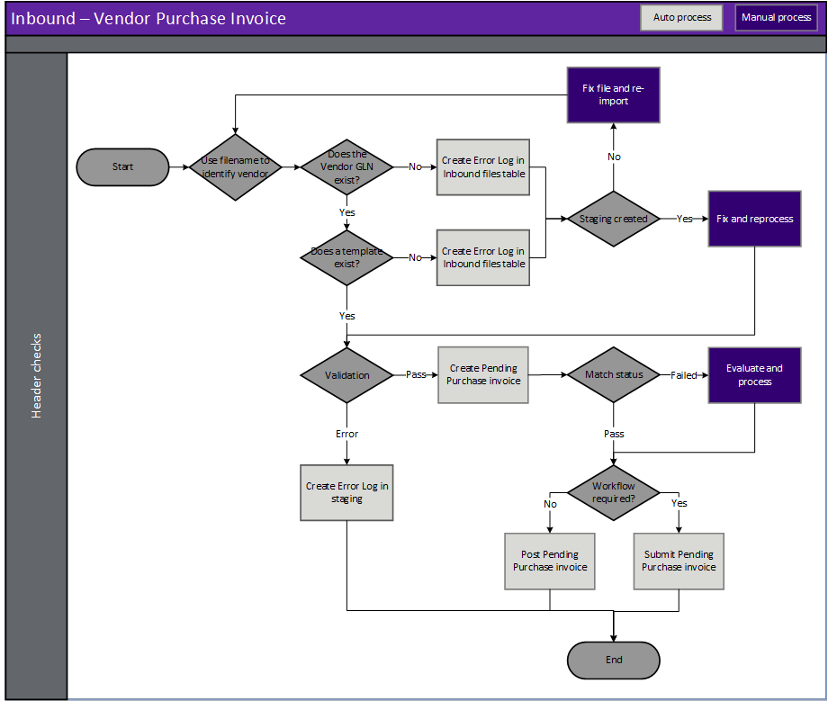
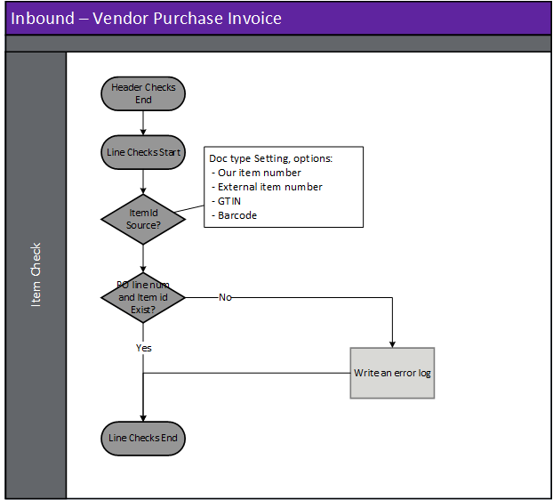

---
# required metadata

title: [EDI Vendor]
description: [EDI Vendor Documents - Purchase invoice]
author: [jdutoit2]
manager: Kym Parker
ms.date: 16/11/2021
ms.topic: article
ms.prod: 
ms.service: dynamics-ax-applications
ms.technology: 

# optional metadata

# ms.search.form:  [Operations AOT form name to tie this topic to]
audience: [Application User]
# ms.devlang: 
ms.reviewer: [jdutoit2]
ms.search.scope: [Which Operations client to show this topic as help for, to be set by content strategist, see list here: https://microsoft.sharepoint.com/teams/DynDoc/_layouts/15/WopiFrame.aspx?sourcedoc={23419e1c-eb64-42e9-aa9b-79875b428718}&action=edit&wd=target%28Core%20Dynamics%20AX%20CP%20requirements%2Eone%7C4CC185C0%2DEFAA%2D42CD%2D94B9%2D8F2A45E7F61A%2FVersions%20list%20for%20docs%20topics%7CC14BE630%2D5151%2D49D6%2D8305%2D554B5084593C%2F%29]
# ms.tgt_pltfrm: 
# ms.custom: [used by loc for topics migrated from the wiki]
ms.search.region: [Global for most topics. Set Country/Region name for localizations]
# ms.search.industry: [leave blank for most, retail, public sector]
ms.author: [author's Microsoft alias]
ms.search.validFrom: [month/year of release that feature was introduced in, in format yyyy-mm-dd]
ms.dyn365.ops.version: [name of release that feature was introduced in, see list here: https://microsoft.sharepoint.com/teams/DynDoc/_layouts/15/WopiFrame.aspx?sourcedoc={23419e1c-eb64-42e9-aa9b-79875b428718}&action=edit&wd=target%28Core%20Dynamics%20AX%20CP%20requirements%2Eone%7C4CC185C0%2DEFAA%2D42CD%2D94B9%2D8F2A45E7F61A%2FVersions%20list%20for%20docs%20topics%7CC14BE630%2D5151%2D49D6%2D8305%2D554B5084593C%2F%29]
---

# Purchase invoice

EDI vendors can send a purchase invoice for one or multiple purchase orders.  
An EDI purchase invoice can be received and processed for D365 purchase orders not sent to the vendor via EDI.
The following subsections will describe how to view and process the invoice for purchase orders.  

Based on [document settings](../SETUP/SETTING%20PROFILES/Purchase%20invoice.md), the EDI purchase invoice can either:
- Create a pending purchase order invoice where the match status fails
- Post the purchase order invoice if match status passes, or
- Submit pending purchase order invoice to workflow

Viewing the [Staging table records](#view-staging-table-records) will also be discussed.   
The processed EDI purchase invoice record(s) can be viewed for a purchase order, by selecting the **History** button on the **EDI** tab on the Action Pane of the Purchase order page. 

## Prerequisites
The following setup is prerequisites for the purchase invoice:

1. Create [Charges code](../SETUP/VENDOR%20SETUP/Charges%20code.md) to map the vendor's values to D365 Charges codes.
2. Create [Payment terms type group](../SETUP/VENDOR%20SETUP/Payment%20terms%20type%20group.md) to map the vendor's values to D365 Payment terms.
3. Create [Misc charge/allowance indicator](../SETUP/VENDOR%20SETUP/Misc%20charge%20allowance%20indicator.md) to map the vendor's values to EDI Indicator.
4. Create [Misc method of handling](../SETUP/VENDOR%20SETUP/Misc%20method%20of%20handling.md) to map the vendor's values to EDI Method of handling.
5. Create [Template](../../CORE/Setup/DocumentTypes/File%20templates.md) for the document.
6. Create [Setting profile](../SETUP/SETTING%20PROFILES/Purchase%20invoice.md) for the document.
7. Create [Validation profile](../SETUP/VALIDATION%20PROFILES/Purchase%20invoice.md) for the document.
8. If the vendor [trading partner](../SETUP/Trading%20partner.md) doesn't exist, create the new trading partner.
9. Assign the applicable Charges code, Payment terms type group, Misc charge/allowance indicator and Misc method of handling to the vendor trading partner.
10. Add and enable the purchase invoice document to the [Vendor trading partner](../SETUP/Trading%20partner.md) and select the applicable:
    - Template
    - Setting profile
    - Validation profile
    - Search mask

## Processing
Inbound files have the following three steps:
1. **Import** - Imported file can be viewed in **EDI > Files > Inbound files**
2. **Import to staging** - Imported file is processed to staging record/s. The staging record/s can be viewed at **EDI > Documents > Vendor documents > Purchase invoice**
3. **Staging to target** - The staging record/s is processed to target. If the invoice is succefully processed a target D365 Purchase order invoice (pending, posted or submitted to workflow) will be created for the purchase order(s).

### Create document

### Header checks for Purchase invoice
Header checks are performed when:
1. Importing Purchase invoice file
2. Processing from import to staging
3. Processing from staging to target

## Step 1 - Import
When a purchase invoice file is imported, the file name is key to identifying the vendor and therefore the document template. See [Trading partners](../../CORE/Setup/Trading%20partners.md) for further details.  It is based on this document template that the data within the file is identified and a record created in the EDI staging table in the next step.

> Note: The file mask is used to identify the trading partner and therefore template

## Step 2 - Import to staging - Inbound file validation
When the purchase invoice file is retrieved and imported, there are various validations that are completed before the staging record is created in the EDI staging table.
If the processing of **Import to staging** errors, the Inbound file's **Status** will be set to _Error_ and no staging record created.

**Rule Id**         |	**Details**         
:--                 |:--                  
**Check Template**  |	Identify a template for the Vendor/Document type. This will be used to identify the whereabouts of data within the file

#### Possible issues and fixes
**Import to staging** errors for Purchase invoice can be viewed in:
- **EDI > Files > Inbound files** filtered to **Status** set to _Error_
- **EDI > Document maintenance**, tab **Vendor documents**, tile **File import errors**

At this step the issues are usually around the file not matching the template.
- Does the file have the correct template assigned (General tab, field **Template**):
  - **No**: Use **Reset template** to assign a different template. If this should apply to future documents for the Trading partner, also update in **Trading partners**.
  - **Yes**: Review **Log** and fix the applicable template in **EDI > Setup > Document types**. Examples issues are date format, new field.

Example error for file not matching template: 'Segment '<xml' not found in EDI template mapping'

## Step 3 - Staging to target
If the processing of **Staging to target** errors, the staging record's **Staging to target status** will be set to _Error_ and the D365 purchase order invoice won't be created.

#### Possible issues and fixes
**Staging to target** errors for Purchase invoice can be viewed in:
- **EDI > Documents > Vendor documents > Purchase invoice** filtered to **Staging to target tatus** set to _Error_
- **EDI > Document maintenance**, tab **Vendor documents**, tile **Purchase invoice errors**
- **EDI > Document maintenance**, tab **Vendor documents**, **Documents** page, tab **Invoice**

At this step the issues are usually around mapping/business logic issues.   
Review the **Log** or **Version log** for the applicable record to find the issue. Example errors and method to fix are discussed in below table.  
Example errors and possible fixes are discussed in [FAQ](../OTHER/FAQ.md#purchase-invoice)

### Staging line validation - Purchase invoice

**Rule Id**                 | **Details**                                                   | Error    
:---                        |:---                                                           |:---              
**PO number**               | Find the D365 PO number to which the invoice belongs          | Error at Staging table.    No pending D365 invoice created
**PO line number**          | Find the D365 purchase order line number to which the invoice line belongs    | Error at Staging table.   No D365 invoice created
**No Valid Item**           | No valid item based on the different options available        | Error at Staging table.   No D365 invoice created

### Validation

[Validation profiles](../SETUP/VALIDATION%20PROFILES/Purchase%20invoice.md) can be specified and linked to the template along with a rule error tolerance which is used to determine how D365 will react.  Options are:
-	**Info** - An infolog is displayed with information only, it is not identified as a warning
-	**Warning** - An infolog is displayed with a warning. It is possible to carry on processing
-	**Error** - An infolog is displayed with an error. It is not possible to carry on processing until the error has been corrected. EDI Status = Error

The following table describes each validation option for the Purchase invoice document. It also describes if the validation rule is not met, but only has an info or warning error tolerance, how D365 will react.

Rule Id	                | Details	                            | Info/Warning tolerance updates
:--                     |:--                                    |:--
**Invoice account**     | Where the invoice account received is different to the invoice account on the purchase order	| Create invoice against Trading partner’s vendor account and not the PO's invoice account

## View staging table records
To view the Purchase invoice staging records, go to **EDI > Documents > Vendor documents > Purchase invoice**. 
Use this page to review staging and manually process EDI Purchase invoice documents.

### List page
The following EDI fields are available on the list page.

**Field**               | **Description**
:---                    |:---
**EDI number**          |	EDI Staging table record id. Select **EDI number** or the **Details** button on the Action Pane, to view the details for the selected record. The number sequence is determined by [EDI number](../../CORE/Setup/EDI%20parameters.md#number-sequence) on the **EDI parameters**.
**Company account**     | Legal entity of the document.
**Company GLN**         | The company’s global location number is shown here.
**Staging to target status**    | The current status of the staging record. Options include:   • **Not Started** – The staging record has been successfully processed from the inbound file to the staging table but not processed to target.   • **Error** – The staging record has been processed from the staging table but no target has yet been created/updated.  There are errors with the staging record that needs to be reviewed.   • **Completed** – The staging record has been succesfully processed and created a D365 purchase order invoice   • **Canceled** – The record has been manually canceled and will be excluded from processing.
**Trading partner account**     | Vendor account assigned to the staging record.
**Trading partner GLN**         | The Vendor’s global location number is shown here.
**Invoice**                     | Vendor’s invoice id for the Purchase invoice record.
**EDI document purpose**        | Document purpose of the document, for example Original
**Document date**               | Vendor’s document date for the Purchase invoice record
**Created date and time**       | The date and time the selected record was created in the staging table.
**Sent**                        | Indicates if the **Functional acknowledgement outbound** has been sent to the trading partner for the inbound document record.

### Buttons
The following buttons are available on the **Purchase invoice**'s Action Pane, tab **Purchase invoice**.

**Button**	                    | **Description**
:---                            |:----
**Process purchase invoice**    | Create Purchase invoice Target for the selected record in the staging table.
**Process all purchase invoices**   | Create Purchase invoice Target for the staging records that have a **Staging to target status** set to _Not started_.
**Inbound files**               | View the inbound file record the selected staging record.
**Trading partner**             | View the trading partner details in the [Trading partners](../SETUP/Trading%20partner.md) page.
**All purchase order**          | If the EDI Purchase invoice has been completed it is possible to inquire on all the linked Purchase order/s the Purchase invoice was created for.
**Vendor**                      | Inquire on the Vendor for the selected record.
**Invoice**                     | If the staging record has been successfully processed and Purchase invoice **posted** it is possible to inquire on the purchase invoice.
**Pending invoice**             | If the staging record has been successfully processed and Pending Purchase invoice **created**; it is possible to inquire on the pending purchase invoice.
**Show log**                    | If there are Errors within the document, it is possible to review them at any time using this button. Shows only the current version.
**Version log**                 | View all log versions. When a document’s status is reset and reprocessed, a new log version is created. Can view all log versions.
**Reset Status**                | You can reset the **Staging to target status** to _Not started_. This can be used to reprocess the selected record/s. Documents can only be processed if **Staging to target status** is set to _Not started_.
**Edit reset status recurrence**    | If the underlying issue was resolved after all the reset attempts have been completed the user can use this button to edit the recurrence field/s. This will:   • Update **Reset status profile** to _blank_   • Update the **Reset status date/time** to next time reset will run   • **Reset status attempts** set to _Zero_ and   • **Recurrence** text updated with changed recurrence details
**Cancel**                      | Select **Cancel** to update the **Staging to target status** to _Canceled_. Button is enabled when the **Staging to target status** is not set to _Completed_.

The following buttons are available on the **Purchase invoice**'s Action Pane, tab **Acknowledgement**.
The **Acknowledgement** tab is available on all incoming documents staging pages and enables the user to process or view the **Functional acknowledgement outbound** that has been created for the inbound document.

**Button**	                    | **Description**
:---                            |:----
**Send to EDI**                 | If the **Sent** field for the staging record is set to _No_, use this button to create the **Functional acknowledgement outbound** record and also update the **Sent** field to _Yes._
**Reset flag**                  | If the **Sent** field for the staging record has been set to _Yes_, use this button to reset **Sent** to _No_.
**Functional acknowledgement**  | Use this button to view the **Functional acknowledgement outbound** record created for the inbound document.

### Header fields
The following EDI Header staging fields are available on the header page.

xCBL standard has the option of sending miscellaneous charges/ allowance as either one of the following:
-	Misc. amount
-	Misc. quantity
-	Misc. percentage

**Field**	            | **Description**	                                    | **D365 Target**
:---                    |:---                                                   |:---
<ins>**Identification FastTab**</ins>
<ins>**Identification**</ins>		
**EDI number**          | EDI Staging table record id                           | History page on D365 PO
**Company account**     | Legal entity of the document
**Company GLN**         | The company’s global location number is shown here.   | 
**Staging to target status**    |  The current status of the staging record. Options include:   • **Not Started** – The staging record has been successfully processed from the inbound file to the staging table but not processed to target.   • **Error** – The staging record has been processed from the staging table but no target has yet been created/updated.  There are errors with the staging record that needs to be reviewed.   • **Completed** – The staging record has been succesfully processed and created a D365 purchase order invoice.   • **Canceled** – The record has been manually canceled and will be excluded from processing.
<ins>**Reset status**</ins>		
**Reset status profile**    | Reset status profile assigned to the file/document. This will default from EDI shared parameters or can be overridden on Trading partner’s incoming and outgoing documents. The profile can also be changed to another profile which will also reset the **Reset status attempts** to 0 and reset the **Reset status date/time**	
**Reset status date/time**  | Next date/time automatic reset status will run	
**Reset status attempts**   | Number of reset attempts already processed. The reset attempts will stop once this number reaches the **End after** as per assigned **Reset status profile**’s Recurrence	
**Recurrence**              | Recurrence text. Contains standard details of Recurrence, for example:   •	Interval (recurrence pattern)   • How many times the period will run (End after)   • From date/time the recurrence will start	
<ins>**Overview**</ins>	
**Invoice**                 | Vendor’s invoice id for the Purchase invoice record.	    | Invoice> Invoice number
**Document date**           | Purchase invoice’s document date	                        | Invoice > Document date
**Invoice type**            | Determines if the EDI document is an invoice or credit adjustment note. EDI amounts for credit adjustment note will be positive in EDI and will be converted to negative amounts in target credit adjustment note	
**EDI document purpose**    | The EDI document purpose is shown here. Currently only original invoice supported. This field is just for information.	
<ins>**Status**</ins>		
**Group control number**    | Group control number for outbound document. To be used to match inbound functional acknowledgement, where applicable.	
**Sent**                    | Indicates if outbound functional acknowledgement has been sent to the trading partner for the inbound document.	
<ins>**General FastTab**</ins>	
<ins>**Purchase invoice**</ins>		
**Invoice**                 | Vendor’s purchase invoice id	                            | Invoice > Invoice number
**Invoice reference**       | Contains external references to the Invoice that are important to the processing and use of the Invoice.	| Invoice > Document number
**Header note**             | Contains any free form text pertinent to the entire invoice or to the Invoice document itself	
**Tax point date**          | In xCBL standard. In most cases, if a business is invoice accounting for VAT, the tax point is the same date as the VAT invoice, and if a business is cash accounting for VAT, the tax point is the date when the money is received. There are exceptions though, for example if a business supplies goods more than 14 days before it issues a VAT invoice for those goods, the tax point is the day the goods were supplied.	
<ins>**Details**</ins>	
**Vendor account**          | Vendor account for the staging record	
**Vendor name**             | Vendor name	
**Trading partner GLN**     | The vendor’s global location number is shown here.	
**Company GLN**             | The company’s global location number is shown here.	
**Buyer group**             | The Purchase Order’s Buyer group is shown here.	
**Buyer name**              | Buyer name	
**Buyer email**             | Buyer email	
**Buyer phone**             | Buyer phone	
**Company phone**           | Company phone	
**Company name**            | Company name	
**Tax registration number** | Company tax registration number	
<ins>**Vendor invoicing**</ins>		
**Vendor name**             | Vendor name	
**Vendor primary street number**    | Vendor primary address - street number	
**Vendor primary street**   | Vendor primary address - street	
**Vendor primary city**     | Vendor primary address - city	
**Vendor primary county**   | Vendor primary address - county	
**Vendor primary state**    | Vendor primary address - state	
**Vendor primary ZIP/postal code**  | Vendor primary address - ZIP/postal code	
**Vendor primary country/region**   | Vendor primary address – country/region	
<ins>**Customer invoicing**</ins>		
**Bill to**                 | Our account number as loaded on Vendor’s Invoice account	
**Name**                    | Bill to - Name	
**Name or description**     | Bill to - Invoice address name	
**Street number**           | Bill to - Street number	
**Street**                  | Bill to - Street	
**City**                    | Bill to - City	
**County**                  | Bill to - County	
**State**                   | Bill to - State	
**ZIP/postal code**         | Bill to - ZIP/postal code	
**Country/region**          | Bill to - Country/region	
<ins>**Version**</ins>		
**Created date and time**   | The date and time the selected record was created in the staging table.	
<ins>**Delivery**</ins>	
**Delivery name**           | Ship to - Name	
**Our account number (Ship to)**    | Our account number as loaded on Vendor’s Order account	
**Store code**              | Ship to - Store code	
**Street number**           | Ship to - Street number	
**Street**                  | Ship to - Street	
**City**                    | Ship to - City	
**County**                  | Ship to - County	
**State**                   | Ship to - State	
**ZIP/postal code**         | Ship to - ZIP/postal code	
**Country/region**          | Ship to - Country/region	
**Attention information**   | Attention information	
<ins>**Miscellaneous**</ins>		
**Misc indicator**	        | Code which indicates an allowance or charge for the service specified. Mapped value setup in [Misc charge/allowance indicator](../SETUP/VENDOR%20SETUP/Misc%20charge%20allowance%20indicator.md).   Mandatory if Misc amount, Misc quantity or Misc percent populated.   If the indicator indicates it is an Allowance the EDI values provided will be made negative since all EDI values would be positive.	    | Invoice > Affects sign of Invoice charges value
**EDI charges code**        | Code identifying the service, promotion, allowance, or charge. Mapped value setup in [Charges code](../SETUP/VENDOR%20SETUP/Charges%20code.md). | Charges code, if Charges document setting **As per EDI document** is set to _Yes_
**Misc quantity**           | Specifies the allowance or charge where the calculation is based on quantity	| Charges Value = sum (Invoice quantity for all invoice lines) * Misc quantity
**Misc percent**            | Specifies the allowance or charge based on a percentage.	| Charges value = Invoice subtotal amount * Misc percent / 100
**Misc method of handling** | Specifies how the allowance or charge will be settled. 	| If **Add to invoice** is set to _Yes_: the charge will be added to the invoice
**Misc treatment**          | Additional information on misc. pricing. In xCBL specifies if the basis of the line item-level Allowance or Charge amounts are net or gross	
**Misc description**        | Describes the allowance or charge using references or free text.	
**Totals**                  | Amounts dependent on document setting ‘Prices include sales tax’
**Subtotal amount**         | Subtotal of all purchase order lines	
**Misc amount**             | Purchase order header Misc charge/allowance amount	    | Invoice > Charges Value
**Misc tax amount**         | Tax amount for the Misc charge or allowance	
**Tax amount**              | Total Tax amount	                                        | Invoice > Sales tax
**Round-off**               | Round-off	
**Total amount**            | Total amount	                                            | Invoice > Invoice amount
<ins>**Payment**</ins>		
**Currency**                | Purchase invoice currency	                                | Converted to PO currency
**Target currency**         | Target currency of the rate of exchange. This is the currency from which the monetary value is to be converted to.	
**Reference currency**      | Holds the reference currency of the rate of exchange. This is the currency from which the monetary value is to be converted from.	
**Exchange rate**           | Holds the value that the reference currency is to be multiplied by to convert it to the target currency.   If Invoice currency doesn’t equal to PO currency this will be used to convert to PO currency if document setting ‘Use vendor exchange rate’ = Yes	| Invoice’s exchange rate if document setting **Use vendor exchange rate** is set to _Yes_
**Exchange rate date**      | Date of above exchange rate	
**Terms code**              | Payment terms. Mapped value setup in [Payment terms type group](../SETUP/VENDOR%20SETUP/Payment%20terms%20type%20group.md).	
**Terms net days**          | Payment terms net due days
**Invoice due date**        | Date invoice is due for payment. Only applicable to xCBL. Terms net days used for X12 and EDIFACT	 | If document setting **Due date** is set to _Vendor due date_, used for Invoice's due date
**Cash discount**           | Settlement discount percentage	
**Days**                    | Settlement days	
**Discount amount**         | Settlement discount amount if paid within settlement days	
**Payment status**          | Code specifying the actual status of a payment, xCBL examples: PaidInFull, PartPaid, NotPaid. For information only	
**Payment reference**       | Reference number assigned to a payment	                | If Invoice reference is blank, use Payment reference as Document number
**Prepaid amount**          | Total prepaid amount for the invoice	
**Total amount payable**    | Total amount to be paid for the invoice	

### Line fields
The following EDI Line fields are available on the lines page.   
*** Price dependent on document setting **Prices include sales tax**.

**Field**                   | **Description**                                                           | **D365 target**
:---                        |:---                                                                       |:---
**Line number**             | The line within the EDI table/file. Refers to original purchase order EDI line number and used in matching.   | Used to find matching PO line
**Purchase order**          | Purchase order number for the staging record	                            | Used to find matching PO line
**PO version number**       | The version of the purchase order number	
**Purchase order date**     | The purchase order date from the PO that is being invoiced is shown here	
**Vendor reference**        | Vendor’s order reference	
**Item number**             | The item identifier as sent by the trading partner	| Used to find matching PO line in conjunction with document setting ‘Item id source’
**Description**             | Purchase order line text	
**Purchase quantity**       | Ordered quantity	
**Shipped quantity**        | Shipped quantity	
**Invoice quantity**        | Invoice quantity for this invoice	                                        | Invoice line > Invoice quantity   Converted to PO’s unit
**Unit**                    | Unit of measure for purchase, shipped and invoice quantity	            | Converted to PO’s unit
**Price unit**              | The quantity of the product that is covered by the purchase price. Usually 1	| Converted to PO’s price unit for matching
**Price multiplier**        | Value to be used to obtain a new value. NetUnitPrice/UnitPrice. Example price before discount $100 and after discount $90 has a price multiplier of 0.9	
**Includes GST**            | Unit prices and unit discounts includes GST	
**Unit Price** ***	        | Unit price for the item	                                                | Invoice line > Unit price   Converted based on PO unit and price unit
**Unit discount** ***	    | The amount of the line discount per price unit	                        | Invoice line > Discount
**Unit discount percentage**    | Discount percentage	                                                | Invoice line > Discount percentage
**Net unit price** ***	    | Unit price net of all discounts	
**Misc charges**            | Miscellaneous charge/allowance allocated to purchase order line	
**Line discount**           | Total discount amount for the purchase order line	
**Line amount excluding tax**   | Net line amount excluding tax	                                        | Invoice line > Amount
**Line amount tax**         | Line amount tax	
**Line amount including tax**   | Net line amount including tax	
**Tax type**                | Identification of the type tax. Example GST, VAT	
**Tax rate**                | Rate of tax	
**Currency**                | Currency	
**Inners quantity**         | Unit conversion quantity of inners to outers.   Example qty 12 ea (inner) per box (outer)	
**Inners unit**             | Inners unit of measure as setup on item’s pack size
**Pack quantity**           | Package quantity	
**Pack unit**               | Package unit of measure	
**Configuration**           | Product dimension - Configuration	
**Color**                   | Product dimension - Colour	
**Size**                    | Product dimension - Size	
**Style**                   | Product dimension - Style	
**Version**                 | Product dimension - Version
**Site**                    | Storage dimension - Site	
**Requested receipt date**  | The requested receipt date	
**Ship date**               | Date the goods were shipped	
**Consignment note number** | Consignment note identification for the delivery	
**Packing slip / Delivery note**    | 	Packing slip/Delivery note number	| Used for Total product receipt matching. If three-way matching is on Pending invoice will be created if packing slip doesn’t match
**Bill of lading ID**       | Bill of lading number	
**Shipping carrier**        | Shipping carrier	
**EDI carrier mode**        | Code specifying the method or type of transportation for the shipment	
**Carrier qualifier**       | Code designating the system/method of code structure used for shipping carrier	
**Requester**               | Requester	
**Attention information**   | Attention information	
**Delivery name**           | Address for Delivery – Delivery name	
**Street number**           | Ship to - Street number	
**Street**                  | Ship to - Street	
**City**                    | Ship to - City	
**County**                  | Ship to - County	
**State**                   | Ship to - State	
**ZIP/postal code**         | Ship to - ZIP/postal code	
**Country/region**          | Ship to - Country/region	
**Store code**              | Ship to - Store code	
**Delivery terms**          | Delivery terms	
**Delivery mode**           | Delivery mode	
**Item note**               | Contains any free form text pertinent to the invoice line	
