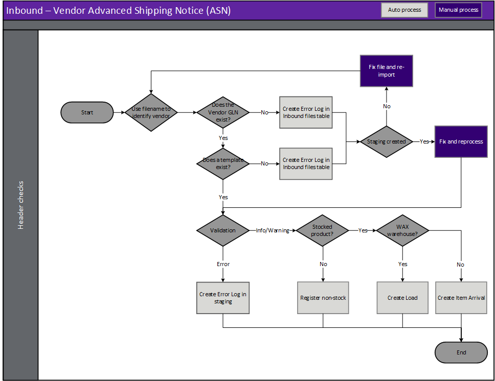
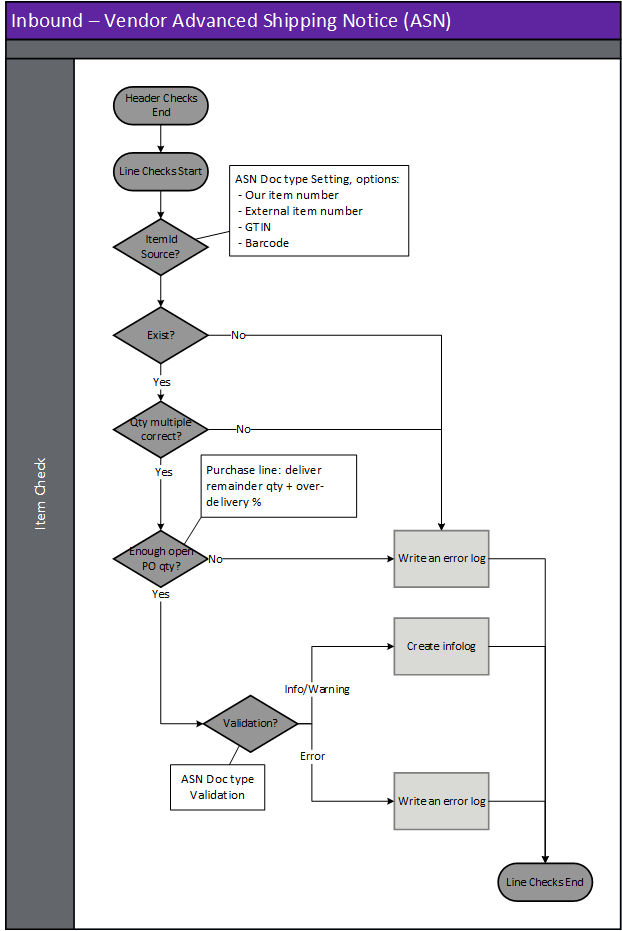

---
# required metadata

title: [EDI Vendor]
description: [EDI Vendor Documents - Vendor advanced shipping notice]
author: [jdutoit2]
manager: Kym Parker
ms.date: 16/11/2021
ms.topic: article
ms.prod: 
ms.service: dynamics-ax-applications
ms.technology: 

# optional metadata

# ms.search.form:  [Operations AOT form name to tie this topic to]
audience: [Application User]
# ms.devlang: 
ms.reviewer: [jdutoit2]
ms.search.scope: [Which Operations client to show this topic as help for, to be set by content strategist, see list here: https://microsoft.sharepoint.com/teams/DynDoc/_layouts/15/WopiFrame.aspx?sourcedoc={23419e1c-eb64-42e9-aa9b-79875b428718}&action=edit&wd=target%28Core%20Dynamics%20AX%20CP%20requirements%2Eone%7C4CC185C0%2DEFAA%2D42CD%2D94B9%2D8F2A45E7F61A%2FVersions%20list%20for%20docs%20topics%7CC14BE630%2D5151%2D49D6%2D8305%2D554B5084593C%2F%29]
# ms.tgt_pltfrm: 
# ms.custom: [used by loc for topics migrated from the wiki]
ms.search.region: [Global for most topics. Set Country/Region name for localizations]
# ms.search.industry: [leave blank for most, retail, public sector]
ms.author: [author's Microsoft alias]
ms.search.validFrom: [month/year of release that feature was introduced in, in format yyyy-mm-dd]
ms.dyn365.ops.version: [name of release that feature was introduced in, see list here: https://microsoft.sharepoint.com/teams/DynDoc/_layouts/15/WopiFrame.aspx?sourcedoc={23419e1c-eb64-42e9-aa9b-79875b428718}&action=edit&wd=target%28Core%20Dynamics%20AX%20CP%20requirements%2Eone%7C4CC185C0%2DEFAA%2D42CD%2D94B9%2D8F2A45E7F61A%2FVersions%20list%20for%20docs%20topics%7CC14BE630%2D5151%2D49D6%2D8305%2D554B5084593C%2F%29]
---

# Vendor advanced shipping notice (ASN)

EDI vendors can send an advanced shipping notice (ASN) for one or multiple purchase orders.  
An EDI ASN can be received and processed for D365 purchase orders not sent to the vendor via EDI.

The following subsections will describe how to view and process the ASN.  
Based on [document settings](../SETUP/SETTING%20PROFILES/Vendor%20advanced%20shipping%20notice.md), the EDI ASN can either:
- Basic warehousing (Ship to warehouse is setup for basic warehousing):
    - Create arrival journal, but leave unposted
    - Create and post arrival journal
    - Create and post arrival journal, and post the product receipt for the registered stock
- Advanced warehousing (Ship to warehouse is setup for advanced warehousing):
    - Create an open load

Viewing the [Staging table records](#view-staging-table-records) will also be discussed.   
The processed EDI ASN record(s) can be viewed for a purchase order, by selecting the **History** button on the **EDI** tab on the Action Pane of the Purchase order page. 

## Prerequisites
The following setup is prerequisites for the vendor advanced shipping notice

1. Create [Template](../../CORE/Setup/DocumentTypes/File%20templates.md) for the document.
1. Create [Setting profile](../SETUP/SETTING%20PROFILES/Vendor%20advanced%20shipping%20notice.md) for the document.
1. Create [Validation profile](../SETUP/VALIDATION%20PROFILES/Vendor%20advanced%20shipping%20notice.md) for the document.
1. If the vendor [trading partner](../SETUP/Trading%20partner.md) doesn't exist, create the new trading partner.
1. Add and enable the vendor advanced shipping notice document to the [Vendor trading partner](../SETUP/Trading%20partner.md) and select the applicable:
    - Template
    - Setting profile
    - Validation profile
    - Search mask

## Processing
Inbound files have the following three steps:
1. **Import** - Imported file can be viewed in **EDI > Files > Inbound files**
2. **Import to staging** - Imported file is processed to staging record/s. The staging record/s can be viewed at **EDI > Documents > Vendor documents > Vendor purchase order acknowledgement**
3. **Staging to target** - The staging record/s is processed to target. If the ASN is succefully processed a target D365 arrival journal, product receipt or load will be created for the purchase order(s).

### Create document

### Header checks for Vendor advanced shipping notice
Header checks are performed when:
1. Importing Vendor advanced shipping notice file
2. Processing from import to staging
3. Processing from staging to target

## Step 1 - Import
When an advanced shipping notice file is imported, the file name is key to identifying the vendor and therefore the document template. See [Trading partners](../../CORE/Setup/Trading%20partners.md) for further details.  It is based on this document template that the data within the file is identified and a record created in the EDI staging table in the next step.

> Note: The file mask is used to identify the trading partner and therefore template

## Step 2 - Import to staging - Inbound file validation
When the advanced shipping notice file is retrieved and imported, there are various validations that are completed before the staging record is created in the EDI staging table.
If the processing of **Import to staging** errors, the Inbound file's **Status** will be set to _Error_ and no staging record created.

**Rule Id**         |	**Details**         
:--                 |:--                  
**Check Template**  |	Identify a template for the Vendor/Document type. This will be used to identify the whereabouts of data within the file

#### Possible issues and fixes
**Import to staging** errors for Vendor purchase order acknowledgements can be viewed in:
- **EDI > Files > Inbound files** filtered to **Status** set to _Error_
- **EDI > Document maintenance**, tab **Vendor documents**, tile **File import errors**

At this step the issues are usually around the file not matching the template.
- Does the file have the correct template assigned (General tab, field **Template**):
  - **No**: Use **Reset template** to assign a different template. If this should apply to future documents for the Trading partner, also update in **Trading partners**.
  - **Yes**: Review **Log** and fix the applicable template in **EDI > Setup > Document types**. Examples issues are date format, new field.

Example error for file not matching template: 'Segment '<xml' not found in EDI template mapping'

## Step 3 - Staging to target
If the processing of **Staging to target** errors, the staging record's **Staging to target status** will be set to _Error_ and the D365 arrival journal, product receipt or load won't be created.

#### Possible issues and fixes
**Staging to target** errors for Vendor advanced shippping notice can be viewed in:
- **EDI > Documents > Vendor documents > Vendor advanced shipping notice** filtered to **Staging to target tatus** set to _Error_
- **EDI > Document maintenance**, tab **Vendor documents**, tile **Advanced shipping notice errors**
- **EDI > Document maintenance**, tab **Vendor documents**, **Documents** page, tab **ASN**

At this step the issues are usually around mapping/business logic issues.
Review the **Log** or **Version log** for the applicable record to find the issue. Example errors and method to fix are discussed in below table.

> Note: When the Version log displays an **Error type** of _Processing error_, the processing has stopped because of a standard D365 error and the **Message** will display the standard D365 error.  
> Note: Similar to manually processing a D365 transaction, EDI will stop at the first processing error and only this error is displayed. Fixing the error and reprocessing might result in subsequent standard processing errors which need to be dealt with.

#### Example errors:
**Error message**       | **Error type**         | **Method to fix**
:---------------------- |:----                   |:----
Purchase order 'x' is no longer confirmed   | Processing error  | Confirm the D365 purchase order
Insufficient open deliver remainder in purchase order lines for item 'x'    | Processing line error | If increased quantity is acceptable, increase deliver remainder or the over delivery %
Item not found: %	                  | Item not found         | **EDI > Documents > Vendor documents > Vendor advanced shipping notice** and/or   **Product information management > Products > Released products**   Dependening on **Item Id source** assigned to Trading partner’s Document's   [**Setting profile**](../SETUP/SETTING%20PROFILES/Vendor%20advanced%20shipping%20notice.md), EDI couldn’t find the staging record's Item Id / Barcode.   Either fix staging or setup on the Item.

### Staging line validation - Advanced shipping notice

**Rule Id**                 | **Details**                                               | Error    
:---                        |:---                                                       |:---              
**PO number**               | Find the D365 PO number to which the ASN belongs          | Error at Staging table.    No arrival/load created
**PO line number**          | Find the D365 purchase order line number to which the ASN line belongs    | Error at Staging table.   No arrival/load created
**No Valid Item**           | No valid item based on the different options available    | Error at Staging table.   No arrival/load created

### Validation

[Validation profiles](../SETUP/VALIDATION%20PROFILES/Vendor%20advanced%20shipping%20notice.md) can be specified and linked to the template along with a rule error tolerance which is used to determine how D365 will react.  Options are:
-	**Info** - An infolog is displayed with information only, it is not identified as a warning
-	**Warning** - An infolog is displayed with a warning. It is possible to carry on processing
-	**Error** - An infolog is displayed with an error. It is not possible to carry on processing until the error has been corrected. EDI Status = Error

The following table describes each validation option for the Vendor advanced shipping notice document. It also describes if the validation rule is not met, but only has an info or warning error tolerance, how D365 will react.

Rule Id	                | Details	                            | Info/Warning tolerance updates
:--                     |:--                                    |:--
**Warehouse update**    | Where the warehouse received is different to the warehouse on the purchase order	| Update warehouse on target line
**Batch Id update**     | Where the batch id received is different to the batch id on the purchase order.	| If batch doesn’t exist for item, the batch is created and assigned to target line
**Serial number update**    | Where the serial number received is different to the serial number on the purchase order	| Add/update serial number on target line

**Site** updates are not allowed and will error at Staging-to-Target step.   
Additional setup is required to allow warehouse updates for advanced warehouses: **Allow users on mobile devices to receive at another warehouse** for the selected site(s) needs to be set to _Yes_ at **Inventory management > Setup > Inventory breakdown > Sites**

## View staging table records
To view the Vendor advanced shipping notice staging records, go to **EDI > Documents > Vendor documents > Vendor advanced shipping notice**. 
Use this page to review staging and manually process EDI Vendor advanced shipping notice documents.

### List page
The following EDI fields are available on the list page.

**Field**               | **Description**
:---                    |:---
**EDI number**          |	EDI Staging table record id. Select **EDI number** or the **Details** button on the Action Pane, to view the details for the selected record. The number sequence is determined by [EDI number](../../CORE/Setup/EDI%20parameters.md#number-sequence) on the **EDI parameters**.
**Company account**     | Legal entity of the document.
**Company GLN**         | The company’s global location number is shown here.
**Staging to target status**    | The current status of the staging record. Options include:   • **Not Started** – The staging record has been successfully processed from the inbound file to the staging table but not processed to target.   • **Error** – The staging record has been processed from the staging table but no target has yet been created/updated.  There are errors with the staging record that needs to be reviewed.   • **Completed** – The staging record has been succesfully processed and created an arrival journal, product receipt or load.   • **Canceled** – The record has been manually canceled and will be excluded from processing.
**Trading partner account**     | Vendor account assigned to the staging record.
**Trading partner GLN**         | The Vendor’s global location number is shown here.
**Consignment note number**     | Consignment note identification for the delivery.
**Delivery note**               | Packing slip/Delivery note number.
**Created date and time**       | The date and time the selected record was created in the staging table.
**Sent**                        | Indicates if the **Functional acknowledgement outbound** has been sent to the trading partner for the inbound document record.

### Buttons
The following buttons are available on the **Vendor advanced shipping notice**'s Action Pane, tab **Advanced shipping notice**.

**Button**	                    | **Description**
:---                            |:----
**Process advanced ship notice**        | Create ASN Target (item arrival, load or register non-stock product) for the selected record in the staging table.
**Process all advanced ship notice**    | Create ASN Target (item arrival, load or register non-stock product) for the staging records that have a **Staging to target status** set to _Not started_.
**Inbound files**               | View the inbound file record the selected staging record.
**Trading partner**             | View the trading partner details in the [**Trading partners**](../SETUP/Trading%20partner.md) page.
**All purchase order**          | If the EDI ASN has been completed it is possible to inquire on all the linked Purchase order(s) the ASN was created for.
**Item arrival**                | If the EDI ASN has been completed for a basic warehouse with stocked products, it is possible to inquire on the Item arrival created from this button.
**Product receipt**             | If the EDI ASN has been completed for a basic warehouse with stocked products and the document setting includes posting the product receipt, it is possible to inquire on the Product receipt created from this button.
**Load**                        | If the EDI ASN has been completed for an advanced warehouse with stocked products, it is possible to inquire on the Load created from this button.
**Vendor**                      | Inquire on the Vendor for the selected record.
**Show log**                    | If there are Errors within the document, it is possible to review them at any time using this button. Shows only the current version.
**Version log**                 | View all log versions. When a document’s status is reset and reprocessed, a new log version is created. Can view all log versions.
**Reset Status**                | You can reset the **Staging to target status** to _Not started_. This can be used to reprocess the selected record/s. Documents can only be processed if **Staging to target status** is set to _Not started_.
**Edit reset status recurrence**    | If the underlying issue was resolved after all the reset attempts have been completed the user can use this button to edit the recurrence field/s. This will:   • Update **Reset status profile** to _blank_   • Update the **Reset status date/time** to next time reset will run   • **Reset status attempts** set to _Zero_ and   • **Recurrence** text updated with changed recurrence details
**Cancel**                      | Select **Cancel** to update the **Staging to target status** to _Canceled_. Button is enabled when the **Staging to target status** is not set to _Completed_.

The following buttons are available on the **Vendor advanced shipping notice**'s Action Pane, tab **Acknowledgement**.
The **Acknowledgement** tab is available on all incoming documents staging pages and enables the user to process or view the **Functional acknowledgement outbound** that has been created for the inbound document.

**Button**	                    | **Description**
:---                            |:----
**Send to EDI**                 | If the **Sent** field for the staging record is set to _No_, use this button to create the **Functional acknowledgement outbound** record and also update the **Sent** field to _Yes._
**Reset flag**                  | If the **Sent** field for the staging record has been set to _Yes_, use this button to reset **Sent** to _No_.
**Functional acknowledgement**  | Use this button to view the **Functional acknowledgement outbound** record created for the inbound document.

### Header fields
The following EDI Header staging fields are available on the header page.

**Field**	            | **Description**	                                    | **D365 target**
:---                    |:---                                                   |:---
<ins>**Identification FastTab**</ins>
<ins>**Identification**</ins>		
**EDI number**          | EDI Staging table record id                           | History page on D365 PO
**Company account**     | Legal entity of the document
**Company GLN**         | The company’s global location number is shown here.   | 
**Staging to target status**    |  The current status of the staging record. Options include:   • **Not Started** – The staging record has been successfully processed from the inbound file to the staging table but not processed to target.   • **Error** – The staging record has been processed from the staging table but no target has yet been created/updated.  There are errors with the staging record that needs to be reviewed.   • **Completed** – The staging record has been succesfully processed and created an arrival journal, product receipt or load.   • **Canceled** – The record has been manually canceled and will be excluded from processing.
<ins>**Reset status**</ins>		
**Reset status profile**    | Reset status profile assigned to the file/document. This will default from EDI shared parameters or can be overridden on Trading partner’s incoming and outgoing documents. The profile can also be changed to another profile which will also reset the **Reset status attempts** to 0 and reset the **Reset status date/time**	
**Reset status date/time**  | Next date/time automatic reset status will run	
**Reset status attempts**   | Number of reset attempts already processed. The reset attempts will stop once this number reaches the **End after** as per assigned **Reset status profile**’s Recurrence	
**Recurrence**              | Recurrence text. Contains standard details of Recurrence, for example:   •	Interval (recurrence pattern)   • How many times the period will run (End after)   • From date/time the recurrence will start	
<ins>**Overview**</ins>	
**Consignment note number** | Consignment note identification for the delivery	    | • Load > Load Id
**Delivery note**           | Packing slip/Delivery note number	                    | • Item Arrival > Delivery note
**Document date**           | Delivery note’s document date	                        | • Product receipt > Document date
**Ship date**               | Date the goods were shipped	                        | • Load > Scheduled shipping date and time
**Scheduled delivery date** | Scheduled date for delivery	                        | • Load > ETA   Product receipt > Receipt date, if Actual delivery date is blank
**Actual delivery date**    | Actual delivery date for the delivery	                | • Product receipt > Receipt date.   If blank use Scheduled delivery date
**Purchase quantity**       | Total quantity within the consignment	
**Weight**                  | Total weight within the consignment	                | • Load > Actual gross weight
**Volume**                  | Total volume within the consignment	
**Shipment count**	        | Total number of packing slips within the consignment	
**Shipment pallet count**   | Total number of lines within the consignment	
<ins>**General FastTab**</ins>	
<ins>**Details**</ins>
**Vendor account**          | Vendor account for the ASN record	                    | • Load > Account number
**Vendor name**             | Vendor Name	
**Trading partner GLN**     | The Vendor’s global location number is shown here	
**Company GLN**             | The company’s global location number is shown here	
**Tax registration number** | Vendor’s tax registration number	
<ins>**Transportation**</ins>		
**Shipping carrier**        | Shipping carrier for the consignment	                | • Load > Shipping carrier
**Carrier qualifier**       | Code designating the system/method of code structure used for shipping carrier	
**EDI carrier mode**        | Code specifying the method or type of transportation for the shipment. Mapped value setup in [Carrier mode](../SETUP/VENDOR%20SETUP/Carrier%20mode.md).
<ins>**Delivery**</ins>		
**Delivery name**           | Ship to - Name
**Our account number**      | Ship to - Our account number in the vendor’s system. As per ‘Our account number’ loaded on Vendor’s Invoice account	
**Store code**              | Ship to - Store code	
**Street number**           | Ship to - Street number	
**Building complement**     | Ship to - Building complement	
**Street**                  | Ship to - Street	
**District**                | Ship to - District	
**City**                    | Ship to - City	
**County**                  | Ship to - County	
**State**                   | Ship to - State	
**Post box**                | Ship to - Post box	
**ZIP/postal code**         | Ship to - ZIP/postal code	
**Country/region**          | Ship to - Country/region	
**Delivery date**           | Required delivery date	
**Site**                    | Storage dimension - Site	                            | • Item Arrival > Site   • Load > Site
**Warehouse**               | Storage dimension - Warehouse	                        | • Item Arrival > Warehouse   • Load > Warehouse

### Line fields
The following EDI Line fields are available on the lines page.   

**Field**                   | **Description**                                                           | **D365 target**
:---                        |:---                                                                       |:---
**Line number**             | The line within the EDI table/file. Refers to original purchase order EDI line number and used in matching.	| • Item arrival > Line number (used to determine Lot id)
**Item number**             | The item identifier as sent by the trading partner	                    | D365 item number per doc setting mapped to:   • Item arrival > Item number   • Load > Item number   • Load > Packing structure > Item number
**Text**                    | EDI item name	
**Purchase order**          | Purchase order number for the ASN record	                                | • Item arrival > Number   • Load > Order number
**PO version number**       | The version of the D365 purchase order number	
**Purchase order date**     | The purchase order date from the PO that is being received is shown here  | •	Item arrival > Number
**Purchase quantity**       | Original purchase quantity	
**Receive now**             | Quantity to be received	                                                | • Item arrival > Quantity (converted to inventory quantity)   • Load > Quantity   • Load > Packing structure > Quantity
**Unit**                    | Unit of measure	                                                        | • Load > Unit   • Load > Packing structure > Unit
**Unit price**              | Purchase line unit price	
**Amount**                  | Line amount	
**Weight**                  | Line weight	
**Serial number**           | Serial number for the item	                                            | • Item arrival > Serial number   • Load > Serial number   • Load > Packing structure > Serial number
**Batch number**            | Batch number for the item	                                                | • Item arrival > Batch number   • Load > Batch number   • Load > Packing structure > Batch number
**Manufacturing date**      | Vendor’s manufacturing date for the batch	                                | If D365 batch doesn't exist, used to create new batch
**Expiration date**         | Vendor’s expiration date for the batch	                                | If D365 batch doesn't exist, used to create new batch
**Inners quantity**         | The vendor’s inners per outer quantity	
**Inners unit**             | The vendor’s inners unit of measure	
**Configuration**           | Inventory dimension - Configuration	                                    | • Item arrival > Configuration   • Load > Configuration   • Load > Packing structure > Configuration
**Color**                   | Inventory dimension - Colour	                                            | • Item arrival > Color   • Load > Color   • Load > Packing structure > Color
**Size**                    | Inventory dimension - Size	                                            | • Item arrival > Size   • Load > Size   • Load > Packing structure > Size
**Style**                   | Inventory dimension - Style	                                            | • Item arrival > Style   • Load > Style   • Load > Packing structure > Style
**Inventory status**        | Inventory status as sent in purchase order line	                        | • Item arrival > Inventory status (if not provided: use PO line)
**Department**              | The vendor’s department for the EDI ASN line is shown here	
**Package characteristic code** | The code used to for the package contents	
**Personnel number**        | Vendor’s Personnel number for picking/delivery	
**End date/time**           | Date the order was picked	
**Vendor reference**        | Vendor’s order reference	
**Delivery name**	        | Delivery name and Address information	
**Delivery note**           | Packing slip/Delivery note number	
**Shipment type**           | Status of the shipment (Full/Partial)	
**SSCC**                    | Vendor’s SSCC for delivery line   ASN lines with same SSCC are consolidated with Packing structure License plate.	| • Load > Packing structure > License plate
**Store code**	            | Store code for the delivery line	

