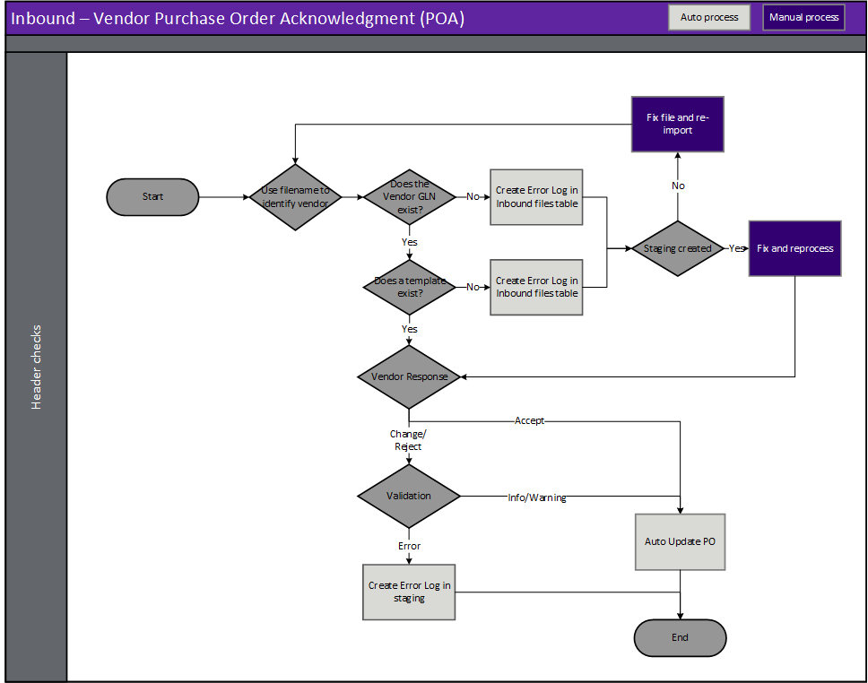
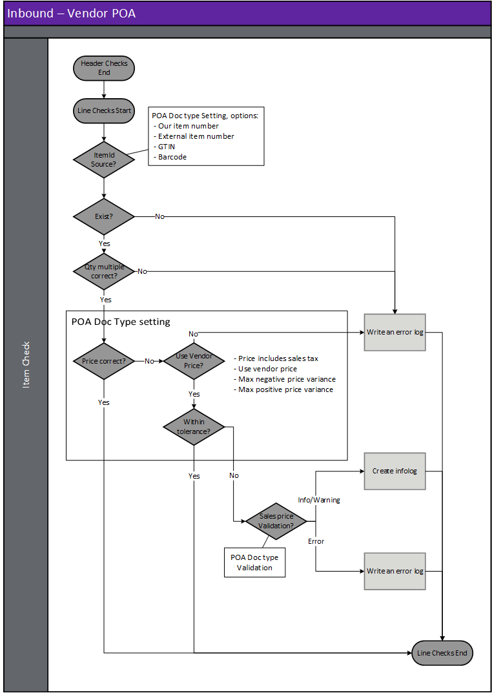

---
# required metadata

title: [EDI Vendor]
description: [EDI Vendor Documents - Vendor purchase order acknowledgement]
author: [jdutoit2]
manager: Kym Parker
ms.date: 12/11/2021
ms.topic: article
ms.prod: 
ms.service: dynamics-ax-applications
ms.technology: 

# optional metadata

# ms.search.form:  [Operations AOT form name to tie this topic to]
audience: [Application User]
# ms.devlang: 
ms.reviewer: [jdutoit2]
ms.search.scope: [Which Operations client to show this topic as help for, to be set by content strategist, see list here: https://microsoft.sharepoint.com/teams/DynDoc/_layouts/15/WopiFrame.aspx?sourcedoc={23419e1c-eb64-42e9-aa9b-79875b428718}&action=edit&wd=target%28Core%20Dynamics%20AX%20CP%20requirements%2Eone%7C4CC185C0%2DEFAA%2D42CD%2D94B9%2D8F2A45E7F61A%2FVersions%20list%20for%20docs%20topics%7CC14BE630%2D5151%2D49D6%2D8305%2D554B5084593C%2F%29]
# ms.tgt_pltfrm: 
# ms.custom: [used by loc for topics migrated from the wiki]
ms.search.region: [Global for most topics. Set Country/Region name for localizations]
# ms.search.industry: [leave blank for most, retail, public sector]
ms.author: [author's Microsoft alias]
ms.search.validFrom: [month/year of release that feature was introduced in, in format yyyy-mm-dd]
ms.dyn365.ops.version: [name of release that feature was introduced in, see list here: https://microsoft.sharepoint.com/teams/DynDoc/_layouts/15/WopiFrame.aspx?sourcedoc={23419e1c-eb64-42e9-aa9b-79875b428718}&action=edit&wd=target%28Core%20Dynamics%20AX%20CP%20requirements%2Eone%7C4CC185C0%2DEFAA%2D42CD%2D94B9%2D8F2A45E7F61A%2FVersions%20list%20for%20docs%20topics%7CC14BE630%2D5151%2D49D6%2D8305%2D554B5084593C%2F%29]
---

# Vendor purchase order acknowledgement

Companies may require a vendor to send a purchase order acknowledgement (POA) for an order and can be one of the reasons a purchase order status is 'In external review'.   Where the [Vendor purchase order document setting profile](../SETUP/SETTING%20PROFILES/Vendor%20purchase%20order.md) **Acknowledgement required** is set to _Yes_, the purchase order status will be set to **In external review** upon confirmation.

The following subsections will describe how to view, process the acknowledgement and send a Vendor purchase order confirmation (if required).  
The Acknowledgement can be viewed from the [Purchase order](#purchase-order) and confirmation values will be populated with default values per Trading partner. 
The Confirmation can be either [manually](#manually-processing-purchase-order-acknowledgement) processed or [automatically](#automatically-processing-purchase-order-acknowledgement).  
Viewing the [Staging table records](#view-staging-table-records) will also be discussed.
The received purchase order acknowledgement and sent confirmation record(s) can be viewed for a purchase order, by selecting the **History** button on the **EDI** tab on the Action Pane of the Purchase order page. 

## Prerequisites
The following setup is prerequisites for the vendor purchase order acknowledgement

1. Create [POA response code groups](../SETUP/VENDOR%20SETUP/POA%20response%20code%20group.md) to map the vendor's values to EDI POA responses code groups.
1. Create [Template](../../CORE/Setup/DocumentTypes/File%20templates.md) for the document.
1. Create [Setting profile](../SETUP/SETTING%20PROFILES/Vendor%20purchase%20order%20acknowledgement.md) for the document.
1. Create [Validation profile](../SETUP/VALIDATION%20PROFILES/Vendor%20purchase%20order%20acknowledgement.md) for the document.
1. If the vendor [trading partner](../SETUP/Trading%20partner.md) doesn't exist, create the new trading partner.
1. Assign the applicable POA response code group to the vendor trading partner.
1. Add and enable the vendor purchase order acknowledgement document to the [Vendor trading partner](../SETUP/Trading%20partner.md) and select the applicable:
    - Template
    - Setting profile
    - Validation profile
    - Search mask

## Processing
Inbound files have the following three steps:
1. **Import** - Imported file can be viewed in **EDI > Files > Inbound files**
2. **Import to staging** - Imported file is processed to staging record/s. The staging record/s can be viewed at **EDI > Documents > Vendor documents > Vendor purchase order acknowledgement**
3. **Staging to target** - The staging record/s is processed to target. If the acknowledgement is succefully processed the corresponding D365 purchase can be updated as per the received vendor values

### Create document

### Header checks for Vendor purchase order acknowledgement
Header checks are performed when:
1. Importing Vendor purchase order acknowledgement file
2. Processing from import to staging
3. Processing from staging to target

## Step 1 - Import
When a purchase order file is imported, the file name is key to identifying the vendor and therefore the document template. See [Trading partners](../../CORE/Setup/Trading%20partners.md) for further details.  It is based on this document template that the data within the file is identified and a record created in the EDI staging table in the next step.

> Note: The file mask is used to identify the trading partner and therefore template

## Step 2 - Import to staging - Inbound file validation
When the purchase order acknowledgement file is retrieved and imported, there are various validations that are completed before the staging record is created in the EDI staging table.
If the processing of **Import to staging** errors, the Inbound file's **Status** will be set to _Error_ and no staging record created.

**Rule Id**         |	**Details**         
:--                 |:--                  
**Check Template**  |	Identify a template for the Vendor/Document type. This will be used to identify the whereabouts of data within the file

#### Possible issues and fixes
**Import to staging** errors for Vendor purchase order acknowledgements can be viewed in:
- **EDI > Files > Inbound files** filtered to **Status** set to _Error_
- **EDI > Document maintenance**, tab **Vendor documents**, tile **File import errors**

At this step the issues are usually around the file not matching the template.
- Does the file have the correct template assigned (General tab, field **Template**):
  - **No**: Use **Reset template** to assign a different template. If this should apply to future documents for the Trading partner, also update in **Trading partners**.
  - **Yes**: Review **Log** and fix the applicable template in **EDI > Setup > Document types**. Examples issues are date format, new field.

Example error for file not matching template: 'Segment '<xml' not found in EDI template mapping'

## Step 3 - Staging to target
If the processing of **Staging to target** errors, the staging record's **Staging to target status** will be set to _Error_ and the acknowledgement won't be created on the target D365 purchase order.

#### Possible issues and fixes
**Staging to target** errors for Vendor purchase order acknowledgements can be viewed in:
- **EDI > Documents > Vendor documents > Vendor purchase order acknowledgement** filtered to **Staging to target tatus** set to _Error_
- **EDI > Document maintenance**, tab **Vendor documents**, tile **Purchase order acknowledgement errors**
- **EDI > Document maintenance**, tab **Vendor documents**, **Documents** page, tab **POA**

At this step the issues are usually around mapping/business logic issues.
Review the **Log** or **Version log** for the applicable record to find the issue. Example errors and method to fix are discussed in below table.

> Note: When the Version log displays an **Error type** of _Processing error_, the processing has stopped because of a standard D365 error and the **Message** will display the standard D365 error.  
> Note: Similar to manually processing a D365 transaction, EDI will stop at the first processing error and only this error is displayed. Fixing the error and reprocessing might result in subsequent standard processing errors which need to be dealt with.

#### Example header errors:
**Error message**       | **Error type**         | **Method to fix**
:---------------------- |:----                   |:----
XXXXXXXXXXXXXXXXXXXXXXXXXXXXXXXXXXXXXX

### Staging line validation - Purchase order acknowledgement

**Rule Id**                 | **Details**                                               | Error    
:---                        |:---                                                       |:---              
**PO line number**          | Find the D365 purchase order line number to which the POA line belongs    | Error at Staging table.   No target POA created
**No Valid Item**           | No valid item based on the different options available    | Error at Staging table.   No target POA created

#### Possible issues and fixes
**Staging to target** errors for Customer purchase order can be viewed in:
- **EDI > Documents > Customer purchase order** filtered to **Staging to target tatus** set to _Error_
- **EDI > Document maintenance**, tab **Customer documents**, tile **Purchase order errors**
- **EDI > Document maintenance**, tab **Customer documents**, **Documents** page, tab **PO**

At this step the issues are usually around setup/business logic issues.
Review the **Log** or **Version log** for the applicable record to find the issue. Example errors and method to fix are discussed in below table.

#### Example line errors:
**Error message**                     | **Error type**         | **Method to fix**
:------------------------------------ |:----                   |:----
Item not found: %	                  | Item not found         | **EDI > Documents > Customer documents > Customer purchase order** and/or   **Product information management > Products > Released products**   Dependening on **Item Id source** assigned to Trading partner’s Document's   [**Setting profile**](../SETUP/SETTING%20PROFILES/Customer%20purchase%20order.md), EDI couldn’t find the staging record's Item Id / Barcode.   Either fix staging or setup on the Item.

### Sales order header checks

**Rule Id**             | **Details**
:---                    |:---
**Deadline date**       | A check of this date against the standard rules is required. (i.e. Dates are not historical)

### Staging line validation - Release order
An EDI sales order and release order will usually be separated per Distribution Centre (DC) with a breakdown per store.  If it is received per DC, one sales order will be created with each sales order line having a ‘store code’ which is used to identify the final delivery destination. 

#### Settings
Settings profiles can be specified and linked to the template which is used to determine how D365 will react.  Options are:

**Setting**                                 | **Details**
:---                                        |:---
Create release order without blanket order	| The action taken when a release order is received without a D365 blanket order

### Sales order line checks

**Rule Id**                                 | **Details**
:---                                        |:---
**Unit of measurement**                     | It should first check that this unit of measurement actually exists, a second check should be the measurement on the inventory table module for sales. If the Customer has a **UOM** mapping assigned, this will also be used to map their value to D365 value.
**Unit price**                              | The unit price should be checked using the standard D365 pricing rules.  If the prices are slightly different it should check both the **Maximum positive and negative tolerance** and **Use customer price** flag on document's setting before giving an error/warning. Example:   Item X trade agreement price 10.25   Item Y trade agreement price 8.88   Customer has a min and max tolerance setting of 0.05   Customer does not have their trade agreements entered including tax   Customer sends their EDI orders including tax   The setting use customer pricing is given   Item X EDI file price (before converting) 11.26 (after conversion) 10.24   Item Y EDI file price (before converting) 9.70 (after conversion) 8.82   Template setting against this field is warning.   A warning is only given for Item Y because it is outside of the tolerance. 
**Check multiple**                          | The quantity should be devisable by the multiple specified on the customer multiple table, if there isn’t one then it check the sales multiple on the item table.  

## View staging table records
To view the Customer purchase order's staging records, go to **EDI > Documents > Customer documents > Customer purchase order**. 
Use this page to review staging and process EDI Customer purchase order documents and convert into D365 Sales order, Sales agreement or Release order.

### List page
The following EDI fields are available on the list page.

**Field**               | **Description**
:---                    |:---
**EDI number**          |	EDI Staging table record id. Select **EDI number** or the **Details** button on the Action Pane, to view the details for the selected record. The number sequence is determined by [EDI number](../../CORE/Setup/EDI%20parameters.md#number-sequence) on the **EDI parameters**.
**Company account**     | Legal entity of the document.
**Company GLN**         | The company’s global location number is shown here.
**Staging to target status**    | The current status of the staging record. Options include:   • **Not Started** – The staging record has been successfully processed from the inbound file to the staging table but not processed to target.   • **Error** – The staging record has been processed from the staging table but no target has yet been created/updated.  There are errors with the staging record that needs to be reviewed.   • **Completed** – The staging record has been succesfully processed and created a D365 Sales order, Sales agreement or Release order. • **Canceled** – The record has been manually canceled and will be excluded from processing.
**Trading partner account**     | Customer account assigned to the staging record.
**Trading partner GLN**         | The Customer’s global location number is shown here.
**Customer Requisition**        | Customer's purchase order number to be populated in the Customer requisition field of the D365 Sales order header.
**Purchase order date**         | The purchase order date from the EDI record is shown here.
**EDI order type**              | The EDI order type is shown here.
**EDI order purpose**           | The EDI order purpose is shown here. Receiving an Order purpose **Change** will error the staging record, since these should be sent as **Customer purchase order change** document. Only **Original**, **Confirmation** and **Cancellation** order purposes are allowed for **Customer purchase order** document.
**Store code**                  | The store code from the EDI record is shown here.
**Store zone**                  | The store zone from the EDI record is shown here.
**Created Date and Time**       | The date and time the selected record was created in the staging table.
**Sent**                        | Indicates if the **Functional acknowledgement outbound** has been sent to the trading partner for the inbound document record.

### Buttons
The following buttons are available on the **Customer purchase order** Action Pane, tab **Purchase order import**.

**Button**	                    | **Description**
:---                            |:----
**Process selected purchase orders** | Create D365 Sales order, Sales agreement or Release order for the selected record in the staging table.
**Process all purchase order**	| Create all D365 Sales order, Sales agreement or Release order for the staging records that have a **Staging to target status** set to _Not started_. 
**Inbound files**               | View the inbound file record the selected staging record.
**Trading partner**             | View the trading partner details in the [**Trading partners**](../SETUP/Trading%20partner.md) page.
**Sales Order**	                | If the staging record has been completed it is possible to inquire on the **Sales order** or **Release order** it created from this button.
**Sales agreement**             | If the EDI blanket order staging record has been completed it is possible to inquire on the **Sales agreement** it created from this button.
**Customers**                   | Inquire on the Customer for the selected record.
**Show log**                    | If there are Errors within the document, it is possible to review them at any time using this button. Shows only the current version.
**Version log**                 | View all log versions. When a document’s status is reset and reprocessed, a new log version is created. Can view all log versions.
**Reset Status**                | You can reset the **Staging to target status** to _Not started_. This can be used to reprocess the selected record/s. Documents can only be processed if **Staging to target status** is set to _Not started_.
**Edit reset status recurrence**    | If the underlying issue was resolved after all the reset attempts have been completed the user can use this button to edit the recurrence field/s. This will:   • Update **Reset status profile** to _blank_   • Update the **Reset status date/time** to next time reset will run   • **Reset status attempts** set to _Zero_ and   • **Recurrence** text updated with changed recurrence details
**Cancel**                      | Select **Cancel** to update the **Staging to target status** to _Canceled_. Button is enabled when the **Staging to target status** is not set to _Completed_.

The following buttons are available on the **Customer purchase order**'s Action Pane, tab **Acknowledgement**.
The **Acknowledgement** tab is available on all incoming documents staging pages and enables the user to process or view the **Functional acknowledgement outbound** that has been created for the inbound document.

**Button**	                    | **Description**
:---                            |:----
**Send to EDI**                 | If the **Sent** field for the staging record is set to _No_, use this button to create the **Functional acknowledgement outbound** record and also update the **Sent** field to _Yes._
**Reset flag**                  | If the **Sent** field for the staging record has been set to _Yes_, use this button to reset **Sent** to _No_.
**Functional acknowledgement**  | Use this button to view the **Functional acknowledgement outbound** record created for the inbound document.

### Header fields
The following EDI Header staging fields are available on the header page.

**Field**	            | **Description**	                                    | **Target D365 field**
:---                    |:---                                                   |:---
<ins>**Identification**</ins>		
**EDI number**          | EDI Staging table record id                           | Sales Order > EDI > Original EDI number
**Company account**     | Legal entity of the document
**Company GLN**         | The company’s global location number is shown here.   | Sales order > EDI > Company GLN   If the **Company GLN** staging field is blank, the Company GLN on the Trading partner will be used to populate the **Company GLN** on the Sales order header.
**Staging to target status**    |  The current status of the staging record. Options include:   • **Not Started** – The staging record has been successfully processed from the inbound file to the staging table but not processed to target.   • **Error** – The staging record has been processed from the staging table but no target has yet been created/updated.  There are errors with the staging record that needs to be reviewed.   • **Completed** – The staging record has been succesfully processed and created a D365 Sales order, Sales agreement or Release order. • **Canceled** – The record has been manually canceled and will be excluded from processing.
<ins>**Reset status**</ins>		
**Reset status profile**    | Reset status profile assigned to the file/document. This will default from EDI shared parameters or can be overridden on Trading partner’s incoming and outgoing documents. The profile can also be changed to another profile which will also reset the **Reset status attempts** to 0 and reset the **Reset status date/time**	
**Reset status date/time**  | Next date/time automatic reset status will run	
**Reset status attempts**   | Number of reset attempts already processed. The reset attempts will stop once this number reaches the **End after** as per assigned **Reset status profile**’s Recurrence	
**Recurrence**              | Recurrence text. Contains standard details of Recurrence, for example:   •	Interval (recurrence pattern)   • How many times the period will run (End after)   • From date/time the recurrence will start	
<ins>**Overview**</ins>	
**Customer Requisition**    | Customers purchase order number to be populated in the Customer requisition field of the sales order header.	| Sales order > General > Customer requisition
**Purchase order date**     | The purchase order date from the EDI record is shown here.    | Sales Order > EDI > Original order date
**EDI order type**          | The EDI order type is shown here.	                            | Sales Order > EDI > EDI order type
**EDI order purpose**       | The EDI order purpose is shown here. Receiving an Order purpose **Change** will error the staging record, since these should be sent as **Customer purchase order change** document. Only **Original**, **Confirmation** and **Cancellation** order purposes are allowed for **Customer purchase order** document.	
**Store code**              | The store code from the EDI record is shown here.	            | Sales Order > EDI > Store code.   And used to populate Sales order delivery address
**Store zone**              | The store zone from the EDI PO is shown here.	                | Sales Order > EDI > Store zone
<ins>**General**</ins>	
**Customer Requisition**    | Customers purchase order number to be populated in the Customer requisition field of the sales order header.	| Sales order > General > Customer requisition
**Customer Reference**      | Customers purchase order reference to be populated in the Customer Reference field of the sales order header.	| Sales Order > General > Customer reference
**Purchase order date**     | The purchase order date from the EDI record is shown here.    | Sales Order > EDI > Original order date
**Currency**                | The currency of the order	                                    | Sales Order > Price and discount > Currency
**Company GLN**             | The company’s global location number is shown here. 	        | Sales order > EDI > Company GLN   If the **Company GLN** staging field is blank, the Company GLN on the Trading partner will be used to populate the **Company GLN** on the Sales order header.
**Customer GLN**            | The Customer’s global location number is shown here.  | Sales order > EDI > Customer GLN   If the **Trading partner GLN** staging field is blank, the Trading partner GLN on the Trading partner will be used to populate the **Customer GLN** on the Sales order header.
**Buyer code**              | The customer’s buyer code from the EDI record is shown here.	| Sales Order > EDI > Buyer code
**Retail buyer location**   | The customer’s retail buyer location from the EDI record is shown here.	| Sales Order > EDI > Retail buyer location code
**Purpose code**            | The customer’s purpose code from the EDI record is shown here.	        | Sales Order > EDI > Purpose code
**Department**              | The customer’s department from the EDI PO is shown here.	                | Sales Order > EDI > Department
**Package characteristic code** | The code used to for the package contents.	                        | Sales Order > EDI > Package characteristic code
**Package label code**      | The code used for the label.	                                            | Sales Order > EDI > Package label code
**Advertisement date**	    | The advertisement date applicable for the order	                        | Sales Order > EDI > Advertisement date
**Template Id**             | The EDI templates used to create the staging table record	                
**PO version number**       | The PO version number from the EDI record.	                                | Sales Order > EDI > Original version number
<ins>**Delivery**</ins>	
**Delivery Name**           | Address for Delivery	                                                    | Sales Order > Delivery Address. If the store code wasn't used to populate sales order address.
**Store zone**              | The store zone from the EDI record is shown here.	                        | Sales Order > EDI > Store zone
**Store code**              | The store code from the EDI record is shown here.	                        | Sales Order > EDI > Store code
**Name or description**   **Street number**   **Street**   **City**   **Suburb**   **State**   **Postcode**   **Country/region** |Address for delivery	 | Sales Order > Delivery Address   Store code populate in staging record:   •	**Y** – Determines Delivery address   •	**N** – EDI delivery address
**Requested ship date**     | The requested ship date (delivery window) from the EDI record is shown here.	| Sales Order > EDI > Requested ship date and   Sales order > Requested ship date: If staging blank will be populated by Transport days
**Requested receipt date**  | The requested receipt date (delivery window) from the EDI record is shown here.	| Sales Order > EDI > Requested receipt date   Sales order > Requested receipt date
**Delivery time**           | The delivery time from the EDI record is shown here.                      | Sales Order > EDI > Delivery time

### Line fields
The following EDI Line fields are available on the lines page.

**Field**                   | **Description**                                                           | **Target D365 field**
:---                        |:---                                                                       |:---
**Line number**             | The line within the EDI table/file	                                    | Sales Line > EDI > General > Line number
**Item number**             | The item identifier as sent by the trading partner. 	| Sales line > EDI > General > EDI Item number   When document type setting **Item Id source** is:   • **Our item number** or   • **External item number**   used to determine: Sales line > Item number
**Bar code**                | The item identifier as sent by the trading partner. 	| When document type setting **Item Id source** is:   • **GTIN** or   • **Barcode**   used to determine: Sales line > Item number
**SKU**                     | SKU for item	
**Unit Price**              | Customer unit price inclusive of discounts (net price)	                | Sales line > Unit price   If document setting **Use customer price** is set to _Yes_
**Customer sales quantity** | The customer order quantity for this line.	                            | Sales line > EDI > POA response > Customer > Quantity
**Unit**                    | The customer unit of measure for this line.
**Line amount excluding tax**   | The total line amount excluding tax.	                                | Sales line > Unit price   If document setting's **Use customer price** is set to _Yes_ AND   Staging **Unit price** is blank AND   document setting's **Prices include GST** is set to _No_:   Sales line **Unit price** is calculated by **Line amount excluding tax** / **Customer sales quantity**
**Line amount including tax**   | The total line amount including tax (if provided else 0)	            | Sales line > Unit price   If document setting's **Use customer price** is set to _Yes_ AND   Staging **Unit price** is blank AND   Document setting's **Prices include GST** is set to _Yes_:   Sales line unit price is calculated by **Line amount including tax** / **Customer sales quantity**
**Customer inners**         | The customer’s inners per outer quantity	                                | Sales line > EDI > POA response > Customer > Inner
**Customer pack**           | The customer’s pack quantity	                                            | Sales line > EDI > POA response > Customer > Pack
**Configuration**   **Colour**    **Size**   **Style**  | Inventory dimension - Configuration   Inventory dimension - Colour   Inventory dimension - Size   Inventory dimension - Style   | Sales line > Inventory dimension   If Item id Source <> Our item number and the External item number/ GTIN/Barcode is unique per variant, the customer doesn’t have to provide Variant details and EDI will find and populate the inventory dimensions on the sales line.
**Site**                    | Storage dimension - Site	                                                | Sales line > Site   If staging blank will be populated by Sales order Header. If the customer has no default to populate the Sales order Header, the default site/warehouse on the item’s sales order default order settings will be used.
**Warehouse**               | Storage dimension - Warehouse	                                            | Sales line > Warehouse   If staging blank will be populated by Sales order Header. If the customer has no default to populate the Sales order Header, the default site/warehouse on the item’s sales order default order settings will be used.
**Store code**              | The store code from the EDI saging line is shown here.	                | Sales line > EDI > General > Store code   EDI supports different store codes on line level
**Delivery name**           | Address for Delivery – Delivery name	
**Requested ship date**     | The requested ship date (delivery window) from the EDI line record is shown here.	| Sales line > Delivery > Requested ship date   If staging blank will be populated by Sales order Header
**Requested receipt date**  | The requested receipt date (delivery window) from the EDI line record is shown here.	| Sales line > Delivery > Requested receipt date   If staging blank will be populated by Sales order Header

## Purchase order
Users can access **All purchase orders** page by navigating to **Sales and marketing > Orders > All sales orders** and manage the EDI order's Acknowledgement's details by using the below buttons that have been added to the **EDI** tab on the Action Pane.

Field	                  | Description
:--                     |:--
**Acknowledgement**     |	Select the **Acknowledgement** button to review order details for the POA. The details of this page will be discussed in below.
**Send to EDI**         |	Select the **Send to EDI** button to create the **Customer purchase order acknowledgement** staging table record.
**Reset flag**          |	Select the **Reset flag** button to reset the **EDI status** to allow for re-sending of the POA to the staging table. Note: The POA record on the staging table should be deleted manually before the sales order flag is reset.

## Processing
The POA can be sent [manually](#manually-processing-purchase-order-acknowledgement) or [automatically](#automatically-processing-purchase-order-acknowledgement) to the customer.
Both of these options will be discussed in the following subsections.

### Manually processing Purchase order acknowledgement
The **Acknowledgement** page is accessed by navigating to **Sales and marketing > Orders > All sales orders**, and selecting **Acknowledgement** on the **EDI** tab on the Action Pane.

The Acknowledgement page is split into five tabs:
1. [Header](#header) - Manage the POA header's response for ship and receipt dates. 
3. [Line price](#line-price) - Manage the POA line' price response, example Customer's sales price vs. Net system price. 
4. [Line quantity](#line-quantity) - Manage the POA line' quantity response, example Customer sales quantity vs. Reserved sales quantity.
5. [Line pack](#line-pack) - Manage the POA line' pack response, example Customer pack vs. System pack
6. [Line inner](#line-inner) - Manage the POA line' inner response, example Customer inner vs. System inner

Customer mapped values for POA response codes are setup in [POA response code group](../SETUP/CUSTOMER%20SETUP/POA%20response%20code%20group.md) and assigned to the Customer trading partner's **POA response code group**.

#### Header
The following tables describe the fields and buttons that are available on the **Header** tab of the Acknowledgement page.  
The **Header** POA response codes are managed on this tab.

##### Fields
Field	              | Description
:--                 |:--
<ins>**Delivery Date**</ins>
**Customer**        |	Customer requested ship date (start of delivery window)
**Acknowledged**    |	Acknowledged receipt date. Updates Sales order header's **Confirmed ship date**.
<ins>**Deadline**</ins>
**Customer**        |	Customer requested receipt date (end of delivery window)
**Acknowledged**    |	Acknowledged delivery date to be sent to the customer. Updates Sales order header's **Confirmed receipt date**.
<ins>**POA**</ins>
**POA code**        |	POA header code to be sent to the customer. Displays the mapped value as setup in [POA response code group](../SETUP/CUSTOMER%20SETUP/POA%20response%20code%20group.md) for the following header responses:   •	**Header – accept** – Where all response codes are _Accept_   •	**Header - change** - Where the customer and acknowledged dates are different   •	**Header - accepted with reserved** - Where the customer and acknowledged dates are the same, however one or more lines have an _Advise_ POA difference code.
**Auto triggered**  |	Indicates if the **POA code** is an auto triggered value.

##### Buttons
It is possible to update the POA response codes by using the available buttons:
Button              | Description
:--                 |:--
**Order POA**       |	Automatically set the response codes.   Note: When selected the response codes for all the tabs will be set.  Where auto generated codes are overwritten, the header code should be manually set.
**POA response**    |	Manually set the **POA code** response to mapped values of    • **Change**   • **Accepted**   • **Not accepted** - only available for manual selection   • **Accepted with reserve**   If the auto triggered POA code has been manually overridden using this button, the field **Auto triggered** will be set to _No_.

#### Line price
The following tables describe the fields and buttons that are available on the **Line price** tab of the Acknowledgement page.  
The **Line price** POA response codes are managed on this tab.

##### Fields
Field	                    | Description
:--                       |:--
**Log**                   |	This will show a warning if the Customer pack does not match the System pack
**Store code**            |	Sales line's store code
**Item number**           |	Item number from the sales order
**Barcode**               |	Barcode for the item number from the sales order
**Product name**          |	Item name for the item number from the sales order
**Unit**                  |	Unit from the sales line
**Customer sales price**  |	Unit price received in the EDI purchase order
**Net system price**      |	Valid trade agreement unit price for the customer, net off discounts
**Acknowledged price**    |	Acknowledged price to be sent to the customer. Note: The acknowledged price will be automatically set as either the customer or system values dependant on the **Use customer price** setting on the [Customer purchase order](../SETUP/SETTING%20PROFILES/Customer%20purchase%20order.md) document type setting profile.
**Price code**            | POA line price code to be sent to the customer. Displays the mapped value as setup in [POA response code group](../SETUP/CUSTOMER%20SETUP/POA%20response%20code%20group.md) for the following line price responses:   •	**Line price - accept** - Where the customer and acknowledged price are the same   • **Line price - advise** - Where the customer and acknowledged price are different
**Auto triggered item**   |	Indicates if the **Price code** is an auto triggered value
**PO change**             | Indicates if the price was updated by a **Customer purchase order change** record

##### Buttons
It is possible to update the Acknowledged values and POA response codes by using the available buttons for a particular or multiple lines:

Button              | Description
:--                 |:--
**Inventory**       |	Update the dimensions displayed on the POA acknowledgement form
**Item POA**        |	• **Use system price** - Update the acknowledged price field to the system price   • **Use customer price**	Update the acknowledged price field to the customer sales price   • **Clear response codes** - Clear previously set response codes   • **Auto set response codes** - Automatically set the response codes
**POA response**	  | Manually set the **Price code** response to mapped value for **Accept price** or **Advise price**

#### Line quantity
The following tables describe the fields and buttons that are available on the **Line quantity** tab of the Acknowledgement page.  
The **Line item** and **Line shipment** POA response codes are managed on this tab.

##### Fields
Field	                    | Description
:--                       |:--
**Store code**            |	Sales line's store code
**Item number**           |	Item number from the sales order
**Barcode**               |	Barcode for the item number from the sales order
**Product name**	        | Item name for the item number from the sales order
**Unit**                  |	Unit from the sales line
**Customer sales quantity** |	Quantity received in the purchase order
**Reserved sales quantity** |	Reserved quantity for each sales line. If reservation is set to manual, users have to reserve stock first if “Reserved qty” is to be used for POA since it updates the Sales order line as per POA's **Acknowledged quantity**. 
**Acknowledged quantity**   |	Acknowledged quantity to be sent to the customer. Note: The acknowledged quantity will be set as either the customer or reserved values dependant on the **Quantity type** set on the [Customer purchase order acknowledgement](../SETUP/SETTING%20PROFILES/Customer%20purchase%20order%20acknowledgement.md) document type setting profile.
**Qty code**                |	POA line quantity code to be sent to the customer. Displays the mapped value as setup in [POA response code group](../SETUP/CUSTOMER%20SETUP/POA%20response%20code%20group.md) for the following line quantity responses:   •	**Line item accept** - Where the customer and acknowledged quantities are the same   • **Line item - out of stock** - Where the customer and acknowledged quantities are different   • **Line item - withdrawn** - Only available for manual selection.
**Shipment code**           |	POA line shipment code to be sent to the customer. Displays the mapped value as setup in [POA response code group](../SETUP/CUSTOMER%20SETUP/POA%20response%20code%20group.md) for the following line shipment responses:   • **Line shipment - full** - Where line item POA response is accept or where line item is out of inventory and the Trading partner setting **No backorder** is set to _Yes._   • **Line shipment - partial** - Where line item POA response is out of inventory and the and the Trading partner setting **No backorder** is set to _No_.
**Auto triggered item**     |	Indicates if the **Qty code** is an auto triggered value
**Auto triggered shipment** |	Indicates if the **Shipment code** is an auto triggered value

##### Buttons
It is possible to update the Acknowledged values and POA response codes by using the available buttons for a particular or multiple lines:

Button              | Description
:--                 |:--
**Inventory**       |	Update the dimensions displayed on the POA acknowledgement form
**Item POA**        | • **Use customer quantity** -	Update the acknowledged quantity field to the customer quantity   • **Use reserved quantity** - Update the acknowledged quantity field to the reserved quantity   • **Clear quantity** -	Clear previously set acknowledged quantity   • **Clear response codes** -	Clear previously set response codes   • **Auto set response codes** - Automatically set the response codes
**POA response**   |	Manually set the mapped value for:   • **Qty code** response to: **Accept item**, **Article withdrawn** (only manual) or **Out of inventory**   • **Shipment code** response to: **Complete shipment** or **Part shipment**

#### Line pack
The following tables describe the fields and buttons that are available on the **Line pack** tab of the Acknowledgement page.  
The **Line item - pack** POA response codes are managed on this tab.

##### Fields
Field	                    | Description
:--                       |:--
**Log**                   |	This will show a warning if the Customer pack does not match the System pack
**Store code**            |	Sales line's store code
**Item number**           |	Item number from the sales order
**Barcode**               |	Barcode for the item number from the sales order
**Product name**          |	Item name for the item number from the sales order
**Unit**                  |	Unit from the sales line
**Customer pack**         |	Pack quantity received in the purchase order
**System pack**           |	Valid system pack for the inner or outer as specified on **Package size - inner/outer** on the settings profile for the Customer purchase order acknowledgement
**Acknowledged pack**     |	Acknowledged pack quantity to be sent to the customer. Note: The automatically acknowledged pack (Customer or System) is set on **Pack type** on the settings profile for the Customer purchase order acknowledgement.
**Pack code**             |	POA line pack code to be sent to the customer. Displays the mapped value as setup in [POA response code group](../SETUP/CUSTOMER%20SETUP/POA%20response%20code%20group.md) for the following line pack responses:   • **Line item - pack accept** - Where the customer and acknowledged packs are the same   • **Line item - pack difference** - Where the customer and acknowledged packs are different
**Auto triggered item**   |	Indicates if the **Pack code** is an auto triggered value

##### Buttons
It is possible to update the Acknowledged values and POA response codes by using the available buttons for a particular or multiple lines:

Button                      | Description
:--                         |:--
**Inventory**               |	Update the dimensions displayed on the POA acknowledgement form
**Item POA**                | • **Use system pack** - Update the acknowledged pack field to the system pack. Calculated by using unit conversion and rounding setup on the item.   • **Use customer pack** -	Update the acknowledged pack field to the customer pack   • **Clear response codes** - Clear previously set response codes   • **Auto set response codes** - Automatically set the response code
**POA Response**           |	Manually set the mapped value for **Pack code** response to **Pack accept** or **Pack difference**

#### Line inner
The following tables describe the fields and buttons that are available on the **Line inner** tab of the Acknowledgement page.  
The **Line item - inner** POA response codes are managed on this tab.

##### Fields
Field	                    | Description
:--                       |:--
**Log**                   |	This will show a warning if the Customer inner does not match the System inner
**Store code**            |	Sales line store code
**Item number**           |	Item number from the sales order
**Barcode**               |	Barcode for the item number from the sales order
**Product name**	        | Item name for the item number from the sales order
**Unit**                  |	Unit from the sales line
**Customer inners**       | Number of inners received in the purchase order
**System inners**         |	Valid system number of inners. Note: The number of inners is calculated based on the quantity within an outer and inner.
**Acknowledged inners**   |	Acknowledged number of inners. Note: The automatically acknowledged inner (Customer or System) is set on **Inner type** on the settings profile for the Customer purchase order acknowledgement.
**Inner code**            |	POA line inner code to be sent to the customer. Displays the mapped value as setup in [POA response code group](../SETUP/CUSTOMER%20SETUP/POA%20response%20code%20group.md) for the following line inner responses:   • **Line item - inner accept** - Where the customer and acknowledged inners are the same   • **Line item - inner difference** - Where the customer and acknowledged inners are different
**Auto triggered item**   |	Indicates if the **Inner code** is an auto triggered value

##### Buttons
It is possible to update the Acknowledged values and POA response codes by using the available buttons for a particular or multiple lines:

Button              | Description
:--                 |:--
**Inventory**               |	Update the dimensions displayed on the POA acknowledgement form
**Item POA**                | • **Use system inner** - Update the acknowledged inner field to the system inner   • **Use customer inner** -	Update the acknowledged inner field to the customer inner   • **Clear response codes** - Clear previously set response codes   • **Auto set response codes** - Automatically set the response code
**POA Response**           |	Manually set the mapped value for **Inner code** response to **Inner accept** or **Inner difference**

### Automatically processing Purchase order acknowledgement

Ability to automatically send customer purchase acknowledgements.
Users can access the periodic job by navigating to **EDI > Periodic tasks > Send customer purchase order acknowledgement**.

By default only sales orders that fall under the following criteria is included in POA being sent automatically:
- Sales orders that doesn’t contain any POA response codes where **Allow auto send** is set to _No_ on [POA response code group](../SETUP/CUSTOMER%20SETUP/POA%20response%20code%20group.md#setup-poa-responde-codes)
- Sales orders that are not on hold (excluding POA and POC pending hold codes)
- POA is pending (still required to be sent), which is determined by **POA status** is _Pending_ or _In progress_. A sales order's POA status is set to _Pending_ when the Purchase order acknowledgement setting **Lock order** is set to _Yes_. And changes to **In progress** when clicking on **Acknowledgement** page on the sales order header's EDI tab on the Action Pane and selecting _OK_. 

Additional sales order filter options are:
- Include blank confirmed receipt date – Y/N
- Include blank confirmed ship date – Y/N
- Customer account
- Invoice account
- Users can also add additional filters like site and warehouse 

## View staging table records
To view the Customer purchase order acknowledgement staging records, go to **EDI > Documents > Customer documents > Customer purchase order acknowledgement**. 
Use this page to review staging and process EDI Customer purchase order acknowledgements documents to an Outbound file.

### List page
The following EDI fields are available on the list page.

**Field**               | **Description**
:---                    |:---
**EDI number**          |	EDI Staging table record id. Select **EDI number** or the **Details** button on the Action Pane, to view the details for the selected record. The number sequence is determined by [EDI number](../../CORE/Setup/EDI%20parameters.md#number-sequence) on the **EDI parameters**.
**Company**             | Legal entity of the document.
**Company GLN**         | The company’s global location number is shown here.
**Staging to target status**    | The current status of the staging record. Options include:   • **Not Started** – The staging record has been created but no outbound file has yet been generated.   • **Error** – Th staging record has been processed, but no outbound file has been created.  There are errors with the staging record that needs to be reviewed.   • **Completed** – The staging record has been succesfully processed and added to the outbound file queue.
**Trading partner account**     | Customer account assigned to the staging record.
**Trading partner GLN**         | The Customer’s global location number is shown here.
**Customer Requisition**        | Customer purchase order's Customer requisition.
**Sales order**                 |	Sales order number for the staging record.
**Customer reference**          |	Customer purchase order's Customer reference.
**POA code**                    |	POA Header code group as mapped in [POA response code groups](../SETUP/CUSTOMER%20SETUP/POA%20response%20code%20group.md#setup-poa-responde-codes)
**Created Date and Time**       | The date and time the selected record was created in the staging table.
**Received**                    |	Indicates if the **Functional acknowledgement inbound** has been received from the trading partner for the outbound document record.

### Buttons
The following buttons are available on the **Customer purchase order acknowledgement** Action Pane, tab **Purchase order acknowledgement**.

**Button**	                    | **Description**
:---                            |:----
**Create selected files**       | Creates the outbound file for selected records where **Staging to target status** is set to _Not started_.
**Create files**	              | Creates the outbound file for all records where **Staging to target status** is set to _Not started_.
**Outbound files**              | View the outbound file record created by the selected staging record.
**Trading partner**             | View the trading partner details in the [**Trading partners**](../SETUP/Trading%20partner.md) page.
**Sales Order**	                | The sales order relating to the selected staging record.
**Show log**                    | If there are logs created within the **Process to outbound** step it is possible to review them at any time using this button. Shows only the current version.
**Reset Status**                | You can reset the the **Staging to target status** to _Not started_. This can be used to reprocess the selected record/s. Documents can only be processed if **Staging to target status** is set to _Not started_.
**Edit reset status recurrence**    | If the underlying issue was resolved after all the reset attempts have been completed the user can use this button to edit the recurrence field/s. This will:   • Update **Reset status profile** to _blank_   • Update the **Reset status date/time** to next time reset will run   • **Reset status attempts** set to _Zero_ and   • **Recurrence** text updated with changed recurrence details
**Reset template**	            | Reset the template used to create the outbound file.   Only enabled where the **Staging to target status** is set to _Not started_.

The following buttons are available on the **Customer purchase order acknowledgement**'s Action Pane, tab **Acknowledgement**.
The **Acknowledgement** tab is available on all outgoing documents staging pages and enables the user to view the **Functional acknowledgement inbound** that has been received and processed for the outbound document.

**Button**	                    | **Description**
:---                            |:----
**Acknowledgement**             | Use this button to view the **Functional acknowledgement inbound** record received and processed for the outbound document.

### Header fields
The following EDI Header staging fields are available on the header page.

**Field**	              | **Description**	                                      | **Source D365 field**
:---                    |:---                                                   |:---
<ins>**Identification FastTab**</ins>		
<ins>**Identification**</ins>		
**EDI number**          | EDI Staging table record id                           | Sales Order > EDI > Original EDI number
**Company**             | Legal entity of the document
**Company GLN**         | The company’s global location number is shown here    | Sales order > EDI > Company GLN
**Template Id**                 | The EDI template that will be used to create the outbound file    | Trading partner > Template assigned to document type	            
**Staging to target status**    |  The current status of the staging record. Options include:   • **Not Started** – The staging record has been created but no outbound file has yet been generated.   • **Error** – Th staging record has been processed, but no outbound file has been created.  There are errors with the staging record that needs to be reviewed.   • **Completed** – The staging record has been succesfully processed and added to the outbound file queue.	
<ins>**Reset status**</ins>		
**Reset status profile**    | Reset status profile assigned to the file/document. This will default from EDI shared parameters or can be overridden on Trading partner’s incoming and outgoing documents. The profile can also be changed to another profile which will also reset the **Reset status attempts** to 0 and reset the **Reset status date/time**	
**Reset status date/time**  | Next date/time automatic reset status will run	
**Reset status attempts**   | Number of reset attempts already processed. The reset attempts will stop once this number reaches the **End after** as per assigned **Reset status profile**’s Recurrence	
**Recurrence**              | Recurrence text. Contains standard details of Recurrence, for example:   •	Interval (recurrence pattern)   • How many times the period will run (End after)   • From date/time the recurrence will start	
<ins>**General**</ins>	
**Customer account**        |	Customer account for the staging record	           | Sales Order > Customer account
**Sales order**             |	Sales order number for the staging record          | Sales order > Sales order
**Customer requisition**    | Customers purchase order number to be populated in the Customer requisition field of the sales order header.	| Sales order > General > Customer requisition
**EDI order type**          | The EDI order type is shown here.	                            | Sales Order > EDI > EDI order type
<ins>**Status**</ins>	
**Group control number**    |	Group control number for the outbound document. To be used to match inbound functional acknowledgement, where applicable.
**Received**                |	Indicates if the **Functional acknowledgement inbound** has been received from the trading partner for the outbound document record.
<ins>**General FastTab**</ins>	
<ins>**POA**</ins>	
**POA code**                |	POA Header response codes	                                    | Sales order > Acknowledgement > POA code
<ins>**Status**</ins>		
**Staging to target status**    |  The current status of the staging record. Options include:   • **Not Started** – The staging record has been created but no outbound file has yet been generated.   • **Error** – Th staging record has been processed, but no outbound file has been created.  There are errors with the staging record that needs to be reviewed.   • **Completed** – The staging record has been succesfully processed and added to the outbound file queue.
**Created Date and Time**       | The date and time the selected record was created in the staging table.
<ins>**Other**</ins>	
**Purchase order date**     | The purchase order date from the EDI record is shown here.    | Sales Order > EDI > Original order date
**Package characteristic code** | The code used to for the package contents.	              | Sales Order > EDI > Package characteristic code
**Package label code**      | The code used for the label.	                                | Sales Order > EDI > Package label code
**Advertisement date**	    | The advertisement date applicable for the order	              | Sales Order > EDI > Advertisement date
**Department**              | The customer’s department from the EDI PO is shown here.	    | Sales Order > EDI > Department
**Store zone**              | The store zone from the EDI record is shown here.	            | Sales Order > EDI > Store zone
**Buyer code**              | The customer’s buyer code from the EDI record is shown here.	| Sales Order > EDI > Buyer code
**Retail buyer location**   | The customer’s retail buyer location from the EDI record is shown here.	| Sales Order > EDI > Retail buyer location code
**Purpose code**            | The customer’s purpose code from the EDI record is shown here.	        | Sales Order > EDI > Purpose code
**Our account number**      |	Our account number in the customers system                    | Customer > Account number
<ins>**Delivery address**</ins>
**Delivery name**           |	Address for Delivery	                                        | Sales Order > Delivery Address Information
**City**                    |	Delivery address - City	
**Country/region**          |	Delivery address - Country/region	
**ISO**                     |	Delivery address - Country/region ISO	
**County**                  |	Delivery address - County	
**District**                |	Delivery address - District	
**Post box**                |	Delivery address - Post box	
**State**                   |	Delivery address - State	
**Street**                  |	Delivery address - Street	
**Street number**           |	Delivery address - Street number	
**ZIP/postal code**         |	Delivery address - Zip/postal code	
**Building complement**     |	Delivery address - Building complement	
**Store code**              |	Delivery address - Store code	
<ins>**Version**</ins>
**PO version number**       | The PO version number from the EDI record.	                                | Sales Order > EDI > Original version number

### Line fields
The following EDI Line staging fields are available on the lines page.

**Field**	              | **Description**	                                      | **Source D365 field**
:---                    |:---                                                   |:---
**Store code**          |	The store code from the EDI order is shown here.	    | Sales line > EDI > Store code
**Item number**         |	Item number from the sales order	                    | Sales line > Item number
**Barcode**             |	Barcode for the item number from the sales order	    | Sales line > Barcode
**External item number**  |	The external item id specified for this customer/item combination. This is the part number for this item in the Customer’s system.	| Sales line> General > External references > External
**Style**               |	Inventory dimension - Style	                          | Sales line > Style
**Size**                |	Inventory dimension - Size	                          | Sales line > Size
**Colour**              |	Inventory dimension - Colour	                        | Sales line > Colour
**Configuration**       |	Inventory dimension - Configuration	                  | Sales line > Configuration
**POA code shipment**   |	Purchase order acknowledgement code for shipment of the item	| Sales line > EDI > POA response > Customer code > Shipment
**POA code item**       |	Purchase order acknowledgement code for the item   Combination of all line item POA codes.   Example: PO-IA-PD-LIA   PO: Line price - accept   IA: Line item - accept   PD: Line item - pack difference   LIA: Line item - inner accept	  Field delimiter: -   Note: Line item status is a combination of the following:   Price code + Qty code + Pack code + Inner Code. The Customer purchase order acknowledgement document setting **Field delimiter** (can also be blank) is used inbetween the POA codes.              | Sales line > EDI > POA response > Customer code > Price and Quantity
**Currency**            |	The currency of the order	                            | Sales order > Currency
**Unit price excl. tax**  |	The net price per unit excl. tax	                  | Sales line > Price excl. tax
**Unit price incl. tax**  |	The net price per unit incl. tax	                  | Sales line > Price incl. tax
**Line amount excl. tax** |	Line amount excl. tax	                              | Sales line amount > Price excl. tax
**Line amount incl. tax** |	Line amount incl. tax	                              | Sales line amount > Price incl. tax
**Unit**                  |	This is the Unit of measure that the stock has been ordered in    | Sales line > Unit
**Sales quantity**        |	The acknowledged quantity for this line             | Sales line > Quantity
**Acknowledgement inners**  |	Acknowledged quantity of inners per outer	        | Sales line > EDI > POA > Acknowledgement inners
**Acknowledgement pack**    |	Pack quantity acknowledged	                      | Sales line > EDI > POA > Acknowledgement pack
