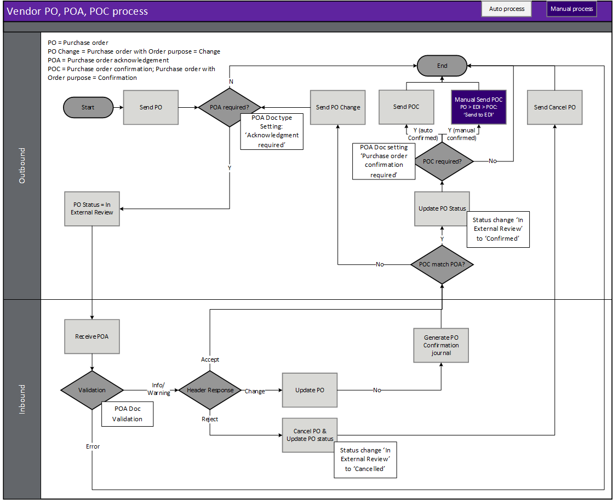

---
# required metadata

title: [EDI Vendor]
description: [Overview of the Vendor EDI module process]
author: [jdutoit2]
manager: Kym Parker
ms.date: 10/11/2021
ms.topic: article
ms.prod: 
ms.service: dynamics-ax-applications
ms.technology: 

# optional metadata

# ms.search.form:  [Operations AOT form name to tie this topic to]
audience: [Application User]
# ms.devlang: 
ms.reviewer: [jdutoit2]
ms.search.scope: [Which Operations client to show this topic as help for, to be set by content strategist, see list here: https://microsoft.sharepoint.com/teams/DynDoc/_layouts/15/WopiFrame.aspx?sourcedoc={23419e1c-eb64-42e9-aa9b-79875b428718}&action=edit&wd=target%28Core%20Dynamics%20AX%20CP%20requirements%2Eone%7C4CC185C0%2DEFAA%2D42CD%2D94B9%2D8F2A45E7F61A%2FVersions%20list%20for%20docs%20topics%7CC14BE630%2D5151%2D49D6%2D8305%2D554B5084593C%2F%29]
# ms.tgt_pltfrm: 
# ms.custom: [used by loc for topics migrated from the wiki]
ms.search.region: [Global for most topics. Set Country/Region name for localizations]
# ms.search.industry: [leave blank for most, retail, public sector]
ms.author: [author's Microsoft alias]
ms.search.validFrom: [month/year of release that feature was introduced in, in format yyyy-mm-dd]
ms.dyn365.ops.version: [name of release that feature was introduced in, see list here: https://microsoft.sharepoint.com/teams/DynDoc/_layouts/15/WopiFrame.aspx?sourcedoc={23419e1c-eb64-42e9-aa9b-79875b428718}&action=edit&wd=target%28Core%20Dynamics%20AX%20CP%20requirements%2Eone%7C4CC185C0%2DEFAA%2D42CD%2D94B9%2D8F2A45E7F61A%2FVersions%20list%20for%20docs%20topics%7CC14BE630%2D5151%2D49D6%2D8305%2D554B5084593C%2F%29]
---

# Process Overview

## Purchase order, acknowledgement and confirmation process overview
The following image displays the process of sending the purchase order (PO) to the EDI vendor, and if required, receiving a purchase order acknowledgement (POA) and sending a purchase order confirmation.  

### Purchase order (PO)
When an Vendor EDI Trading partner has **Vendor purchase order** or **Vendor purchase order change** document(s) enabled, confirming the purchase order will create an original or change (after original) outbound staging records to the vendor.

### Purchase order acknowledgement (POA)
PO setting **Acknowledgement required** determines if a POA is required which affects the Purchase order's **Status** and **Acknowledgement required**.
If a purchase order acknowledgement (POA) is received, the validation's error tolerance determines if the D365 purchase order is updated.
If any of the validations error, the staging record will error.
For info and warning validations, the staging record will process to target and update the D365 purchase order where applicable.
Where the POA contains a **Header - Accept** response, the rest of the POA details are ignored as all has been accepted.

### Purchase order confirmation (POC)
POA document setting **Purchase order confirmation required** determines if a purchase order confirmation (POC) is required after receiving a POA, and if it will be sent automatically or manually by user.

If the confirmation details doesn't match the POA, for example didn't accept the price change, a purchase order change with purpose **Change** will be created to the vendor.

If the confirmation details does match the POA, a purchase order change with purpose **Confirmation** will be created to the vendor.
When the purpose is **Confirmation**, the following purchase order header fields are updated:
- **Status** will change to _Confirmed_ (if previously set to _In external review)_ and 
- **Acknowledgement required** will change to _Confirmation sent_

## Advanced shipping notice (ASN) and Purchase invoice process overview

### Advanced shipping notice (ASN)
Based on [document settings](../SETUP/SETTING%20PROFILES/Vendor%20advanced%20shipping%20notice.md), the EDI ASN can either:
- Basic warehousing (Ship to warehouse is setup for basic warehousing):
    - Create arrival journal, but leave unposted
    - Create and post arrival journal
    - Create and post arrival journal, and post the product receipt for the registered stock
- Advanced warehousing (Ship to warehouse is setup for advanced warehousing):
    - Create an open load

### Purchase invoice
