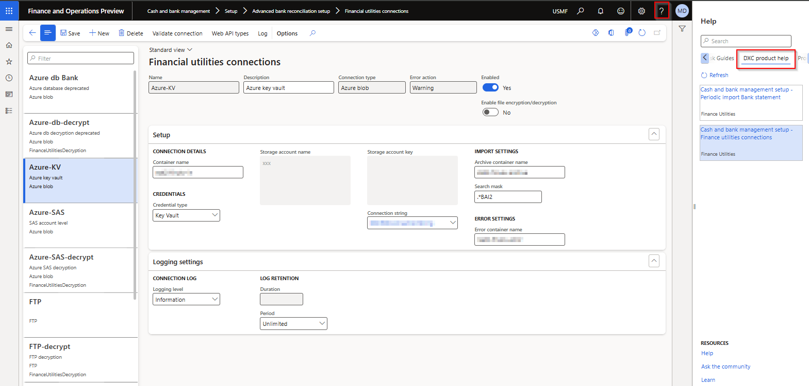

---
# required metadata

title: FAQ
description: IP support - Frequently asked questions 
author: Monica du Toit
manager: Pontus Ek
ms.date: 2025-01-16
ms.topic: article
ms.prod: 
ms.service: dynamics-ax-applications
ms.technology: 

# optional metadata

ms.search.form: DXCLicenseSupport
audience: Application User
# ms.devlang: 
ms.reviewer: Monica du Toit

# ms.tgt_pltfrm: 
# ms.custom: ["21901", "intro-internal"]
ms.search.region: Global
# ms.search.industry: [leave blank for most, retail, public sector]
ms.author: Monica du Toit
ms.search.validFrom: 2016-05-31
ms.dyn365.ops.version: AX 7.0.1
---

# 	Frequently Asked Questions

### Where can I find contact information for support?
   
Support contact details can be located on the **Contact** tab at **Organization admininstration > Workspaces > Product support**
  
### Where can I identify the installed version of the applicable module

On the Navigation bar, select **Help & support > About**.  
A list of installed models will be displayed on the **Version** tab.  Scroll to applicable product. The version information will be displayed on the right (example DXC Finance Utilities **10.0.40.202412041** (isv))

### Is my installed product version compatible with next D365 version

Check **Version compatibility** on the Product's **Release notes**

### How do I download the latest Product version

### Subscribe to notifications

New coming feature

### Help in D365 Finance and Operations

Access relevant GitHub user guide pages within D365 via **Help > DXC product help**  

### Dependency and Security Information

Can be found on each product's FAQ

# 	Troubleshooting

###   Product is installed but functionality not visible
If the product is available in About > Version, check if it has been enabled in **Feature management**.  
If you don't see the product, click **Check for updates** and **Enable** the feature.  

### Product specific troubleshooting

Can be found on the product's FAQ

