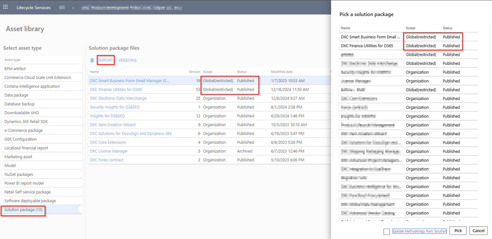

## End User License Agreement (EULA)

The End User License Agreement (EULA) can be found [here](https://dxc.com/au/en/practices/microsoft/end-user-license-agreement)

## Where can I find contact information for support?
   
Support contact details can be located on the **Contact** tab at **Organization admininstration > Workspaces > Product support**
  
## Where can I identify the installed version of the applicable module

On the Navigation bar, select **Help & Support > About**.  
A list of installed models will be displayed on the **Version** tab.  Scroll to applicable product. The version information will be displayed on the right (example DXC Finance Utilities **10.0.40.202412041** (isv))

## Is my installed product version compatible with next D365 version

Product's **Release notes**'s **Current version** section will specify what D365 version(s) are compatible with the latest release.

For more details on what versions were tested with each D365 Preview and if there were any issues, see **Version compatibility**.   
The matrix shows the minimum DXC build versions compatible for the Microsoft versions and builds.

> Note: Recommended to upgrade to latest Product version at time of D365 upgrade.

## How do I download the latest Product version

Our deployable packages are published on LCS.  
Please contact us to be added to the solution.

After you have been added to the solution please follow these steps in the LCS Project **Asset library**:

**Step 1** - Import solution (only required once)  
Select **Solution package**, click **Import**. Select licensed product and click **Pick**.  
Repeat for each licensed product.

Steps 2 and 3 are required with each upgrade:  
**Step 2** - Get latest version  
Select **Solution package**. Select the product and click **Versions**, select the latest version and click **Get version**.  
Repeat for each licensed product.

**Step 3** - Go to **Software deployable package**, select the solution (will have same version number) and click **Copy**.
This step will create the project scope that can be deployed to an environment.

## Installation process
To align with MS best practice and to protect our IP the following applies to the release process.
- The license models DXCLicense will only be released as binaries as part of a deployable package. 
- We will not provide test models for the products, neither as binary or source code. 
- We will only publish the release as a deployable package. 
- Model source code can be provided at our discretion. It can be requested for debugging upgrade errors, or if required for extensions.
	- If you have been given the source code to our model for extension or debugging purpose, never make modifications directly to our models! 
	- If you need an extension point, please send an email to ECLANZProductSupport@dxc.com and request it to be implemented. 

Depending on the installation history follow one of these guides to install the new release. 

### Installation without existing installed product
1. Apply the deployable package to your environment. 
2. If you have requested any model for extension or debugging purposes. Install the model source code. 
a.	Note, once the model source code is compiled it will overwrite the binaries installed when the deployable package was applied. 

### Installation with existing installed product
If you’re installing the new release in an installation that already has a previous version of the product installed and you’re not using it for debugging or extension. We recommend that you;  
1. Remove the release product model source code from your source control, if source control is used. 
2. Apply the deployable package, installing the latest version of the product models as binaries.  
3. Check in the binaries for the models to source control, if source control is used. 

If you’re using our model source code for extension or debugging and would like to continue using it, please do the following to apply the new release with the source code. 

1. Remove product license model from your source control that is applicable to the release. You’ll find the license model in the deployable package. It will either be called DXCLicense and Sable37License. 
2. Apply the deployable package to your environment to install the latest binaries. Check in the binaries for the license model that was removed in step 1 to source control. Note, this step will also install the binaries for all the models in the new release. 
3. Install the product release model source code and check into source control. 

If you don’t follow these instructions and continue building your installation deployable package using the license model source code, the installation will continue using the same license model as before applying the release. 

### Links
- From a technical perspective, to be performed in dev environments - [Manage third-party models and runtime packages by using source control](https://nam12.safelinks.protection.outlook.com/?url=https%3A%2F%2Flearn.microsoft.com%2Fen-us%2Fdynamics365%2Ffin-ops-core%2Fdev-itpro%2Fdev-tools%2Fmanage-runtime-packages&data=05%7C02%7Cjdutoit2%40dxc.com%7C577dd190757e4df6fbe508de5d4066c8%7C93f33571550f43cfb09fcd331338d086%7C0%7C0%7C639050728360713965%7CUnknown%7CTWFpbGZsb3d8eyJFbXB0eU1hcGkiOnRydWUsIlYiOiIwLjAuMDAwMCIsIlAiOiJXaW4zMiIsIkFOIjoiTWFpbCIsIldUIjoyfQ%3D%3D%7C0%7C%7C%7C&sdata=XcI7QK0%2FvazJlfgcfL2SaZhjtKoq77YtOBboBFWPgxM%3D&reserved=0)
- Creating deployable packages - [All-in-one deployable packages](https://nam12.safelinks.protection.outlook.com/?url=https%3A%2F%2Flearn.microsoft.com%2Fen-us%2Fdynamics365%2Ffin-ops-core%2Fdev-itpro%2Fdev-tools%2Faio-deployable-packages&data=05%7C02%7Cjdutoit2%40dxc.com%7C577dd190757e4df6fbe508de5d4066c8%7C93f33571550f43cfb09fcd331338d086%7C0%7C0%7C639050728360738467%7CUnknown%7CTWFpbGZsb3d8eyJFbXB0eU1hcGkiOnRydWUsIlYiOiIwLjAuMDAwMCIsIlAiOiJXaW4zMiIsIkFOIjoiTWFpbCIsIldUIjoyfQ%3D%3D%7C0%7C%7C%7C&sdata=X%2FyathQjLHy1VVjNwAdqZavox%2FdqYzdCIY5frxidsr4%3D&reserved=0)
- [Including ISV Binaries in Your Package](https://www.codecrib.com/2021/01/including-isv-binaries-in-your-package.html)
- [Install ISV package](https://community.dynamics.com/forums/thread/details/?threadid=a7eecaf4-d092-4eef-bd54-30f92b0a162f)

## Subscribe to notifications

New coming feature

## Dependency and Security Information

Can be found on each product's FAQ.

## 	Troubleshooting

###   Product is installed but functionality not visible
If the product is available in About > Version, check if it has been enabled in **Feature management**.  
If you don't see the product, click **Check for updates** and **Enable** the feature.  

### Product specific troubleshooting

Can be found on the product's FAQ
