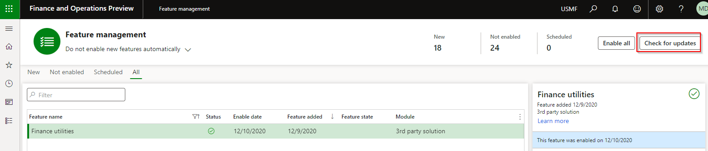

---
# required metadata

title: Finance Utilities 
description: Finance Utilities - Frequently asked questions 
author: Monica du Toit
manager: Kym Parker
ms.date: 2024-08-07
ms.topic: article
ms.prod: 
ms.service: dynamics-ax-applications
ms.technology: 

# optional metadata

# ms.search.form:  Finance Utilities 
audience: Application User
# ms.devlang: 
ms.reviewer: jdutoit2

# ms.tgt_pltfrm: 
# ms.custom: ["21901", "intro-internal"]
ms.search.region: Global
# ms.search.industry: [leave blank for most, retail, public sector]
ms.author: helenho
ms.search.validFrom: 2016-05-31
ms.dyn365.ops.version: AX 7.0.1
---

# 	Frequently Asked Questions

### Where can I find contact information for support?
   
Support contact details can be located on the **Contact** tab at **Organization admininstration > Workspaces > Product support**
  
### Where can I identify the installed version of the Finance utilities module

On the Navigation bar, select **Help & support > About**. <br>
A list of installed models will be displayed on the **Version** tab.  Scroll to **DXC Finance Utilities**. The version information will be displayed on the right (i.e. DXC Finance Utilities **10.0.240.2019443** (isv))

### Dependency and Security Information

Finance utilities and GER connections uses the following:
- Microsoft .NET Azure Storage library
- File transfer protocal library (FTP)
- SSH.NET library for SFTP support
- Encryption algorithms for secure file transfer
- Connection details for all connection types are managed by the customer

ABN lookup for AU registered companies
- Makes secure HTTPS connections for ABN lookup requests against the [Australia government web API](https://abr.business.gov.au/Tools/WebServices).
- Connection details are managed by the customer


# 	Troubleshooting

###   Product is installed but functionality not visible
If the product is available in About > Version, check if it has been enabled in **Feature management**. <br>
If you don't see **Finance utilities**, click **Check for updates**. <br>
**Enable** the feature. <br>



### 	Bank statement doesn’t import

#### Issue
Bank statement doesn't import. <br>
**Error:** An error occured when importing the bank statement file
 
#### Resolution
To check bank account mapping, navigate to Cash and bank management > Setup > Advanced bank reconciliation setup > Bank statement format
Things to check:
1.	**Field delimiter** and **Record code field position** (if applicable). Else the fields can't be extracted and matched.
2.	**Custom format > Lines: Bank account number**. Compare:
- Import file's bank account: Does it contain bsb+account or just account?
- Company bank accounts: Bank account number field only (not bsb): Does it match to import file's bank account number? If import file contains bsb+account and your bank setup is split into bsb and bank account number fields, set up appropriate start position on **Custom format > Lines**.

If mapping is correct, check if DXCEncryption has been installed.

### 	Generating AP payment - AuthenticationFailed
#### Error
AP > Payments > Vendor receipt journal
When Generating AP payment:
<br>
```
<Error>

<Code>AuthenticationFailed\</Code> <br>
<Message> <br>
Server failed to authenticate the request. Make sure the value of Authorization header is formed correctly including the signature. <br>
</Message> <br>
<AuthenticationErrorDetail> <br>
Signature did not match. String to sign used was <br>
</AuthenticationErrorDetail> <br>
</Error> 
```

#### Resolution
AP > Payment setup > Methods of payment <br>
If **Enable file parameters** is set to _Yes_ on your Method of Payment, the **File format** requires a value.

### 	Generating AP payment - Total line order
#### Error
Bank sends an error for the Vendor EFT payment for issues with the total debit or credit amounts.

#### Resolution
Cash and bank management > Bank statement reconciliation > Bank accounts <br>
Select the applicable bank account and select the applicable order in field **Total line order**. <br> 
Options are:
- Total net, total credit, total debit
- Total net, total debit, total credit
- Total credit, total debit, total net
- Total debit, total credit, total net

[User guide](Setup/ACCOUNTS-PAYABLE/Vendor-payments.md)

### 	Payment advice report – Vendor bank details missing
#### Issue
AP Payment advice doesn't show Vendor bank details:

#### Resolution
Select the Finance utilities report on [Payment advice](Setup/ACCOUNTS-PAYABLE/Vendor-payments.md#payment-advice-report) report's Print management.

### 	Saving to secure location

If there is an error saving the file to secure location and **Stop processing on failure** was enabled on **Electronic reporting destination**, the processing will error and **Payment status** remains _None_. Example error: The process stopped because the delivery of file ‘%’ to the destination failed. The payments cannot be generated. <br>
Check setup on the applicable [Electronic reporting export connections](Setup/ACCOUNTS-PAYABLE/Save-electronic-reporting-file-to-secure-location.md)

### 	Number sequences are not available to setup

To load all new number sequence references click the button **Reset** on: <br>
Organization administration > Number sequences. Select **Manual cleanup > Reset** on the Action Pane.

### Budget import
#### Issue
Receive error 'No budget lines were imported succesfully. Review setup on budget utilities parameters.' when importing the budget file.

#### Resolution
Compare file's values to setup in 'Budget utilities parameters'. For example does the financial dimensions in file match setup in field 'Dimension format'.

### Static IP address required for SFTP connection

Where the bank requires a static IP address for connections for sending bank payment files to their SFTP

#### Options
 - Send file from D365 F&O via an Azure Logic App with a static IP
      - [https://learn.microsoft.com/en-us/answers/questions/32399/azure-logic-apps-with-a-fixed-ip-address](https://learn.microsoft.com/en-us/answers/questions/32399/azure-logic-apps-with-a-fixed-ip-address)
      - [https://learn.microsoft.com/en-us/azure/logic-apps/connect-virtual-network-vnet-set-up-single-ip-address](https://learn.microsoft.com/en-us/azure/logic-apps/connect-virtual-network-vnet-set-up-single-ip-address)

 - Utilize the API option in Finance utilities connection
