---
# required metadata

title: Finance Utilities
description: Finance Utilities - Release notes
author: jdutoit2
manager: Kym Parker
ms.date: 2023-01-31
ms.topic: article
ms.prod: 
ms.service: dynamics-ax-applications
ms.technology: 

# optional metadata

# ms.search.form:  Release notes
audience: Application User
# ms.devlang: 
ms.reviewer: jdutoit2
# ms.tgt_pltfrm: 
# ms.custom: ["21901", "intro-internal"]
ms.search.region: Global
# ms.search.industry: [leave blank for most, retail, public sector]
ms.author: helenho
ms.search.validFrom: 2016-05-31
ms.dyn365.ops.version: AX 7.0.1
---

# Release notes
This document describes the features that are either new or changed in the release version mentioned.

# Current version

Next release is planned for 28 April 2023.

### Release 10.0.29.20230201

DXC Finance Utilities 10.0.29 runs on the following Microsoft releases

Base	  | Version	  | Release
:--       |:--            |:--
Microsoft Dynamics 365 application	| 10.0.29	  | [What’s new or changed in Dynamics 365 application version 10.0.29](https://docs.microsoft.com/en-us/dynamics365/finance/get-started/whats-new-changed-10-0-29)
Microsoft Dynamics 365 application	| 10.0.30	  | [What’s new or changed in Dynamics 365 application version 10.0.30](https://docs.microsoft.com/en-us/dynamics365/finance/get-started/whats-new-changed-10-0-30)
Microsoft Dynamics 365 application	| 10.0.31	  | [What’s new or changed in Dynamics 365 application version 10.0.31](https://docs.microsoft.com/en-us/dynamics365/finance/get-started/whats-new-changed-10-0-31)

#### Build 10.0.29.20230201
Release date: 01 February 2023   

<ins>New features</ins>

Number	  	| Functionality	  | Description
:--       	|:--              |:--
11653		| Encryption / Decryption	| New model **DXC Encryption**.   Encryption/decryption options added to following Finance utilities functionality:   • Encrypt option on **Electronic reporting export connections** to send encrypted GER Vendor EFT files   • Decrypt option on **Financial utilities connection** to decrypt a bank statement file imported using periodic task **Import bank statements via financial utilities connection**.   [User guide](Setup/ENCRYPTION/Encryption-decryption.md)
12119		| Financial utilities connection	| **Log** ability added to all connection types. Ability to set **Logging level** and **Retention period**. This provides users the ability to set Custom alerts. For example if a connection can't connect a log with level _Error_ can be created.   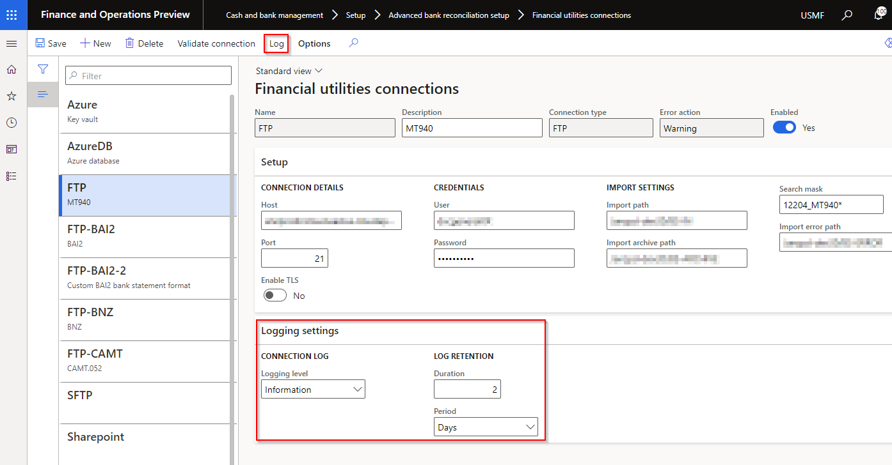
12353		| Reconciliation matching rules	| Ability to use invoice to find the D365 customer account.   Applicable to **Offset account type** set to _Customer_ and where **Offset account** and **Offset account bank statement field** are both blank.   When running the Reconciliation matching rule, the field mapped to **Settle transaction bank statement field** (D365 invoice number) will be used to find the **D365 customer account**, to create the **Customer payment journal line**.   [User guide](Setup/CASH-AND-BANK-MANAGEMENT/Bank-reconciliation-matching-rules.md)  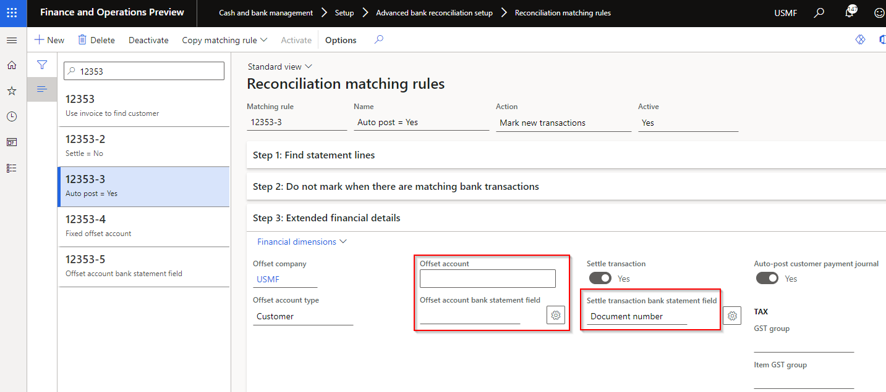
10419		| Data entity - Bank accounts	| Added following field to entity 'Bank accounts':   • Financial utilities connections
10425		| Data entity - Vendor payment method	| Added following field to entity 'Vendor payment method':    • Sundry method of payment   • Auto payment reference number   • BPAY method of payment
N/A		| License manager	| License manager version 10.8.32.10156.   Includes links to applicable GitHub user guide page/s   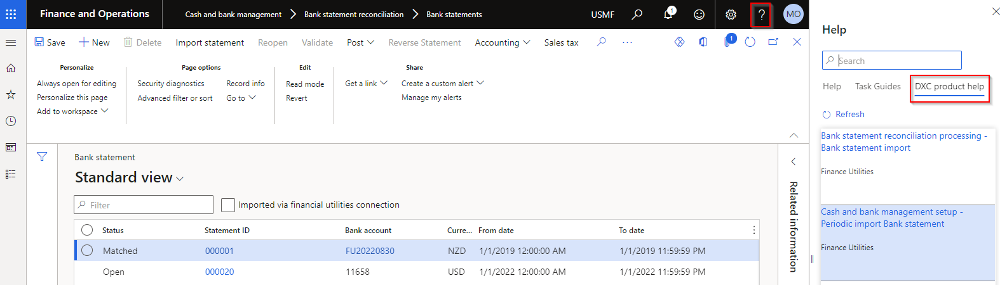

<ins>Bug fixes</ins>

Number	  	| Functionality	  | Description
:--       	|:--              |:--
12324		| Bank statement import	| When a custom bank statement format was used and the file contained a bank account that isn't setup for advanced bank reconciliation, the bank statement headers were created for the bank accounts setup with advanced bank reconciliation, but no bank statement lines were created.   The fix now creates the bank statement lines for the bank accounts setup as advanced.   Note: Std GER doesn't import any bank statements where the file contains a bank account not setup as advanced bank reconciliation.

# Previous version(s)

Approximately one year of previous versions are included below.

### Release 10.0.29.20221130

#### Build 10.0.29.202211301 

Release date: 30 Nov 2022  

<ins>New features</ins>

Number	  	| Functionality	  | Description
:--       	|:--              |:--
11749		| Data entity 'Reconciliation matching rules'	| Removed unused fields from data entity 'Reconciliation matching rules':   • DFUACCOUNTTYPE   • DFULEDGERDIMENSIONDISPLAYVALUE 

<ins>Bug fixes</ins>

Number	  	| Functionality	  | Description
:--       	|:--              |:--
12204		| Bank statement import	| Error importing GER bank statement with bank accounts with same Bank account id and same Statement Id across multiple companies.   Error: "Cannot edit a record in Bank statement account statement (BankStmtISOAccountStatement). Update operations are not allowed across companies. Please use the changecompany keyword to change the current company before updating the record."

### Release 10.0.29.20221019 & 10.0.27.20221019

#### Build 10.0.29.202210192 

Release date: 24/10/2022  

<ins>New features</ins>

Number	  	| Functionality	  | Description
:--       	|:--              |:--
11598		| Reconciliation matching rules	| Ability to set **Field format** for **Offset account bank statement field** and **Settle transaction bank statement field**. This assists in obtaining the D365 customer account and Invoice number from bank statement fields for creating the customer payment journal.   For setup information and examples click [here](Setup/CASH-AND-BANK-MANAGEMENT/Bank-reconciliation-matching-rules.md#field-format)   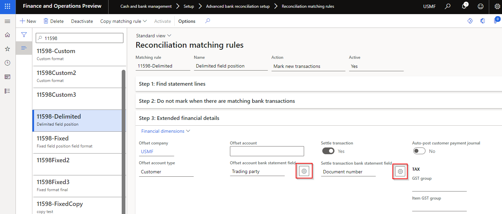   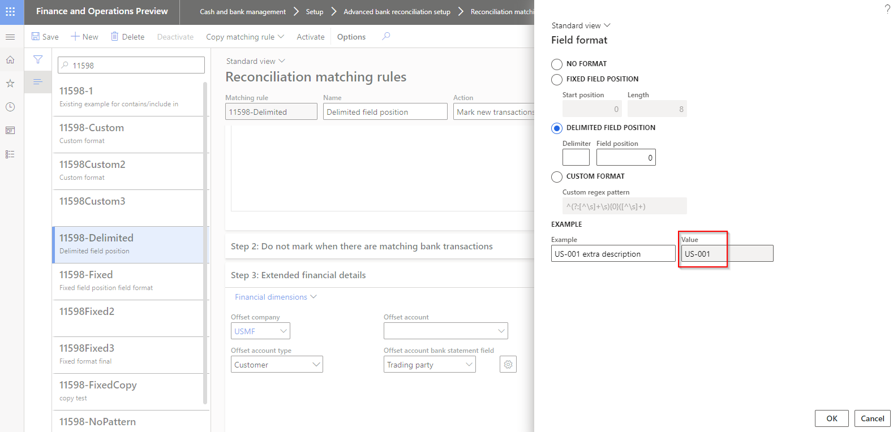

<ins>Bug fixes</ins>

Number	  	| Functionality	  | Description
:--       	|:--              |:--
11623		| Customer bank account entity	| Related to version 10.0.27.202209162.   Error when importing data entity **Customer bank accounts**: Field 'Reference' must be filled in'
11632		| Security	| Related to version 10.0.27.202209162.   Fixed security on **Proposed changes** for Customer approval.   New privilege DFUCustChangeProposal added to following duties:   • Approve customer change proposals   • Maintain customer master

#### Build 10.0.27.202210191

Release date: 19/10/2022  

DXC Finance Utilities 10.0.27 runs on the following Microsoft releases

Base	  | Version	  | Release
:--       |:--            |:--
Microsoft Dynamics 365 application	| 10.0.27	  | [What’s new or changed in Dynamics 365 application version 10.0.27](https://docs.microsoft.com/en-us/dynamics365/finance/get-started/whats-new-changed-10-0-27)
Microsoft Dynamics 365 application	| 10.0.28	  | [What’s new or changed in Dynamics 365 application version 10.0.28](https://docs.microsoft.com/en-us/dynamics365/finance/get-started/whats-new-changed-10-0-28)

Same as 10.0.29.202210191 version, but excludes change that isn't backwards compatible for D365 versions earlier than 10.0.29:

Number	  	| Functionality	  | Description
:--       	|:--              |:--
11568		| Bank statement periodic import	| Due to a change in MS code in 10.0.29.   Periodic import created the Bank statement(s), but:   • File was moved to Error folder (instead of Archive folder)   • Document not attached to Bank statement(s)   • 'Imported via financial connection' not set to Yes.     Also fixes issue for 'Reconcile after import' (manual import and via periodic import)

### Release 10.0.29.20220927

#### Build 10.0.29.202209271

Release date: 29/09/2022  

Number	  	| Functionality	  | Description
:--       	|:--              |:--
11568		| Bank statement periodic import	| Due to a change in MS code in 10.0.29.   Periodic import created the Bank statement(s), but:   • File was moved to Error folder (instead of Archive folder)   • Document not attached to Bank statement(s)   • 'Imported via financial connection' not set to Yes.     Also fixes issue for 'Reconcile after import' (manual import and via periodic import)

### Release 10.0.27.20220916

#### Build 10.0.27.202209162

Release date: 16/09/2022  

DXC Finance Utilities 10.0.27 runs on the following Microsoft releases

Number	  	| Functionality	  | Description
:--       	|:--              |:--
10814		| Customer approval	| Accounts receivable > Setup > Accounts receivable parameters   Ability to select the following **Customer bank account** fields in Customer Approval:   • Bank groups   • BSB number   • Bank account number   • SWIFT code   • IBAN    Ability to select the following **Customer account** fields in Customer Approval:   • Allow on account   • Unlimited credit limit   • Exclude from credit management   • Invoicing and delivery on hold (blocked)   • Charges group   • Customer rebate group   • Commission group   • Payment schedule   **Proposed changes** will contain all fields that requires approval, split into a tab for customer and a tab for each bank account with changes.   _Note_: Using **Discard all changes** on Proposed changes will discard changes on all tabs.   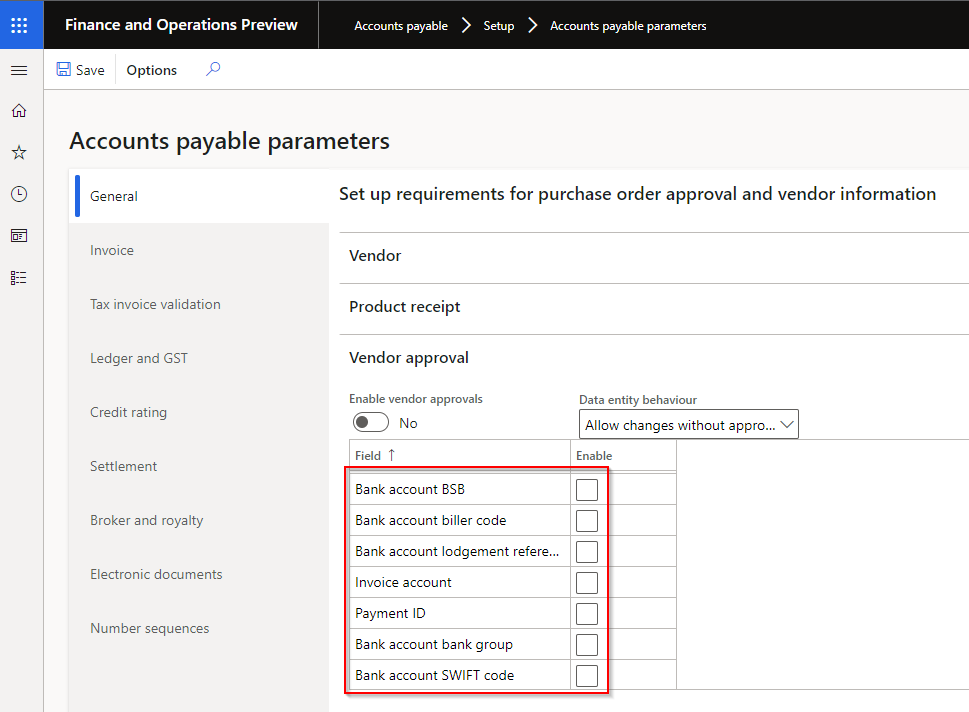   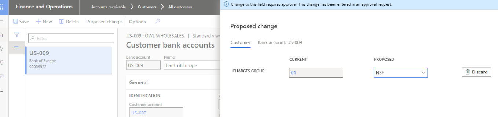
10607		| Reconciliation matching rules	| New **Copy matching rule** button provides the ability to copy an existing rule, edit and activate.   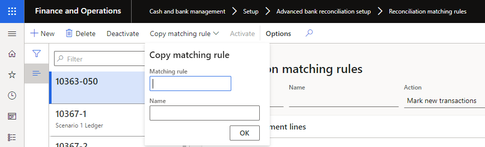
10859		| Bank statement format	| When setting up a custom format, and creating the Date field statement line, field **Date format** is now mandatory.   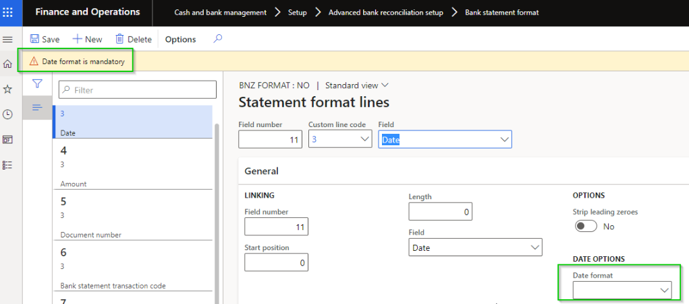
10468		| Financial utilities parameters	| **About** tab removed. Support info now availabe in workspace **Organization administration > Workspaces > DXC support**.

<ins>Bug fixes</ins>

Number	  	| Name	          | Description
:--       	|:--              	  |:--
11305		| Generic electronic Import format	| Fix issue with importing GER bank statement formats. Supports **Advanced bank reconciliation statement model (ABR)** and **Bank statement model** GER formats. 
10927		| Bank statement import	| Fix to incorrect log when importing bank statements for banks across multiple legal entities. Error: 'No matching bank account found' for bank accounts in the different legal entity.
11262		| Bank reconciliation	| Can't select **Offset company** in Matched transactions when manually marking a bank statement transaction as new in Bank reconciliation Worksheet.   Only an issue for FinU release 10.0.25 & 10.0.27.202207142
11307		| Bank reconciliation	| Fix to financial dimensions posted for manually marked as new bank statement transactions. Bank account's transaction incorrectly posting without financial dimensions (10.0.25 & 10.0.27.202207142).     Updated logic when user selects **Mark as new** and the records are moved to Matched transactions:    • Account (Bank)'s financial dimensions will be populated from the Bank account.   • When user enters **Offset account number**, the offset account's financial dimension will be populated from their master accounts (for example customer's financial dimension), except ledger since it is populated in **Offset account number**. If this would result in a blank value it will be populated with Account (Bank)'s financial dimensions.   • If Account (Bank)'s financial dimensions are blank, Offset account's financial dimensions will be used to populate Account (Bank)'s financial dimensions. 
10422		| Vendor method of payment | **Lodgement reference** Payment attribute displaying as blank. Std's D365 last record in Attributes (Belgian structured payment ID) is region based and resulted in any records after it displaying blank.   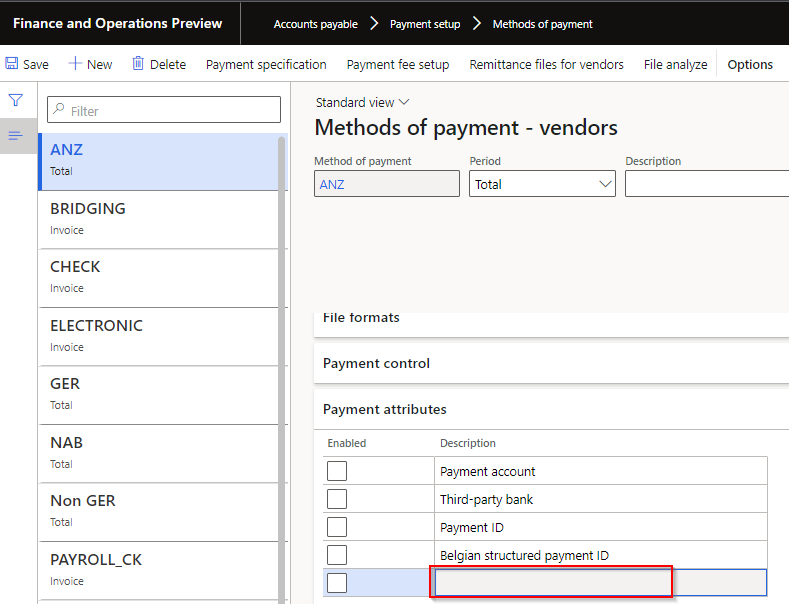

### Release 10.0.25 & 10.0.27.202207142

#### Build 10.0.25.202207142

Release date: 14/07/2022  

Number	  	| Functionality	  | Reason
:--       	|:--              |:--
10367		| Reconciliation matching rule	| Ability to set **Account**'s **Financial dimensions** on **Reconciliation matching rules** with Action **Mark new transactions**.   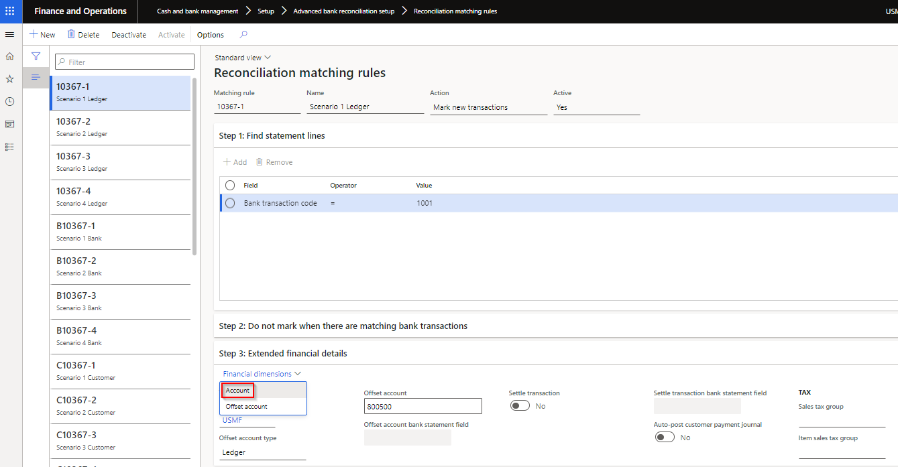   New posting logic for financial dimensions:   • Account is Bank   •  Offset account is Ledger, Customer, Vendor or Bank. 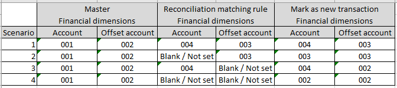   When new bank statement transactions with Offset account type _Ledger_, _Vendor_ or _Bank_'s are matched by using Reconciliation matching rules, the calculated financial dimensions for Account and Offset account are populated on the **Matched transaction**'s **Financial dimensions** tab and can be overriden prior 'Mark as reconciled'.   Offset account type _Customer_ creates customer receipt journal(s) with the calculated financial dimensions for Account and Offset account.
10511		| Vendor payments - Generate payments | Current vendor payment journal line's **Method of payment** and **Bank account** used to populate fields on **Generate payments** dialog.

<ins>Bug fixes</ins>

Number	  	| Name	          | Description
:--       	|:--              	  |:--
10511		| Vendor payments - Generate payments | Electronic reporting format: **User id** and **File name** updated if Bank account is changed on **Generate payments** dialog.   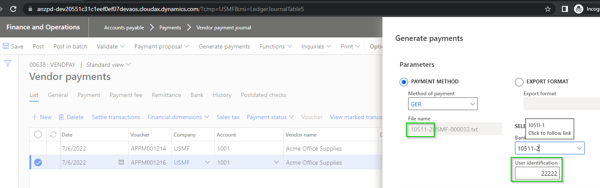
10603		| Bank reconciliation	| Where a bank deposit slip has been cancelled the MS calculated totals are incorrect and resulted in an unmatched amount. Financial utilities unmatched amount calculation has been updated to avoid this issue.   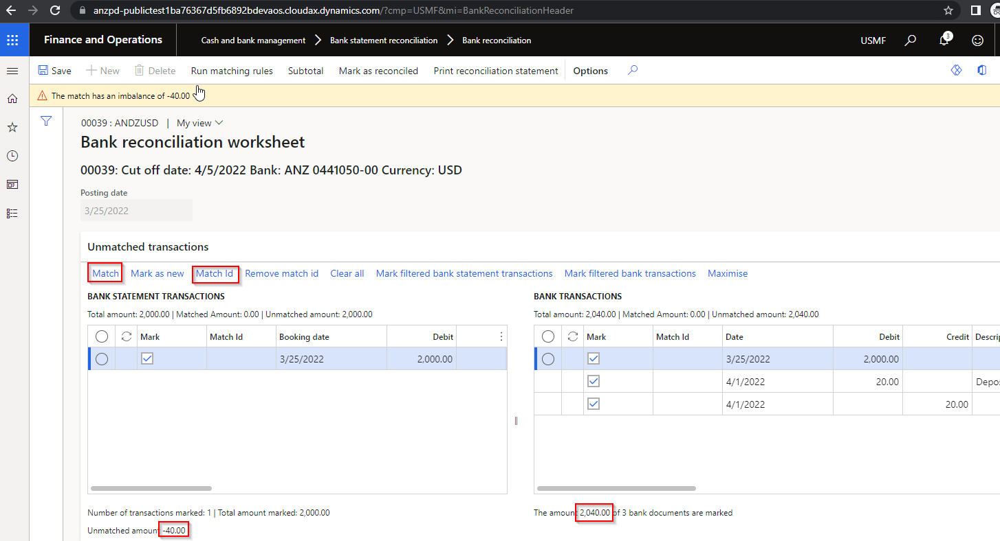

#### Build 10.0.27.202207142

Release date: 14/07/2022  

Same as 10.0.25.202207142, and includes the fix for Payment advice V2 required from 10.0.27:

Number	| Functionality	  | Reason
:--	|:--		  |:--	
10284	| Eclipse Payment advice V2	| Resolves the **breaking change** with Microsoft introduced new 10.0.27 features when **Enable batch processing for bank payment advice reports** is enabled.

### Release 10.0.25 & 10.0.27.20220617

#### Build 10.0.25.202206171

Release date: 17/06/2022  

Number	  	| Functionality	  | Reason
:--       	|:--              |:--
10241		| Bank statement import - Document handling | New field **File attachment document type** added to **Financial utilities parameters**. When Type has been selected, the import file will be attached to the created bank statement(s). This applies to bank statements created with manual or periodic job import.
10293		| Financial utilities connections - Validate connection	| New button **Validate connection** added to **Financial utilities connections**. Validates:   • Connection details   • Import path   • Import archive path   • Import error path
10363		| Only match posted statement lines | New field **Only match posted statement lines** added to **Financial utilities parameters**. For example mark as new bank reconciliation rule finds three records in the bank statement, but only two of the customers exist and thus won't balance since only two lines were posted as customer payment journal lines. This option only applies to where the mark as new bank reconciliation creates and posts new customer payment journals.
 	  	| DXC License manager 10.8.32.10131	| Improvements to **DXC License manager** model

<ins>Bug fixes</ins>

Number	  	| Name	          | Description
:--       	|:--              	  |:--
10449		| Eclipse Payment advice V2 - Generate payments for BNZ file	| Fix **Print payment advice** via **Generate payments** for Eclipse Payment advice V2 report when using **BNZ Direct Credit Service (NZ)** export format on the method of payment.
10292		| Customer Bank recon matching rule - Transaction type	| When reconciliation matching rule creates and posts the customer payment journal, the transaction type was **Customer**. Transaction type has been fixed and will now be posted as **Payment**.

#### Build 10.0.27.202206172

Release date: 29/06/2022  

Number	| Functionality	  | Reason
:--	|:--		  |:--	
10341	| DXC License manager   10.8.32.10141	| New workspace **Organization administration > Workspaces > DXC support**.   Links for licensed products to:   • User guide   • Release notes   • Contact - email address for support
10284	| Eclipse Payment advice V2	| Resolves the **breaking change** with Microsoft introduced new 10.0.27 features when **Enable batch processing for bank payment advice reports** is enabled.

### Release 10.0.22.20220512

#### Build 10.0.22.202205121

Number	  | Functionality	  | Reason
:--       |:--              |:--
8461	    | Bank statement import	  | Ability to automatically import bank statements from ftp, ftps, sftp, Azure blob storage, or SharePoint
10094	    | Reconciliation matching rule – unique voucher	| New **Financial utilities parameters** field called **Populate unique voucher for each journal line**. When customer payment journal is created using the additional Finance utilities fields on **Reconciliation  matching rules** (for mark as new transactions), this new field provides options if the journal will be created with unique vouchers for each line. If new field is enabled, General ledger parameters’ **Allow multiple transactions within one voucher** doesn’t need to be enabled.
10274	    | Reconciliation matching rule – Invoice has been marked by another customer payment journal	| If **Reconciliation matching rule** for mark as new transaction are set to settle the customer invoice, and the invoice has already been marked in another open journal, D365 doesn’t allow the invoice to be selected. In this scenario the customer payment journal line will now still be created (previously didn’t) but with no invoice selected for settlement.
10152	    | GER bank statement format	| Support importing Bank statement formats using GER (Electronic reporting), and supports setting posting date (for mark as new transactions) to:   •	Statement transaction date, or   •	Today’s date

### Release 10.0.22.20220316

#### Build 10.0.22.202203161

Number	  | Functionality	  | Reason
:--       |:--              |:--
9490	    | ABN search and validation	| Ability for Australian companies to search and validate ABN for customers and vendors.
9925	    | Auto-post bank statement	| When Financial utilities parameter 'Auto-post bank statement' is set to Yes, only Bank statement's with status _Reconciled_ will automatically be posted.   Previously bank statements containing unreconciled lines, Bank statement's status is _Matched_, were also automatically posted.   But the unreconciled lines are included in the next bank reconciliation and when users run mark as new matching rule in the next recon, it would error with 'The bank statement % is posted already and cannot be changed'.
9505	    | Populate bank transaction document number	| Populating the document number in bank reconciliation’s bank transactions.   From 10.0.22 MS has removed ‘Turn off reconciliation worksheet performance enhancement’ parameter.   Not required anymore: RemoveLoadReconciliationWorksheetExtensibleFlight_KillSwitch
9688	    | Reconciliation matching rule (1:1 customer and invoice)	| Write Bank statement’s Description to Customer receipt journal. Also added the new Finance utilities fields to entities 'Reconciliation matching rules' and ‘Financial utilities parameters’

<ins>Bug fixes</ins>

Number	  | Name	          | Description
:--       |:--              |:--
9665	    | Print payment advice	| Error when feature 'Enable batch processing for bank payment advice reports’ is enabled and printing the payment advice V2 for an ECL EFT format via Generate payments in the Vendor payment journal.
9986	    | Compile errors	| PEAP 10.0.26 Compile errors   Error The Class 'ERUserParameterDataContract' is internal and is not accessible from the current module 'DXC Finance Utilities'. K:\AosService\PackagesLocalDirectory\bin\XppSource\DXC Finance Utilities\AxClass_DFUVendOutPaymHandler.xpp 78
	

# Installation process
To align with MS best practice and to protect our IP the following changes have been made to the release process.
- The license models DXCLicense and Sable37License will only be released as binaries as part of a deployable package. 
- We will no longer be providing test models for the products, neither as binary or source code. 
- We will only publish the release as a deployable package. 
- Model source code can be provided on request if needed for extensions or debugging.
	- If you have been given the source code to our model for extension or debugging purpose, never make modifications directly to our models! 
	- If you need an extension point, please send an email to ECLANZProductSupport@dxc.com and request it to be implemented. 

Depending on the installation history follow one of these guides to install the new release. 
## Installation without existing installed product
1. Apply the deployable package to your environment. 
2. If you have requested any model for extension or debugging purposes. Install the model source code. 
a.	Note, once the model source code is compiled it will overwrite the binaries installed when the deployable package was applied. 

## Installation with existing installed product
If you’re installing the new release in an installation that already has a previous version of the product installed and you’re not using it for debugging or extension. We recommend that you;  
1. Remove the release product model source code from your source control, if source control is used. 
2. Apply the deployable package, installing the latest version of the product models as binaries.  
3. Check in the binaries for the models to source control, if source control is used. 

If you’re using our model source code for extension or debugging and would like to continue using it, please do the following to apply the new release with the source code. 

1. Remove product license model from your source control that is applicable to the release. You’ll find the license model in the deployable package. It will either be called DXCLicense and Sable37License. 
2. Apply the deployable package to your environment to install the latest binaries. Check in the binaries for the license model that was removed in step 1 to source control. Note, this step will also install the binaries for all the models in the new release. 
3. Install the product release model source code and check into source control. 

If you don’t follow these instructions and continue building your installation deployable package using the license model source code, the installation will continue using the same license model as before applying the release. 

## Feature management
Enable **Finance utilities** via D365 Feature management.  
If above feature is not visible, press **Check for updates** to refresh the feature management list.

