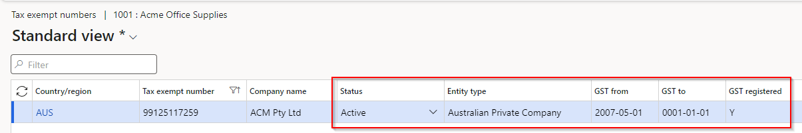
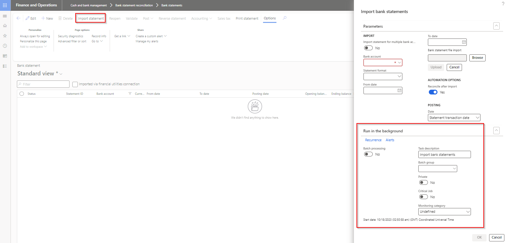
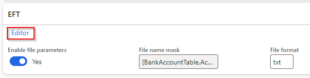
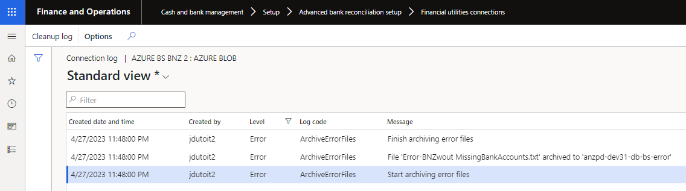
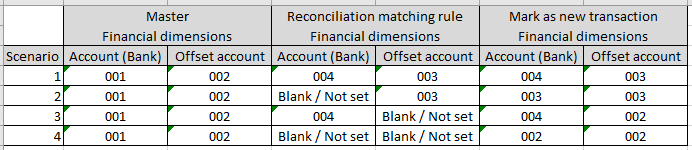

---
# required metadata

title: Finance Utilities
description: Finance Utilities - Release notes
author: jdutoit2
manager: Kym Parker
ms.date: 2024-03-20
ms.topic: article
ms.prod: 
ms.service: dynamics-ax-applications
ms.technology: 

# optional metadata

ms.search.form:  
audience: Application User
# ms.devlang: 
ms.reviewer: jdutoit2
# ms.tgt_pltfrm: 
# ms.custom: ["21901", "intro-internal"]
ms.search.region: Global
# ms.search.industry: [leave blank for most, retail, public sector]
ms.author: jdutoit2
ms.search.validFrom: 2016-05-31
ms.dyn365.ops.version: AX 7.0.1
---

# Release notes
This document describes the features that are either new or changed in the release version mentioned.

# Next release

### Release 10.0.36.202403TBD

#### Build 10.0.36.202403TBD
Estimated release date: 29 March 2024  

<ins>New features</ins>

Number	  	| Module	| Functionality	  	| Description
:--       	|:--     	|:--	         	|:--
17092		| Accounts payable   Accounts receivable	| ABN and GST validation	| _Only applicable to Australia and only visible where ABN validation is enabled for the Legal entity_   • New fields added to TaxVatNumTable:   - **Status**: ABN status for example Active or Cancelled   - **Entity type**: Entity type for the ABN, for example 'Australian Private Company'   - **GST from**: Populated where the ABN is registered for GST *   - **GST to**: Populated where the ABN is registered for GST *   - **GST registered**: Set to _Yes_ where 'GST to' date is in the future *       * The three new GST fields have also been added to the **ABN status** dialog.      Above new fields are updated to current government data when running **ABN validation** report or when adding new records via **ABN lookup**   [User guide](Processing/ABN/ABN-lookup-and-validation.md)
17159		| Accounts payable   Accounts receivable | ABN validation | _Only applicable to Australia and only visible where ABN validation is enabled for the Legal entity_   Form for users to review new/updated ABN records. For example an ABN is not registered for GST anymore.   Select applicable record(s) and select **Mark as reviewed** to update their reviewed status.   **Run update** can be used to run the web service to update ABNs with current data from the Australian Business Register.   
17286		| Accounts payable	| ABN validation | _Only applicable to Australia and only visible where ABN validation is enabled for the Legal entity_   Ability for users to check the current ABN and GST status for a vendor while entering an invoice.   **ABN status** button is enabled when the 'Tax exempt number'/'ABN' is populated for the vendor invoice line.    
16827		| Accounts receivable	| EFT file name on Method of payment	| Ability to set EFT file name for Customer payment files (direct debits) on the Method of payment.   [User guide](Setup/ACCOUNTS-RECEIVABLE/Customer-payments.md)
17290		| Cash and bank management	| Reconciliation matching rule | Ability to set a **Description** mask for Mark new transactions.   This release includes only **Customer** offset types. Roadmap: include the other offset types Vendor, Bank and Ledger.   **Editor** provides the ability to set a combination of static fields and placeholders:   • Currency   • Description   • Amount   • Document number   • Entry reference   • Bank statement transaction code   • Reference No.   • Related bank account   • Name (Trading party)   • Bank account   • Bank account number   • Bank groups   Note: If File name mask is not populated, the Bank statement line's Description will be written to new transaction's Description.      
16600		| Accounts payable	| Vendor payment journal | When the vendor payment is generated, the **Export file name** displayed on the Generate payments dialog is written to the relevant vendor payment journal lines' new field called **Export file name**.   Note: This does not yet include file names generated by Electronic reporting config.   
16924		| Organisation administration | Electronic reporting export connections | Log functionality added   

<ins>Bug fixes</ins>

Number	  	| Module	| Functionality	  	| Description
:--       	|:--   		|:--	           	|:--
16997		| Accounts payable	| EFT file name editor on Method of payment	| Refresh required to save updates to the file name using Editor
17119		| Accounts payable   Accounts receivable	| ABN lookup	| Fix to 'Company name' in Search results
16827		| Accounts receivable | EFT file name on Method of payment | If the same payment method PaymMode exists in the Accounts payable (AP) module, the EFT file name setup from the AP method of payment was used
16925		| Organisation administration	| Electronic report jobs	| When using am Electronic reporting destination with document type in conjunction with Electronic reporting export connection, the record created in the Electronic reporting jobs will now also contain:   • Document handling attachment   • Field 'Files' populated with the file name.
17012		| Cash and bank management	| Reverse mark as new transaction	| Support added for reversing **mark as new** transactions offsetting to **vendor, bank or customer** within the same legal entity.   15693 resulted on an incorrect sign on the reverse transaction on the bank, vendor and customer   Supports features:   • Enable bank reconciliation reversal even new transactions exist in posted bank statement   • Reverse posted bank statement with new transactions  
17126		| Cash and bank management	| Reconciliation matching rule	| When used to create automatically posted Customer dishonour payments, the automatically matching in the Bank reconciliation failed. 
17063		| Accounts receivable | Interest notes - Due date | Due date now updated before the transaction records are created.   Resolves error: "Cannot edit a record in Customer transactions (CustTrans). An update conflict occurred due to another user process deleting the record or changing one or more fields in the record."

# Current version

### Release 10.0.36.20231116

DXC Finance Utilities 10.0.36 runs on the following Microsoft releases

Base	  | Version	  | Release
:--       |:--            |:--
Microsoft Dynamics 365 application	| 10.0.36	  | [What’s new or changed in Dynamics 365 application version 10.0.36](https://docs.microsoft.com/en-us/dynamics365/finance/get-started/whats-new-changed-10-0-36)
Microsoft Dynamics 365 application	| 10.0.37	  | [What’s new or changed in Dynamics 365 application version 10.0.37](https://docs.microsoft.com/en-us/dynamics365/finance/get-started/whats-new-changed-10-0-37)
Microsoft Dynamics 365 application	| 10.0.38	  | [What’s new or changed in Dynamics 365 application version 10.0.38](https://docs.microsoft.com/en-us/dynamics365/finance/get-started/whats-new-changed-10-0-38)
Microsoft Dynamics 365 application	| 10.0.39	  | [What’s new or changed in Dynamics 365 application version 10.0.39](https://docs.microsoft.com/en-us/dynamics365/finance/get-started/whats-new-changed-10-0-39)

#### Features not yet supported

Feature	| Feature state
:--       	|:--		
**Time zone for importing bank statements using Electronic reporting**   Finance utilities doesn't currently support converting date/time fields within the bank statement file | Mandatory
**Reverse posted bank statement with new transactions** for offset types customer, vendor and bank	| On by default
**Modern bank reconciliation** | Preview in 10.0.39

#### Build 10.0.36.2023111671
Release date: 2 February 2024  

<ins>New features</ins>

Number	  	| Module	| Functionality	  	| Description
:--       	|:--     	|:--	         	|:--
16332		| System administration 	| Business event for electronic reporting export | New Business event **Electronic reporting file exported to azure blob**. Option to create an event when exporting ER file to Azure Blob via 'Electronic reporting export connections'.
16596		| Organization adminstration	| Electronic reporting export connection | 'Validate connection' functionality added

<ins>Bug fixes</ins>

Number	  	| Module	| Functionality	  	| Description
:--       	|:--   		|:--	           	|:--
16873		| Accounts payable	| Payment advice print	| Finance utilities was referencing 'ECL_BankPaymAdviceVendV2' report when printing Vendor Payment advice. When the report wasn't deployed to an environment, printing would error with 'Parameter _reportName cannot be null or empty'. Reference to the ECL report has been removed.
16897		| Accounts payable   Accounts receivable	| ABN validation	| Only applicable to 10.0.36.2023111661. When ABN validation was active for the legal entity, any changes on the vendor/customer resulted in ABN validation dialog popping up.
16959		| Various	| - Financial utilities connections   - Electronic reporting export connections	| Increase EDT for usernames, passwords (sftp, ftp) and storage account name, storage account key (Azure blob)
16976		| Accounts reveivable	| Interest note - Due date	| Waive, reinstate and reverse of interest notes also now utilize 'Use customer payment terms' option.

#### Build 10.0.36.2023111661
Release date: 12 January 2024  

<ins>Bug fixes</ins>

Number	  	| Module	| Functionality	  	| Description
:--       	|:--   		|:--	           	|:--
16822   16754 | Data management | ABN validation - Import entities TaxVATNumTable & VendVendorV2	| ABN validation GUI popup wrapped around a condition for data import scenarios. Also removed the previous 'Skip validation' method when importing Vendors entity.   When ABN validation is enabled for the legal entity and the entities imported, ABN validation will occur without the GUI popup. Records with valid ABNs will be imported and only invalid ABN staging records will error.

#### Build 10.0.36.2023111651
Release date: 21 December 2023  

<ins>Bug fixes</ins>

Number	  	| Module	| Functionality	  	| Description
:--       	|:--   		|:--	           	|:--
16794		| Accounts payable	| Vendor approval	| Related only to earlier versions of 10.0.36.20231116 - deprecating Vendor bank account approval.   Resulted in values not being retained for client extended fields in Vendor approval.

#### Build 10.0.36.2023111642
#### Build 10.0.35.2023111641
Release date: 14 December 2023  

<ins>Bug fixes</ins>

Number	  	| Module	| Functionality	  	| Description
:--       	|:--   		|:--	           	|:--
16758		| Accounts payable	| Vendor approval	| Proposed changes disregarded for changes to standard vendor fields. 
16765		| Accounts payable	| Method of payment   EFT file name Editor	| Label fix and saving of changes to file name mask.

#### Build 10.0.36.2023111631
Release date: 8 December 2023

<ins>Bug fixes</ins>

Number	  	| Module	| Functionality	  	| Description
:--       	|:--   		|:--	           	|:--
16747		| N/A		| Deployment		| Bug fix only applicable to 10.0.36.2023111621, which included unit tests.   To remove unit tests, use the following [instructions](https://learn.microsoft.com/en-us/dynamics365/fin-ops-core/dev-itpro/deployment/uninstall-deployable-package) to remove the package/uninstall unit tests.

#### Build 10.0.36.2023111621
#### Build 10.0.35.2023111622
Release date: 30 November 2023   

<ins>New features</ins>

Number	  	| Module	| Functionality	  	| Description
:--       	|:--     	|:--	         	|:--
15693		| Cash and bank management	| Reverse mark as new transaction	| Support added for reversing **mark as new** transactions offsetting to **vendor, bank or customer** within the same legal entity.   Supports features:   • Enable bank reconciliation reversal even new transactions exist in posted bank statement   • Reverse posted bank statement with new transactions  

<ins>Bug fixes</ins>

Number	  	| Module	| Functionality	  	| Description
:--       	|:--   		|:--	           	|:--
16584		| Accounts payable	| Vendor bank account approval	| Proposed changes disregarded for changes to standard vendor bank account fields.

#### Build 10.0.36.202311161
#### Build 10.0.35.202311161
Release date: 16 November 2023   

<ins>Deprecated</ins>

Number	  	| Module	| Functionality	  	| Description
:--       	|:--     	|:--	         	|:--
15394		| Accounts payable	| Vendor bank account change workflow	| Deprecate Vendor bank account fields in Vendor approval.   See [Deprecated features notice - Vendor bank account change workflow](#vendor-bank-account-change-workflow) for more details.
16002		| Cash and bank management	| Mark as new transaction's Posting date	| Deprecate **Posting date** functionality for Mark as new transactions.   See [Deprecated features notice - Posting date](#new-bank-statement-transaction---posting-date) for more details.

<ins>New features</ins>

Number	  	| Module	| Functionality	  	| Description
:--       	|:--     	|:--	         	|:--
15488		| Accounts receivable	| Interest notes - Due date	| New field called **Use customer payment terms** added to **Accounts receivable parameters**  and **Credit and collections parameters** (Collections tab).   If set to _Yes_, the customer's payment terms will be used to determine Due date when posting Interest notes.   [Guide](Setup/ACCOUNTS-RECEIVABLE/Customer-parameters.md)
16039		| Cash and bank management	| Bank statement import	| **Run in the background** functionality added to **Import bank statements**    
16471		| Encryption	| | DXC encryption parameters: Rename field KeyVaultSignerPublicKey (Signer's public key) to KeyVaultReceiverPublicKey (Receiver's public key)
16401		| Accounts payable	| Vendor bank account - Lodgement reference	| Increased Lodgement reference EDT from 18 to 20
N/A		| DXC License 	| | DXC License 10.0.34.202310311 - Includes feature managed SmartSend and Core extensions

<ins>Bug fixes</ins>

Number	  	| Module	| Functionality	  	| Description
:--       	|:--   		|:--	           	|:--
16069		| Unit tests	| 	| Fix 10.0.37 build issues for Finance utilities Unit tests
16244		| Cash and bank management	| Import statement	| Code change in 10.0.37 that makes 'Bank account' mandatory when using 'Import statement for multiple bank accounts in all legal entities'
16036		| Data management	| Import data entity **Document types**	| Couldn't import the entity with Finance utilities field DFUGEREXPORTCONNECTION.   Error: 'The column ErrorCode in entity Document types has incorrect data. Please correct the data and try the import again.'

# Deprecated features

This section describes the features that have been removed, or planned to be removed from a Finance utilities version.

### Vendor bank account change workflow
- Reason for deprecation/removal - Replaced by D365 feature from 10.0.32 called 'Vendor bank account change proposal workflow' / 'Supplier bank account change proposal workflow'. [Learn more](https://learn.microsoft.com/en-gb/dynamics365/finance/accounts-payable/vendor-bank-account-workflow)
- Impact - Removal of the following fields in Accounts payable parameters FastTab 'Vendor approval':
	- Bank account number
	- Bank account BSB
	- Bank account biller code (Finance utilities field)
	- Bank account lodgement reference (Finance utilities field)
	- Bank account bank group
	- Bank account SWIFT code
	- Bank account IBAN
	- Bank account active date
	- Bank account expiration date
- Notice date - 24 July 2023
- Status - Completed in 10.0.36.202311161
> Note: The Finance utilities fields (Biller code and Lodgement reference) have been added to standard 'Vendor bank account approval' FastTab in Accounts payable parameters in Finance Utilities version 10.0.35.202307311.

### New bank statement transaction - Posting date
- Finance Utilities functionality - Option to post **new** bank statement transaction at either **Today's date** or **Statement transaction date** (Statement's To date)
- Recommended process: Feature 'New voucher and date for new transactions in the advanced bank reconciliation bank statement' is automatically enabled from 10.0.36. The feature automatically sets new 'Cash and bank management parameters' field 'Set the booking date as default accounting date for new transactions' to _Yes_. Select applicable option in this new field to set the default accounting date for new transactions:
	- Yes: Bank statement line booking date
 	- No: Bank statement import date 
- Reason for deprecation/removal - Feature 'New voucher and date for new transactions in the advanced bank reconciliation bank statement' was introduced in 10.0.31. In 10.0.35 MS has updated the feature which has resulted in a breaking change for Finance Utilities Posting date functionality. From 10.0.36 this feature is enabled by default.
- Impact - Removal of the following fields & functionality:
	- Posting date default on bank account  
	- Posting date option on importing bank statement  
 	- Posting date on bank reconciliation  
- Notice date - 4 September 2023
- Status - Completed in 10.0.36.202311161

  

# Previous version(s)

Approximately one year of previous versions are included below.

### Release 10.0.35.20230731

#### Build 10.0.35.2023073156
Release date: 14 November 2023   

<ins>Bug fixes</ins>

Number	  	| Module	| Functionality	  	| Description
:--       	|:--   		|:--	           	|:--
16460		| Cash and bank management	| Intercompany bank Mark as new transactions | 16338's change to intercompany bank mark as new, created a bank statement in the destination company to create intercompany reconciled bank transactions. This has now been changed to not create a bank statement in the destination legal entity. It now creates an unreconciled bank transaction in the destination company using the following from originating company: Debit/Credit Amount, OffsetLedgerDimension, BankTransType, OffsetTxt, OffsetCompany, OffsetAccountType, ExchRateSecond, ExchRate, CurrencyCode, Voucher, TransDate, LedgerDimension, AccountType, JournalNum

#### Build 10.0.35.2023073143
Release date: 2 November 2023   

<ins>New features</ins>

Number	  	| Module	| Functionality	  	| Description
:--       	|:--     	|:--	         	|:--
16429		| Cash and bank management	| Bank statement / reconciliation	| Update ledgers used for mark as new **Intercompany bank** transactions. Previously used  LedgerInterCompany fields CustLedgerDimension and DebitLedgerDimension, but these aren't available in the Intercompany accounting form. Now using: OriginatingDebitLedgerDimension or OriginatingCreditLedgerDimension and DestinationCreditLedgerDimension or DestinationDebitLedgerDimension.

<ins>Bug fixes</ins>

Number	  	| Module	| Functionality	  	| Description
:--       	|:--   		|:--	           	|:--
16338		| Cash and bank management	| Intercompany bank Mark as new transactions | Additions to 15578. Applicable to when a bank statement line is marked as new and offset to an **intercompany bank account**.   Previously only supported when bank statement is posted via 'Mark as reconciled' (Auto-post bank statement is set to _Yes_), and feature 'Advanced bank reconciliation improvement: enable filtering and provide separate grid for new transactions' disabled.   Now supports the feature enabled and posting the bank statement from the Bank statement page (Auto-post bank statement is set to _No_) as well.
16250		| Cash and bank management	| Import statement	| Incorrect warning message when importing bank statement and the file contains multiple bank accounts and the import parameters is filtered to one bank account that exists in the file: 'Failed to match with bank account'.   It also warned about No matching bank account found for bank accounts that doesn't exist in D365, but the import was only filtered to one specific bank account.

#### Build 10.0.35.2023073131
Release date: 4 October 2023   

<ins>Bug fixes</ins>

Number	  	| Module	| Functionality	  	| Description
:--       	|:--   		|:--	           	|:--
16114		| ABN Validation	| Customer and Vendor ABN validation	| Decouple DXCABNValidation from DXCFinanceUtilities enabling companies to remove model DXCABNValidation.

#### Build 10.0.35.2023073122
Release date: 31 August 2023   

<ins>New features</ins>

Number	  	| Module	| Functionality	  	| Description
:--       	|:--     	|:--	         	|:--
15017		| Accounts payable	| EFT file name generation	| Ability to set static values and select placeholders for EFT file name in Vendor's Method of payment   [User guide](Setup/ACCOUNTS-PAYABLE/Vendor-payments.md#eft-file-name-generation)       
15578		| Cash and bank management	| Bank reconciliation	| When bank statement line is marked as new and offset to an **intercompany bank account**, the postings will now be created as intercompany. Example:    • **Current company**: Debit I/C Receivable and Credit Bank account   • **Intercompany**: Debit Bank account and Credit I/C Payable

<ins>Bug fixes</ins>

Number	  	| Module	| Functionality	  	| Description
:--       	|:--   		|:--	           	|:--
15891		| Cash and bank management	| Bank reconciliation | Only issue in **10.0.35.202307311**.   When running matching rules, the lines are not moved to matched/new transactions
15976		| Cash and bank management	| Bank reconciliation	| When running Reconciliation matching rule offsetting to account type **Customer**, the customer payment journal line's **Approved** will now be set to _Yes_. Else the record is not available to be settled.
15899		| Accounts payable	| Payments report	| Only issue in 10.0.35.   When printing the **Payments** report in Vendor payments, every 2nd page is blank.

#### Build 10.0.35.202307311
Release date: 31 July 2023   

<ins>New features</ins>

Number	  	| Module	| Functionality	  	| Description
:--       	|:--     	|:--	         	|:--
14578		| Cash and bank management	| Bank reconciliation	| Support for manually setting offset details when enabling feature **Advanced bank reconciliation improvement: enable filtering and provide separate grid for new transactions**. This feature adds section **New transactions** in the Bank reconciliation and in 10.0.35 MS added additional button **Line details**.   Finance utilities now utilises **Line details** for the ability to manually set offset details for mark as new transactions.       _Note: Using button Cancel on Line details currently still saves any changes. Bug has been reported to Microsoft and fix will be included in 10.0.37_
14929		| Cash and bank management	| Bank statement import	| **Decimal adjustment** was limited to 5 decimals.   Have been changed to dynamic and now supports higher than 5 decimals.
14088		| Cash and bank management	| Bank statement import	- Periodic task | Currently when the periodic task **Import bank statements via financial utilities connection**'s Bank statement format's **Custom format** is:   • **Yes**: By design if there are issues with creating bank statement for any of the accounts in the file (example bank account doesn't exist in D365) , no bank statements are created and the file is moved to error path (instead of archive).   • **No**: Std creates bank statements for all valid bank accounts using the Electronic reporting configuration - we have no control over this.   **This change**: will move the file to **Error path / container** (instead of archive path) if not all bank statements could be created when using the periodic task and the bank statement format's **Custom format** is set to _No_.
15410		| Accounts payable	| Vendor bank account approval	| Support for 10.0.32 feature 'Vendor bank account change proposal workflow’ / ‘Supplier bank account change proposal workflow' which is on by default from 10.0.35.   Added the following Finance utilities fields to **Vendor bank account approval**:   • Biller code   • Lodgement reference   Note: Finance utilities includes vendor bank accounts fields in **Vendor approval**, which has now been replaced by this MS feature, and will be deprecated in the next Finance utilities release. Please migrate your vendor bank account approval setup from **Vendor approval** to **Vendor bank account approval** before the next release.   [Deprecation notice](#vendor-bank-account-change-workflow)   
14099		| Accounts receivable | AR Utilities	| Added Amount **Decimal adjustment** option to Remittance format   
N/A		| Licensing	| DXC License & DXC License manager	| New versions included:   • DXC License 10.0.34.202307311   • DXC License Manager 10.0.32.202307312

<ins>Bug fixes</ins>

Number	  	| Module	| Functionality	  	| Description
:--       	|:--   		|:--	           	|:--
14619		| Cash and bank management	| Bank statement import	- Custom formats | Ability to map non transaction record custom line codes. Previously if Opening or Closing balance custom line codes where set in **Custom line codes**, these were imported as transaction records. 
15482		| Cash and bank management	| Bank statement import	- Custom formats | When using mapped **Ending balance** field, the opening balance was added to the imported bank statement's ending balance
15199		| Cash and bank management	| Reconciliation matching rules	set | Extension to **processMatchRuleSet** to support reprocessing unmatched bank statement lines.   The issue came in where the filter criteria for each rule in the set found the same bank statement lines, but the rules used different bank statement fields to find the D365 customer account to post the customer payment journal.     Example - Reconciliation matching rule set where all the rules filters to same criteria that matches to 15 bank statement lines:   Rule 1: Uses Bank statement field **Description** to find the D365 customer account, but only 3 lines could find a D365 customer account in this field to successfully post.   Rule 2: Uses Bank statement field **Entry reference** to find the D365 customer account. The expectation would be that Rule 2 would find the remaining 12 bank statement lines and post the applicable ones, but it found 0.   Before this change, only rule 1 in the set found bank statement lines, and subsequent rules found 0.
15390		| Cash and bank management	| Bank reconciliation	| When running a **Mark new transactions** Reconciliation matching rule that:   • Posts customer payment journals and   • Financial utilities parameters **Only match posted statement lines** was set to _Yes_ and   • **No** journals were successfully posted (for example couldn't find any matching D365 customer account for all the lines)   All unmatched bank statement transactions, that matched the criteria, where moved to matched.

### Release 10.0.34.20230615

#### Build 10.0.34.202306151
Release date: 15 June 2023   

<ins>New features</ins>

Number	  	| Module	| Functionality	  	| Description
:--       	|:--     	|:--	         	|:--
14332	| Cash and bank management   Accounts receivable | Financials utilities connection |  Update to support Azure Blob Storage related method depreciation in 10.0.34.   Replaced StartCopyFromBlob with BeginStartCopy   [Obsolete API](https://learn.microsoft.com/en-us/previous-versions/azure/jj732079(v=azure.100))
12430		| Cash and bank management | Reconciliation matching rules | New field **Offset account reference bank statement field** provides the ability to use [Customer reference](Setup/ACCOUNTS-RECEIVABLE/Customer-reference.md) to find the applicable D365 customer account when running a Mark new transactions Reconciliation matching rule offsetting to customer. 
14536	| Cash and bank management	| Bank statements	| Ability to map **Ending balance** on custom bank statement formats. Where this is mapped, the imported bank statement's ending balance will be used to populate the Bank statement's ending balance field. This is useful to validate that bank statements are imported in the correct sequence.
14332	| Accounts payable	| Model reference	| Added FinTag model reference to Finance utilities
14524	| Accounts payable	| Payments report	| Added new field for Vendor's bank name

<ins>Bug fixes</ins>

Number	  	| Module	| Functionality	  	| Description
:--       	|:--   		|:--	           	|:--
14532		| Cash and bank management	| Bank reconciliation report	| Fixed Report's Txt field's ExtendedDataType to match Bank account transaction's Txt field.
14696		| Cash and bank management	| Bank statement import	- Custom formats | Issue with 88 continuation line's string size. 

### Release 10.0.31.20230518

#### Build 10.0.31.202305181
Release date: 18 May 2023   

<ins>New features</ins>

Number	  	| Module	| Functionality	  	| Description
:--       	|:--     	|:--	         	|:--
12631		| Cash and bank management	| UI updates		| • Update header on Bank accounts 'EFT parameters' to 'AP EFT parameters'   • Bank reconciliation warning log updated where the customer payment journal isn't automatically posted: "Customer payment journal % has been created successfully. Please post the payment journal manually, refresh the worksheet and manually match with the new bank transactions."

<ins>Bug fixes</ins>

Number	  	| Module	| Functionality	  	| Description
:--       	|:--   		|:--	           	|:--
14277		| Cash and bank management	| Bank statement	| Importing bank statement file that contains multiple bank accounts in different legal entity's errored with: "The bank account % must enable the parameter Advanced bank reconciliation" for bank accounts in different legal entity.
13554		| Cash and bank management	| Bank reconciliation	| From 10.0.31 when feature 'New voucher and date for new transactions in the advanced bank reconciliation bank statement' was enabled and running a mark as new reconciliation rule that offsets to Vendor, it didn't create the record in the vendor subledger.
14096		| Cash and bank management	| Reconciliation report	| Timeout on report when bank account has a large number of transactions.
14230		| Accounts receivable		| AR Utilities		| Update Error customer account logic to work with blank invoice.
14239		| Accounts receivable		| Data management	| Importing entity 'Customers V3' errored when ABN lookup is enabled.
12902		| Accounts payable		| Data management	| Importing entity 'Vendors V2' errored when ABN lookup is enabled.
14333		| Accounts payable		| Generate payments	| Only issue where the GER file is automatically saved to Azure blob storage with keyvault. Added security privilege to duty 'Maintain vendor payments'. Error: "Access denied to field Key Vault secret key (SecretKey) in table Key Vault parameters (KeyVaultParameters)."

### Release 10.0.29.20230505

#### Build 10.0.29.202305051
Release date: 5 May 2023   

<ins>New features</ins>

Number	  	| Functionality	  | Description
:--       	|:--              |:--
12644		| Customer references	| Ability to set multiple references against customers - [Setup](Setup/ACCOUNTS-RECEIVABLE/Customer-reference.md).   These references can be used in the following scenarios:   • Customer remittance file refers to a reference unique to the customer, but not an invoice number. This reference can be used to find the applicable customer account when creating the customer payment journal while importing customer remittances using the additional licensed feature AR Utilities.   • Roadmap: Reconciliation matching rules additional ability to use the customer reference to find the applicable customer account when creating the customer payment journal.
11357		| Import customer remittance file	| New licensed feature included in **AR Utilities**.   Enhancement to import customer remittance files from ftp, sftp or Azure blob storage using data entity Customer payment journal.   A wide variety of setup options allows flexibility on method to find the customer account, settlement, posting date, custom file mapping etc.   • [Import customer remittance setup](Setup/ACCOUNTS-RECEIVABLE/Customer-remittance.md)   • [Import customer remittance processing](Processing/Accounts-Receivable/Customer-remittance.md)
13907		| Financial utilities connection	| Where file is moved to **error** path/container, the Financial utilites connection's Log Level will be set to _Error_.   Set connection's **Logging level** to _Error_ and use custom alerts to be alerted when a file has been moved to error path.   
N/A		| License manager	| License manager version 10.8.32.10171   Enhanced Licensing capabilities to assist with licensing support and scaling.   **Note:** Required to upgrade all installed DXC products to at least the following versions:   • EDI 10.0.29.202305053   • Finance utilities 10.0.29.202305051   • SmartSend 10.0.29.202304142   • Core extensions 10.0.29.202304142   • DocuSign 10.0.29.202304211   • Item creation 10.0.29.202304211   •  PLM 10.0.29.202304211   • Forex 10.0.29.202305101    

<ins>Bug fixes</ins>

Number	  	| Functionality	  | Description
:--       	|:--              |:--
12857		| Data entity - Reconciliation matching rules	| Reverse changes for 11749. Removed fields added back.
12888		| Data entity - Financial utilities connections	| Fixed entities required to import Financial utilties connections
10429		| Data entity - Reconciliation matching rule 	| When importing entity, the Offset account was imported with Chart of account delimiter after the ledger account.
14093		| Reconciliation matching rules | Security: Maintain privilege added for **Copy matching rule**. Added to Duty 'Enable bank management process'.

### Release 10.0.29.20230131

#### Build 10.0.29.202301317
Release date: 17 April 2023   

<ins>Bug fixes</ins>

Number	  	| Functionality	  | Description
:--       	|:--              |:--
13788		| Bank reconciliation	| Modified fix for 13592 to use **Accounting currency** instead of Reporting currency.

#### Build 10.0.29.202301316
Release date: 30 March 2023   

<ins>Bug fixes</ins>

Number	  	| Functionality	  | Description
:--       	|:--              |:--
13592		| Bank reconciliation	| Exchange rate issue when using Mark as new and Offset account type is set to **Vendor**. When the currency differs to the legal entity, and the posted vendor transaction is selected to be used in settlement, the transaction's amount doesn't update the **Settlement balance**.
13620		| Vendor bank account approval	| From 10.32 MS has introduced their own Vendor bank account approval. MS used the same method name processChangesForApproval as we used for Finance utilities functionality. We've updated ours to avoid compile issues from 10.0.32.

#### Build 10.0.29.202301315
Release date: 3 March 2023   

<ins>Bug fixes</ins>

Number	  	| Functionality	  | Description
:--       	|:--              |:--
11505		| Reconciliation matching rules	| Bank reconciliation: When running multiple Reconciliation matching rules with **Action** set to _Mark new transactions_ and **Offset account type** set to _Customer_, errored with 'No statement lines have been marked. The match has an imbalance of %amount%'. 
12801		| Reconciliation matching rules	| Bank reconciliation: When running Reconciliation matching rules with **Action** set to _Mark new transactions_ and **Offset account type** set to _Customer_ and **Auto-post customer payment journal** set to _Yes_, and there was an issue with posting the customer payment journal (for example customer is stopped) the bank statement transactions were still matched.

#### Build 10.0.29.202301314
Release date: 27 February 2023   

<ins>New features</ins>

Number	  	| Functionality	  | Description
:--       	|:--              |:--
12934		| Bank statement import	|  Support DXC X++ replacement for XSLT depreciation

#### Build 10.0.29.202301313
Release date: 22 February 2023   

<ins>Bug fixes</ins>

Number	  	| Functionality	  | Description
:--       	|:--              |:--
N/A		| DXC Encryption	| Update to DXC encryption. Resolve error: Module 'DXCEncryption' is missing the following dependencies: 'ApplicationFoundationFormAdaptor'

#### Build 10.0.29.202301312
Release date: 14 February 2023   

Number	  	| Functionality	  | Description
:--       	|:--              |:--
12825		| DXC Encryption	| Remove unwanted model references

#### Build 10.0.29.202301311
Release date: 31 January 2023   

<ins>New features</ins>

Number	  	| Functionality	  | Description
:--       	|:--              |:--
11653		| Encryption / Decryption	| New model **DXC Encryption**.   Encryption/decryption options added to following Finance utilities functionality:   • Encrypt option on **Electronic reporting export connections** to send encrypted GER Vendor EFT files   • Decrypt option on **Financial utilities connection** to decrypt a bank statement file imported using periodic task **Import bank statements via financial utilities connection**.   [User guide](Setup/ENCRYPTION/Encryption-decryption.md)
12119		| Financial utilities connection	| **Log** ability added to all connection types. Ability to set **Logging level** and **Retention period**. This provides users the ability to set Custom alerts. For example if a connection can't connect a log with level _Error_ can be created.   
12353		| Reconciliation matching rules	| Ability to use invoice to find the D365 customer account.   Applicable to **Offset account type** set to _Customer_ and where **Offset account** and **Offset account bank statement field** are both blank.   When running the Reconciliation matching rule, the field mapped to **Settle transaction bank statement field** (D365 invoice number) will be used to find the **D365 customer account**, to create the **Customer payment journal line**.   [User guide](Setup/CASH-AND-BANK-MANAGEMENT/Bank-reconciliation-matching-rules.md#mark-as-new---additional-defaults)  
10419		| Data entity - Bank accounts	| Added following field to entity 'Bank accounts':   • Financial utilities connections
10425		| Data entity - Vendor payment method	| Added following field to entity 'Vendor payment method':    • Sundry method of payment   • Auto payment reference number   • BPAY method of payment
N/A		| License manager	| License manager version 10.8.32.10156.   **Help** includes links to applicable GitHub user guide page/s   

<ins>Bug fixes</ins>

Number	  	| Functionality	  | Description
:--       	|:--              |:--
12324		| Bank statement import	| When a custom bank statement format was used and the file contained a bank account that isn't setup for advanced bank reconciliation, the bank statement headers were created for the bank accounts setup with advanced bank reconciliation, but no bank statement lines were created.   The fix now creates the bank statement lines for the bank accounts setup as advanced.   Note: Std GER doesn't import any bank statements where the file contains a bank account not setup as advanced bank reconciliation.

### Release 10.0.29.20221130

#### Build 10.0.29.202211301 

Release date: 30 Nov 2022  

<ins>New features</ins>

Number	  	| Functionality	  | Description
:--       	|:--              |:--
11749		| Data entity 'Reconciliation matching rules'	| Removed unused fields from data entity 'Reconciliation matching rules':   • DFUACCOUNTTYPE   • DFULEDGERDIMENSIONDISPLAYVALUE 

<ins>Bug fixes</ins>

Number	  	| Functionality	  | Description
:--       	|:--              |:--
12204		| Bank statement import	| Error importing GER bank statement with bank accounts with same Bank account id and same Statement Id across multiple companies.   Error: "Cannot edit a record in Bank statement account statement (BankStmtISOAccountStatement). Update operations are not allowed across companies. Please use the changecompany keyword to change the current company before updating the record."

### Release 10.0.29.20221019 & 10.0.27.20221019

#### Build 10.0.29.202210192 

Release date: 24/10/2022  

<ins>New features</ins>

Number	  	| Functionality	  | Description
:--       	|:--              |:--
11598		| Reconciliation matching rules	| Ability to set **Field format** for **Offset account bank statement field** and **Settle transaction bank statement field**. This assists in obtaining the D365 customer account and Invoice number from bank statement fields for creating the customer payment journal.   For setup information and examples click [here](Setup/CASH-AND-BANK-MANAGEMENT/Bank-reconciliation-matching-rules.md#field-format)      

<ins>Bug fixes</ins>

Number	  	| Functionality	  | Description
:--       	|:--              |:--
11623		| Customer bank account entity	| Related to version 10.0.27.202209162.   Error when importing data entity **Customer bank accounts**: Field 'Reference' must be filled in'
11632		| Security	| Related to version 10.0.27.202209162.   Fixed security on **Proposed changes** for Customer approval.   New privilege DFUCustChangeProposal added to following duties:   • Approve customer change proposals   • Maintain customer master

#### Build 10.0.27.202210191

Release date: 19/10/2022  

DXC Finance Utilities 10.0.27 runs on the following Microsoft releases

Base	  | Version	  | Release
:--       |:--            |:--
Microsoft Dynamics 365 application	| 10.0.27	  | [What’s new or changed in Dynamics 365 application version 10.0.27](https://docs.microsoft.com/en-us/dynamics365/finance/get-started/whats-new-changed-10-0-27)
Microsoft Dynamics 365 application	| 10.0.28	  | [What’s new or changed in Dynamics 365 application version 10.0.28](https://docs.microsoft.com/en-us/dynamics365/finance/get-started/whats-new-changed-10-0-28)

Same as 10.0.29.202210191 version, but excludes change that isn't backwards compatible for D365 versions earlier than 10.0.29:

Number	  	| Functionality	  | Description
:--       	|:--              |:--
11568		| Bank statement periodic import	| Due to a change in MS code in 10.0.29.   Periodic import created the Bank statement(s), but:   • File was moved to Error folder (instead of Archive folder)   • Document not attached to Bank statement(s)   • 'Imported via financial connection' not set to Yes.     Also fixes issue for 'Reconcile after import' (manual import and via periodic import)

### Release 10.0.29.20220927

#### Build 10.0.29.202209271

Release date: 29/09/2022  

Number	  	| Functionality	  | Description
:--       	|:--              |:--
11568		| Bank statement periodic import	| Due to a change in MS code in 10.0.29.   Periodic import created the Bank statement(s), but:   • File was moved to Error folder (instead of Archive folder)   • Document not attached to Bank statement(s)   • 'Imported via financial connection' not set to Yes.     Also fixes issue for 'Reconcile after import' (manual import and via periodic import)

### Release 10.0.27.20220916

#### Build 10.0.27.202209162

Release date: 16/09/2022  

DXC Finance Utilities 10.0.27 runs on the following Microsoft releases

Number	  	| Functionality	  | Description
:--       	|:--              |:--
10814		| Customer approval	| Accounts receivable > Setup > Accounts receivable parameters   Ability to select the following **Customer bank account** fields in Customer Approval:   • Bank groups   • BSB number   • Bank account number   • SWIFT code   • IBAN    Ability to select the following **Customer account** fields in Customer Approval:   • Allow on account   • Unlimited credit limit   • Exclude from credit management   • Invoicing and delivery on hold (blocked)   • Charges group   • Customer rebate group   • Commission group   • Payment schedule   **Proposed changes** will contain all fields that requires approval, split into a tab for customer and a tab for each bank account with changes.   _Note_: Using **Discard all changes** on Proposed changes will discard changes on all tabs.      
10607		| Reconciliation matching rules	| New **Copy matching rule** button provides the ability to copy an existing rule, edit and activate.   
10859		| Bank statement format	| When setting up a custom format, and creating the Date field statement line, field **Date format** is now mandatory.   
10468		| Financial utilities parameters	| **About** tab removed. Support info now availabe in workspace **Organization administration > Workspaces > DXC support**.

<ins>Bug fixes</ins>

Number	  	| Name	          | Description
:--       	|:--              	  |:--
11305		| Generic electronic Import format	| Fix issue with importing GER bank statement formats. Supports **Advanced bank reconciliation statement model (ABR)** and **Bank statement model** GER formats. 
10927		| Bank statement import	| Fix to incorrect log when importing bank statements for banks across multiple legal entities. Error: 'No matching bank account found' for bank accounts in the different legal entity.
11262		| Bank reconciliation	| Can't select **Offset company** in Matched transactions when manually marking a bank statement transaction as new in Bank reconciliation Worksheet.   Only an issue for FinU release 10.0.25 & 10.0.27.202207142
11307		| Bank reconciliation	| Fix to financial dimensions posted for manually marked as new bank statement transactions. Bank account's transaction incorrectly posting without financial dimensions (10.0.25 & 10.0.27.202207142).     Updated logic when user selects **Mark as new** and the records are moved to Matched transactions:    • Account (Bank)'s financial dimensions will be populated from the Bank account.   • When user enters **Offset account number**, the offset account's financial dimension will be populated from their master accounts (for example customer's financial dimension), except ledger since it is populated in **Offset account number**. If this would result in a blank value it will be populated with Account (Bank)'s financial dimensions.   • If Account (Bank)'s financial dimensions are blank, Offset account's financial dimensions will be used to populate Account (Bank)'s financial dimensions. 
10422		| Vendor method of payment | **Lodgement reference** Payment attribute displaying as blank. Std's D365 last record in Attributes (Belgian structured payment ID) is region based and resulted in any records after it displaying blank.   

### Release 10.0.25 & 10.0.27.202207142

#### Build 10.0.25.202207142

Release date: 14/07/2022  

Number	  	| Functionality	  | Reason
:--       	|:--              |:--
10367		| Reconciliation matching rule	| Ability to set **Account**'s **Financial dimensions** on **Reconciliation matching rules** with Action **Mark new transactions**.      New posting logic for financial dimensions:   • Account is Bank   •  Offset account is Ledger, Customer, Vendor or Bank.    When new bank statement transactions with Offset account type _Ledger_, _Vendor_ or _Bank_'s are matched by using Reconciliation matching rules, the calculated financial dimensions for Account and Offset account are populated on the **Matched transaction**'s **Financial dimensions** tab and can be overriden prior 'Mark as reconciled'.   Offset account type _Customer_ creates customer receipt journal(s) with the calculated financial dimensions for Account and Offset account.
10511		| Vendor payments - Generate payments | Current vendor payment journal line's **Method of payment** and **Bank account** used to populate fields on **Generate payments** dialog.

<ins>Bug fixes</ins>

Number	  	| Name	          | Description
:--       	|:--              	  |:--
10511		| Vendor payments - Generate payments | Electronic reporting format: **User id** and **File name** updated if Bank account is changed on **Generate payments** dialog.   
10603		| Bank reconciliation	| Where a bank deposit slip has been cancelled the MS calculated totals are incorrect and resulted in an unmatched amount. Financial utilities unmatched amount calculation has been updated to avoid this issue.   

#### Build 10.0.27.202207142

Release date: 14/07/2022  

Same as 10.0.25.202207142, and includes the fix for Payment advice V2 required from 10.0.27:

Number	| Functionality	  | Reason
:--	|:--		  |:--	
10284	| Eclipse Payment advice V2	| Resolves the **breaking change** with Microsoft introduced new 10.0.27 features when **Enable batch processing for bank payment advice reports** is enabled.

### Release 10.0.25 & 10.0.27.20220617

#### Build 10.0.25.202206171

Release date: 17/06/2022  

Number	  	| Functionality	  | Reason
:--       	|:--              |:--
10241		| Bank statement import - Document handling | New field **File attachment document type** added to **Financial utilities parameters**. When Type has been selected, the import file will be attached to the created bank statement(s). This applies to bank statements created with manual or periodic job import.
10293		| Financial utilities connections - Validate connection	| New button **Validate connection** added to **Financial utilities connections**. Validates:   • Connection details   • Import path   • Import archive path   • Import error path
10363		| Only match posted statement lines | New field **Only match posted statement lines** added to **Financial utilities parameters**. For example mark as new bank reconciliation rule finds three records in the bank statement, but only two of the customers exist and thus won't balance since only two lines were posted as customer payment journal lines. This option only applies to where the mark as new bank reconciliation creates and posts new customer payment journals.
 	  	| DXC License manager 10.8.32.10131	| Improvements to **DXC License manager** model

<ins>Bug fixes</ins>

Number	  	| Name	          | Description
:--       	|:--              	  |:--
10449		| Eclipse Payment advice V2 - Generate payments for BNZ file	| Fix **Print payment advice** via **Generate payments** for Eclipse Payment advice V2 report when using **BNZ Direct Credit Service (NZ)** export format on the method of payment.
10292		| Customer Bank recon matching rule - Transaction type	| When reconciliation matching rule creates and posts the customer payment journal, the transaction type was **Customer**. Transaction type has been fixed and will now be posted as **Payment**.

#### Build 10.0.27.202206172

Release date: 29/06/2022  

Number	| Functionality	  | Reason
:--	|:--		  |:--	
10341	| DXC License manager   10.8.32.10141	| New workspace **Organization administration > Workspaces > DXC support**.   Links for licensed products to:   • User guide   • Release notes   • Contact - email address for support
10284	| Eclipse Payment advice V2	| Resolves the **breaking change** with Microsoft introduced new 10.0.27 features when **Enable batch processing for bank payment advice reports** is enabled.

### Release 10.0.22.20220512

#### Build 10.0.22.202205121

Number	  | Functionality	  | Reason
:--       |:--              |:--
8461	    | Bank statement import	  | Ability to automatically import bank statements from ftp, ftps, sftp, Azure blob storage, or SharePoint
10094	    | Reconciliation matching rule – unique voucher	| New **Financial utilities parameters** field called **Populate unique voucher for each journal line**. When customer payment journal is created using the additional Finance utilities fields on **Reconciliation  matching rules** (for mark as new transactions), this new field provides options if the journal will be created with unique vouchers for each line. If new field is enabled, General ledger parameters’ **Allow multiple transactions within one voucher** doesn’t need to be enabled.
10274	    | Reconciliation matching rule – Invoice has been marked by another customer payment journal	| If **Reconciliation matching rule** for mark as new transaction are set to settle the customer invoice, and the invoice has already been marked in another open journal, D365 doesn’t allow the invoice to be selected. In this scenario the customer payment journal line will now still be created (previously didn’t) but with no invoice selected for settlement.
10152	    | GER bank statement format	| Support importing Bank statement formats using GER (Electronic reporting), and supports setting posting date (for mark as new transactions) to:   •	Statement transaction date, or   •	Today’s date

### Release 10.0.22.20220316

#### Build 10.0.22.202203161

Number	  | Functionality	  | Reason
:--       |:--              |:--
9490	    | ABN search and validation	| Ability for Australian companies to search and validate ABN for customers and vendors.
9925	    | Auto-post bank statement	| When Financial utilities parameter 'Auto-post bank statement' is set to Yes, only Bank statement's with status _Reconciled_ will automatically be posted.   Previously bank statements containing unreconciled lines, Bank statement's status is _Matched_, were also automatically posted.   But the unreconciled lines are included in the next bank reconciliation and when users run mark as new matching rule in the next recon, it would error with 'The bank statement % is posted already and cannot be changed'.
9505	    | Populate bank transaction document number	| Populating the document number in bank reconciliation’s bank transactions.   From 10.0.22 MS has removed ‘Turn off reconciliation worksheet performance enhancement’ parameter.   Not required anymore: RemoveLoadReconciliationWorksheetExtensibleFlight_KillSwitch
9688	    | Reconciliation matching rule (1:1 customer and invoice)	| Write Bank statement’s Description to Customer receipt journal. Also added the new Finance utilities fields to entities 'Reconciliation matching rules' and ‘Financial utilities parameters’

<ins>Bug fixes</ins>

Number	  | Name	          | Description
:--       |:--              |:--
9665	    | Print payment advice	| Error when feature 'Enable batch processing for bank payment advice reports’ is enabled and printing the payment advice V2 for an ECL EFT format via Generate payments in the Vendor payment journal.
9986	    | Compile errors	| PEAP 10.0.26 Compile errors   Error The Class 'ERUserParameterDataContract' is internal and is not accessible from the current module 'DXC Finance Utilities'. K:\AosService\PackagesLocalDirectory\bin\XppSource\DXC Finance Utilities\AxClass_DFUVendOutPaymHandler.xpp 78
	

# Installation process
To align with MS best practice and to protect our IP the following applies to the release process.
- The license models DXCLicense and Sable37License will only be released as binaries as part of a deployable package. 
- We will not provide test models for the products, neither as binary or source code. 
- We will only publish the release as a deployable package. 
- Model source code can be provided at our discretion. It can be requested for debugging upgrade errors, or if required for extensions.
	- If you have been given the source code to our model for extension or debugging purpose, never make modifications directly to our models! 
	- If you need an extension point, please send an email to ECLANZProductSupport@dxc.com and request it to be implemented. 

Depending on the installation history follow one of these guides to install the new release. 
## Installation without existing installed product
1. Apply the deployable package to your environment. 
2. If you have requested any model for extension or debugging purposes. Install the model source code. 
a.	Note, once the model source code is compiled it will overwrite the binaries installed when the deployable package was applied. 

## Installation with existing installed product
If you’re installing the new release in an installation that already has a previous version of the product installed and you’re not using it for debugging or extension. We recommend that you;  
1. Remove the release product model source code from your source control, if source control is used. 
2. Apply the deployable package, installing the latest version of the product models as binaries.  
3. Check in the binaries for the models to source control, if source control is used. 

If you’re using our model source code for extension or debugging and would like to continue using it, please do the following to apply the new release with the source code. 

1. Remove product license model from your source control that is applicable to the release. You’ll find the license model in the deployable package. It will either be called DXCLicense and Sable37License. 
2. Apply the deployable package to your environment to install the latest binaries. Check in the binaries for the license model that was removed in step 1 to source control. Note, this step will also install the binaries for all the models in the new release. 
3. Install the product release model source code and check into source control. 

If you don’t follow these instructions and continue building your installation deployable package using the license model source code, the installation will continue using the same license model as before applying the release. 

## Feature management
Enable the following features in D365 Feature management:
- Finance utilities
- Finance utilities - AR utilities (additional license option)

If above feature is not visible, press **Check for updates** to refresh the feature management list.

