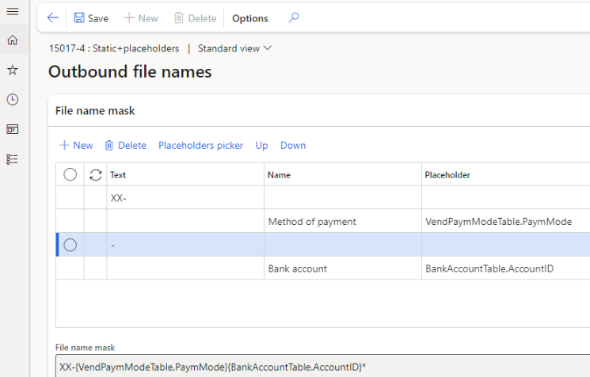
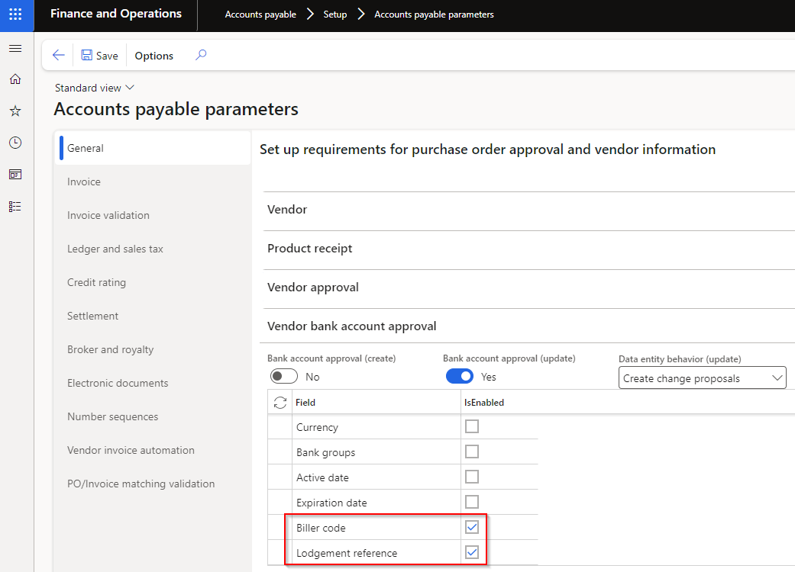
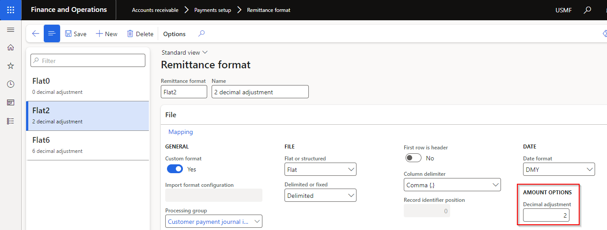

---
# required metadata

title: Finance Utilities
description: Finance Utilities - Release notes
author: Monica du Toit
manager: Pontus Ek
ms.date: 2024-12-06
ms.topic: article
ms.prod: 
ms.service: dynamics-ax-applications
ms.technology: 

# optional metadata

ms.search.form:  
audience: Application User
# ms.devlang: 
ms.reviewer: Monica du Toit
# ms.tgt_pltfrm: 
# ms.custom: ["21901", "intro-internal"]
ms.search.region: Global
# ms.search.industry: [leave blank for most, retail, public sector]
ms.author: Monica du Toit
ms.search.validFrom: 2016-05-31
ms.dyn365.ops.version: AX 7.0.1
---

# Release notes
This document describes the features that are either new or changed in the release version mentioned.

# Version compatibility
The matrix shows the DXC build versions compatiable for Microsoft versions and builds.  
If blank: investigations are ongoing.  

D365 Version	  | Any issues found in testing?	  | Product version tested
:--       	  |:--           			  |:--
Product version: 10.0.40   App build: 10.0.1935.5	  | • No functional issues   • Build error fixed in 17981 | • Functional: 10.0.37.2024032522   • Build error fixed in: 10.0.37.202405302
Product version: 10.0.41   App build: 10.0.2015.16	  | Yes - 18802	          | Fix available in 10.0.40.202409162
Product version: 10.0.42   App build: 10.0.2095.13	  | No	          | DXC Finance Utilities 10.0.40.2024091931   DXC ABN Validation 10.0.40.2024091931   DXC Encryption 10.0.40.202409162

### Microsoft deprecation notice

[Microsoft notice](https://learn.microsoft.com/en-us/dynamics365/fin-ops-core/fin-ops/get-started/removed-deprecated-features-platform-updates#feature-deprecation-effective-october-2024)
- **Likely to affect**: Companies that uses **Database** credential type for their **Azure blob** connections. These connections can be used to import bank statements and/or export electronic reporting format files.  
- **Status**: Rollout for the change by Microsoft begins in **October 2024** in a phased manner. Changes will be backported to **10.0.41 (PU65)** and all later releases.   
- **What do you need to do if affected**: 
	- If decide to use **Blob Service SAS URL** in Key vault:
		- Step 1 - Ensure Finance Utilities version 10.0.40.202409192 is deployed . If using **Connection string** Key vaults, older Finance Utilities versions should be fine.
		- Step 2 - Create Blob service SAS URL in Azure portal - [User guide](https://learn.microsoft.com/en-us/azure/storage/common/storage-sas-overview)
		- Step 3 - In **Key vault parameters** create a Secret using the value created in step 2.
		- Step 4 - Change all applicable **Azure blob** connections:   
			• Credential type: Key Vault  
	 		• Connection string: Secret setup in step 3
    - If decide to use **Connection string** in Key vault:
		- Step 1 - If using **Connection string** Key vaults, older Finance Utilities versions should be fine. Not required to upgrade to 10.0.40.202409192
		- Step 2 - Create Connection string in Azure portal
		- Step 3 - In **Key vault parameters** create a Secret using the value created in step 2.
		- Step 4 - Change all applicable **Azure blob** connections:   
			• Credential type: Key Vault  
	 		• Connection string: Secret setup in step 3

#### Features not yet supported

Feature	| 10.0.41 Feature state
:--       	|:--		
**Time zone for importing bank statements using Electronic reporting**   Finance utilities doesn't currently support converting date/time fields within the custom bank statement format | Mandatory
**Modern bank reconciliation** | 

# Current version

### Release 10.0.40.20241204

DXC Finance Utilities 10.0.40 runs on the following Microsoft releases

Base	  | Version	  | Release
:--       |:--            |:--
Microsoft Dynamics 365 application	| 10.0.40 10.0.1935.92	  | [What’s new or changed in Dynamics 365 application version 10.0.40](https://docs.microsoft.com/en-us/dynamics365/finance/get-started/whats-new-changed-10-0-40)
Microsoft Dynamics 365 application	| 10.0.41	  | [What’s new or changed in Dynamics 365 application version 10.0.41](https://docs.microsoft.com/en-us/dynamics365/finance/get-started/whats-new-changed-10-0-41)
Microsoft Dynamics 365 application	| 10.0.42 	  | [What’s new or changed in Dynamics 365 application version 10.0.42](https://docs.microsoft.com/en-us/dynamics365/finance/get-started/whats-new-changed-10-0-42)

#### Build 10.0.40.202412041

<ins>New features</ins>

Number	  	| Module	| Functionality	  	| Description
:--       	|:--     	|:--	         	|:--
18867		| Various	| IRD number validation	| Modulus 11 digit check, length, digit separator validation for New Zealand IRD numbers.   Supports format xxx-xxx-xxx and xxxxxxxxx.   This option is enabled by allocating the applicable country, for example NZL, on the Legal entity.     Examples:   • Incorrect number / Check digit: Expecting check digit 9, but found 8 for IRD no. 086689918   •  Not a number format/incorrect separator: Invalid IRD number format. It should only contain digits having format xxx-xxx-xxx or xxxxxxxxx.   • Length: Invalid IRD number length, IRD number should be 9 digits long.        
18875		| Data management	| ABN validation	| Data entities added
19026		| Organization administration	| ABN validation review	| Where ABN validation is enabled for the legal entity, users can use new button **Change history** to view changes made in D365 for each ABN.          
19549		| Organization administration	| ABN validation review	| Enabled the following buttons: New and Delete.   Added the following buttons: ABN lookup and ABN status   
20197		| Accounts payable	| Self billing invoicing   Recipient-Created Tax Invoice (RCTI) | Ability to automatically create vendor invoices after a product receipt.   The invoice can be automatically created at the same time of product receipt, or split/consolidate using the periodic task.     The periodic task split/consolidate options include:   • Product receipt   • Purchase order   • Invoice account   • Receipt date     Post options:   • **Do not post** - Created invoice is not posted and remains as pending vendor invoice   • **Post** - Created invoice is automatically posted. If post failed, it will remain as pending vendor invoice   • **Post and print** - Created invoice is automatically posted. If post failed, it will remain as pending vendor invoice. The posted invoice is also automatically printed/sent as per Print management destination. The following print management destination options are supported: Smart Send (where licensed,  Email and Electronic reporting export connections     [Setup](Setup/ACCOUNTS-PAYABLE/Self-billing-invoicing.md)   [Processing](Processing/Accounts-Payable/Self-billing-invoicing.md) 
20304		| Accounts payable	| Method of payment - BPAY	| Payment control **Payment ID** and Payment attributes **Payment ID** is still defaulted to Yes, but now no longer disabled
17514	| DXC License manager	| Licensing | New DXC License manager 10.0.40.202412041. See [Release notes](../LMG/Release-notes.md#d365-finance-and-operations) for more detail.
20389	| DXC Connections	| All Azure connections | New DXC Connections 10.0.40.202412041.   See [Release notes](../CONNECTIONS/Release-notes.md) for more detail.

<ins>Bug fixes</ins>

Number	  	| Module	| Functionality	  	| Description
:--       	|:--   		|:--	           	|:--
19459		| Cash and bank management	| Reconciliation matching rules - Offset type Ledger	| When entering new Offset account number, limited to only **Main accounts** (no financial dimensions). Offset financial dimensions needs to be entered Financial dimensions > Offset account
19527		| Various	| ABN validation	| Fix to **From date** for _Cancelled_ GST records
20187		| Accounts payable	| BPAY	| When overriding the vendor bank's default **lodgement reference** on a BPAY method of payment invoice and manually selecting the invoice for settlement on the payment journal line, the default lodgement reference wasn't overridden by the actual lodgement reference on the invoice. This issue only applied to manual settlement, not payment proposal process.
	

# Deprecated features

This section describes the features that have been removed, or planned to be removed from a Finance utilities version.

### Vendor bank account change workflow
- Reason for deprecation/removal - Replaced by D365 feature from 10.0.32 called 'Vendor bank account change proposal workflow' / 'Supplier bank account change proposal workflow'. [Learn more](https://learn.microsoft.com/en-gb/dynamics365/finance/accounts-payable/vendor-bank-account-workflow)
- Impact - Removal of the following fields in Accounts payable parameters FastTab 'Vendor approval':
	- Bank account number
	- Bank account BSB
	- Bank account biller code (Finance utilities field)
	- Bank account lodgement reference (Finance utilities field)
	- Bank account bank group
	- Bank account SWIFT code
	- Bank account IBAN
	- Bank account active date
	- Bank account expiration date
- Notice date - 24 July 2023
- Status - Completed in 10.0.36.202311161
> Note: The Finance utilities fields (Biller code and Lodgement reference) have been added to standard 'Vendor bank account approval' FastTab in Accounts payable parameters in Finance Utilities version 10.0.35.202307311.

### New bank statement transaction - Posting date
- Finance Utilities functionality - Option to post **new** bank statement transaction at either **Today's date** or **Statement transaction date** (Statement's To date)
- Recommended process: Feature 'New voucher and date for new transactions in the advanced bank reconciliation bank statement' is automatically enabled from 10.0.36. The feature automatically sets new 'Cash and bank management parameters' field 'Set the booking date as default accounting date for new transactions' to _Yes_. Select applicable option in this new field to set the default accounting date for new transactions:
	- Yes: Bank statement line booking date
 	- No: Bank statement import date 
- Reason for deprecation/removal - Feature 'New voucher and date for new transactions in the advanced bank reconciliation bank statement' was introduced in 10.0.31. In 10.0.35 MS has updated the feature which has resulted in a breaking change for Finance Utilities Posting date functionality. From 10.0.36 this feature is enabled by default.
- Impact - Removal of the following fields & functionality:
	- Posting date default on bank account  
	- Posting date option on importing bank statement  
 	- Posting date on bank reconciliation  
- Notice date - 4 September 2023
- Status - Completed in 10.0.36.202311161

  

# Previous version(s)

Approximately one year of previous versions are included below.

### Release 10.0.40.20240919

#### Build 10.0.40.2024091941
Release date: 19 November 2024

<ins>Bug fixes</ins>

Number	  	| Module	| Functionality	  	| Description
:--       	|:--   		|:--	           	|:--
19934   20173		| Cash and bank management	| Mark as new - offset to intercompany account	| 1. Fix to related vouchers for intercompany vouchers.   2. Fix to financial dimensions, as per below. This also resolves the incorrect warning where a financial dimension is used for intercompany offset, but suspended for bank recon's legal entity.   
20177		| Cash and bank management	| Mark as new | Blank distribute amount
20180		| Cash and bank management	| Bank statement | New Security privilege 'Maintain vouchers to be reversed' added to DFUBankStatementReversalDialog. Added to std duty 'Enable bank management process'
20184		| Cash and bank management	| Mark as new - offset to intercompany account with tax	| Where the intercompany offset type ledger included tax, the tax was incorrectly posted in bank recon's legal entity. Tax is now posted with the expense/income in the intercompany legal entity.

#### Build 10.0.40.2024091931
Release date: 28 October 2024

<ins>Bug fixes</ins>

Number	  	| Module	| Functionality	  	| Description
:--       	|:--   		|:--	           	|:--
19587		| Cash and bank management	| Reconciliation matching rules - offset to intercompany customer and settling invoice | Issue with finding the intercompany invoice
19571		| Cash and bank management	| Mark as new - offset to same bank account | Missing subledger entry when offsetting to same bank account. Issue came from 18692 in release 10.0.38.202408071
19576		| Cash and bank management	| Mark as new - offset to intercompany account	| Offset ledger, customer and vendor not posted in Intercompany legal entity

#### Build 10.0.40.202409192
Release date: 3 October 2024

<ins>Bug fixes</ins>

Number	  	| Module	| Functionality	  	| Description
:--       	|:--   		|:--	           	|:--
19353		| Various	| Azure connections	| Fix to **Azure blob** connection types using **Shared access signature (SAS)** to access Azure Blob Storage at account level.   Fix for error: "**No valid combination of account information found**"   Applicable to versions 10.0.40.202409162 & 10.0.40.202409191   • Cash and bank management > Setup > Advanced bank reconciliation setup > Financial utilities   • Organisation administration > Electronic reporting > Electronic reporting export connections. 

#### Build 10.0.40.202409191
Release date: 19 September 2024

<ins>New features</ins>

Number	  	| Module	| Functionality	  	| Description
:--       	|:--     	|:--	         	|:--
18827		| Cash and bank management	| Reconciliation matching rules - offset to customer	| New option **Auto-post and transfer customer payment journal** enables customer payment journal to be posted and any error lines transferred to a new unposted journal (example stopped customer). Both customer payment journals' **Document** will refer to the Bank reconciliation.   
19151		| Cash and bank management	| Reconciliation matching rules - data entity	| Field 'Description mask' added to data entity
18837		| Accounts payable	| Payments report | Use Vendor bank account's BPAY **Biller code** and **Lodgement reference** fields where payment line's method of payment **BPAY method of payment** is _Yes._   [User guide](Processing/Accounts-Payable/Vendor-payments.md#payments-report)     

### Release 10.0.40.20240916

#### Build 10.0.40.202409162
Release date: 16 September 2024  

<ins>New features</ins>

Number	  	| Module	| Functionality	  	| Description
:--       	|:--     	|:--	         	|:--
18870		| Various	| ABN lookup	| New field **Search by ABN** available in **ABN lookup**. When set to:   • No: Search by Company name   • Yes: Search by ABN   
18851		| Various	| ABN status	| Where the GST is **Cancelled** for an ABN, the **From date** will be obtained from Historical details to indicate from which date the GST has been cancelled.   
18987		| Various	| ABN / TaxVatNumTable	| New fields added to TaxVatNumTable:   • Created by   • Created date and time   • Modified by   • Modified date and time   • Reviewed date
18509		| Accounts receivable	| AR Utilities	| Ability to obtain part of a field in the remittance file, by using **Field format** on below fields:   • Customer reference   • Tax invoice   [User guide](Setup/ACCOUNTS-RECEIVABLE/Remittance-format.md#field-format)         
19087		| Various	| Azure connections	| Azure dll moved to new model called DXCConnections.   DXC Connections release 10.0.40.202409192 - [Release notes](../CONNECTIONS/Release-notes.md)
19023		| Accounts payable	| Sundry method of payment	| Allow Generic electronic Export formats where Sundry method of payment is set to Yes.

<ins>Bug fixes</ins>

Number	  	| Module	| Functionality	  	| Description
:--       	|:--   		|:--	           	|:--
18984		| Organisation administration	| ABN validation review	| When **Reviewed** changes from _Yes_ to _No_ by an update to the ABN record, the **Reviewed by** used to still store the previously reviewed by user which is not valid since the record is not reviewed anymore.
19014		| Cash and bank management | Web API import & DXC Encryption	| Added a check on warning for files imported via WebAPI . If file is empty, a warning will be added to the batch job logs and no files will be added for further process of mapping from file to BankStatement tables.   In addition to this, a check and warning has been added in the DXC Encryption model code. If an empty is received for decryption, a warning will be displayed to the user to indicate file stream is empty.   New DXC Encryption version 10.0.41.202409161
18802		| Various	| Azure connections	| Unable to find manual secret value

### Release 10.0.38.20240823

#### Build 10.0.38.202408232
Release date: 28 August 2024  

<ins>Bug fixes</ins>

Number	  	| Module	| Functionality	  	| Description
:--       	|:--   		|:--	           	|:--
18893		| Cash and bank management	| Bank statement import via Web API with decryption	| Fix for error 'This stream does not support seek operations. Batch task failed: NotSupportedException'

#### Build 10.0.38.202408231
Release date: 23 August 2024  

<ins>Bug fixes</ins>

Number	  	| Module	| Functionality	  	| Description
:--       	|:--   		|:--	           	|:--
18858		| Cash and bank management	| Bank statement import with decryption	| Error decrypting ER bank statement formats

### Release 10.0.38.20240807

#### Build 10.0.38.202408071
Release date: 7 August 2024  

<ins>Bug fixes</ins>

Number	  	| Module	| Functionality	  	| Description
:--       	|:--   		|:--	           	|:--
18347		| Cash and bank management | Bank accounts | Only enable field 'Include balance line in record count' when field 'Extra balance line on EFT' is enabled.
18550		| Cash and bank management | Bank reconciliation	| Disable button 'Match id' in Bank reconciliation Worksheet when Financial utilities parameter field 'Auto assign Match Id' is set to _Yes_. Else it errors with 'No statement lines have been marked'. Clicking Match Id is unnecessary as the Match id will automatically be assigned when user clicks button 'Match' in the Bank reconciliation Worksheet.
18692		| Cash and bank management | Bank reconciliation	| When feature 'Enable posting of new transactions in bank reconciliation' is enabled, the ability to post mark new transactions are available in the Bank reconciliation Worksheet. If user used this posting, and also posted the bank statement, a duplicate mark new transaction was posted.   This was only relevant for offset types Customer (when manually marked as new in Recon - not via recon rule that creates customer payment journal), Vendor or Bank.
18689		| Organisation administration	| ABN validation report	| Previously when running report 'ABN validation' the API was run for each vendor/customer with an ABN allocated. Since the fields are now stored on the TaxVatNumTable the report will now not run the API anymore. The relevant fields on the TaxVatNumTable can be updated to current Australian Business Register data by either:   • Organisation administration > Periodic > Update ABN validation   • 'Run update' on 'Organisation administration > Enquiries and reports > ABN validation review. 
18158		| Various 	| SFTP Connection | PR fixes to 18158 SSH key vault Azure blob storage

### Release 10.0.37.20240625

#### Build 10.0.37.202406251
Release date: 25 June 2024  

<ins>Manual steps required</ins>
- If using DXC encryption / decryption, please see 17274. Required to update new field **Counter party's public key** with the applicable key.

<ins>New features</ins>

Number	  	| Module	| Functionality	  	| Description
:--       	|:--     	|:--	         	|:--
18126		| Accounts payable	| Generate file per payment line	| New option called **Generate file per payment line** on **Methods of payment** for _Electronic reporting export formats_.   When set to Yes, the vendor payment's **Generate payments** will create an EFT file per journal line.   
17230		| Various 	| Azure Connection	| Ability to use **Azure SAS Storage account level token** for Connection string on Azure connections.    Applicable to:   • Cash and bank management > Setup > Advanced bank reconciliation setup > Financial utilities connections   • Accounts receivable > Payments setup > Financial utilities connections (AR utilities feature)   • Organization administration > Electronic reporting > Electronic reporting export connections
18158		| Various 	| SFTP Connection	| New **Credential type** option **Private key** provides the option to store SSH key file in Azure, setup in D365 as Key vault parameter and use on Finance utilities SFTP connection.   Applicable to:   • Cash and bank management > Setup > Advanced bank reconciliation setup > Financial utilities connections   • Accounts receivable > Payments setup > Financial utilities connections (AR utilities feature)   • Organization administration > Electronic reporting > Electronic reporting export connections     
17274		| Organization administration | DXC encryption parameters	| **Public key** (sender's public key) and **Receiver's public key** replaced with new field **Counter party's public key**.   Note: Manual step required to update new field with the applicable key.
18149		| Budgeting	| Import budget | Ability to **Generate template** based on setup on **Budget utilities parameters**:   • Number of months   • Dimension format   

<ins>Bug fixes</ins>

Number	  	| Module	| Functionality	  	| Description
:--       	|:--   		|:--	           	|:--
18174		|  Cash and bank management	| Reconciliation matching rule set - Customer offset type | Where the Reconciliation matching rule set contained:   • Multiple **Mark new transactions** rules offsetting to **Customer** and   • Set to automatically post the journal and   • One of the rules failed to post the journal (for example customer was stopped for payments)   The subsequent rules were not run.
18202		| Accounts receivable	| Interest notes - Due date	| When AR parameter field 'Use customer payment terms' for Interest notes is set to Yes, the Due date correctly included payment terms for the interest note in Customer transactions, but not on 'Settle transactions' or 'Detailed due date list report'.

### Release 10.0.37.20240530

#### Build 10.0.37.202405302
Release date: 30 May 2024  

<ins>New features</ins>

Number	  	| Module	| Functionality	  	| Description
:--       	|:--     	|:--	         	|:--
17215		| Various 	| Azure Connection	| Replace deprecated [Microsoft.WindowsAzure.Storage](https://learn.microsoft.com/en-us/dotnet/api/overview/azure/storage/windowsazurestorage%28deprecated%29?view=azure-dotnet-legacy) with [Azure.Storage.Blobs](https://learn.microsoft.com/en-us/azure/storage/blobs/storage-blob-dotnet-get-started?tabs=azure-ad).    Applicable to:   • Cash and bank management > Setup > Advanced bank reconciliation setup > Financial utilities connections   • Accounts receivable > Payments setup > Financial utilities connections (AR utilities feature)   • Organization administration > Electronic reporting > Electronic reporting export connections     DXC_AzureClient 2024.05.30.1
16595		| Various	| Error messages	| Improved error messages for:   • Electronic reporting export connections - for errors with setup when generating ER file.   • Run reconcilation matching rule that can't find the customer account - include value of bank statement field with issue
N/A		| DXC License	| Licensing		| New DXC License model 10.0.37.202405231. See [Release notes](../LMG/Release-notes.md) for more details.

<ins>Bug fixes</ins>

Number	  	| Module	| Functionality	  	| Description
:--       	|:--   		|:--	           	|:--
17981		| Accounts payable | Pending invoice	| 10.0.40 build error caused by missing reference for the ProcessAutomation Model which is now used by the VendInvoiceInfoTable.   Used to determine whether the Pending invoices button is enabled/disabled in the Vendor Purchase Invoice form.
17990		| Cash and bank management	| Reconciliation matching rule - Customer offset type using Customer references | The created customer payment journal uses the first customer account for all the found lines
18014		| ABN validation	| Security	| New privileges added to access ABN lookup and ABN status:   • ABN Validation   • Maintain ABN Status   •  Maintain ABN validation lookup   • Maintain ABN validation review   • View ABN Status   • View ABN validation lookup   • View ABN validation review
17998		| ABN validation	| Rename objects	| Rename objects ending with DXC_Extension:   • TaxVATNumTableForm_DXC_Extension   • TaxSalesTaxProcessReferenceDataInquire.DXC_Extension   • TaxSalesTaxTransactionStatusInquire.DXC_Extension   • TaxSalesTaxTrnStatusInquirWithoutTaxPrv.DXC_Extension   • TaxVATNumTable.DXC_Extension
18018		| Various   		| Rename objects	| Rename objects ending with DXC_Extension:   • BankStatementFormatForm_DXC_Extension   • BankChequeTableForm_DXC_Extension   • VendPaymMode_DXC_Extension   • BankTreasurerWorkspace_DXC_Extension   • VendorPaymentHistory_DXC_Extension   • BankReconciliationMatchRule_DXC_Extension   • CustPaymMode_DXC_Extension   • BankStatementTableForm_DXC_Extension

### Release 10.0.37.20240325

#### Build 10.0.37.2024032531
Release date: 16 May 2024  

<ins>New features</ins>

Number	  	| Module	| Functionality	  	| Description
:--       	|:--     	|:--	         	|:--
17524		| Various	| SFTP connection	| Upgrade SFTP SSH.NET to latest [2024.0.0](https://github.com/sshnet/SSH.NET/releases/tag/2024.0.0) release. Applicable to:   • Cash and bank management > Setup > Advanced bank reconciliation setup > Financial utilities connections   • Accounts receivable > Payments setup > Financial utilities connections (AR utilities feature)   • Organization administration > Electronic reporting > Electronic reporting export connections

<ins>Bug fixes</ins>

Number	  	| Module	| Functionality	  	| Description
:--       	|:--   		|:--	           	|:--
17966		| Accounts receivable	| Generate payments | Fix for error 'Root element is missing', when generating a payment using a non ER Export format.

#### Build 10.0.37.2024032522
Release date: 26 April 2024  

<ins>New features</ins>

Number	  	| Module	| Functionality	  	| Description
:--       	|:--     	|:--	         	|:--
17385		| Cash and bank management	| Reconciliation matching rule | Ability to set a **Description** mask for Mark new transactions for offset types **Ledger, Vendor and Bank**.   Related to 17290 that added this functionality for offset type Customer.    **Editor** provides the ability to set a combination of static fields and placeholders:   • Currency   • Description   • Amount   • Document number   • Entry reference   • Bank statement transaction code   • Reference No.   • Related bank account   • Name (Trading party)   • Bank account   • Bank account number   • Bank groups   Note: If File name mask is not populated, the Bank statement line's Description will be written to new transaction's Description.   
17724		| Licensing	| N/A			| Improvements to licensing - see [Licensing release notes](../LMG/Release-notes.md#release-10037202404262) for detailed information.

<ins>Bug fixes</ins>

Number	  	| Module	| Functionality	  	| Description
:--       	|:--   		|:--	           	|:--
17633		| Accounts receivable	| Interest notes - Due date | When AR parameter setting 'Use Customer payment terms' was set to _Yes_, it resulted in incorrect due dates for Free text invoices.   Only relevant to release 10.0.36.202403251
17448		| Accounts payable	| Method of payment - EFT file name Placeholders | Editor Placeholder picker displayed Bank statement fields added for Reconciliation matching rule's Description mask.   Only relevant to release 10.0.36.202403251
17479		| Accounts receivable	| Method of payment - EFT file name Placeholders | Editor Placeholder picker displayed Vendor's Method of payment and Description. Updated to use Customer for these two fields.   Only relevant to release 10.0.36.202403251

#### Build 10.0.36.202403251
Release date: 25 March 2024  

<ins>New features</ins>

Number	  	| Module	| Functionality	  	| Description
:--       	|:--     	|:--	         	|:--
17092		| Accounts payable   Accounts receivable	| ABN and GST validation	| _Only applicable to Australia and only visible where ABN validation is enabled for the Legal entity_   • New fields added to TaxVatNumTable:   - **Status**: ABN status for example Active or Cancelled   - **Entity type**: Entity type for the ABN, for example 'Australian Private Company'   - **GST from**: Populated where the ABN is registered for GST *   - **GST to**: Populated where the ABN is registered for GST *   - **GST registered**: Set to _Yes_ where 'GST to' date is in the future *       * The three new GST fields have also been added to the **ABN status** dialog.      Above new fields are updated to current government data when running either:   • **Update ABN validation** periodic task   • **Run update** on ABN validation review form   • When adding new records via **ABN lookup**   [User guide](Processing/ABN/ABN-lookup-and-validation.md)
17159   17233 | Accounts payable   Accounts receivable | ABN validation | _Only applicable to Australia and only visible where ABN validation is enabled for the Legal entity_   New form **ABN validation review** for users to review new/updated ABN records. For example an ABN is not registered for GST anymore.   Select applicable record(s) and select **Mark as reviewed** to update their reviewed status.   **Run update** can be used to run the web service to update ABNs with current data from the Australian Business Register.   Update can also be run via 'Organization administration > Periodic > **Update ABN validation**   
17286		| Accounts payable	| ABN validation | _Only applicable to Australia and only visible where ABN validation is enabled for the Legal entity_   Ability for users to check the current ABN and GST status for a vendor while entering an invoice.   **ABN status** button is enabled when the 'Tax exempt number'/'ABN' is populated for the vendor invoice line.    
16924		| Organisation administration | Electronic reporting export connections | Log functionality added   
17248		| Cash and bank management   Organisation administration | • Financial utilities connections   • Electronic reporting export connections | New Connection type option **API Endpoint**.   Can thus now import bank statements as an inbound web service or export ER files as an outbound web service.   Also works with Azure function.   [Import user guide](Setup/CASH-AND-BANK-MANAGEMENT/Finance-utilities-connections.html#api-endpoint)   [Export user guide](Setup/ACCOUNTS-PAYABLE/Save-electronic-reporting-file-to-secure-location.html#step-1---setup-electronic-reporting-export-connections)   [Web API Endpoint Technical guide](Technical/Web-API-Endpoint.md)
17290		| Cash and bank management	| Reconciliation matching rule | Ability to set a **Description** mask for Mark new transactions.   This release includes only **Customer** offset types. Roadmap: include the other offset types Vendor, Bank and Ledger.   **Editor** provides the ability to set a combination of static fields and placeholders:   • Currency   • Description   • Amount   • Document number   • Entry reference   • Bank statement transaction code   • Reference No.   • Related bank account   • Name (Trading party)   • Bank account   • Bank account number   • Bank groups   Note: If File name mask is not populated, the Bank statement line's Description will be written to new transaction's Description.         
16827		| Accounts receivable	| EFT file name on Method of payment	| Ability to set EFT file name for Customer payment files (direct debits) on the Method of payment.   [User guide](Setup/ACCOUNTS-RECEIVABLE/Customer-payments.md)
16600		| Accounts payable	| Vendor payment journal | When the vendor payment is generated, the **Export file name** displayed on the Generate payments dialog is written to the relevant vendor payment journal lines' new field called **Export file name**.   Note: This does not yet include file names generated by Electronic reporting config.   
17422		| N/A		| N/A |  Update to **Table groups** to support "transaction" types being truncated in copy environment feature via Power platform admin center.

<ins>Bug fixes</ins>

Number	  	| Module	| Functionality	  	| Description
:--       	|:--   		|:--	           	|:--
16997		| Accounts payable	| EFT file name editor on Method of payment	| Refresh required to save updates to the file name using Editor   
16827		| Accounts receivable | EFT file name on Method of payment | If the same payment method PaymMode exists in the Accounts payable (AP) module, the EFT file name setup from the AP method of payment was used
17063		| Accounts receivable | Interest notes - Due date | Due date now updated before the transaction records are created.   Resolves error: "Cannot edit a record in Customer transactions (CustTrans). An update conflict occurred due to another user process deleting the record or changing one or more fields in the record."
17119		| Accounts payable   Accounts receivable	| ABN lookup	| Fix to 'Company name' in Search results
16925		| Organisation administration	| Electronic reporting jobs	| When using an Electronic reporting destination with document type in conjunction with Electronic reporting export connection, the record created in the Electronic reporting jobs will now also contain:   • Document handling attachment - ensure your file extension is added to supported File types in Document management parameters   • Field 'Files' populated with the file name.
17012		| Cash and bank management	| Reverse mark as new transaction	| Support added for reversing **mark as new** transactions offsetting to **vendor, bank or customer** within the same legal entity.   15693 resulted on an incorrect sign on the reverse transaction on the bank, vendor and customer   Supports features:   • Enable bank reconciliation reversal even new transactions exist in posted bank statement   • Reverse posted bank statement with new transactions  
17126		| Cash and bank management	| Reconciliation matching rule	| When used to create automatically posted Customer dishonour payments, the automatically matching in the Bank reconciliation failed. 
17437		| Cash and bank management	| Bank statement periodic import | Archive issue when connection has high latency. File deleted before it could copy to Archive. Change: Before delete the result of copy is awaited and retried for 1 seconds 3 times before marking as an exception.

### Release 10.0.36.20231116

#### Build 10.0.36.2023111671
Release date: 2 February 2024  

<ins>New features</ins>

Number	  	| Module	| Functionality	  	| Description
:--       	|:--     	|:--	         	|:--
16332		| System administration 	| Business event for electronic reporting export | New Business event **Electronic reporting file exported to azure blob**. Option to create an event when exporting ER file to Azure Blob via 'Electronic reporting export connections'.
16596		| Organization adminstration	| Electronic reporting export connection | 'Validate connection' functionality added

<ins>Bug fixes</ins>

Number	  	| Module	| Functionality	  	| Description
:--       	|:--   		|:--	           	|:--
16873		| Accounts payable	| Payment advice print	| Finance utilities was referencing 'ECL_BankPaymAdviceVendV2' report when printing Vendor Payment advice. When the report wasn't deployed to an environment, printing would error with 'Parameter _reportName cannot be null or empty'. Reference to the ECL report has been removed.
16897		| Accounts payable   Accounts receivable	| ABN validation	| Only applicable to 10.0.36.2023111661. When ABN validation was active for the legal entity, any changes on the vendor/customer resulted in ABN validation dialog popping up.
16959		| Various	| - Financial utilities connections   - Electronic reporting export connections	| Increase EDT for usernames, passwords (sftp, ftp) and storage account name, storage account key (Azure blob)
16976		| Accounts reveivable	| Interest note - Due date	| Waive, reinstate and reverse of interest notes also now utilize 'Use customer payment terms' option.

#### Build 10.0.36.2023111661
Release date: 12 January 2024  

<ins>Bug fixes</ins>

Number	  	| Module	| Functionality	  	| Description
:--       	|:--   		|:--	           	|:--
16822   16754 | Data management | ABN validation - Import entities TaxVATNumTable & VendVendorV2	| ABN validation GUI popup wrapped around a condition for data import scenarios. Also removed the previous 'Skip validation' method when importing Vendors entity.   When ABN validation is enabled for the legal entity and the entities imported, ABN validation will occur without the GUI popup. Records with valid ABNs will be imported and only invalid ABN staging records will error.

#### Build 10.0.36.2023111651
Release date: 21 December 2023  

<ins>Bug fixes</ins>

Number	  	| Module	| Functionality	  	| Description
:--       	|:--   		|:--	           	|:--
16794		| Accounts payable	| Vendor approval	| Related only to earlier versions of 10.0.36.20231116 - deprecating Vendor bank account approval.   Resulted in values not being retained for client extended fields in Vendor approval.

#### Build 10.0.36.2023111642
#### Build 10.0.35.2023111641
Release date: 14 December 2023  

<ins>Bug fixes</ins>

Number	  	| Module	| Functionality	  	| Description
:--       	|:--   		|:--	           	|:--
16758		| Accounts payable	| Vendor approval	| Proposed changes disregarded for changes to standard vendor fields. 
16765		| Accounts payable	| Method of payment   EFT file name Editor	| Label fix and saving of changes to file name mask.

#### Build 10.0.36.2023111631
Release date: 8 December 2023

<ins>Bug fixes</ins>

Number	  	| Module	| Functionality	  	| Description
:--       	|:--   		|:--	           	|:--
16747		| N/A		| Deployment		| Bug fix only applicable to 10.0.36.2023111621, which included unit tests.   To remove unit tests, use the following [instructions](https://learn.microsoft.com/en-us/dynamics365/fin-ops-core/dev-itpro/deployment/uninstall-deployable-package) to remove the package/uninstall unit tests.

#### Build 10.0.36.2023111621
#### Build 10.0.35.2023111622
Release date: 30 November 2023   

<ins>New features</ins>

Number	  	| Module	| Functionality	  	| Description
:--       	|:--     	|:--	         	|:--
15693		| Cash and bank management	| Reverse mark as new transaction	| Support added for reversing **mark as new** transactions offsetting to **vendor, bank or customer** within the same legal entity.   Supports features:   • Enable bank reconciliation reversal even new transactions exist in posted bank statement   • Reverse posted bank statement with new transactions  

<ins>Bug fixes</ins>

Number	  	| Module	| Functionality	  	| Description
:--       	|:--   		|:--	           	|:--
16584		| Accounts payable	| Vendor bank account approval	| Proposed changes disregarded for changes to standard vendor bank account fields.

#### Build 10.0.36.202311161
#### Build 10.0.35.202311161
Release date: 16 November 2023   

<ins>Deprecated</ins>

Number	  	| Module	| Functionality	  	| Description
:--       	|:--     	|:--	         	|:--
15394		| Accounts payable	| Vendor bank account change workflow	| Deprecate Vendor bank account fields in Vendor approval.   See [Deprecated features notice - Vendor bank account change workflow](#vendor-bank-account-change-workflow) for more details.
16002		| Cash and bank management	| Mark as new transaction's Posting date	| Deprecate **Posting date** functionality for Mark as new transactions.   See [Deprecated features notice - Posting date](#new-bank-statement-transaction---posting-date) for more details.

<ins>New features</ins>

Number	  	| Module	| Functionality	  	| Description
:--       	|:--     	|:--	         	|:--
15488		| Accounts receivable	| Interest notes - Due date	| New field called **Use customer payment terms** added to **Accounts receivable parameters**  and **Credit and collections parameters** (Collections tab).   If set to _Yes_, the customer's payment terms will be used to determine Due date when posting Interest notes.   [Guide](Setup/ACCOUNTS-RECEIVABLE/Customer-parameters.md)
16039		| Cash and bank management	| Bank statement import	| **Run in the background** functionality added to **Import bank statements**    
16471		| Encryption	| | DXC encryption parameters: Rename field KeyVaultSignerPublicKey (Signer's public key) to KeyVaultReceiverPublicKey (Receiver's public key)
16401		| Accounts payable	| Vendor bank account - Lodgement reference	| Increased Lodgement reference EDT from 18 to 20
N/A		| DXC License 	| | DXC License 10.0.34.202310311 - Includes feature managed SmartSend and Core extensions

<ins>Bug fixes</ins>

Number	  	| Module	| Functionality	  	| Description
:--       	|:--   		|:--	           	|:--
16069		| Unit tests	| 	| Fix 10.0.37 build issues for Finance utilities Unit tests
16244		| Cash and bank management	| Import statement	| Code change in 10.0.37 that makes 'Bank account' mandatory when using 'Import statement for multiple bank accounts in all legal entities'
16036		| Data management	| Import data entity **Document types**	| Couldn't import the entity with Finance utilities field DFUGEREXPORTCONNECTION.   Error: 'The column ErrorCode in entity Document types has incorrect data. Please correct the data and try the import again.'

### Release 10.0.35.20230731

#### Build 10.0.35.2023073156
Release date: 14 November 2023   

<ins>Bug fixes</ins>

Number	  	| Module	| Functionality	  	| Description
:--       	|:--   		|:--	           	|:--
16460		| Cash and bank management	| Intercompany bank Mark as new transactions | 16338's change to intercompany bank mark as new, created a bank statement in the destination company to create intercompany reconciled bank transactions. This has now been changed to not create a bank statement in the destination legal entity. It now creates an unreconciled bank transaction in the destination company using the following from originating company: Debit/Credit Amount, OffsetLedgerDimension, BankTransType, OffsetTxt, OffsetCompany, OffsetAccountType, ExchRateSecond, ExchRate, CurrencyCode, Voucher, TransDate, LedgerDimension, AccountType, JournalNum

#### Build 10.0.35.2023073143
Release date: 2 November 2023   

<ins>New features</ins>

Number	  	| Module	| Functionality	  	| Description
:--       	|:--     	|:--	         	|:--
16429		| Cash and bank management	| Bank statement / reconciliation	| Update ledgers used for mark as new **Intercompany bank** transactions. Previously used  LedgerInterCompany fields CustLedgerDimension and DebitLedgerDimension, but these aren't available in the Intercompany accounting form. Now using: OriginatingDebitLedgerDimension or OriginatingCreditLedgerDimension and DestinationCreditLedgerDimension or DestinationDebitLedgerDimension.

<ins>Bug fixes</ins>

Number	  	| Module	| Functionality	  	| Description
:--       	|:--   		|:--	           	|:--
16338		| Cash and bank management	| Intercompany bank Mark as new transactions | Additions to 15578. Applicable to when a bank statement line is marked as new and offset to an **intercompany bank account**.   Previously only supported when bank statement is posted via 'Mark as reconciled' (Auto-post bank statement is set to _Yes_), and feature 'Advanced bank reconciliation improvement: enable filtering and provide separate grid for new transactions' disabled.   Now supports the feature enabled and posting the bank statement from the Bank statement page (Auto-post bank statement is set to _No_) as well.
16250		| Cash and bank management	| Import statement	| Incorrect warning message when importing bank statement and the file contains multiple bank accounts and the import parameters is filtered to one bank account that exists in the file: 'Failed to match with bank account'.   It also warned about No matching bank account found for bank accounts that doesn't exist in D365, but the import was only filtered to one specific bank account.

#### Build 10.0.35.2023073131
Release date: 4 October 2023   

<ins>Bug fixes</ins>

Number	  	| Module	| Functionality	  	| Description
:--       	|:--   		|:--	           	|:--
16114		| ABN Validation	| Customer and Vendor ABN validation	| Decouple DXCABNValidation from DXCFinanceUtilities enabling companies to remove model DXCABNValidation.

#### Build 10.0.35.2023073122
Release date: 31 August 2023   

<ins>New features</ins>

Number	  	| Module	| Functionality	  	| Description
:--       	|:--     	|:--	         	|:--
15017		| Accounts payable	| EFT file name generation	| Ability to set static values and select placeholders for EFT file name in Vendor's Method of payment   [User guide](Setup/ACCOUNTS-PAYABLE/Vendor-payments.md#eft-file-name-generation)       
15578		| Cash and bank management	| Bank reconciliation	| When bank statement line is marked as new and offset to an **intercompany bank account**, the postings will now be created as intercompany. Example:    • **Current company**: Debit I/C Receivable and Credit Bank account   • **Intercompany**: Debit Bank account and Credit I/C Payable

<ins>Bug fixes</ins>

Number	  	| Module	| Functionality	  	| Description
:--       	|:--   		|:--	           	|:--
15891		| Cash and bank management	| Bank reconciliation | Only issue in **10.0.35.202307311**.   When running matching rules, the lines are not moved to matched/new transactions
15976		| Cash and bank management	| Bank reconciliation	| When running Reconciliation matching rule offsetting to account type **Customer**, the customer payment journal line's **Approved** will now be set to _Yes_. Else the record is not available to be settled.
15899		| Accounts payable	| Payments report	| Only issue in 10.0.35.   When printing the **Payments** report in Vendor payments, every 2nd page is blank.

#### Build 10.0.35.202307311
Release date: 31 July 2023   

<ins>New features</ins>

Number	  	| Module	| Functionality	  	| Description
:--       	|:--     	|:--	         	|:--
14578		| Cash and bank management	| Bank reconciliation	| Support for manually setting offset details when enabling feature **Advanced bank reconciliation improvement: enable filtering and provide separate grid for new transactions**. This feature adds section **New transactions** in the Bank reconciliation and in 10.0.35 MS added additional button **Line details**.   Finance utilities now utilises **Line details** for the ability to manually set offset details for mark as new transactions.       _Note: Using button Cancel on Line details currently still saves any changes. Bug has been reported to Microsoft and fix will be included in 10.0.37_
14929		| Cash and bank management	| Bank statement import	| **Decimal adjustment** was limited to 5 decimals.   Have been changed to dynamic and now supports higher than 5 decimals.
14088		| Cash and bank management	| Bank statement import	- Periodic task | Currently when the periodic task **Import bank statements via financial utilities connection**'s Bank statement format's **Custom format** is:   • **Yes**: By design if there are issues with creating bank statement for any of the accounts in the file (example bank account doesn't exist in D365) , no bank statements are created and the file is moved to error path (instead of archive).   • **No**: Std creates bank statements for all valid bank accounts using the Electronic reporting configuration - we have no control over this.   **This change**: will move the file to **Error path / container** (instead of archive path) if not all bank statements could be created when using the periodic task and the bank statement format's **Custom format** is set to _No_.
15410		| Accounts payable	| Vendor bank account approval	| Support for 10.0.32 feature 'Vendor bank account change proposal workflow’ / ‘Supplier bank account change proposal workflow' which is on by default from 10.0.35.   Added the following Finance utilities fields to **Vendor bank account approval**:   • Biller code   • Lodgement reference   Note: Finance utilities includes vendor bank accounts fields in **Vendor approval**, which has now been replaced by this MS feature, and will be deprecated in the next Finance utilities release. Please migrate your vendor bank account approval setup from **Vendor approval** to **Vendor bank account approval** before the next release.   [Deprecation notice](#vendor-bank-account-change-workflow)   
14099		| Accounts receivable | AR Utilities	| Added Amount **Decimal adjustment** option to Remittance format   
N/A		| Licensing	| DXC License & DXC License manager	| New versions included:   • DXC License 10.0.34.202307311   • DXC License Manager 10.0.32.202307312

<ins>Bug fixes</ins>

Number	  	| Module	| Functionality	  	| Description
:--       	|:--   		|:--	           	|:--
14619		| Cash and bank management	| Bank statement import	- Custom formats | Ability to map non transaction record custom line codes. Previously if Opening or Closing balance custom line codes where set in **Custom line codes**, these were imported as transaction records. 
15482		| Cash and bank management	| Bank statement import	- Custom formats | When using mapped **Ending balance** field, the opening balance was added to the imported bank statement's ending balance
15199		| Cash and bank management	| Reconciliation matching rules	set | Extension to **processMatchRuleSet** to support reprocessing unmatched bank statement lines.   The issue came in where the filter criteria for each rule in the set found the same bank statement lines, but the rules used different bank statement fields to find the D365 customer account to post the customer payment journal.     Example - Reconciliation matching rule set where all the rules filters to same criteria that matches to 15 bank statement lines:   Rule 1: Uses Bank statement field **Description** to find the D365 customer account, but only 3 lines could find a D365 customer account in this field to successfully post.   Rule 2: Uses Bank statement field **Entry reference** to find the D365 customer account. The expectation would be that Rule 2 would find the remaining 12 bank statement lines and post the applicable ones, but it found 0.   Before this change, only rule 1 in the set found bank statement lines, and subsequent rules found 0.
15390		| Cash and bank management	| Bank reconciliation	| When running a **Mark new transactions** Reconciliation matching rule that:   • Posts customer payment journals and   • Financial utilities parameters **Only match posted statement lines** was set to _Yes_ and   • **No** journals were successfully posted (for example couldn't find any matching D365 customer account for all the lines)   All unmatched bank statement transactions, that matched the criteria, where moved to matched.

### Release 10.0.34.20230615

#### Build 10.0.34.202306151
Release date: 15 June 2023   

<ins>New features</ins>

Number	  	| Module	| Functionality	  	| Description
:--       	|:--     	|:--	         	|:--
14332	| Cash and bank management   Accounts receivable | Financials utilities connection |  Update to support Azure Blob Storage related method depreciation in 10.0.34.   Replaced StartCopyFromBlob with BeginStartCopy   [Obsolete API](https://learn.microsoft.com/en-us/previous-versions/azure/jj732079(v=azure.100))
12430		| Cash and bank management | Reconciliation matching rules | New field **Offset account reference bank statement field** provides the ability to use [Customer reference](Setup/ACCOUNTS-RECEIVABLE/Customer-reference.md) to find the applicable D365 customer account when running a Mark new transactions Reconciliation matching rule offsetting to customer. 
14536	| Cash and bank management	| Bank statements	| Ability to map **Ending balance** on custom bank statement formats. Where this is mapped, the imported bank statement's ending balance will be used to populate the Bank statement's ending balance field. This is useful to validate that bank statements are imported in the correct sequence.
14332	| Accounts payable	| Model reference	| Added FinTag model reference to Finance utilities
14524	| Accounts payable	| Payments report	| Added new field for Vendor's bank name

<ins>Bug fixes</ins>

Number	  	| Module	| Functionality	  	| Description
:--       	|:--   		|:--	           	|:--
14532		| Cash and bank management	| Bank reconciliation report	| Fixed Report's Txt field's ExtendedDataType to match Bank account transaction's Txt field.
14696		| Cash and bank management	| Bank statement import	- Custom formats | Issue with 88 continuation line's string size. 

### Release 10.0.31.20230518

#### Build 10.0.31.202305181
Release date: 18 May 2023   

<ins>New features</ins>

Number	  	| Module	| Functionality	  	| Description
:--       	|:--     	|:--	         	|:--
12631		| Cash and bank management	| UI updates		| • Update header on Bank accounts 'EFT parameters' to 'AP EFT parameters'   • Bank reconciliation warning log updated where the customer payment journal isn't automatically posted: "Customer payment journal % has been created successfully. Please post the payment journal manually, refresh the worksheet and manually match with the new bank transactions."

<ins>Bug fixes</ins>

Number	  	| Module	| Functionality	  	| Description
:--       	|:--   		|:--	           	|:--
14277		| Cash and bank management	| Bank statement	| Importing bank statement file that contains multiple bank accounts in different legal entity's errored with: "The bank account % must enable the parameter Advanced bank reconciliation" for bank accounts in different legal entity.
13554		| Cash and bank management	| Bank reconciliation	| From 10.0.31 when feature 'New voucher and date for new transactions in the advanced bank reconciliation bank statement' was enabled and running a mark as new reconciliation rule that offsets to Vendor, it didn't create the record in the vendor subledger.
14096		| Cash and bank management	| Reconciliation report	| Timeout on report when bank account has a large number of transactions.
14230		| Accounts receivable		| AR Utilities		| Update Error customer account logic to work with blank invoice.
14239		| Accounts receivable		| Data management	| Importing entity 'Customers V3' errored when ABN lookup is enabled.
12902		| Accounts payable		| Data management	| Importing entity 'Vendors V2' errored when ABN lookup is enabled.
14333		| Accounts payable		| Generate payments	| Only issue where the GER file is automatically saved to Azure blob storage with keyvault. Added security privilege to duty 'Maintain vendor payments'. Error: "Access denied to field Key Vault secret key (SecretKey) in table Key Vault parameters (KeyVaultParameters)."

### Release 10.0.29.20230505

#### Build 10.0.29.202305051
Release date: 5 May 2023   

<ins>New features</ins>

Number	  	| Functionality	  | Description
:--       	|:--              |:--
12644		| Customer references	| Ability to set multiple references against customers - [Setup](Setup/ACCOUNTS-RECEIVABLE/Customer-reference.md).   These references can be used in the following scenarios:   • Customer remittance file refers to a reference unique to the customer, but not an invoice number. This reference can be used to find the applicable customer account when creating the customer payment journal while importing customer remittances using the additional licensed feature AR Utilities.   • Roadmap: Reconciliation matching rules additional ability to use the customer reference to find the applicable customer account when creating the customer payment journal.
11357		| Import customer remittance file	| New licensed feature included in **AR Utilities**.   Enhancement to import customer remittance files from ftp, sftp or Azure blob storage using data entity Customer payment journal.   A wide variety of setup options allows flexibility on method to find the customer account, settlement, posting date, custom file mapping etc.   • [Import customer remittance setup](Setup/ACCOUNTS-RECEIVABLE/Customer-remittance.md)   • [Import customer remittance processing](Processing/Accounts-Receivable/Customer-remittance.md)
13907		| Financial utilities connection	| Where file is moved to **error** path/container, the Financial utilites connection's Log Level will be set to _Error_.   Set connection's **Logging level** to _Error_ and use custom alerts to be alerted when a file has been moved to error path.   
N/A		| License manager	| License manager version 10.8.32.10171   Enhanced Licensing capabilities to assist with licensing support and scaling.   **Note:** Required to upgrade all installed DXC products to at least the following versions:   • EDI 10.0.29.202305053   • Finance utilities 10.0.29.202305051   • SmartSend 10.0.29.202304142   • Core extensions 10.0.29.202304142   • DocuSign 10.0.29.202304211   • Item creation 10.0.29.202304211   •  PLM 10.0.29.202304211   • Forex 10.0.29.202305101    

<ins>Bug fixes</ins>

Number	  	| Functionality	  | Description
:--       	|:--              |:--
12857		| Data entity - Reconciliation matching rules	| Reverse changes for 11749. Removed fields added back.
12888		| Data entity - Financial utilities connections	| Fixed entities required to import Financial utilties connections
10429		| Data entity - Reconciliation matching rule 	| When importing entity, the Offset account was imported with Chart of account delimiter after the ledger account.
14093		| Reconciliation matching rules | Security: Maintain privilege added for **Copy matching rule**. Added to Duty 'Enable bank management process'.

### Archive
Older releases notes can be accessed [here](Release-notes-archive.md)

# Installation process
To align with MS best practice and to protect our IP the following applies to the release process.
- The license models DXCLicense and Sable37License will only be released as binaries as part of a deployable package. 
- We will not provide test models for the products, neither as binary or source code. 
- We will only publish the release as a deployable package. 
- Model source code can be provided at our discretion. It can be requested for debugging upgrade errors, or if required for extensions.
	- If you have been given the source code to our model for extension or debugging purpose, never make modifications directly to our models! 
	- If you need an extension point, please send an email to ECLANZProductSupport@dxc.com and request it to be implemented. 

Depending on the installation history follow one of these guides to install the new release. 
## Installation without existing installed product
1. Apply the deployable package to your environment. 
2. If you have requested any model for extension or debugging purposes. Install the model source code. 
a.	Note, once the model source code is compiled it will overwrite the binaries installed when the deployable package was applied. 

## Installation with existing installed product
If you’re installing the new release in an installation that already has a previous version of the product installed and you’re not using it for debugging or extension. We recommend that you;  
1. Remove the release product model source code from your source control, if source control is used. 
2. Apply the deployable package, installing the latest version of the product models as binaries.  
3. Check in the binaries for the models to source control, if source control is used. 

If you’re using our model source code for extension or debugging and would like to continue using it, please do the following to apply the new release with the source code. 

1. Remove product license model from your source control that is applicable to the release. You’ll find the license model in the deployable package. It will either be called DXCLicense and Sable37License. 
2. Apply the deployable package to your environment to install the latest binaries. Check in the binaries for the license model that was removed in step 1 to source control. Note, this step will also install the binaries for all the models in the new release. 
3. Install the product release model source code and check into source control. 

If you don’t follow these instructions and continue building your installation deployable package using the license model source code, the installation will continue using the same license model as before applying the release. 

## Feature management
Enable the following features in D365 Feature management:
- Finance utilities
- Finance utilities - AR utilities (additional license option)

If above feature is not visible, press **Check for updates** to refresh the feature management list.

