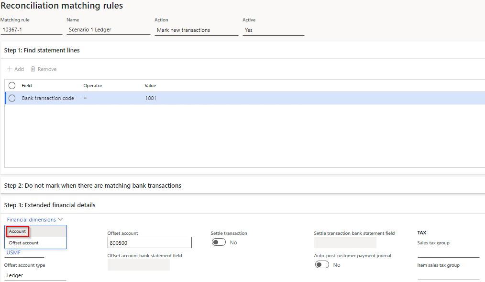
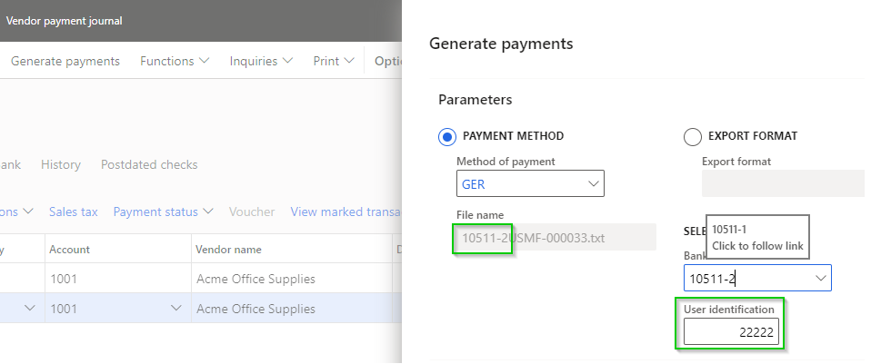

---
# required metadata

title: [Finance Utilities]
description: [Finance Utilities - Release notes]
author: [jdutoit2]
manager: Kym Parker
ms.date: 14/07/2022
ms.topic: article
ms.prod: 
ms.service: dynamics-ax-applications
ms.technology: 

# optional metadata

# ms.search.form:  [Release notes]
audience: [Application User]
# ms.devlang: 
ms.reviewer: [jdutoit2]
ms.search.scope: [Which Operations client to show this topic as help for, to be set by content strategist, see list here: https://microsoft.sharepoint.com/teams/DynDoc/_layouts/15/WopiFrame.aspx?sourcedoc={23419e1c-eb64-42e9-aa9b-79875b428718}&action=edit&wd=target%28Core%20Dynamics%20AX%20CP%20requirements%2Eone%7C4CC185C0%2DEFAA%2D42CD%2D94B9%2D8F2A45E7F61A%2FVersions%20list%20for%20docs%20topics%7CC14BE630%2D5151%2D49D6%2D8305%2D554B5084593C%2F%29]
# ms.tgt_pltfrm: 
# ms.custom: [used by loc for topics migrated from the wiki]
ms.search.region: [Global for most topics. Set Country/Region name for localizations]
# ms.search.industry: [leave blank for most, retail, public sector]
ms.author: [author's Microsoft alias]
ms.search.validFrom: [month/year of release that feature was introduced in, in format yyyy-mm-dd]
ms.dyn365.ops.version: [name of release that feature was introduced in, see list here: https://microsoft.sharepoint.com/teams/DynDoc/_layouts/15/WopiFrame.aspx?sourcedoc={23419e1c-eb64-42e9-aa9b-79875b428718}&action=edit&wd=target%28Core%20Dynamics%20AX%20CP%20requirements%2Eone%7C4CC185C0%2DEFAA%2D42CD%2D94B9%2D8F2A45E7F61A%2FVersions%20list%20for%20docs%20topics%7CC14BE630%2D5151%2D49D6%2D8305%2D554B5084593C%2F%29]
---

# Release notes
This document describes the features that are either new or changed in the release version mentioned.

# Current version

### Release 10.0.25 & 10.0.27.202207142

#### Build 10.0.25.202207142

Release date: 14/07/2022  
DXC Finance Utilities 10.0.25 runs on the following Microsoft releases

Base	  | Version	  | Release
:--       |:--            |:--
Microsoft Dynamics 365 application	| 10.0.25	  | [What’s new or changed in Dynamics 365 application version 10.0.25](https://docs.microsoft.com/en-us/dynamics365/finance/get-started/whats-new-changed-10-0-25)
Microsoft Dynamics 365 application	| 10.0.26	  | [What’s new or changed in Dynamics 365 application version 10.0.26](https://docs.microsoft.com/en-us/dynamics365/finance/get-started/whats-new-changed-10-0-26)

Number	  	| Functionality	  | Reason
:--       	|:--              |:--
10367		| Reconciliation matching rule	| Ability to set **Account**'s **Financial dimensions** on **Reconciliation matching rules** with Action **Mark new transactions**.      New posting logic for financial dimensions:   • Account is Bank   •  Offset account is Ledger, Customer, Vendor or Bank.    When new bank statement transactions with Offset account type _Ledger_, _Vendor_ or _Bank_'s are matched by using Reconciliation matching rules, the calculated financial dimensions for Account and Offset account are populated on the **Matched transaction**'s **Financial dimensions** tab and can be overriden prior 'Mark as reconciled'.   Offset account type _Customer_ creates a customer receipt journals with the calculated financial dimensions for Account and Offset account.
10511		| Vendor payments - Generate payments | Current vendor payment journal line's **Method of payment** and **Bank account** used to populate fields on **Generate payments** dialog.

<ins>Bug fixes</ins>

Number	  	| Name	          | Description
:--       	|:--              	  |:--
10511		| Vendor payments - Generate payments | Electronic reporting format: **User id** and **File name** updated if Bank account is changed on **Generate payments** dialog.   
10603		| Bank reconciliation	| Where a bank deposit slip has been cancelled the MS calculated totals are incorrect and resulted in an unmatched amount. Financial utilities unmatched amount calculation has been updated to avoid this issue.   

#### Build 10.0.27.202207142

Release date: 14/07/2022  
DXC Finance Utilities 10.0.27 runs on the following Microsoft releases

Base	  | Version	  | Release
:--       |:--            |:--
Microsoft Dynamics 365 application	| 10.0.27	  | [What’s new or changed in Dynamics 365 application version 10.0.27](https://docs.microsoft.com/en-us/dynamics365/finance/get-started/whats-new-changed-10-0-27)

Same as 10.0.25.202207142, and includes the fix for Payment advice V2 required from 10.0.27

# Previous version(s)

### Release 10.0.25 & 10.0.27.20220617

#### Build 10.0.25.202206171

Release date: 17/06/2022  

Number	  	| Functionality	  | Reason
:--       	|:--              |:--
10241		| Bank statement import - Document handling | New field **File attachment document type** added to **Financial utilities parameters**. When Type has been selected, the import file will be attached to the created bank statement(s). This applies to bank statements created with manual or periodic job import.
10293		| Financial utilities connections - Validate connection	| New button **Validate connection** added to **Financial utilities connections**. Validates:   • Connection details   • Import path   • Import archive path   • Import error path
10363		| Only match posted statement lines | New field **Only match posted statement lines** added to **Financial utilities parameters**. For example mark as new bank reconciliation rule finds three records in the bank statement, but only two of the customers exist and thus won't balance since only two lines were posted as customer payment journal lines. This option only applies to where the mark as new bank reconciliation creates and posts new customer payment journals.
 	  	| DXC License manager 10.8.32.10131	| Improvements to **DXC License manager** model

<ins>Bug fixes</ins>

Number	  	| Name	          | Description
:--       	|:--              	  |:--
10449		| Eclipse Payment advice V2 - Generate payments for BNZ file	| Fix **Print payment advice** via **Generate payments** for Eclipse Payment advice V2 report when using **BNZ Direct Credit Service (NZ)** export format on the method of payment.
10292		| Customer Bank recon matching rule - Transaction type	| When reconciliation matching rule creates and posts the customer payment journal, the transaction type was **Customer**. Transaction type has been fixed and will now be posted as **Payment**.

#### Build 10.0.27.202206172

Release date: 29/06/2022  

Number	| Functionality	  | Reason
:--	|:--		  |:--	
10341	| DXC License manager   10.8.32.10141	| New workspace **Organization administration > Workspaces > DXC support**.   Links for licensed products to:   • User guide   • Release notes   • Contact - email address for support
10284	| Eclipse Payment advice V2	| Resolves the **breaking change** with Microsoft introduced new 10.0.27 features when **Enable batch processing for bank payment advice reports** is enabled.

### Release 10.0.22.20220512

#### Build 10.0.22.202205121

Number	  | Functionality	  | Reason
:--       |:--              |:--
8461	    | Bank statement import	  | Ability to automatically import bank statements from ftp, ftps, sftp, Azure blob storage, or SharePoint
10094	    | Reconciliation matching rule – unique voucher	| New **Financial utilities parameters** field called **Populate unique voucher for each journal line**. When customer payment journal is created using the additional Finance utilities fields on **Reconciliation  matching rules** (for mark as new transactions), this new field provides options if the journal will be created with unique vouchers for each line. If new field is enabled, General ledger parameters’ **Allow multiple transactions within one voucher** doesn’t need to be enabled.
10274	    | Reconciliation matching rule – Invoice has been marked by another customer payment journal	| If **Reconciliation matching rule** for mark as new transaction are set to settle the customer invoice, and the invoice has already been marked in another open journal, D365 doesn’t allow the invoice to be selected. In this scenario the customer payment journal line will now still be created (previously didn’t) but with no invoice selected for settlement.
10152	    | GER bank statement format	| Support importing Bank statement formats using GER (Electronic reporting), and supports setting posting date (for mark as new transactions) to:   •	Statement transaction date, or   •	Today’s date

### Release 10.0.22.20220316

#### Build 10.0.22.202203161

Number	  | Functionality	  | Reason
:--       |:--              |:--
9490	    | ABN search and validation	| Ability for Australian companies to search and validate ABN for customers and vendors.
9925	    | Auto-post bank statement	| Only automatically posts bank statement when status is reconciled.
9505	    | Populate bank transaction document number	| Populating the document number in bank reconciliation’s bank transactions.   From 10.0.22 MS has removed ‘Turn off reconciliation worksheet performance enhancement’ parameter.   Not required anymore: RemoveLoadReconciliationWorksheetExtensibleFlight_KillSwitch
9688	    | Reconciliation matching rule (1:1 customer and invoice)	| Write Bank statement’s Description to Customer receipt journal. Also added the new Finance utilities fields to entities 'Reconciliation matching rules' and ‘Financial utilities parameters’

<ins>Bug fixes</ins>

Number	  | Name	          | Description
:--       |:--              |:--
9665	    | Print payment advice	| Error when feature 'Enable batch processing for bank payment advice reports’ is enabled and printing the payment advice V2 for an ECL EFT format via Generate payments in the Vendor payment journal.
9986	    | Compile errors	| PEAP 10.0.26 Compile errors   Error The Class 'ERUserParameterDataContract' is internal and is not accessible from the current module 'DXC Finance Utilities'. K:\AosService\PackagesLocalDirectory\bin\XppSource\DXC Finance Utilities\AxClass_DFUVendOutPaymHandler.xpp 78
	
### Release 10.0.18.20211210

#### Build 10.0.18.202112102

Number	  | Functionality	  | Reason
:--       |:--              |:--
1386	| Data entities		| Following entities have been added/updated:   •	Bank statement format / BankStatementFormatEntity   •	Financial utilities parameters / SAB_FinUtilParametersEntity   •	Budget utilities parameters / SAB_FinBudgetParametersEntity   •	Bank accounts / BankAccountEntity   •	Vendor bank accounts / VendVendorBankAccountEntity   •	Reconciliation matching rules / BankReconciliationMatchingRuleEntity 
8324	| Reconciliation matching rule	| Ability to create customer payment journal and settle one invoice per payment (1:1)
9629	| SAB_FinBankStatementImportBatch	| Update to class to allow **Multiple statements in the file** setup as a parameter for a client mod to import via web service.

<ins>Bug fixes</ins>

Number	  | Name	          | Description
:--       |:--              |:--
9517	  | Mark as new - Description	| Description in Bank reconciliation’s mark as new (for customer and vendor offset transactions) not populating the customer and vendor’ subledger transaction’s description.

### Release 10.0.18.20210929

#### Build 10.0.18.202109292

<ins>Bug fixes</ins>

Number	  | Name	          | Description
:--       |:--              |:--
9506	|	Payment history – Payment advice report		| Another fix for feature ‘Enable batch processing for bank payment advice reports’. When attempting to print the ECL Payment advice V2 report from Vendor’s Payment history, errors with: ‘An attempt was made to set a report parameter 'BankPaymAdviceVendDS_DynamicParameter' that is not defined in this report.’	

### Release 10.0.18.20210909

#### Build 10.0.18.202109091

<ins>Bug fixes</ins>

Number	  | Name	          | Description
:--       |:--              |:--
9316	  |Print payment advice	| When feature **Enable batch processing for bank payment advice reports** is enabled, and user attempts to print Payment advice report ECL_BankPaymAdviceVend.Report; errors with:   ‘Stack trace: Calling wait or detach before calling run. An attempt was made to set a report parameter 'AX_RdpPreProcessedId' that is not defined in this report.’   MS has rebuilt the report so that the parameters no longer matched which was what caused the problem.   The solution was to mimic MS solution and introduce a V2 of our payment advice report. The new V2 is only available once the feature has been enabled.   As the feature has been enable/disabled the customer needs to open the print management form and reselect the report they want to use.   The list or reports available is refreshed after the feature is turned on or off when:   •	Standard report, refreshed when a user tries to run the report.   •	FinUtils report, refreshed when a user tried to run the report or open the print management form.   Feature ‘Enable batch processing for bank payment advice reports’ is enabled has a Feature state set to ‘On by default’ from 10.0.21. and thus is automatically enabled from 10.0.21. But the feature can still be disabled (if not required).

### Release 10.0.16.20210824

#### Build 10.0.16.202108241

<ins>Bug fixes</ins>

Number	  | Name	          | Description
:--       |:--              |:--
9440	  | BPAY Lodgement reference for Purchase invoice	| The BPAY Lodgement reference for Purchase invoices were not populated in the Payment proposal.
8118	  | Vendor bank account changes - Feature managed	| When Finance Utilities is installed but doesn't have an active license/enabled, the extra fields shows up as blank on AP parameters.

# Installation process
To align with MS best practice and to protect our IP the following changes have been made to the release process.
- The license models DXCLicense and Sable37License will only be released as binaries as part of a deployable package. 
- We will no longer be providing test models for the products, neither as binary or source code. 
- We will only publish the release as a deployable package. 
- Model source code can be provided on request if needed for extensions or debugging.
	- If you have been given the source code to our model for extension or debugging purpose, never make modifications directly to our models! 
	- If you need an extension point, please send an email to ECLANZProductSupport@dxc.com and request it to be implemented. 

Depending on the installation history follow one of these guides to install the new release. 
## Installation without existing installed product
1. Apply the deployable package to your environment. 
2. If you have requested any model for extension or debugging purposes. Install the model source code. 
a.	Note, once the model source code is compiled it will overwrite the binaries installed when the deployable package was applied. 

## Installation with existing installed product
If you’re installing the new release in an installation that already has a previous version of the product installed and you’re not using it for debugging or extension. We recommend that you;  
1. Remove the release product model source code from your source control, if source control is used. 
2. Apply the deployable package, installing the latest version of the product models as binaries.  
3. Check in the binaries for the models to source control, if source control is used. 

If you’re using our model source code for extension or debugging and would like to continue using it, please do the following to apply the new release with the source code. 

1. Remove product license model from your source control that is applicable to the release. You’ll find the license model in the deployable package. It will either be called DXCLicense and Sable37License. 
2. Apply the deployable package to your environment to install the latest binaries. Check in the binaries for the license model that was removed in step 1 to source control. Note, this step will also install the binaries for all the models in the new release. 
3. Install the product release model source code and check into source control. 

If you don’t follow these instructions and continue building your installation deployable package using the license model source code, the installation will continue using the same license model as before applying the release. 

## Feature management
Enable **Finance utilities** via D365 Feature management.  
If above feature is not visible, press **Check for updates** to refresh the feature management list.

