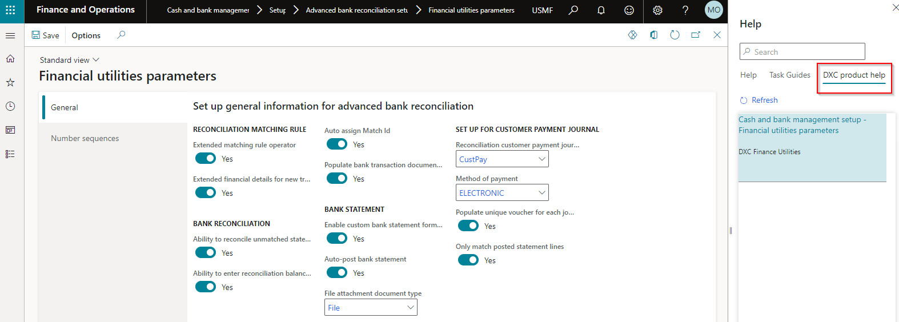

---
# required metadata

title: FINU
description: FINU - Roadmap
author: jdutoit2
manager: Kym Parker
ms.date: 2022-09-16
ms.topic: article
ms.prod: 
ms.service: dynamics-ax-applications
ms.technology: 

# optional metadata

# ms.search.form:  Release notes
audience: Application User
# ms.devlang: 
ms.reviewer: jdutoit2
# ms.tgt_pltfrm: 
# ms.custom: : ["21901", "intro-internal"]
ms.search.region: Global
# ms.search.industry: [leave blank for most, retail, public sector]
ms.author: helenho
ms.search.validFrom: 2016-05-31
ms.dyn365.ops.version: AX 7.0.1
---

# 	Roadmap / Release schedule

This page describes the features planned for future releases and planned release dates.

> Note: Dates and features are subject to change.

## Release schedule

Release			    | ETA
:--			        |:--
2023-01         | 31 January 2023

## Next release
ETA: 31 January 2023

The planned features are grouped by category.

### General
GitHub Help in D365  

## Deprecate
The following is planned to be deprecated

- Nothing scheduled to be deprecated
