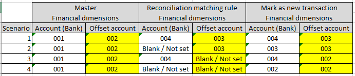
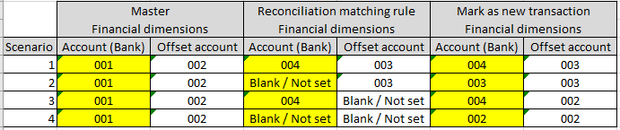

---
# required metadata

title: Finance Utilities
description: Cash and bank management setup - Bank reconciliation matching rules
author: jdutoit2
manager: Kym Parker
ms.date: 2022-10-19
ms.topic: article
ms.prod: 
ms.service: dynamics-ax-applications
ms.technology: 

# optional metadata

ms.search.form:  BankReconciliationMatchRule
audience: Application User
# ms.devlang: 
ms.reviewer: jdutoit2

# ms.tgt_pltfrm: 
# ms.custom: ["21901", "intro-internal"]
ms.search.region: Global
# ms.search.industry: [leave blank for most, retail, public sector]
ms.author: helenho
ms.search.validFrom: 2016-05-31
ms.dyn365.ops.version: AX 7.0.1
---

# Advanced bank reconciliation functionality
The fields as described in the following subsections are available to control the additional functionality for advanced bank reconciliation.

## Setup
## Bank Reconciliation Matching Rules

### Copy matching rule
User can select an existing rule, select **Copy matching rule** on the Action Pane to create a copy of the existing rule.
User can then edit the new rule and activate.

### Group by document number

D365 standard does not have the capability to match one transaction in the bank statement to multiple transactions in the D365 Bank Transactions that have the same **Journal id** or **Cheque number**. This Finance utilities functionality extends the automatic reconciliation matching rules by adding **Group by document number** to Reconciliation matching rules with Action **Match with bank statement** in 'Step 1: Define the matching rule'.

The feature can be activated from **Cash and bank management > Setup > Advanced bank reconciliation setup > Reconciliation matching rules**

| Field | Description |
|-|-|
| **Group by document number** | This feature combines the D365 bank transactions amount that have the **same Document number** (populated with the Journal id or check number) during the Bank reconciliation process, from **Run matching rules.** |

### Matching Parameter - Included In
If the **Financial utilities parameter**'s **Extended matching rule operator** is set to _Yes_, the option **Included in** is available for selection in 'Step 1: Define the matching rule'. 

When the Operator **Included in** is selected, D365 checks whether the value of **Field** is included in the value of the **Statement fields**.

-	**Contains** (which is STD) means that the field Payment Reference in D365 _contains_ the value of the Payment reference in the Bank File.
-	**Included in** heading means that the field Payment Reference in D365 is _included as a part of the value_ of the Payment reference in the Bank File.

**Included in** example:

|    Basic Criteria   |    Yes or No   |
|-|-|
|   Match Amount  |  Yes  |
|   Match Date  |  Yes  |
|   Match Document Number  |  No  |
|   Match Transaction Type  |  No  |
|   Match Payment Reference |  No  |

|    Field   |    Operator   |    Included in   |    Value   |    Statement Fields   |
|-|-|-|-|-|
|   Payment reference  |  Contains  |  Tick  |    |  Document number  |

|    Source              |   Matched   | Booking Date |   Debit   |   Credit   |   Bank Trx Type  |   Document number      |
|-                       |:-:          |-             |-          |-           |-                 |-                       |
| **D365 Bank Trx**      |             |              |           |            |                  |                        |
| Line 1                 | X           |  14/01/2018  |           | 1000       | 01               | **AAU1367611**         |
| Line 2                 |             |  14/01/2018  |           | 1000       | 01               | AAU1367612             |
| **Bank Statement Trx** |             |              |           |            |                  |                        |
| Line 1                 | X           |  14/01/2018  |           | 1000       | 699              | CBA pmt **AAU1367611** |
| Line 2                 |             |  14/01/2018  |           | 1000       | 699              | CBA pmt AAU1367613     |

In this example, when the above Reconciliation Matching rule is run, D365 Bank Transactions Line 1 will be matched with Bank Statement Transactions Line 1 because the **Document number** value “AAU1367611” is included in the value of the field Reference No “CBA pmt AAU1367611”.

### Mark as New - Additional defaults

If the **Financial utilities parameter**'s **Extended financial details for new transaction** parameter is set to _Yes_, the option to capture the following details automatically for **Mark as new** bank statement lines can be selected.
-	Offset account type (Ledger, Customer, Vendor or Bank) and details
-	Financial dimensions - For Account (Bank) and/or Offset account 
-	GST

More detail for ** fields are discussed [here](#customer-payment-and-settle-of-invoice-11).

|    Field / Button   |    Description   |
|-|-|
| **Financial Dimensions > Offset account**  |  Financial dimensions that have to be used to post the _new_ transactions.   If the dimensions are filled in, it will override the financial dimensions set by default on the selected Offset account (Ledger, Customer, Vendor or Bank).   Else, financial dimensions set by default on the selected main account will apply with the new transaction.   |
| **Financial Dimensions > Account**  |  Financial dimensions that have to be used to post the _new_ transactions.   If the dimensions are filled in, it will override the financial dimensions set by default on the selected Account (Bank).   Else, financial dimensions set by default on the selected main account will apply with the new transaction.   |
| **Offset Company Account**  | Defaults to the current legal entity.   Populates the new field Offset Company Account in the Bank Statement Line Details form when a **Mark as new** line is created.           |
| **Offset Account type**   | Populates the new field Offset Account Type in the Bank Statement Line Details form when a **Mark as new** line is created.   Note: This field defaults to Ledger; Extended financial details only support offset account type _Ledger_, _Customer_ and _Vendor_.          |
| **Offset Account**   |  Populates the new field Offset Account in the Bank Statement Line Details form when a **Mark as new** line is created.   |
**Offset account bank statement field** **	| Enabled when **Offset account type** is set to _Customer_. Option to map a field from the bank statement for Offset account. **Offset account** needs to be _blank_, will receive error if try to populate both when setting up a rule.
**Settle transaction** **	| Enabled when **Offset account type** is set to _Customer_. When creating the customer payment journal for the customer, should it attempt to settle the invoice.
**Settle transaction bank statement field** **	| Enabled when **Offset account type** is set to _Customer_. Option to map a field from the bank statement for the transaction (invoice) to be settled in the customer receipt journal
**Auto-post customer payment journal** **	| Enabled when **Offset account type** is set to _Customer_. Indicates if the created (and settled if applicable) customer receipt journal should automatically be posted. If automatically posted, the newly created bank transaction(s) will also automatically be matched to the applicable bank statement lines. 
| **GST Group**   |  Populates the field GST group in the Bank Statement Line Details form when a **Mark as new** line is created.   |
| **Item GST Group**    |  Populates the field Item GST group in the Bank Statement Line Details form when a **Mark as new** line is created   |

### Customer payment and settle of invoice (1:1)
#### Reconciliation matching rules
This section will provide more details for ** fields from above section.
Finance utilities allows for creating and optional settling of one invoice and optional posting of customer payment journal. One customer payment journal is created for all the bank statement lines matched with the mark as new rule. For improved traceability the Reconcile ID is populated in the Customer receipt’s journal Document on the journal’s setup tab.

The following subsection will discuss scenarios when running a Mark as new rule with **Offset account type** set to _Customer_
-	**Offset account** is set to a specific customer account, or **Offset account bank statement field** is set to use a field from the bank statement field (example Trading partner):
    - Target: **Account** in Customer payment journal line
-	**Settle transaction** determines if the created/posted customer receipt journal should attempt to settle an invoice:
    - **Yes** - Uses **Settle transaction bank statement field**’s mapping to find the D365 invoice number in the bank statement line and populate the **Invoice** field in the Customer payment journal line. If the invoice can’t be settled in the journal line, the infolog will provide a warning which invoices couldn’t be settled.
    - **No** - The customer payment journal line will not attempt to settle an invoice; **Invoice** field will be blank in the Customer payment journal line. 
-	**Settle transaction bank statement field** - Set which field from the bank statement will contain the D365 invoice (example Document number or Reference No.)
    - Target: **Invoice** in Customer payment journal line, if **Settle transaction** is set to _Yes_.	
- **Auto-post customer payment journal**: 
    - **Yes** - The customer receipt journal will be posted and automatically matched with the bank statement lines. A Match Id will be assigned for all the transactions and moved to matched on the Bank reconciliation worksheet when running the rule.
    - **No**: The customer receipt journal will only be created. Once the user has reviewed and posted the customer payment journal, refresh the bank reconciliation’s worksheet to bring in the new bank transactions. User has to either use a match with bank statement rule or manually match the applicable bank statement lines with these new bank transactions.

##### Field format
The ability to set field format is available for the following two fields:
- Offset account bank statement field
- Settle transaction bank statement field

Select the **Field format** for the applicable field and set one of the following options:
- **No format** - The bank statement field will be used as-is.
- **Fixed field position** - Set **Start position** and **Length**.
- **Delimited field position** - Set **Delimiter** (default is space) and **Field position**.
- **Custom format** - Ability to use a [regex](https://regex101.com/) format

The **Example** and **Value** field is automatically updated based on above selection.
The user can also paste/type their own example into Example to view the resulted Value from their setup.

Example result for each option:

Option	  	| Setup             | Example   Bank statement field's original data	  | Value
:--       	|:--                |:--                                                  |:--
**No format**  |                 | xxUS-001xx                      | xxUS-001xx
**Fixed field position**        | Start position: 2   Length: 6  | xxUS-001xx        | US-001
**Delimited field position**    | Delimiter:    Field position   | US-001 extra description  | US-001
**Custom format**               | \\**(.+)\\**                          | \**US-001\**         | US-001

#### Financial utilities parameters
Additional setup is also required on [Financial utilities parameters](Finance-utilities-parameters.md) to assign the following:
- Reconciliation customer payment journal name
- Method of payment

#### General ledger parameters
If Financial utilities parameter **Populate unique voucher for each journal line** is set to _No_, it is also required to configure General ledger parameters.
When the system creates a customer payment journal for the bank statement transaction, the one voucher could contain lines for multiple customers. Therefore, you must set up your system so that a single voucher can have multiple customer lines.

To enable a single voucher to have multiple customer lines, follow these steps.
1.	Go to **General ledger > Ledger setup > General ledger parameters**.
2.	On the Ledger tab, on the General FastTab, set the Allow multiple transactions within one voucher option to Yes.
3.	If you receive a warning message, select Close to accept the change.

#### Possible processing issues:
-	Warning log: ‘Account % does not exist’
If the customer account can’t be found in D365, the bank statement line will be excluded from the customer receipt journal and the transactions won’t automatically match in the bank recon since the total values don’t match. 
-	Warning log: ‘Invoice % doesn’t exist’
If the recon matching rule is set to settle the invoice and the invoice can’t be found in D365, the customer receipt journal line will still be created without field Invoice being populated.
