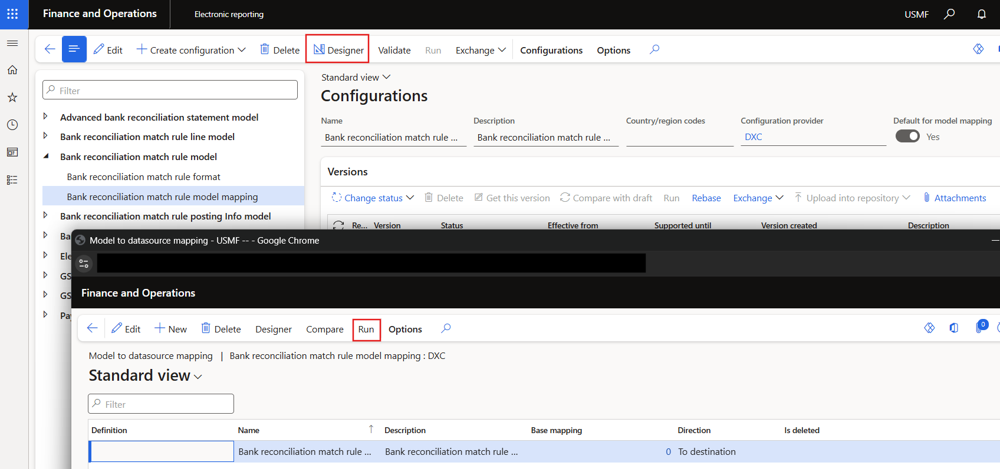

---
# required metadata

title: Finance Utilities
description: Cash and bank management setup - Modern bank reconciliation
author: Monica du Toit
manager: Pontus Ek
ms.date: 2025-09-03
ms.topic: article
ms.prod: 
ms.service: dynamics-ax-applications
ms.technology: 

# optional metadata

ms.search.form:  BankReconciliationMatchRule, SAB_FinUtilParameters
audience: Application User
# ms.devlang: 
ms.reviewer: Monica du Toit

# ms.tgt_pltfrm: 
# ms.custom: ["21901", "intro-internal"]
ms.search.region: FinanceUtilFeature
# ms.search.industry: [leave blank for most, retail, public sector]
ms.author: Monica du Toit
ms.search.validFrom: 2016-05-31
ms.dyn365.ops.version: AX 7.0.1
---

# Modern bank reconciliation migration

Modern bank reconciliation includes major changes to Reconciliation matching rules.  
**Mark new transaction** rules have been replaced by new actions as described in more detail [here](Modern-bank-reconciliation.md) .

Currently the standard **Reconciliation matching rules** data entity doesn't support Modern bank reconciliation new actions.  
Interim option for migration is to either manually create/change the **Mark new transaction** rules to the new actions, or use Electronic reporting to create these new Reconciliation matching rules.  
The following sections will describe the Electronic reporting import option.

> Note: After enabling the **Modern bank reconciliation** feature, running the standard **Cash and bank management > Setup > Advanced bank reconciliation setup > Advanced bank reconciliation data upgrade** will **DELETE** all remaining **Mark new transaction** reconciliation matching rules. It is thus important to ensure all required rules have been migrated before running this upgrade.

> Note: The Electronic reporting import option is only provided as **interim** solution and clients would need to map any additional fields including financial dimensions.
> The Electronic reporting configuration files will be published on the Finance Utilities LCS solution.

# Overview

### Tables

Modern bank reconciliation rules are stored in the following tables:

- BankReconciliationMatchRule - Shared across legal entities
- BankReconciliationMatchRuleLine - Step 1 - Shared across legal entities
- BankReconciliationMatchRule_PostingInfo - Step 2/3 - Legal entity specific offset details

### Electronic reporting configurations

Electronic reporting consists out of the following configurations: 

1. Bank reconciliation match rule model
2. Bank reconciliation match rule line model
3. Bank reconciliation match rule posting Info model

<ins>Fields per table / configuration</ins>

Table : Bank Reconciliation  match rule (BankReconciliationMatchRule)
1.	Rule Id
2.	Name
3.  	IsActive
4.	MatchActionType
5.	Search Matching Entry 
6.	Matching Type
7.	Require Manual Matching

Table : Bank reconciliation match rule line (Step 1 & Step 2) (BankReconciliationMatchRuleLine)
1.	Rule Id
2.	Compare Field String
3.	Compare Field ID
4.	Field ID
5. 	Line Num
6.	Line Type
7. 	Operator
8. 	Source Table ID
9.	Value
10. 	Offset Account Pattern

Table : Bank reconciliation match rule posting Info (BankReconciliationMatchRule_PostingInfo)
1.	Rule ID
2.	Legal Entity
3.	Bank Transaction Type
4.	Transaction Text
5.	Offset Account Type
6.	Offset Company
7.	Customer Account
8.	Vendor Account
9.	Automatic Customer Account Matching
10.	Account date type
11.	Method of payment
12.	Sales Tax Group
13.	Item Sales Tax Group
14.	Prepayment Journal Voucher
15.	Posting Profile
16.	Post

### Import process

After creating the three csv files (without headers), the files can be imported via the **Run** option on the mapping configuration.

Example import files: 

Example Excel file for each action: 

### Offset type Ledger

Following Finance utilities fields are replaced with Modern bank reconciliation:

**Finance utilities field**    | **Table.Field**   | **Modern bank reconciliation replacement**                
:-------                       |:-------           |:-------                 
<ins>**Reconciliation matching rules**</ins> | 
Action 'Mark new transactions' | BankReconciliationMatchRule.MatchActionType               | Action 'Generate voucher'
Offset account   | BankReconciliationMatchRule.SAB_FinOffsetLedgerDimension  |
Tax group                      |  | Std has added to 'Generate voucher'. Where the offset company is intercompany, Finance utilities tax field is enabled and will provide intercompany tax options.
Item tax group                 |  | Std has added to 'Generate voucher'. Where the offset company is intercompany, Finance utilities tax field is enabled and will provide intercompany tax options.
Financial dimensions           |  | Replaced with std.

Following Finance utilities fields are still used with Modern bank reconciliation: 

**Finance utilities field**    | **Table.Field**  
:-------                       |:------- 
Offset type | BankReconciliationMatchRule.SAB_FinOffsetAccountType | 

### Offset type Bank

Following Finance utilities fields are replaced with Modern bank reconciliation:

**Finance utilities field**  | **Table.Field**  | **Modern bank reconciliation replacement**                
:-------    |:------- |:-------                         
<ins>**Reconciliation matching rules**</ins> | 
Action 'Mark new transactions'  | BankReconciliationMatchRule.MatchActionType              | Action 'Generate voucher'
Financial dimensions            |   | Replaced with std.

Following Finance utilities fields are still used with Modern bank reconciliation: 

**Finance utilities field**    | **Table.Field**  
:-------                       |:------- 
Offset type (BankReconciliationMatchRule.SAB_FinOffsetAccountType)

### Offset type Vendor

Following Finance utilities fields are replaced with Modern bank reconciliation:

**Finance utilities field**    | **Modern bank reconciliation replacement**                
:-------    |:-------                         
<ins>**Reconciliation matching rules**</ins> | 
Action 'Mark new transactions'  | BankReconciliationMatchRule.MatchActionType              | Action 'Generate vendor payment'
Offset account type 'Vendor'                  | Not required
Financial dimensions                          | Replaced with std.

### Offset type Customer

Following Finance utilities fields are replaced with Modern bank reconciliation:

**Finance utilities field**    | **Modern bank reconciliation replacement**                
:-------    |:-------                         
<ins>**Financial utilities parameters**</ins> | 
Reconciliation customer payment journal       | Bank accounts - Customer payment journal            
Method of payment                             | Reconciliation matching rules - Step 3 Default method of payment
<ins>**Reconciliation matching rules**</ins> | 
Action 'Mark new transactions'   | BankReconciliationMatchRule.MatchActionType             | Action 'Generate customer payment' or 'Settle customer invoice'
Offset account type 'Customer'                | Not required
Offset account                                | For Fixed customer accounts use Step 3 - Automatic customer account matching set to _No_ and populate 'Customer account'
Offset account bank statement field           | For finding Customer account within a bank statement field: 'Step 2 (Optional): Identify customer account through invoice matching / Match open invoices' use 'Customer invoice field' set to **Customer account**.
Offset account reference bank statement field  | For finding Customer account using Finanance utilites 'Customer reference' within a bank statement field: In 'Step 2 (Optional): Identify customer account through invoice matching / Match open invoices' use 'Customer invoice field' set to **Reference number**. 
Settle transaction                            | Not required - utilise Action 'Settle customer invoice' where an invoice needs to be settled. Note: Settle customer invoice action will create one customer payment journal per bank statement line, so only use this action where an invoice will be settled.
Settle transaction bank statement field        | For finding Customer account based on Invoice/Invoice to settle within a bank statement field: In 'Step 2 (Optional): Identify customer account through invoice matching / Match open invoices' use 'Customer invoice field' set to **Invoice**.
Auto-post customer payment journal &  Auto-post and transfer customer payment journal  | Replaced with new Finance utilities field in Step 3 called **Post** with three drop-down options:   •	Do not post   •	Post   •	Post and transfer.   Advised to use one of the post options as this will also automatically match the newly posted bank transaction to the matching bank statement record. Where 'Do not post' is used, it will only create the customer payment journal, not post it and thus not match to the bank statement record.
Description mask                              | Enable feature 'Enable default descriptions for advanced bank reconciliation' and setup [Default descriptions](https://learn.microsoft.com/en-us/dynamics365/finance/cash-bank-management/apply-cash-adv-bank-rec#enable-default-descriptions-for-advanced-bank-reconciliation). Finance utilities will use the same default description on the intercompany transaction.
Financial dimensions                          | Replaced with std.

### Data entities

- Reconciliation matching rules

### Tables

- BankReconciliationMatchRule - Shared across legal entities
- BankReconciliationMatchRuleLine - Step 1 - Shared across legal entities
- BankReconciliationMatchRule_PostingInfo - Step 2 - Legal entity specific offset details
