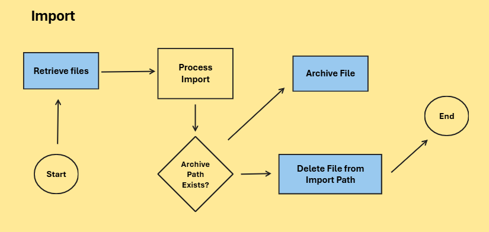
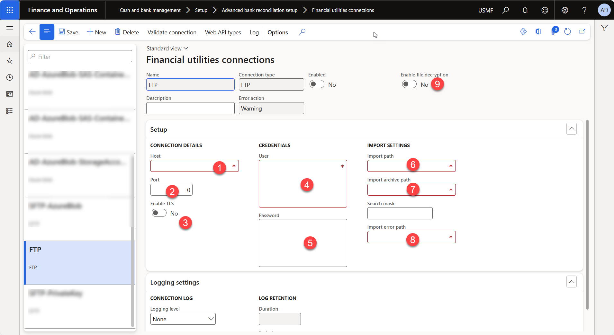
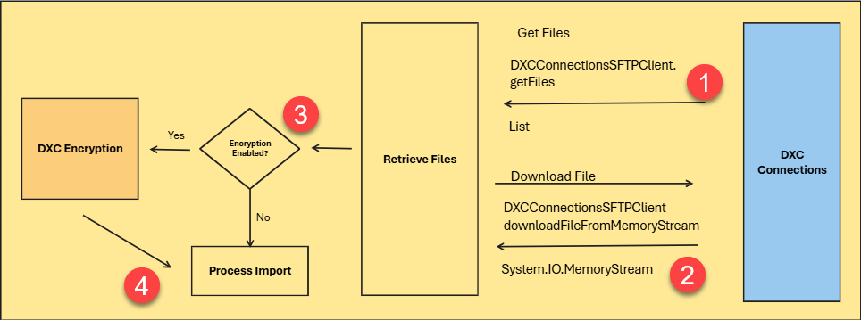
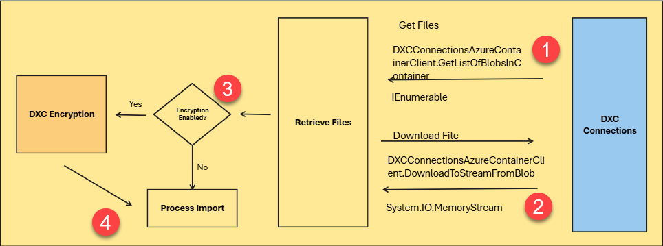
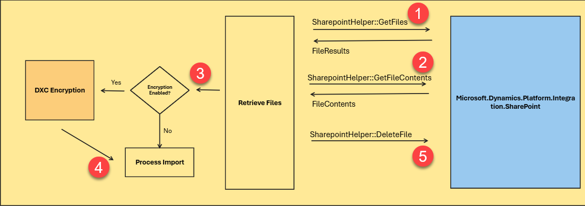
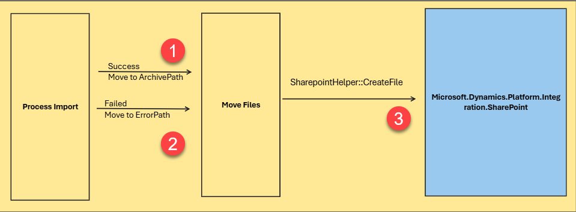
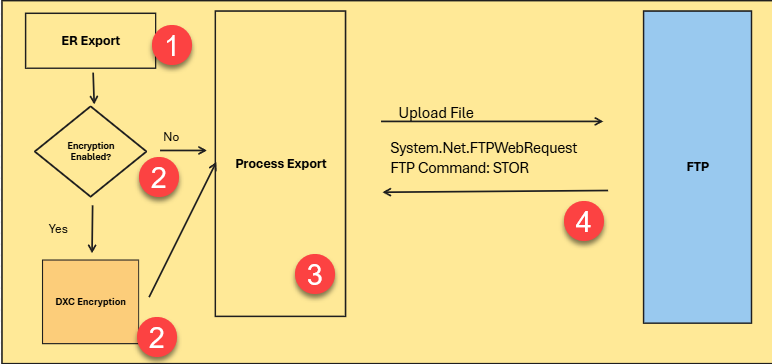
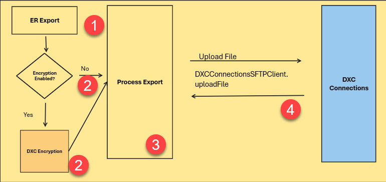
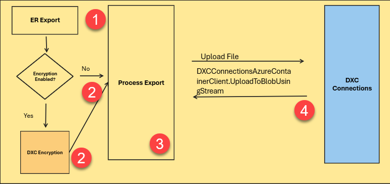
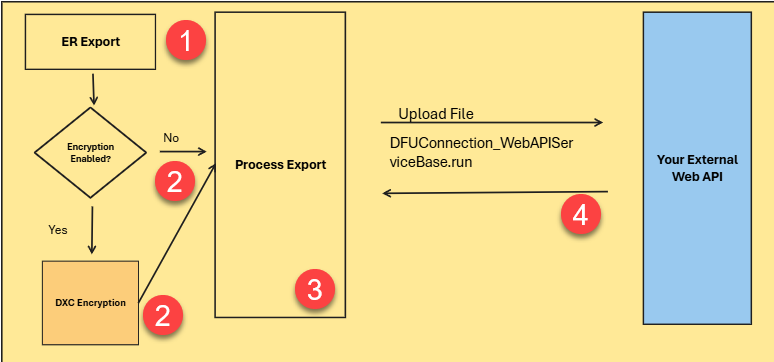

# Technical Architecture

## Import Process  
The following illustration describes the import process within DXC Finance Utilities.

Triggered by:
- Import bank statements via finance utilities connection
- Payment journal import (AR Utilities)

Legend   

External Service Connection
The following external connections is used by DXC Finance Utilities import process.
- File Transfer Protocol (FTP)
- Secured File Transfer Protocol (SFTP)
- Microsoft Azure Blob (AzureBlob)
- Sharepoint
- Web API

Note: For each connection type, DXC Finance Utilities only stores the credentials for authenticating against the external service to perform the following actions;
- Get list of files from the import path
- Download files from the import path
- Move files to specified error or archive path
- Remove files from import path if archive or error path is invalid

### File Transfer Protocol (FTP)

The following connection details are used by DXC Finance Utilities during the import process.

1. Host  
   FTP file server host URI excluding prefix, "ftp://"  
2. Port  
   FTP file server port number for connection
3. Enable TLS
   Enable SSL
4. User
   FTP username for authentication
5. Password
   FTP password for authentication
6. Import path
   Path within the file server where the import file can be retrieved from
7. Import archive path
   Path within the file server where the import file can be moved to after processing is successful
8. Import error path
   Path within the file server where the import file can be moved to after processing has failed
9. Enable file encryption  
   Decrypt downloaded file prior to processing 

Note: The FTP service will have to be hosted and managed by the customer, Finance utilities can only establish a connection using the provided credentials. Finance Utilities does not manipulate any information passed or retrieved during the communication. 
Libraries used in this case are all standard libraries available within Microsoft Dynamics 365 Finance and Supply Chain Management. DXC Finance Utilities is not making any additional modifications during the processing of the files.s

### Secured File Transfer Protocol (SFTP)
The following illustration describes how SFTP is used during the import process.

Note: The SFTP service will have to be hosted and managed by the customer, Finance utilities can only establish a connection using the provided credentials. Finance Utilities does not manipulate any information passed or retrieved during the communication.  
For more details on DXCConnections please review documentation available [here.](../../CONNECTIONS/Technical-Documentation.md)

### Microsoft Azure Blob (AzureBlob)
The following illustration describes how AzureBlob is used during the import process.

Note: The Azure Blob storage account will have to be hosted and managed by the customer, Finance utilities can only establish a connection using the provided credentials. Finance Utilities does not manipulate any information passed or retrieved during the communication.  
For more details on DXCConnections please review documentation available [here.](../../CONNECTIONS/Technical-Documentation.md)

### Sharepoint
The following illustration describes how Sharepoint is used during the import process.

Note: Microsoft.Dynamics.Platform.Integration.SharePoint and SharepointHelper are standard libraries and classes available within Microsoft Dynamics 365 Finance and Supply Chain Management. DXC Finance Utilities is not making any additional modifications during the processing of the files.

### Web API
The following illustration describes how Web API Endpoint is used during the import process.

Note: The API endpoint implementation needs to be managed by the customer as extensions. DXC Finance Utilities does not provide any pre-existing API endpoints. 

For more details on Web API please review documentation available [here.](./Web-API-Endpoint.md)

## Export Process
The following illustration describes the export process within DXC Finance Utilities.

Triggered by:
- GER Export
  

Legend   

External Service Connection
The following external connections is used by DXC Finance Utilities export process.
- File Transfer Protocol (FTP)
- Secured File Transfer Protocol (SFTP)
- Microsoft Azure Blob (AzureBlob)
- Web API

Note: For each connection type, DXC Finance Utilities only stores the credentials for authenticating against the external service to perform the following actions;
- Upload file to the specified export file path

### File Transfer Protocol (FTP)

### Secured File Transfer Protocol (SFTP)
The following illustration describes how SFTP is used during the export process.

Note: The SFTP service will have to be hosted and managed by the customer, Finance utilities can only establish a connection using the provided credentials. Finance Utilities does not manipulate any information passed or retrieved during the communication.  
For more details on DXCConnections please review documentation available [here.](../../CONNECTIONS/Technical-Documentation.md)

### Microsoft Azure Blob (AzureBlob)
The following illustration describes how AzureBlob is used during the export process.

Note: The Azure Blob storage account will have to be hosted and managed by the customer, Finance utilities can only establish a connection using the provided credentials. Finance Utilities does not manipulate any information passed or retrieved during the communication.  
For more details on DXCConnections please review documentation available [here.](../../CONNECTIONS/Technical-Documentation.md)

### Web API
The following illustration describes how Web API Endpoint is used during the import process.

Note: The API endpoint implementation needs to be managed by the customer as extensions. DXC Finance Utilities does not provide any pre-existing API endpoints. 

For more details on Web API please review documentation available [here.](./Web-API-Endpoint.md)
